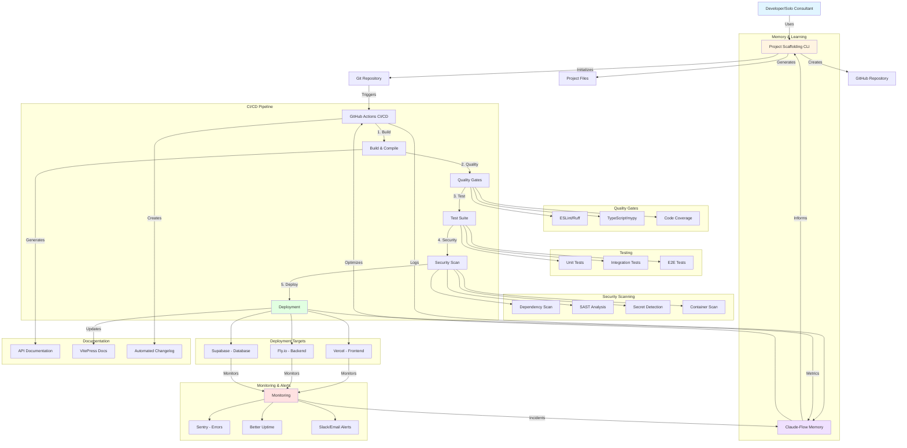
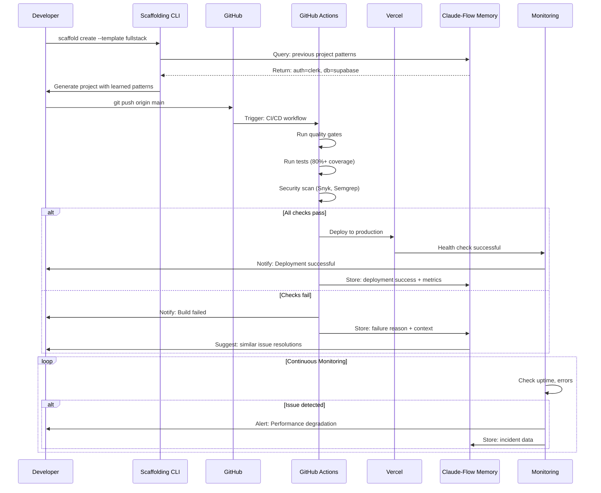
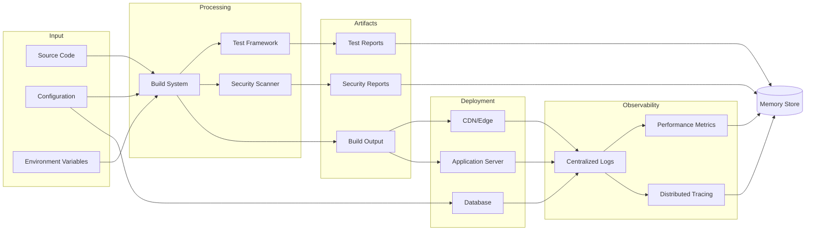
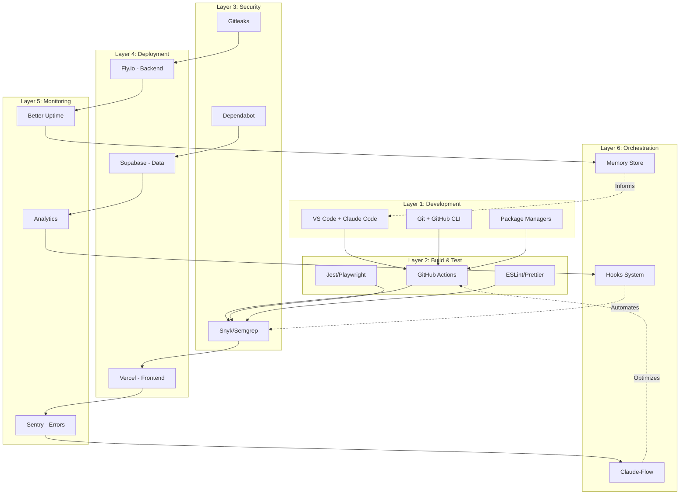
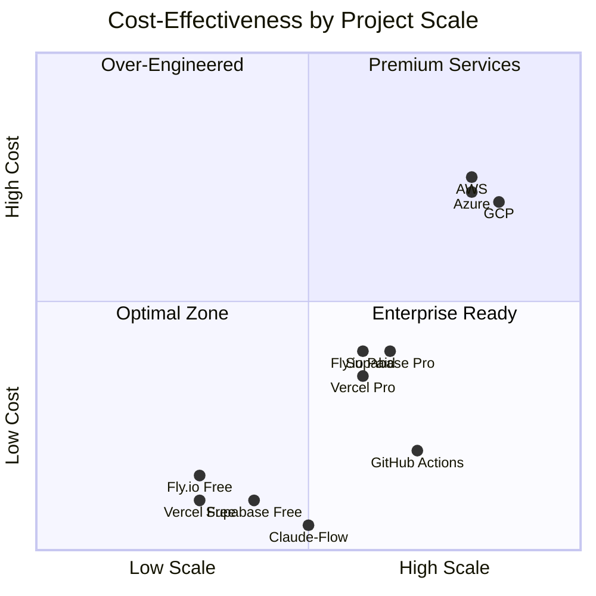
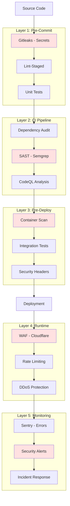
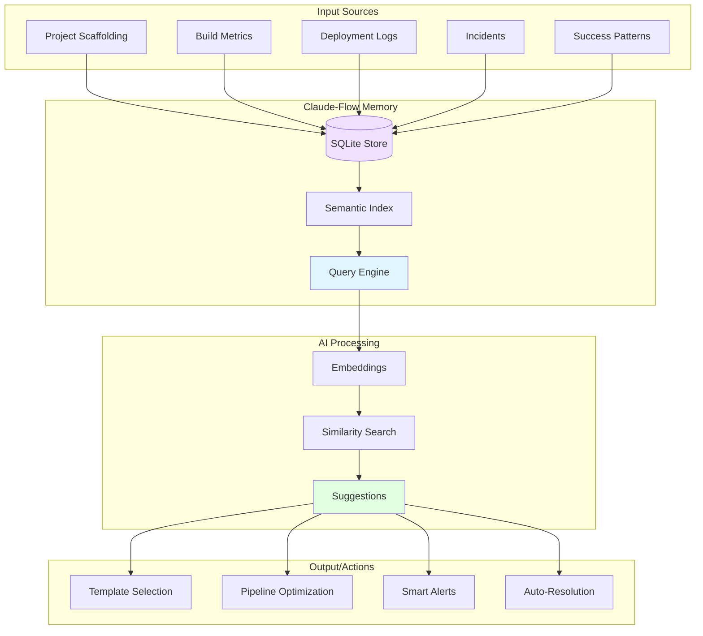
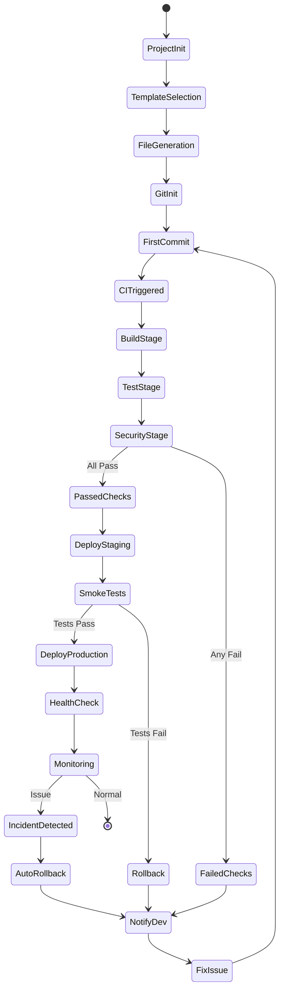
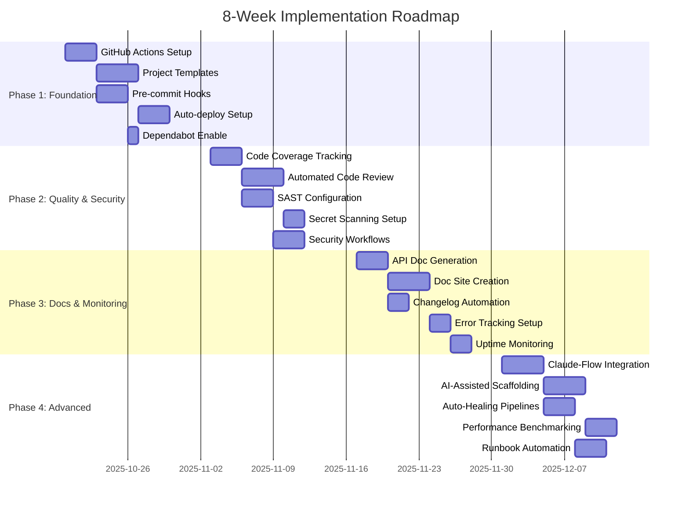

# Automated Build System - Visual Architecture

## System Overview Diagram

## Component Interaction Flow

## Data Flow Architecture

## Technology Stack Layers

## Cost vs. Scale Matrix

## Security Layers

## Memory System Architecture

## Workflow Automation

## Implementation Phases Timeline

---

## Diagram Notes

All diagrams above use Mermaid syntax and can be rendered in:
- GitHub markdown (native support)
- VitePress/Docusaurus (with plugin)
- VS Code (with Mermaid extension)
- Online: https://mermaid.live

For C4 model diagrams or more complex architecture views, consider:
- Structurizr (code-as-diagrams)
- Excalidraw (hand-drawn style)
- Lucidchart (collaborative diagramming)
