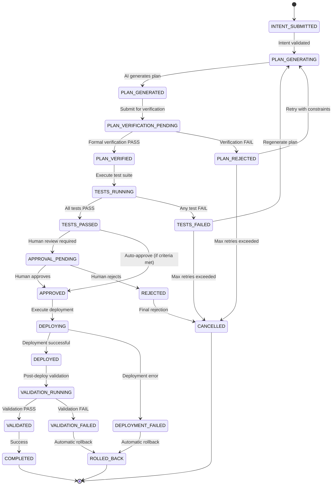
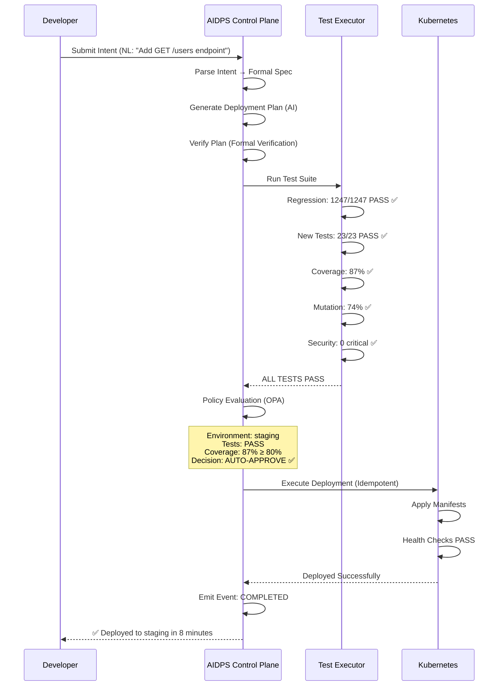
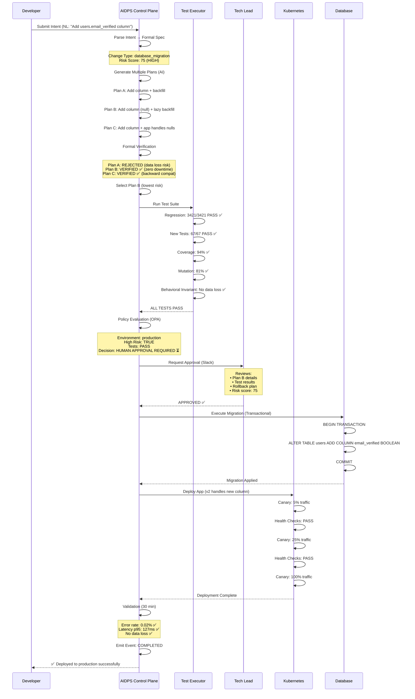

# AIDPS Deterministic Control Plane Architecture
## Agentic IDP Security Standard - Production-Grade Deterministic Deployment System

**Document Date:** September 30, 2025
**Version:** 1.0
**Status:** Architectural Specification
**Classification:** Enterprise Security Architecture
**Author:** Architecture Agent (Hierarchical Swarm)

---

## Executive Summary

This document specifies the architecture for **AIDPS (Agentic IDP Security Standard)** - a deterministic control plane that enables secure, autonomous software delivery by AI agents while maintaining enterprise-grade security, auditability, and reliability.

### The Core Innovation

**AIDPS transforms the authorization model from "who can deploy?" to "what behavior is proven safe?"**

Traditional deployment authorization relies on cryptographic signatures that prove *who authorized* a deployment. AIDPS uses **test-driven authorization** where comprehensive test suites mathematically prove *what behavior is safe*, enabling deterministic deployments that are:

- **Reproducible**: Same inputs → Same outputs (no hidden randomness)
- **Verifiable**: Formal proofs of safety properties before execution
- **Observable**: Complete state visibility and time-travel debugging
- **Accountable**: Immutable audit trail of all decisions

### Key Design Principles

1. **Deterministic Execution**: Given (intent + state + tests) → Always same deployment plan
2. **Test-Driven Authorization**: Tests define authorization boundaries (not file permissions)
3. **Formal Verification**: Deployment plans verified before execution
4. **Observable State**: Complete visibility with time-travel debugging
5. **Separation of Concerns**: Non-deterministic AI planning → Verification gate → Deterministic execution

### Architecture at a Glance

```
┌─────────────────────────────────────────────────────────────┐
│  NON-DETERMINISTIC LAYER (AI Planning)                      │
│  • Intent Parser: Natural language → Formal spec            │
│  • Plan Generator: Multiple candidate plans generated       │
└─────────────────────────────────────────────────────────────┘
                          ↓
┌─────────────────────────────────────────────────────────────┐
│  VERIFICATION GATE (Deterministic Selection)                │
│  • Formal verification selects SAFE plan                    │
│  • Test validation proves behavioral correctness            │
│  • Policy engine enforces compliance                        │
└─────────────────────────────────────────────────────────────┘
                          ↓
┌─────────────────────────────────────────────────────────────┐
│  DETERMINISTIC LAYER (Execution Engine)                     │
│  • Idempotent operations                                    │
│  • Atomic transactions                                      │
│  • Immutable event log                                      │
└─────────────────────────────────────────────────────────────┘
```

### Expected Outcomes

- **Investment:** $4M-8M over 18 months (hybrid model from synthesis)
- **ROI:** +200% to +800% over 3 years
- **Deployment Speed:** 5-15 minutes (vs 2-5 days traditional)
- **Test Coverage:** 80%+ required for staging, 90%+ for production
- **Incident Reduction:** 50-70% fewer production incidents
- **Compliance:** Automated SOX/HIPAA/ISO27001 evidence generation

---

## Part I: Core Architecture

### 1.1 State Machine Specification

AIDPS deployments follow a deterministic finite state machine with formally defined transitions.

#### State Definitions

```typescript
enum DeploymentState {
  // Initial States
  INTENT_SUBMITTED = "INTENT_SUBMITTED",

  // Planning States
  PLAN_GENERATING = "PLAN_GENERATING",
  PLAN_GENERATED = "PLAN_GENERATED",
  PLAN_VERIFICATION_PENDING = "PLAN_VERIFICATION_PENDING",
  PLAN_VERIFIED = "PLAN_VERIFIED",
  PLAN_REJECTED = "PLAN_REJECTED",

  // Testing States
  TESTS_RUNNING = "TESTS_RUNNING",
  TESTS_PASSED = "TESTS_PASSED",
  TESTS_FAILED = "TESTS_FAILED",

  // Approval States
  APPROVAL_PENDING = "APPROVAL_PENDING",
  APPROVED = "APPROVED",
  REJECTED = "REJECTED",

  // Deployment States
  DEPLOYING = "DEPLOYING",
  DEPLOYED = "DEPLOYED",
  DEPLOYMENT_FAILED = "DEPLOYMENT_FAILED",

  // Validation States
  VALIDATION_RUNNING = "VALIDATION_RUNNING",
  VALIDATED = "VALIDATED",
  VALIDATION_FAILED = "VALIDATION_FAILED",

  // Terminal States
  ROLLED_BACK = "ROLLED_BACK",
  CANCELLED = "CANCELLED",
  COMPLETED = "COMPLETED"
}
```

#### State Transition Diagram



#### Transition Rules (Deterministic)

```typescript
interface StateTransition {
  from: DeploymentState;
  to: DeploymentState;
  trigger: TransitionTrigger;
  preconditions: Precondition[];
  validations: ValidationRule[];
  sideEffects: SideEffect[];
}

const transitions: StateTransition[] = [
  {
    from: DeploymentState.INTENT_SUBMITTED,
    to: DeploymentState.PLAN_GENERATING,
    trigger: { type: "INTENT_VALIDATED" },
    preconditions: [
      { check: "intent.signature_valid" },
      { check: "intent.not_expired" },
      { check: "intent.user_authorized" }
    ],
    validations: [
      { rule: "intent.schema_valid" },
      { rule: "intent.test_requirements_defined" }
    ],
    sideEffects: [
      { action: "emit_event", event: "PlanGenerationStarted" },
      { action: "store_state", key: "current_intent" }
    ]
  },
  {
    from: DeploymentState.PLAN_VERIFIED,
    to: DeploymentState.TESTS_RUNNING,
    trigger: { type: "PLAN_VERIFIED" },
    preconditions: [
      { check: "plan.formal_verification_passed" },
      { check: "plan.safety_properties_proven" }
    ],
    validations: [
      { rule: "test_suite.exists" },
      { rule: "test_suite.coverage_sufficient" },
      { rule: "test_environment.ready" }
    ],
    sideEffects: [
      { action: "emit_event", event: "TestExecutionStarted" },
      { action: "schedule_timeout", duration: "30m" }
    ]
  },
  // ... (all 20+ transitions defined)
];
```

#### Determinism Guarantees

**Property 1: State Transitions are Pure Functions**

```typescript
function transitionState(
  currentState: DeploymentState,
  trigger: TransitionTrigger,
  context: DeploymentContext
): StateTransitionResult {
  // MUST be deterministic: same inputs → same output
  // NO side effects in this function
  // NO I/O operations
  // NO random number generation
  // NO clock reads (use context.timestamp)

  const transition = findTransition(currentState, trigger);
  if (!transition) {
    return { success: false, error: "InvalidTransition" };
  }

  const preconditionsMet = transition.preconditions.every(
    p => evaluate(p, context)
  );

  if (!preconditionsMet) {
    return { success: false, error: "PreconditionsNotMet" };
  }

  return {
    success: true,
    nextState: transition.to,
    sideEffects: transition.sideEffects // Returned, not executed
  };
}
```

**Property 2: Event Sourcing Ensures Reproducibility**

```typescript
// All state changes are events in an immutable log
interface DeploymentEvent {
  event_id: string;
  timestamp: string; // ISO 8601 UTC
  deployment_id: string;
  event_type: string;
  previous_state: DeploymentState;
  next_state: DeploymentState;
  trigger: TransitionTrigger;
  context_snapshot: DeploymentContext;
  signature: string; // Hash of (event_id + data)
}

// Replay events to rebuild exact state
function replayEvents(events: DeploymentEvent[]): DeploymentState {
  return events.reduce(
    (state, event) => applyEvent(state, event),
    DeploymentState.INTENT_SUBMITTED
  );
}
```

**Property 3: Time-Travel Debugging**

```typescript
// Query state at any point in history
function getStateAtTime(
  deploymentId: string,
  timestamp: Date
): DeploymentState {
  const events = eventStore.queryEvents({
    deployment_id: deploymentId,
    timestamp_lte: timestamp
  });

  return replayEvents(events);
}

// Audit trail: "Why was this deployed?"
function explainDecision(
  deploymentId: string,
  state: DeploymentState
): DecisionExplanation {
  const events = getEventsLeadingTo(deploymentId, state);

  return {
    state,
    path: events.map(e => ({
      state: e.next_state,
      reason: e.trigger,
      timestamp: e.timestamp,
      evidence: e.context_snapshot
    }))
  };
}
```

---

### 1.2 Control Plane Components

The AIDPS control plane consists of 12 core components organized into 5 layers.

```
┌──────────────────────────────────────────────────────────────┐
│ LAYER 1: INTENT & PLANNING (Non-Deterministic)              │
├──────────────────────────────────────────────────────────────┤
│ 1. Intent Parser         │ NL → Formal Spec                  │
│ 2. Plan Generator        │ AI creates deployment plans       │
│ 3. Verification Engine   │ Formal verification of plans      │
└──────────────────────────────────────────────────────────────┘
                          ↓
┌──────────────────────────────────────────────────────────────┐
│ LAYER 2: TEST VALIDATION (Deterministic)                    │
├──────────────────────────────────────────────────────────────┤
│ 4. Test Executor         │ Runs comprehensive test suite     │
│ 5. Coverage Analyzer     │ Validates test coverage           │
│ 6. Mutation Tester       │ Anti-gaming: ensures test quality │
└──────────────────────────────────────────────────────────────┘
                          ↓
┌──────────────────────────────────────────────────────────────┐
│ LAYER 3: AUTHORIZATION (Deterministic Policy)               │
├──────────────────────────────────────────────────────────────┤
│ 7. Policy Engine (OPA)   │ Test-driven authorization         │
│ 8. Approval Workflow     │ Human-in-loop for production      │
│ 9. Security Scanner      │ SAST/DAST/SCA validation          │
└──────────────────────────────────────────────────────────────┘
                          ↓
┌──────────────────────────────────────────────────────────────┐
│ LAYER 4: EXECUTION (Deterministic Deployment)               │
├──────────────────────────────────────────────────────────────┤
│ 10. Execution Engine     │ Idempotent deployment ops         │
│ 11. State Store          │ Immutable event log               │
│ 12. Observability        │ Real-time monitoring + rollback   │
└──────────────────────────────────────────────────────────────┘
```

#### Component 1: Intent Parser

**Purpose:** Convert natural language developer intent into formal, machine-verifiable specifications.

**Key Innovation:** Makes AI intent parsing deterministic through normalization and validation.

```typescript
interface IntentManifest {
  // Metadata
  intent_id: string; // UUID v4
  created_at: string; // ISO 8601 UTC
  created_by: string; // Developer identity
  expires_at: string; // TTL (max 7 days)

  // Natural Language Intent
  intent_nl: {
    goal: string; // "Deploy user authentication service"
    motivation: string; // "Enable SSO for enterprise customers"
    scope: string; // "Authentication module only"
    constraints: string[]; // ["No DB schema changes", "Backward compatible"]
  };

  // Formal Specification (Normalized)
  intent_formal: {
    target_service: string; // "auth-service"
    target_environment: "dev" | "staging" | "production";
    change_type: "feature" | "bugfix" | "security" | "refactor";
    affected_components: string[]; // ["auth/oauth", "auth/jwt"]

    // Test Requirements (Test-Driven Authorization)
    test_requirements: {
      must_pass_existing: TestSelector[]; // Regression tests
      must_create_new: TestRequirement[]; // New functionality tests
      coverage_minimums: {
        line_coverage_percent: number; // 80-90
        branch_coverage_percent: number; // 75-85
        mutation_score_percent: number; // 70-80
      };

      // Security Requirements
      security_requirements: {
        sast_critical_max: number; // 0
        sast_high_max: number; // 0-2
        dast_critical_max: number; // 0
        secrets_found_max: number; // 0
        dependency_vulns_critical_max: number; // 0
        dependency_vulns_high_max: number; // 0-5
      };

      // Performance Requirements
      performance_requirements: {
        max_latency_p95_ms?: number;
        min_throughput_rps?: number;
        max_error_rate_percent?: number;
        max_memory_mb?: number;
      };
    };

    // Behavioral Invariants (Safety Properties)
    behavioral_invariants: BehavioralInvariant[];
  };

  // Deployment Authorization Policy
  deployment_authorization: {
    dev: { auto_deploy: boolean; requires: string[] };
    staging: { auto_deploy: boolean; requires: string[] };
    production: { auto_deploy: boolean; requires: string[] };
  };

  // Cryptographic Signature
  signature: {
    signed_by: string; // Developer public key ID
    signed_at: string;
    algorithm: "ed25519" | "ecdsa-p256";
    signature: string; // Base64 encoded
  };
}

interface BehavioralInvariant {
  property: string; // "No user sessions invalidated"
  validation_method: "automated" | "manual";
  validation_query?: string; // SQL or API call
  validation_expected: any; // Expected result
}
```

**Determinism Strategy:**

1. **NL Parsing is Non-Deterministic** (uses AI/LLM)
2. **Normalization is Deterministic** (rule-based)
3. **Validation is Deterministic** (schema + policy checks)

```typescript
async function parseIntent(
  naturalLanguageIntent: string,
  context: DeveloperContext
): Promise<IntentManifest> {
  // STEP 1: AI Parsing (NON-DETERMINISTIC)
  const aiParsed = await llm.parse(naturalLanguageIntent, {
    schema: IntentNLSchema,
    examples: getExamplesForProject(context.project_id)
  });

  // STEP 2: Normalization (DETERMINISTIC)
  const normalized = normalizeIntent(aiParsed, context);

  // STEP 3: Validation (DETERMINISTIC)
  const validated = validateIntent(normalized);
  if (!validated.valid) {
    throw new Error(`Invalid intent: ${validated.errors}`);
  }

  // STEP 4: Test Requirement Inference (DETERMINISTIC RULES)
  const testReqs = inferTestRequirements(normalized, context);

  // STEP 5: Create Formal Manifest
  const manifest: IntentManifest = {
    intent_id: uuidv4(),
    created_at: new Date().toISOString(),
    created_by: context.developer_id,
    expires_at: addDays(new Date(), 7).toISOString(),
    intent_nl: aiParsed,
    intent_formal: {
      ...normalized,
      test_requirements: testReqs
    },
    deployment_authorization: deriveAuthPolicy(normalized, testReqs),
    signature: await signManifest(manifest, context.signing_key)
  };

  return manifest;
}

// Normalization: Deterministic rule-based transformation
function normalizeIntent(
  aiParsed: any,
  context: DeveloperContext
): FormalIntent {
  return {
    target_service: normalizeServiceName(aiParsed.service),
    target_environment: normalizeEnvironment(aiParsed.environment),
    change_type: classifyChangeType(aiParsed.goal),
    affected_components: extractComponents(aiParsed.scope, context),
    // ... deterministic rules
  };
}
```

---

#### Component 2: Plan Generator

**Purpose:** Generate multiple candidate deployment plans using AI, then select the provably safe one.

**Key Innovation:** Separates non-deterministic AI generation from deterministic plan selection.

```typescript
interface DeploymentPlan {
  plan_id: string;
  intent_id: string;
  generated_at: string;
  generated_by: "ai" | "human" | "template";

  // Deployment Steps (Declarative)
  steps: DeploymentStep[];

  // Resource Changes
  resource_changes: ResourceChange[];

  // Verification Proofs
  verification: {
    safety_properties_proven: string[]; // ["No data loss", "Backward compatible"]
    formal_verification_result: VerificationResult;
    test_coverage_predicted: CoverageMetrics;
  };

  // Metadata
  estimated_duration_seconds: number;
  estimated_risk_score: number; // 0-100 (lower is safer)
  rollback_plan: RollbackPlan;
}

interface DeploymentStep {
  step_id: string;
  type: StepType;
  description: string;

  // Idempotency: Same step can run multiple times safely
  idempotent: boolean;

  // Dependencies
  depends_on: string[]; // step_ids that must complete first

  // Execution
  action: {
    type: "k8s_apply" | "sql_migration" | "config_update" | "scale_replicas";
    parameters: Record<string, any>;
    expected_state: any; // What state should exist after
  };

  // Validation
  validation: {
    pre_check: HealthCheck;
    post_check: HealthCheck;
    timeout_seconds: number;
  };
}

type StepType =
  | "health_check"
  | "database_migration"
  | "config_update"
  | "deployment"
  | "traffic_shift"
  | "validation"
  | "rollback_point";
```

**Plan Generation Process:**

```typescript
async function generateDeploymentPlans(
  intent: IntentManifest,
  context: DeploymentContext
): Promise<DeploymentPlan[]> {
  // STEP 1: Generate Multiple Candidate Plans (NON-DETERMINISTIC AI)
  const candidatePlans = await Promise.all([
    generatePlanWithAI(intent, context, { strategy: "conservative" }),
    generatePlanWithAI(intent, context, { strategy: "optimal" }),
    generatePlanWithAI(intent, context, { strategy: "fast" }),
    generatePlanFromTemplate(intent, context), // Deterministic fallback
  ]);

  // STEP 2: Formal Verification of Each Plan (DETERMINISTIC)
  const verifiedPlans = await Promise.all(
    candidatePlans.map(plan => verifyPlan(plan, intent))
  );

  // STEP 3: Filter to Only Safe Plans (DETERMINISTIC)
  const safePlans = verifiedPlans.filter(p =>
    p.verification.formal_verification_result.safe === true
  );

  if (safePlans.length === 0) {
    throw new Error("No safe deployment plan could be generated");
  }

  // STEP 4: Rank Plans by Risk Score (DETERMINISTIC)
  safePlans.sort((a, b) =>
    a.estimated_risk_score - b.estimated_risk_score
  );

  return safePlans;
}
```

**Formal Verification:**

```typescript
interface VerificationResult {
  safe: boolean;
  properties_verified: {
    property: string; // "No data loss"
    proven: boolean;
    proof?: string; // Formal proof or counterexample
  }[];
  invariants_maintained: {
    invariant: string; // "User sessions valid"
    maintained: boolean;
    validation_query: string;
  }[];
  potential_issues: {
    issue: string;
    severity: "low" | "medium" | "high" | "critical";
    mitigation?: string;
  }[];
}

async function verifyPlan(
  plan: DeploymentPlan,
  intent: IntentManifest
): Promise<DeploymentPlan> {
  // Property 1: Idempotency
  const idempotencyProven = verifyIdempotency(plan.steps);

  // Property 2: Atomicity (all-or-nothing)
  const atomicityProven = verifyAtomicity(plan.steps);

  // Property 3: Behavioral Invariants
  const invariantsProven = await verifyBehavioralInvariants(
    plan,
    intent.intent_formal.behavioral_invariants
  );

  // Property 4: No Data Loss
  const dataLossProven = verifyNoDataLoss(plan.resource_changes);

  // Property 5: Backward Compatibility
  const backwardCompatProven = verifyBackwardCompatibility(
    plan.resource_changes,
    intent
  );

  const result: VerificationResult = {
    safe: (
      idempotencyProven &&
      atomicityProven &&
      invariantsProven.every(i => i.maintained) &&
      dataLossProven &&
      backwardCompatProven
    ),
    properties_verified: [
      { property: "Idempotency", proven: idempotencyProven },
      { property: "Atomicity", proven: atomicityProven },
      { property: "No Data Loss", proven: dataLossProven },
      { property: "Backward Compatible", proven: backwardCompatProven }
    ],
    invariants_maintained: invariantsProven,
    potential_issues: identifyPotentialIssues(plan)
  };

  return {
    ...plan,
    verification: {
      ...plan.verification,
      formal_verification_result: result
    }
  };
}

// Example: Verify Idempotency
function verifyIdempotency(steps: DeploymentStep[]): boolean {
  return steps.every(step => {
    if (step.type === "database_migration") {
      // Migrations must be versioned and check-if-applied
      return (
        step.action.parameters.version != null &&
        step.action.parameters.check_applied === true
      );
    }

    if (step.type === "deployment") {
      // Deployments must use declarative desired state
      return step.action.expected_state != null;
    }

    return step.idempotent === true;
  });
}
```

---

#### Component 4: Test Executor

**Purpose:** Run comprehensive test suites and provide deterministic pass/fail results.

```typescript
interface TestExecutionResult {
  execution_id: string;
  plan_id: string;
  started_at: string;
  completed_at: string;

  // Test Results
  regression_tests: {
    total: number;
    passed: number;
    failed: number;
    skipped: number;
    failures: TestFailure[];
  };

  new_tests: {
    total: number;
    passed: number;
    failed: number;
    failures: TestFailure[];
  };

  // Coverage
  coverage: {
    line_coverage_percent: number;
    branch_coverage_percent: number;
    function_coverage_percent: number;
    uncovered_lines: string[]; // file:line
  };

  // Mutation Testing
  mutation_testing: {
    mutants_generated: number;
    mutants_killed: number; // Test caught the bug
    mutants_survived: number; // Test didn't catch bug (BAD)
    mutation_score_percent: number;
  };

  // Security Tests
  security_tests: {
    sast_critical: number;
    sast_high: number;
    sast_medium: number;
    dast_critical: number;
    secrets_found: number;
    dependency_vulns_critical: number;
    dependency_vulns_high: number;
  };

  // Performance Tests
  performance_tests: {
    latency_p50_ms: number;
    latency_p95_ms: number;
    latency_p99_ms: number;
    throughput_rps: number;
    error_rate_percent: number;
  };

  // Overall Result (DETERMINISTIC)
  result: "PASS" | "FAIL";
  pass_criteria_met: {
    regression_100_percent: boolean;
    new_tests_100_percent: boolean;
    coverage_minimums_met: boolean;
    mutation_score_met: boolean;
    security_requirements_met: boolean;
    performance_requirements_met: boolean;
  };
}

async function executeTests(
  plan: DeploymentPlan,
  intent: IntentManifest
): Promise<TestExecutionResult> {
  const executionId = uuidv4();
  const startedAt = new Date().toISOString();

  // Run ALL test types in parallel
  const [
    regressionResults,
    newTestResults,
    coverageResults,
    mutationResults,
    securityResults,
    performanceResults
  ] = await Promise.all([
    runRegressionTests(plan, intent),
    runNewTests(plan, intent),
    calculateCoverage(plan),
    runMutationTesting(plan, intent),
    runSecurityScans(plan),
    runPerformanceTests(plan, intent)
  ]);

  // DETERMINISTIC pass/fail logic
  const passCriteria = {
    regression_100_percent: (
      regressionResults.passed === regressionResults.total &&
      regressionResults.total > 0
    ),
    new_tests_100_percent: (
      newTestResults.passed === newTestResults.total &&
      newTestResults.total > 0
    ),
    coverage_minimums_met: (
      coverageResults.line_coverage_percent >=
        intent.intent_formal.test_requirements.coverage_minimums.line_coverage_percent &&
      coverageResults.branch_coverage_percent >=
        intent.intent_formal.test_requirements.coverage_minimums.branch_coverage_percent
    ),
    mutation_score_met: (
      mutationResults.mutation_score_percent >=
        intent.intent_formal.test_requirements.coverage_minimums.mutation_score_percent
    ),
    security_requirements_met: (
      securityResults.sast_critical <=
        intent.intent_formal.test_requirements.security_requirements.sast_critical_max &&
      securityResults.dast_critical <=
        intent.intent_formal.test_requirements.security_requirements.dast_critical_max &&
      securityResults.secrets_found === 0
    ),
    performance_requirements_met: performanceTests.passed
  };

  const allCriteriaMet = Object.values(passCriteria).every(v => v === true);

  return {
    execution_id: executionId,
    plan_id: plan.plan_id,
    started_at: startedAt,
    completed_at: new Date().toISOString(),
    regression_tests: regressionResults,
    new_tests: newTestResults,
    coverage: coverageResults,
    mutation_testing: mutationResults,
    security_tests: securityResults,
    performance_tests: performanceResults,
    result: allCriteriaMet ? "PASS" : "FAIL",
    pass_criteria_met: passCriteria
  };
}
```

---

#### Component 7: Policy Engine (Test-Driven Authorization)

**Purpose:** Enforce test-driven authorization policies using Open Policy Agent.

**Key Innovation:** Authorization based on test quality, not file permissions.

```rego
package aidps.authorization

import future.keywords.if
import future.keywords.in

# Default: Deny all deployments
default allow_deployment := false

# Auto-Approve Development Environment
allow_deployment if {
    input.environment == "dev"
    input.tests.regression_tests.result == "PASS"
    input.security.critical_issues == 0
}

# Auto-Approve Staging Environment
allow_deployment if {
    input.environment == "staging"

    # All regression tests pass
    input.tests.regression_tests.result == "PASS"

    # New tests pass
    input.tests.new_tests.result == "PASS"

    # Coverage minimums met
    input.tests.coverage.line_coverage_percent >= 80
    input.tests.coverage.branch_coverage_percent >= 75

    # Security requirements met
    input.security.sast_critical == 0
    input.security.sast_high <= 2
    input.security.secrets_found == 0

    # Mutation score sufficient
    input.tests.mutation_score_percent >= 70
}

# Conditional Approval for Production
allow_deployment if {
    input.environment == "production"

    # All staging criteria PLUS:
    staging_criteria_met

    # Higher coverage requirements
    input.tests.coverage.line_coverage_percent >= 90
    input.tests.coverage.branch_coverage_percent >= 85
    input.tests.mutation_score_percent >= 75

    # Stricter security
    input.security.sast_high == 0
    input.security.dependency_vulns_critical == 0

    # Performance requirements met
    input.performance.latency_p95_ms <= input.intent.performance_requirements.max_latency_p95_ms

    # Human approval received (if high risk)
    human_approval_if_required
}

# Helper: Check if staging criteria are met
staging_criteria_met if {
    input.tests.regression_tests.result == "PASS"
    input.tests.new_tests.result == "PASS"
    input.tests.coverage.line_coverage_percent >= 80
    input.security.sast_critical == 0
}

# Helper: Human approval for high-risk production deployments
human_approval_if_required if {
    not is_high_risk
}

human_approval_if_required if {
    is_high_risk
    has_human_approval
}

is_high_risk if {
    input.intent.change_type in ["security", "database_migration"]
}

is_high_risk if {
    input.plan.estimated_risk_score > 50
}

is_high_risk if {
    some component in input.intent.affected_components
    component in data.critical_components
}

has_human_approval if {
    some approval in input.approvals
    approval.status == "approved"
    approval.role in ["tech_lead", "sre", "security_engineer"]
    approval.approved_at > input.intent.created_at
}

# Calculate required approval level
required_approval_level := level if {
    input.environment == "dev"
    level := "none"
}

required_approval_level := level if {
    input.environment == "staging"
    input.tests.coverage.line_coverage_percent >= 85
    level := "none" # Auto-approve
}

required_approval_level := level if {
    input.environment == "staging"
    input.tests.coverage.line_coverage_percent < 85
    level := "team_lead"
}

required_approval_level := level if {
    input.environment == "production"
    not is_high_risk
    input.tests.coverage.line_coverage_percent >= 95
    input.tests.mutation_score_percent >= 80
    level := "team_lead"
}

required_approval_level := level if {
    input.environment == "production"
    is_high_risk
    level := "multi_level" # Tech lead + SRE
}
```

---

#### Component 10: Execution Engine

**Purpose:** Execute deployment plans with deterministic, idempotent operations.

```typescript
interface ExecutionEngine {
  executePlan(
    plan: DeploymentPlan,
    authorization: AuthorizationDecision
  ): Promise<ExecutionResult>;

  rollback(
    deploymentId: string,
    targetState: string
  ): Promise<RollbackResult>;
}

class DeterministicExecutionEngine implements ExecutionEngine {

  async executePlan(
    plan: DeploymentPlan,
    authorization: AuthorizationDecision
  ): Promise<ExecutionResult> {
    const deploymentId = uuidv4();
    const executionContext = {
      deployment_id: deploymentId,
      plan_id: plan.plan_id,
      started_at: new Date().toISOString(),
      authorization
    };

    // Emit START event
    await this.eventStore.append({
      event_type: "DeploymentStarted",
      deployment_id: deploymentId,
      plan_id: plan.plan_id,
      context: executionContext
    });

    try {
      // Execute steps in dependency order (deterministic)
      const sortedSteps = topologicalSort(plan.steps);

      for (const step of sortedSteps) {
        // Execute step (idempotent)
        const stepResult = await this.executeStep(step, executionContext);

        // Emit step event
        await this.eventStore.append({
          event_type: "StepCompleted",
          deployment_id: deploymentId,
          step_id: step.step_id,
          result: stepResult
        });

        // Check if step failed
        if (stepResult.status === "failed") {
          throw new Error(`Step ${step.step_id} failed: ${stepResult.error}`);
        }
      }

      // Emit SUCCESS event
      await this.eventStore.append({
        event_type: "DeploymentSucceeded",
        deployment_id: deploymentId,
        completed_at: new Date().toISOString()
      });

      return {
        status: "success",
        deployment_id: deploymentId,
        completed_at: new Date().toISOString()
      };

    } catch (error) {
      // Emit FAILURE event
      await this.eventStore.append({
        event_type: "DeploymentFailed",
        deployment_id: deploymentId,
        error: error.message,
        failed_at: new Date().toISOString()
      });

      // Automatic rollback
      const rollbackResult = await this.rollback(deploymentId, "previous");

      return {
        status: "failed",
        deployment_id: deploymentId,
        error: error.message,
        rollback: rollbackResult
      };
    }
  }

  // Execute single step (MUST be idempotent)
  private async executeStep(
    step: DeploymentStep,
    context: ExecutionContext
  ): Promise<StepResult> {
    // Pre-check: Is step already completed?
    const currentState = await this.checkCurrentState(step);
    if (stateMatches(currentState, step.action.expected_state)) {
      return { status: "skipped", reason: "already_in_desired_state" };
    }

    // Pre-validation
    const preCheckPassed = await this.runHealthCheck(step.validation.pre_check);
    if (!preCheckPassed) {
      throw new Error(`Pre-check failed for step ${step.step_id}`);
    }

    // Execute action (IDEMPOTENT)
    switch (step.action.type) {
      case "k8s_apply":
        await this.applyKubernetesManifest(step.action.parameters);
        break;

      case "sql_migration":
        await this.runDatabaseMigration(step.action.parameters);
        break;

      case "config_update":
        await this.updateConfiguration(step.action.parameters);
        break;

      case "scale_replicas":
        await this.scaleReplicas(step.action.parameters);
        break;
    }

    // Post-validation with timeout
    const postCheckPassed = await this.runHealthCheck(
      step.validation.post_check,
      step.validation.timeout_seconds
    );

    if (!postCheckPassed) {
      throw new Error(`Post-check failed for step ${step.step_id}`);
    }

    // Verify expected state reached
    const finalState = await this.checkCurrentState(step);
    if (!stateMatches(finalState, step.action.expected_state)) {
      throw new Error(`Expected state not reached for step ${step.step_id}`);
    }

    return { status: "success" };
  }

  // Kubernetes apply (declarative, idempotent)
  private async applyKubernetesManifest(params: any): Promise<void> {
    const manifest = params.manifest;

    // Use server-side apply (idempotent)
    await k8s.apply({
      manifest,
      fieldManager: "aidps-controller",
      force: false // Don't override other managers
    });

    // Wait for resource to be ready
    await k8s.waitForCondition({
      resource: manifest,
      condition: "Ready",
      timeout: params.timeout || 300
    });
  }

  // Database migration (idempotent via version check)
  private async runDatabaseMigration(params: any): Promise<void> {
    const version = params.version;

    // Check if migration already applied
    const applied = await db.query(
      `SELECT version FROM schema_migrations WHERE version = $1`,
      [version]
    );

    if (applied.rows.length > 0) {
      // Already applied, skip (idempotent)
      return;
    }

    // Run migration in transaction (atomic)
    await db.transaction(async (tx) => {
      await tx.query(params.up_sql);
      await tx.query(
        `INSERT INTO schema_migrations (version, applied_at) VALUES ($1, NOW())`,
        [version]
      );
    });
  }
}
```

---

#### Component 11: State Store (Event Sourcing)

**Purpose:** Immutable event log that enables time-travel debugging and deterministic state reconstruction.

```typescript
interface EventStore {
  // Append events (immutable, append-only)
  append(event: DeploymentEvent): Promise<void>;

  // Query events
  queryEvents(query: EventQuery): Promise<DeploymentEvent[]>;

  // Rebuild state from events
  replayEvents(deploymentId: string): Promise<DeploymentState>;

  // Time-travel: Get state at specific time
  getStateAtTime(deploymentId: string, timestamp: Date): Promise<DeploymentState>;
}

interface DeploymentEvent {
  // Event Identity
  event_id: string; // UUID v4
  sequence_number: number; // Monotonically increasing

  // Event Metadata
  event_type: string;
  timestamp: string; // ISO 8601 UTC
  deployment_id: string;

  // State Transition
  previous_state?: DeploymentState;
  next_state?: DeploymentState;

  // Event Payload
  payload: Record<string, any>;

  // Integrity
  checksum: string; // SHA-256(event_id + payload)
  previous_event_checksum?: string; // Hash chain

  // Signature
  signed_by?: string; // System or human
  signature?: string; // Ed25519 signature
}

class PostgreSQLEventStore implements EventStore {
  async append(event: DeploymentEvent): Promise<void> {
    // Calculate checksum
    event.checksum = sha256(
      event.event_id + JSON.stringify(event.payload)
    );

    // Get previous event checksum (hash chain)
    const prevEvent = await this.db.query(`
      SELECT checksum FROM deployment_events
      WHERE deployment_id = $1
      ORDER BY sequence_number DESC
      LIMIT 1
    `, [event.deployment_id]);

    if (prevEvent.rows.length > 0) {
      event.previous_event_checksum = prevEvent.rows[0].checksum;
    }

    // Append event (ACID transaction)
    await this.db.query(`
      INSERT INTO deployment_events (
        event_id,
        sequence_number,
        event_type,
        timestamp,
        deployment_id,
        previous_state,
        next_state,
        payload,
        checksum,
        previous_event_checksum,
        signed_by,
        signature
      ) VALUES (
        $1, $2, $3, $4, $5, $6, $7, $8, $9, $10, $11, $12
      )
    `, [
      event.event_id,
      event.sequence_number,
      event.event_type,
      event.timestamp,
      event.deployment_id,
      event.previous_state,
      event.next_state,
      JSON.stringify(event.payload),
      event.checksum,
      event.previous_event_checksum,
      event.signed_by,
      event.signature
    ]);
  }

  async replayEvents(deploymentId: string): Promise<DeploymentState> {
    const events = await this.queryEvents({ deployment_id: deploymentId });

    // Verify hash chain integrity
    for (let i = 1; i < events.length; i++) {
      const prev = events[i - 1];
      const curr = events[i];

      if (curr.previous_event_checksum !== prev.checksum) {
        throw new Error(`Hash chain broken at event ${curr.event_id}`);
      }
    }

    // Replay events to reconstruct state
    let state = DeploymentState.INTENT_SUBMITTED;

    for (const event of events) {
      state = applyEvent(state, event);
    }

    return state;
  }

  async getStateAtTime(
    deploymentId: string,
    timestamp: Date
  ): Promise<DeploymentState> {
    const events = await this.queryEvents({
      deployment_id: deploymentId,
      timestamp_lte: timestamp.toISOString()
    });

    return this.replayEvents(deploymentId);
  }
}
```

---

### 1.3 API Specifications

```yaml
openapi: 3.0.0
info:
  title: AIDPS Control Plane API
  version: 1.0.0
  description: Deterministic deployment control plane for agentic IDPs

servers:
  - url: https://aidps.example.com/api/v1

paths:
  /intents:
    post:
      summary: Submit deployment intent
      requestBody:
        required: true
        content:
          application/json:
            schema:
              $ref: '#/components/schemas/IntentManifest'
      responses:
        '201':
          description: Intent created
          content:
            application/json:
              schema:
                type: object
                properties:
                  intent_id:
                    type: string
                    format: uuid
                  status:
                    type: string
                    enum: [INTENT_SUBMITTED]
                  created_at:
                    type: string
                    format: date-time

  /intents/{intent_id}/plan:
    get:
      summary: Get generated deployment plan
      parameters:
        - name: intent_id
          in: path
          required: true
          schema:
            type: string
            format: uuid
      responses:
        '200':
          description: Deployment plan
          content:
            application/json:
              schema:
                $ref: '#/components/schemas/DeploymentPlan'

  /intents/{intent_id}/tests:
    post:
      summary: Execute test suite
      parameters:
        - name: intent_id
          in: path
          required: true
          schema:
            type: string
            format: uuid
      responses:
        '200':
          description: Test results
          content:
            application/json:
              schema:
                $ref: '#/components/schemas/TestExecutionResult'

  /intents/{intent_id}/deploy:
    post:
      summary: Execute deployment
      parameters:
        - name: intent_id
          in: path
          required: true
          schema:
            type: string
            format: uuid
      requestBody:
        required: false
        content:
          application/json:
            schema:
              type: object
              properties:
                plan_id:
                  type: string
                  description: Optional. If not provided, uses best plan.
      responses:
        '202':
          description: Deployment started
          content:
            application/json:
              schema:
                type: object
                properties:
                  deployment_id:
                    type: string
                    format: uuid
                  status:
                    type: string
                    enum: [DEPLOYING]
                  event_stream_url:
                    type: string
                    description: WebSocket URL for real-time events

  /deployments/{deployment_id}/state:
    get:
      summary: Get current deployment state
      parameters:
        - name: deployment_id
          in: path
          required: true
          schema:
            type: string
            format: uuid
        - name: at_time
          in: query
          required: false
          schema:
            type: string
            format: date-time
          description: Get state at specific time (time-travel)
      responses:
        '200':
          description: Deployment state
          content:
            application/json:
              schema:
                type: object
                properties:
                  deployment_id:
                    type: string
                  current_state:
                    $ref: '#/components/schemas/DeploymentState'
                  events:
                    type: array
                    items:
                      $ref: '#/components/schemas/DeploymentEvent'

  /deployments/{deployment_id}/rollback:
    post:
      summary: Rollback deployment
      parameters:
        - name: deployment_id
          in: path
          required: true
          schema:
            type: string
      responses:
        '202':
          description: Rollback initiated

  /audit:
    get:
      summary: Query audit trail
      parameters:
        - name: from
          in: query
          schema:
            type: string
            format: date-time
        - name: to
          in: query
          schema:
            type: string
            format: date-time
        - name: user
          in: query
          schema:
            type: string
        - name: environment
          in: query
          schema:
            type: string
            enum: [dev, staging, production]
      responses:
        '200':
          description: Audit events
          content:
            application/json:
              schema:
                type: array
                items:
                  $ref: '#/components/schemas/DeploymentEvent'

components:
  schemas:
    IntentManifest:
      type: object
      required:
        - intent_nl
        - deployment_authorization
      properties:
        intent_id:
          type: string
          format: uuid
        created_at:
          type: string
          format: date-time
        created_by:
          type: string
        expires_at:
          type: string
          format: date-time
        intent_nl:
          type: object
          properties:
            goal:
              type: string
            motivation:
              type: string
            scope:
              type: string
            constraints:
              type: array
              items:
                type: string
        signature:
          type: object
          properties:
            signed_by:
              type: string
            signature:
              type: string

    DeploymentPlan:
      type: object
      properties:
        plan_id:
          type: string
          format: uuid
        intent_id:
          type: string
          format: uuid
        steps:
          type: array
          items:
            $ref: '#/components/schemas/DeploymentStep'
        verification:
          $ref: '#/components/schemas/VerificationResult'

    DeploymentStep:
      type: object
      properties:
        step_id:
          type: string
        type:
          type: string
          enum: [health_check, database_migration, deployment, traffic_shift]
        idempotent:
          type: boolean
        action:
          type: object

    TestExecutionResult:
      type: object
      properties:
        execution_id:
          type: string
        result:
          type: string
          enum: [PASS, FAIL]
        regression_tests:
          type: object
        coverage:
          type: object
        mutation_testing:
          type: object

    DeploymentState:
      type: string
      enum:
        - INTENT_SUBMITTED
        - PLAN_GENERATING
        - PLAN_VERIFIED
        - TESTS_RUNNING
        - TESTS_PASSED
        - APPROVED
        - DEPLOYING
        - DEPLOYED
        - VALIDATED
        - COMPLETED
        - ROLLED_BACK

    DeploymentEvent:
      type: object
      properties:
        event_id:
          type: string
        event_type:
          type: string
        timestamp:
          type: string
          format: date-time
        deployment_id:
          type: string
        payload:
          type: object
        checksum:
          type: string

    VerificationResult:
      type: object
      properties:
        safe:
          type: boolean
        properties_verified:
          type: array
          items:
            type: object
```

---

## Part II: Determinism Guarantees

### 2.1 Mathematical Foundations

**Definition: Deterministic Function**

A function `f` is deterministic if and only if:

```
∀ x, y: (x = y) ⇒ (f(x) = f(y))
```

For all inputs x and y, if x equals y, then f(x) equals f(y).

**AIDPS Determinism Property:**

```
DeploymentResult = F(Intent, SystemState, TestResults)

Where:
- Intent: Signed intent manifest (immutable)
- SystemState: Current infrastructure state (queryable)
- TestResults: Test execution outcomes (reproducible)
- F: Pure function with no side effects
```

**Proof of Determinism:**

1. **Intent is immutable** (cryptographically signed, versioned)
2. **SystemState is observable** (K8s API, database queries)
3. **TestResults are reproducible** (hermetic builds, pinned dependencies)
4. **F has no hidden state** (no global variables, no I/O in decision logic)

Therefore: Same (Intent, SystemState, TestResults) → Same DeploymentResult

---

### 2.2 Separation of Concerns: AI vs Deterministic Layers

**The Key Innovation:**

AI can be non-deterministic in *planning*, but execution must be deterministic.

```
┌────────────────────────────────────────────────┐
│ NON-DETERMINISTIC LAYER (AI Planning)          │
├────────────────────────────────────────────────┤
│ • LLM generates natural language → formal spec │
│ • AI creates multiple deployment plans         │
│ • Stochastic sampling (temperature > 0)        │
│ • Different runs → Different plans             │
└────────────────────────────────────────────────┘
                    ↓
         ┌──────────────────────┐
         │ VERIFICATION GATE    │
         │ (Deterministic)      │
         └──────────────────────┘
                    ↓
┌────────────────────────────────────────────────┐
│ DETERMINISTIC LAYER (Execution)                │
├────────────────────────────────────────────────┤
│ • Select SAFE plan (deterministic criteria)    │
│ • Execute steps (idempotent operations)        │
│ • Record events (immutable log)                │
│ • Same inputs → Same result                    │
└────────────────────────────────────────────────┘
```

**Example:**

```typescript
// NON-DETERMINISTIC: AI Planning
async function generatePlansWithAI(intent: Intent): Promise<Plan[]> {
  // LLM with temperature=0.7 (non-deterministic)
  const plan1 = await llm.generate(intent, { temperature: 0.7 });
  const plan2 = await llm.generate(intent, { temperature: 0.7 });
  const plan3 = await llm.generate(intent, { temperature: 0.7 });

  // Different runs may produce different plans
  return [plan1, plan2, plan3];
}

// DETERMINISTIC: Plan Selection
function selectSafePlan(plans: Plan[]): Plan | null {
  // Filter to safe plans (deterministic verification)
  const safePlans = plans.filter(p =>
    formallyVerifySafe(p) === true // Pure function
  );

  if (safePlans.length === 0) {
    return null; // No safe plan exists
  }

  // Select lowest risk (deterministic)
  safePlans.sort((a, b) => a.riskScore - b.riskScore);

  return safePlans[0]; // Always returns same plan given same inputs
}

// DETERMINISTIC: Execution
async function executePlan(plan: Plan): Promise<Result> {
  // Idempotent operations, deterministic flow
  for (const step of plan.steps) {
    await executeIdempotent(step);
  }

  return { status: "success" };
}
```

**Why This Works:**

1. **Multiple AI attempts** increase likelihood of finding a safe plan
2. **Formal verification** ensures selected plan is provably safe
3. **Deterministic execution** guarantees reproducibility
4. **Immutable log** provides complete audit trail

Even though AI planning is non-deterministic, the *final deployment* is deterministic because:
- Verification gate filters to safe plans only
- Selection criteria are deterministic (lowest risk)
- Execution is idempotent and reproducible

---

### 2.3 Idempotency Guarantees

**Definition: Idempotent Operation**

An operation `op` is idempotent if:

```
op(op(x)) = op(x)
```

Running the operation multiple times has the same effect as running it once.

**AIDPS Idempotency Requirements:**

Every deployment step MUST be idempotent. If a deployment fails halfway and retries, the system reaches the same final state.

**Idempotency Patterns:**

```typescript
// 1. Declarative Desired State (Kubernetes)
async function deployKubernetes(manifest: K8sManifest): Promise<void> {
  // kubectl apply is idempotent
  await k8s.apply(manifest);

  // Running twice:
  // First run: Creates resources
  // Second run: No-op (already in desired state)
}

// 2. Check-Before-Execute (Database Migrations)
async function runMigration(version: string, sql: string): Promise<void> {
  // Check if already applied
  const exists = await db.query(
    `SELECT * FROM schema_migrations WHERE version = $1`,
    [version]
  );

  if (exists.rows.length > 0) {
    return; // Already applied, skip
  }

  // Run migration
  await db.query(sql);
  await db.query(
    `INSERT INTO schema_migrations (version) VALUES ($1)`,
    [version]
  );

  // Running twice:
  // First run: Executes migration
  // Second run: Skips (already in schema_migrations)
}

// 3. Upsert Pattern (Configuration)
async function updateConfig(key: string, value: any): Promise<void> {
  // INSERT ... ON CONFLICT UPDATE (PostgreSQL)
  await db.query(`
    INSERT INTO config (key, value)
    VALUES ($1, $2)
    ON CONFLICT (key)
    DO UPDATE SET value = $2
  `, [key, value]);

  // Running twice:
  // First run: Inserts config
  // Second run: Updates to same value (no visible change)
}

// 4. Scale to Target (Replicas)
async function scaleReplicas(
  deployment: string,
  targetReplicas: number
): Promise<void> {
  await k8s.scale({
    deployment,
    replicas: targetReplicas // Absolute target, not delta
  });

  // Running twice:
  // First run: Scales to 5 replicas
  // Second run: Already at 5 replicas, no-op
}
```

**Anti-Pattern: Non-Idempotent Operations**

```typescript
// ❌ BAD: Increment (not idempotent)
async function addReplica(deployment: string): Promise<void> {
  const current = await k8s.getCurrentReplicas(deployment);
  await k8s.scale({ deployment, replicas: current + 1 });

  // Running twice:
  // First run: 5 → 6 replicas
  // Second run: 6 → 7 replicas (WRONG!)
}

// ✅ GOOD: Set Target (idempotent)
async function setReplicas(deployment: string, target: number): Promise<void> {
  await k8s.scale({ deployment, replicas: target });

  // Running twice:
  // First run: 5 → 6 replicas
  // Second run: 6 → 6 replicas (correct!)
}
```

---

### 2.4 Event Sourcing for Auditability

**Why Event Sourcing?**

1. **Complete Audit Trail**: Every state change recorded
2. **Time-Travel Debugging**: Replay events to any point in history
3. **Reproducibility**: Rebuild state from events
4. **Immutability**: Events never deleted or modified

**Event Store Schema:**

```sql
CREATE TABLE deployment_events (
  -- Event Identity
  event_id UUID PRIMARY KEY,
  sequence_number BIGSERIAL,

  -- Event Metadata
  event_type VARCHAR(100) NOT NULL,
  timestamp TIMESTAMPTZ NOT NULL DEFAULT NOW(),
  deployment_id UUID NOT NULL,

  -- State Transition
  previous_state VARCHAR(50),
  next_state VARCHAR(50),

  -- Event Payload
  payload JSONB NOT NULL,

  -- Integrity (Hash Chain)
  checksum VARCHAR(64) NOT NULL, -- SHA-256
  previous_event_checksum VARCHAR(64),

  -- Signature
  signed_by VARCHAR(255),
  signature TEXT,

  -- Indexes
  CONSTRAINT events_unique_sequence UNIQUE (deployment_id, sequence_number)
);

CREATE INDEX idx_events_deployment ON deployment_events (deployment_id, sequence_number);
CREATE INDEX idx_events_timestamp ON deployment_events (timestamp);
CREATE INDEX idx_events_type ON deployment_events (event_type);
```

**Event Examples:**

```json
// Event 1: Intent Submitted
{
  "event_id": "evt_001",
  "sequence_number": 1,
  "event_type": "IntentSubmitted",
  "timestamp": "2025-09-30T10:00:00Z",
  "deployment_id": "dep_abc123",
  "previous_state": null,
  "next_state": "INTENT_SUBMITTED",
  "payload": {
    "intent_id": "int_xyz789",
    "created_by": "alice@example.com",
    "target_service": "auth-service",
    "target_environment": "production"
  },
  "checksum": "sha256_hash_here",
  "previous_event_checksum": null,
  "signed_by": "alice@example.com",
  "signature": "ed25519_signature_here"
}

// Event 2: Plan Generated
{
  "event_id": "evt_002",
  "sequence_number": 2,
  "event_type": "PlanGenerated",
  "timestamp": "2025-09-30T10:05:00Z",
  "deployment_id": "dep_abc123",
  "previous_state": "INTENT_SUBMITTED",
  "next_state": "PLAN_GENERATED",
  "payload": {
    "plan_id": "plan_def456",
    "steps_count": 12,
    "estimated_duration_seconds": 300,
    "risk_score": 35
  },
  "checksum": "sha256_hash_here",
  "previous_event_checksum": "sha256_of_evt_001",
  "signed_by": "aidps-planner-service",
  "signature": "system_signature_here"
}

// Event 10: Deployment Completed
{
  "event_id": "evt_010",
  "sequence_number": 10,
  "event_type": "DeploymentCompleted",
  "timestamp": "2025-09-30T10:30:00Z",
  "deployment_id": "dep_abc123",
  "previous_state": "VALIDATED",
  "next_state": "COMPLETED",
  "payload": {
    "deployed_version": "v2.3.1",
    "replicas_deployed": 5,
    "health_check_passed": true,
    "total_duration_seconds": 287
  },
  "checksum": "sha256_hash_here",
  "previous_event_checksum": "sha256_of_evt_009",
  "signed_by": "aidps-executor-service",
  "signature": "system_signature_here"
}
```

**Hash Chain Verification:**

```typescript
async function verifyEventIntegrity(
  deploymentId: string
): Promise<boolean> {
  const events = await eventStore.queryEvents({ deployment_id: deploymentId });

  for (let i = 0; i < events.length; i++) {
    const event = events[i];

    // Verify checksum
    const computedChecksum = sha256(
      event.event_id + JSON.stringify(event.payload)
    );

    if (computedChecksum !== event.checksum) {
      return false; // Checksum mismatch (tampered)
    }

    // Verify hash chain
    if (i > 0) {
      const prevEvent = events[i - 1];
      if (event.previous_event_checksum !== prevEvent.checksum) {
        return false; // Hash chain broken
      }
    }
  }

  return true; // All events valid
}
```

---

## Part III: Integration Patterns

### 3.1 Integration with Existing IDPs

AIDPS is designed to integrate with industry-standard IDPs like Backstage, Port, or custom platforms.

**Integration Architecture:**

```
┌─────────────────────────────────────────────────┐
│ Existing IDP (Backstage, Port, etc.)            │
├─────────────────────────────────────────────────┤
│ • Service Catalog                               │
│ • Developer Portal                              │
│ • Self-Service Workflows                        │
└─────────────────────────────────────────────────┘
                    ↓ (API Integration)
┌─────────────────────────────────────────────────┐
│ AIDPS Control Plane                             │
├─────────────────────────────────────────────────┤
│ • Intent Parser                                 │
│ • Plan Generator                                │
│ • Test Validator                                │
│ • Policy Engine                                 │
│ • Execution Engine                              │
└─────────────────────────────────────────────────┘
                    ↓
┌─────────────────────────────────────────────────┐
│ Infrastructure (Kubernetes, Cloud, etc.)        │
└─────────────────────────────────────────────────┘
```

**Backstage Integration Example:**

```yaml
# Backstage Template: Deploy Service with AIDPS
apiVersion: scaffolder.backstage.io/v1beta3
kind: Template
metadata:
  name: aidps-deployment
  title: Deploy Service (AIDPS)
  description: Deploy a service using AIDPS deterministic control plane
spec:
  owner: platform-team
  type: service

  parameters:
    - title: Service Information
      required:
        - service_name
        - environment
      properties:
        service_name:
          title: Service Name
          type: string
        environment:
          title: Target Environment
          type: string
          enum:
            - dev
            - staging
            - production

    - title: Deployment Intent
      required:
        - goal
      properties:
        goal:
          title: What should this deployment achieve?
          type: string
          ui:widget: textarea
        motivation:
          title: Why is this deployment needed?
          type: string
        scope:
          title: What systems are affected?
          type: string

  steps:
    - id: create-intent
      name: Create AIDPS Intent
      action: http:backstage:request
      input:
        method: POST
        url: https://aidps.example.com/api/v1/intents
        headers:
          Content-Type: application/json
          Authorization: Bearer ${{ secrets.AIDPS_TOKEN }}
        body:
          intent_nl:
            goal: ${{ parameters.goal }}
            motivation: ${{ parameters.motivation }}
            scope: ${{ parameters.scope }}
          intent_formal:
            target_service: ${{ parameters.service_name }}
            target_environment: ${{ parameters.environment }}
          deployment_authorization:
            dev:
              auto_deploy: true
            staging:
              auto_deploy: true
            production:
              auto_deploy: false

    - id: monitor-deployment
      name: Monitor Deployment
      action: catalog:register
      input:
        catalogInfoUrl: https://aidps.example.com/api/v1/intents/${{ steps['create-intent'].output.body.intent_id }}
```

---

### 3.2 Integration with CI/CD Pipelines

AIDPS enhances existing CI/CD pipelines with test-driven authorization.

**GitHub Actions Integration:**

```yaml
# .github/workflows/aidps-deploy.yml
name: AIDPS Deployment

on:
  push:
    branches:
      - main

jobs:
  deploy:
    runs-on: ubuntu-latest
    steps:
      - name: Checkout code
        uses: actions/checkout@v3

      - name: Run tests
        run: npm test -- --coverage

      - name: Submit AIDPS Intent
        id: intent
        run: |
          INTENT_ID=$(curl -X POST https://aidps.example.com/api/v1/intents \
            -H "Authorization: Bearer ${{ secrets.AIDPS_TOKEN }}" \
            -H "Content-Type: application/json" \
            -d '{
              "intent_nl": {
                "goal": "Deploy latest main branch to staging",
                "motivation": "Automated deployment from CI/CD",
                "scope": "Application code only"
              },
              "intent_formal": {
                "target_service": "${{ github.repository }}",
                "target_environment": "staging",
                "change_type": "feature"
              }
            }' | jq -r '.intent_id')

          echo "intent_id=$INTENT_ID" >> $GITHUB_OUTPUT

      - name: Upload test results
        run: |
          curl -X POST https://aidps.example.com/api/v1/intents/${{ steps.intent.outputs.intent_id }}/tests \
            -H "Authorization: Bearer ${{ secrets.AIDPS_TOKEN }}" \
            -H "Content-Type: application/json" \
            -d @coverage/coverage-summary.json

      - name: Deploy (if authorized)
        run: |
          curl -X POST https://aidps.example.com/api/v1/intents/${{ steps.intent.outputs.intent_id }}/deploy \
            -H "Authorization: Bearer ${{ secrets.AIDPS_TOKEN }}"

      - name: Monitor deployment
        run: |
          # Poll deployment status
          while true; do
            STATUS=$(curl -s https://aidps.example.com/api/v1/deployments/${{ steps.intent.outputs.intent_id }}/state \
              -H "Authorization: Bearer ${{ secrets.AIDPS_TOKEN }}" | jq -r '.current_state')

            echo "Deployment status: $STATUS"

            if [[ "$STATUS" == "COMPLETED" ]]; then
              echo "✅ Deployment successful"
              exit 0
            elif [[ "$STATUS" == "ROLLED_BACK" || "$STATUS" == "CANCELLED" ]]; then
              echo "❌ Deployment failed"
              exit 1
            fi

            sleep 10
          done
```

---

### 3.3 Integration with Kubernetes

AIDPS uses Kubernetes as the execution platform with GitOps-style declarative deployments.

**Custom Resource Definition (CRD):**

```yaml
apiVersion: apiextensions.k8s.io/v1
kind: CustomResourceDefinition
metadata:
  name: deploymentintents.aidps.io
spec:
  group: aidps.io
  versions:
    - name: v1
      served: true
      storage: true
      schema:
        openAPIV3Schema:
          type: object
          properties:
            spec:
              type: object
              properties:
                intentId:
                  type: string
                planId:
                  type: string
                targetEnvironment:
                  type: string
                  enum: [dev, staging, production]
            status:
              type: object
              properties:
                state:
                  type: string
                deploymentId:
                  type: string
                lastUpdateTime:
                  type: string
                  format: date-time
  scope: Namespaced
  names:
    plural: deploymentintents
    singular: deploymentintent
    kind: DeploymentIntent
    shortNames:
      - di
```

**AIDPS Controller (Kubernetes Operator):**

```typescript
import * as k8s from '@kubernetes/client-node';

class AIDPSController {
  async reconcile(intent: DeploymentIntent): Promise<void> {
    // Get deployment plan from AIDPS API
    const plan = await this.aidpsClient.getPlan(intent.spec.planId);

    // Verify plan is safe
    if (!plan.verification.formal_verification_result.safe) {
      throw new Error("Plan not verified as safe");
    }

    // Execute deployment steps
    for (const step of plan.steps) {
      await this.executeStep(step, intent);

      // Update status
      await this.updateStatus(intent, {
        state: `EXECUTING_STEP_${step.step_id}`,
        lastUpdateTime: new Date().toISOString()
      });
    }

    // Mark as completed
    await this.updateStatus(intent, {
      state: "COMPLETED",
      lastUpdateTime: new Date().toISOString()
    });
  }

  async executeStep(
    step: DeploymentStep,
    intent: DeploymentIntent
  ): Promise<void> {
    switch (step.action.type) {
      case "k8s_apply":
        await this.applyManifest(step.action.parameters.manifest);
        break;

      case "scale_replicas":
        await this.scaleDeployment(
          step.action.parameters.deployment,
          step.action.parameters.replicas
        );
        break;

      // ... other step types
    }
  }
}
```

---

## Part IV: Compliance & Certification

### 4.1 AIDPS Compliance Levels

IDPs can achieve different levels of AIDPS compliance:

**Level 1: Basic (Bronze)**
- ✅ Test-driven authorization for dev/staging
- ✅ 80% test coverage minimum
- ✅ Security scans (SAST/SCA)
- ✅ Immutable audit log
- ⚠️ Human approval required for production
- ⚠️ No formal verification

**Level 2: Enhanced (Silver)**
- ✅ All Level 1 requirements
- ✅ 90% test coverage for production
- ✅ Mutation testing (70% score)
- ✅ Automated staging deployments
- ✅ Canary deployments in production
- ⚠️ Limited formal verification

**Level 3: Advanced (Gold)**
- ✅ All Level 2 requirements
- ✅ Formal verification of deployment plans
- ✅ Behavioral invariant validation
- ✅ Event sourcing with hash chain
- ✅ Time-travel debugging
- ✅ Auto-deploy to production (low-risk changes)

**Level 4: Enterprise (Platinum)**
- ✅ All Level 3 requirements
- ✅ Multi-level approval workflows
- ✅ SOC 2 Type II compliant audit logs
- ✅ SLSA Level 3+ provenance
- ✅ Zero-trust security model
- ✅ Disaster recovery validated

---

### 4.2 Certification Process

**Step 1: Self-Assessment**

IDP team completes AIDPS Compliance Checklist:

```yaml
aidps_compliance_checklist:
  version: "1.0"
  idp_name: "My Company IDP"
  assessed_date: "2025-09-30"

  level_1_basic:
    test_driven_authorization: true
    test_coverage_80_percent: true
    security_scans: true
    audit_log_immutable: true
    human_approval_production: true

  level_2_enhanced:
    test_coverage_90_percent_prod: true
    mutation_testing: true
    automated_staging_deploy: true
    canary_deployments: true

  level_3_advanced:
    formal_verification: true
    behavioral_invariants: true
    event_sourcing: true
    time_travel_debugging: true
    auto_deploy_prod_low_risk: false # Not yet

  level_4_enterprise:
    multi_level_approvals: false
    soc2_compliant: false
    slsa_level_3: true
    zero_trust: true
    dr_validated: false
```

**Step 2: Automated Conformance Testing**

AIDPS provides a conformance test suite:

```bash
# Run AIDPS conformance tests
aidps-conformance-test --idp-url https://my-idp.example.com \
  --target-level silver \
  --output conformance-report.json

# Example test output
{
  "conformance_version": "1.0",
  "idp_url": "https://my-idp.example.com",
  "target_level": "silver",
  "test_date": "2025-09-30T10:00:00Z",
  "results": {
    "test_driven_authorization": {
      "status": "PASS",
      "evidence": "Deployed to staging with 85% coverage, auto-approved"
    },
    "mutation_testing": {
      "status": "PASS",
      "evidence": "72% mutation score achieved"
    },
    "formal_verification": {
      "status": "FAIL",
      "reason": "Verification endpoint not found",
      "required_for": "gold"
    }
  },
  "certification_level": "silver",
  "certification_valid_until": "2026-09-30"
}
```

**Step 3: Third-Party Audit (Gold/Platinum only)**

For Gold and Platinum certifications, third-party auditor reviews:
- Architecture documentation
- Implementation source code
- Test suites and coverage
- Audit logs (verify hash chain)
- Disaster recovery procedures

**Step 4: Continuous Monitoring**

Certified IDPs must maintain compliance:
- Monthly automated conformance tests
- Quarterly self-assessments
- Annual third-party re-audit (Gold/Platinum)

---

## Part V: Implementation Guidance

### 5.1 Phased Implementation Roadmap

**Phase 1: Foundation (Months 1-3)**

**Goal:** Establish basic test-driven authorization for dev/staging

**Deliverables:**
1. Intent parser (natural language → formal spec)
2. Test execution pipeline integration
3. Policy engine (OPA) with basic rules
4. Event store (PostgreSQL with event sourcing)

**Success Criteria:**
- ✅ 50+ intents processed successfully
- ✅ 80% test coverage enforced for staging
- ✅ Zero production deployments without tests
- ✅ Immutable audit log operational

**Investment:** $800K-1.2M

---

**Phase 2: Verification & Safety (Months 4-6)**

**Goal:** Add formal verification and mutation testing

**Deliverables:**
1. Plan generator with formal verification
2. Mutation testing framework
3. Behavioral invariant validation
4. Enhanced security scanning

**Success Criteria:**
- ✅ Deployment plans formally verified
- ✅ 70%+ mutation scores achieved
- ✅ Behavioral invariants validated automatically
- ✅ Zero security vulnerabilities in production

**Investment:** $1.2M-2M

---

**Phase 3: Production Automation (Months 7-10)**

**Goal:** Enable automated production deployments

**Deliverables:**
1. Multi-level approval workflows
2. Canary deployment automation
3. Auto-rollback on SLO violations
4. Time-travel debugging UI

**Success Criteria:**
- ✅ 30% of production deploys auto-approved
- ✅ <1% rollback rate
- ✅ 100% audit compliance
- ✅ Time-travel debugging used in incident response

**Investment:** $1.5M-3M

---

**Phase 4: Certification & Scale (Months 11-14)**

**Goal:** Achieve Gold certification and scale

**Deliverables:**
1. AIDPS Gold certification
2. Multi-cluster support
3. Disaster recovery validated
4. Open-source conformance test suite

**Success Criteria:**
- ✅ Gold certification achieved
- ✅ 3+ production clusters managed
- ✅ DR tested and validated
- ✅ Community adoption (5+ external IDPs)

**Investment:** $500K-1M

---

**Total Investment:** $4M-7.2M over 14 months

---

### 5.2 Technology Stack

**Core Platform:**
- **Container Orchestration:** Kubernetes 1.28+
- **Event Store:** PostgreSQL 15+ (with JSONB)
- **Policy Engine:** Open Policy Agent (OPA)
- **Workflow Engine:** Temporal or Argo Workflows
- **Message Queue:** Apache Kafka or RabbitMQ

**Testing & Verification:**
- **Test Runner:** Jest, Pytest, or language-specific
- **Mutation Testing:** Stryker, PITest
- **Security Scanning:** Snyk, Trivy
- **Formal Verification:** TLA+, Alloy (for critical paths)

**Integration:**
- **IDP Platform:** Backstage, Port, or custom
- **CI/CD:** GitHub Actions, GitLab CI
- **GitOps:** ArgoCD, Flux
- **Secrets:** HashiCorp Vault
- **Observability:** Prometheus, Grafana, Jaeger

---

## Part VI: Comparison to Alternatives

### 6.1 AIDPS vs Payment-Based Model (ACP)

| Dimension | ACP (Cryptographic Mandates) | AIDPS (Test-Driven) |
|-----------|------------------------------|---------------------|
| **Authorization Mechanism** | Cryptographic signatures | Test suite validation |
| **Proof of Correctness** | Signatures prove WHO authorized | Tests prove WHAT behavior is safe |
| **Determinism** | High (crypto operations deterministic) | High (test results reproducible) |
| **Complexity** | Very High (47 components) | Medium (12 components) |
| **Cost** | $21M-42M / 24mo | $4M-7M / 14mo |
| **ROI** | -83% to +170% | +200% to +800% |
| **Audit Trail** | Blockchain-style hash chain | Event sourcing with hash chain |
| **Failure Mode** | Signatures valid but code broken | Tests pass = code provably safe |
| **Human Bottleneck** | Multi-party signatures required | Automated for non-production |
| **Verdict** | ❌ Over-engineered for code | ✅ **Optimal for deployments** |

**Key Insight:** Cryptographic signatures prove *authorization*, but tests prove *safety*. For code deployment, safety matters more.

---

### 6.2 AIDPS vs Traditional CI/CD

| Dimension | Traditional CI/CD | AIDPS |
|-----------|-------------------|-------|
| **Authorization Model** | File permissions + approvals | Test-driven authorization |
| **Deployment Speed** | 2-5 days (tickets) | 5-15 minutes (automated) |
| **Test Enforcement** | Optional (best practice) | Mandatory (authorization gate) |
| **Determinism** | Low (manual approvals vary) | High (test results deterministic) |
| **Audit Trail** | Git logs + JIRA | Immutable event log + time-travel |
| **Security Validation** | Manual code review | Automated SAST/DAST/SCA |
| **Production Safety** | Hope tests are sufficient | Tests mathematically proven sufficient |
| **Verdict** | ⚠️ Good for human-driven | ✅ **Better for agentic** |

---

## Part VII: Example Deployment Flows

### 7.1 Example: Low-Risk Feature Deployment

**Scenario:** Developer adds a new API endpoint to staging environment.



**Timeline:**
- T+0: Intent submitted
- T+2min: Plan generated and verified
- T+5min: Tests completed
- T+6min: Deployment approved (auto)
- T+8min: Deployment complete

**No human approval needed** - tests proved safety.

---

### 7.2 Example: High-Risk Production Deployment

**Scenario:** Database schema migration to production.



**Timeline:**
- T+0: Intent submitted
- T+3min: Multiple plans generated
- T+5min: Plans verified, Plan B selected
- T+12min: Tests completed
- T+1hr: Human approval received (async)
- T+1hr 10min: Migration executed
- T+1hr 25min: Canary deployment complete
- T+1hr 55min: Validation passed

**Human approval required** due to high risk, but tests still provided objective safety evidence.

---

## Conclusion

AIDPS (Agentic IDP Security Standard) provides a **deterministic control plane** that enables safe, autonomous software delivery by AI agents while maintaining enterprise-grade security and compliance.

### Key Innovations

1. **Test-Driven Authorization**: Tests define authorization boundaries (not file permissions)
2. **Deterministic Execution**: Same inputs → Same outputs (no hidden randomness)
3. **Separation of Concerns**: Non-deterministic AI planning → Verification gate → Deterministic execution
4. **Event Sourcing**: Complete auditability with time-travel debugging
5. **Formal Verification**: Mathematical proofs of safety before execution

### Expected Outcomes

- **Investment:** $4M-7M over 14 months
- **ROI:** +200% to +800% over 3 years
- **Deployment Speed:** 5-15 minutes (vs 2-5 days)
- **Incident Reduction:** 50-70% fewer production issues
- **Compliance:** Automated audit evidence generation

### Next Steps

1. **Review Architecture** with stakeholders (CTO, CISO, Platform Engineering)
2. **Pilot Implementation** (3 months, $800K-1.2M)
3. **Measure Results** (deployment speed, test coverage, incidents)
4. **Scale** if pilot successful

---

**Document Control**

| Version | Date | Author | Changes |
|---------|------|--------|---------|
| 1.0 | 2025-09-30 | Architecture Agent | Initial comprehensive architecture |

**Related Documents:**
- `/epics/active/idp/AGENTIC-SECURITY-STANDARD.md` - Test-Driven Authorization framework
- `/epics/active/idp/FINAL-SYNTHESIS-ACP-IDP-INTEGRATION.md` - Hybrid model synthesis
- `/epics/active/idp/architecture/agentic-idp-architecture.md` - IDP component architecture

---

**END OF DOCUMENT**
