# Agentic Internal Developer Platform (IDP) Architecture

**Version:** 1.0
**Date:** 2025-09-30
**Status:** Draft
**Author:** Platform Architect (Swarm Agent)

## Executive Summary

This document presents a comprehensive architecture for an Internal Developer Platform (IDP) enhanced with agentic AI capabilities. The architecture enables autonomous AI agents to interact with platform services while maintaining security, governance, and human oversight. This design balances automation capabilities with enterprise requirements for compliance, auditability, and control.

## Table of Contents

1. [Architecture Overview](#architecture-overview)
2. [Layered Architecture Design](#layered-architecture-design)
3. [Integration Points](#integration-points)
4. [Security Boundaries and Trust Zones](#security-boundaries-and-trust-zones)
5. [Key Scenario Flows](#key-scenario-flows)
6. [Component Specifications](#component-specifications)
7. [Technology Stack Recommendations](#technology-stack-recommendations)
8. [Implementation Roadmap](#implementation-roadmap)

---

## Architecture Overview

### Design Principles

1. **Agent-First Design**: Platform services expose agent-compatible APIs alongside human interfaces
2. **Zero Trust Security**: Every interaction requires authentication, authorization, and validation
3. **Human-in-the-Loop**: Critical operations require human approval before execution
4. **Auditability**: Complete traceability of all agent actions and decisions
5. **Fail-Safe Defaults**: Conservative permissions with explicit grants
6. **Progressive Enhancement**: Platform remains functional even if AI services are unavailable
7. **Multi-Tenancy**: Isolation between teams, projects, and environments

### High-Level Architecture

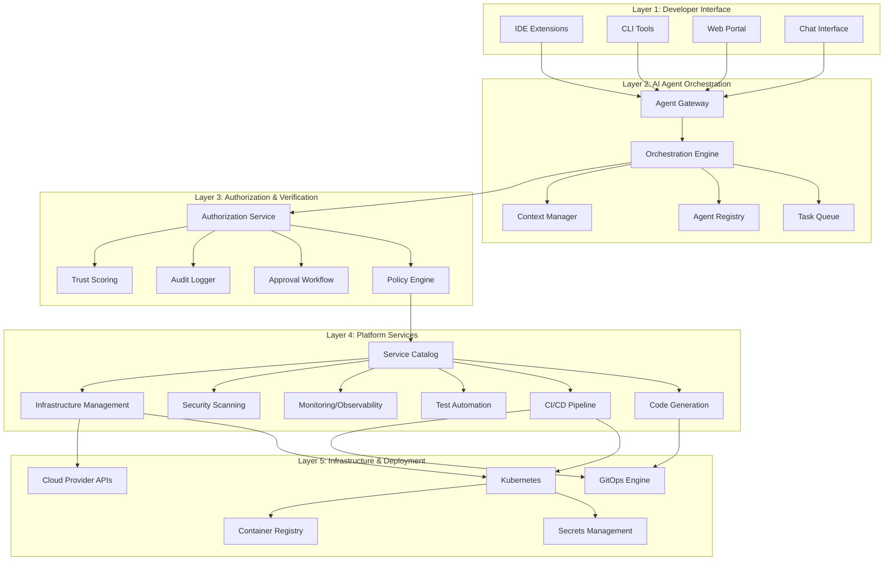

---

## Layered Architecture Design

### Layer 1: Developer Interface Layer

**Purpose**: Provide multiple touchpoints for developers and AI agents to interact with the platform.

#### Components

##### 1.1 IDE Extensions (VS Code, JetBrains, etc.)
- **Capabilities**:
  - In-editor AI assistance (code completion, generation, explanation)
  - Direct platform service access from IDE
  - Real-time feedback on code changes
  - Inline documentation and best practices
- **Agent Integration**:
  - MCP (Model Context Protocol) server integration
  - Language Server Protocol (LSP) extensions
  - Custom protocol handlers for agent communication
- **Security Features**:
  - OAuth2/OIDC authentication
  - Workspace-scoped credentials
  - Local secret scanning before commit

##### 1.2 CLI Tools
- **Capabilities**:
  - Platform service invocation via command line
  - CI/CD integration
  - Scripting and automation support
  - Pipeline definition and management
- **Agent Integration**:
  - JSON/YAML output for programmatic consumption
  - Webhook and event listeners
  - Agent-friendly error messages and status codes
- **Security Features**:
  - API key authentication
  - Command approval for destructive operations
  - Session management and timeout

##### 1.3 Web Portal
- **Capabilities**:
  - Visual platform dashboard
  - Service catalog browsing
  - Resource management
  - Team collaboration features
- **Agent Integration**:
  - REST API backend
  - GraphQL endpoint for flexible queries
  - WebSocket for real-time updates
- **Security Features**:
  - SSO integration (SAML, OIDC)
  - RBAC enforcement
  - CSRF protection
  - Content Security Policy (CSP)

##### 1.4 Chat Interface
- **Capabilities**:
  - Natural language interaction with platform
  - Conversational workflow creation
  - Incident response and troubleshooting
  - Documentation search and retrieval
- **Agent Integration**:
  - LLM integration (Claude, GPT-4, etc.)
  - Multi-turn conversation context
  - Tool calling and function execution
- **Security Features**:
  - Prompt injection detection
  - Output filtering and sanitization
  - Rate limiting
  - Conversation logging and audit

---

### Layer 2: AI Agent Orchestration Layer

**Purpose**: Coordinate AI agent activities, manage context, and ensure efficient task execution.

#### Components

##### 2.1 Agent Gateway
- **Responsibilities**:
  - Single entry point for all agent requests
  - Protocol translation (HTTP, gRPC, WebSocket)
  - Request routing to appropriate services
  - Load balancing and circuit breaking
- **Features**:
  - API versioning
  - Request/response transformation
  - Caching layer for common queries
  - Rate limiting per agent/tenant
- **Technology**: Kong, Traefik, or custom Envoy-based gateway

##### 2.2 Orchestration Engine
- **Responsibilities**:
  - Multi-step workflow coordination
  - Agent task decomposition
  - Parallel and sequential execution
  - Error handling and retry logic
- **Features**:
  - DAG-based workflow definition
  - Dynamic agent selection based on capabilities
  - Resource allocation and constraints
  - Progress tracking and reporting
- **Technology**: Temporal, Apache Airflow, or Prefect

##### 2.3 Task Queue
- **Responsibilities**:
  - Asynchronous task management
  - Priority-based scheduling
  - Dead letter queue for failed tasks
  - Task deduplication
- **Features**:
  - Multiple priority levels
  - Delayed task execution
  - Task expiration and timeout
  - Metrics and monitoring
- **Technology**: RabbitMQ, Apache Kafka, or AWS SQS

##### 2.4 Agent Registry
- **Responsibilities**:
  - Agent capability discovery
  - Agent health monitoring
  - Version management
  - Configuration management
- **Features**:
  - Agent metadata (capabilities, costs, SLAs)
  - Health checks and heartbeat monitoring
  - Graceful degradation on agent failure
  - A/B testing and canary deployments
- **Technology**: etcd, Consul, or custom service

##### 2.5 Context Manager
- **Responsibilities**:
  - Long-running conversation context
  - Cross-agent state sharing
  - Memory and knowledge base access
  - Context compression and summarization
- **Features**:
  - Hierarchical context (global, project, session)
  - Semantic search over context
  - Automatic context pruning based on relevance
  - Context versioning and rollback
- **Technology**: Redis for cache, PostgreSQL for persistence, Vector DB (Pinecone, Weaviate) for embeddings

---

### Layer 3: Authorization & Verification Layer

**Purpose**: Enforce security policies, manage approvals, and maintain audit trails.

#### Components

##### 3.1 Authorization Service
- **Responsibilities**:
  - Permission checks for all operations
  - Token validation and refresh
  - Service-to-service authentication
  - Fine-grained access control
- **Features**:
  - Attribute-based access control (ABAC)
  - Time-based and context-aware policies
  - Dynamic permission evaluation
  - Permission caching for performance
- **Technology**: Open Policy Agent (OPA), AWS IAM, or custom ABAC engine

##### 3.2 Policy Engine
- **Responsibilities**:
  - Policy definition and management
  - Policy evaluation and enforcement
  - Compliance rule checking
  - Risk assessment
- **Features**:
  - Declarative policy language (Rego, Cedar)
  - Policy versioning and testing
  - Impact analysis before policy changes
  - Policy violation reporting
- **Technology**: Open Policy Agent (OPA), Cedar, or custom engine

##### 3.3 Approval Workflow
- **Responsibilities**:
  - Human-in-the-loop approvals
  - Multi-level approval chains
  - Approval SLA tracking
  - Escalation management
- **Features**:
  - Configurable approval rules
  - Approval delegation
  - Batch approvals for similar requests
  - Slack/Teams/Email integration for notifications
- **Technology**: Temporal workflows, custom microservice, or Camunda

##### 3.4 Audit Logger
- **Responsibilities**:
  - Comprehensive logging of all actions
  - Immutable audit trail
  - Log retention and archival
  - Compliance reporting
- **Features**:
  - Structured logging (JSON)
  - Log correlation across services
  - Real-time anomaly detection
  - Log search and analytics
- **Technology**: Elasticsearch, Splunk, or cloud-native solutions (AWS CloudTrail, GCP Audit Logs)

##### 3.5 Trust Scoring
- **Responsibilities**:
  - Agent reliability scoring
  - Risk-based authentication
  - Anomaly detection
  - Adaptive security controls
- **Features**:
  - Multi-factor trust calculation
  - Continuous trust evaluation
  - Trust decay over time
  - Trust-based access control
- **Technology**: Custom ML models, rule engine, or third-party solutions

---

### Layer 4: Platform Services Layer

**Purpose**: Provide core IDP capabilities that agents can leverage to accelerate development.

#### Components

##### 4.1 Service Catalog
- **Responsibilities**:
  - Centralized inventory of platform services
  - Service discovery and documentation
  - Service lifecycle management
  - Cost and usage tracking
- **Features**:
  - Self-service provisioning
  - Service templates and blueprints
  - Dependency mapping
  - SLA and SLO tracking
- **Technology**: Backstage.io, Port, or custom catalog

##### 4.2 Code Generation Service
- **Responsibilities**:
  - AI-powered code generation
  - Boilerplate and scaffolding
  - Code refactoring and optimization
  - Documentation generation
- **Features**:
  - Multi-language support
  - Context-aware generation (project patterns, standards)
  - Incremental generation and editing
  - Quality gates (linting, security scanning)
- **Technology**: LangChain, Semantic Kernel, or custom LLM integration

##### 4.3 CI/CD Pipeline Service
- **Responsibilities**:
  - Automated build and deployment
  - Pipeline orchestration
  - Environment promotion
  - Rollback management
- **Features**:
  - Pipeline as code (YAML, HCL)
  - Multi-environment support
  - Blue-green and canary deployments
  - Integration with approval workflow
- **Technology**: GitLab CI, GitHub Actions, Tekton, or Argo Workflows

##### 4.4 Test Automation Service
- **Responsibilities**:
  - Automated test generation
  - Test execution and reporting
  - Test coverage analysis
  - Regression testing
- **Features**:
  - Unit, integration, and E2E test support
  - AI-generated test cases
  - Flaky test detection
  - Performance and load testing
- **Technology**: Jest, Pytest, Selenium, K6, or Playwright

##### 4.5 Monitoring & Observability Service
- **Responsibilities**:
  - Application and infrastructure monitoring
  - Distributed tracing
  - Log aggregation and analysis
  - Alerting and incident management
- **Features**:
  - Real-time dashboards
  - AI-driven anomaly detection
  - Auto-remediation triggers
  - Cost optimization insights
- **Technology**: Prometheus, Grafana, Datadog, New Relic, or OpenTelemetry

##### 4.6 Security Scanning Service
- **Responsibilities**:
  - Static application security testing (SAST)
  - Dynamic application security testing (DAST)
  - Dependency vulnerability scanning
  - Secret detection and prevention
- **Features**:
  - Multi-language support
  - Continuous scanning in CI/CD
  - Vulnerability prioritization
  - Auto-remediation suggestions
- **Technology**: Snyk, Veracode, SonarQube, or Trivy

##### 4.7 Infrastructure Management Service
- **Responsibilities**:
  - Infrastructure as code (IaC) management
  - Resource provisioning and deprovisioning
  - Configuration management
  - Cost optimization
- **Features**:
  - Multi-cloud support
  - IaC drift detection
  - Policy compliance checks
  - Resource tagging and governance
- **Technology**: Terraform, Pulumi, AWS CDK, or Crossplane

---

### Layer 5: Infrastructure & Deployment Layer

**Purpose**: Provide foundational infrastructure for running platform services and applications.

#### Components

##### 5.1 Kubernetes
- **Responsibilities**:
  - Container orchestration
  - Service discovery and load balancing
  - Auto-scaling and self-healing
  - Resource management
- **Features**:
  - Multi-cluster management
  - Namespace isolation
  - Custom Resource Definitions (CRDs)
  - Admission controllers for policy enforcement
- **Technology**: Kubernetes (EKS, GKE, AKS, or self-managed)

##### 5.2 GitOps Engine
- **Responsibilities**:
  - Declarative infrastructure and application management
  - Continuous deployment from Git
  - Drift detection and correction
  - Multi-environment sync
- **Features**:
  - Git as single source of truth
  - Automated rollback on failure
  - Progressive delivery support
  - Multi-tenancy and RBAC
- **Technology**: ArgoCD, Flux, or Fleet

##### 5.3 Secrets Management
- **Responsibilities**:
  - Secure storage of credentials and keys
  - Secret rotation and lifecycle management
  - Secret injection into workloads
  - Audit logging of secret access
- **Features**:
  - Encryption at rest and in transit
  - Dynamic secret generation
  - Secret versioning
  - Integration with external vaults
- **Technology**: HashiCorp Vault, AWS Secrets Manager, Azure Key Vault, or GCP Secret Manager

##### 5.4 Container Registry
- **Responsibilities**:
  - Container image storage
  - Image signing and verification
  - Vulnerability scanning of images
  - Image promotion between environments
- **Features**:
  - Private registries per team/project
  - Image garbage collection
  - Replication across regions
  - Content trust (Notary, Cosign)
- **Technology**: Harbor, AWS ECR, Google Artifact Registry, or Azure Container Registry

##### 5.5 Cloud Provider APIs
- **Responsibilities**:
  - Integration with cloud-native services
  - Multi-cloud abstraction layer
  - Cost management and optimization
  - Resource quota enforcement
- **Features**:
  - Unified API for common operations
  - Cloud cost allocation and chargeback
  - Service mesh integration
  - Disaster recovery and backup
- **Technology**: Crossplane, Terraform, or custom abstraction layer

---

## Integration Points

### 1. AI Agent ↔ IDP Service Catalog

**Description**: AI agents discover and invoke platform services through the service catalog.

#### Integration Mechanism
- **Discovery**: Agent queries service catalog API to find available services
- **Schema Retrieval**: Agent fetches OpenAPI/AsyncAPI specs for services
- **Authentication**: Agent obtains time-limited JWT from auth service
- **Invocation**: Agent calls service endpoints with required parameters
- **Response Handling**: Agent parses responses and updates context

#### Data Flow
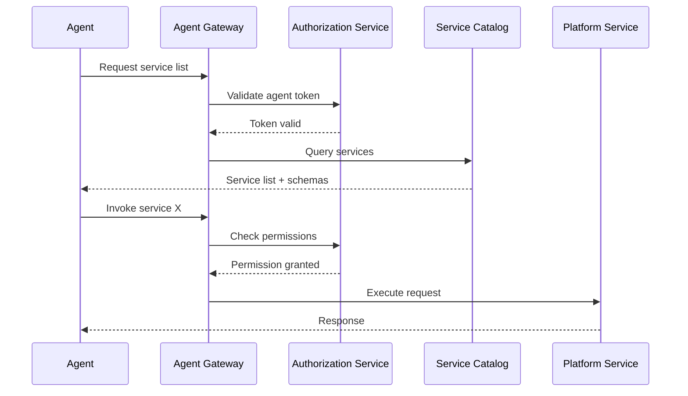

#### Security Controls
- Agent permissions limit which services can be discovered
- Service invocation requires explicit permission grants
- All interactions logged to audit trail
- Rate limiting per agent

#### Example Services
- `code-generator`: Generate code from natural language or specs
- `test-generator`: Create test cases from code or requirements
- `deployment-manager`: Deploy applications to environments
- `monitoring-dashboard`: Query observability data

---

### 2. Code Generation → Review & Approval

**Description**: AI-generated code goes through automated and human review before merging.

#### Integration Mechanism
- **Generation**: Agent produces code based on requirements
- **Static Analysis**: Automated quality checks (linting, formatting, security)
- **Policy Check**: OPA policies evaluate code against standards
- **Human Review**: Code review workflow triggers for approval
- **Merge**: Approved code merged via GitOps

#### Data Flow
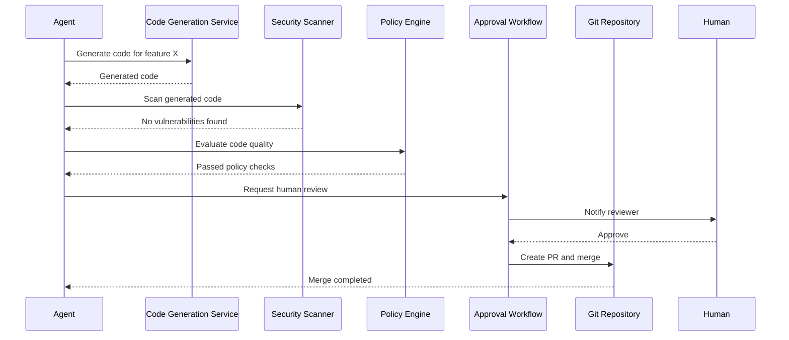

#### Security Controls
- Code generation requires review for production code
- Automated scanning blocks merging of vulnerable code
- Policy violations require override approval
- All generated code tagged with agent ID and timestamp
- Git commit includes co-authorship with agent

#### Review Criteria
- **Automated Checks**:
  - Code compiles/runs without errors
  - Passes linting and formatting standards
  - No security vulnerabilities (SAST)
  - Test coverage meets threshold
  - No hardcoded secrets
- **Human Review Required For**:
  - Changes to critical paths (auth, payment, data handling)
  - New dependencies or library additions
  - Infrastructure changes
  - Security or compliance-sensitive code

---

### 3. Testing → Automated Validation

**Description**: AI-generated tests are executed automatically with results fed back to agents.

#### Integration Mechanism
- **Test Generation**: Agent creates test cases
- **Test Execution**: CI/CD pipeline runs tests
- **Result Collection**: Test results aggregated and analyzed
- **Feedback Loop**: Agent receives results and iterates if needed

#### Data Flow
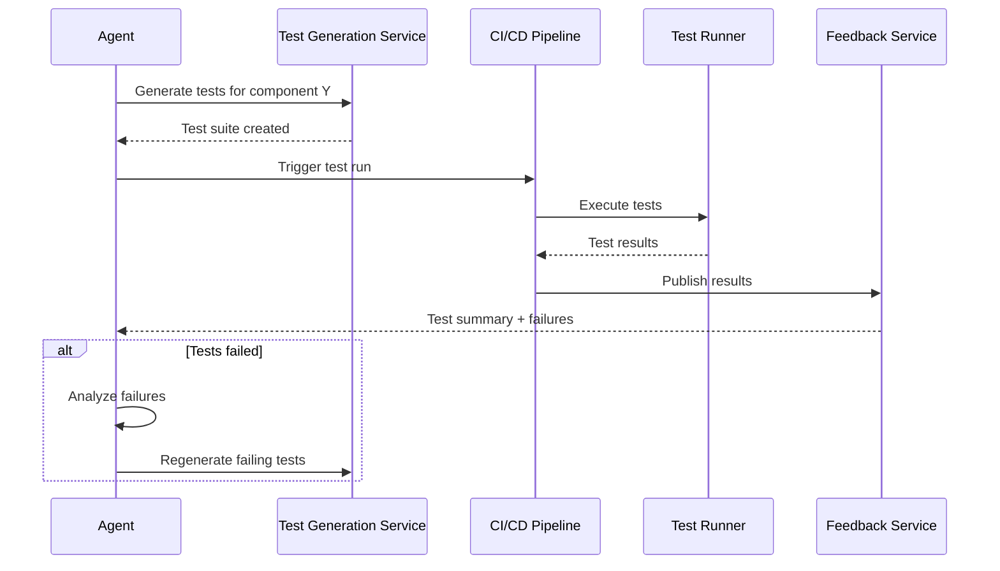

#### Security Controls
- Tests run in isolated environments
- Test data anonymized/synthetic
- Test credentials are temporary and scoped
- Test results sanitized before sharing with agent

#### Test Types
- **Unit Tests**: Fast, isolated component tests
- **Integration Tests**: Service-to-service interaction tests
- **E2E Tests**: Full user journey tests
- **Performance Tests**: Load and stress tests
- **Security Tests**: Penetration and vulnerability tests

#### Validation Gates
- All tests must pass before deployment
- Coverage must meet minimum threshold (e.g., 80%)
- Performance benchmarks must not regress
- Security tests must show no critical issues

---

### 4. Deployment → Authorization Gates

**Description**: Deployments require progressive authorization based on environment and risk.

#### Integration Mechanism
- **Deployment Request**: Agent initiates deployment
- **Risk Assessment**: System evaluates deployment risk
- **Approval Routing**: Approval workflow triggers based on risk
- **Deployment Execution**: Approved deployments executed via GitOps
- **Monitoring**: Post-deployment validation and rollback if needed

#### Data Flow
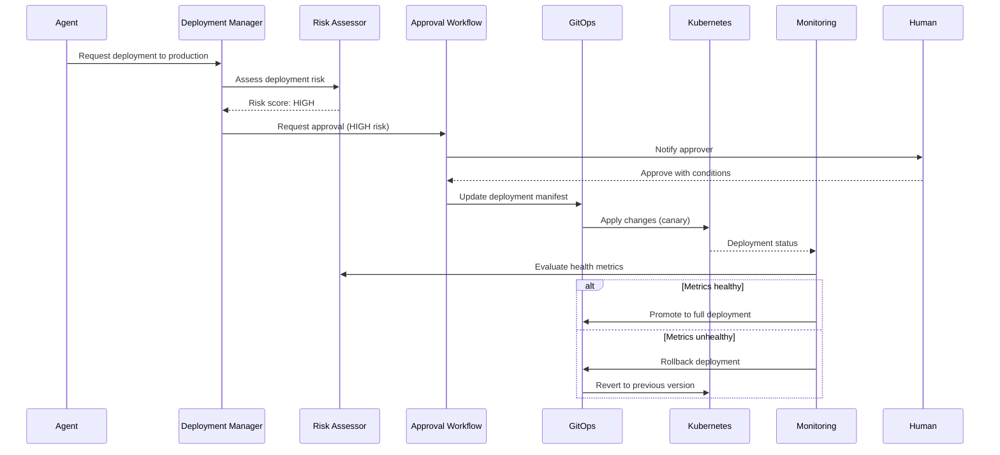

#### Authorization Levels

##### Development Environment
- **Approval**: Auto-approved for agents with dev permissions
- **Deployment Strategy**: Direct deployment
- **Monitoring**: Basic health checks
- **Rollback**: Manual or automatic on critical failure

##### Staging Environment
- **Approval**: Team lead approval for significant changes
- **Deployment Strategy**: Blue-green deployment
- **Monitoring**: Comprehensive smoke tests
- **Rollback**: Automatic on test failure

##### Production Environment
- **Approval**: Multi-level approval (team lead + platform team)
- **Deployment Strategy**: Progressive canary rollout
- **Monitoring**: Full observability with SLO tracking
- **Rollback**: Automatic on SLO breach or anomaly detection

#### Risk Factors
- **Low Risk**: Config changes, documentation updates
- **Medium Risk**: Feature additions, dependency updates
- **High Risk**: Infrastructure changes, security updates, breaking changes

---

## Security Boundaries and Trust Zones

### Trust Zone Model

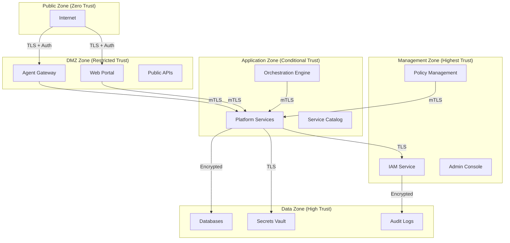

### Security Boundaries

#### Boundary 1: External → DMZ
- **Control**: Web Application Firewall (WAF)
- **Authentication**: OAuth2/OIDC, API keys
- **Rate Limiting**: Per-client rate limits
- **DDoS Protection**: Cloud-native DDoS mitigation
- **Encryption**: TLS 1.3+

#### Boundary 2: DMZ → Application Zone
- **Control**: API Gateway with mTLS
- **Authentication**: JWT validation
- **Authorization**: Initial permission checks
- **Monitoring**: Request logging and tracing
- **Encryption**: mTLS

#### Boundary 3: Application → Data Zone
- **Control**: Network policies (Kubernetes NetworkPolicy, service mesh)
- **Authentication**: Service accounts with short-lived tokens
- **Authorization**: Database-level RBAC
- **Monitoring**: Query logging and anomaly detection
- **Encryption**: Encrypted connections, data encrypted at rest

#### Boundary 4: Cross-Service Communication
- **Control**: Service mesh (Istio, Linkerd)
- **Authentication**: mTLS between services
- **Authorization**: OPA policies at sidecar
- **Monitoring**: Distributed tracing
- **Encryption**: mTLS

### Agent-Specific Security Controls

#### Agent Authentication
- **Primary**: OAuth2 client credentials flow
- **Backup**: API keys with rotation policy
- **MFA**: Required for high-privilege agents
- **Session**: Time-limited tokens (1-hour default)

#### Agent Authorization
- **Model**: Attribute-Based Access Control (ABAC)
- **Attributes**:
  - Agent identity and type
  - Trust score
  - Time of day
  - Source IP/network
  - Resource being accessed
  - Action being performed
- **Policy Language**: Rego (Open Policy Agent)

#### Agent Isolation
- **Namespace Isolation**: Agents operate in dedicated namespaces
- **Resource Quotas**: CPU, memory, and request limits per agent
- **Network Policies**: Agents can only access authorized services
- **Data Isolation**: Agents can only access data within their tenant/project

#### Agent Monitoring
- **Activity Logging**: All agent actions logged with context
- **Anomaly Detection**: ML models detect unusual agent behavior
- **Alert Triggers**: Suspicious activity alerts security team
- **Circuit Breakers**: Automatic agent suspension on policy violations

### Data Protection

#### Data Classification
- **Public**: Documentation, public APIs
- **Internal**: Code, non-sensitive configs
- **Confidential**: Customer data, API keys
- **Restricted**: Secrets, PII, financial data

#### Data Handling by Agents
- **Public**: Read/write allowed
- **Internal**: Read allowed, write requires review
- **Confidential**: Read requires approval, write requires multi-level approval
- **Restricted**: No agent access without explicit human authorization

#### Data Encryption
- **In Transit**: TLS 1.3+ for all communications
- **At Rest**: AES-256 encryption for databases and storage
- **In Use**: Confidential computing (optional) for sensitive workloads

#### Data Retention
- **Code**: Retained indefinitely in version control
- **Logs**: 90 days hot, 1 year cold, 7 years archived
- **Secrets**: Rotated every 90 days, old versions retained for 30 days
- **Personal Data**: Retained per compliance requirements, with deletion on request

---

## Key Scenario Flows

### Scenario 1: AI-Assisted Feature Development

**Actors**: Developer, AI Agent, IDP Services

**Goal**: Developer requests AI to implement a new REST API endpoint with full test coverage and deployment.

#### Flow

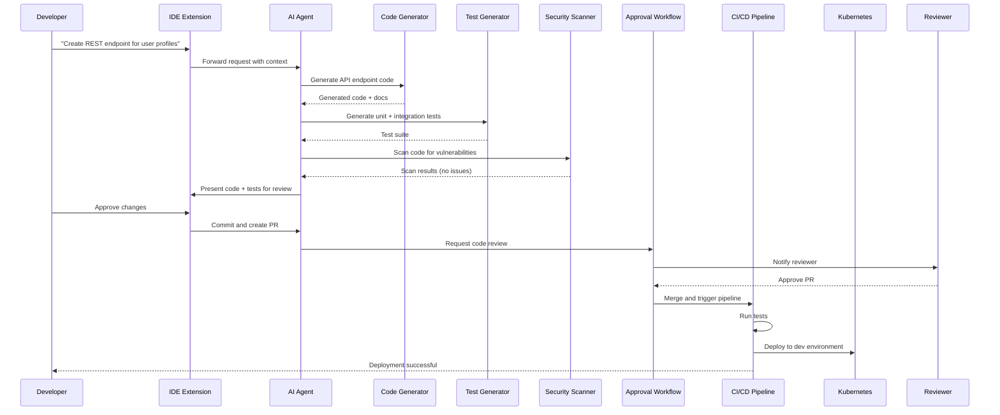

#### Key Decisions

1. **Code Generation**: Agent uses project context (existing patterns, dependencies) to generate consistent code
2. **Security Scanning**: Automated SAST catches issues before human review
3. **Test Coverage**: Agent ensures comprehensive test coverage (unit, integration)
4. **Human Review**: Developer reviews AI-generated code before committing
5. **Automated Deployment**: Pipeline automatically deploys to dev after tests pass

#### Security Controls
- Agent cannot commit directly to main branch
- All code requires human approval
- Security scan failures block PR creation
- Deployment to dev requires passing tests

---

### Scenario 2: Automated Code Review and Deployment

**Actors**: Developer, AI Agent, Code Review Agent, IDP Services

**Goal**: Automated review of developer PR with AI-assisted feedback and automated deployment to staging.

#### Flow

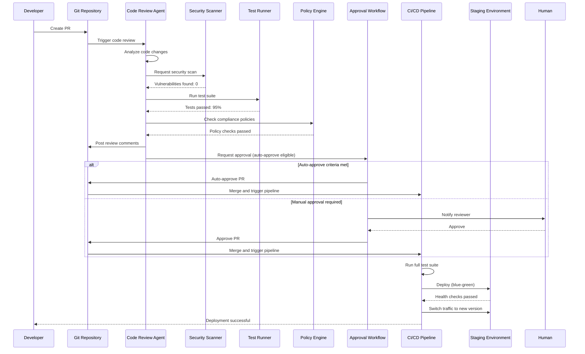

#### Auto-Approve Criteria
- All automated checks passed (tests, security, policy)
- Test coverage >= 80%
- No breaking changes detected
- Change size < 500 lines
- Non-critical path (not auth, payment, etc.)
- Developer has required permissions

#### Review Agent Checks
- **Code Quality**: Linting, complexity, duplication
- **Security**: SAST, dependency vulnerabilities, secret scanning
- **Performance**: Identifies potential performance issues
- **Best Practices**: Checks for anti-patterns and code smells
- **Test Coverage**: Ensures adequate test coverage
- **Documentation**: Verifies doc updates for API changes

#### Security Controls
- Review agent provides recommendations, not decisions
- High-risk changes always require human approval
- Automated checks are mandatory gates
- Deployment to staging is automatic but monitored
- Production deployment requires separate approval

---

### Scenario 3: Security Vulnerability Remediation

**Actors**: Security Scanner, Remediation Agent, Developer, IDP Services

**Goal**: Automated detection and remediation of security vulnerabilities in dependencies.

#### Flow

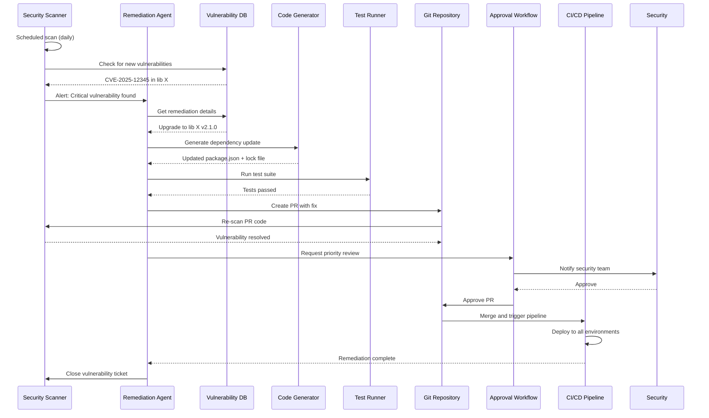

#### Remediation Strategies

##### Automatic Remediation (Low Risk)
- Patch version updates (e.g., 1.2.3 → 1.2.4)
- Non-breaking security fixes
- Updates with backward compatibility guarantees

##### Semi-Automatic Remediation (Medium Risk)
- Minor version updates (e.g., 1.2.0 → 1.3.0)
- Agent creates PR, tests locally, requests review
- Human approval required before merge

##### Manual Remediation (High Risk)
- Major version updates (e.g., 1.x → 2.x)
- Breaking changes or API incompatibilities
- Agent provides recommendations, developer implements

#### Security Controls
- Vulnerability scanning runs continuously (on push, on schedule)
- Critical vulnerabilities trigger immediate alerts
- Auto-remediation only for low-risk updates
- All remediations tested before deployment
- Security team notified of all vulnerability fixes

---

### Scenario 4: Infrastructure Scaling Request

**Actors**: Monitoring System, Scaling Agent, Platform Team, IDP Services

**Goal**: Automated detection of resource constraints and intelligent scaling of infrastructure.

#### Flow

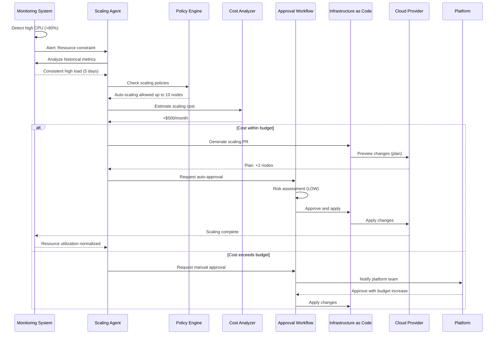

#### Scaling Decision Factors
- **Current Utilization**: CPU, memory, disk, network
- **Historical Trends**: Past 7 days of metrics
- **Forecast**: Predicted growth based on trends
- **Cost Impact**: Estimated additional cost
- **Budget Constraints**: Team/project budget limits
- **Policy Limits**: Max scaling allowed per policy
- **Business Impact**: Service criticality and SLAs

#### Scaling Strategies
- **Horizontal Scaling**: Add more nodes/pods (preferred)
- **Vertical Scaling**: Increase node size
- **Auto-Scaling Rules**: Kubernetes HPA, VPA, cluster autoscaler
- **Scheduled Scaling**: Predictive scaling for known events

#### Security Controls
- Scaling limited by policy engine
- Cost approval required above threshold
- All infrastructure changes audited
- Scaling events trigger monitoring alerts
- Automatic rollback on failure

---

### Scenario 5: Incident Response and Auto-Remediation

**Actors**: Monitoring System, Incident Agent, On-Call Engineer, IDP Services

**Goal**: Automated incident detection, diagnosis, and remediation with human oversight.

#### Flow

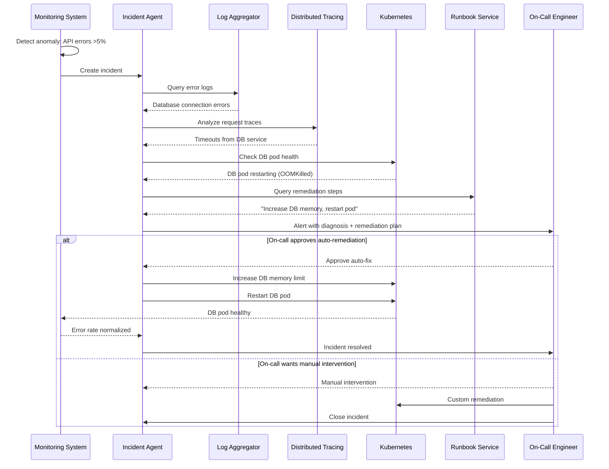

#### Incident Agent Capabilities
- **Detection**: Anomaly detection using ML models
- **Diagnosis**: Root cause analysis using logs, traces, metrics
- **Remediation**: Execute runbook steps automatically
- **Communication**: Notify on-call engineers with rich context
- **Learning**: Update runbooks based on successful remediations

#### Auto-Remediation Scenarios
- **Pod Restarts**: Restart unhealthy pods
- **Scale Up**: Add replicas for high load
- **Circuit Breaker**: Isolate failing services
- **Config Rollback**: Revert recent config changes
- **Cache Clear**: Clear corrupted cache

#### Human Oversight
- Critical incidents always alert on-call engineer
- Auto-remediation requires approval for production
- Non-standard incidents escalate to human
- All actions logged and auditable
- Post-incident review required for auto-remediations

---

## Component Specifications

### Agent Gateway

**Technology**: Kong Gateway or Traefik

**Configuration**:
```yaml
apiVersion: gateway.konghq.com/v1beta1
kind: Gateway
metadata:
  name: agent-gateway
spec:
  gatewayClassName: kong
  listeners:
    - name: http
      protocol: HTTP
      port: 80
      allowedRoutes:
        namespaces:
          from: All
    - name: https
      protocol: HTTPS
      port: 443
      tls:
        certificateRefs:
          - name: agent-gateway-cert
      allowedRoutes:
        namespaces:
          from: All
---
apiVersion: gateway.konghq.com/v1alpha1
kind: KongPlugin
metadata:
  name: rate-limiting
config:
  minute: 100
  policy: local
---
apiVersion: gateway.konghq.com/v1alpha1
kind: KongPlugin
metadata:
  name: jwt-auth
config:
  key_claim_name: iss
  secret_is_base64: false
```

**Features**:
- Rate limiting per agent
- JWT validation
- Request/response logging
- Circuit breaker
- Retry with backoff

---

### Authorization Service

**Technology**: Open Policy Agent (OPA)

**Policy Example** (Rego):
```rego
package agent.authz

import future.keywords.if
import future.keywords.in

# Default deny all
default allow := false

# Allow if agent has required permission and trust score is sufficient
allow if {
    agent_has_permission
    trust_score_sufficient
    not high_risk_operation
}

# Allow high-risk operations only with approval
allow if {
    agent_has_permission
    high_risk_operation
    has_approval
}

agent_has_permission if {
    some permission in input.agent.permissions
    permission.resource == input.request.resource
    permission.action == input.request.action
}

trust_score_sufficient if {
    input.agent.trust_score >= input.policy.min_trust_score
}

high_risk_operation if {
    input.request.resource in ["production", "secrets", "infrastructure"]
}

has_approval if {
    some approval in input.request.approvals
    approval.status == "approved"
    approval.approver != input.agent.id
}
```

**Integration**:
```yaml
apiVersion: v1
kind: ConfigMap
metadata:
  name: opa-policy
data:
  policy.rego: |
    # Policy content here
---
apiVersion: apps/v1
kind: Deployment
metadata:
  name: opa
spec:
  replicas: 3
  selector:
    matchLabels:
      app: opa
  template:
    metadata:
      labels:
        app: opa
    spec:
      containers:
      - name: opa
        image: openpolicyagent/opa:latest
        args:
          - "run"
          - "--server"
          - "--addr=0.0.0.0:8181"
          - "/policies"
        volumeMounts:
        - name: policy
          mountPath: /policies
      volumes:
      - name: policy
        configMap:
          name: opa-policy
```

---

### Orchestration Engine

**Technology**: Temporal

**Workflow Example** (TypeScript):
```typescript
import { proxyActivities, sleep } from '@temporalio/workflow';
import type * as activities from './activities';

const { generateCode, runTests, scanSecurity, createPR, deployToEnv } = proxyActivities<typeof activities>({
  startToCloseTimeout: '10 minutes',
  retry: {
    maximumAttempts: 3,
  },
});

export async function aiAssistedFeatureDevelopment(request: FeatureRequest): Promise<DeploymentResult> {
  // 1. Code Generation
  const code = await generateCode({
    description: request.description,
    context: request.context,
  });

  // 2. Parallel: Testing + Security Scan
  const [testResults, securityResults] = await Promise.all([
    runTests({ code }),
    scanSecurity({ code }),
  ]);

  if (!testResults.passed || securityResults.vulnerabilities.length > 0) {
    throw new Error('Quality gates failed');
  }

  // 3. Create PR for human review
  const pr = await createPR({
    code,
    description: request.description,
    testResults,
    securityResults,
  });

  // 4. Wait for approval (with timeout)
  const approved = await waitForApproval(pr.id, '24 hours');
  if (!approved) {
    throw new Error('PR not approved within SLA');
  }

  // 5. Deploy to dev environment
  const devDeployment = await deployToEnv({
    environment: 'dev',
    code,
  });

  // 6. Wait for staging approval
  const stagingApproved = await waitForApproval(pr.id, '48 hours', 'staging');
  if (stagingApproved) {
    await deployToEnv({ environment: 'staging', code });
  }

  return {
    prId: pr.id,
    deployments: [devDeployment],
  };
}

async function waitForApproval(prId: string, timeout: string, stage = 'merge'): Promise<boolean> {
  const signal = await workflow.waitForSignal<ApprovalSignal>('approval', timeout);
  return signal?.approved ?? false;
}
```

---

### Service Catalog

**Technology**: Backstage.io

**Service Definition** (YAML):
```yaml
apiVersion: backstage.io/v1alpha1
kind: Component
metadata:
  name: code-generator
  description: AI-powered code generation service
  annotations:
    backstage.io/techdocs-ref: dir:.
    github.com/project-slug: myorg/code-generator
spec:
  type: service
  lifecycle: production
  owner: platform-team
  system: idp
  dependsOn:
    - resource:llm-api
  providesApis:
    - code-generator-api
---
apiVersion: backstage.io/v1alpha1
kind: API
metadata:
  name: code-generator-api
  description: REST API for code generation
spec:
  type: openapi
  lifecycle: production
  owner: platform-team
  definition: |
    openapi: 3.0.0
    info:
      title: Code Generator API
      version: 1.0.0
    paths:
      /generate:
        post:
          summary: Generate code from description
          requestBody:
            required: true
            content:
              application/json:
                schema:
                  type: object
                  properties:
                    description:
                      type: string
                    language:
                      type: string
                    context:
                      type: object
          responses:
            '200':
              description: Generated code
              content:
                application/json:
                  schema:
                    type: object
                    properties:
                      code:
                        type: string
                      files:
                        type: array
```

---

### Audit Logger

**Technology**: Elasticsearch + Fluentd

**Log Format** (JSON):
```json
{
  "timestamp": "2025-09-30T18:30:45.123Z",
  "event_id": "evt_abc123",
  "event_type": "agent.action",
  "severity": "info",
  "agent": {
    "id": "agent_xyz789",
    "type": "code-generator",
    "version": "1.2.0",
    "trust_score": 0.95
  },
  "action": {
    "type": "code.generate",
    "resource": "api/users/create",
    "operation": "create",
    "result": "success"
  },
  "context": {
    "user_id": "user_123",
    "session_id": "sess_456",
    "ip_address": "10.0.1.5",
    "request_id": "req_789"
  },
  "metadata": {
    "duration_ms": 1234,
    "tokens_used": 5000,
    "cost_usd": 0.05
  },
  "approval": {
    "required": true,
    "granted_by": "user_456",
    "granted_at": "2025-09-30T18:30:00.000Z"
  }
}
```

**Fluentd Configuration**:
```yaml
<source>
  @type forward
  port 24224
  bind 0.0.0.0
</source>

<filter agent.**>
  @type record_transformer
  <record>
    event_type agent.${tag}
    environment "#{ENV['ENVIRONMENT']}"
  </record>
</filter>

<match agent.**>
  @type elasticsearch
  host elasticsearch.logging.svc.cluster.local
  port 9200
  logstash_format true
  logstash_prefix agent-logs
  include_tag_key true
  <buffer>
    @type file
    path /var/log/fluentd/buffer
    flush_interval 5s
  </buffer>
</match>
```

---

## Technology Stack Recommendations

### Core Platform

| Component | Recommended Technology | Alternatives |
|-----------|------------------------|--------------|
| **Container Orchestration** | Kubernetes (1.28+) | Docker Swarm, Nomad |
| **Service Mesh** | Istio or Linkerd | Consul Connect, AWS App Mesh |
| **API Gateway** | Kong or Traefik | Envoy, NGINX, AWS API Gateway |
| **GitOps** | ArgoCD | Flux, Fleet |
| **CI/CD** | GitLab CI or GitHub Actions | Jenkins, Tekton, Argo Workflows |
| **Secrets Management** | HashiCorp Vault | AWS Secrets Manager, Azure Key Vault |
| **Container Registry** | Harbor | AWS ECR, Google Artifact Registry |

### AI & Orchestration

| Component | Recommended Technology | Alternatives |
|-----------|------------------------|--------------|
| **LLM Integration** | LangChain or Semantic Kernel | Custom integration |
| **Workflow Engine** | Temporal | Apache Airflow, Prefect, Cadence |
| **Message Queue** | Apache Kafka | RabbitMQ, AWS SQS, Google Pub/Sub |
| **Task Queue** | Celery with Redis | AWS SQS + Lambda, Google Cloud Tasks |
| **Vector Database** | Pinecone or Weaviate | Qdrant, Milvus, pgvector |

### Security & Compliance

| Component | Recommended Technology | Alternatives |
|-----------|------------------------|--------------|
| **Authorization** | Open Policy Agent (OPA) | Casbin, AWS IAM, Keycloak |
| **Authentication** | Keycloak or Auth0 | Okta, AWS Cognito, Azure AD |
| **Security Scanning** | Snyk or Trivy | Veracode, SonarQube, Aqua Security |
| **WAF** | AWS WAF or Cloudflare | ModSecurity, Imperva |
| **SIEM** | Elasticsearch (ELK) or Splunk | Datadog, Sumo Logic |

### Observability

| Component | Recommended Technology | Alternatives |
|-----------|------------------------|--------------|
| **Metrics** | Prometheus + Grafana | Datadog, New Relic, Dynatrace |
| **Logging** | Elasticsearch + Fluentd + Kibana | Splunk, Loki, CloudWatch |
| **Tracing** | Jaeger or Zipkin | AWS X-Ray, Datadog APM, Lightstep |
| **APM** | Datadog or New Relic | AppDynamics, Dynatrace |

### Data & Storage

| Component | Recommended Technology | Alternatives |
|-----------|------------------------|--------------|
| **Relational DB** | PostgreSQL | MySQL, CockroachDB, AWS RDS |
| **NoSQL DB** | MongoDB | Cassandra, DynamoDB, CosmosDB |
| **Cache** | Redis | Memcached, Hazelcast |
| **Object Storage** | AWS S3 or MinIO | Google Cloud Storage, Azure Blob |

### Development Tools

| Component | Recommended Technology | Alternatives |
|-----------|------------------------|--------------|
| **IaC** | Terraform | Pulumi, AWS CDK, Crossplane |
| **IDE Integration** | VS Code Extensions | JetBrains Plugins |
| **Service Catalog** | Backstage.io | Port, OpsLevel |
| **Documentation** | Docusaurus or MkDocs | GitBook, Confluence |

---

## Implementation Roadmap

### Phase 1: Foundation (Months 1-3)

**Goal**: Establish core platform infrastructure and basic AI integration.

#### Deliverables
- Kubernetes cluster setup with multi-tenancy
- CI/CD pipeline (GitLab CI or GitHub Actions)
- Service mesh deployment (Istio or Linkerd)
- GitOps setup (ArgoCD)
- Secrets management (Vault)
- Basic observability (Prometheus, Grafana, ELK)

#### Key Metrics
- Platform uptime: 99.5%
- Deployment frequency: Daily
- Mean time to recovery (MTTR): < 1 hour

---

### Phase 2: Security & Authorization (Months 2-4)

**Goal**: Implement robust security controls and authorization framework.

#### Deliverables
- Open Policy Agent deployment
- Policy-as-code for common scenarios
- JWT-based authentication
- RBAC and ABAC models
- Audit logging infrastructure
- Secrets rotation automation

#### Key Metrics
- Policy evaluation latency: < 10ms (p99)
- Audit log completeness: 100%
- Secrets rotation: Every 90 days

---

### Phase 3: Agent Orchestration (Months 4-6)

**Goal**: Build AI agent orchestration layer with context management.

#### Deliverables
- Agent gateway deployment
- Temporal workflow engine
- Agent registry and health checks
- Context manager (Redis + PostgreSQL)
- Task queue (Kafka or RabbitMQ)
- Basic agent types (code generator, reviewer)

#### Key Metrics
- Agent request latency: < 500ms (p95)
- Workflow success rate: > 95%
- Context retrieval latency: < 50ms

---

### Phase 4: Platform Services (Months 5-8)

**Goal**: Deploy core IDP services accessible to agents.

#### Deliverables
- Service catalog (Backstage.io)
- Code generation service (LangChain integration)
- Test automation service
- Security scanning service (Snyk or Trivy)
- Infrastructure management service (Terraform automation)
- Monitoring service (Datadog or Prometheus)

#### Key Metrics
- Service availability: 99.9%
- API response time: < 200ms (p95)
- Code generation success rate: > 90%

---

### Phase 5: Advanced Workflows (Months 7-10)

**Goal**: Implement end-to-end automated workflows with approvals.

#### Deliverables
- AI-assisted feature development workflow
- Automated code review workflow
- Security vulnerability remediation workflow
- Incident response and auto-remediation
- Deployment automation with progressive delivery

#### Key Metrics
- Workflow automation rate: 80% of repetitive tasks
- Human approval SLA: < 4 hours
- Auto-remediation success rate: > 85%

---

### Phase 6: Advanced AI Capabilities (Months 9-12)

**Goal**: Enhance AI capabilities with learning and optimization.

#### Deliverables
- Trust scoring system
- Agent performance analytics
- Context compression and summarization
- Multi-agent collaboration patterns
- Custom agent development framework
- Feedback loop for agent improvement

#### Key Metrics
- Trust score accuracy: > 90%
- Agent collaboration efficiency: 2x improvement
- Context compression ratio: 5:1

---

### Phase 7: Optimization & Scale (Months 11-14)

**Goal**: Optimize platform for scale, cost, and performance.

#### Deliverables
- Multi-cluster deployment
- Global load balancing
- Cost optimization (spot instances, right-sizing)
- Performance tuning (caching, batching)
- Disaster recovery and backup
- Self-service onboarding

#### Key Metrics
- Platform supports 1000+ developers
- Cost per developer: < $50/month
- P99 latency: < 1s for all critical paths

---

### Phase 8: Continuous Improvement (Months 13+)

**Goal**: Ongoing refinement based on feedback and new technologies.

#### Activities
- User feedback collection and analysis
- A/B testing of new features
- Integration with emerging AI models
- Compliance audits and updates
- Performance benchmarking
- Community engagement and open-sourcing

#### Key Metrics
- Developer satisfaction: > 8/10
- Platform adoption: 90% of teams
- Incident rate: < 1 per month

---

## Appendices

### Appendix A: Glossary

- **ABAC**: Attribute-Based Access Control
- **DAG**: Directed Acyclic Graph
- **GitOps**: Infrastructure and application management using Git as source of truth
- **IaC**: Infrastructure as Code
- **IDP**: Internal Developer Platform
- **JWT**: JSON Web Token
- **MCP**: Model Context Protocol
- **mTLS**: Mutual Transport Layer Security
- **OPA**: Open Policy Agent
- **RBAC**: Role-Based Access Control
- **SAST**: Static Application Security Testing
- **SLA**: Service Level Agreement
- **SLO**: Service Level Objective

### Appendix B: References

1. **Platform Engineering**:
   - "Team Topologies" by Matthew Skelton and Manuel Pais
   - "Platform Engineering: A Guide for Technical Decision Makers" (InfoQ)
   - CNCF Platform Engineering Working Group

2. **AI & Agentic Systems**:
   - "Autonomous Agents in Software Development" (arXiv:2304.06691)
   - OpenAI's "Practices for Governing Agentic AI Systems"
   - Anthropic's "Claude API Documentation"

3. **Security**:
   - OWASP Top 10
   - NIST Cybersecurity Framework
   - "Zero Trust Architecture" (NIST SP 800-207)

4. **DevOps & GitOps**:
   - "Accelerate" by Nicole Forsgren, Jez Humble, and Gene Kim
   - GitOps Working Group (CNCF)
   - "The DevOps Handbook" by Gene Kim et al.

### Appendix C: Decision Records

#### ADR-001: Choice of Kubernetes for Orchestration
**Status**: Accepted
**Context**: Need container orchestration for IDP
**Decision**: Use Kubernetes
**Consequences**: Industry standard, large ecosystem, but complexity overhead

#### ADR-002: Open Policy Agent for Authorization
**Status**: Accepted
**Context**: Need flexible, auditable authorization
**Decision**: Use OPA with Rego policies
**Consequences**: Powerful policy engine, steep learning curve

#### ADR-003: Temporal for Workflow Orchestration
**Status**: Accepted
**Context**: Need reliable, long-running workflow engine
**Decision**: Use Temporal
**Consequences**: Strong durability guarantees, requires infrastructure

#### ADR-004: Multi-Layer Architecture
**Status**: Accepted
**Context**: Need clear separation of concerns
**Decision**: 5-layer architecture (Interface, Orchestration, Authorization, Services, Infrastructure)
**Consequences**: Clear boundaries, but more integration points

---

## Conclusion

This architecture provides a comprehensive blueprint for building an Internal Developer Platform enhanced with agentic AI capabilities. The design balances automation and autonomy with security, governance, and human oversight.

**Key Architectural Principles**:
1. **Agent-first design** with human oversight
2. **Zero trust security** at every layer
3. **Progressive enhancement** for resilience
4. **Comprehensive auditability** for compliance
5. **Modular and extensible** for future growth

**Next Steps**:
1. Review this architecture with stakeholders
2. Prioritize phases based on organizational needs
3. Conduct proof-of-concept for critical components
4. Develop detailed component designs
5. Begin Phase 1 implementation

---

**Document Control**

| Version | Date | Author | Changes |
|---------|------|--------|---------|
| 1.0 | 2025-09-30 | Platform Architect (Swarm Agent) | Initial comprehensive architecture |

**Approval**

- [ ] Technical Review
- [ ] Security Review
- [ ] Compliance Review
- [ ] Executive Approval

---

**END OF DOCUMENT**
