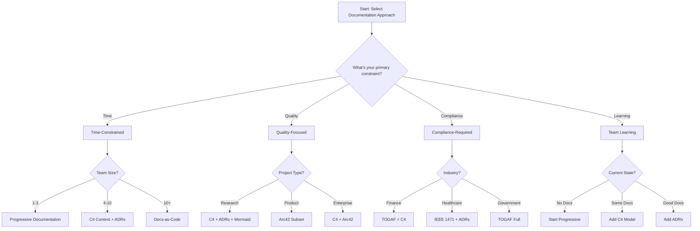
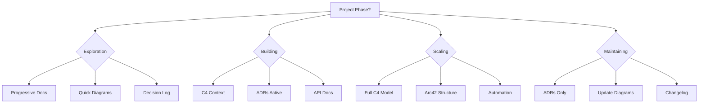
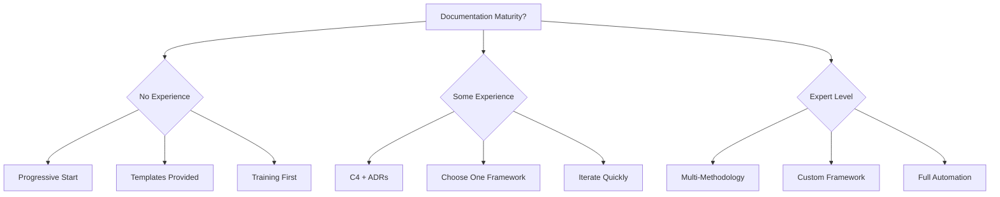
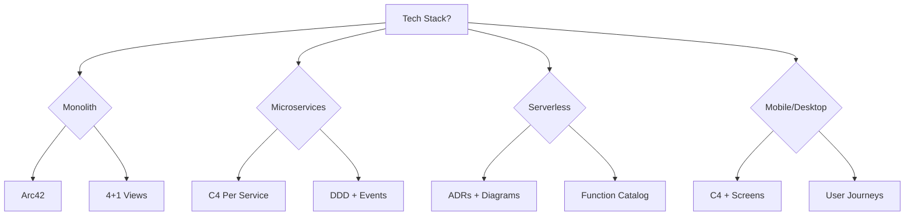
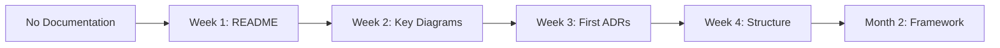
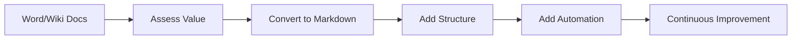
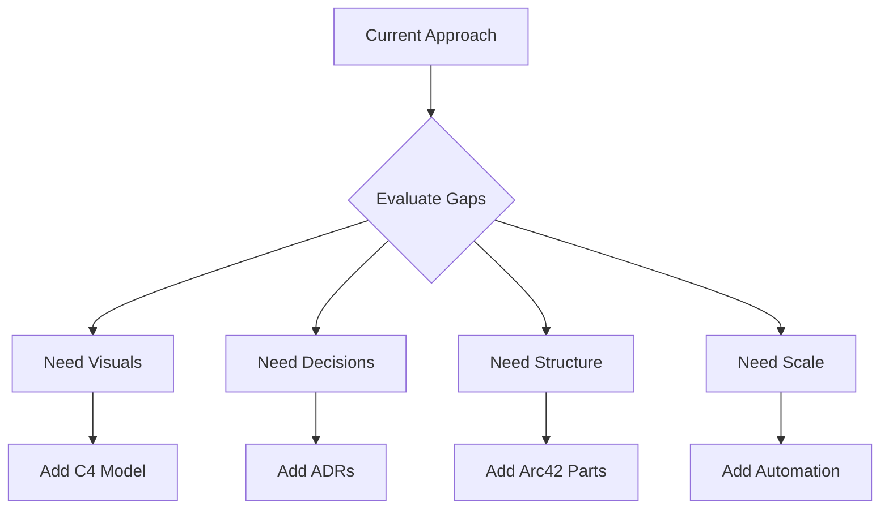

# Architecture Documentation Methodology Decision Trees

## Visual Decision Framework

This document provides interactive decision trees to help teams select the most appropriate architecture documentation methodology based on their specific context and constraints.

## Master Decision Tree



## Context-Based Decision Trees

### 1. Project Phase Decision Tree



### 2. Team Maturity Decision Tree



### 3. Technical Stack Decision Tree



## Detailed Decision Scenarios

### Scenario 1: Startup Building MVP

**Context**: 
- Team: 3 developers
- Timeline: 3 months
- Budget: Minimal
- Goal: Rapid iteration

**Decision Path**:
```
1. Start → Time-Constrained → Small Team
2. Result: Progressive Documentation
3. Implementation:
   - README.md with project overview
   - Simple Mermaid diagrams
   - Decision log (informal ADRs)
   - Evolve as you grow
```

### Scenario 2: Enterprise Modernization

**Context**:
- Team: 50+ developers
- Timeline: 2 years
- Budget: Significant
- Goal: Replace legacy system

**Decision Path**:
```
1. Start → Compliance-Required → Enterprise
2. Result: TOGAF + C4 for systems
3. Implementation:
   - TOGAF for governance framework
   - C4 for system documentation
   - ADRs for migration decisions
   - Arc42 for detailed modules
```

### Scenario 3: Research Project

**Context**:
- Team: 5-8 researchers
- Timeline: 6 months
- Budget: Moderate
- Goal: Explore new architecture

**Decision Path**:
```
1. Start → Quality-Focused → Research
2. Result: C4 + ADRs + Mermaid
3. Implementation:
   - C4 Context for big picture
   - ADRs for experiments
   - Mermaid for quick iteration
   - Progressive refinement
```

### Scenario 4: Regulated Industry

**Context**:
- Team: 20 developers
- Timeline: 1 year
- Budget: Large
- Goal: Compliance + Quality

**Decision Path**:
```
1. Start → Compliance-Required → Healthcare
2. Result: IEEE 1471 + ADRs + C4
3. Implementation:
   - IEEE 1471 for compliance
   - C4 for communication
   - ADRs for traceability
   - Automated validation
```

## Migration Decision Trees

### From No Documentation



### From Legacy Documentation



### Between Modern Approaches



## Quick Decision Matrix

| If You Have... | And Need... | Choose... |
|----------------|-------------|-----------|
| No docs | Quick start | Progressive |
| Basic docs | Structure | C4 Model |
| Good structure | Decisions | Add ADRs |
| Decisions | Compliance | Add framework |
| Everything | Efficiency | Automate |

## Anti-Pattern Detection

### Red Flags for Wrong Choice

1. **TOGAF for Startup** ❌
   - Too heavy
   - Slows iteration
   - Expensive

2. **No Structure for Enterprise** ❌
   - Chaos at scale
   - No governance
   - Compliance risk

3. **Only Diagrams** ❌
   - No context
   - No decisions
   - Maintenance burden

4. **Only Text** ❌
   - Hard to understand
   - No visual model
   - Limited audience

## Success Patterns

### Green Flags for Right Choice

1. **Progressive + Evolution** ✅
   - Start simple
   - Add as needed
   - Continuous value

2. **Multi-Method Mix** ✅
   - C4 for visuals
   - ADRs for decisions
   - Automation for scale

3. **Team-Appropriate** ✅
   - Matches skills
   - Fits culture
   - Sustainable

4. **Tool-Supported** ✅
   - Good ecosystem
   - Automation possible
   - Version control

## Decision Checkpoint Questions

Before finalizing your choice, answer:

1. **Can a new team member understand the system in < 30 minutes?**
   - Yes → Good choice
   - No → Add more structure

2. **Can you update docs in < 10% of coding time?**
   - Yes → Sustainable
   - No → Too heavy

3. **Do stakeholders find docs valuable?**
   - Yes → Right level
   - No → Adjust approach

4. **Can you automate 80% of updates?**
   - Yes → Scalable
   - No → Add tooling

## Implementation Roadmap

### Week 1: Foundation
- [ ] Choose primary methodology
- [ ] Set up basic structure
- [ ] Create first examples
- [ ] Get team buy-in

### Week 2-4: Establish
- [ ] Create templates
- [ ] Document first system
- [ ] Set up automation
- [ ] Train team

### Month 2-3: Scale
- [ ] Refine approach
- [ ] Add tooling
- [ ] Measure effectiveness
- [ ] Iterate based on feedback

### Ongoing: Optimize
- [ ] Regular reviews
- [ ] Update templates
- [ ] Improve automation
- [ ] Share learnings

## Conclusion

The best documentation methodology is the one that:
1. Gets used by your team
2. Provides value to stakeholders  
3. Can be maintained efficiently
4. Scales with your needs

Use these decision trees to find your optimal path, but remember: you can always adjust and evolve your approach as you learn what works best for your specific context.