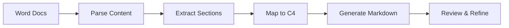

# Architecture Documentation Migration Paths

## Overview

This guide provides detailed migration paths between different architecture documentation methodologies, including timelines, risks, and step-by-step procedures.

## Migration Readiness Assessment

### Pre-Migration Checklist

- [ ] Current documentation audit completed
- [ ] Stakeholder buy-in secured
- [ ] Team training plan defined
- [ ] Tool requirements identified
- [ ] Success metrics established
- [ ] Rollback plan prepared
- [ ] Migration timeline approved

### Readiness Score Calculator

| Factor | Weight | Your Score (0-10) | Weighted |
|--------|--------|------------------|----------|
| Team Capacity | 25% | ___ | ___ |
| Current Doc Quality | 20% | ___ | ___ |
| Stakeholder Support | 20% | ___ | ___ |
| Technical Readiness | 15% | ___ | ___ |
| Budget Available | 10% | ___ | ___ |
| Timeline Flexibility | 10% | ___ | ___ |
| **Total** | **100%** | | **___** |

**Interpretation:**
- 70-100: Ready to migrate
- 50-69: Address gaps first  
- Below 50: Not ready

## Common Migration Patterns

### Pattern 1: Greenfield → Structured

**From:** No documentation
**To:** C4 + ADRs + Docs-as-Code

**Week 1: Foundation**
```bash
# Create structure
mkdir -p docs/{architecture,decisions,diagrams}

# Initialize README
echo "# Project Architecture" > docs/README.md

# Set up ADR tooling
npm install -g adr-log
adr init docs/decisions
```

**Week 2: First Documentation**
```markdown
# docs/architecture/overview.md
## System Context
[Initial C4 context diagram]

## Key Decisions
[Link to first ADRs]

## Getting Started
[Developer quickstart]
```

**Week 3: Automation**
```yaml
# .github/workflows/docs.yml
name: Documentation
on: [push]
jobs:
  validate:
    - Check markdown
    - Generate diagrams
    - Build site
```

**Week 4: Team Adoption**
- Training sessions
- First PR reviews
- Template refinement
- Feedback incorporation

### Pattern 2: Wiki → Git-Based

**From:** Confluence/SharePoint
**To:** Markdown + Git

**Phase 1: Export (Month 1)**

```python
# export_wiki.py
import confluence_api

def export_to_markdown():
    pages = confluence_api.get_all_pages()
    for page in pages:
        markdown = convert_to_markdown(page)
        save_to_file(markdown, page.title)
```

**Phase 2: Transform (Month 2)**

```bash
# Restructure exported content
docs/
├── architecture/
│   ├── overview.md
│   ├── components/
│   └── decisions/
├── guides/
├── api/
└── operations/
```

**Phase 3: Migrate (Month 3)**

1. Set up Git repository
2. Import transformed content
3. Set up CI/CD pipeline
4. Train team on Git workflow
5. Parallel run period
6. Deprecate wiki

### Pattern 3: Traditional → Modern

**From:** Word documents + Visio
**To:** C4 + ADRs + Mermaid

**Month 1: Assessment**

| Document | Value | Migrate? | Transform To |
|----------|-------|----------|--------------|
| Architecture.docx | High | Yes | C4 + Markdown |
| Detailed Design.docx | Medium | Partial | Component docs |
| Meeting Notes.docx | Low | No | ADRs only |
| Diagrams.vsd | High | Yes | Mermaid/PlantUML |

**Month 2: Pilot Migration**



**Month 3: Full Migration**

1. Convert all high-value documents
2. Recreate diagrams in text format
3. Extract decisions into ADRs
4. Archive original documents
5. Implement review process

### Pattern 4: Methodology Evolution

**From:** C4 Model only
**To:** C4 + ADRs + Arc42 subset

**Sprint 1: Add ADRs**

```bash
# Create first ADR
adr new "Use PostgreSQL for persistence"

# Link from C4 diagrams
echo "See [ADR-001](../decisions/001-postgresql.md)" >> container.md
```

**Sprint 2: Add Arc42 Structure**

```markdown
# Add selected Arc42 sections
docs/
├── 01-introduction-goals.md
├── 02-constraints.md
├── 04-solution-strategy.md
├── 05-building-blocks.md (from C4)
├── 08-concepts.md
└── 09-decisions.md (ADRs)
```

**Sprint 3: Integration**

- Cross-reference all documents
- Create navigation structure
- Update team processes
- Measure improvement

## Specific Migration Paths

### Path A: Progressive → C4 + ADRs

**Timeline:** 4 weeks

**Week 1: C4 Context**
- [ ] Identify system boundaries
- [ ] List external systems
- [ ] Create context diagram
- [ ] Document assumptions

**Week 2: Container View**
- [ ] Map major components
- [ ] Define boundaries
- [ ] Create container diagram
- [ ] Update README

**Week 3: First ADRs**
- [ ] Install ADR tools
- [ ] Document past decisions
- [ ] Create ADR template
- [ ] Link to diagrams

**Week 4: Process Integration**
- [ ] Update PR template
- [ ] Create review checklist
- [ ] Team training
- [ ] Measure adoption

### Path B: ADRs → Full Arc42

**Timeline:** 3 months

**Month 1: Structure**
```bash
# Create Arc42 structure
for i in {01..12}; do
  touch docs/$i-section.md
done

# Migrate existing ADRs
mv decisions docs/09-architecture-decisions
```

**Month 2: Content Development**
- Fill sections 1-4 (goals, constraints, context, strategy)
- Integrate existing diagrams into section 5
- Document concepts (section 8)
- Map ADRs to sections

**Month 3: Completion**
- Add remaining sections
- Create cross-references
- Implement automation
- Train team

### Path C: TOGAF → Pragmatic Mix

**Timeline:** 6 months

**Phase 1: Simplification (Months 1-2)**
- Identify core TOGAF artifacts to keep
- Map to lighter frameworks
- Create transition plan

**Phase 2: Tool Migration (Months 3-4)**
- Move from enterprise tools to open source
- Convert diagrams to text-based formats
- Set up version control

**Phase 3: Process Adjustment (Months 5-6)**
- Streamline governance
- Implement agile practices
- Measure efficiency gains

## Migration Risk Management

### Common Risks and Mitigations

| Risk | Probability | Impact | Mitigation |
|------|------------|--------|------------|
| Team resistance | High | High | Training, gradual rollout |
| Data loss | Medium | High | Backup, parallel run |
| Tool issues | Medium | Medium | Pilot testing, alternatives |
| Scope creep | High | Medium | Clear boundaries, phases |
| Stakeholder pushback | Medium | High | Early involvement, demos |

### Rollback Strategies

**Level 1: Pause**
- Stop migration
- Continue with current
- Address issues
- Resume when ready

**Level 2: Partial Rollback**
- Keep successful parts
- Revert problematic areas
- Hybrid approach
- Gradual retry

**Level 3: Full Rollback**
- Return to original
- Document lessons
- Revise approach
- Try again later

## Success Metrics

### Quantitative Metrics

| Metric | Baseline | Target | Measurement |
|--------|----------|--------|-------------|
| Doc update time | 4 hours | 30 min | Git commits |
| Find information | 20 min | 5 min | User survey |
| Review cycle | 3 days | 4 hours | PR metrics |
| Accuracy | 60% | 90% | Audit results |
| Coverage | 40% | 80% | Tool analysis |

### Qualitative Metrics

- Developer satisfaction
- Stakeholder feedback  
- Documentation quality
- Team velocity
- Knowledge sharing

## Migration Tools and Scripts

### Conversion Tools

```bash
# Confluence to Markdown
npm install -g confluence-to-markdown

# Word to Markdown  
pip install pypandoc

# Visio to Mermaid (manual assistance needed)
# Use draw.io as intermediate format
```

### Validation Scripts

```python
# validate_migration.py
def check_completeness():
    """Ensure all content migrated"""
    original_files = scan_original()
    migrated_files = scan_new()
    
    missing = original_files - migrated_files
    if missing:
        print(f"Missing: {missing}")
    
def check_links():
    """Validate all links work"""
    for file in markdown_files:
        links = extract_links(file)
        for link in links:
            if not validate_link(link):
                print(f"Broken: {link} in {file}")
```

### Migration Templates

```markdown
# Migration Checklist Template

## Pre-Migration
- [ ] Inventory current docs
- [ ] Identify stakeholders
- [ ] Define success criteria
- [ ] Set up tools
- [ ] Create timeline

## During Migration  
- [ ] Weekly progress review
- [ ] Issue tracking
- [ ] Team feedback
- [ ] Quality checks

## Post-Migration
- [ ] Validation complete
- [ ] Team trained
- [ ] Old system archived
- [ ] Lessons documented
```

## Case Studies

### Case 1: Startup Evolution

**Context:** 10-person startup, 2 years old

**Migration:** README → C4 + ADRs

**Timeline:** 3 weeks

**Results:**
- 80% reduction in onboarding time
- 60% fewer architecture questions
- 100% decision traceability

**Lessons:**
- Start with context diagram
- Document decisions immediately
- Automate from day 1

### Case 2: Enterprise Modernization

**Context:** 500-person enterprise, legacy docs

**Migration:** TOGAF → C4 + Arc42 subset

**Timeline:** 9 months

**Results:**
- 50% documentation maintenance reduction
- 90% stakeholder satisfaction
- 70% faster updates

**Lessons:**
- Gradual migration works
- Keep what provides value
- Tool training essential

### Case 3: Open Source Project

**Context:** Community project, 50 contributors

**Migration:** Wiki → Docs-as-Code

**Timeline:** 6 weeks

**Results:**
- 200% increase in doc contributions
- 95% accuracy improvement
- 100% version control

**Lessons:**
- Community involvement crucial
- Automation enables scale
- Templates drive consistency

## Conclusion

Successful migration requires:

1. **Clear goals** - Know why you're migrating
2. **Gradual approach** - Big bang rarely works
3. **Team involvement** - Get buy-in early
4. **Automation** - Reduce manual work
5. **Measurement** - Track progress

Remember: Migration is not just about moving content, it's about improving how your team creates and maintains architectural knowledge.