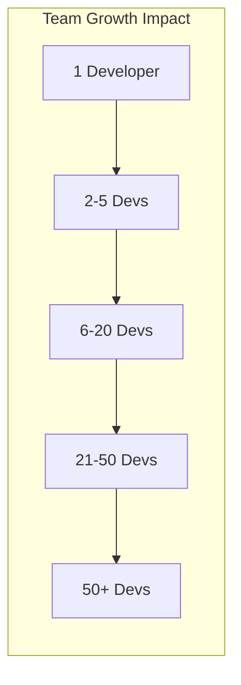
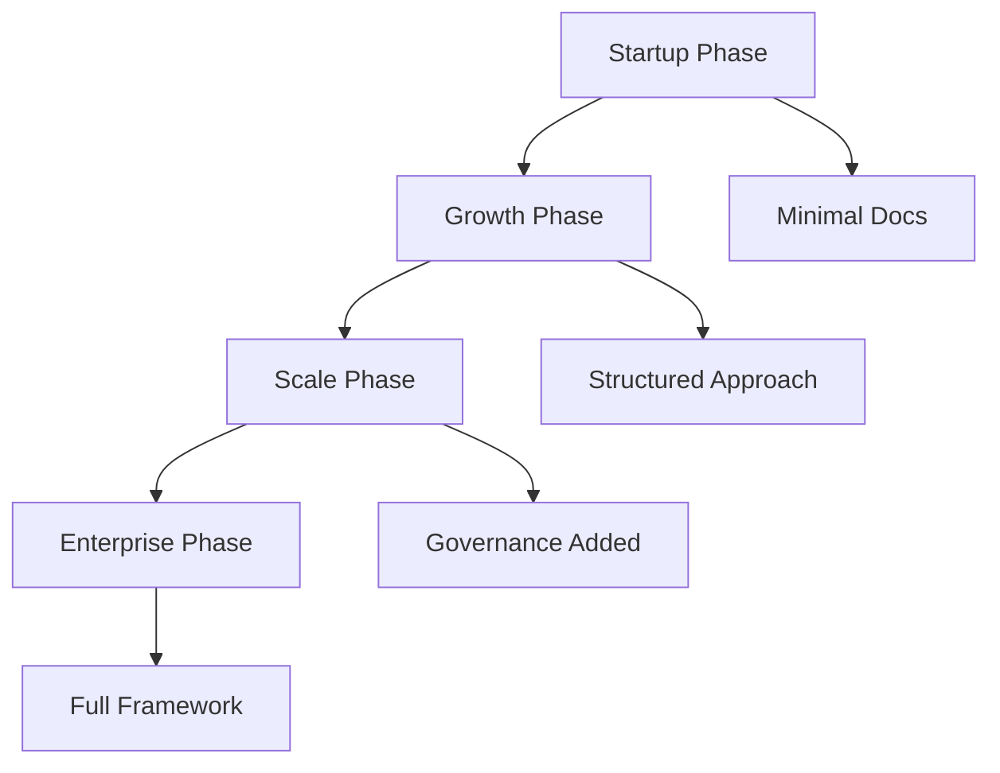

# Architecture Documentation Scalability Evaluation

## Overview

This evaluation analyzes how different architecture documentation methodologies scale across various dimensions: team size, project complexity, organizational growth, and time.

## Scalability Dimensions

### 1. Team Size Scalability



#### Methodology Performance by Team Size

| Methodology | Solo | Small Team | Medium Team | Large Team | Enterprise |
|------------|------|------------|-------------|------------|------------|
| **Progressive** | ⭐⭐⭐⭐⭐ | ⭐⭐⭐⭐ | ⭐⭐ | ⭐ | ❌ |
| **ADRs** | ⭐⭐⭐⭐ | ⭐⭐⭐⭐⭐ | ⭐⭐⭐⭐⭐ | ⭐⭐⭐⭐ | ⭐⭐⭐ |
| **C4 Model** | ⭐⭐⭐ | ⭐⭐⭐⭐ | ⭐⭐⭐⭐⭐ | ⭐⭐⭐⭐⭐ | ⭐⭐⭐⭐ |
| **Arc42** | ⭐⭐ | ⭐⭐⭐ | ⭐⭐⭐⭐ | ⭐⭐⭐⭐⭐ | ⭐⭐⭐⭐⭐ |
| **TOGAF** | ❌ | ⭐ | ⭐⭐ | ⭐⭐⭐⭐ | ⭐⭐⭐⭐⭐ |
| **Docs-as-Code** | ⭐⭐⭐⭐ | ⭐⭐⭐⭐⭐ | ⭐⭐⭐⭐⭐ | ⭐⭐⭐⭐ | ⭐⭐⭐⭐ |

#### Scaling Challenges and Solutions

**Progressive Documentation**
- **Challenge**: Becomes chaotic at 10+ developers
- **Solution**: Migrate to structured approach before growth
- **Breaking Point**: ~8 developers

**ADRs**
- **Challenge**: Finding relevant decisions at scale
- **Solution**: Categorization, search, indexing
- **Breaking Point**: ~500 ADRs

**C4 Model**
- **Challenge**: Diagram maintenance with many teams
- **Solution**: Team ownership, automated generation
- **Breaking Point**: ~20 teams

**Arc42**
- **Challenge**: Coordination across sections
- **Solution**: Clear ownership, review process
- **Breaking Point**: Scales well with process

**TOGAF**
- **Challenge**: Overhead for small teams
- **Solution**: Start at enterprise scale only
- **Breaking Point**: Needs 20+ to justify

### 2. Project Complexity Scalability

#### Complexity Metrics

```python
def calculate_complexity_score(project):
    factors = {
        'components': len(project.components),
        'integrations': len(project.external_systems),
        'data_flows': len(project.data_flows),
        'stakeholders': len(project.stakeholders),
        'compliance_requirements': len(project.regulations),
        'deployment_targets': len(project.environments)
    }
    
    weights = {
        'components': 0.25,
        'integrations': 0.20,
        'data_flows': 0.15,
        'stakeholders': 0.20,
        'compliance_requirements': 0.10,
        'deployment_targets': 0.10
    }
    
    return sum(factors[k] * weights[k] for k in factors)
```

#### Methodology Fit by Complexity

| Complexity | Score | Best Fit | Acceptable | Avoid |
|------------|-------|----------|------------|-------|
| **Simple** | 0-20 | Progressive, ADRs | C4, Docs-as-Code | Arc42, TOGAF |
| **Moderate** | 21-50 | C4 + ADRs | Arc42 subset, DDD | TOGAF |
| **Complex** | 51-80 | Arc42, C4 Full | TOGAF subset | Progressive alone |
| **Very Complex** | 81-100 | TOGAF, Arc42 | Multiple combined | Single approach |

### 3. Organizational Growth Scalability

#### Growth Stages and Documentation Needs



#### Methodology Evolution Path

**Stage 1: Startup (0-2 years)**
- Team: 1-10 people
- Docs: README + basic diagrams
- Method: Progressive
- Time: 2-5% on docs

**Stage 2: Growth (2-5 years)**
- Team: 10-50 people
- Docs: Structured architecture
- Method: C4 + ADRs
- Time: 5-10% on docs

**Stage 3: Scale (5-10 years)**
- Team: 50-200 people
- Docs: Comprehensive system
- Method: Arc42 or similar
- Time: 10-15% on docs

**Stage 4: Enterprise (10+ years)**
- Team: 200+ people
- Docs: Full governance
- Method: TOGAF + others
- Time: 15-20% on docs

### 4. Time-Based Scalability

#### Documentation Decay Rates

| Methodology | Half-Life | Update Frequency | Decay Resistance |
|------------|-----------|------------------|------------------|
| Progressive | 3 months | Daily | Low |
| ADRs | Never | Append-only | Very High |
| C4 Model | 6 months | Weekly | Medium |
| Arc42 | 4 months | Bi-weekly | Medium |
| TOGAF | 12 months | Quarterly | High |
| Docs-as-Code | 2 months | Continuous | High |

#### Long-term Sustainability Factors

```python
def sustainability_score(methodology, years):
    base_scores = {
        'Progressive': 80,
        'ADRs': 95,
        'C4': 85,
        'Arc42': 75,
        'TOGAF': 70,
        'Docs-as-Code': 90
    }
    
    decay_rates = {
        'Progressive': 0.20,  # 20% decay per year
        'ADRs': 0.02,        # 2% decay per year
        'C4': 0.10,          # 10% decay per year
        'Arc42': 0.15,       # 15% decay per year
        'TOGAF': 0.08,       # 8% decay per year
        'Docs-as-Code': 0.05 # 5% decay per year
    }
    
    score = base_scores[methodology]
    decay = decay_rates[methodology]
    
    return score * (1 - decay) ** years
```

### 5. Technical Scalability

#### Repository Size Growth

| Methodology | 1 Year | 3 Years | 5 Years | Growth Rate |
|------------|--------|---------|---------|-------------|
| Progressive | 50 MB | 200 MB | 500 MB | Exponential |
| ADRs | 10 MB | 35 MB | 65 MB | Linear |
| C4 Model | 100 MB | 350 MB | 600 MB | Moderate |
| Arc42 | 150 MB | 500 MB | 900 MB | High |
| TOGAF | 500 MB | 1.5 GB | 2.5 GB | Very High |
| Docs-as-Code | 75 MB | 250 MB | 450 MB | Controlled |

#### Search and Retrieval Performance

```sql
-- Query performance at scale
CREATE INDEX idx_docs_content ON documentation(content);
CREATE INDEX idx_docs_metadata ON documentation(metadata);
CREATE INDEX idx_docs_timestamp ON documentation(updated_at);

-- Example search query complexity
SELECT * FROM documentation
WHERE content LIKE '%architecture%'
AND metadata->>'type' = 'decision'
AND updated_at > NOW() - INTERVAL '6 months'
ORDER BY relevance DESC
LIMIT 10;
```

## Scalability Patterns and Anti-Patterns

### Successful Scaling Patterns

#### Pattern 1: Federated Documentation
```
Central Repository
├── Core Architecture (small team)
├── Team A Docs (autonomous)
├── Team B Docs (autonomous)
└── Shared Standards (governance)
```

**Benefits:**
- Scales to 100+ teams
- Maintains autonomy
- Central oversight
- Parallel updates

#### Pattern 2: Layered Abstraction
```
Level 1: Executive Summary (1 page)
Level 2: System Overview (10 pages)
Level 3: Component Details (100 pages)
Level 4: Implementation Specs (1000+ pages)
```

**Benefits:**
- Different audiences
- Managed complexity
- Selective detail
- Efficient navigation

#### Pattern 3: Automated Generation
```python
def generate_docs():
    # Extract from code
    components = analyze_codebase()
    
    # Generate diagrams
    c4_diagrams = create_c4_views(components)
    
    # Update documentation
    update_markdown(c4_diagrams)
    
    # Validate completeness
    validate_coverage(components)
```

**Benefits:**
- Scales infinitely
- Always current
- Reduced manual work
- Consistent format

### Scaling Anti-Patterns

#### Anti-Pattern 1: Monolithic Documentation
- Single massive document
- One owner/bottleneck
- Slow updates
- Poor searchability

#### Anti-Pattern 2: Documentation Sprawl
- No structure
- Duplicate content
- Inconsistent formats
- Lost information

#### Anti-Pattern 3: Over-Documentation
- Document everything
- No prioritization
- Maintenance burden
- Reader overload

## Scalability Metrics and Monitoring

### Key Performance Indicators

| Metric | Target | Warning | Critical |
|--------|--------|---------|----------|
| Time to Find Info | <5 min | 5-15 min | >15 min |
| Update Frequency | Weekly | Monthly | Quarterly |
| Coverage | >80% | 60-80% | <60% |
| Accuracy | >90% | 70-90% | <70% |
| Team Satisfaction | >4/5 | 3-4/5 | <3/5 |

### Monitoring Dashboard

```yaml
# monitoring-config.yml
metrics:
  - name: documentation_searches
    type: counter
    labels: [query_type, result_found]
    
  - name: update_frequency
    type: histogram
    buckets: [1d, 7d, 30d, 90d]
    
  - name: page_load_time
    type: gauge
    target: <2s
    
  - name: broken_links
    type: counter
    alert_threshold: 10
```

## Scalability Recommendations by Scenario

### Scenario 1: Rapid Growth Startup

**Current:** 5 developers, progressive docs
**Projection:** 50 developers in 2 years

**Recommendation:**
1. Month 1-3: Introduce C4 Context
2. Month 4-6: Add ADRs for decisions
3. Month 7-9: Implement Docs-as-Code
4. Month 10-12: Add automation
5. Year 2: Consider Arc42 structure

### Scenario 2: Enterprise Modernization

**Current:** 500 developers, TOGAF
**Goal:** Increase agility

**Recommendation:**
1. Keep TOGAF for governance
2. Add C4 for system views
3. Implement ADRs for decisions
4. Use Docs-as-Code for teams
5. Federate documentation

### Scenario 3: Open Source Project

**Current:** 10 contributors
**Goal:** Scale to 100+

**Recommendation:**
1. Start with great README
2. Add contribution guides
3. Use C4 for architecture
4. Automate everything
5. Focus on searchability

## Scalability Cost Analysis

### Total Cost of Ownership at Scale

| Team Size | Progressive | C4+ADRs | Arc42 | TOGAF |
|-----------|------------|---------|-------|-------|
| 10 people | $10K/year | $20K/year | $40K/year | $100K/year |
| 50 people | Breaks down | $75K/year | $150K/year | $300K/year |
| 100 people | N/A | $125K/year | $250K/year | $500K/year |
| 500 people | N/A | $400K/year | $800K/year | $2M/year |

### Efficiency at Scale

```python
def efficiency_ratio(team_size, methodology):
    # Hours spent on docs per developer per week
    base_hours = {
        'Progressive': 1,
        'C4+ADRs': 2,
        'Arc42': 3,
        'TOGAF': 5
    }
    
    # Scaling factors (how effort grows with team)
    scaling = {
        'Progressive': 1.5,  # Chaos growth
        'C4+ADRs': 1.1,     # Slight growth
        'Arc42': 1.2,       # Moderate growth
        'TOGAF': 1.05       # Efficient at scale
    }
    
    hours = base_hours[methodology] * (team_size ** 0.1) * scaling[methodology]
    value = get_documentation_value(methodology, team_size)
    
    return value / hours  # Value per hour invested
```

## Future-Proofing Strategies

### Technology Evolution Preparedness

| Methodology | AI/ML Ready | Cloud Native | Microservices | Serverless |
|------------|-------------|--------------|---------------|------------|
| Progressive | ⭐⭐ | ⭐⭐⭐ | ⭐⭐ | ⭐⭐⭐ |
| ADRs | ⭐⭐⭐⭐⭐ | ⭐⭐⭐⭐ | ⭐⭐⭐⭐ | ⭐⭐⭐⭐ |
| C4 Model | ⭐⭐⭐⭐ | ⭐⭐⭐⭐⭐ | ⭐⭐⭐⭐⭐ | ⭐⭐⭐⭐ |
| Arc42 | ⭐⭐⭐ | ⭐⭐⭐ | ⭐⭐⭐⭐ | ⭐⭐⭐ |
| TOGAF | ⭐⭐ | ⭐⭐ | ⭐⭐⭐ | ⭐⭐ |
| Docs-as-Code | ⭐⭐⭐⭐⭐ | ⭐⭐⭐⭐⭐ | ⭐⭐⭐⭐ | ⭐⭐⭐⭐⭐ |

### Emerging Trends Compatibility

1. **AI-Assisted Documentation**
   - Best: Docs-as-Code, ADRs
   - Good: C4 Model
   - Challenging: TOGAF, Arc42

2. **Real-time Collaboration**
   - Best: Docs-as-Code, Progressive
   - Good: C4, ADRs
   - Challenging: Arc42, TOGAF

3. **Automated Compliance**
   - Best: TOGAF, Arc42
   - Good: ADRs with metadata
   - Challenging: Progressive

## Conclusion

### Scalability Winners by Category

- **Team Growth**: C4 Model + ADRs
- **Complexity**: Arc42 or TOGAF
- **Time**: ADRs + Automation
- **Technology**: Docs-as-Code
- **Cost**: Progressive → C4 migration

### Key Scalability Principles

1. **Start simple, evolve deliberately**
2. **Automate before you scale**
3. **Federate at team boundaries**
4. **Measure and adjust continuously**
5. **Invest in search and discovery**

### Final Recommendation

For most organizations, the optimal scalable approach is:
- **Foundation**: ADRs + Docs-as-Code principles
- **Structure**: C4 Model for visualization
- **Growth**: Add Arc42 sections as needed
- **Scale**: Federate and automate

This combination provides the best balance of initial simplicity and long-term scalability.