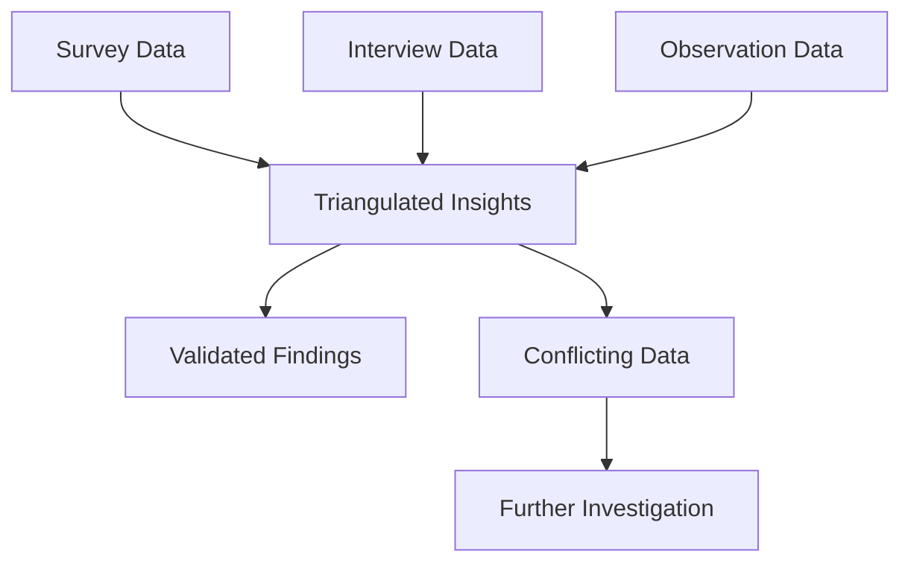

# User Feedback Collection Framework

## Overview
This framework provides structured methods for collecting both quantitative and qualitative feedback on architectural documentation methodologies.

## 1. Survey Templates

### 1.1 Pre-Implementation Survey
```yaml
survey_id: pre_implementation_baseline
target_audience: all_stakeholders
estimated_time: 10_minutes

sections:
  demographics:
    - role: 
        type: single_choice
        options: [developer, architect, manager, qa, devops, product]
    - experience_years:
        type: range
        min: 0
        max: 30
    - team_size:
        type: number
    - documentation_frequency:
        type: single_choice
        options: [daily, weekly, monthly, rarely, never]

  current_state:
    - current_pain_points:
        type: multi_choice
        options:
          - hard_to_find_information
          - outdated_documentation
          - inconsistent_formats
          - missing_information
          - too_technical
          - not_technical_enough
          - poor_searchability
          - no_version_control
    - time_spent_searching:
        type: scale
        question: "Hours per week spent searching for documentation"
        min: 0
        max: 20
    - documentation_satisfaction:
        type: likert
        scale: 5
        labels: [very_dissatisfied, dissatisfied, neutral, satisfied, very_satisfied]

  expectations:
    - most_important_features:
        type: ranking
        options:
          - searchability
          - visual_diagrams
          - code_examples
          - api_documentation
          - deployment_guides
          - architecture_overviews
          - troubleshooting_guides
    - preferred_format:
        type: multi_choice
        options: [web, pdf, markdown, interactive, video]
```

### 1.2 Post-Implementation Survey
```yaml
survey_id: post_implementation_evaluation
target_audience: pilot_participants
estimated_time: 15_minutes

sections:
  methodology_specific:
    - ease_of_use:
        type: likert
        scale: 10
        question: "How easy was it to use [METHODOLOGY_NAME]?"
    - learning_curve:
        type: scale
        question: "Days to become proficient"
        min: 1
        max: 30
    - efficiency_gain:
        type: percentage
        question: "Estimated time saved compared to previous approach"
        min: -100
        max: 100

  task_completion:
    - find_information:
        type: composite
        metrics:
          - time_taken: number
          - clicks_required: number
          - success: boolean
          - confidence: scale_1_10
    - update_documentation:
        type: composite
        metrics:
          - time_taken: number
          - files_modified: number
          - errors_encountered: number
          - help_needed: boolean

  satisfaction:
    - overall_satisfaction:
        type: likert
        scale: 10
    - recommendation_likelihood:
        type: nps
        scale: 10
    - continue_using:
        type: yes_no_maybe
    - biggest_benefit:
        type: open_text
        max_length: 500
    - biggest_challenge:
        type: open_text
        max_length: 500

  comparative:
    - versus_previous:
        type: comparison
        better_worse_same:
          - findability
          - accuracy
          - completeness
          - maintainability
          - usability
```

## 2. Interview Protocols

### 2.1 Structured Interview Guide
```markdown
## Opening (5 minutes)
- Introduction and consent
- Explain purpose and confidentiality
- Set expectations for 30-minute duration

## Background (5 minutes)
1. Tell me about your role and how you use documentation
2. What types of documentation do you interact with most?
3. How often do you create vs. consume documentation?

## Methodology Experience (15 minutes)
1. Walk me through your first experience with [METHODOLOGY]
   - What was intuitive?
   - What was confusing?
   
2. Describe a recent task where you used the documentation
   - How long did it take?
   - Did you find what you needed?
   - What would have made it easier?

3. Compare this to your previous documentation experience
   - What's better?
   - What's worse?
   - What's missing?

4. Show me how you would [SPECIFIC TASK]
   - Observe navigation patterns
   - Note pain points
   - Record time taken

## Future Improvements (5 minutes)
1. If you could change three things, what would they be?
2. What features from other tools would you like to see?
3. Would you recommend this to other teams? Why/why not?

## Closing (5 minutes)
- Any additional comments?
- Thank participant
- Explain next steps
```

### 2.2 Focus Group Discussion Guide
```markdown
## Pre-Session Setup
- 6-8 participants max
- Mixed roles and experience levels
- 60-minute session
- Record with consent
- Have methodology demo ready

## Introduction (10 minutes)
- Welcome and introductions
- Ground rules (respect, confidentiality, participation)
- Session objectives

## Current State Discussion (15 minutes)
- "What's your biggest documentation frustration?"
- "Describe your ideal documentation system"
- "How do you currently share knowledge?"

## Methodology Demonstration (10 minutes)
- Live demo of methodology
- Highlight key features
- Show real examples

## Guided Discussion (20 minutes)
1. Initial Reactions
   - First impressions?
   - Excitement vs. concerns?

2. Practical Application
   - How would this fit your workflow?
   - What would need to change?
   - Training requirements?

3. Team Dynamics
   - Impact on collaboration?
   - Knowledge sharing improvements?
   - Onboarding benefits?

4. Comparison Exercise
   - Better/worse than current?
   - Missing features?
   - Unnecessary complexity?

## Prioritization Exercise (10 minutes)
- Vote on most valuable features
- Identify must-haves vs. nice-to-haves
- Discuss deal-breakers

## Closing (5 minutes)
- Summary of key points
- Next steps
- Thank participants
```

## 3. Observational Study Framework

### 3.1 Task-Based Observation Protocol
```yaml
study_design:
  participants: 10_per_methodology
  duration: 2_hours_per_session
  environment: participant_workspace
  recording: screen_and_audio

tasks:
  task_1_find_information:
    description: "Find the API endpoint for user authentication"
    metrics:
      - time_to_complete
      - navigation_path
      - search_queries_used
      - documentation_sections_visited
      - success_rate
      - confidence_level
    observations:
      - confusion_points
      - aha_moments
      - workarounds_used
      - external_resources_consulted

  task_2_understand_architecture:
    description: "Explain how the payment system works"
    metrics:
      - comprehension_accuracy
      - diagrams_referenced
      - time_spent_per_section
      - questions_generated
    observations:
      - reading_patterns
      - note_taking_behavior
      - diagram_interaction
      - cross_reference_usage

  task_3_update_documentation:
    description: "Document a new feature you just implemented"
    metrics:
      - time_to_complete
      - files_created_modified
      - template_usage
      - validation_errors
      - preview_checks
    observations:
      - workflow_efficiency
      - tool_familiarity
      - error_recovery
      - collaboration_needs

post_task_debrief:
  questions:
    - "Walk me through your thought process"
    - "What was most helpful?"
    - "What was most frustrating?"
    - "How confident are you in your result?"
    - "What would you do differently?"
```

### 3.2 Longitudinal Diary Study
```markdown
## Study Duration: 4 weeks

### Weekly Check-ins
**Week 1: Initial Adoption**
- Daily time log of documentation interactions
- Pain points encountered
- Learning moments
- Tool issues

**Week 2: Building Proficiency**
- Efficiency improvements noticed
- Workflow adaptations made
- Collaboration experiences
- Feature requests

**Week 3: Regular Usage**
- Routine established?
- Time savings realized?
- Quality improvements?
- Team adoption status?

**Week 4: Evaluation**
- Overall experience reflection
- Comparison to previous methods
- Sustainability assessment
- Recommendation rationale

### Daily Prompts
1. "How many times did you use documentation today?"
2. "Rate today's documentation experience (1-10)"
3. "Biggest win today?"
4. "Biggest frustration today?"
5. "One thing you learned?"
```

## 4. Analytics and Metrics Collection

### 4.1 Quantitative Metrics Dashboard
```yaml
real_time_metrics:
  usage_analytics:
    - page_views_per_user
    - session_duration
    - bounce_rate
    - search_queries
    - 404_errors
    - download_frequency

  performance_metrics:
    - page_load_time
    - search_response_time
    - build_duration
    - update_propagation_time
    - concurrent_user_capacity

  quality_metrics:
    - broken_links_count
    - outdated_content_flags
    - validation_errors
    - test_coverage
    - documentation_completeness

  collaboration_metrics:
    - contributors_per_month
    - pull_requests_merged
    - review_turnaround_time
    - comments_per_document
    - cross_team_contributions
```

### 4.2 Sentiment Analysis Framework
```python
def analyze_feedback_sentiment(feedback_text):
    """
    Analyze sentiment from open-text feedback
    """
    categories = {
        'positive_indicators': [
            'easy', 'helpful', 'clear', 'efficient', 'love',
            'great', 'excellent', 'improved', 'faster', 'better'
        ],
        'negative_indicators': [
            'difficult', 'confusing', 'slow', 'frustrating',
            'unclear', 'missing', 'broken', 'worse', 'complex'
        ],
        'feature_requests': [
            'would be nice', 'wish', 'need', 'should have',
            'missing', 'add', 'include', 'want'
        ]
    }
    
    sentiment_scores = {
        'positive': 0,
        'negative': 0,
        'neutral': 0,
        'actionable_feedback': []
    }
    
    # Analyze and categorize feedback
    # Return structured sentiment data
    return sentiment_scores
```

## 5. Feedback Synthesis Framework

### 5.1 Data Triangulation Method


### 5.2 Insight Prioritization Matrix
```yaml
prioritization_criteria:
  impact:
    high: "Affects >75% of users"
    medium: "Affects 25-75% of users"
    low: "Affects <25% of users"
  
  effort:
    high: "Major methodology change required"
    medium: "Moderate configuration/training needed"
    low: "Minor adjustment possible"
  
  urgency:
    high: "Blocking adoption"
    medium: "Impeding efficiency"
    low: "Nice to have improvement"

priority_matrix:
  critical: high_impact + low_effort + high_urgency
  important: high_impact + medium_effort
  quick_wins: low_effort + medium_impact
  backlog: low_impact + high_effort
```

## 6. Reporting Templates

### 6.1 Weekly Feedback Summary
```markdown
# Week [X] Feedback Summary

## Quantitative Highlights
- Response Rate: X%
- Average Satisfaction: X/10
- NPS Score: X
- Task Completion Rate: X%

## Key Themes
### Positive
1. [Theme 1] - Mentioned by X% of respondents
2. [Theme 2] - Mentioned by X% of respondents

### Challenges
1. [Challenge 1] - Reported by X users
2. [Challenge 2] - Severity: High/Medium/Low

## Actionable Items
- [ ] [Action 1] - Owner: [Name] - Due: [Date]
- [ ] [Action 2] - Owner: [Name] - Due: [Date]

## Quotes
> "Representative positive quote" - Role

> "Representative challenge quote" - Role
```

### 6.2 Methodology Comparison Report
```markdown
# Methodology Comparison Report

## Executive Summary
[2-3 paragraph overview of findings]

## Methodology Scorecard
| Criteria | Framework | Docs-as-Data | Mermaid | Modular |
|----------|-----------|--------------|---------|---------|
| Ease of Use | 8.2/10 | 7.5/10 | 8.8/10 | 7.9/10 |
| Setup Time | 2 hrs | 4 hrs | 1 hr | 3 hrs |
| Maintenance | 85% | 78% | 82% | 80% |
| Adoption | 88% | 72% | 91% | 84% |
| ROI | 3.2x | 2.8x | 3.5x | 3.0x |

## Detailed Analysis
[Per methodology strengths/weaknesses]

## Recommendation
[Clear recommendation with rationale]

## Implementation Roadmap
[If applicable, phased approach]
```

## 7. Continuous Improvement Process

### 7.1 Feedback Loop Implementation
```yaml
feedback_cycle:
  collect:
    frequency: weekly
    channels: [surveys, analytics, support_tickets]
  
  analyze:
    frequency: bi_weekly
    methods: [sentiment_analysis, trend_detection, root_cause]
  
  prioritize:
    frequency: monthly
    criteria: [impact, effort, strategic_alignment]
  
  implement:
    frequency: per_sprint
    communication: [changelog, announcement, training]
  
  measure:
    frequency: quarterly
    metrics: [adoption_rate, satisfaction_score, efficiency_gains]
```

### 7.2 Stakeholder Communication Plan
```markdown
## Communication Channels

### For Developers
- Slack: #docs-feedback
- Weekly standup updates
- Changelog in repository

### For Management
- Monthly executive summary
- Quarterly ROI report
- Annual strategic review

### For Users
- In-app feedback widget
- Quarterly survey
- User forum

### For Champions
- Bi-weekly sync meeting
- Private feedback channel
- Early access program
```

## Conclusion

This comprehensive feedback collection framework ensures:
1. **Multi-modal data collection** for complete picture
2. **Structured analysis** for actionable insights
3. **Continuous improvement** based on user needs
4. **Stakeholder alignment** through regular communication
5. **Data-driven decisions** for methodology selection

Success depends on consistent execution and genuine commitment to incorporating user feedback into the evolution of documentation practices.