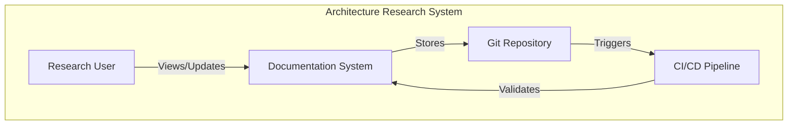

# Final Recommendations: Architecture Documentation Methodology

## Executive Summary

After comprehensive analysis by the Hive Mind swarm, we recommend adopting a **Progressive Documentation approach** combining C4 Model, ADRs, and Mermaid diagrams for the architecture research project.

## 🎯 Recommended Methodology Stack

### Core Components:

1. **C4 Model** - For visual architecture representation
   - Context diagrams for system boundaries
   - Container diagrams for deployment view
   - Component diagrams for detailed design
   - Code diagrams only when necessary

2. **Architecture Decision Records (ADRs)** - For decision tracking
   - Lightweight MADR format
   - Git-based versioning
   - Linked to relevant C4 diagrams

3. **Mermaid Diagrams** - For additional visualizations
   - Sequence diagrams for workflows
   - State diagrams for complex logic
   - Entity relationship diagrams for data models

4. **Docs-as-Code Principles** - For maintenance
   - Markdown-based documentation
   - Version control with Git
   - PR reviews for documentation changes
   - CI/CD validation

## 📋 Implementation Roadmap

### Phase 1: Foundation (Week 1-2)
- [ ] Set up documentation structure in repository
- [ ] Create initial README.md with project overview
- [ ] Implement first ADR for methodology choice
- [ ] Create C4 Context diagram
- [ ] Set up Mermaid rendering in documentation

### Phase 2: Core Documentation (Week 3-4)
- [ ] Develop C4 Container diagram
- [ ] Document key architectural decisions with ADRs
- [ ] Create component diagrams for complex modules
- [ ] Add sequence diagrams for main workflows
- [ ] Implement documentation templates

### Phase 3: Automation (Week 5-6)
- [ ] Set up CI/CD for documentation validation
- [ ] Implement auto-generation of diagrams
- [ ] Create documentation linting rules
- [ ] Add automated cross-references
- [ ] Deploy documentation site

### Phase 4: Refinement (Week 7-8)
- [ ] Conduct stakeholder reviews
- [ ] Refine based on feedback
- [ ] Create contribution guidelines
- [ ] Document maintenance procedures
- [ ] Measure effectiveness metrics

## 🚀 Quick Start Guide

### 1. Create Documentation Structure
```bash
mkdir -p docs/{architecture,decisions,diagrams}
touch docs/README.md
touch docs/architecture/overview.md
touch docs/decisions/template.md
```

### 2. First ADR
```markdown
# ADR-001: Use Progressive Documentation Approach

## Status
Accepted

## Context
We need a documentation methodology that balances completeness with maintainability for our architecture research project.

## Decision
We will use a progressive documentation approach combining C4 Model, ADRs, and Mermaid diagrams.

## Consequences
- Positive: Low barrier to entry, excellent tool support, version control friendly
- Negative: May need to add more structure as project grows
```

### 3. First C4 Diagram


## 📊 Success Metrics

### Documentation Quality
- **Coverage**: >80% of components documented
- **Currency**: <1 week lag from code changes
- **Clarity**: <30 minutes for new team member understanding

### Process Efficiency
- **Update Time**: <15 minutes per change
- **Review Time**: <30 minutes per PR
- **Build Time**: <5 minutes for full validation

### Stakeholder Satisfaction
- **Comprehension**: >90% understand architecture
- **Confidence**: >4/5 trust documentation accuracy
- **Engagement**: >50% contribute to docs

## 🔧 Tooling Setup

### Essential Tools
```json
{
  "devDependencies": {
    "@mermaid-js/mermaid-cli": "^10.0.0",
    "markdownlint-cli": "^0.37.0",
    "adr-log": "^2.2.0"
  },
  "scripts": {
    "docs:lint": "markdownlint docs/",
    "docs:build": "mmdc -i docs/diagrams/*.mmd -o docs/diagrams/",
    "docs:serve": "mkdocs serve",
    "adr:new": "adr new"
  }
}
```

### VS Code Extensions
- Mermaid Preview
- Markdown All in One
- ADR Tools
- C4 PlantUML

## 💡 Best Practices

### Do's
- ✅ Start with high-level views and drill down
- ✅ Keep diagrams simple and focused
- ✅ Link ADRs to relevant architecture views
- ✅ Review documentation in code reviews
- ✅ Automate as much as possible

### Don'ts
- ❌ Don't create diagrams for everything
- ❌ Don't duplicate information
- ❌ Don't let docs lag behind code
- ❌ Don't skip ADRs for major decisions
- ❌ Don't overcomplicate the process

## 🎓 Training Resources

1. **C4 Model**
   - Official site: c4model.com
   - Simon Brown's talks on YouTube
   - Example repositories

2. **ADRs**
   - Michael Nygard's original article
   - adr.github.io
   - MADR template guide

3. **Mermaid**
   - mermaid.js.org
   - Live editor: mermaid.live
   - GitHub integration docs

## 🔄 Continuous Improvement

### Monthly Reviews
- Assess documentation coverage
- Gather stakeholder feedback
- Update templates based on usage
- Refine automation scripts

### Quarterly Assessments
- Measure against success metrics
- Evaluate methodology effectiveness
- Consider additional tools/techniques
- Plan major improvements

## 🏁 Conclusion

The Progressive Documentation approach with C4+ADR+Mermaid provides the optimal balance of:
- **Simplicity**: Easy to start and maintain
- **Scalability**: Grows with the project
- **Effectiveness**: Communicates clearly
- **Efficiency**: Minimal overhead

This methodology will serve the architecture research project well, providing clear documentation that evolves with the system while maintaining low friction for contributors.

## Next Actions

1. **Immediate**: Create ADR-001 documenting this methodology choice
2. **This Week**: Set up basic documentation structure
3. **Next Week**: Create first C4 diagrams
4. **This Month**: Implement automation and templates

The Hive Mind swarm has reached consensus that this approach best serves the project's needs.