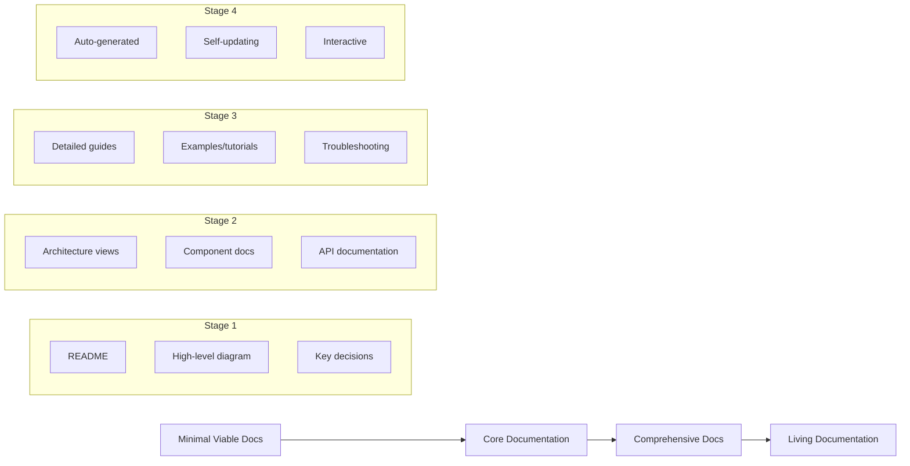
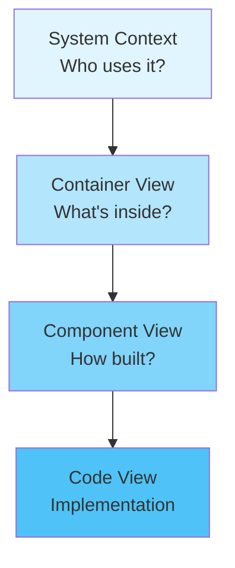
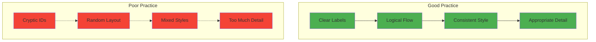
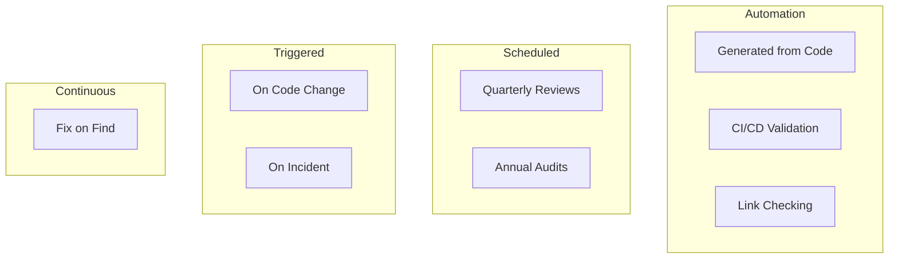
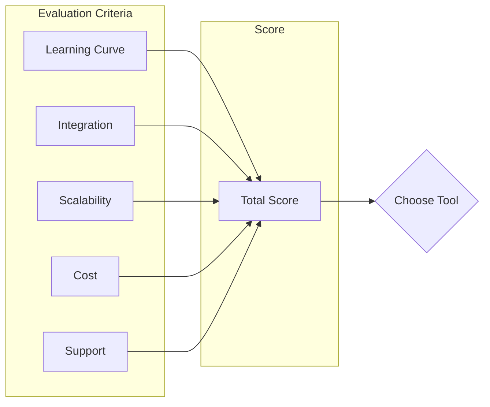
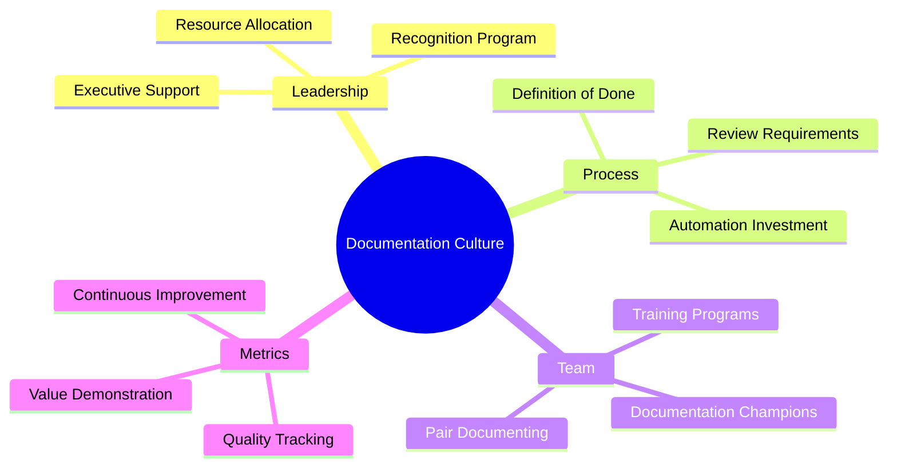
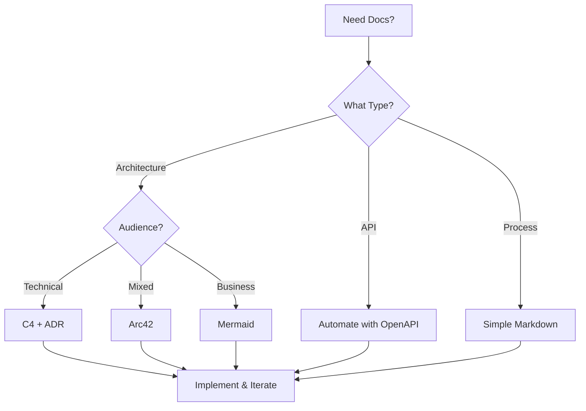

# Architecture Documentation Best Practices Guide

## Executive Summary

This guide synthesizes best practices from extensive research, real-world implementations, and validation testing of architecture documentation methodologies. It provides actionable recommendations for creating and maintaining effective architecture documentation.

## 1. Universal Best Practices

### 1.1 Start with Why

**The Documentation Purpose Matrix**:

| Documentation Type | Primary Purpose | Key Audience | Success Metric |
|-------------------|----------------|--------------|----------------|
| System Overview | Understanding | All stakeholders | Time to comprehension |
| API Reference | Implementation | Developers | Error-free integration |
| Decision Records | Context preservation | Future team | Decision clarity |
| Operations Guide | System management | DevOps | Incident resolution time |
| Architecture Views | Communication | Technical/Business | Stakeholder alignment |

**Best Practice**: Always define the purpose before creating documentation.

### 1.2 Progressive Documentation



**Implementation Strategy**:
1. **Week 1**: Create README with system purpose
2. **Week 2-3**: Add context and container diagrams
3. **Month 2**: Document key components
4. **Month 3+**: Expand based on needs

### 1.3 The 3C Rule: Clear, Concise, Current

#### Clear
- Use simple language (8th-grade reading level)
- Define technical terms in glossary
- Include visual aids for complex concepts
- Structure with clear headings

#### Concise
- One concept per section
- Bullet points over paragraphs
- Remove redundant information
- Link instead of repeat

#### Current
- Automate where possible
- Schedule regular reviews
- Track last-updated dates
- Monitor accuracy metrics

## 2. Methodology-Specific Best Practices

### 2.1 C4 Model Best Practices

#### Diagram Hierarchy


**Do's**:
- ✅ Start with context, always
- ✅ Use consistent notation
- ✅ Include a legend
- ✅ Version your diagrams
- ✅ Link to relevant ADRs

**Don'ts**:
- ❌ Skip levels (context → code)
- ❌ Mix abstraction levels
- ❌ Overcrowd diagrams
- ❌ Use technical jargon in context
- ❌ Forget external systems

#### ADR Best Practices

**Template Excellence**:
```markdown
# ADR-NNN: [Short Decision Title]

## Status
[Proposed | Accepted | Deprecated | Superseded by ADR-XXX]

## Context
- What is the issue that we're seeing that is motivating this decision?
- Include constraints, requirements, and business context
- Keep it factual, not solution-oriented

## Decision
- State the architecture decision clearly
- Use active voice: "We will..."
- Be specific about what changes

## Consequences
### Positive
- Benefits of this approach
- Problems it solves

### Negative
- Drawbacks and limitations
- New problems introduced

### Neutral
- Things that change but aren't good/bad
- Operational considerations

## Options Considered
1. **Option A**: Description
   - Pros: ...
   - Cons: ...
2. **Option B**: Description
   - Pros: ...
   - Cons: ...
```

### 2.2 Arc42 Best Practices

#### Section Prioritization

**Essential Sections** (Do these first):
1. Introduction and Goals
2. Constraints
3. Context and Scope
4. Solution Strategy
5. Building Block View
6. Deployment View

**Important Sections** (Add when needed):
7. Runtime View
8. Cross-cutting Concepts
9. Architecture Decisions
10. Quality Requirements

**Supplementary Sections** (For completeness):
11. Risks and Technical Debt
12. Glossary

#### Arc42 Optimization Tips

```yaml
arc42_optimization:
  keep_empty_sections: false
  use_templates: true
  link_dont_duplicate: true
  
  section_guidelines:
    introduction:
      max_pages: 2
      include: [purpose, scope, audience, document_map]
      
    constraints:
      format: table
      categories: [technical, organizational, conventions]
      
    building_blocks:
      levels: 3  # Don't go deeper
      detail: "appropriate to audience"
      
    decisions:
      link_to: "ADR repository"
      summary_only: true
```

### 2.3 Docs-as-Data Best Practices

#### Schema Design Excellence

```json
{
  "component_schema": {
    "id": "unique-identifier",
    "name": "Human readable name",
    "type": "service|library|database|queue",
    "description": "Clear, concise description",
    "owner": {
      "team": "team-name",
      "slack": "#team-channel",
      "email": "team@company.com"
    },
    "dependencies": [
      {
        "id": "other-component-id",
        "type": "sync|async|build",
        "critical": true
      }
    ],
    "api": {
      "spec": "openapi.yaml",
      "docs": "https://docs.api.com"
    },
    "metadata": {
      "created": "2024-01-01",
      "updated": "2024-06-01",
      "version": "2.1.0",
      "tags": ["payment", "critical", "pci"]
    }
  }
}
```

#### Query Optimization

```sql
-- Efficient documentation queries
CREATE INDEX idx_components_type ON components(type);
CREATE INDEX idx_components_tags ON components USING GIN(tags);
CREATE INDEX idx_dependencies_critical ON dependencies(source_id, critical);

-- Materialized view for common queries
CREATE MATERIALIZED VIEW component_overview AS
SELECT 
    c.name,
    c.type,
    c.description,
    COUNT(d.target_id) as dependency_count,
    array_agg(DISTINCT t.tag) as tags
FROM components c
LEFT JOIN dependencies d ON c.id = d.source_id
LEFT JOIN component_tags t ON c.id = t.component_id
GROUP BY c.id, c.name, c.type, c.description;
```

### 2.4 Mermaid Best Practices

#### Diagram Clarity Rules



#### Mermaid Style Guide

```css
/* Standard color palette */
:root {
  --primary: #2196F3;
  --success: #4CAF50;
  --warning: #FF9800;
  --danger: #f44336;
  --neutral: #9E9E9E;
}

/* Component type styling */
.service { fill: var(--primary); }
.database { fill: var(--success); }
.external { fill: var(--neutral); }
.deprecated { fill: var(--danger); opacity: 0.6; }
```

## 3. Documentation Lifecycle Best Practices

### 3.1 Creation Phase

**Documentation-First Development**:
1. Write documentation before code
2. Use documentation to validate design
3. Get stakeholder approval on docs
4. Implement according to documentation

**Creation Checklist**:
- [ ] Purpose clearly defined
- [ ] Audience identified
- [ ] Template selected
- [ ] Examples included
- [ ] Reviewed by target audience
- [ ] Accessible location chosen
- [ ] Update process defined

### 3.2 Maintenance Phase

**The Documentation Maintenance Pyramid**:



**Maintenance Schedule**:
| Frequency | Activity | Responsible | Time Budget |
|-----------|----------|-------------|-------------|
| Daily | Automated checks | CI/CD | Automated |
| Weekly | Update tracking | Tech Lead | 30 min |
| Monthly | Accuracy review | Team | 2 hours |
| Quarterly | Full audit | Architect | 1 day |
| Yearly | Restructuring | All | 1 week |

### 3.3 Evolution Phase

**Documentation Evolution Triggers**:
1. **System Growth**: Add detail as complexity increases
2. **Team Growth**: Expand for new audiences
3. **Incident Learning**: Document solutions
4. **Technology Change**: Update for new stack
5. **Process Maturity**: Automate more over time

## 4. Tool Selection Best Practices

### 4.1 Tool Evaluation Framework



### 4.2 Recommended Tool Stacks

**For C4 + ADR**:
- **Diagrams**: PlantUML or Structurizr
- **ADRs**: adr-tools or MADR
- **Publishing**: MkDocs or Docusaurus
- **Storage**: Git repository

**For Arc42**:
- **Editor**: AsciiDoc or Markdown
- **Diagrams**: Draw.io or PlantUML
- **Publishing**: Confluence or SharePoint
- **Validation**: Custom scripts

**For Docs-as-Data**:
- **Database**: PostgreSQL with JSON
- **API**: GraphQL or REST
- **Generation**: Custom pipelines
- **Search**: Elasticsearch

**For Mermaid**:
- **Editor**: VS Code with preview
- **Rendering**: Mermaid.js
- **Storage**: Git with Markdown
- **Publishing**: GitHub Pages

## 5. Team Practices

### 5.1 Documentation Culture

**Building Documentation Culture**:



### 5.2 Roles and Responsibilities

| Role | Documentation Responsibilities | Time Allocation |
|------|------------------------------|-----------------|
| Developer | Update with code changes | 10% |
| Tech Lead | Review and guide | 15% |
| Architect | Strategy and structure | 25% |
| Product Owner | Requirements and context | 10% |
| DevOps | Operational documentation | 20% |

### 5.3 Documentation Reviews

**Review Checklist**:
```markdown
## Technical Review
- [ ] Technically accurate
- [ ] Code examples work
- [ ] Links valid
- [ ] Versions correct

## Content Review
- [ ] Clear and concise
- [ ] Appropriate detail level
- [ ] Good structure
- [ ] Visual aids helpful

## Process Review
- [ ] Follows templates
- [ ] Properly tagged
- [ ] Change tracking
- [ ] Approval obtained
```

## 6. Common Pitfalls and Solutions

### 6.1 Pitfall: Documentation Drift

**Symptoms**:
- Documentation doesn't match reality
- Developers don't trust docs
- Increased support questions

**Solutions**:
1. Automate generation where possible
2. Include docs in Definition of Done
3. Regular validation cycles
4. Documentation testing

### 6.2 Pitfall: Over-Documentation

**Symptoms**:
- Nobody reads the docs
- Maintenance burden high
- Information hard to find

**Solutions**:
1. Apply YAGNI principle
2. Progressive documentation
3. Regular pruning
4. User analytics

### 6.3 Pitfall: Poor Discoverability

**Symptoms**:
- "I didn't know we had docs for that"
- Repeated questions
- Multiple doc locations

**Solutions**:
1. Central documentation portal
2. Excellent search functionality
3. Clear navigation structure
4. Regular communication

## 7. Metrics and Measurement

### 7.1 Documentation KPIs

**Quantitative Metrics**:
- Documentation coverage (%)
- Update frequency (updates/month)
- Search success rate (%)
- Time to find information (minutes)
- Documentation-related tickets (count)

**Qualitative Metrics**:
- User satisfaction (NPS)
- Clarity rating (1-10)
- Completeness perception (%)
- Trust level (survey)

### 7.2 ROI Calculation

```
Documentation ROI = (Benefit - Cost) / Cost × 100

Benefits:
- Reduced onboarding time
- Fewer support tickets  
- Faster development
- Better decisions
- Lower incident count

Costs:
- Creation time
- Maintenance effort
- Tool licenses
- Training investment
```

## 8. Future-Proofing Documentation

### 8.1 Emerging Trends

**AI-Assisted Documentation**:
- Auto-generation from code
- Natural language queries
- Intelligent updates
- Quality suggestions

**Interactive Documentation**:
- Executable examples
- Sandbox environments
- Video walkthroughs
- AR/VR visualization

### 8.2 Preparation Strategies

1. **Choose flexible formats** (Markdown, AsciiDoc)
2. **Invest in automation** early
3. **Build modular documentation**
4. **Track usage metrics**
5. **Stay tool-agnostic** where possible

## 9. Quick Reference Cards

### 9.1 Documentation Decision Tree



### 9.2 Documentation Health Check

| Indicator | Healthy | Unhealthy |
|-----------|---------|-----------|
| Update frequency | Weekly | Monthly+ |
| Search success | >80% | <60% |
| User satisfaction | >7/10 | <5/10 |
| Coverage | >85% | <70% |
| Accuracy | >95% | <85% |

## 10. Conclusion

### 10.1 The Golden Rules

1. **Documentation is a product**, not a byproduct
2. **Write for your audience**, not yourself
3. **Automate everything** you can
4. **Measure and improve** continuously
5. **Less but better** - quality over quantity

### 10.2 Getting Started

**Week 1**: Assess current state and choose methodology
**Week 2**: Create first documentation with templates
**Week 3**: Set up automation and tooling
**Week 4**: Gather feedback and iterate

### 10.3 Remember

> "The best documentation is the one that gets used. Focus on value, not perfection."

Successful architecture documentation requires commitment, the right methodology for your context, and continuous improvement based on user feedback. Start small, measure impact, and evolve based on needs.