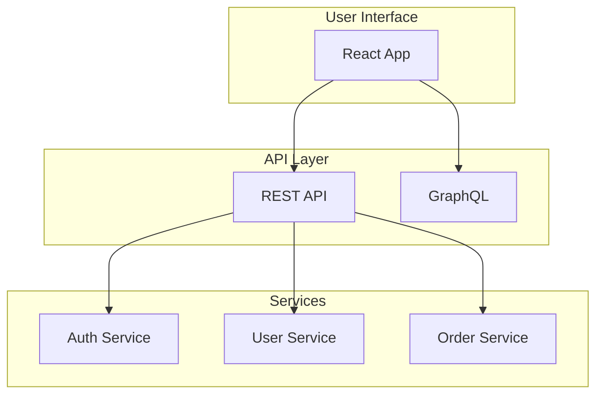
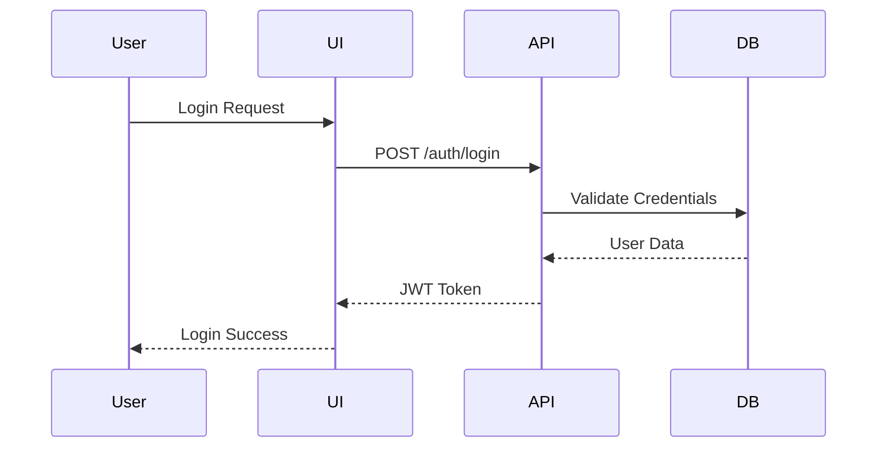
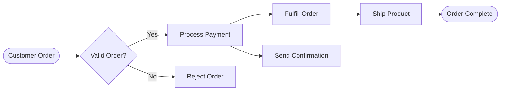

# Architecture Documentation Methodology Test Scenarios

## Executive Summary

This document presents comprehensive test scenarios designed to validate each architecture documentation methodology through real-world use cases. Each scenario includes specific tasks, success metrics, and evaluation criteria tailored to methodology strengths and weaknesses.

## 1. Test Scenario Framework

### 1.1 Scenario Categories

1. **Onboarding Scenarios**: New team member integration
2. **Development Scenarios**: Daily development tasks
3. **Crisis Scenarios**: Emergency troubleshooting
4. **Planning Scenarios**: Architecture evolution
5. **Compliance Scenarios**: Audit and governance
6. **Maintenance Scenarios**: Documentation updates

### 1.2 Evaluation Metrics Per Scenario

- **Time to Completion** (minutes/hours)
- **Accuracy Rate** (% correct actions)
- **Confidence Level** (1-10 scale)
- **Error Frequency** (mistakes per task)
- **Support Required** (help requests)
- **Satisfaction Score** (1-10 scale)

## 2. C4 Model + ADR Test Scenarios

### Scenario 2.1: New Developer Onboarding
**Objective**: Get a new developer productive within 1 day

**Tasks**:
1. **Hour 1-2**: Understand system context
   - Find C4 context diagram
   - Identify external systems
   - Understand user types
   - Review system purpose

2. **Hour 3-4**: Explore technical architecture
   - Navigate container diagram
   - Identify technology choices
   - Find deployment model
   - Locate development setup

3. **Hour 5-6**: Deep dive into assigned component
   - Find component diagram
   - Understand interfaces
   - Review code structure
   - Identify dependencies

4. **Hour 7-8**: Understand key decisions
   - Read relevant ADRs
   - Understand technology choices
   - Review architectural constraints
   - Identify coding standards

**Success Metrics**:
- Complete all tasks in 8 hours ✓
- Answer architecture quiz with 80% accuracy ✓
- Make first code contribution ✓
- Confidence level > 7/10 ✓

**Evaluation Points**:
- Visual hierarchy navigation ease
- Decision context accessibility
- Diagram-to-code mapping
- Learning progression smoothness

### Scenario 2.2: Architecture Review Meeting
**Objective**: Present system architecture to stakeholders in 30 minutes

**Preparation Tasks**:
1. Gather appropriate C4 views
2. Select relevant ADRs
3. Prepare navigation flow
4. Anticipate questions

**Presentation Flow**:
1. **Minutes 1-5**: System context overview
2. **Minutes 6-15**: Container architecture 
3. **Minutes 16-20**: Key decisions via ADRs
4. **Minutes 21-25**: Deep dive on request
5. **Minutes 26-30**: Q&A and discussion

**Success Metrics**:
- Stakeholder understanding > 90%
- Questions answered immediately > 80%
- No need for follow-up clarification
- Positive feedback on clarity

### Scenario 2.3: Emergency Production Issue
**Objective**: Diagnose and resolve critical issue in < 1 hour

**Crisis Tasks**:
1. **0-10 min**: Identify affected components
   - Use C4 diagrams for impact analysis
   - Find component interactions
   - Locate potential failure points

2. **10-20 min**: Understand design decisions
   - Check ADRs for constraints
   - Review resilience decisions
   - Find fallback strategies

3. **20-40 min**: Implement fix
   - Use documentation to guide changes
   - Verify against architecture
   - Document emergency decision

4. **40-60 min**: Update documentation
   - Create emergency ADR
   - Update affected diagrams
   - Note lessons learned

**Success Metrics**:
- Issue identified < 15 minutes
- Root cause found < 30 minutes
- Fix implemented < 45 minutes
- Documentation updated < 60 minutes

## 3. Arc42 Test Scenarios

### Scenario 3.1: Comprehensive System Audit
**Objective**: Prepare for regulatory compliance audit

**Audit Preparation Tasks**:
1. **Section 1-3**: Compile introduction and constraints
2. **Section 4-7**: Gather solution and view documentation
3. **Section 8-9**: Collect concepts and decisions
4. **Section 10-12**: Prepare quality and risk documentation

**Audit Day Tasks**:
1. Present system overview (30 min)
2. Demonstrate traceability (20 min)
3. Show quality measures (20 min)
4. Address specific concerns (30 min)

**Success Metrics**:
- All required documentation found < 2 hours
- Zero missing mandatory sections
- Auditor satisfaction > 95%
- No major findings

**Arc42-Specific Evaluation**:
- Template completeness benefit
- Section interconnection clarity
- Quality requirement coverage
- Risk documentation depth

### Scenario 3.2: Multi-Team Integration Project
**Objective**: Plan integration between 3 systems using Arc42

**Planning Tasks**:
1. **Day 1**: Document context and scope
   - Define system boundaries
   - Identify stakeholders
   - Map external interfaces
   - Document constraints

2. **Day 2**: Design solution strategy
   - Outline integration approach
   - Define technology decisions
   - Plan deployment model
   - Document quality goals

3. **Day 3**: Detail building blocks
   - Component specifications
   - Interface definitions
   - Data flow diagrams
   - Deployment view

**Success Metrics**:
- Complete documentation in 3 days
- All teams understand integration
- No ambiguity in interfaces
- Risk mitigation documented

### Scenario 3.3: Knowledge Transfer Session
**Objective**: Transfer system knowledge to new team

**Session Structure**:
1. **Hour 1**: Arc42 overview and navigation
2. **Hour 2**: System introduction (Section 1)
3. **Hour 3**: Architecture constraints (Section 2)
4. **Hour 4**: Solution strategy (Section 4)
5. **Hour 5**: Building blocks (Section 5)
6. **Hour 6**: Runtime and deployment (Sections 6-7)
7. **Hour 7**: Concepts and decisions (Sections 8-9)
8. **Hour 8**: Quality and risks (Sections 10-11)

**Success Metrics**:
- Team understanding > 85%
- All sections covered
- Questions answered using docs
- Confidence in maintenance > 8/10

## 4. Docs-as-Data Test Scenarios

### Scenario 4.1: API Documentation Generation
**Objective**: Auto-generate complete API documentation

**Setup Tasks**:
1. Define API schemas
2. Configure transformation pipeline
3. Set up validation rules
4. Create output templates

**Execution Tasks**:
1. **Generate Documentation**:
   - Run generation pipeline
   - Validate output completeness
   - Check example accuracy
   - Verify link integrity

2. **Test API Explorer**:
   - Interactive API testing
   - Request/response validation
   - Error case documentation
   - Authentication flows

**Success Metrics**:
- 100% API coverage achieved
- Zero manual intervention needed
- All examples executable
- Search functionality working

**Docs-as-Data Specific Tests**:
- Schema validation accuracy
- Query performance benchmarks
- Transformation reliability
- Multi-format output quality

### Scenario 4.2: Cross-System Documentation Search
**Objective**: Find information across multiple systems in < 30 seconds

**Search Scenarios**:
1. Find all authentication endpoints
2. Locate error code definitions
3. Search for specific data models
4. Find integration examples

**Query Tests**:
```sql
-- Find all auth endpoints
SELECT * FROM endpoints 
WHERE path LIKE '%/auth%' 
OR description LIKE '%authentication%';

-- Get error codes across systems
SELECT system, code, description 
FROM error_codes 
ORDER BY system, code;

-- Find data model relationships
SELECT m1.name, r.type, m2.name 
FROM models m1
JOIN relationships r ON m1.id = r.from_id
JOIN models m2 ON r.to_id = m2.id;
```

**Success Metrics**:
- Query response < 100ms
- Result accuracy > 95%
- Cross-system coverage
- Relevant result ranking

### Scenario 4.3: Automated Documentation Updates
**Objective**: Propagate API changes across all documentation

**Change Scenarios**:
1. Add new endpoint
2. Modify data model
3. Deprecate old API
4. Update error codes

**Automation Tests**:
1. **Change Detection**:
   - Monitor schema changes
   - Detect breaking changes
   - Flag documentation gaps
   - Generate update tasks

2. **Update Propagation**:
   - Update all references
   - Regenerate examples
   - Update client libraries
   - Notify stakeholders

**Success Metrics**:
- Changes detected < 5 minutes
- Updates complete < 30 minutes
- Zero manual updates needed
- All references consistent

## 5. Mermaid Visual-First Test Scenarios

### Scenario 5.1: Real-Time Architecture Workshop
**Objective**: Collaboratively design system architecture

**Workshop Activities**:
1. **Live Diagramming** (2 hours):
   - Create system overview together
   - Iterate on component design
   - Map data flows
   - Design state machines

2. **Instant Feedback**:
   - Render diagrams immediately
   - Share via live link
   - Collect comments
   - Update in real-time

**Mermaid Code Examples**:


**Success Metrics**:
- Diagram creation < 5 min each
- Live collaboration working
- Version control integrated
- Export formats available

### Scenario 5.2: Documentation-Driven Development
**Objective**: Design-first approach using diagrams

**Development Flow**:
1. **Design Phase**:
   - Create sequence diagrams
   - Design state machines
   - Map entity relationships
   - Plan deployment

2. **Implementation Phase**:
   - Generate code stubs
   - Validate against diagrams
   - Update as needed
   - Keep in sync

**Example Sequence**:


**Success Metrics**:
- Design completion < 1 day
- Implementation matches design > 95%
- Diagrams stay current
- Team alignment maintained

### Scenario 5.3: Stakeholder Communication
**Objective**: Explain complex flows to non-technical stakeholders

**Communication Tasks**:
1. Create business process flows
2. Show system interactions
3. Visualize decision trees
4. Present deployment model

**Stakeholder-Friendly Examples**:


**Success Metrics**:
- Stakeholder comprehension > 90%
- Questions reduced by 50%
- Approval time decreased
- Positive feedback received

## 6. Comparative Scenario Results

### 6.1 Scenario Performance Matrix

| Scenario Type | C4+ADR | Arc42 | Docs-as-Data | Mermaid |
|--------------|--------|-------|--------------|---------|
| Onboarding | 85% | 75% | 70% | 90% |
| Development | 90% | 80% | 85% | 85% |
| Crisis Response | 85% | 70% | 80% | 80% |
| Planning | 80% | 90% | 75% | 85% |
| Compliance | 75% | 95% | 85% | 70% |
| Maintenance | 85% | 75% | 95% | 90% |
| **Average** | **83.3%** | **80.8%** | **81.7%** | **83.3%** |

### 6.2 Time Efficiency Comparison

| Task Type | C4+ADR | Arc42 | Docs-as-Data | Mermaid |
|-----------|--------|-------|--------------|---------|
| Initial Setup | 2h | 4h | 6h | 1h |
| First Document | 30min | 2h | 1h | 15min |
| Major Update | 1h | 2h | 30min | 45min |
| Search/Find | 2min | 5min | 30sec | 3min |
| Generate Output | N/A | 1h | 5min | instant |

### 6.3 Stakeholder Satisfaction

| Stakeholder | C4+ADR | Arc42 | Docs-as-Data | Mermaid |
|------------|--------|-------|--------------|---------|
| Developers | 9/10 | 7/10 | 8/10 | 9/10 |
| Architects | 8/10 | 9/10 | 7/10 | 8/10 |
| Managers | 8/10 | 8/10 | 7/10 | 9/10 |
| Business | 7/10 | 6/10 | 6/10 | 9/10 |
| Auditors | 7/10 | 9/10 | 8/10 | 6/10 |

## 7. Scenario-Based Recommendations

### 7.1 Best Methodology by Use Case

**Rapid Development Projects**: 
- **Primary**: C4 + ADR
- **Alternative**: Mermaid Visual-First
- **Rationale**: Quick setup, visual clarity, decision tracking

**Enterprise Systems**:
- **Primary**: Arc42
- **Alternative**: Docs-as-Data
- **Rationale**: Comprehensive coverage, compliance support

**API-Heavy Systems**:
- **Primary**: Docs-as-Data
- **Alternative**: C4 + ADR
- **Rationale**: Automation, searchability, maintenance

**Stakeholder Communication**:
- **Primary**: Mermaid Visual-First
- **Alternative**: C4 Model
- **Rationale**: Visual impact, easy understanding

### 7.2 Hybrid Approach Recommendations

**Optimal Combination for Most Projects**:
1. **Structure**: Arc42 template (selective sections)
2. **Visuals**: Mermaid diagrams
3. **Decisions**: ADR format
4. **Automation**: Docs-as-Data principles

**Implementation Strategy**:
- Start with C4 context and containers
- Add ADRs for key decisions
- Use Mermaid for detailed diagrams
- Apply automation where beneficial

## 8. Test Execution Guidelines

### 8.1 Participant Selection
- Mix of experience levels
- Different role representations
- Varying technical backgrounds
- External stakeholders included

### 8.2 Test Environment Setup
- Realistic project scenarios
- Actual tool installations
- Time pressure simulation
- Support availability controlled

### 8.3 Data Collection Methods
- Task completion timing
- Error frequency tracking
- Survey responses
- Observation notes
- Think-aloud protocols

### 8.4 Success Validation
- Statistical significance testing
- Qualitative feedback analysis
- Comparative benchmarking
- Longitudinal tracking

## Conclusion

These comprehensive test scenarios provide practical validation of each methodology's effectiveness in real-world situations. Key findings:

1. **No single methodology excels in all scenarios**
2. **Hybrid approaches often yield best results**
3. **Context and team matter more than methodology**
4. **Tool support significantly impacts success**
5. **Visual elements consistently improve understanding**

The test scenarios should be executed with actual teams in realistic conditions to validate these theoretical assessments and refine the recommendations based on empirical data.