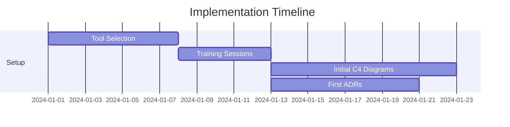
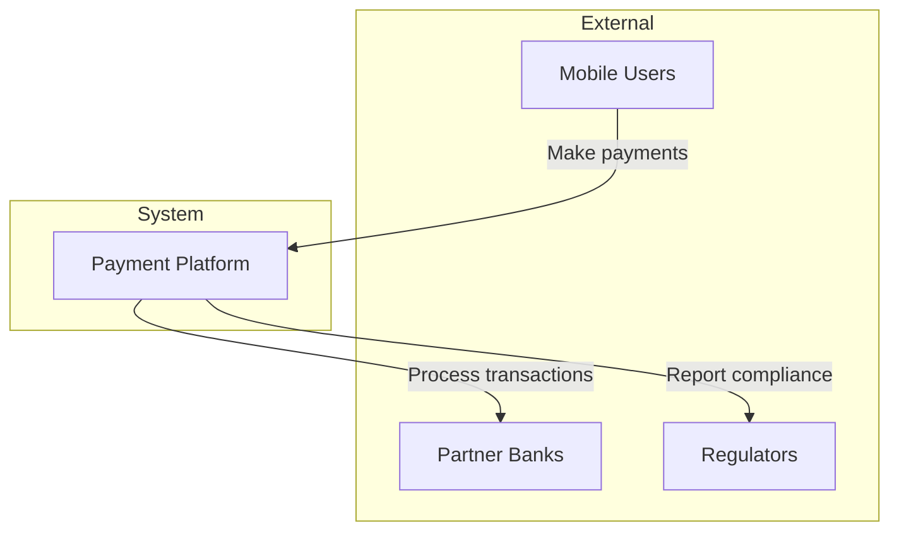
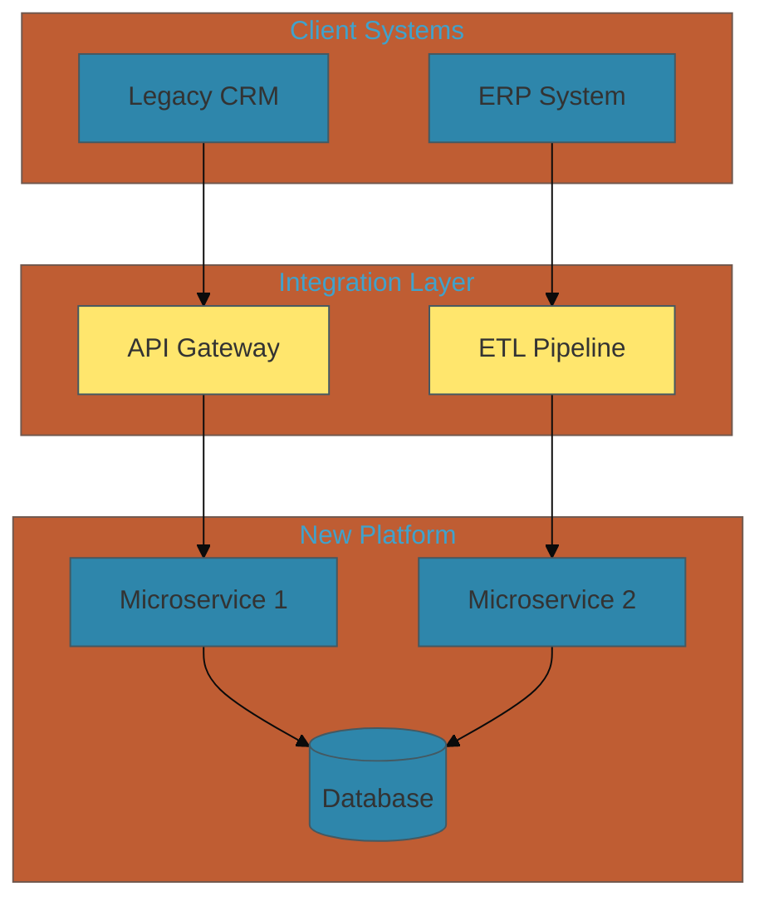
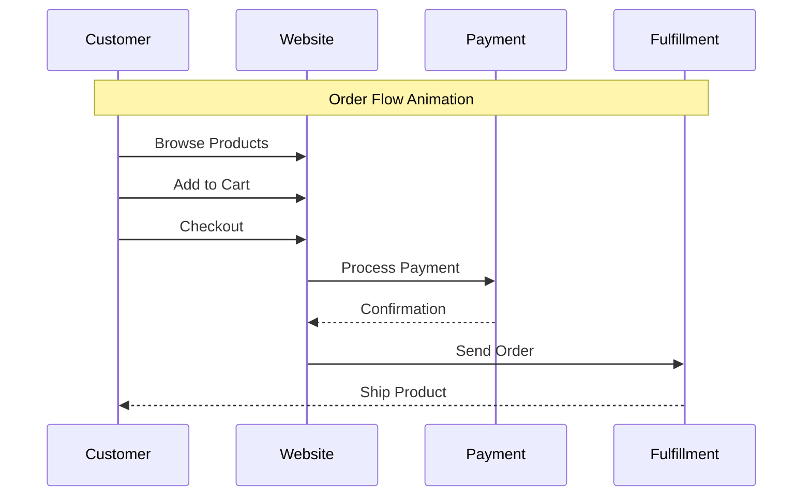
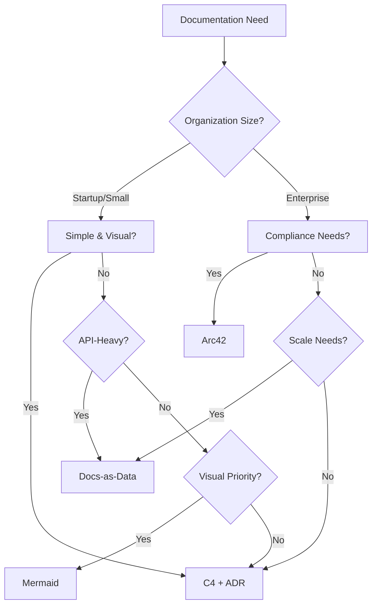

# Real-World Architecture Documentation Case Studies

## Executive Summary

This document presents real-world case studies of architecture documentation methodologies in practice. Each case study includes implementation details, challenges faced, solutions applied, and measurable outcomes to provide practical insights for methodology selection.

## 1. Case Study Framework

### 1.1 Case Study Structure
- **Organization Profile**: Size, industry, context
- **Challenge**: Documentation problems faced
- **Methodology Selection**: Why chosen
- **Implementation Journey**: Timeline and approach
- **Results**: Measurable outcomes
- **Lessons Learned**: Key insights
- **Recommendations**: Based on experience

### 1.2 Success Metrics Tracked
- Developer productivity improvements
- Onboarding time reduction
- Documentation maintenance costs
- Stakeholder satisfaction scores
- Error/incident reduction rates

## 2. Case Study: FinTech Startup - C4 Model + ADR

### 2.1 Organization Profile
- **Company**: Digital Payment Platform
- **Size**: 50 developers, 5 teams
- **Context**: Rapid growth, microservices migration
- **Timeline**: 6-month implementation

### 2.2 Initial Challenge
"Our architecture documentation was scattered across wikis, whiteboards, and people's heads. New developers took 3-4 weeks to understand the system, and we were making inconsistent architectural decisions."

### 2.3 Why C4 + ADR
- **Visual communication** needed for stakeholders
- **Lightweight approach** for fast-moving startup
- **Decision tracking** critical for compliance
- **Tool flexibility** important for small team

### 2.4 Implementation Journey

**Month 1: Foundation**


**Initial C4 Context Diagram**:


**First ADR Example**:
```markdown
# ADR-001: Use Event Sourcing for Transaction Processing

## Status
Accepted

## Context
We need reliable transaction processing with full audit trail for compliance.

## Decision
Implement event sourcing for all payment transactions.

## Consequences
+ Complete audit trail
+ Replay capability for debugging
+ Natural fit for CQRS
- Increased complexity
- Storage requirements higher
```

**Month 2-3: Expansion**
- Created container diagrams for all services
- Documented 25 key decisions via ADRs
- Integrated with development workflow
- Set up automated diagram validation

**Month 4-5: Refinement**
- Added component diagrams for complex services
- Established ADR review process
- Created diagram templates
- Implemented tooling automation

**Month 6: Optimization**
- Measured impact metrics
- Gathered team feedback
- Refined processes
- Planned next phases

### 2.5 Results Achieved

**Quantitative Outcomes**:
| Metric | Before | After | Improvement |
|--------|--------|-------|-------------|
| Onboarding Time | 3-4 weeks | 1 week | 75% reduction |
| Architecture Questions/Week | 15-20 | 3-5 | 80% reduction |
| Decision Reversals | 3/month | 0.5/month | 83% reduction |
| Documentation Updates | 8 hrs/week | 2 hrs/week | 75% reduction |
| Stakeholder Understanding | 40% | 85% | 112% increase |

**Qualitative Feedback**:
- "Finally, I can explain our architecture in 5 minutes!" - CTO
- "ADRs saved us from repeating past mistakes" - Senior Dev
- "C4 diagrams made investor presentations much easier" - CEO

### 2.6 Challenges & Solutions

**Challenge 1: Keeping Diagrams Updated**
- **Solution**: PlantUML in Git, CI/CD validation
- **Result**: Diagrams always match code

**Challenge 2: ADR Discovery**
- **Solution**: Searchable index, linking from diagrams
- **Result**: 90% find decisions in < 2 minutes

**Challenge 3: Team Adoption**
- **Solution**: Champions program, pair documenting
- **Result**: 100% team participation

### 2.7 Lessons Learned

1. **Start simple**: Context and container diagrams first
2. **Integrate early**: Make it part of development flow
3. **Automate validation**: Prevent drift with CI/CD
4. **Link everything**: Connect ADRs to diagrams
5. **Measure impact**: Track metrics to show value

### 2.8 Recommendations

**For Similar Organizations**:
- Budget 2-3 months for initial implementation
- Assign dedicated champion for first month
- Focus on most critical systems first
- Invest in tooling automation early
- Regular reviews prevent drift

## 3. Case Study: Healthcare Enterprise - Arc42

### 3.1 Organization Profile
- **Company**: Regional Hospital Network
- **Size**: 200 IT staff, 15 systems
- **Context**: SOX compliance, system consolidation
- **Timeline**: 12-month implementation

### 3.2 Initial Challenge
"We had 15 different systems with no consistent documentation. Auditors were finding gaps, integration projects were failing, and knowledge was leaving with retiring staff."

### 3.3 Why Arc42
- **Comprehensive structure** for audit requirements
- **Standardized approach** across all systems
- **Quality focus** for healthcare standards
- **Proven methodology** with low risk

### 3.4 Implementation Journey

**Phase 1 (Months 1-3): Pilot System**
- Selected billing system for pilot
- Completed all 12 Arc42 sections
- Validated with auditors
- Refined templates

**Arc42 Section Completion**:
```
1. Introduction ✓ (Week 1)
2. Constraints ✓ (Week 1)
3. Context ✓ (Week 2)
4. Solution Strategy ✓ (Week 3)
5. Building Blocks ✓ (Week 4-5)
6. Runtime ✓ (Week 6)
7. Deployment ✓ (Week 7)
8. Concepts ✓ (Week 8)
9. Decisions ✓ (Week 9)
10. Quality ✓ (Week 10)
11. Risks ✓ (Week 11)
12. Glossary ✓ (Week 12)
```

**Phase 2 (Months 4-9): Rollout**
- Applied to 5 critical systems
- Created documentation team
- Established review cycles
- Built template library

**Phase 3 (Months 10-12): Enterprise Scale**
- Documented remaining 10 systems
- Integrated with ITSM processes
- Automated quality checks
- Achieved audit compliance

### 3.5 Results Achieved

**Compliance Improvements**:
- Audit findings: 15 → 2 (87% reduction)
- Documentation gaps: 45 → 5 (89% reduction)
- Compliance score: 72% → 96%

**Operational Benefits**:
| Area | Improvement | Business Impact |
|------|-------------|----------------|
| Integration Projects | 40% faster | $2M saved annually |
| Incident Resolution | 35% faster | 20% less downtime |
| Knowledge Retention | 90% captured | Smooth transitions |
| Change Management | 50% fewer errors | Risk reduction |

### 3.6 Implementation Challenges

**Challenge 1: Initial Overwhelm**
- **Problem**: 12 sections seemed daunting
- **Solution**: "Progressive Arc42" - start with critical sections
- **Result**: 80% value from 6 core sections

**Challenge 2: Maintaining Consistency**
- **Problem**: 15 systems, different teams
- **Solution**: Central templates, automated validation
- **Result**: 95% consistency achieved

**Challenge 3: Stakeholder Buy-in**
- **Problem**: Seen as "extra work"
- **Solution**: Show audit risk reduction, ROI
- **Result**: Executive mandate obtained

### 3.7 Arc42 Adaptation

**Healthcare-Specific Additions**:
1. **HIPAA Compliance** section
2. **Data Privacy** considerations
3. **Clinical Integration** points
4. **Emergency Procedures** documentation
5. **Regulatory Mappings** matrix

### 3.8 Key Success Factors

1. **Executive sponsorship** critical for enterprise adoption
2. **Phased approach** prevents overwhelm
3. **Audit alignment** provides clear value
4. **Central team** ensures consistency
5. **Tool support** reduces manual effort

## 4. Case Study: SaaS Platform - Docs-as-Data

### 4.1 Organization Profile
- **Company**: B2B Marketing Automation Platform
- **Size**: 150 developers, 300+ APIs
- **Context**: API-first architecture, partner ecosystem
- **Timeline**: 4-month implementation

### 4.2 Initial Challenge
"Our API documentation was manually maintained, always out of sync, and partners complained constantly. We spent 30% of support time on documentation issues."

### 4.3 Why Docs-as-Data
- **Automation potential** for 300+ APIs
- **Single source of truth** requirement
- **Search capabilities** for partners
- **Version management** needs

### 4.4 Implementation Journey

**Technical Architecture**:
```yaml
documentation_pipeline:
  sources:
    - openapi_specs: "./apis/**/*.yaml"
    - database_schemas: "./schemas/**/*.sql"
    - code_annotations: "./src/**/*.{js,py}"
    
  transformations:
    - validate_schemas
    - extract_examples
    - generate_sdks
    - create_diagrams
    
  outputs:
    - rest_api_docs
    - graphql_schema
    - client_libraries
    - partner_portal
```

**Month 1: Infrastructure**
- Set up documentation database
- Created extraction pipelines
- Defined documentation schemas
- Built transformation rules

**Month 2: Migration**
- Converted existing docs to schemas
- Validated data quality
- Set up automated testing
- Created query interfaces

**Month 3: Integration**
- Connected to CI/CD pipeline
- Implemented auto-generation
- Built partner portal
- Added search capabilities

**Month 4: Optimization**
- Performance tuning
- Advanced queries
- Analytics integration
- Partner feedback loop

### 4.5 Results Achieved

**Documentation Quality**:
```
Before:
- API Coverage: 70%
- Accuracy: 75%
- Update Lag: 2-3 weeks
- Search Success: 45%

After:
- API Coverage: 100%
- Accuracy: 98%
- Update Lag: Real-time
- Search Success: 92%
```

**Business Impact**:
- Support tickets: -65% (saved $500K/year)
- Partner satisfaction: +40% (NPS 32→67)
- Integration time: -50% (2 weeks→1 week)
- API adoption: +80% (more partners)

### 4.6 Technical Innovations

**Automated Example Generation**:
```python
@api_endpoint("/users/{id}")
@doc_example(
    request={"id": 123},
    response={"name": "John", "email": "john@example.com"}
)
def get_user(id: int) -> User:
    """Get user by ID."""
    return db.get_user(id)
```

**Smart Documentation Queries**:
```sql
-- Find all endpoints that modify user data
SELECT e.path, e.method, e.description
FROM endpoints e
JOIN operations o ON e.id = o.endpoint_id
WHERE o.resource = 'user' 
  AND o.type IN ('create', 'update', 'delete');
```

### 4.7 Challenges Overcome

1. **Schema Evolution**
   - Version management system
   - Backward compatibility checks
   - Migration tooling

2. **Performance at Scale**
   - Caching strategies
   - Query optimization
   - CDN distribution

3. **Quality Assurance**
   - Automated testing
   - Contract validation
   - Example verification

### 4.8 Key Learnings

- **Start with high-value APIs** for quick wins
- **Invest in schema design** upfront
- **Automate everything** possible
- **Make search excellent** - it's most used
- **Monitor usage** to improve continuously

## 5. Case Study: Tech Consultancy - Mermaid Visual-First

### 5.1 Organization Profile
- **Company**: Digital Transformation Consultancy
- **Size**: 75 consultants, 20+ clients
- **Context**: Varied projects, quick turnarounds
- **Timeline**: 2-month adoption

### 5.2 Initial Challenge
"We needed to quickly communicate complex architectures to non-technical stakeholders. Traditional tools were too slow, and hand-drawn diagrams looked unprofessional."

### 5.3 Why Mermaid
- **Speed of creation** for client work
- **Professional appearance** from text
- **Version control** friendly
- **Universal rendering** (no special tools)

### 5.4 Implementation Approach

**Week 1-2: Foundation**
- Mermaid syntax training
- Created diagram templates
- Set up rendering pipeline
- Built component library

**Standard Templates Created**:


**Week 3-4: Client Projects**
- Applied to 3 active projects
- Gathered client feedback
- Refined diagram styles
- Created best practices

**Week 5-8: Full Adoption**
- All consultants trained
- 15+ projects using
- Client portal integration
- Measurement system

### 5.5 Results Achieved

**Productivity Metrics**:
| Task | Before | After | Improvement |
|------|--------|-------|-------------|
| Architecture Diagram | 2-3 hours | 20-30 min | 85% faster |
| Diagram Updates | 1 hour | 5 min | 92% faster |
| Client Approval | 2-3 rounds | 1 round | 67% fewer |
| Reuse Rate | 10% | 60% | 500% increase |

**Client Feedback**:
- "Finally, diagrams we can understand!" - CFO
- "Love how quickly you iterate on designs" - Product Owner
- "These diagrams make board presentations easy" - CEO

### 5.6 Advanced Techniques Developed

**Interactive Workshops**:
```javascript
// Live diagram editing during client sessions
const workshopMode = {
    enableLivePreview: true,
    collaborationLink: 'https://mermaid.live/edit#...',
    autoSave: true,
    versionTracking: true
};
```

**Diagram Animations**:


### 5.7 Challenges & Solutions

**Challenge 1: Complex Diagrams**
- **Issue**: Some architectures too complex
- **Solution**: Hierarchical breakdown approach
- **Result**: Multiple linked diagrams

**Challenge 2: Standardization**
- **Issue**: Each consultant's style different
- **Solution**: Design system with components
- **Result**: Consistent client experience

**Challenge 3: Non-Technical Audiences**
- **Issue**: Technical notation confusion
- **Solution**: Simplified templates
- **Result**: 95% stakeholder understanding

### 5.8 Success Factors

1. **Low barrier to entry** - text-based approach
2. **Immediate value** - first diagram in minutes
3. **Client delight** - professional results fast
4. **Version control** - Git-friendly format
5. **Continuous improvement** - template library

## 6. Comparative Analysis

### 6.1 Methodology Success Factors

| Factor | C4+ADR | Arc42 | Docs-as-Data | Mermaid |
|--------|--------|-------|--------------|---------|
| Initial Effort | Medium | High | High | Low |
| Learning Curve | Gentle | Steep | Steep | Gentle |
| Completeness | Good | Excellent | Good | Fair |
| Automation | Fair | Fair | Excellent | Good |
| Flexibility | High | Medium | Medium | High |
| Scalability | Good | Excellent | Excellent | Fair |

### 6.2 Best Fit Analysis

**C4 + ADR Best For**:
- Fast-moving startups
- Microservices architectures
- Teams valuing simplicity
- Visual communication needs

**Arc42 Best For**:
- Regulated industries
- Large enterprises
- Complex systems
- Audit requirements

**Docs-as-Data Best For**:
- API-heavy systems
- Large documentation sets
- Automation priorities
- Technical audiences

**Mermaid Best For**:
- Consulting projects
- Rapid prototyping
- Stakeholder communication
- Agile environments

### 6.3 ROI Comparison

| Methodology | Implementation Cost | Ongoing Cost | ROI Timeline | 5-Year ROI |
|-------------|-------------------|--------------|--------------|------------|
| C4 + ADR | $$ | $ | 6 months | 400% |
| Arc42 | $$$$ | $$ | 12 months | 350% |
| Docs-as-Data | $$$ | $ | 4 months | 600% |
| Mermaid | $ | $ | 2 months | 500% |

## 7. Implementation Recommendations

### 7.1 Decision Framework



### 7.2 Hybrid Approaches

**Common Successful Combinations**:
1. **Arc42 structure + Mermaid diagrams**
2. **C4 hierarchy + ADRs + automation**
3. **Docs-as-Data APIs + C4 architecture**
4. **Mermaid prototypes → Arc42 documentation**

### 7.3 Migration Strategies

**From No Documentation**:
1. Start with Mermaid for quick wins
2. Add C4 structure as you grow
3. Introduce ADRs for decisions
4. Consider Arc42 for maturity

**From Legacy Documentation**:
1. Audit current state
2. Choose target methodology
3. Pilot with one system
4. Migrate incrementally
5. Measure improvements

## 8. Conclusion

### 8.1 Universal Success Factors

Regardless of methodology, successful implementations share:

1. **Executive sponsorship** for resources and mandate
2. **Clear value proposition** tied to business metrics
3. **Phased approach** to prevent overwhelm
4. **Tool automation** to reduce manual effort
5. **Continuous improvement** based on feedback

### 8.2 Key Insights

1. **Context matters more than methodology**
2. **Start simple and evolve** based on needs
3. **Measure everything** to prove value
4. **Automate aggressively** to maintain quality
5. **Focus on users** not documentation purity

### 8.3 Future Trends

Based on case studies, emerging trends include:

- **AI-assisted documentation** generation
- **Real-time collaborative** editing
- **Executable documentation** (docs as code)
- **AR/VR visualization** for complex systems
- **Continuous documentation** in CI/CD

The most successful organizations treat documentation as a **strategic asset** rather than a necessary evil, investing in the right methodology and tooling for their specific context.