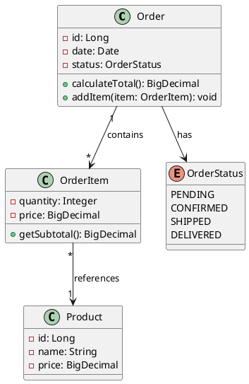
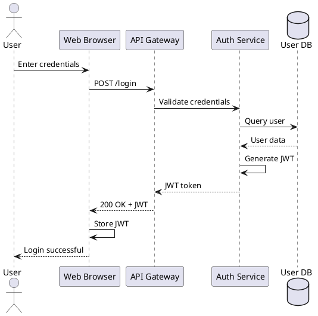
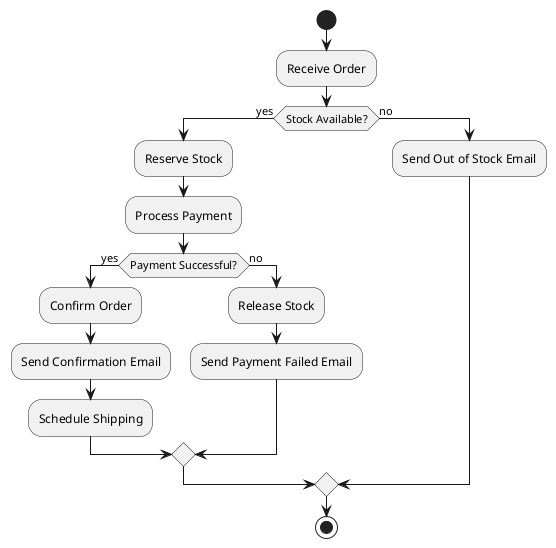
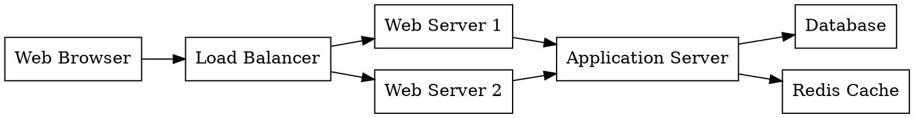
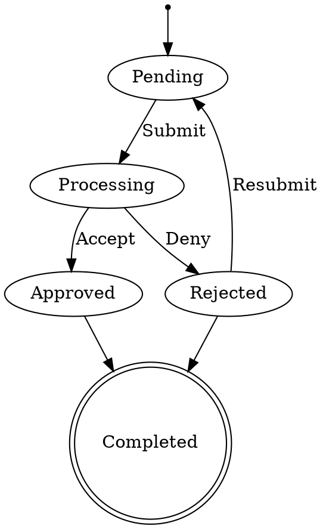
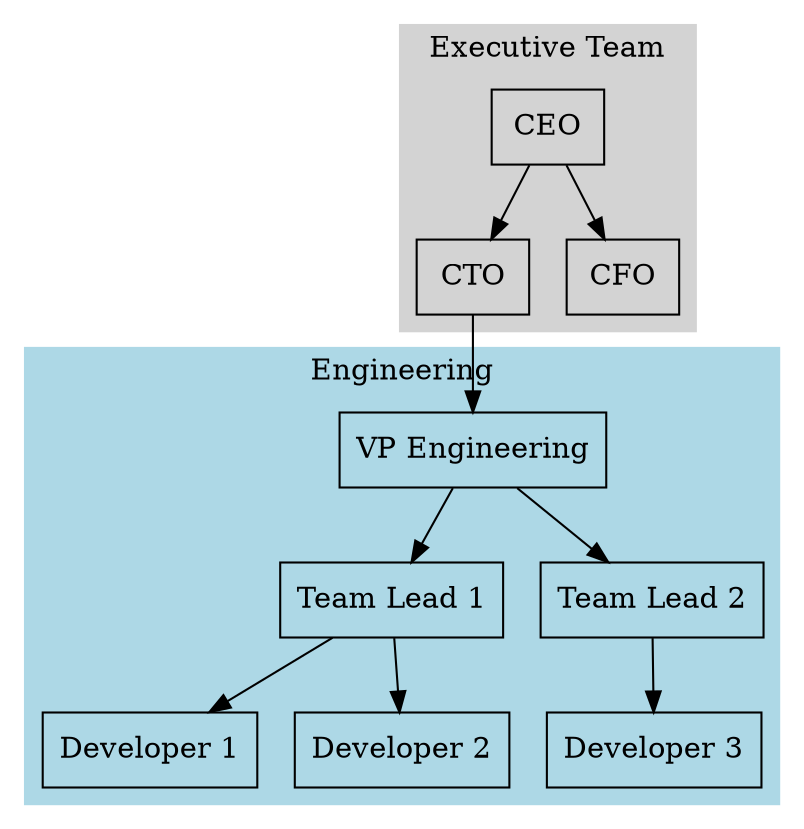

# Architecture Documentation Methodology Examples

This document provides practical examples for each researched methodology to demonstrate their syntax and capabilities.

## C4 Model Examples

### Level 1: System Context Diagram
```
title System Context diagram for Internet Banking System

Person(customer, "Banking Customer", "A customer of the bank")
System(banking_system, "Internet Banking System", "Allows customers to manage accounts")
System_Ext(email_system, "E-mail System", "The internal email system")
System_Ext(mainframe, "Mainframe Banking System", "Core banking functionality")

Rel(customer, banking_system, "Uses")
Rel(banking_system, email_system, "Sends emails using")
Rel(banking_system, mainframe, "Gets account data from")
```

### Level 2: Container Diagram
```
title Container diagram for Internet Banking System

Person(customer, "Banking Customer")

System_Boundary(c1, "Internet Banking System") {
    Container(web_app, "Web Application", "Java, Spring MVC", "Delivers static content")
    Container(spa, "Single-Page App", "JavaScript, Angular", "Provides banking UI")
    Container(mobile_app, "Mobile App", "Xamarin", "Provides mobile banking")
    Container(api, "API Application", "Java, Spring Boot", "Provides banking API")
    Container(database, "Database", "Oracle Database", "Stores user data")
}

System_Ext(email_system, "E-mail System")
System_Ext(mainframe, "Mainframe Banking System")

Rel(customer, web_app, "Visits", "HTTPS")
Rel(customer, spa, "Uses", "HTTPS")
Rel(customer, mobile_app, "Uses")
Rel(web_app, spa, "Delivers")
Rel(spa, api, "Makes API calls to", "JSON/HTTPS")
Rel(mobile_app, api, "Makes API calls to", "JSON/HTTPS")
Rel(api, database, "Reads from and writes to", "SQL/TCP")
Rel(api, email_system, "Sends emails using", "SMTP")
Rel(api, mainframe, "Uses", "XML/HTTPS")
```

## PlantUML Examples

### Class Diagram


### Sequence Diagram


### Activity Diagram


## Structurizr DSL Examples

### Complete System Definition
```
workspace "Big Bank plc" {
    model {
        # People
        customer = person "Personal Banking Customer" {
            description "A customer of the bank"
        }

        # Software Systems
        internetBankingSystem = softwareSystem "Internet Banking System" {
            description "Allows customers to manage bank accounts"
            
            # Containers
            webApplication = container "Web Application" {
                description "Delivers static content and banking SPA"
                technology "Java and Spring MVC"
            }
            
            singlePageApplication = container "Single-Page Application" {
                description "Provides banking functionality via browser"
                technology "JavaScript and Angular"
                tags "Browser"
            }
            
            mobileApp = container "Mobile App" {
                description "Provides banking functionality via mobile"
                technology "Xamarin"
                tags "Mobile"
            }
            
            apiApplication = container "API Application" {
                description "Provides Internet banking functionality via API"
                technology "Java and Spring Boot"
                
                # Components
                signinController = component "Sign In Controller" {
                    description "Allows users to sign in"
                    technology "Spring MVC Rest Controller"
                }
                
                accountsSummaryController = component "Accounts Summary Controller" {
                    description "Provides customers with account summary"
                    technology "Spring MVC Rest Controller"
                }
                
                securityComponent = component "Security Component" {
                    description "Provides functionality related to signing in"
                    technology "Spring Bean"
                }
            }
            
            database = container "Database" {
                description "Stores user registration and account information"
                technology "Oracle Database Schema"
                tags "Database"
            }
        }

        # External Systems
        mainframeBankingSystem = softwareSystem "Mainframe Banking System" {
            description "Stores all core banking information"
            tags "Existing System"
        }
        
        emailSystem = softwareSystem "E-mail System" {
            description "Internal Microsoft Exchange e-mail system"
            tags "Existing System"
        }

        # Relationships
        customer -> internetBankingSystem "Views account balances and makes payments using"
        internetBankingSystem -> mainframeBankingSystem "Gets account information from"
        internetBankingSystem -> emailSystem "Sends e-mail using"
        
        # Container relationships
        customer -> webApplication "Visits bigbank.com/ib using" "HTTPS"
        customer -> singlePageApplication "Views account information using"
        customer -> mobileApp "Views account information using"
        webApplication -> singlePageApplication "Delivers to browser"
        singlePageApplication -> apiApplication "Makes API calls to" "JSON/HTTPS"
        mobileApp -> apiApplication "Makes API calls to" "JSON/HTTPS"
        
        # Component relationships
        singlePageApplication -> signinController "Makes API calls to" "JSON/HTTPS"
        singlePageApplication -> accountsSummaryController "Makes API calls to" "JSON/HTTPS"
        signinController -> securityComponent "Uses"
        accountsSummaryController -> mainframeBankingSystem "Uses" "XML/HTTPS"
        securityComponent -> database "Reads from and writes to" "SQL/TCP"
    }

    views {
        systemContext internetBankingSystem "SystemContext" {
            include *
            autoLayout
        }

        container internetBankingSystem "Containers" {
            include *
            autoLayout
        }

        component apiApplication "Components" {
            include *
            autoLayout
        }

        theme default
    }
}
```

## GraphViz Examples

### Basic Graph


### State Machine


### Hierarchical Graph


## D2 Examples

### System Architecture
```d2
direction: right

user: User {
  shape: person
}

lb: Load Balancer {
  style.fill: orange
}

web: {
  server1: Web Server 1
  server2: Web Server 2
  server3: Web Server 3
}

app: {
  server1: App Server 1
  server2: App Server 2
}

db: Database {
  shape: cylinder
  style.fill: blue
}

cache: Redis Cache {
  shape: hexagon
  style.fill: red
}

user -> lb: HTTPS
lb -> web.server1
lb -> web.server2
lb -> web.server3

web.server1 -> app.server1
web.server2 -> app.server1
web.server3 -> app.server2

app.server1 -> db: SQL
app.server2 -> db: SQL
app.server1 -> cache: TCP
app.server2 -> cache: TCP
```

### Sequence Diagram
```d2
shape: sequence_diagram

alice: Alice
bob: Bob
db: Database

alice -> bob: Authentication Request
bob -> db: Check credentials
db -> bob: Credentials valid
bob -> alice: Authentication Response

alice -> bob: Get user data
bob -> db: SELECT * FROM users
db -> bob: User data
bob -> alice: User response
```

### Cloud Architecture
```d2
aws: AWS {
  style.fill: orange
  
  vpc: VPC {
    style.stroke-dash: 3
    
    public: Public Subnet {
      alb: Application Load Balancer
      nat: NAT Gateway
    }
    
    private: Private Subnet {
      ecs: ECS Cluster {
        service1: Service 1
        service2: Service 2
      }
      
      rds: RDS Database {
        shape: cylinder
      }
    }
  }
  
  s3: S3 Bucket {
    shape: stored_data
  }
  
  cloudfront: CloudFront CDN
}

users: Users {
  shape: person
}

users -> aws.cloudfront: HTTPS
aws.cloudfront -> aws.s3: Origin
aws.cloudfront -> aws.vpc.public.alb: Dynamic content

aws.vpc.public.alb -> aws.vpc.private.ecs.service1
aws.vpc.public.alb -> aws.vpc.private.ecs.service2

aws.vpc.private.ecs.service1 -> aws.vpc.private.rds
aws.vpc.private.ecs.service2 -> aws.vpc.private.rds

aws.vpc.private.ecs -> aws.vpc.public.nat: Outbound traffic
```

## Terraform Diagram Examples

### Using Blast Radius
```bash
# Generate interactive graph from Terraform files
blast-radius --serve .

# Generate static SVG
blast-radius --svg > infrastructure.svg
```

### Using Terraform Graph
```bash
# Generate DOT file
terraform graph > infrastructure.dot

# Convert to image using GraphViz
terraform graph | dot -Tpng > infrastructure.png

# Filter specific resources
terraform graph -draw-cycles | grep -E "(aws_instance|aws_security_group)" | dot -Tpng > filtered.png
```

### Using Rover
```bash
# Interactive visualization
rover -tfPath .

# Generate standalone HTML
rover -tfPath . -genImage

# With specific plan file
rover -tfPath . -planPath plan.out
```

## BPMN Examples

### Order Processing
```xml
<?xml version="1.0" encoding="UTF-8"?>
<bpmn:definitions xmlns:bpmn="http://www.omg.org/spec/BPMN/20100524/MODEL">
  <bpmn:process id="OrderProcess" isExecutable="true">
    <bpmn:startEvent id="StartEvent_1" name="Order Received">
      <bpmn:outgoing>Flow_1</bpmn:outgoing>
    </bpmn:startEvent>
    
    <bpmn:task id="Task_CheckInventory" name="Check Inventory">
      <bpmn:incoming>Flow_1</bpmn:incoming>
      <bpmn:outgoing>Flow_2</bpmn:outgoing>
    </bpmn:task>
    
    <bpmn:exclusiveGateway id="Gateway_1" name="In Stock?">
      <bpmn:incoming>Flow_2</bpmn:incoming>
      <bpmn:outgoing>Flow_3</bpmn:outgoing>
      <bpmn:outgoing>Flow_4</bpmn:outgoing>
    </bpmn:exclusiveGateway>
    
    <bpmn:task id="Task_ProcessPayment" name="Process Payment">
      <bpmn:incoming>Flow_3</bpmn:incoming>
      <bpmn:outgoing>Flow_5</bpmn:outgoing>
    </bpmn:task>
    
    <bpmn:task id="Task_NotifyOutOfStock" name="Notify Out of Stock">
      <bpmn:incoming>Flow_4</bpmn:incoming>
      <bpmn:outgoing>Flow_6</bpmn:outgoing>
    </bpmn:task>
    
    <bpmn:endEvent id="EndEvent_1" name="Order Completed">
      <bpmn:incoming>Flow_5</bpmn:incoming>
    </bpmn:endEvent>
    
    <bpmn:endEvent id="EndEvent_2" name="Order Cancelled">
      <bpmn:incoming>Flow_6</bpmn:incoming>
    </bpmn:endEvent>
    
    <bpmn:sequenceFlow id="Flow_1" sourceRef="StartEvent_1" targetRef="Task_CheckInventory"/>
    <bpmn:sequenceFlow id="Flow_2" sourceRef="Task_CheckInventory" targetRef="Gateway_1"/>
    <bpmn:sequenceFlow id="Flow_3" sourceRef="Gateway_1" targetRef="Task_ProcessPayment" name="Yes"/>
    <bpmn:sequenceFlow id="Flow_4" sourceRef="Gateway_1" targetRef="Task_NotifyOutOfStock" name="No"/>
    <bpmn:sequenceFlow id="Flow_5" sourceRef="Task_ProcessPayment" targetRef="EndEvent_1"/>
    <bpmn:sequenceFlow id="Flow_6" sourceRef="Task_NotifyOutOfStock" targetRef="EndEvent_2"/>
  </bpmn:process>
</bpmn:definitions>
```

### Visual BPMN Notation (when rendered)
```
[Order Received] --> [Check Inventory] --> <In Stock?> 
                                              |
                                              v Yes
                                         [Process Payment] --> [Order Completed]
                                              |
                                              v No
                                         [Notify Out of Stock] --> [Order Cancelled]
```

## Integration Examples

### PlantUML with C4
```plantuml
@startuml
!include https://raw.githubusercontent.com/plantuml-stdlib/C4-PlantUML/master/C4_Context.puml

Person(customer, "Customer", "Banking customer")
System(internet_banking, "Internet Banking", "Allows customers to manage accounts")
System_Ext(mainframe, "Mainframe", "Core banking system")

Rel(customer, internet_banking, "Uses")
Rel(internet_banking, mainframe, "Queries")
@enduml
```

### D2 with Markdown
```markdown
# System Architecture

Here's our current architecture:

```d2
users -> load_balancer: HTTPS
load_balancer -> app_servers: HTTP
app_servers -> database: PostgreSQL
app_servers -> cache: Redis
```

This provides high availability and scalability.
```

### GraphViz from Code
```python
import graphviz

def generate_architecture():
    dot = graphviz.Digraph('Architecture')
    dot.attr(rankdir='TB')
    
    # Add nodes
    dot.node('LB', 'Load Balancer')
    dot.node('Web1', 'Web Server 1')
    dot.node('Web2', 'Web Server 2')
    dot.node('DB', 'Database', shape='cylinder')
    
    # Add edges
    dot.edge('LB', 'Web1')
    dot.edge('LB', 'Web2')
    dot.edge('Web1', 'DB')
    dot.edge('Web2', 'DB')
    
    return dot

# Generate and save
diagram = generate_architecture()
diagram.render('architecture', format='png')
```

These examples demonstrate the practical syntax and capabilities of each methodology, helping teams quickly understand how to implement them in their projects.