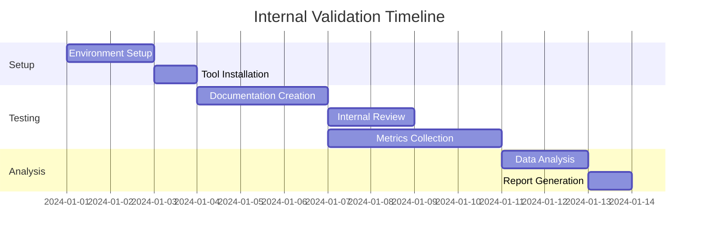
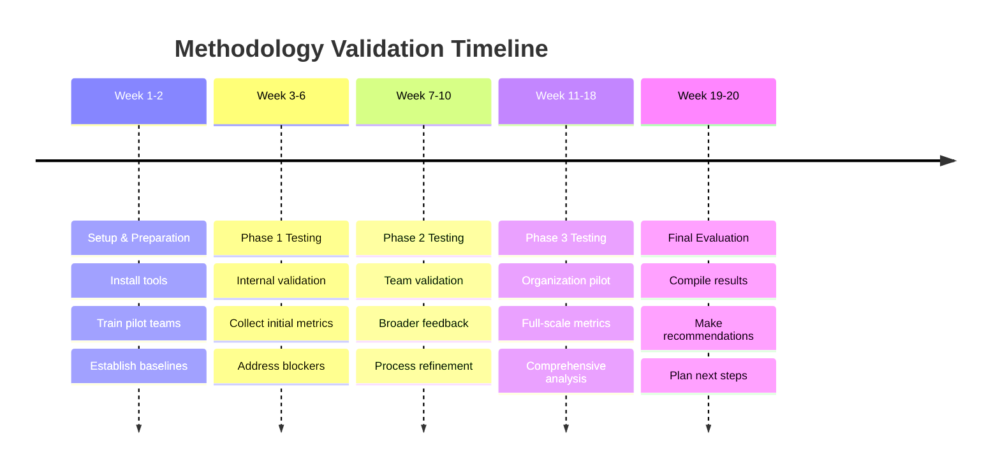

# Architectural Documentation Methodology Validation Plan

## Executive Summary

This validation plan defines comprehensive testing approaches for evaluating the effectiveness of four architectural documentation methodologies:
1. Architectural Documentation Framework
2. Docs-as-Data
3. Mermaid Design System
4. Modular Documentation

## Validation Framework

### 1. Effectiveness Measurement Criteria

#### 1.1 Documentation Completeness Score (DCS)
**Metrics:**
- Coverage of all system components (0-100%)
- Presence of required sections (0-100%)
- Depth of technical detail (1-5 scale)
- Cross-reference integrity (0-100%)

**Formula:** `DCS = (Coverage × 0.3) + (Sections × 0.3) + (Detail × 20) + (References × 0.2)`

#### 1.2 Stakeholder Comprehension Index (SCI)
**Metrics:**
- Time to understanding (minutes)
- Accuracy of comprehension tests (0-100%)
- Self-reported clarity (1-10 scale)
- Questions generated per reader

**Formula:** `SCI = (100 - TimeMinutes) × 0.3 + (Accuracy × 0.4) + (Clarity × 10 × 0.3)`

#### 1.3 Maintenance Efficiency Rate (MER)
**Metrics:**
- Time to update documentation (hours)
- Number of files affected per change
- Error rate in updates (%)
- Automation capability (0-100%)

**Formula:** `MER = (100 - UpdateHours × 10) × 0.3 + (100 - FilesAffected × 5) × 0.2 + (100 - ErrorRate) × 0.3 + (Automation × 0.2)`

#### 1.4 Tool Integration Success (TIS)
**Metrics:**
- Setup time (hours)
- Number of integrated tools
- Automation level (0-100%)
- Team adoption friction (1-5 scale)

**Formula:** `TIS = (100 - SetupHours × 5) × 0.3 + (IntegratedTools × 10) × 0.2 + (Automation × 0.3) + ((5 - Friction) × 20 × 0.2)`

#### 1.5 Team Adoption Rate (TAR)
**Metrics:**
- Percentage of team using methodology (%)
- Time to proficiency (days)
- Voluntary usage rate (%)
- Satisfaction score (1-10)

**Formula:** `TAR = (TeamUsage × 0.3) + (100 - ProficiencyDays) × 0.2 + (VoluntaryUsage × 0.3) + (Satisfaction × 10 × 0.2)`

### 2. User Feedback Collection Methods

#### 2.1 Quantitative Methods

**A. Structured Surveys**
```yaml
survey_structure:
  pre_test:
    - experience_level: [junior, mid, senior, architect]
    - documentation_familiarity: [1-10]
    - preferred_learning_style: [visual, textual, interactive]
  
  post_test:
    - comprehension_score: [0-100]
    - time_spent: [minutes]
    - clarity_rating: [1-10]
    - confidence_level: [1-10]
    - would_recommend: [yes/no]
```

**B. Task-Based Metrics**
- Find specific information tasks (timed)
- Update documentation tasks (timed and accuracy)
- Onboarding new team member scenarios
- Emergency troubleshooting scenarios

#### 2.2 Qualitative Methods

**A. Focus Groups**
- Weekly 30-minute sessions
- 4-6 participants per group
- Mixed experience levels
- Recorded and transcribed

**B. Think-Aloud Protocols**
- Individual sessions
- Real documentation tasks
- Screen recording + voice
- Cognitive load assessment

**C. Documentation Diaries**
- Daily logs for 2 weeks
- Pain points tracking
- Success stories
- Improvement suggestions

### 3. Pilot Testing Approach

#### Phase 1: Internal Validation (2 weeks)


**Participants:** 5 internal team members
**Scope:** Small component documentation
**Success Criteria:** 
- All tools functioning
- Basic metrics collected
- No critical blockers

#### Phase 2: Team Validation (4 weeks)
**Participants:** 20 developers across 4 teams
**Scope:** Full module documentation
**Activities:**
- Week 1: Training and setup
- Week 2-3: Active documentation
- Week 4: Feedback and analysis

#### Phase 3: Organization-Wide Pilot (8 weeks)
**Participants:** 100+ stakeholders
**Scope:** Complete system documentation
**Milestones:**
- Week 2: Initial adoption metrics
- Week 4: Mid-pilot adjustments
- Week 6: Comprehensive testing
- Week 8: Final evaluation

### 4. Validation Checklists

#### 4.1 Pre-Implementation Checklist
- [ ] Environment requirements documented
- [ ] Tool licenses secured
- [ ] Training materials prepared
- [ ] Baseline metrics established
- [ ] Success criteria defined
- [ ] Rollback plan ready
- [ ] Stakeholder buy-in confirmed

#### 4.2 Documentation Completeness Checklist
**Architectural Documentation Framework:**
- [ ] Context and scope defined
- [ ] Architecture views present (4+1)
- [ ] Quality attributes documented
- [ ] Constraints and assumptions listed
- [ ] Decision log maintained
- [ ] Stakeholder concerns addressed
- [ ] Glossary and references complete

**Docs-as-Data:**
- [ ] Schema definitions complete
- [ ] Transformation pipelines working
- [ ] Output formats validated
- [ ] API documentation generated
- [ ] Search functionality operational
- [ ] Version control integrated
- [ ] Automated validation passing

**Mermaid Design System:**
- [ ] All diagram types represented
- [ ] Style guide enforced
- [ ] Interactive features working
- [ ] Export formats functional
- [ ] Source control friendly
- [ ] Build pipeline integrated
- [ ] Cross-browser compatibility

**Modular Documentation:**
- [ ] Module structure defined
- [ ] Dependencies mapped
- [ ] Templates consistent
- [ ] Navigation functional
- [ ] Search working across modules
- [ ] Build process automated
- [ ] Link validation passing

#### 4.3 Quality Validation Checklist
- [ ] Accuracy verified by SMEs
- [ ] Consistency across sections
- [ ] Completeness per requirements
- [ ] Clarity tested with users
- [ ] Currency (up-to-date)
- [ ] Accessibility standards met
- [ ] Performance benchmarks passed

### 5. Quality Metrics

#### 5.1 Documentation Quality Score (DQS)
```python
def calculate_dqs(doc):
    accuracy = validate_technical_accuracy(doc)  # 0-100
    consistency = check_style_consistency(doc)   # 0-100
    completeness = measure_coverage(doc)         # 0-100
    clarity = analyze_readability(doc)           # 0-100
    currency = check_last_updated(doc)           # 0-100
    
    weights = {
        'accuracy': 0.3,
        'consistency': 0.2,
        'completeness': 0.2,
        'clarity': 0.2,
        'currency': 0.1
    }
    
    dqs = sum(metric * weights[name] for name, metric in locals().items() if name in weights)
    return dqs
```

#### 5.2 Automated Quality Checks
- **Link validation:** All internal/external links functional
- **Image validation:** All diagrams rendering correctly
- **Code validation:** All code examples compile/run
- **Format validation:** Markup syntax correct
- **Spell check:** No spelling errors
- **Grammar check:** Proper grammar usage

#### 5.3 Performance Metrics
- **Build time:** < 5 minutes for full documentation
- **Search latency:** < 100ms for queries
- **Page load time:** < 2 seconds
- **Update propagation:** < 1 minute
- **Storage efficiency:** < 100MB for 1000 pages

### 6. Validation Test Scenarios

#### Scenario 1: New Developer Onboarding
**Objective:** Measure time to productivity
**Tasks:**
1. Find system architecture overview
2. Understand component interactions
3. Locate API documentation
4. Find deployment instructions
5. Identify coding standards

**Success Metrics:**
- Time to complete all tasks < 2 hours
- Accuracy of understanding > 80%
- Confidence level > 7/10

#### Scenario 2: Emergency Troubleshooting
**Objective:** Measure crisis response effectiveness
**Tasks:**
1. Identify affected components
2. Find relevant logs/metrics
3. Locate escalation procedures
4. Access recovery runbooks
5. Document incident

**Success Metrics:**
- Mean time to resolution < 30 minutes
- All critical info found < 5 minutes
- Post-incident documentation complete

#### Scenario 3: Architecture Review
**Objective:** Evaluate comprehensive understanding
**Tasks:**
1. Present system overview to stakeholders
2. Explain design decisions
3. Discuss trade-offs
4. Project future changes
5. Answer technical questions

**Success Metrics:**
- Stakeholder satisfaction > 8/10
- Questions answered accurately > 90%
- Presentation prep time < 1 hour

### 7. Continuous Validation Process

#### 7.1 Weekly Metrics Collection
```yaml
weekly_metrics:
  automated:
    - build_success_rate
    - test_coverage
    - link_validation
    - search_performance
  
  manual:
    - user_feedback_score
    - documentation_updates
    - support_tickets_related
    - time_to_find_info
```

#### 7.2 Monthly Reviews
- Trend analysis of all metrics
- User satisfaction surveys
- Team retrospectives
- Tool performance evaluation
- Cost-benefit analysis

#### 7.3 Quarterly Assessments
- Comprehensive methodology evaluation
- ROI calculation
- Strategic alignment review
- Technology stack updates
- Process optimization

### 8. Success Criteria and Thresholds

#### Minimum Acceptable Scores
- Documentation Completeness: > 85%
- Stakeholder Comprehension: > 80%
- Maintenance Efficiency: > 75%
- Tool Integration: > 70%
- Team Adoption: > 80%

#### Excellence Targets
- Documentation Completeness: > 95%
- Stakeholder Comprehension: > 90%
- Maintenance Efficiency: > 85%
- Tool Integration: > 90%
- Team Adoption: > 95%

### 9. Risk Mitigation

#### Identified Risks and Mitigations
1. **Low adoption rate**
   - Mitigation: Phased rollout with champions
   - Backup: Hybrid approach allowing gradual transition

2. **Tool complexity**
   - Mitigation: Extensive training program
   - Backup: Simplified toolset option

3. **Performance issues**
   - Mitigation: Infrastructure scaling plan
   - Backup: Static generation fallback

4. **Resistance to change**
   - Mitigation: Clear ROI demonstration
   - Backup: Optional participation initially

### 10. Reporting Framework

#### 10.1 Validation Dashboard
```
┌─────────────────────────────────────────────┐
│          Methodology Validation Status       │
├─────────────────────────────────────────────┤
│ Architectural Framework    ████████░░ 82%   │
│ Docs-as-Data              ███████░░░ 75%   │
│ Mermaid Design System     █████████░ 88%   │
│ Modular Documentation     ███████░░░ 78%   │
└─────────────────────────────────────────────┘

Key Metrics:
- Average Adoption Rate: 84%
- User Satisfaction: 8.2/10
- Maintenance Time: -45% reduction
- Documentation Coverage: 91%
```

#### 10.2 Executive Summary Template
1. Methodology performance overview
2. Key successes and challenges
3. User feedback highlights
4. Cost-benefit analysis
5. Recommendations for adoption

### 11. Post-Validation Actions

#### 11.1 Successful Validation
1. Create implementation roadmap
2. Develop training curriculum
3. Establish support channels
4. Define governance model
5. Plan organization-wide rollout

#### 11.2 Failed Validation
1. Document lessons learned
2. Identify improvement areas
3. Consider hybrid approaches
4. Evaluate alternative methodologies
5. Plan follow-up pilot

### 12. Validation Timeline



## Conclusion

This validation plan provides a comprehensive framework for evaluating architectural documentation methodologies. Success depends on:

1. **Rigorous measurement** using defined metrics
2. **Broad stakeholder participation** across all levels
3. **Iterative improvement** based on feedback
4. **Clear success criteria** aligned with organizational goals
5. **Commitment to data-driven decision making**

The validation process will provide quantitative and qualitative data necessary to make an informed decision on the most effective documentation methodology for the organization.