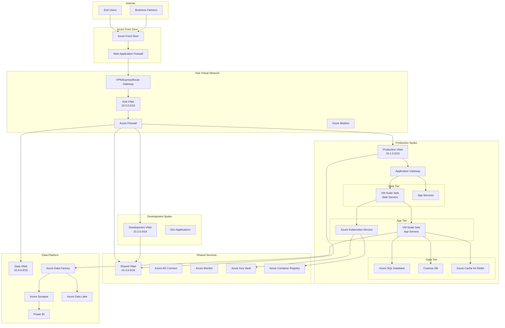

# Azure Enterprise Reference Architecture

## Overview

This document provides a comprehensive enterprise reference architecture for Azure deployments, covering common patterns and best practices for large-scale implementations.

## High-Level Architecture Diagram



## Architecture Components

### 1. Network Architecture (Hub-and-Spoke)

**Hub Virtual Network (10.0.0.0/16)**
- Central connectivity point
- Houses shared services (Azure Firewall, VPN Gateway)
- Provides security and connectivity governance

**Spoke Virtual Networks**
- Production (10.1.0.0/16): Production workloads
- Development (10.2.0.0/16): Development and testing
- Shared Services (10.3.0.0/16): Common services
- Data Platform (10.4.0.0/16): Analytics and data services

### 2. Application Architecture Tiers

**Web Tier**
- Azure Front Door for global load balancing and CDN
- Web Application Firewall for security
- VM Scale Sets or App Services for web hosting
- Application Gateway for regional load balancing

**Application Tier**
- VM Scale Sets for traditional applications
- Azure Kubernetes Service for containerized workloads
- Service Bus for messaging
- API Management for API governance

**Data Tier**
- Azure SQL Database for relational data
- Cosmos DB for NoSQL requirements
- Azure Cache for Redis for caching
- Azure Storage for blob and file storage

### 3. Security Architecture

**Identity and Access Management**
- Azure Active Directory for identity services
- Azure AD Connect for hybrid identity
- Privileged Identity Management (PIM)
- Multi-Factor Authentication (MFA)

**Network Security**
- Azure Firewall for network filtering
- Network Security Groups (NSGs)
- Application Security Groups (ASGs)
- Private Endpoints for secure connectivity

**Data Protection**
- Azure Key Vault for secrets management
- Azure Information Protection
- Transparent Data Encryption (TDE)
- Always Encrypted for sensitive data

### 4. Monitoring and Management

**Monitoring**
- Azure Monitor for comprehensive monitoring
- Log Analytics for centralized logging
- Application Insights for application performance
- Azure Security Center for security monitoring

**Management**
- Azure Resource Manager templates
- Azure Policy for governance
- Azure Blueprints for compliance
- Azure Cost Management for cost optimization

## Implementation Patterns

### Pattern 1: Multi-Tier Web Application

```yaml
Architecture Components:
  - Azure Front Door (Global CDN/Load Balancer)
  - Application Gateway (Regional Load Balancer)
  - VM Scale Sets (Web/App Tiers)
  - Azure SQL Database (Data Tier)
  - Azure Key Vault (Secrets Management)
  - Azure Monitor (Monitoring)

Benefits:
  - High availability and scalability
  - Built-in security features
  - Cost-effective scaling
  - Integrated monitoring
```

### Pattern 2: Microservices with AKS

```yaml
Architecture Components:
  - Azure Kubernetes Service (Container Orchestration)
  - Azure Container Registry (Container Images)
  - Azure Service Bus (Messaging)
  - Azure API Management (API Gateway)
  - Azure Cosmos DB (NoSQL Database)
  - Azure Application Gateway (Ingress)

Benefits:
  - Container-native development
  - Independent service scaling
  - DevOps integration
  - Service mesh capabilities
```

### Pattern 3: Data Platform Architecture

```yaml
Architecture Components:
  - Azure Data Factory (Data Integration)
  - Azure Synapse Analytics (Data Warehouse)
  - Azure Data Lake Storage (Data Lake)
  - Azure Stream Analytics (Real-time Processing)
  - Power BI (Business Intelligence)
  - Azure Purview (Data Governance)

Benefits:
  - End-to-end data platform
  - Real-time and batch processing
  - Advanced analytics capabilities
  - Data governance and compliance
```

## Sizing and Scaling Recommendations

### Small Enterprise (100-500 users)
- Standard_D2s_v3 VMs for web/app tiers
- Basic/Standard Azure SQL Database
- Standard Application Gateway
- B-series VMs for development

### Medium Enterprise (500-2000 users)
- Standard_D4s_v3+ VMs with scale sets
- Premium Azure SQL Database or SQL Managed Instance
- Standard_v2 Application Gateway
- Azure Kubernetes Service for containerized workloads

### Large Enterprise (2000+ users)
- Premium_v3 VM Scale Sets
- Azure SQL Database Hyperscale or dedicated instances
- WAF_v2 Application Gateway
- Multi-region deployment with traffic manager

## Cost Optimization Strategies

1. **Reserved Instances**: 30-70% savings for predictable workloads
2. **Spot Instances**: Up to 90% savings for fault-tolerant workloads
3. **Autoscaling**: Scale resources based on demand
4. **Storage Tiers**: Use appropriate storage tiers (Hot/Cool/Archive)
5. **Azure Hybrid Benefit**: Leverage existing Windows Server licenses

## Security Best Practices

1. **Network Segmentation**: Use subnets and NSGs for micro-segmentation
2. **Private Endpoints**: Eliminate internet exposure for PaaS services
3. **Just-in-Time Access**: Implement JIT VM access
4. **Managed Identities**: Use Azure AD managed identities
5. **Key Management**: Centralize secrets in Azure Key Vault

## Disaster Recovery Patterns

1. **Cross-Region Replication**: Geo-redundant storage and database replication
2. **Azure Site Recovery**: VM replication and failover automation
3. **Backup Strategies**: Regular backups with geo-redundancy
4. **RTO/RPO Targets**: Define and test recovery objectives

This reference architecture provides a solid foundation for enterprise Azure deployments while maintaining flexibility for specific organizational requirements.