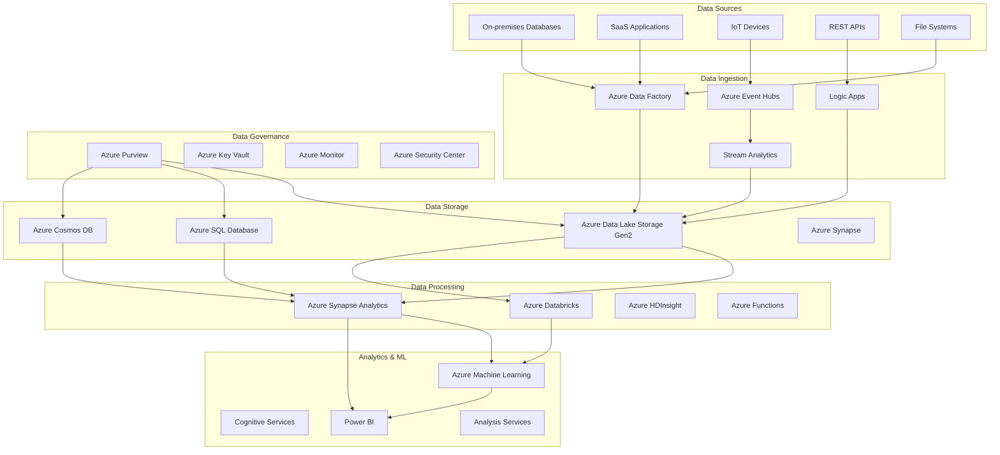

# Azure Data Platform Architecture Pattern

## Overview

This pattern demonstrates how to build a comprehensive data platform on Azure that supports modern analytics, machine learning, and business intelligence workloads with enterprise-grade security and governance.

## Architecture Components



## Data Architecture Layers

### 1. Data Ingestion Layer

**Batch Processing**
```yaml
Azure Data Factory:
  Connectors: 90+ native connectors
  Data Flows: Visual data transformation
  Integration Runtime: On-premises connectivity
  Monitoring: Built-in monitoring and alerting
  
Use Cases:
  - ETL/ELT pipelines
  - Database replication
  - File processing
  - API data extraction
```

**Stream Processing**
```yaml
Azure Event Hubs:
  Throughput: Millions of events per second
  Partitions: Parallel processing
  Capture: Direct to Data Lake
  Retention: Configurable retention period

Azure Stream Analytics:
  SQL-like queries: Real-time transformations
  Windowing: Tumbling, hopping, sliding windows
  Output: Multiple simultaneous outputs
  ML Integration: Built-in ML functions
```

### 2. Data Storage Layer

**Data Lake Architecture**
```yaml
Azure Data Lake Storage Gen2:
  Zone Structure:
    - Raw Zone: Unprocessed data
    - Processed Zone: Cleaned and validated data
    - Curated Zone: Business-ready datasets
    - Sandbox Zone: Exploration and development
  
  Organization:
    /raw/
      /year=2024/month=01/day=15/
        source-system/
          data-files
    /processed/
      /subject-area/
        /year=2024/month=01/
    /curated/
      /business-domain/
        /dataset-name/
```

### 3. Data Processing Layer

**Azure Synapse Analytics Configuration**
```sql
-- Create dedicated SQL pool
CREATE DATABASE DataWarehouse
WITH (
    EDITION = 'DataWarehouse',
    SERVICE_OBJECTIVE = 'DW100c'
);

-- Create external data source
CREATE EXTERNAL DATA SOURCE DataLakeSource
WITH (
    LOCATION = 'abfss://container@datalake.dfs.core.windows.net/',
    CREDENTIAL = DataLakeCredential
);

-- Create external file format
CREATE EXTERNAL FILE FORMAT ParquetFileFormat
WITH (
    FORMAT_TYPE = PARQUET,
    DATA_COMPRESSION = 'org.apache.hadoop.io.compress.SnappyCodec'
);

-- Create external table
CREATE EXTERNAL TABLE ext.SalesData (
    OrderID INT,
    CustomerID INT,
    OrderDate DATE,
    Amount DECIMAL(10,2)
)
WITH (
    LOCATION = '/curated/sales/sales-data/',
    DATA_SOURCE = DataLakeSource,
    FILE_FORMAT = ParquetFileFormat
);
```

**Azure Databricks Configuration**
```python
# Databricks cluster configuration
cluster_config = {
    "cluster_name": "data-processing-cluster",
    "spark_version": "11.3.x-scala2.12",
    "node_type_id": "Standard_DS3_v2",
    "num_workers": 4,
    "autoscale": {
        "min_workers": 2,
        "max_workers": 8
    },
    "spark_conf": {
        "spark.databricks.delta.preview.enabled": "true",
        "spark.databricks.delta.retentionDurationCheck.enabled": "false"
    },
    "azure_attributes": {
        "first_on_demand": 1,
        "availability": "SPOT_WITH_FALLBACK_AZURE",
        "spot_bid_max_price": 0.5
    }
}

# Delta Lake table creation
from delta.tables import DeltaTable
from pyspark.sql.functions import *

# Create Delta table
df = spark.read.parquet("/mnt/datalake/raw/sales/")
df.write.format("delta").mode("overwrite").save("/mnt/datalake/processed/sales/")

# Create Delta table with schema evolution
df_new = df.withColumn("new_column", lit("default_value"))
df_new.write.format("delta").mode("append").option("mergeSchema", "true").save("/mnt/datalake/processed/sales/")
```

### 4. Analytics and Machine Learning Layer

**Azure Machine Learning Workspace**
```yaml
ML Platform Components:
  Compute:
    - Compute Instances: Development environments
    - Compute Clusters: Training workloads
    - Inference Clusters: Real-time scoring
    - Attached Compute: External resources
  
  Data Assets:
    - Datastores: Connection to storage
    - Datasets: Versioned data assets
    - Data Labeling: ML data preparation
  
  Model Management:
    - Model Registry: Centralized model store
    - Model Versioning: Track model evolution
    - Model Deployment: Multiple deployment options
```

**Power BI Integration**
```yaml
Power BI Premium:
  Data Sources:
    - Direct Query to Synapse
    - Import from Data Lake
    - Streaming datasets from Event Hubs
    - ML model integration
  
  Advanced Features:
    - Paginated reports
    - AI insights
    - Dataflows for ETL
    - Deployment pipelines
```

## Implementation Patterns

### 1. Lambda Architecture Pattern

```yaml
Lambda Architecture:
  Batch Layer:
    - Historical data processing
    - Azure Data Factory + Synapse
    - Accuracy over speed
  
  Speed Layer:
    - Real-time stream processing
    - Event Hubs + Stream Analytics
    - Low latency processing
  
  Serving Layer:
    - Unified view of batch and stream
    - Azure Cosmos DB + Azure SQL
    - Query optimization
```

### 2. Data Mesh Pattern

```yaml
Data Mesh Principles:
  Domain-oriented Ownership:
    - Sales domain: Customer data, orders
    - Marketing domain: Campaigns, analytics
    - Finance domain: Revenue, costs
  
  Data as a Product:
    - Self-serve data infrastructure
    - Data quality guarantees
    - User experience focus
  
  Self-serve Platform:
    - Common data platform tools
    - Automated data pipelines
    - Standardized interfaces
```

### 3. Modern Data Warehouse Pattern

```yaml
Modern Data Warehouse:
  Ingestion:
    - Batch: Azure Data Factory
    - Streaming: Event Hubs + Stream Analytics
  
  Storage:
    - Hot path: Azure SQL Database
    - Warm path: Azure Synapse Analytics
    - Cold path: Azure Data Lake Storage
  
  Processing:
    - T-SQL queries in Synapse
    - Spark jobs in Databricks
    - ML pipelines in Azure ML
  
  Consumption:
    - Power BI dashboards
    - Azure Analysis Services
    - Custom applications via APIs
```

## Data Factory Pipeline Examples

### Incremental Data Load Pipeline

```json
{
    "name": "IncrementalLoadPipeline",
    "properties": {
        "activities": [
            {
                "name": "GetLastRunTimestamp",
                "type": "Lookup",
                "typeProperties": {
                    "source": {
                        "type": "AzureSqlSource",
                        "sqlReaderQuery": "SELECT MAX(LastModified) as LastModified FROM WatermarkTable WHERE TableName = 'Orders'"
                    },
                    "dataset": {
                        "referenceName": "ControlTableDataset",
                        "type": "DatasetReference"
                    }
                }
            },
            {
                "name": "IncrementalCopy",
                "type": "Copy",
                "dependsOn": [
                    {
                        "activity": "GetLastRunTimestamp",
                        "dependencyConditions": ["Succeeded"]
                    }
                ],
                "typeProperties": {
                    "source": {
                        "type": "SqlServerSource",
                        "sqlReaderQuery": {
                            "value": "SELECT * FROM Orders WHERE LastModified > '@{activity('GetLastRunTimestamp').output.firstRow.LastModified}'",
                            "type": "Expression"
                        }
                    },
                    "sink": {
                        "type": "ParquetSink",
                        "storeSettings": {
                            "type": "AzureBlobFSWriteSettings",
                            "copyBehavior": "FlattenHierarchy"
                        }
                    }
                },
                "inputs": [
                    {
                        "referenceName": "SourceOrdersDataset",
                        "type": "DatasetReference"
                    }
                ],
                "outputs": [
                    {
                        "referenceName": "SinkParquetDataset",
                        "type": "DatasetReference"
                    }
                ]
            },
            {
                "name": "UpdateWatermark",
                "type": "StoredProcedure",
                "dependsOn": [
                    {
                        "activity": "IncrementalCopy",
                        "dependencyConditions": ["Succeeded"]
                    }
                ],
                "typeProperties": {
                    "storedProcedureName": "UpdateWatermarkTable",
                    "storedProcedureParameters": {
                        "tableName": {
                            "value": "Orders",
                            "type": "String"
                        },
                        "lastModified": {
                            "value": {
                                "value": "@utcnow()",
                                "type": "Expression"
                            },
                            "type": "DateTime"
                        }
                    }
                }
            }
        ],
        "parameters": {
            "sourceTableName": {
                "type": "string",
                "defaultValue": "Orders"
            }
        }
    }
}
```

### Data Quality Validation Pipeline

```json
{
    "name": "DataQualityPipeline",
    "properties": {
        "activities": [
            {
                "name": "ValidateDataQuality",
                "type": "DatabricksNotebook",
                "typeProperties": {
                    "notebookPath": "/data-quality/validate-data-quality",
                    "baseParameters": {
                        "input_path": "/mnt/datalake/processed/orders/",
                        "output_path": "/mnt/datalake/curated/orders/",
                        "quality_rules": "/data-quality/rules/orders-rules.json"
                    }
                }
            },
            {
                "name": "CheckValidationResults",
                "type": "IfCondition",
                "dependsOn": [
                    {
                        "activity": "ValidateDataQuality",
                        "dependencyConditions": ["Succeeded"]
                    }
                ],
                "typeProperties": {
                    "expression": {
                        "value": "@activity('ValidateDataQuality').output.runOutput.validation_passed",
                        "type": "Expression"
                    },
                    "ifTrueActivities": [
                        {
                            "name": "PromoteToProduction",
                            "type": "Copy",
                            "typeProperties": {
                                "source": {
                                    "type": "ParquetSource"
                                },
                                "sink": {
                                    "type": "ParquetSink"
                                }
                            }
                        }
                    ],
                    "ifFalseActivities": [
                        {
                            "name": "SendFailureNotification",
                            "type": "WebActivity",
                            "typeProperties": {
                                "url": "https://hooks.slack.com/services/...",
                                "method": "POST",
                                "headers": {
                                    "Content-Type": "application/json"
                                },
                                "body": {
                                    "text": "Data quality validation failed for orders dataset"
                                }
                            }
                        }
                    ]
                }
            }
        ]
    }
}
```

## Security and Governance

### Azure Purview Data Catalog

```yaml
Data Governance:
  Data Discovery:
    - Automated scanning of data sources
    - Schema and metadata extraction
    - Data lineage visualization
    - Sensitivity labeling
  
  Data Classification:
    - PII identification
    - Financial data classification
    - Healthcare data compliance
    - Custom classification rules
  
  Access Control:
    - Role-based access control
    - Policy enforcement
    - Audit logging
    - Data access monitoring
```

### Key Vault Integration

```yaml
Secret Management:
  Connection Strings:
    - Database connections
    - Storage account keys
    - Service bus connections
    - API keys
  
  Certificates:
    - SSL/TLS certificates
    - Service authentication
    - Code signing certificates
  
  Keys:
    - Encryption keys
    - Database encryption
    - Application secrets
```

## Monitoring and Operations

### Azure Monitor Configuration

```yaml
Monitoring Strategy:
  Metrics:
    - Pipeline execution metrics
    - Data volume metrics
    - Error rates and latency
    - Resource utilization
  
  Logs:
    - Pipeline run logs
    - Data lineage tracking
    - Security audit logs
    - Performance diagnostics
  
  Alerts:
    - Pipeline failure alerts
    - Data quality alerts
    - Performance degradation
    - Security incidents
```

### Cost Optimization

```yaml
Cost Management:
  Storage Optimization:
    - Lifecycle policies for Data Lake
    - Archive unused data
    - Compression and file formats
    - Partitioning strategies
  
  Compute Optimization:
    - Auto-scaling for Synapse
    - Spot instances for Databricks
    - Scheduled pause/resume
    - Right-sizing resources
  
  Data Factory Optimization:
    - Pipeline scheduling
    - Integration runtime optimization
    - Activity consolidation
    - Parallel execution
```

This data platform architecture provides a comprehensive foundation for modern analytics and machine learning workloads on Azure.