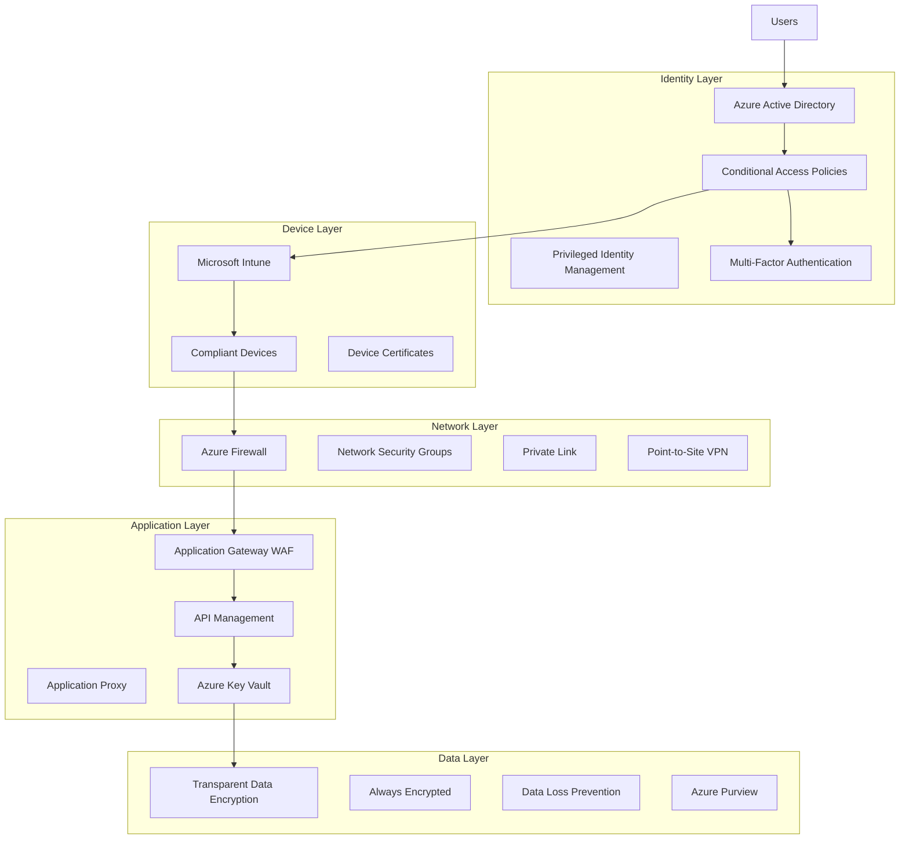

# Azure Security and Compliance Implementation Patterns

## Overview

This document provides comprehensive security and compliance patterns for Azure enterprise architectures, covering identity management, data protection, network security, and regulatory compliance frameworks.

## Identity and Access Management Patterns

### Pattern 1: Zero Trust Architecture



### Azure AD Configuration

```yaml
Azure Active Directory Setup:
  Tenant Configuration:
    - Custom domain verification
    - Security defaults disabled (use Conditional Access)
    - Self-service password reset enabled
    - Device registration enabled
  
  User Management:
    - Just-in-time access for privileged roles
    - Regular access reviews
    - Risk-based conditional access
    - Privileged workstations for admins
  
  Application Integration:
    - Single sign-on configuration
    - Application proxy for on-premises apps
    - B2B guest user policies
    - App registration best practices
```

### Conditional Access Policies

```json
{
  "displayName": "Require MFA for Admin Roles",
  "state": "enabled",
  "conditions": {
    "users": {
      "includeRoles": [
        "Global Administrator",
        "Security Administrator",
        "Conditional Access Administrator"
      ]
    },
    "applications": {
      "includeApplications": ["All"]
    },
    "locations": {
      "includeLocations": ["Any"]
    }
  },
  "grantControls": {
    "operator": "AND",
    "builtInControls": [
      "mfa",
      "compliantDevice"
    ]
  },
  "sessionControls": {
    "signInFrequency": {
      "value": 1,
      "type": "hours",
      "isEnabled": true
    }
  }
}
```

## Network Security Patterns

### Pattern 2: Defense in Depth Network Architecture

```yaml
Network Security Layers:
  Perimeter Security:
    - Azure DDoS Protection Standard
    - Web Application Firewall (WAF)
    - Azure Front Door with security rules
    - Rate limiting and geo-filtering
  
  Network Segmentation:
    - Hub-and-spoke topology
    - Network security groups (NSGs)
    - Application security groups (ASGs)
    - User-defined routes (UDRs)
  
  Internal Network Security:
    - Azure Firewall for east-west traffic
    - Private endpoints for PaaS services
    - Service endpoints where applicable
    - Network virtual appliances (NVAs)
  
  Application Layer Security:
    - Application Gateway WAF
    - API Management policies
    - Certificate management
    - SSL/TLS termination
```

### Azure Firewall Configuration

```json
{
  "firewallPolicyName": "enterprise-firewall-policy",
  "properties": {
    "sku": {
      "tier": "Premium"
    },
    "threatIntelMode": "Alert",
    "intrusionDetection": {
      "mode": "Alert",
      "configuration": {
        "signatureOverrides": [],
        "bypassTrafficSettings": []
      }
    },
    "dnsSettings": {
      "servers": [],
      "enableProxy": true
    },
    "ruleCollectionGroups": [
      {
        "name": "application-rules",
        "priority": 1000,
        "ruleCollections": [
          {
            "name": "web-browsing",
            "priority": 1100,
            "ruleCollectionType": "FirewallPolicyFilterRuleCollection",
            "action": {
              "type": "Allow"
            },
            "rules": [
              {
                "name": "allow-https-outbound",
                "ruleType": "ApplicationRule",
                "protocols": [
                  {
                    "protocolType": "Https",
                    "port": 443
                  }
                ],
                "targetFqdns": [
                  "*.microsoft.com",
                  "*.azure.com",
                  "*.office.com"
                ],
                "sourceAddresses": [
                  "10.0.0.0/8"
                ]
              }
            ]
          }
        ]
      }
    ]
  }
}
```

## Data Protection Patterns

### Pattern 3: Data Classification and Protection

```yaml
Data Protection Framework:
  Data Discovery:
    - Azure Purview data catalog
    - Microsoft Information Protection (MIP)
    - Data Loss Prevention (DLP) policies
    - Sensitive information types
  
  Data Classification:
    - Automatic classification rules
    - Manual classification options
    - Retention labels and policies
    - Sensitivity labels
  
  Data Encryption:
    - Encryption at rest (Azure Storage Service Encryption)
    - Encryption in transit (TLS 1.2/1.3)
    - Always Encrypted for SQL databases
    - Customer-managed keys (BYOK)
  
  Data Access Control:
    - Role-based access control (RBAC)
    - Attribute-based access control (ABAC)
    - Just-in-time access
    - Access reviews and attestation
```

### Azure Key Vault Advanced Configuration

```json
{
  "keyVaultName": "enterprise-keyvault",
  "properties": {
    "sku": {
      "family": "A",
      "name": "premium"
    },
    "tenantId": "tenant-id",
    "enableSoftDelete": true,
    "softDeleteRetentionInDays": 90,
    "enablePurgeProtection": true,
    "enableRbacAuthorization": true,
    "networkAcls": {
      "defaultAction": "Deny",
      "bypass": "AzureServices",
      "virtualNetworkRules": [
        {
          "id": "/subscriptions/sub-id/resourceGroups/rg/providers/Microsoft.Network/virtualNetworks/vnet/subnets/subnet",
          "ignoreMissingVnetServiceEndpoint": false
        }
      ],
      "ipRules": [
        {
          "value": "corporate-ip-range"
        }
      ]
    },
    "privateEndpointConnections": [],
    "publicNetworkAccess": "Disabled"
  }
}
```

## Compliance Patterns

### Pattern 4: Regulatory Compliance Framework

```yaml
Compliance Standards:
  SOC 2 Type II:
    - Security monitoring and logging
    - Access control and authentication
    - Change management processes
    - Incident response procedures
  
  ISO 27001:
    - Information security management system (ISMS)
    - Risk assessment and treatment
    - Security awareness and training
    - Business continuity planning
  
  GDPR:
    - Data protection by design and default
    - Consent management
    - Right to erasure implementation
    - Data breach notification procedures
  
  HIPAA (Healthcare):
    - Protected health information (PHI) encryption
    - Access logging and monitoring
    - Business associate agreements
    - Risk assessments and safeguards
  
  PCI DSS (Payment Card Industry):
    - Secure cardholder data environment
    - Regular security testing
    - Access control measures
    - Network monitoring and testing
```

### Azure Policy for Compliance

```json
{
  "policyDefinitionName": "enforce-encryption-at-rest",
  "properties": {
    "displayName": "Require encryption at rest for all storage accounts",
    "policyType": "Custom",
    "mode": "All",
    "description": "This policy ensures that all storage accounts have encryption at rest enabled",
    "parameters": {},
    "policyRule": {
      "if": {
        "allOf": [
          {
            "field": "type",
            "equals": "Microsoft.Storage/storageAccounts"
          },
          {
            "field": "Microsoft.Storage/storageAccounts/encryption.services.blob.enabled",
            "notEquals": "true"
          }
        ]
      },
      "then": {
        "effect": "deny"
      }
    }
  }
}
```

## Security Monitoring and Incident Response

### Pattern 5: Security Operations Center (SOC) Architecture

```yaml
SOC Components:
  Log Collection:
    - Azure Monitor logs
    - Microsoft Sentinel (SIEM)
    - Security events from all sources
    - Custom log sources integration
  
  Threat Detection:
    - Microsoft Defender for Cloud
    - Azure Sentinel analytics rules
    - Machine learning-based detection
    - Threat intelligence feeds
  
  Incident Response:
    - Automated response playbooks
    - Security orchestration workflows
    - Incident investigation tools
    - Threat hunting capabilities
  
  Compliance Monitoring:
    - Regulatory compliance dashboard
    - Policy violation alerts
    - Audit trail management
    - Risk assessment reports
```

### Microsoft Sentinel Configuration

```yaml
Sentinel Workspace Configuration:
  Data Connectors:
    - Azure Activity Logs
    - Azure AD Sign-in Logs
    - Azure AD Audit Logs
    - Microsoft 365 Defender
    - Azure Firewall Logs
    - NSG Flow Logs
    - Custom REST API connectors
  
  Analytics Rules:
    - Failed login attempts from multiple countries
    - Privilege escalation detection
    - Malware detection alerts
    - Data exfiltration patterns
    - Insider threat indicators
  
  Automation Rules:
    - Auto-assign incidents based on severity
    - Enrich incidents with threat intelligence
    - Create tickets in ITSM systems
    - Send notifications to security teams
  
  Hunting Queries:
    - Advanced persistent threat (APT) indicators
    - Lateral movement detection
    - Compromised credentials hunting
    - Suspicious PowerShell activity
```

## Backup and Disaster Recovery Security

### Pattern 6: Secure Backup and Recovery

```yaml
Backup Security:
  Backup Encryption:
    - Azure Backup encryption at rest
    - Customer-managed encryption keys
    - Backup data transport encryption
    - Cross-region replication security
  
  Access Control:
    - Backup operator role separation
    - Multi-person authorization for restores
    - Backup vault access policies
    - Immutable backup storage
  
  Recovery Security:
    - Secure recovery point verification
    - Malware scanning before restore
    - Recovery to isolated environments
    - Recovery testing and validation
  
  Compliance:
    - Backup retention policies
    - Legal hold capabilities
    - Audit logging of backup operations
    - Recovery time/point objectives (RTO/RPO)
```

### Azure Backup Security Configuration

```json
{
  "backupPolicyName": "secure-backup-policy",
  "properties": {
    "backupManagementType": "AzureIaasVM",
    "schedulePolicy": {
      "schedulePolicyType": "SimpleSchedulePolicy",
      "scheduleRunFrequency": "Daily",
      "scheduleRunTimes": ["2023-01-01T02:00:00Z"]
    },
    "retentionPolicy": {
      "retentionPolicyType": "LongTermRetentionPolicy",
      "dailySchedule": {
        "retentionTimes": ["2023-01-01T02:00:00Z"],
        "retentionDuration": {
          "count": 30,
          "durationType": "Days"
        }
      }
    },
    "instantRpRetentionRangeInDays": 5,
    "timeZone": "UTC"
  },
  "securitySettings": {
    "softDeleteFeatureState": "Enabled",
    "securityPinState": "Enabled",
    "immutabilitySettings": {
      "state": "Unlocked"
    }
  }
}
```

## DevSecOps Integration

### Pattern 7: Security in CI/CD Pipeline

```yaml
Security Integration Points:
  Source Code Security:
    - Static application security testing (SAST)
    - Secret scanning in repositories
    - Dependency vulnerability scanning
    - License compliance checking
  
  Build Security:
    - Container image vulnerability scanning
    - Security policy validation
    - Infrastructure as code security testing
    - Compliance gate checks
  
  Deployment Security:
    - Dynamic application security testing (DAST)
    - Penetration testing automation
    - Configuration drift detection
    - Security baseline validation
  
  Runtime Security:
    - Container runtime protection
    - Application behavior monitoring
    - Anomaly detection
    - Continuous compliance monitoring
```

### Security Gates in Azure DevOps

```yaml
# Security gate configuration
stages:
- stage: SecurityGates
  displayName: 'Security and Compliance Gates'
  jobs:
  - job: SecurityValidation
    steps:
    - task: CredScan@3
      displayName: 'Run Credential Scanner'
      inputs:
        toolMajorVersion: 'V2'
        scanFolder: '$(Build.SourcesDirectory)'
        outputFormat: 'sarif'
    
    - task: SdtReport@2
      displayName: 'Create Security Analysis Report'
      inputs:
        GdnExportAllTools: false
        GdnExportGdnToolCredScan: true
    
    - task: TSAUpload@2
      displayName: 'Upload to Thread Safety Analysis'
      inputs:
        GdnPublishTsaOnboard: false
        GdnPublishTsaConfigFile: '$(Build.SourcesDirectory)\.gdn\.gdntsa'
    
    - task: ComponentGovernanceComponentDetection@0
      displayName: 'Component Detection'
      inputs:
        scanType: 'Register'
        verbosity: 'Verbose'
        alertWarningLevel: 'High'
    
    - task: ms-codeanalysis.vss-microsoft-security-code-analysis.build-task-postanalysis.PostAnalysis@1
      displayName: 'Post Analysis'
      inputs:
        GdnBreakAllTools: false
        GdnBreakGdnToolCredScan: true
```

This comprehensive security and compliance framework provides enterprise-grade protection for Azure workloads while maintaining operational efficiency and regulatory compliance.