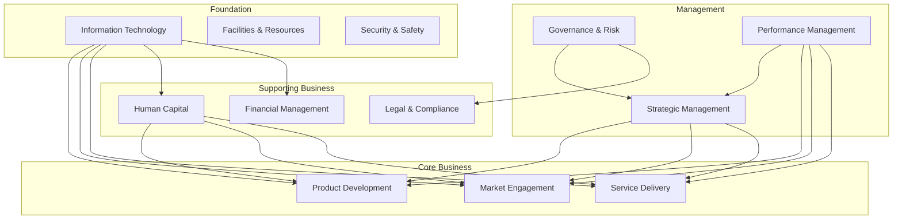

# Business Capability Map Framework

**Document Version:** 1.0  
**Date:** August 22, 2025  
**Issue Reference:** GitHub Issue #13

---

## Executive Summary

This Business Capability Map Framework provides organizations with a structured approach to identify, categorize, assess, and visualize their business capabilities. Drawing insights from the PCI Security Standards Council analysis (Issue #12), this framework emphasizes the critical relationship between organizational capabilities and strategic execution effectiveness.

**Key Framework Components:**
- **Four-Tier Capability Hierarchy:** Core, Supporting, Management, and Foundation capabilities
- **Visual Mapping Techniques:** Multiple representation methods for different stakeholder needs
- **Assessment Methodology:** Maturity-based evaluation framework
- **Implementation Toolkit:** Templates, tools, and governance structures

---

## 1. Business Capability Framework Overview

### 1.1 What is a Business Capability?

**Definition:** A business capability represents what an organization does or can do to create value. It describes business functions independent of how they are organized, what processes are used, or what technology supports them.

**Key Characteristics:**
- **Stable:** Capabilities change slowly over time
- **Outcome-Focused:** Describes what is delivered, not how
- **Technology-Independent:** Abstract from implementation details
- **Hierarchical:** Can be decomposed into sub-capabilities

### 1.2 Capability Hierarchy Structure

```
Level 1: Capability Domains (4-8 domains)
├── Level 2: Capability Groups (15-25 groups)
    ├── Level 3: Capabilities (50-100 capabilities)
        └── Level 4: Sub-Capabilities (150-300 sub-capabilities)
```

### 1.3 Four Primary Capability Domains

#### **Domain 1: Core Business Capabilities**
Capabilities that directly create value for customers and differentiate the organization

#### **Domain 2: Supporting Business Capabilities**
Capabilities that enable and support core business functions

#### **Domain 3: Management Capabilities**
Capabilities that provide oversight, governance, and strategic direction

#### **Domain 4: Foundation Capabilities**
Infrastructure and platform capabilities that enable all business operations

---

## 2. Detailed Capability Taxonomy

### 2.1 Core Business Capabilities

Strategic capabilities that directly deliver value to customers and stakeholders.

#### **2.1.1 Product & Service Development**
- **Product Innovation**
  - Market Research & Analysis
  - Product Concept Development
  - Product Design & Engineering
  - Prototype Development & Testing
  - Intellectual Property Management
  
- **Service Design**
  - Service Concept Development
  - Customer Journey Mapping
  - Service Blueprint Creation
  - Service Testing & Validation
  - Service Launch Management

- **Research & Development**
  - Innovation Strategy Development
  - Technology Research
  - Applied Research
  - Development Project Management
  - Innovation Portfolio Management

#### **2.1.2 Market Engagement**
- **Marketing & Brand Management**
  - Brand Strategy Development
  - Marketing Campaign Management
  - Digital Marketing
  - Content Creation & Management
  - Market Segmentation & Targeting

- **Customer Acquisition**
  - Lead Generation
  - Sales Process Management
  - Proposal Development
  - Contract Negotiation
  - Customer Onboarding

- **Customer Relationship Management**
  - Customer Support Services
  - Customer Success Management
  - Customer Retention Programs
  - Customer Feedback Management
  - Customer Analytics

#### **2.1.3 Service Delivery**
- **Operations Management**
  - Production Planning
  - Quality Management
  - Process Optimization
  - Resource Scheduling
  - Performance Monitoring

- **Supply Chain Management**
  - Supplier Relationship Management
  - Procurement
  - Inventory Management
  - Distribution & Logistics
  - Supply Chain Analytics

- **Customer Service**
  - Service Request Management
  - Issue Resolution
  - Service Level Management
  - Customer Communication
  - Service Quality Assurance

### 2.2 Supporting Business Capabilities

Capabilities that enable core business functions and ensure organizational effectiveness.

#### **2.2.1 Human Capital Management**
- **Talent Acquisition**
  - Workforce Planning
  - Recruitment & Selection
  - Onboarding
  - Background Verification
  - Talent Pipeline Development

- **Employee Development**
  - Training & Development
  - Performance Management
  - Career Development
  - Succession Planning
  - Knowledge Management

- **Employee Relations**
  - Compensation & Benefits
  - Employee Engagement
  - Workplace Culture
  - Employee Communications
  - Conflict Resolution

#### **2.2.2 Financial Management**
- **Financial Planning & Analysis**
  - Budget Development
  - Financial Forecasting
  - Cost Management
  - Investment Analysis
  - Financial Reporting

- **Accounting & Control**
  - General Ledger Management
  - Accounts Payable/Receivable
  - Asset Management
  - Tax Management
  - Audit & Compliance

- **Treasury Management**
  - Cash Flow Management
  - Risk Management
  - Investment Management
  - Banking Relationships
  - Credit Management

#### **2.2.3 Legal & Compliance**
- **Legal Support**
  - Contract Management
  - Legal Advisory
  - Litigation Management
  - Intellectual Property
  - Regulatory Affairs

- **Compliance Management**
  - Policy Development
  - Compliance Monitoring
  - Regulatory Reporting
  - Risk Assessment
  - Compliance Training

### 2.3 Management Capabilities

Capabilities that provide governance, oversight, and strategic direction.

#### **2.3.1 Strategic Management**
- **Strategy Development**
  - Strategic Planning
  - Market Analysis
  - Competitive Intelligence
  - Business Model Innovation
  - Strategic Portfolio Management

- **Strategy Execution**
  - Initiative Management
  - Change Management
  - Performance Management
  - Resource Allocation
  - Strategy Communication

#### **2.3.2 Governance & Risk Management**
- **Corporate Governance**
  - Board Management
  - Executive Management
  - Policy & Procedure Management
  - Ethics & Compliance
  - Stakeholder Relations

- **Risk Management**
  - Risk Identification
  - Risk Assessment
  - Risk Mitigation
  - Risk Monitoring
  - Crisis Management

#### **2.3.3 Performance Management**
- **Business Performance**
  - KPI Management
  - Business Intelligence
  - Performance Analytics
  - Benchmarking
  - Continuous Improvement

- **Quality Management**
  - Quality Planning
  - Quality Assurance
  - Quality Control
  - Quality Improvement
  - Quality Systems Management

### 2.4 Foundation Capabilities

Infrastructure and platform capabilities that enable all business operations.

#### **2.4.1 Information Technology**
- **Technology Infrastructure**
  - Data Center Management
  - Network Management
  - Cloud Services Management
  - Security Management
  - Infrastructure Monitoring

- **Application Services**
  - Application Development
  - Application Maintenance
  - System Integration
  - Data Management
  - User Support

- **Digital Platform**
  - Platform Architecture
  - API Management
  - Data Analytics Platform
  - Digital Asset Management
  - Platform Governance

#### **2.4.2 Facilities & Resources**
- **Facilities Management**
  - Real Estate Management
  - Facility Operations
  - Maintenance Management
  - Space Planning
  - Environmental Management

- **Asset Management**
  - Equipment Management
  - Asset Tracking
  - Maintenance Planning
  - Asset Disposal
  - Asset Optimization

#### **2.4.3 Security & Safety**
- **Information Security**
  - Security Strategy
  - Access Management
  - Data Protection
  - Incident Response
  - Security Monitoring

- **Physical Security**
  - Access Control
  - Surveillance Systems
  - Emergency Response
  - Safety Programs
  - Security Training

---

## 3. Capability Assessment Framework

### 3.1 Maturity Model

#### **Level 1: Initial (Ad Hoc)**
- **Characteristics:** Unpredictable, poorly controlled, reactive
- **Description:** Capability exists but is not formally managed
- **Key Indicators:**
  - No documented processes
  - Inconsistent execution
  - Results depend on individual heroics
  - Limited measurement or improvement

#### **Level 2: Managed (Repeatable)**
- **Characteristics:** Characterized for projects, often reactive
- **Description:** Basic capability management with some repeatability
- **Key Indicators:**
  - Basic processes documented
  - Some performance measurement
  - Project-level management
  - Informal knowledge sharing

#### **Level 3: Defined (Proactive)**
- **Characteristics:** Characterized for organization, proactive
- **Description:** Well-defined and understood capability with consistent execution
- **Key Indicators:**
  - Standardized processes
  - Regular performance monitoring
  - Formal training programs
  - Process improvement activities

#### **Level 4: Quantitatively Managed (Measured)**
- **Characteristics:** Measured and controlled
- **Description:** Capability performance is predictable and measured
- **Key Indicators:**
  - Statistical process control
  - Quantitative quality goals
  - Performance prediction
  - Data-driven decisions

#### **Level 5: Optimizing (Innovative)**
- **Characteristics:** Focus on continuous improvement
- **Description:** Continuous capability improvement and innovation
- **Key Indicators:**
  - Continuous improvement culture
  - Innovation in capability delivery
  - Technology-enabled optimization
  - Industry leadership

### 3.2 Assessment Dimensions

#### **3.2.1 Capability Effectiveness**
- **Definition:** How well the capability delivers intended outcomes
- **Measurement:** Quality, accuracy, customer satisfaction
- **Scale:** 1-5 (Poor to Excellent)

#### **3.2.2 Capability Efficiency**
- **Definition:** Resource utilization and cost-effectiveness
- **Measurement:** Cost per unit, time to delivery, resource utilization
- **Scale:** 1-5 (Inefficient to Highly Efficient)

#### **3.2.3 Capability Agility**
- **Definition:** Ability to adapt and respond to change
- **Measurement:** Time to implement changes, flexibility, responsiveness
- **Scale:** 1-5 (Rigid to Highly Agile)

#### **3.2.4 Capability Innovation**
- **Definition:** Level of innovation and continuous improvement
- **Measurement:** New ideas implemented, improvement rate, competitive advantage
- **Scale:** 1-5 (Static to Highly Innovative)

### 3.3 Assessment Process

#### **Phase 1: Capability Identification**
1. **Stakeholder Interviews**
   - Executive leadership perspectives
   - Business unit manager inputs
   - Process owner insights
   - Employee feedback

2. **Document Analysis**
   - Organizational charts
   - Process documentation
   - System inventories
   - Performance reports

3. **Capability Mapping Workshop**
   - Cross-functional team collaboration
   - Capability hierarchy development
   - Relationship mapping
   - Initial assessment

#### **Phase 2: Detailed Assessment**
1. **Maturity Assessment**
   - Current state evaluation
   - Maturity level scoring
   - Evidence collection
   - Gap identification

2. **Performance Measurement**
   - Effectiveness metrics
   - Efficiency indicators
   - Quality measures
   - Customer feedback

3. **Future State Vision**
   - Desired maturity levels
   - Performance targets
   - Investment requirements
   - Timeline development

#### **Phase 3: Action Planning**
1. **Priority Setting**
   - Strategic importance
   - Current performance gaps
   - Improvement potential
   - Resource requirements

2. **Roadmap Development**
   - Improvement initiatives
   - Timeline and milestones
   - Resource allocation
   - Success metrics

3. **Governance Framework**
   - Oversight structure
   - Review processes
   - Progress tracking
   - Continuous improvement

---

## 4. Visual Representation Models

### 4.1 Heat Map Visualization

#### **Purpose:** Show capability maturity across the organization at a glance

```
Capability Domain           Current Maturity    Target Maturity
Core Business              
├── Product Development         ●●●○○              ●●●●○
├── Market Engagement          ●●○○○              ●●●●○
└── Service Delivery           ●●●●○              ●●●●●

Supporting Business        
├── Human Capital              ●●●○○              ●●●●○
├── Financial Management       ●●●●○              ●●●●●
└── Legal & Compliance         ●●○○○              ●●●○○

Management                 
├── Strategic Management       ●●○○○              ●●●●○
├── Governance & Risk          ●●●○○              ●●●●●
└── Performance Management     ●●●○○              ●●●●○

Foundation                 
├── Information Technology     ●●●●○              ●●●●●
├── Facilities & Resources     ●●●○○              ●●●○○
└── Security & Safety          ●●○○○              ●●●●○

Legend: ○ = Level not achieved, ● = Level achieved
```

### 4.2 Network Diagram

#### **Purpose:** Show capability relationships and dependencies



### 4.3 Capability Stack Visualization

#### **Purpose:** Show layered capability architecture

```
┌─────────────────────────────────────────────────────────┐
│                  CORE BUSINESS LAYER                    │
│  Product Development │ Market Engagement │ Service Delivery │
├─────────────────────────────────────────────────────────┤
│                SUPPORTING BUSINESS LAYER                │
│  Human Capital │ Financial Mgmt │ Legal & Compliance   │
├─────────────────────────────────────────────────────────┤
│                   MANAGEMENT LAYER                      │
│  Strategic Mgmt │ Governance & Risk │ Performance Mgmt │
├─────────────────────────────────────────────────────────┤
│                   FOUNDATION LAYER                      │
│  Information Technology │ Facilities │ Security & Safety │
└─────────────────────────────────────────────────────────┘
```

---

## 5. Implementation Guidelines

### 5.1 Implementation Phases

#### **Phase 1: Foundation (Months 1-3)**
**Objective:** Establish capability mapping framework and initial assessment

**Key Activities:**
- Stakeholder alignment and buy-in
- Capability taxonomy customization
- Initial capability inventory
- Assessment team formation
- Tool and template preparation

**Deliverables:**
- Customized capability framework
- Initial capability inventory
- Assessment methodology
- Project charter and roadmap

#### **Phase 2: Assessment (Months 3-6)**
**Objective:** Conduct comprehensive capability assessment

**Key Activities:**
- Detailed capability assessments
- Maturity level evaluation
- Performance measurement
- Gap analysis
- Stakeholder validation

**Deliverables:**
- Current state capability map
- Maturity assessment report
- Performance measurement results
- Gap analysis documentation

#### **Phase 3: Planning (Months 6-9)**
**Objective:** Develop improvement roadmap and action plans

**Key Activities:**
- Future state vision development
- Priority setting and sequencing
- Improvement initiative definition
- Resource planning
- Timeline development

**Deliverables:**
- Target state capability map
- Improvement roadmap
- Initiative definitions
- Resource allocation plan

#### **Phase 4: Execution (Months 9-18)**
**Objective:** Implement capability improvements

**Key Activities:**
- Initiative execution
- Progress monitoring
- Course correction
- Stakeholder communication
- Continuous improvement

**Deliverables:**
- Improved capabilities
- Progress reports
- Lessons learned
- Updated capability maps

### 5.2 Success Factors

#### **Critical Success Factors:**
1. **Executive Sponsorship:** Strong leadership commitment and support
2. **Stakeholder Engagement:** Active participation from all business units
3. **Clear Methodology:** Well-defined and consistent assessment approach
4. **Practical Tools:** User-friendly templates and assessment instruments
5. **Continuous Improvement:** Regular updates and refinements

#### **Common Pitfalls to Avoid:**
1. **Over-Complexity:** Creating overly detailed capability hierarchies
2. **Analysis Paralysis:** Spending too much time on assessment vs. action
3. **Lack of Ownership:** Not assigning clear accountability for capabilities
4. **Static Approach:** Treating capability maps as one-time exercises
5. **Technology Focus:** Emphasizing systems over capabilities

### 5.3 Governance Framework

#### **Governance Structure:**
- **Steering Committee:** Executive oversight and strategic direction
- **Capability Office:** Day-to-day management and coordination
- **Domain Champions:** Business unit representation and advocacy
- **Assessment Teams:** Detailed analysis and evaluation

#### **Review Cycles:**
- **Quarterly Reviews:** Progress monitoring and course correction
- **Annual Assessment:** Comprehensive capability evaluation update
- **Strategic Reviews:** Major capability framework revisions (every 2-3 years)

---

## 6. Templates and Tools

### 6.1 Assessment Templates

#### **Capability Assessment Worksheet**
```
Capability Name: _________________________________
Domain: _________________________________________
Owner: __________________________________________
Description: ____________________________________

Current State Assessment:
□ Maturity Level: [ ] 1  [ ] 2  [ ] 3  [ ] 4  [ ] 5
□ Effectiveness Score: ___/5
□ Efficiency Score: ___/5
□ Agility Score: ___/5
□ Innovation Score: ___/5

Key Strengths:
1. ____________________________________________
2. ____________________________________________
3. ____________________________________________

Key Gaps:
1. ____________________________________________
2. ____________________________________________
3. ____________________________________________

Improvement Recommendations:
1. ____________________________________________
2. ____________________________________________
3. ____________________________________________

Priority Level: [ ] High  [ ] Medium  [ ] Low
```

#### **Capability Relationship Mapping**
```
Primary Capability: _____________________________

Depends On (Input Capabilities):
1. ____________________________________________
2. ____________________________________________
3. ____________________________________________

Enables (Output Capabilities):
1. ____________________________________________
2. ____________________________________________
3. ____________________________________________

Collaborates With (Peer Capabilities):
1. ____________________________________________
2. ____________________________________________
3. ____________________________________________
```

### 6.2 Visualization Tools

#### **Heat Map Template**
- Color-coded maturity levels
- Current vs. target state comparison
- Priority indicators
- Trend arrows

#### **Network Diagram Generator**
- Automated relationship mapping
- Interactive capability exploration
- Dependency chain visualization
- Impact analysis

### 6.3 Reporting Templates

#### **Executive Dashboard**
- Overall capability maturity summary
- Priority improvement areas
- Progress against targets
- Investment recommendations

#### **Detailed Assessment Report**
- Capability-by-capability analysis
- Maturity level details
- Performance metrics
- Improvement roadmaps

---

## 7. Integration with Enterprise Architecture

### 7.1 Business Architecture Integration

#### **Capability-to-Process Mapping**
- Process ownership alignment
- Capability enablement relationships
- Process performance impact
- Optimization opportunities

#### **Capability-to-Organization Mapping**  
- Organizational responsibility assignment
- Cross-functional capability coordination
- Governance structure alignment
- Skills and competency requirements

### 7.2 Technology Architecture Integration

#### **Capability-to-System Mapping**
- Technology enablement relationships
- System capability support assessment
- Technology gap identification
- Digital transformation priorities

#### **Capability-to-Data Mapping**
- Data requirements for capabilities
- Information flow analysis
- Data quality impact assessment
- Data governance alignment

### 7.3 Solution Architecture Integration

#### **Capability-Based Solution Design**
- Solution scope definition using capabilities
- Capability impact assessment for projects
- Solution architecture validation
- Business value realization tracking

---

## 8. Industry-Specific Considerations

### 8.1 Financial Services

**Key Capabilities:**
- Risk Management
- Regulatory Compliance
- Customer Due Diligence
- Transaction Processing
- Investment Management

**Special Considerations:**
- Regulatory change management
- Risk-adjusted performance
- Customer privacy protection
- Anti-money laundering
- Data sovereignty requirements

### 8.2 Healthcare

**Key Capabilities:**
- Patient Care Management
- Clinical Decision Support
- Health Information Management
- Regulatory Compliance
- Quality Assurance

**Special Considerations:**
- Patient safety requirements
- Privacy and security regulations
- Clinical workflow integration
- Interoperability standards
- Evidence-based practices

### 8.3 Manufacturing

**Key Capabilities:**
- Production Planning
- Quality Control
- Supply Chain Management
- Asset Management
- Safety Management

**Special Considerations:**
- Operational technology integration
- Safety and environmental compliance
- Supply chain resilience
- Predictive maintenance
- Lean manufacturing principles

### 8.4 Technology Sector

**Key Capabilities:**
- Product Development
- Innovation Management
- Intellectual Property Management
- Technical Support
- Platform Management

**Special Considerations:**
- Rapid technology evolution
- Intellectual property protection
- Scalability requirements
- Security and privacy
- Developer ecosystem management

---

## 9. Advanced Topics

### 9.1 Dynamic Capability Management

#### **Capability Evolution Tracking**
- Capability lifecycle management
- Evolution pattern analysis
- Emerging capability identification
- Obsolete capability retirement

#### **Adaptive Capability Framework**
- Context-sensitive capability definitions
- Dynamic maturity models
- Responsive assessment approaches
- Agile improvement methodologies

### 9.2 Capability-Based Planning

#### **Strategic Planning Integration**
- Capability gap-based strategy development
- Capability investment prioritization
- Strategic initiative capability alignment
- Competitive advantage through capabilities

#### **Investment Decision Framework**
- Capability ROI modeling
- Investment portfolio optimization
- Risk-adjusted capability investments
- Value realization tracking

### 9.3 Ecosystem Capability Mapping

#### **Partner Capability Integration**
- External capability identification
- Partnership capability models
- Ecosystem capability optimization
- Collaborative capability development

#### **Supply Chain Capability Mapping**
- End-to-end capability visibility
- Supply chain resilience assessment
- Capability risk management
- Supplier capability development

---

## 10. Lessons Learned from PCI Analysis

### 10.1 Standards Organization Capabilities

Drawing from the PCI Security Standards Council analysis, key organizational capabilities include:

#### **Standards Development Capability**
- **Technical Leadership:** Ability to develop comprehensive, industry-leading standards
- **Multi-Stakeholder Coordination:** Managing diverse stakeholder input and collaboration
- **Continuous Evolution:** Adapting standards to emerging threats and technologies
- **Global Standardization:** Creating globally applicable and locally adaptable standards

#### **Quality Assurance Capability**
- **Assessment Methodology:** Developing consistent evaluation frameworks
- **Assessor Management:** Training, certifying, and monitoring assessment professionals
- **Quality Control:** Ensuring consistent application of standards and assessments
- **Continuous Improvement:** Learning from assessment outcomes and refining processes

#### **Implementation Support Capability**
- **Practical Guidance:** Translating technical standards into actionable implementation guidance
- **Stakeholder Education:** Providing training and resources for effective implementation
- **Technical Assistance:** Supporting organizations in standards adoption and compliance
- **Best Practice Sharing:** Facilitating knowledge sharing and peer learning

### 10.2 Critical Success Factors

#### **Execution Excellence Over Technical Excellence**
- Having great capabilities on paper is insufficient
- Implementation quality and consistency determine actual value
- Gap between capability definition and delivery undermines organizational effectiveness

#### **Stakeholder-Centric Capability Design**
- Capabilities must be designed for actual user needs, not theoretical requirements
- Different stakeholder segments require different capability expressions
- One-size-fits-all approaches often fail to serve any segment well

#### **Quality Assurance Integration**
- Quality control cannot be an afterthought
- Capability assessment must include delivery quality measurement
- Feedback loops essential for continuous capability improvement

### 10.3 Implementation Insights

#### **Balance Standardization with Flexibility**
- Standardized approaches enable consistency and efficiency
- Local adaptation necessary for diverse contexts and requirements
- Framework should provide structure while allowing customization

#### **Invest in Implementation Support**
- Clear, actionable guidance as important as capability definition
- Practical tools and templates accelerate adoption
- Ongoing support essential for sustained capability improvement

#### **Continuous Monitoring and Improvement**
- Point-in-time assessments provide limited value
- Ongoing monitoring enables proactive capability management
- Regular feedback collection drives continuous improvement

---

## Conclusion

The Business Capability Map Framework provides organizations with a comprehensive approach to understanding, assessing, and improving their business capabilities. By adopting this structured methodology, organizations can:

- **Gain Clear Visibility:** Understand what capabilities exist and their current maturity
- **Make Informed Decisions:** Use capability insights to guide strategic planning and investment
- **Drive Improvement:** Focus improvement efforts on capabilities that matter most
- **Enable Transformation:** Use capability maps to plan and execute organizational changes
- **Measure Progress:** Track capability improvement over time

The framework emphasizes practical implementation over theoretical perfection, drawing lessons from real-world organizational challenges and successes. By maintaining focus on stakeholder value and continuous improvement, organizations can build and sustain competitive advantage through superior business capabilities.

---

**Document Author:** Implementation Agent  
**Review Status:** Ready for Stakeholder Review  
**Next Steps:** Template development and pilot implementation  
**Framework Version:** 1.0