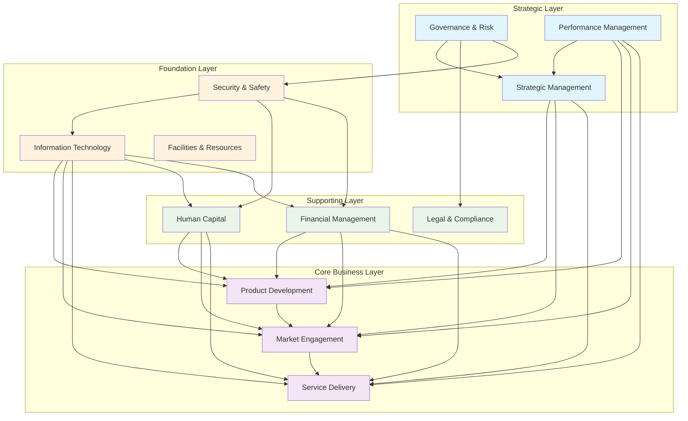
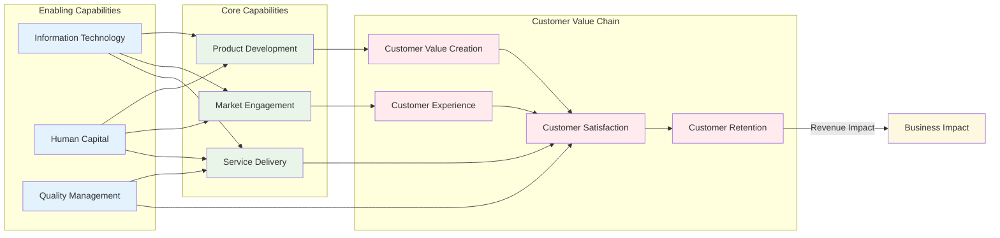
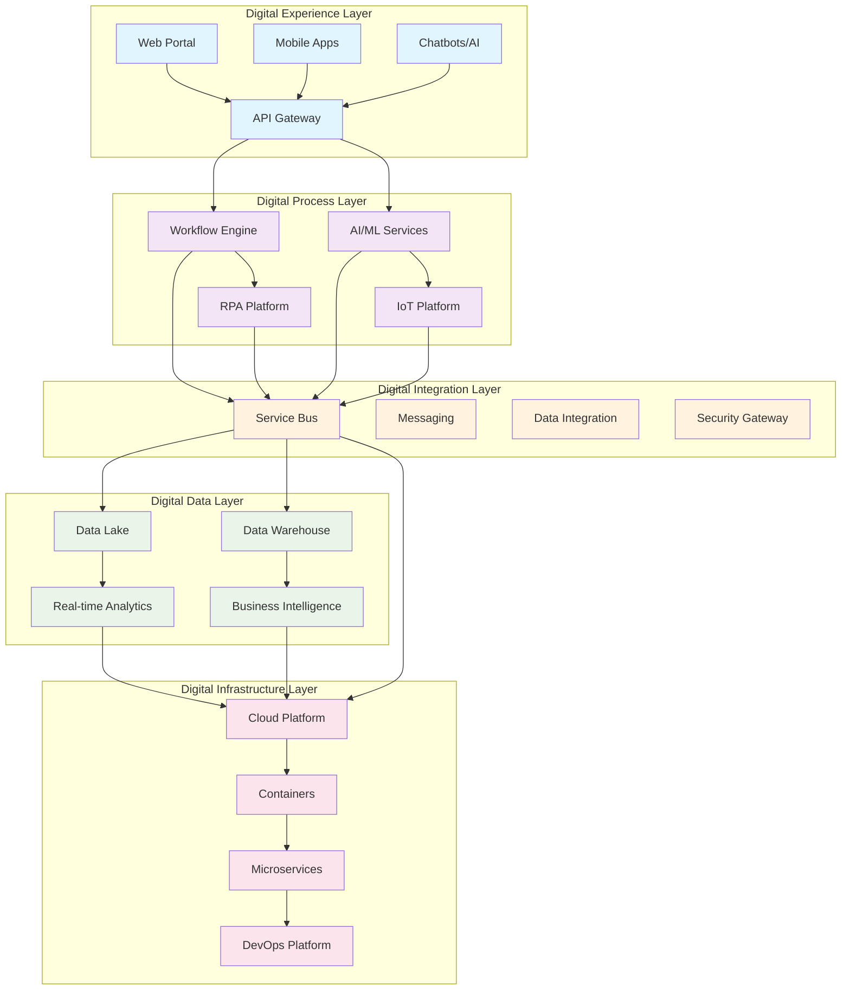

# Business Capability Visual Models

**Document Version:** 1.0  
**Date:** August 22, 2025  
**Issue Reference:** GitHub Issue #13

---

## Executive Summary

This document provides comprehensive visual modeling approaches for representing business capabilities. The models support different stakeholder needs and communication requirements, from high-level executive overviews to detailed operational capability maps.

**Visual Model Types:**
- **Heat Map Visualizations:** Maturity and performance at-a-glance
- **Network Diagrams:** Capability relationships and dependencies  
- **Hierarchical Models:** Capability structure and decomposition
- **Process Integration Maps:** Capability-to-process relationships
- **Technology Architecture Maps:** Capability-to-system relationships

---

## 1. Visual Model Framework

### 1.1 Model Selection Criteria

#### **Stakeholder-Driven Model Selection:**

| Stakeholder Group | Primary Need | Recommended Models | Key Features |
|-------------------|--------------|-------------------|--------------|
| **Executives** | Strategic overview | Heat Maps, Executive Dashboard | High-level, color-coded, trend-focused |
| **Business Managers** | Operational insight | Network Diagrams, Process Maps | Relationship-focused, actionable detail |
| **Architects** | Technical alignment | System Integration Maps | Technology-business alignment |
| **Process Owners** | Process optimization | Process-Capability Matrix | Process improvement focus |
| **Project Managers** | Implementation planning | Roadmap Visualizations | Timeline and dependency focus |

#### **Communication Purpose:**

| Purpose | Model Type | Visual Approach | Key Elements |
|---------|------------|-----------------|--------------|
| **Current State Analysis** | Heat Maps | Red-amber-green coloring | Performance gaps, priorities |
| **Future State Planning** | Target State Maps | Aspiration visualization | Goals, timelines, investments |
| **Gap Analysis** | Before/After Comparisons | Side-by-side visualization | Improvement areas, progress |
| **Relationship Analysis** | Network Diagrams | Connected node visualization | Dependencies, interfaces |
| **Investment Planning** | Portfolio Maps | Size/color/position coding | Investment size, priority, timeline |

### 1.2 Visual Design Principles

#### **Principle 1: Clarity Over Complexity**
- Minimize visual clutter
- Use consistent symbols and colors
- Focus on key messages
- Provide layered detail options

#### **Principle 2: Stakeholder-Appropriate Detail**
- Executive level: High-level summaries
- Management level: Operational details
- Technical level: Implementation specifics
- User level: Interface and experience focus

#### **Principle 3: Action-Oriented Design**
- Highlight areas requiring attention
- Show improvement opportunities
- Enable drill-down analysis
- Support decision-making

---

## 2. Heat Map Visualizations

### 2.1 Capability Maturity Heat Map

#### **Purpose:** Show capability maturity levels across the organization at a glance

```
BUSINESS CAPABILITY MATURITY MAP
Current State Assessment (Date: August 2025)

                                    L1   L2   L3   L4   L5
CORE BUSINESS CAPABILITIES         [■■■■■■■■■■■■■■■■■■■■]
├─ Product & Service Development    ●●●○○  Target: ●●●●○
├─ Market Engagement               ●●○○○  Target: ●●●●○
└─ Service Delivery                ●●●●○  Target: ●●●●●

SUPPORTING BUSINESS CAPABILITIES   [■■■■■■■■■■■■■■■■■■■■]
├─ Human Capital Management        ●●●○○  Target: ●●●●○
├─ Financial Management            ●●●●○  Target: ●●●●●
└─ Legal & Compliance              ●●○○○  Target: ●●●○○

MANAGEMENT CAPABILITIES            [■■■■■■■■■■■■■■■■■■■■]
├─ Strategic Management            ●●○○○  Target: ●●●●○
├─ Governance & Risk Management    ●●●○○  Target: ●●●●●
└─ Performance Management          ●●●○○  Target: ●●●●○

FOUNDATION CAPABILITIES            [■■■■■■■■■■■■■■■■■■■■]
├─ Information Technology          ●●●●○  Target: ●●●●●
├─ Facilities & Resources          ●●●○○  Target: ●●●○○
└─ Security & Safety               ●●○○○  Target: ●●●●○

Legend:
○ = Level not achieved    ● = Level achieved
Colors: Red (L1-L2), Amber (L3), Green (L4-L5)
Priority: ■ = High, ■ = Medium, ■ = Low
```

#### **Interactive Heat Map Features:**
- **Click-through Detail:** Click on any capability for detailed assessment
- **Filter Options:** View by domain, priority, or maturity level
- **Trend Analysis:** Show maturity progression over time
- **Comparison Views:** Current vs. target state side-by-side

### 2.2 Performance Heat Map

#### **Purpose:** Show capability performance across multiple dimensions

```
CAPABILITY PERFORMANCE DASHBOARD
Multi-Dimensional Assessment View

Capability                    Effectiveness  Efficiency  Agility  Innovation  Overall
Product Development              85%  ■■■■□     72%  ■■■□□   68%  ■■■□□   91%  ■■■■■    79%  ■■■■□
Market Engagement               67%  ■■■□□     83%  ■■■■□   75%  ■■■■□   54%  ■■□□□    70%  ■■■□□
Service Delivery                91%  ■■■■■     88%  ■■■■□   82%  ■■■■□   71%  ■■■□□    83%  ■■■■□
Human Capital                   73%  ■■■□□     69%  ■■■□□   71%  ■■■□□   58%  ■■□□□    68%  ■■■□□
Financial Management            92%  ■■■■■     87%  ■■■■□   76%  ■■■■□   63%  ■■■□□    80%  ■■■■□
Information Technology          86%  ■■■■□     91%  ■■■■■   89%  ■■■■■   85%  ■■■■□    88%  ■■■■□

Color Coding:
Green (90-100%): Excellent       ■■■■■
Blue (80-89%):   Good            ■■■■□  
Yellow (70-79%): Adequate        ■■■□□
Orange (60-69%): Needs Attention ■■□□□
Red (0-59%):     Poor            ■□□□□
```

### 2.3 Strategic Importance vs. Performance Matrix

```
STRATEGIC CAPABILITY PORTFOLIO
Importance vs. Performance Analysis

High Strategic    │ QUESTION MARKS        │ STARS
Importance        │ • Human Capital Mgmt   │ • Service Delivery
                 │ • Market Engagement    │ • Information Technology  
                 │                        │ • Product Development
                 │ (Invest for Growth)    │ (Maintain Excellence)
─────────────────┼────────────────────────┼─────────────────────────
                 │ CASH COWS             │ DOGS
Low Strategic    │ • Financial Management │ • Facilities Management
Importance       │ • Legal & Compliance   │ • (None currently)
                 │                        │
                 │ (Optimize Efficiency)  │ (Divest/Outsource)

                  Low Performance ←――――――→ High Performance
```

---

## 3. Network Diagrams

### 3.1 Capability Dependency Network

#### **Purpose:** Show how capabilities depend on and enable each other



### 3.2 Capability Impact Network

#### **Purpose:** Show the business impact propagation through capability networks



### 3.3 Capability Collaboration Network

#### **Purpose:** Show collaborative relationships and information flows

```
CAPABILITY COLLABORATION MAP

┌─────────────────────────────────────────────────────────────────┐
│                    STRATEGIC MANAGEMENT                         │
│  ┌─────────────┐    ┌─────────────┐    ┌─────────────┐        │
│  │   Vision    │◄──►│   Strategy  │◄──►│  Planning   │        │
│  │ Development │    │ Development │    │ & Execution │        │
│  └─────────────┘    └─────────────┘    └─────────────┘        │
└─────────────────────────────┬───────────────────────────────────┘
                              │ Strategic Direction
                              ▼
┌─────────────────────────────────────────────────────────────────┐
│                      CORE BUSINESS                              │
│  ┌─────────────┐    ┌─────────────┐    ┌─────────────┐        │
│  │   Product   │◄──►│   Market    │◄──►│   Service   │        │
│  │ Development │    │ Engagement  │    │  Delivery   │        │
│  └─────────────┘    └─────────────┘    └─────────────┘        │
└─────────────────────────────┬───────────────────────────────────┘
                              │ Business Requirements
                              ▼
┌─────────────────────────────────────────────────────────────────┐
│                    SUPPORTING SERVICES                          │
│  ┌─────────────┐    ┌─────────────┐    ┌─────────────┐        │
│  │    Human    │◄──►│  Financial  │◄──►│Legal & Comp │        │
│  │   Capital   │    │ Management  │    │   -liance   │        │
│  └─────────────┘    └─────────────┘    └─────────────┘        │
└─────────────────────────────┬───────────────────────────────────┘
                              │ Service Delivery
                              ▼
┌─────────────────────────────────────────────────────────────────┐
│                      FOUNDATION                                 │
│  ┌─────────────┐    ┌─────────────┐    ┌─────────────┐        │
│  │Information  │◄──►│ Facilities  │◄──►│ Security &  │        │
│  │ Technology  │    │   & Res.    │    │   Safety    │        │
│  └─────────────┘    └─────────────┘    └─────────────┘        │
└─────────────────────────────────────────────────────────────────┘

Legend:
◄──► Bi-directional collaboration
──► Unidirectional dependency
● High interaction frequency
○ Medium interaction frequency
□ Low interaction frequency
```

---

## 4. Hierarchical Models

### 4.1 Capability Decomposition Tree

#### **Purpose:** Show capability hierarchy from strategic to operational levels

```
BUSINESS CAPABILITY HIERARCHY
Enterprise Architecture View

Enterprise
├── Strategic Management (L1)
│   ├── Strategy Development (L2)
│   │   ├── Strategic Planning (L3)
│   │   ├── Market Analysis (L3)
│   │   ├── Competitive Intelligence (L3)
│   │   └── Business Model Innovation (L3)
│   └── Strategy Execution (L2)
│       ├── Initiative Management (L3)
│       ├── Change Management (L3)
│       └── Performance Management (L3)
│
├── Core Business (L1)
│   ├── Product & Service Development (L2)
│   │   ├── Product Innovation (L3)
│   │   │   ├── Market Research & Analysis (L4)
│   │   │   ├── Product Concept Development (L4)
│   │   │   ├── Product Design & Engineering (L4)
│   │   │   └── Prototype Development & Testing (L4)
│   │   ├── Service Design (L3)
│   │   └── Research & Development (L3)
│   │
│   ├── Market Engagement (L2)
│   │   ├── Marketing & Brand Management (L3)
│   │   ├── Customer Acquisition (L3)
│   │   └── Customer Relationship Management (L3)
│   │
│   └── Service Delivery (L2)
│       ├── Operations Management (L3)
│       ├── Supply Chain Management (L3)
│       └── Customer Service (L3)
│
├── Supporting Business (L1)
│   ├── Human Capital Management (L2)
│   ├── Financial Management (L2)
│   └── Legal & Compliance (L2)
│
└── Foundation (L1)
    ├── Information Technology (L2)
    ├── Facilities & Resources (L2)
    └── Security & Safety (L2)

Notation:
(L1) = Domain Level
(L2) = Group Level  
(L3) = Capability Level
(L4) = Sub-Capability Level
```

### 4.2 Capability Stack Architecture

#### **Purpose:** Show layered capability architecture with clear dependencies

```
CAPABILITY STACK ARCHITECTURE
Layered Enterprise View

┌─────────────────────────────────────────────────────────────────────┐
│                        BUSINESS STRATEGY LAYER                      │
│  Strategic Planning │ Vision & Mission │ Business Model Innovation  │
├─────────────────────────────────────────────────────────────────────┤
│                         CORE BUSINESS LAYER                        │
│  Product Development │ Market Engagement │ Service Delivery │ CRM   │
├─────────────────────────────────────────────────────────────────────┤
│                       BUSINESS SUPPORT LAYER                       │
│  HR Management │ Financial Mgmt │ Legal & Compliance │ Procurement  │
├─────────────────────────────────────────────────────────────────────┤
│                      BUSINESS CONTROL LAYER                        │
│  Governance │ Risk Management │ Quality Assurance │ Audit & Control │
├─────────────────────────────────────────────────────────────────────┤
│                      INFORMATION SERVICES LAYER                    │
│  Business Intelligence │ Data Management │ Analytics │ Reporting    │
├─────────────────────────────────────────────────────────────────────┤
│                     APPLICATION SERVICES LAYER                     │
│  Business Applications │ Integration │ Workflow │ Collaboration     │
├─────────────────────────────────────────────────────────────────────┤
│                      TECHNOLOGY SERVICES LAYER                     │
│  Compute │ Storage │ Network │ Security │ Database │ Middleware     │
├─────────────────────────────────────────────────────────────────────┤
│                       INFRASTRUCTURE LAYER                         │
│  Servers │ Network Equipment │ Storage Systems │ Security Appliances│
└─────────────────────────────────────────────────────────────────────┘

Layer Dependencies:
↑ Each layer enables the layers above it
↓ Each layer depends on the layers below it
⟷ Horizontal integration within layers
```

---

## 5. Process Integration Maps

### 5.1 Capability-to-Process Mapping

#### **Purpose:** Show how capabilities support business processes

```
CAPABILITY-TO-PROCESS MATRIX
Cross-Reference View

Business Processes →        │ Order │ Product │ Customer │ Financial │ HR
Capabilities ↓              │ Mgmt  │ Dev     │ Service  │ Close     │ Mgmt
─────────────────────────────┼───────┼─────────┼──────────┼───────────┼──────
Market Engagement           │  ●●●  │   ●●    │    ●●    │     ○     │  ○
Product Development          │   ●   │  ●●●    │     ●    │     ○     │  ○
Service Delivery            │  ●●●  │    ○    │   ●●●    │     ●     │  ○
Customer Relationship Mgmt   │  ●●   │    ●    │   ●●●    │     ○     │  ○
Financial Management         │   ●   │    ●    │     ●    │    ●●●    │  ●
Human Capital Management     │   ○   │    ●    │     ●    │     ●     │ ●●●
Information Technology       │  ●●   │   ●●    │    ●●    │    ●●     │ ●●
Governance & Risk           │   ●   │    ●    │     ●    │    ●●     │  ●
Quality Management          │  ●●   │   ●●    │    ●●    │     ●     │  ●

Legend:
●●● Primary enabler (capability is critical for process success)
●●  Secondary enabler (capability significantly supports process)  
●   Supporting role (capability provides some support)
○   Minimal involvement (limited capability contribution)
```

### 5.2 Process Flow Capability Map

#### **Purpose:** Show capability involvement throughout process flows

```
CUSTOMER ACQUISITION PROCESS FLOW
Capability Involvement Map

┌─────────────┐    ┌─────────────┐    ┌─────────────┐    ┌─────────────┐
│    Lead     │    │   Sales     │    │  Proposal   │    │ Contract    │
│ Generation  │───▶│ Engagement  │───▶│Development  │───▶│Negotiation  │
└─────────────┘    └─────────────┘    └─────────────┘    └─────────────┘
      │                    │                    │                    │
      ▼                    ▼                    ▼                    ▼
┌─────────────┐    ┌─────────────┐    ┌─────────────┐    ┌─────────────┐
│   Market    │    │  Customer   │    │ Solution    │    │   Legal     │
│ Engagement  │    │Relationship │    │Development  │    │& Compliance │
└─────────────┘    └─────────────┘    └─────────────┘    └─────────────┘

┌─────────────┐    ┌─────────────┐    ┌─────────────┐    ┌─────────────┐
│ Information │    │  Financial  │    │Information  │    │Information  │
│ Technology  │    │ Management  │    │Technology   │    │Technology   │
└─────────────┘    └─────────────┘    └─────────────┘    └─────────────┘

Process Steps:
1. Lead Generation → Marketing campaigns, content creation, lead qualification
2. Sales Engagement → Customer meetings, needs analysis, solution presentation
3. Proposal Development → Solution design, pricing, proposal creation
4. Contract Negotiation → Terms discussion, legal review, agreement finalization

Supporting Capabilities (always involved):
• Information Technology: CRM systems, proposal tools, contract management
• Financial Management: Pricing, costing, revenue recognition
• Legal & Compliance: Contract terms, regulatory requirements
```

---

## 6. Technology Architecture Maps

### 6.1 Capability-to-System Mapping

#### **Purpose:** Show how IT systems support business capabilities

```
CAPABILITY-SYSTEM ARCHITECTURE MAP
Technology Enablement View

Business Capability          │ Primary Systems        │ Supporting Systems
─────────────────────────────┼──────────────────────┼─────────────────────
Market Engagement           │ • CRM Platform        │ • Marketing Automation
                            │ • Marketing Platform   │ • Social Media Tools
                            │ • Web Analytics       │ • Content Management
─────────────────────────────┼──────────────────────┼─────────────────────
Product Development          │ • PLM System          │ • CAD/CAE Tools
                            │ • Project Management   │ • Testing Platforms
                            │ • Requirements Mgmt    │ • Collaboration Tools
─────────────────────────────┼──────────────────────┼─────────────────────
Service Delivery            │ • Service Management   │ • Scheduling Systems
                            │ • Workflow Engine     │ • Mobile Applications
                            │ • Quality Management  │ • IoT Platforms
─────────────────────────────┼──────────────────────┼─────────────────────
Financial Management         │ • ERP System          │ • Business Intelligence
                            │ • Financial Planning  │ • Expense Management
                            │ • Treasury Management │ • Risk Management
─────────────────────────────┼──────────────────────┼─────────────────────
Human Capital Management     │ • HRIS Platform       │ • Learning Management
                            │ • Talent Management   │ • Performance Mgmt
                            │ • Payroll System      │ • Collaboration Tools

System Integration Patterns:
◄──► Real-time integration
◄─ ─► Batch integration  
◄···► Event-based integration
```

### 6.2 Digital Capability Architecture

#### **Purpose:** Show digital transformation and technology adoption



---

## 7. Dashboard and Reporting Views

### 7.1 Executive Dashboard

#### **Purpose:** High-level capability overview for executive decision-making

```
EXECUTIVE CAPABILITY DASHBOARD
Enterprise Performance Overview

┌─────────────────────────────────────────────────────────────────────────┐
│                          CAPABILITY HEALTH                             │
│  Overall Score: 78% ▲ 5%     │  At Risk: 3 capabilities                │
│  Target Achievement: 85%      │  Improving: 8 capabilities              │
└─────────────────────────────────────────────────────────────────────────┘

┌──────────────────────┐ ┌──────────────────────┐ ┌──────────────────────┐
│   STRATEGIC KPIs     │ │   OPERATIONAL KPIs   │ │   INVESTMENT KPIs    │
│                      │ │                      │ │                      │
│ Customer Satisfaction│ │ Process Efficiency   │ │ ROI on Capability    │
│ 87% ▲ 3%            │ │ 92% ▲ 1%            │ │ Investment: 18%      │
│                      │ │                      │ │                      │
│ Market Share         │ │ Quality Score        │ │ Budget Utilization   │
│ 23% ▲ 2%            │ │ 94% ▲ 2%            │ │ 94% ▲ 1%            │
│                      │ │                      │ │                      │
│ Revenue Growth       │ │ Time to Market       │ │ Capability Maturity  │
│ 12% ▲ 1%            │ │ 8.5 months ▼ 0.5    │ │ Level 3.2 ▲ 0.3     │
└──────────────────────┘ └──────────────────────┘ └──────────────────────┘

CAPABILITY PORTFOLIO HEAT MAP
┌─────────────────────────────────────────────────────────────────────────┐
│ Core Business        │ Supporting Business  │ Management │ Foundation   │
│ ■■■■□ Product Dev    │ ■■■□□ Human Capital  │ ■■□□□ Strategy │ ■■■■□ IT  │
│ ■■□□□ Marketing      │ ■■■■□ Finance        │ ■■■□□ Govern.  │ ■■■□□ Fac │
│ ■■■■□ Service        │ ■■□□□ Legal/Comp     │ ■■■□□ Perform. │ ■■□□□ Sec │
└─────────────────────────────────────────────────────────────────────────┘

TOP PRIORITIES FOR EXECUTIVE ATTENTION
1. 🔴 Marketing Capability - Customer acquisition performance declining
2. 🟡 Human Capital - Skills gap affecting product development
3. 🟡 Strategic Management - Need better competitive intelligence
```

### 7.2 Operational Dashboard

#### **Purpose:** Detailed capability performance for operational management

```
OPERATIONAL CAPABILITY DASHBOARD
Department Performance Detail

Service Delivery Capability Deep Dive
┌─────────────────────────────────────────────────────────────────────────┐
│ PERFORMANCE METRICS (Current Month)                                    │
│ Service Level Achievement: 94.2% (Target: 95%)                        │
│ Customer Satisfaction: 4.3/5.0 (▲ 0.2 from last month)              │  
│ First Call Resolution: 78% (Target: 80%)                              │
│ Average Response Time: 2.1 hours (Target: 2.0 hours)                  │
└─────────────────────────────────────────────────────────────────────────┘

┌──────────────────────┐ ┌──────────────────────┐ ┌──────────────────────┐
│   TREND ANALYSIS     │ │   RESOURCE USAGE     │ │   QUALITY METRICS    │
│                      │ │                      │ │                      │
│ ↗ Improving (6 months│ │ Staff Utilization    │ │ Error Rate: 2.1%     │
│ ↘ Issues: Response   │ │ 87% (Target: 85%)    │ │ Rework Rate: 5.2%    │
│   time increasing    │ │                      │ │ Training Completion  │
│                      │ │ System Availability  │ │ 94% (Target: 100%)   │
│ 📈 Volume: +12% YTD  │ │ 99.7% (Target: 99.5%)│ │                      │
└──────────────────────┘ └──────────────────────┘ └──────────────────────┘

IMPROVEMENT INITIATIVES STATUS
Initiative                        │ Status    │ Impact    │ Due Date
─────────────────────────────────┼──────────┼──────────┼──────────
Automated Ticket Routing         │ In Progress│ -30 min  │ Sep 2025
Staff Training Program           │ Completed │ +15% FCR │ Aug 2025
Knowledge Base Enhancement       │ Planning  │ -20 min  │ Oct 2025
Customer Self-Service Portal     │ In Design │ -25% vol │ Nov 2025
```

---

## 8. Implementation Guidelines

### 8.1 Visual Model Development Process

#### **Phase 1: Requirements Gathering**
1. **Stakeholder Analysis**
   - Identify primary users of visual models
   - Understand decision-making needs
   - Determine update frequency requirements
   - Define success criteria

2. **Use Case Definition**
   - Strategic planning sessions
   - Operational performance reviews
   - Investment prioritization
   - Communication and training

#### **Phase 2: Model Design**
1. **Visual Design Standards**
   - Color schemes and coding
   - Symbol and icon libraries
   - Layout and formatting guidelines
   - Accessibility considerations

2. **Data Integration Planning**
   - Data source identification
   - Update mechanisms design
   - Quality assurance processes
   - Version control approaches

#### **Phase 3: Tool Selection and Development**
1. **Technology Platform Selection**
   - Visualization tools (Tableau, PowerBI, etc.)
   - Collaboration platforms (Miro, Visio, etc.)
   - Web-based solutions (D3.js, custom development)
   - Integration capabilities

2. **Template Development**
   - Standard model templates
   - Customization options
   - Export and sharing formats
   - Mobile-responsive design

### 8.2 Best Practices

#### **Design Best Practices:**
- **Consistency:** Use consistent colors, symbols, and layouts
- **Clarity:** Prioritize clear communication over visual complexity  
- **Interactivity:** Enable drill-down and filtering capabilities
- **Responsiveness:** Ensure models work across devices and screen sizes
- **Accessibility:** Consider color-blind users and screen readers

#### **Implementation Best Practices:**
- **Iterative Development:** Start simple and add complexity gradually
- **User Testing:** Validate models with actual users before deployment
- **Training:** Provide user training and documentation
- **Maintenance:** Establish regular update and review cycles
- **Feedback Integration:** Continuously improve based on user feedback

### 8.3 Tools and Technologies

#### **Visualization Tools:**
- **Tableau/PowerBI:** Business intelligence and dashboarding
- **D3.js:** Custom web-based visualizations
- **Miro/Lucidchart:** Collaborative diagramming
- **Visio:** Technical diagramming
- **Gephi:** Network analysis and visualization

#### **Data Integration:**
- **APIs:** Real-time data integration
- **ETL Tools:** Batch data processing
- **Databases:** Data storage and retrieval
- **File Formats:** CSV, JSON, XML for data exchange

---

## Conclusion

These visual models provide comprehensive approaches to representing business capabilities across different stakeholder needs and use cases. The models balance detail with clarity, enabling effective communication and decision-making at all organizational levels.

**Key Model Benefits:**
- **Multi-Stakeholder Support:** Different models for different audiences
- **Decision-Enabling:** Visual representations that support specific decisions
- **Relationship Clarity:** Clear representation of capability dependencies and interactions
- **Performance Transparency:** Visual performance tracking and improvement identification
- **Strategic Alignment:** Connection between capabilities and business outcomes

The visual modeling framework supports the overall business capability management program by making complex capability relationships and performance data accessible and actionable for all stakeholders.

---

**Document Author:** Implementation Agent  
**Review Status:** Ready for Stakeholder Review  
**Next Steps:** Tool selection and prototype development  
**Version:** 1.0