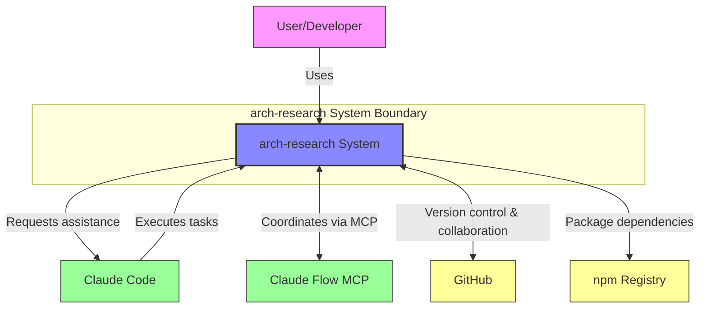
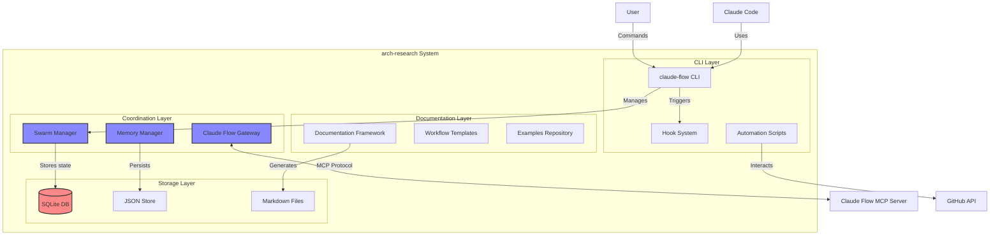
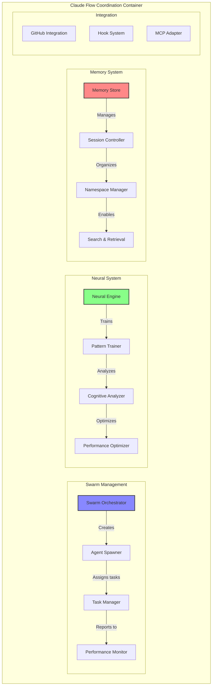
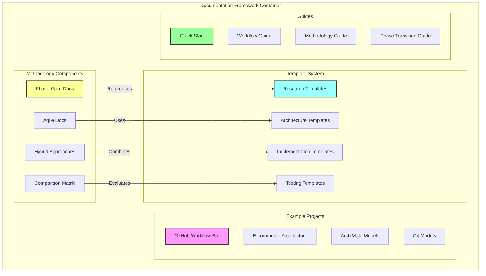
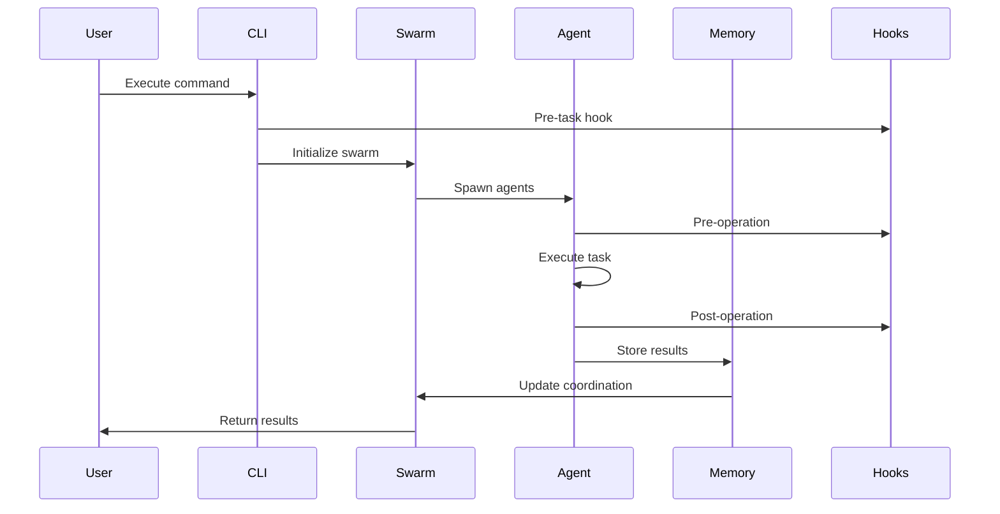
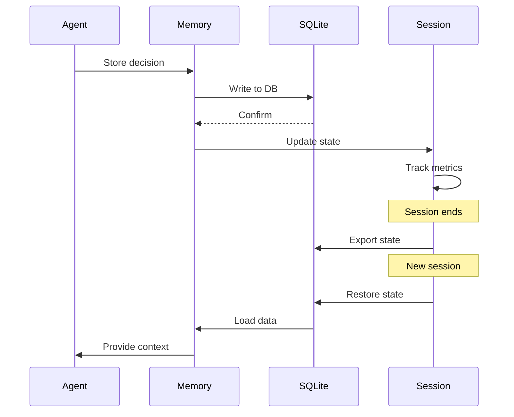
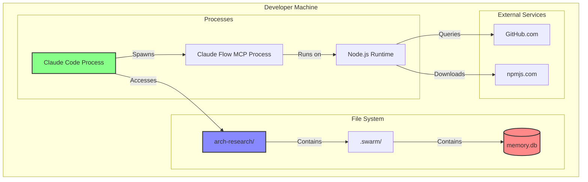

# C4 Architecture Model: arch-research System

## Level 1: System Context Diagram

## Level 2: Container Diagram

## Level 3: Component Diagram - Claude Flow Coordination

## Level 3: Component Diagram - Documentation Framework

## Component Interactions

### 1. Task Execution Flow

### 2. Memory Persistence Flow

## Technology Stack

### Core Technologies
- **Runtime**: Node.js
- **Database**: SQLite
- **Protocol**: MCP (Model Context Protocol)
- **Documentation**: Markdown
- **Configuration**: JSON/YAML

### Key Libraries
- **CLI Framework**: Commander.js (inferred)
- **Database**: better-sqlite3
- **File System**: Node.js fs module
- **Process Management**: Node.js child_process

### Integration Points
- **GitHub API**: REST API v3
- **MCP Server**: stdio/HTTP transport
- **Claude Code**: Native tool integration

## Deployment View

## Key Architectural Patterns

### 1. Coordinator Pattern
- Swarm orchestrator coordinates multiple agents
- Each agent has specific responsibilities
- Centralized task distribution

### 2. Memory-Centric Architecture
- All decisions stored in persistent memory
- Cross-session state management
- Event sourcing for coordination

### 3. Hook-Based Extension
- Pre/post operation hooks
- Pluggable behavior modification
- Event-driven automation

### 4. Template-Driven Documentation
- Standardized templates for consistency
- Reusable patterns
- Example-based learning

### 5. Parallel Execution Strategy
- Batch operations mandatory
- Concurrent agent execution
- Optimized token usage

## Quality Attributes

### Performance
- Sub-second agent spawning
- Millisecond memory operations
- 2.8-4.4x speed improvement with parallel execution

### Scalability
- Up to 10 concurrent agents
- Namespace-based memory isolation
- Modular component architecture

### Maintainability
- Clear separation of concerns
- Extensive documentation
- Template-based consistency

### Extensibility
- Hook system for custom behavior
- Plugin architecture for integrations
- Modular component design

### Reliability
- Self-healing workflows
- Persistent state management
- Error recovery mechanisms