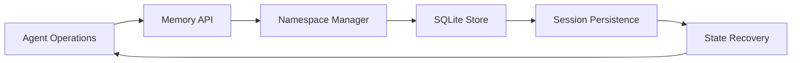
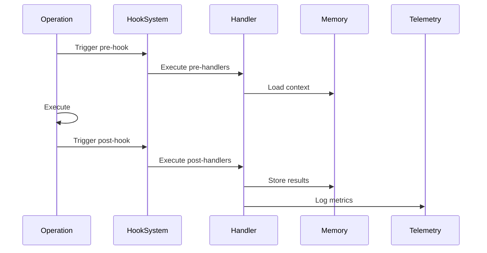
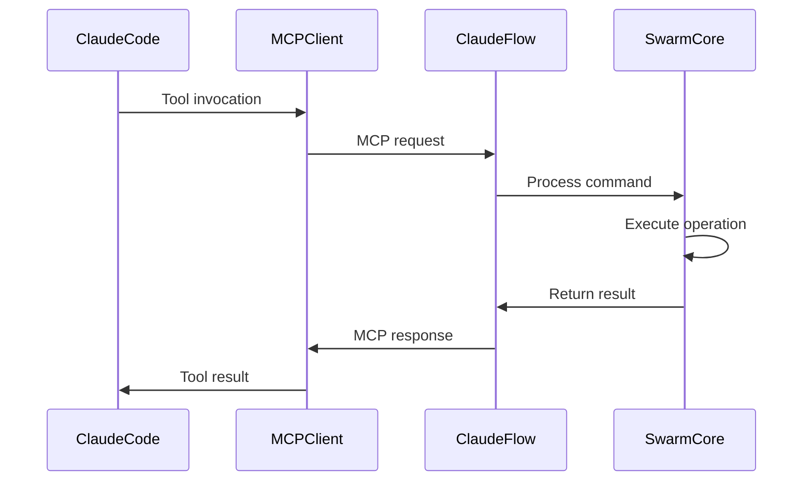
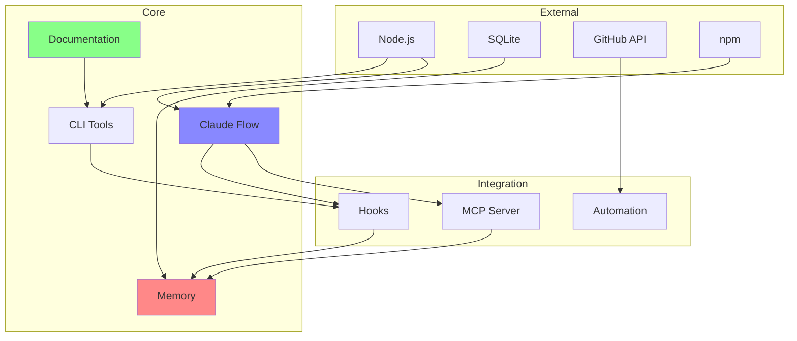
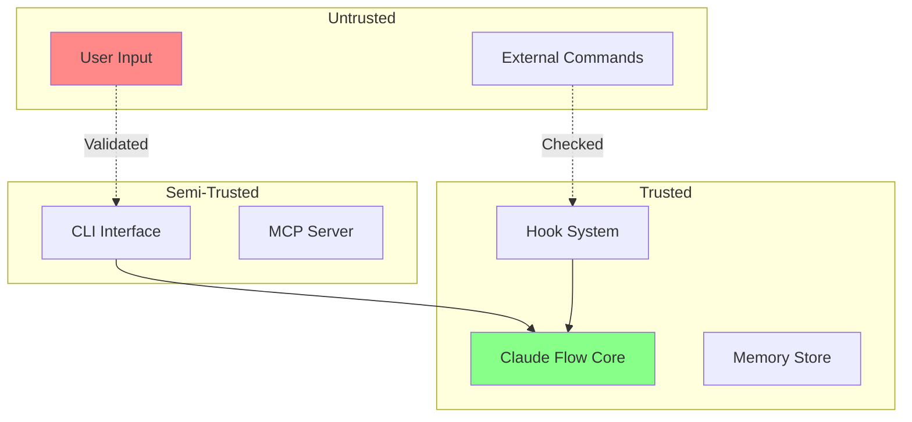

# Component Relationships and Dependencies

## Core Component Dependencies

### 1. Claude Flow Coordination System

#### Dependencies
```yaml
claude-flow:
  external:
    - Node.js runtime (>= 14.x)
    - SQLite3 
    - MCP protocol implementation
  internal:
    - Memory Store component
    - Hook System
    - Performance Monitor
  interfaces:
    - MCP stdio/HTTP transport
    - CLI command interface
    - SQLite database API
```

#### Component Interactions
- **Swarm Orchestrator** → **Agent Spawner**: Creates and manages agents
- **Agent Spawner** → **Task Manager**: Assigns tasks to agents
- **Task Manager** → **Memory Store**: Persists task state
- **Memory Store** → **SQLite DB**: Physical storage
- **Performance Monitor** → **Neural Engine**: Provides metrics for training

### 2. Documentation Framework

#### Dependencies
```yaml
documentation:
  external:
    - Markdown parsers
    - YAML processors
    - File system access
  internal:
    - Template Engine
    - Example Repository
    - Methodology Guides
  outputs:
    - Markdown files
    - YAML configurations
    - JSON schemas
```

#### Component Relationships
- **Methodology Docs** ← → **Templates**: Bidirectional reference
- **Templates** → **Examples**: Instantiation relationship
- **Examples** → **Validation**: Test cases for methodologies
- **Guides** → **All Components**: Documentation coverage

### 3. Memory Management System

#### Dependencies
```yaml
memory_system:
  storage:
    - SQLite database (.swarm/memory.db)
    - JSON state files
    - Session manifests
  operations:
    - CRUD operations
    - Search/indexing
    - Namespace management
    - TTL enforcement
  consumers:
    - Swarm Orchestrator
    - Session Manager
    - Hook System
```

#### Data Flow Relationships


### 4. Hook System

#### Dependencies
```yaml
hooks:
  trigger_points:
    - pre-task
    - pre-edit
    - pre-command
    - post-task
    - post-edit
    - post-command
    - session-end
    - session-restore
  consumers:
    - Claude Code operations
    - Swarm coordination
    - Memory updates
    - Performance tracking
```

#### Event Flow


## Integration Points

### 1. Claude Code Integration

#### Interface Contract
```typescript
interface ClaudeCodeIntegration {
  // Tool registration
  tools: {
    mcp__claude_flow__*: MCPTool[]
  }
  
  // Native tool usage
  nativeTools: {
    Read: FileOperation
    Write: FileOperation
    Edit: FileOperation
    Bash: CommandOperation
    Task: AgentOperation
    TodoWrite: TaskManagement
  }
  
  // Coordination protocol
  coordination: {
    preHooks: string[]
    postHooks: string[]
    memoryKeys: string[]
  }
}
```

### 2. GitHub Integration

#### API Interactions
```yaml
github_integration:
  operations:
    - repository_analysis
    - issue_management
    - pr_workflows
    - code_review
  authentication:
    - token_based
    - ssh_keys
  rate_limits:
    - standard: 5000/hour
    - graphql: 5000/hour
```

### 3. MCP Server Communication

#### Protocol Flow


## Dependency Graph

### System-Level Dependencies


## Component Lifecycle

### 1. Initialization Sequence
```
1. CLI startup
2. Configuration loading
3. Memory store initialization
4. MCP server connection
5. Swarm topology setup
6. Agent pool creation
7. Hook registration
8. Ready state
```

### 2. Task Execution Lifecycle
```
1. Task request received
2. Pre-task hooks executed
3. Swarm initialized (if needed)
4. Agents spawned
5. Tasks distributed
6. Parallel execution
7. Results collected
8. Post-task hooks executed
9. Memory persistence
10. Session state update
```

### 3. Session Management Lifecycle
```
1. Session start
2. State restoration (if exists)
3. Active operations
4. Continuous state updates
5. Session end triggered
6. State export
7. Metrics generation
8. Cleanup operations
```

## Communication Protocols

### 1. Inter-Agent Communication
```yaml
protocol: memory-based
format: JSON
patterns:
  - broadcast: all agents
  - targeted: specific agent
  - hierarchical: through coordinator
keys:
  - swarm-{id}/broadcast/*
  - swarm-{id}/agent-{name}/*
  - swarm-{id}/coordinator/*
```

### 2. MCP Communication
```yaml
transport: stdio | http
format: JSON-RPC 2.0
methods:
  - swarm_init
  - agent_spawn
  - task_orchestrate
  - memory_usage
  - performance_metrics
```

### 3. Hook Communication
```yaml
trigger: event-based
format: command-line
data_passing:
  - environment variables
  - command arguments
  - file paths
  - memory keys
```

## State Management

### 1. Swarm State
```typescript
interface SwarmState {
  id: string
  topology: 'mesh' | 'hierarchical' | 'ring' | 'star'
  agents: Agent[]
  tasks: Task[]
  status: 'initializing' | 'active' | 'idle' | 'terminating'
  metrics: PerformanceMetrics
}
```

### 2. Agent State
```typescript
interface AgentState {
  id: string
  type: AgentType
  status: 'idle' | 'busy' | 'error'
  currentTask: Task | null
  completedTasks: number
  performance: AgentMetrics
}
```

### 3. Memory State
```typescript
interface MemoryState {
  namespaces: Map<string, NamespaceData>
  sessions: Map<string, SessionData>
  metrics: MemoryMetrics
  lastCleanup: timestamp
}
```

## Error Handling and Recovery

### 1. Component-Level Error Handling
- **Swarm**: Automatic agent respawn on failure
- **Memory**: Transaction rollback on write failure
- **Hooks**: Graceful degradation if hook fails
- **MCP**: Reconnection with exponential backoff

### 2. System-Level Recovery
- **Session Recovery**: Automatic state restoration
- **Self-Healing**: Workflow continuation after errors
- **Checkpointing**: Regular state snapshots
- **Rollback**: Previous known good state

## Performance Considerations

### 1. Bottlenecks
- **Memory Operations**: SQLite write locks
- **Agent Spawning**: Process creation overhead
- **MCP Communication**: Network latency
- **Hook Execution**: Sequential processing

### 2. Optimization Strategies
- **Batching**: Mandatory parallel operations
- **Caching**: Search result caching
- **Indexing**: Memory key indexing
- **Compression**: State compression

## Security Boundaries

### 1. Component Isolation
- **File System**: Restricted to project directory
- **Command Execution**: Pre-validation hooks
- **Memory Access**: Namespace isolation
- **Network**: Local-only by default

### 2. Trust Boundaries


This component relationship document provides a comprehensive view of how all parts of the arch-research system interact, their dependencies, and communication patterns.