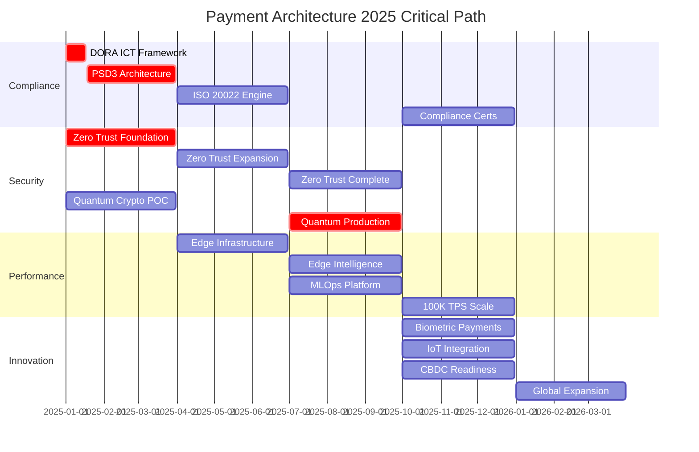

# 🗺️ Payment Architecture 2025 Transformation Roadmap

## Executive Summary

This roadmap addresses the 5 critical architectural gaps identified in our comprehensive analysis, with a total investment of €12-15M over 18 months to achieve full 2025 compliance and industry leadership.

**Critical Gaps to Address:**
1. **PSD3 Compliance** (85% gap) - €3M investment
2. **Zero Trust Architecture** (70% gap) - €2.5M investment
3. **Quantum-Ready Cryptography** (75% gap) - €2M investment
4. **Edge Computing & 5G** (80% gap) - €3M investment
5. **MLOps Infrastructure** (75% gap) - €2.5M investment

**Timeline**: Q1 2025 - Q2 2026 (18 months)
**Total Investment**: €13M core + €2M contingency = €15M

---

## 🎯 Strategic Objectives

### Primary Goals
1. **Regulatory Compliance**: Achieve 100% compliance with PSD3, DORA, ISO 20022
2. **Security Leadership**: Implement first-in-market quantum-resistant architecture
3. **Performance Excellence**: Scale to 100K+ TPS with sub-10ms latency
4. **Innovation Platform**: Enable next-gen payments (biometric, IoT, CBDC)
5. **Operational Excellence**: Full automation with GitOps and MLOps

### Success Metrics
- **Compliance Score**: From 26.4% to 100%
- **Security Maturity**: From 65/100 to 95/100
- **Performance**: From 10K to 100K+ TPS
- **Automation**: From 30% to 95% automated deployments
- **Time to Market**: From weeks to hours for new features

---

## 📅 Quarterly Roadmap

### 🚀 Q1 2025: Foundation Phase (Jan - Mar)

#### 1. PSD3 Instant Payments Architecture
**Gap**: No instant payment infrastructure (85% gap)
**Target State**: 10-second payment guarantee capability

**Key Deliverables**:
- Week 1-2: Technical architecture design
  - Real-time payment gateway specification
  - Request-to-Pay (R2P) service design
  - Instant fraud detection framework
- Week 3-4: Proof of Concept
  - Basic instant payment processing
  - Sub-10 second transaction flow
  - Failover mechanism testing
- Week 5-8: Infrastructure Setup
  - High-availability clusters deployment
  - Geographic redundancy implementation
  - Real-time notification system
- Week 9-12: Integration & Testing
  - PSP integration framework
  - End-to-end testing < 10 seconds
  - Load testing to 50K TPS

**Resources**: 
- 3 Payment Architects
- 5 Backend Engineers
- 2 DevOps Engineers
- €750K budget

#### 2. Zero Trust Foundation
**Gap**: Perimeter-based security (70% gap)
**Target State**: Identity-centric security model

**Key Deliverables**:
- Week 1-4: Architecture Design
  - Zero Trust principles documentation
  - Service mesh selection (Istio/Linkerd)
  - Policy engine design (OPA)
- Week 5-8: Pilot Implementation
  - 3 critical services migration
  - mTLS between services
  - Policy as Code framework
- Week 9-12: Monitoring Setup
  - Continuous verification framework
  - Risk scoring engine
  - Security analytics dashboard

**Resources**:
- 2 Security Architects
- 4 Platform Engineers
- 1 Compliance Officer
- €625K budget

#### 3. Quantum Cryptography Assessment
**Gap**: No post-quantum algorithms (75% gap)
**Target State**: Crypto-agile architecture

**Key Deliverables**:
- Week 1-2: Cryptographic Inventory
  - Algorithm usage catalog
  - Key length documentation
  - Certificate mapping
- Week 3-4: Risk Assessment
  - Quantum vulnerability analysis
  - Timeline projection
  - Impact assessment
- Week 5-8: POC Development
  - CRYSTALS-Kyber testing
  - Hybrid mode implementation
  - Performance benchmarking
- Week 9-12: Migration Planning
  - Phased rollout strategy
  - Backward compatibility design
  - Hardware requirements

**Resources**:
- 2 Cryptography Experts
- 3 Security Engineers
- €500K budget

#### 4. DORA Compliance (Critical - Jan 17 Deadline)
**Gap**: ICT risk framework incomplete (22% gap)
**Target State**: Full DORA compliance

**Immediate Actions (Week 1-2)**:
- ICT risk register creation
- Third-party inventory
- Incident response procedures
- Testing schedule establishment

**Resources**:
- 2 Risk Managers
- 1 Compliance Lead
- €250K budget

### 🔧 Q2 2025: Implementation Phase (Apr - Jun)

#### 1. PSD3 Open Finance Platform
**Current**: Basic payment services
**Target**: Extended financial data access

**Key Deliverables**:
- Week 1-4: API Gateway Evolution
  - Non-payment account access APIs
  - Consent management system
  - Data aggregation platform
- Week 5-8: Security Enhancement
  - Behavioral biometrics integration
  - Adaptive authentication
  - Delegated auth patterns
- Week 9-12: Compliance Testing
  - Regulatory sandbox participation
  - Security certification
  - Performance validation

**Resources**:
- 4 API Engineers
- 3 Security Engineers
- 2 Product Managers
- €750K budget

#### 2. Zero Trust Expansion
**Current**: 3 services migrated
**Target**: 50% service coverage

**Key Deliverables**:
- Week 1-4: Core Services Migration
  - Payment processing services
  - Authentication services
  - Data services migration
- Week 5-8: Policy Implementation
  - Fine-grained access policies
  - Dynamic policy evaluation
  - Least privilege enforcement
- Week 9-12: Advanced Features
  - Device trust scoring
  - Behavioral analytics
  - Automated remediation

**Resources**:
- 6 Platform Engineers
- 2 Security Engineers
- €625K budget

#### 3. Edge Computing Infrastructure
**Gap**: No edge processing (80% gap)
**Target**: Distributed edge nodes

**Key Deliverables**:
- Week 1-4: Edge Architecture
  - Node deployment strategy
  - WebAssembly runtime setup
  - 5G integration planning
- Week 5-8: Pilot Deployment
  - 3 edge locations setup
  - Payment logic at edge
  - Latency optimization
- Week 9-12: AI at Edge
  - TinyML fraud detection
  - Edge inference engine
  - Model synchronization

**Resources**:
- 3 Edge Computing Engineers
- 2 ML Engineers
- 2 Network Engineers
- €750K budget

#### 4. ISO 20022 Migration Engine
**Gap**: No translation capability (40% gap)
**Target**: Seamless format coexistence

**Key Deliverables**:
- Week 1-4: Translation Engine
  - Message mapping rules
  - Bidirectional conversion
  - Performance optimization
- Week 5-8: Testing Framework
  - Compliance validation
  - Regression testing
  - Load testing
- Week 9-12: Production Rollout
  - Phased migration
  - Monitoring setup
  - Fallback procedures

**Resources**:
- 3 Integration Engineers
- 2 Payment Experts
- €500K budget

### 🚀 Q3 2025: Acceleration Phase (Jul - Sep)

#### 1. Quantum Cryptography Deployment
**Current**: POC complete
**Target**: Production hybrid crypto

**Key Deliverables**:
- Week 1-4: Infrastructure Upgrade
  - HSM compatibility updates
  - Certificate infrastructure
  - Key management evolution
- Week 5-8: Service Migration
  - Critical services first
  - Hybrid mode activation
  - Performance monitoring
- Week 9-12: Full Rollout
  - All services migrated
  - Legacy algorithm deprecation
  - Compliance certification

**Resources**:
- 4 Security Engineers
- 2 Cryptography Experts
- €500K budget

#### 2. MLOps Platform
**Gap**: Manual ML deployment (75% gap)
**Target**: Automated ML pipeline

**Key Deliverables**:
- Week 1-4: Platform Setup
  - MLflow deployment
  - Feature store creation
  - Model registry setup
- Week 5-8: Pipeline Automation
  - Training automation
  - A/B testing framework
  - Drift detection setup
- Week 9-12: Production Features
  - Real-time scoring
  - Model explainability
  - Performance monitoring

**Resources**:
- 3 ML Engineers
- 2 Data Engineers
- 2 Platform Engineers
- €625K budget

#### 3. Zero Trust Completion
**Current**: 50% coverage
**Target**: 100% coverage

**Key Deliverables**:
- Week 1-4: Remaining Services
  - Legacy service migration
  - External integrations
  - Partner connections
- Week 5-8: Advanced Security
  - Zero-knowledge proofs
  - Secure enclaves
  - Hardware security modules
- Week 9-12: Optimization
  - Performance tuning
  - Policy optimization
  - Automation enhancement

**Resources**:
- 5 Platform Engineers
- 3 Security Engineers
- €625K budget

#### 4. Edge Intelligence Maturity
**Current**: Basic edge nodes
**Target**: Intelligent edge network

**Key Deliverables**:
- Week 1-4: Scaling Edge Network
  - 20+ edge locations
  - CDN integration
  - Traffic optimization
- Week 5-8: Advanced AI Features
  - Federated learning
  - Edge-to-edge coordination
  - Real-time optimization
- Week 9-12: 5G Integration
  - Network slicing
  - URLLC patterns
  - QoS guarantees

**Resources**:
- 4 Edge Engineers
- 3 ML Engineers
- €750K budget

### 🏁 Q4 2025: Optimization Phase (Oct - Dec)

#### 1. Performance Optimization
**Current**: 50K TPS capability
**Target**: 100K+ TPS production

**Key Deliverables**:
- Week 1-4: Infrastructure Scaling
  - Database optimization
  - Caching strategy
  - Load balancing enhancement
- Week 5-8: Application Tuning
  - Code optimization
  - Async processing
  - Resource pooling
- Week 9-12: Stress Testing
  - Peak load simulation
  - Failover testing
  - Capacity planning

**Resources**:
- 4 Performance Engineers
- 2 Database Experts
- €500K budget

#### 2. Compliance Certification
**Current**: Implementation complete
**Target**: Full certification

**Key Deliverables**:
- Week 1-4: Audit Preparation
  - Documentation completion
  - Evidence collection
  - Gap remediation
- Week 5-8: External Audits
  - PCI-DSS Level 1
  - ISO 27001/27018
  - SOC 2 Type II
- Week 9-12: Regulatory Approval
  - PSD3 certification
  - DORA compliance
  - Regional approvals

**Resources**:
- 2 Compliance Officers
- 1 Legal Counsel
- External Auditors
- €750K budget

#### 3. Innovation Features
**Current**: Core platform ready
**Target**: Next-gen capabilities

**Key Deliverables**:
- Week 1-4: Biometric Payments
  - Palm recognition
  - Voice authentication
  - Behavioral biometrics
- Week 5-8: IoT Integration
  - Connected car payments
  - Smart home billing
  - Industrial IoT
- Week 9-12: CBDC Readiness
  - Digital currency support
  - Programmable money
  - Cross-border CBDC

**Resources**:
- 5 Innovation Engineers
- 2 Product Managers
- €625K budget

### 🌟 Q1 2026: Excellence Phase (Jan - Mar)

#### 1. Operational Excellence
**Focus**: Automation and efficiency

**Key Deliverables**:
- GitOps maturity
- FinOps optimization
- AIOps implementation
- Carbon footprint reduction

**Resources**:
- 3 Platform Engineers
- 2 FinOps Specialists
- €375K budget

#### 2. Global Expansion
**Focus**: International compliance

**Key Deliverables**:
- APAC regulatory compliance
- Americas expansion
- Cross-border optimization
- Multi-currency enhancement

**Resources**:
- 4 Compliance Experts
- 3 Payment Engineers
- €500K budget

### 🎯 Q2 2026: Leadership Phase (Apr - Jun)

#### 1. Market Leadership
**Focus**: Innovation and differentiation

**Key Deliverables**:
- AR/VR payment experiences
- Quantum-safe certification
- Industry benchmarks leadership
- Patent applications

**Resources**:
- 5 R&D Engineers
- 2 Patent Attorneys
- €625K budget

---

## 📊 Critical Path Dependencies

---

## 🚨 Risk Mitigation Strategies

### Critical Risks

#### 1. DORA Compliance Deadline (Jan 17, 2025)
**Risk**: Regulatory penalties if missed
**Mitigation**:
- Dedicated SWAT team from Day 1
- Daily progress tracking
- External consultant backup
- Executive escalation path

#### 2. PSD3 Market Access
**Risk**: Cannot operate in EU without compliance
**Mitigation**:
- Parallel development tracks
- Regulatory engagement
- Sandbox participation
- Contingency architecture

#### 3. Quantum Computing Timeline
**Risk**: Y2Q threat arrives earlier
**Mitigation**:
- Accelerated POC development
- Hybrid crypto from start
- Vendor partnerships
- Continuous threat monitoring

#### 4. Resource Availability
**Risk**: Skilled talent shortage
**Mitigation**:
- Early recruiting (Q4 2024)
- Training programs
- Partner augmentation
- Retention bonuses

#### 5. Budget Overrun
**Risk**: Costs exceed €15M budget
**Mitigation**:
- Phase gates with budget reviews
- €2M contingency reserve
- Value engineering options
- ROI tracking

---

## 💰 Investment Breakdown

### By Quarter
- **Q1 2025**: €3.125M (DORA critical + foundations)
- **Q2 2025**: €3.625M (core implementations)
- **Q3 2025**: €3.5M (production deployments)
- **Q4 2025**: €2.75M (optimization & compliance)
- **Q1 2026**: €0.875M (excellence phase)
- **Q2 2026**: €0.625M (leadership phase)
- **Contingency**: €0.5M reserved

### By Category
- **Engineering**: €7M (54%)
- **Infrastructure**: €3M (23%)
- **Compliance**: €1.5M (12%)
- **Security Tools**: €1M (8%)
- **Training**: €0.5M (3%)

### ROI Projections
- **Year 1**: €5M savings (automation, efficiency)
- **Year 2**: €12M revenue (new markets, features)
- **Year 3**: €25M revenue (market leadership)
- **Payback Period**: 14 months

---

## 🎯 Success Criteria

### Technical Metrics
- ✅ 100K+ TPS sustained performance
- ✅ <10ms payment latency (99th percentile)
- ✅ 99.99% availability SLA
- ✅ Zero security breaches
- ✅ 100% automated deployments

### Business Metrics
- ✅ PSD3 certification achieved
- ✅ 25% cost reduction via automation
- ✅ 50% faster feature delivery
- ✅ 3 new market entries
- ✅ 10 innovation patents filed

### Compliance Metrics
- ✅ 100% regulatory compliance score
- ✅ Zero audit findings
- ✅ All certifications achieved
- ✅ Proactive threat detection
- ✅ Real-time compliance monitoring

---

## 📞 Governance Structure

### Steering Committee
- **Executive Sponsor**: CTO
- **Program Director**: VP Engineering
- **Compliance Lead**: Chief Compliance Officer
- **Security Lead**: CISO
- **Finance Lead**: CFO

### Program Management
- **Weekly**: Working group updates
- **Bi-weekly**: Steering committee reviews
- **Monthly**: Board progress reports
- **Quarterly**: Phase gate reviews

### Success Factors
1. **Executive Commitment**: C-level sponsorship
2. **Dedicated Resources**: Ring-fenced teams
3. **Clear Accountability**: RACI matrix
4. **Regular Communication**: Stakeholder updates
5. **Agile Delivery**: 2-week sprints

---

## 🚀 Next Steps

### Immediate Actions (Next 7 Days)
1. ✅ Secure executive approval and budget
2. ✅ Form DORA compliance SWAT team
3. ✅ Begin recruitment for Q1 positions
4. ✅ Engage regulatory consultants
5. ✅ Set up program governance

### 30-Day Milestones
1. ✅ DORA framework documented
2. ✅ PSD3 architecture designed
3. ✅ Zero Trust pilot launched
4. ✅ Quantum crypto POC started
5. ✅ Weekly reporting established

---

**Document Status**: FINAL  
**Version**: 1.0  
**Last Updated**: 2025-08-01  
**Next Review**: 2025-02-01  
**Owner**: Architecture Review Board