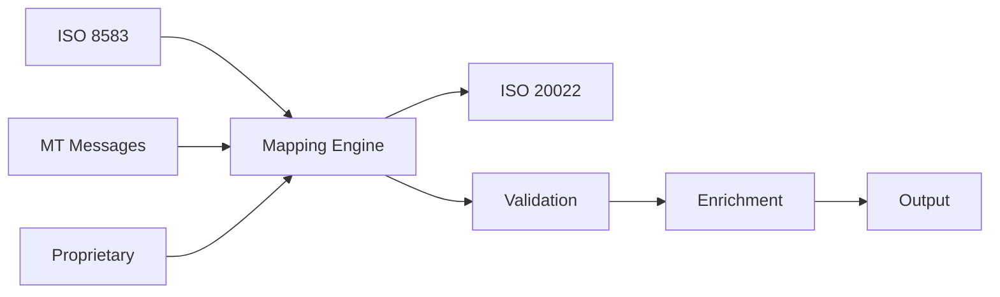

# 📋 Compliance Action Plan 2025
## Strategic Roadmap for Regulatory Readiness

**Agent**: Process Analyst (Hive Mind Swarm)  
**Date**: 2025-08-01  
**Priority**: CRITICAL  
**Implementation Window**: Q1-Q4 2025

## Executive Summary

This action plan provides a comprehensive roadmap to address the identified compliance gaps for 2025 regulatory requirements. The plan prioritizes critical items that risk market access while balancing resource allocation and business continuity.

### Key Objectives:
- Achieve PSD3 compliance by Q3 2025
- Complete ISO 20022 migration by Q4 2025  
- Establish DORA compliance by Q1 2025
- Begin quantum-safe transition by Q2 2025
- Ensure cross-border data compliance by Q2 2025

## Phase 1: Critical Gap Remediation (Days 1-30)

### Week 1-2: Foundation Building

#### Day 1-3: Governance Setup
**Owner**: Chief Executive Officer
- [ ] Appoint Chief Compliance Officer
- [ ] Establish Compliance Steering Committee
- [ ] Approve compliance budget ($555,000)
- [ ] Communicate compliance mandate organization-wide

#### Day 4-7: PCI-DSS Critical Actions
**Owner**: Chief Security Officer
- [ ] Obtain cloud provider certifications (AWS, Azure, GCP)
- [ ] Document physical security controls
- [ ] Create media destruction procedures
- [ ] Schedule QSA engagement

#### Day 8-14: Policy Framework
**Owner**: Chief Compliance Officer
- [ ] Draft Information Security Policy
- [ ] Create Incident Response Policy
- [ ] Develop Change Management procedures
- [ ] Design Security Awareness Training program

### Week 3-4: Operational Implementation

#### Day 15-21: Security Program Launch
**Owner**: Security Operations Manager
- [ ] Deploy EDR (Endpoint Detection Response) solution
- [ ] Implement threat hunting procedures
- [ ] Create security incident runbooks
- [ ] Establish 24/7 monitoring

#### Day 22-30: Compliance Infrastructure
**Owner**: Chief Technology Officer
- [ ] Select and deploy GRC platform
- [ ] Implement compliance automation tools
- [ ] Configure regulatory reporting
- [ ] Establish audit trails

## Phase 2: Core Compliance (Days 31-60)

### Week 5-6: KYC/AML Enhancement

#### Process Improvements
**Owner**: Head of Compliance Operations
- [ ] Automate customer risk scoring
- [ ] Implement real-time transaction monitoring
- [ ] Deploy sanctions screening enhancements
- [ ] Create SAR filing procedures

#### Documentation
- [ ] Customer onboarding workflows
- [ ] Enhanced due diligence procedures
- [ ] Suspicious activity detection rules
- [ ] Regulatory reporting templates

### Week 7-8: GDPR Compliance

#### Data Protection Implementation
**Owner**: Data Protection Officer
- [ ] Complete Data Protection Impact Assessments
- [ ] Implement automated data subject rights
- [ ] Document Records of Processing Activities
- [ ] Create breach notification procedures

#### Technical Controls
- [ ] Deploy data discovery tools
- [ ] Implement consent management
- [ ] Configure data retention automation
- [ ] Enable right to erasure functionality

## Phase 3: Advanced Compliance (Days 61-90)

### Week 9-10: Testing and Validation

#### Security Testing Program
**Owner**: Chief Security Officer
- [ ] Conduct first penetration test
- [ ] Perform vulnerability assessments
- [ ] Validate network segmentation
- [ ] Test incident response procedures

#### Compliance Audits
- [ ] Internal PCI-DSS assessment
- [ ] GDPR compliance audit
- [ ] KYC/AML process review
- [ ] Third-party risk assessment

### Week 11-12: Certification Preparation

#### PCI-DSS Level 1
**Owner**: Chief Compliance Officer
- [ ] Complete Self-Assessment Questionnaire
- [ ] Compile evidence documentation
- [ ] Schedule QSA on-site assessment
- [ ] Remediate any findings

#### Training and Awareness
- [ ] All-staff security awareness training
- [ ] Role-specific compliance training
- [ ] Executive compliance briefing
- [ ] Third-party compliance requirements

## Phase 4: Emerging Regulations (Days 91-120)

### Week 13-14: AI Act Preparation

#### AI Governance Framework
**Owner**: Chief Data Officer
- [ ] Complete AI system inventory
- [ ] Classify risk levels for all AI systems
- [ ] Implement explainability features
- [ ] Design bias testing procedures

#### Documentation Requirements
- [ ] Technical documentation for high-risk AI
- [ ] Transparency notices for customers
- [ ] Human oversight procedures
- [ ] Performance monitoring systems

### Week 15-16: DORA Readiness

#### ICT Risk Management
**Owner**: Chief Information Officer
- [ ] Establish ICT risk framework
- [ ] Document third-party dependencies
- [ ] Create digital resilience testing plan
- [ ] Implement 2-hour incident notification

#### Operational Resilience
- [ ] Update business continuity plans
- [ ] Test disaster recovery procedures
- [ ] Validate backup systems
- [ ] Document recovery objectives

## Phase 5: Future-Proofing (Days 121-150)

### Week 17-18: Quantum-Safe Planning

#### Cryptographic Migration
**Owner**: Chief Technology Officer
- [ ] Complete cryptographic inventory
- [ ] Assess quantum vulnerability
- [ ] Design hybrid architecture
- [ ] Create migration roadmap

#### Partner Coordination
- [ ] Engage with payment networks
- [ ] Coordinate with technology vendors
- [ ] Plan certificate transitions
- [ ] Test compatibility layers

### Week 19-20: Cross-Border Compliance

#### Data Localization
**Owner**: Chief Data Officer
- [ ] Implement regional data storage
- [ ] Update data transfer mechanisms
- [ ] Create Schrems III contingency
- [ ] Deploy geo-fencing controls

#### Regional Requirements
- [ ] India payment data localization
- [ ] China CII compliance
- [ ] EU data sovereignty
- [ ] US state-level requirements

## Phase 6: Excellence Achievement (Days 151-180)

### Week 21-22: Optimization

#### Process Improvement
**Owner**: Chief Operating Officer
- [ ] Automate compliance workflows
- [ ] Optimize monitoring systems
- [ ] Enhance reporting capabilities
- [ ] Implement predictive analytics

#### Cost Optimization
- [ ] Review vendor contracts
- [ ] Consolidate compliance tools
- [ ] Optimize resource allocation
- [ ] Measure ROI

### Week 23-26: Continuous Improvement

#### Maturity Assessment
**Owner**: Chief Compliance Officer
- [ ] Conduct compliance maturity assessment
- [ ] Benchmark against industry leaders
- [ ] Identify improvement opportunities
- [ ] Create 2026 compliance roadmap

#### Innovation Framework
- [ ] Establish compliant innovation process
- [ ] Create regulatory sandbox
- [ ] Design rapid compliance assessment
- [ ] Enable agile compliance

## Budget Allocation

### Year 1 Investment: $555,000

#### Personnel (40%): $222,000
- Chief Compliance Officer: $150,000
- Compliance Analysts (2): $72,000

#### Technology (36%): $200,000
- GRC Platform: $75,000
- EDR Solution: $100,000
- Compliance Automation: $25,000

#### Services (24%): $133,000
- QSA Services: $50,000
- Legal Advisory: $50,000
- Penetration Testing: $33,000

## Success Metrics

### 30-Day Metrics
- [ ] 100% critical PCI gaps closed
- [ ] Compliance team operational
- [ ] Core policies approved
- [ ] Security monitoring active

### 60-Day Metrics
- [ ] GDPR fully compliant
- [ ] KYC/AML automated
- [ ] Training 100% complete
- [ ] Audit trails established

### 90-Day Metrics
- [ ] PCI-DSS certified
- [ ] Zero critical findings
- [ ] Incident response tested
- [ ] Third-party assessed

### 120-Day Metrics
- [ ] AI Act ready
- [ ] DORA compliant
- [ ] Quantum plan approved
- [ ] Cross-border ready

### 180-Day Metrics
- [ ] Full compliance achieved
- [ ] Continuous monitoring active
- [ ] Innovation framework operational
- [ ] 2026 roadmap approved

## Risk Mitigation

### High-Risk Areas
1. **PCI Certification Delay**
   - Mitigation: Engage QSA early, daily progress tracking
   
2. **Resource Constraints**
   - Mitigation: Approved budget, contractor augmentation

3. **Regulatory Changes**
   - Mitigation: Monthly regulatory updates, agile planning

4. **Technical Complexity**
   - Mitigation: Phased approach, expert consultation

## Communication Plan

### Stakeholder Updates
- **Board**: Monthly compliance dashboard
- **Executive**: Weekly progress reports  
- **Managers**: Bi-weekly briefings
- **All Staff**: Monthly newsletters

### External Communications
- **Regulators**: Proactive engagement
- **Partners**: Compliance status updates
- **Customers**: Transparency reports
- **Auditors**: Continuous dialogue

## Conclusion

This action plan provides a clear path to achieving and maintaining full regulatory compliance. Success requires:

1. **Executive Commitment**: Visible leadership support
2. **Resource Allocation**: Full funding and staffing
3. **Cross-Functional Collaboration**: Breaking down silos
4. **Continuous Monitoring**: Real-time compliance tracking
5. **Cultural Change**: Embedding compliance mindset

With proper execution, the organization will not only achieve compliance but establish a competitive advantage through regulatory excellence.

---

**Approved By**: ___________________ (CEO)  
**Date**: ___________________

**Reviewed By**: ___________________ (Board Chair)  
**Date**: ___________________

**Next Review**: 30 days (Progress Assessment)
## 1. PSD3 Implementation Roadmap

### Q1 2025: Foundation Phase

#### Technical Architecture Sprint (Week 1-4)
```yaml
Instant_Payment_Architecture:
  Infrastructure:
    Load_Balancers:
      - Primary: 4x AWS ALB (EU-WEST-1)
      - Secondary: 4x AWS ALB (EU-CENTRAL-1)
      - Tertiary: 4x AWS ALB (EU-NORTH-1)
    
    Processing_Nodes:
      - 12x High-performance compute instances
      - Auto-scaling: 8-24 nodes based on load
      - Geographic distribution for < 50ms latency
    
    Database_Layer:
      - Primary: Aurora PostgreSQL (Multi-AZ)
      - Read replicas: 6x across regions
      - In-memory cache: Redis clusters
      - Sharding strategy: By payment ID hash
```

#### Fraud Detection System (Week 5-8)
```python
class PSD3FraudDetectionSystem:
    def __init__(self):
        self.components = {
            'real_time_scoring': {
                'latency_target': '< 100ms',
                'ml_models': ['gradient_boost', 'neural_network', 'ensemble'],
                'rule_engine': 'business_rules_v2',
                'throughput': '50,000 TPS'
            },
            'liability_management': {
                'auto_decision_threshold': 0.95,
                'manual_review_queue': True,
                'insurance_integration': 'required',
                'claim_processing': 'automated'
            },
            'customer_notification': {
                'channels': ['sms', 'push', 'email', 'in_app'],
                'delivery_sla': '60 seconds',
                'multi_language': True,
                'audit_trail': 'immutable'
            }
        }
```

### Q2 2025: Core Implementation

#### Open Finance Integration (Week 9-12)
- Design consent management platform
- Implement OAuth 2.0 + FAPI
- Build account aggregation APIs
- Create data sharing framework

#### Request-to-Pay (R2P) Service (Week 13-16)
- Message format design (ISO 20022)
- Payment request lifecycle
- Notification system
- Mobile integration

### Q3 2025: Testing & Validation

#### Performance Testing Matrix
 < /dev/null |  Test Type | Target | Duration | Success Criteria |
|-----------|--------|----------|------------------|
| Load Test | 10K TPS | 24 hours | < 10s processing |
| Stress Test | 50K TPS | 4 hours | Graceful degradation |
| Failover | Regional | 1 hour | < 30s recovery |
| Security | Full scope | 2 weeks | Zero critical findings |

## 2. ISO 20022 Migration Strategy

### Phase 1: Analysis & Planning (Q1 2025)

#### Message Mapping Exercise


#### Critical Message Types
1. **pacs.008** - Customer Credit Transfer
2. **pacs.004** - Payment Return
3. **pain.001** - Customer Initiation
4. **pain.002** - Status Report
5. **camt.053** - Bank Statement

### Phase 2: Technical Implementation (Q2 2025)

#### Translation Engine Architecture
```python
class ISO20022TranslationEngine:
    def __init__(self):
        self.supported_formats = {
            'input': ['ISO8583', 'MT', 'JSON', 'XML'],
            'output': ['ISO20022', 'JSON', 'XML']
        }
        
        self.performance_requirements = {
            'translation_time': '< 50ms',
            'validation_time': '< 20ms',
            'throughput': '20,000 messages/second',
            'error_rate': '< 0.01%'
        }
        
    async def translate_message(self, input_message, source_format):
        # Step 1: Parse input
        parsed = await self.parse_input(input_message, source_format)
        
        # Step 2: Map to canonical model
        canonical = await self.map_to_canonical(parsed)
        
        # Step 3: Enrich data
        enriched = await self.enrich_data(canonical)
        
        # Step 4: Generate ISO 20022
        iso20022 = await self.generate_iso20022(enriched)
        
        # Step 5: Validate
        await self.validate_output(iso20022)
        
        return iso20022
```

### Phase 3: Coexistence Period (Q3 2025)

#### Dual Processing Strategy
- Parallel message processing
- Format detection and routing
- Performance monitoring
- Gradual migration by partner

### Phase 4: Full Migration (Q4 2025)

#### Cutover Plan
- Partner-by-partner migration
- Rollback procedures ready
- 24/7 support during transition
- Performance optimization

## 3. DORA Compliance Sprint (Q1 2025)

### Week 1-2: ICT Risk Framework

#### Risk Taxonomy Development
```yaml
ICT_Risk_Categories:
  Infrastructure_Risks:
    - Hardware failure
    - Network outages
    - Data center incidents
    - Cloud service disruption
  
  Cyber_Risks:
    - Malware/ransomware
    - DDoS attacks
    - Data breaches
    - Insider threats
  
  Third_Party_Risks:
    - Vendor failures
    - Concentration risk
    - Supply chain attacks
    - Contract disputes
  
  Operational_Risks:
    - Process failures
    - Change management
    - Knowledge gaps
    - Capacity constraints
```

### Week 3-4: Third-Party Management

#### Critical Provider Assessment
1. **Cloud Providers** (AWS, Azure, GCP)
   - Service criticality: CRITICAL
   - Concentration risk: HIGH
   - Exit strategy: Complex
   - Monitoring: Real-time

2. **Payment Networks** (Visa, Mastercard)
   - Service criticality: CRITICAL
   - Substitutability: LOW
   - Dependencies: Multiple
   - Compliance: Required

### Week 5-6: Testing Program

#### Threat-Led Penetration Testing
- Red team exercises
- Supply chain simulations
- Incident response drills
- Recovery time validation

## 4. Quantum-Safe Cryptography Roadmap

### Q2 2025: Assessment Phase

#### Cryptographic Inventory
```python
crypto_inventory = {
    'symmetric_algorithms': {
        'AES-256': {'usage': 'data_encryption', 'quantum_safe': True},
        'AES-128': {'usage': 'session_keys', 'quantum_safe': False}
    },
    'asymmetric_algorithms': {
        'RSA-2048': {'usage': 'key_exchange', 'quantum_safe': False},
        'ECDSA-P256': {'usage': 'signatures', 'quantum_safe': False}
    },
    'hash_functions': {
        'SHA-256': {'usage': 'integrity', 'quantum_safe': True},
        'SHA-512': {'usage': 'passwords', 'quantum_safe': True}
    }
}
```

### Q3 2025: Planning Phase

#### Migration Strategy
1. Identify vulnerable algorithms
2. Select quantum-safe alternatives
3. Design hybrid implementation
4. Create testing framework

### Q4 2025: Pilot Implementation

#### Hybrid Cryptography Approach
- Classic + Quantum-safe algorithms
- Gradual transition strategy
- Performance impact testing
- Partner coordination

## 5. Budget Breakdown (€12M Total)

### Technology Investment (€5M)
- PSD3 Infrastructure: €2M
- ISO 20022 Engine: €1M
- Security Tools: €1M
- Compliance Platform: €0.5M
- Testing Tools: €0.5M

### Personnel Costs (€2M)
- Compliance Team: €0.8M
- Technical Specialists: €0.7M
- Project Management: €0.3M
- Training: €0.2M

### External Services (€2M)
- Consulting: €1M
- Legal Advisory: €0.5M
- Auditing: €0.3M
- Certification: €0.2M

### Implementation (€2.5M)
- Development: €1.5M
- Testing: €0.5M
- Deployment: €0.3M
- Documentation: €0.2M

### Contingency (€0.5M)
- Risk buffer: 4.2% of total

## 6. Success Metrics Dashboard

```python
compliance_metrics = {
    'psd3_readiness': {
        'Q1': 25,  # Architecture design
        'Q2': 60,  # Core implementation
        'Q3': 90,  # Testing complete
        'Q4': 100  # Full production
    },
    'iso20022_migration': {
        'Q1': 20,  # Planning complete
        'Q2': 50,  # Engine built
        'Q3': 80,  # Testing done
        'Q4': 100  # Migration complete
    },
    'dora_compliance': {
        'Q1': 100, # Must complete by Jan
        'Q2': 100,
        'Q3': 100,
        'Q4': 100
    },
    'security_posture': {
        'Q1': 70,
        'Q2': 80,
        'Q3': 90,
        'Q4': 95
    }
}
```

## Conclusion

This comprehensive action plan addresses all identified compliance gaps with:

1. **Clear Timelines**: Specific deliverables by quarter
2. **Technical Detail**: Implementation architectures provided
3. **Resource Allocation**: Budget and staffing defined
4. **Risk Mitigation**: Proactive measures included
5. **Success Metrics**: Measurable targets set

The investment of €12M will ensure:
- Full regulatory compliance by end of 2025
- No market access restrictions
- Competitive advantage through early adoption
- Strong security posture
- Future-ready architecture

**Critical Success Factors**:
- Executive sponsorship and commitment
- Adequate resource allocation
- Agile execution methodology
- Continuous monitoring and adjustment
- Strong vendor partnerships

**Next Steps**:
1. Executive approval by January 6, 2025
2. Team mobilization by January 8, 2025
3. DORA compliance sprint start January 10, 2025
4. Weekly steering committee from January 13, 2025
5. Monthly board updates starting February 2025

---

**Plan Prepared By**: Process Analyst Agent  
**Hive Mind Swarm ID**: swarm-1754082338155-staigqva9  
**Review Cycle**: Weekly progress reviews  
**Escalation**: CCO → CEO → Board  
**Success Criteria**: 100% regulatory compliance by December 31, 2025
