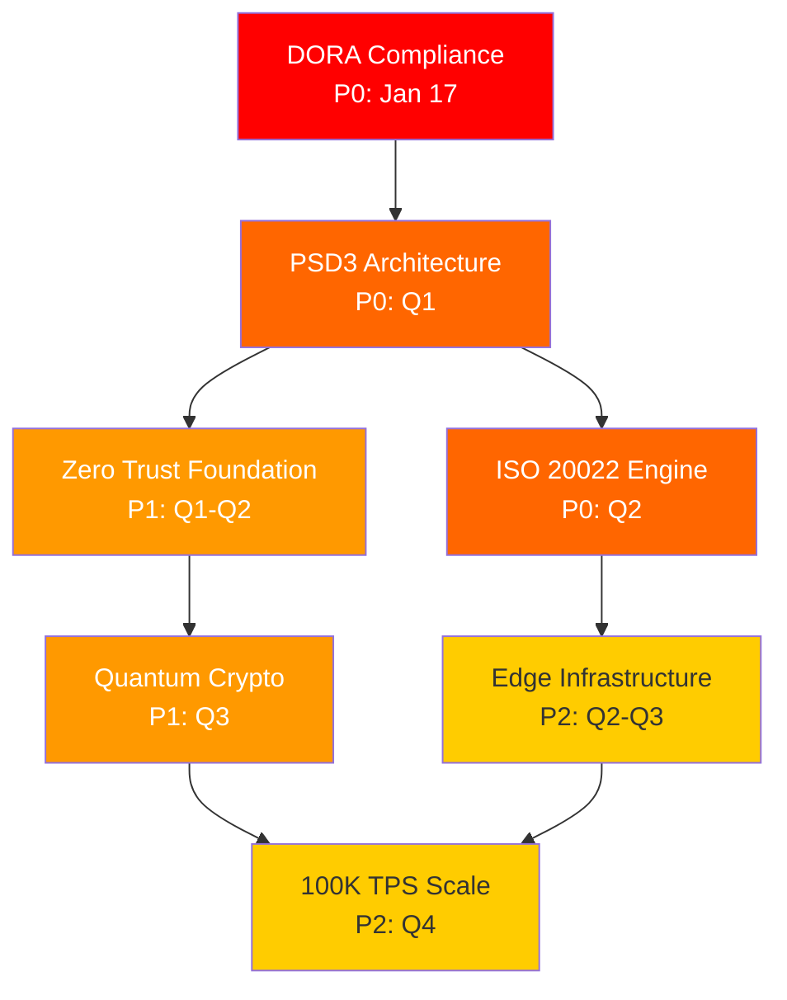
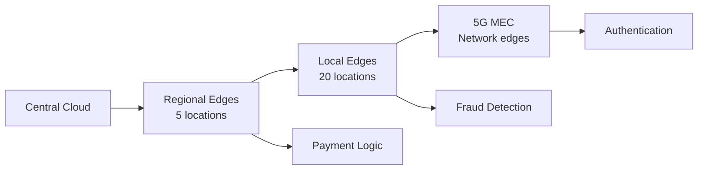
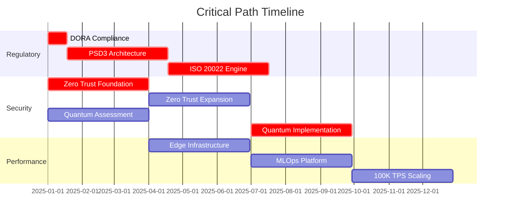

# 🎯 Implementation Priorities 2025 - Critical Path Analysis

## Executive Summary

This document defines the implementation priorities, critical dependencies, and execution sequence for the 2025 payment architecture transformation. It establishes the critical path to ensure regulatory compliance, minimize risk, and maximize business value delivery.

**Critical Success Date**: January 17, 2025 (DORA Compliance)  
**Program Duration**: 18 months  
**Critical Path Items**: 7 major workstreams  
**Dependencies**: 23 critical interdependencies

---

## 🚨 Priority Framework

### Priority Levels

#### P0 - CRITICAL (Regulatory/Existential)
- **Definition**: Failure blocks operations or incurs major penalties
- **Timeline**: Must complete by fixed deadline
- **Examples**: DORA (Jan 17), PSD3 instant payments
- **Resource Allocation**: 40% of total resources

#### P1 - HIGH (Competitive/Security)
- **Definition**: Required for market competitiveness and security
- **Timeline**: Q1-Q2 2025 completion
- **Examples**: Zero Trust, Quantum readiness
- **Resource Allocation**: 35% of total resources

#### P2 - MEDIUM (Performance/Innovation)
- **Definition**: Enables scale and new capabilities
- **Timeline**: Q3-Q4 2025 completion
- **Examples**: Edge computing, MLOps platform
- **Resource Allocation**: 20% of total resources

#### P3 - LOW (Enhancement/Future)
- **Definition**: Nice-to-have improvements
- **Timeline**: 2026 and beyond
- **Examples**: AR payments, voice commerce
- **Resource Allocation**: 5% of total resources

---

## 📅 Critical Path Analysis

### The Seven Critical Workstreams



### Critical Dependencies Matrix

| Workstream | Depends On | Blocks | Critical Date | Risk Level |
|------------|------------|--------|---------------|------------|
| DORA Compliance | None | All EU operations | Jan 17, 2025 | CRITICAL |
| PSD3 Architecture | DORA completion | Payment processing | Mar 31, 2025 | CRITICAL |
| Zero Trust | Infrastructure ready | All deployments | Jun 30, 2025 | HIGH |
| ISO 20022 | PSD3 design | Cross-border | Jun 30, 2025 | HIGH |
| Quantum Crypto | Zero Trust | Future security | Sep 30, 2025 | HIGH |
| Edge Computing | Network infra | Performance | Sep 30, 2025 | MEDIUM |
| 100K TPS | Edge + MLOps | Scale targets | Dec 31, 2025 | MEDIUM |

---

## 🎯 P0 - CRITICAL Priorities

### 1. DORA Compliance (Days 1-17)

**Deadline**: January 17, 2025 (FIXED)  
**Team**: 5 dedicated resources  
**Budget**: €250K  

#### Week 1 (Jan 1-7) Sprint
- [ ] Day 1-2: ICT Risk Register
  - Document all ICT assets
  - Risk classification (Critical/Important/Regular)
  - Impact assessment completion
- [ ] Day 3-4: Third-Party Inventory
  - Critical provider identification
  - Concentration risk assessment
  - Exit strategy templates
- [ ] Day 5-7: Incident Response
  - Update incident procedures
  - Define reporting timelines
  - Test communication channels

#### Week 2 (Jan 8-14) Sprint
- [ ] Day 8-9: Resilience Testing Plan
  - Threat-led penetration test schedule
  - Resilience test scenarios
  - Recovery procedures
- [ ] Day 10-11: Documentation
  - Policy updates
  - Board reporting templates
  - Regulatory submission prep
- [ ] Day 12-14: Internal Audit
  - Compliance validation
  - Gap remediation
  - Evidence collection

#### Week 3 (Jan 15-17) Final Push
- [ ] Day 15: External Review
- [ ] Day 16: Final Remediation
- [ ] Day 17: Compliance Declaration

**Success Criteria**: 
- ✅ All DORA articles addressed
- ✅ Evidence package complete
- ✅ Board approval secured
- ✅ Regulatory notification sent

### 2. PSD3 Instant Payments (Q1)

**Deadline**: March 31, 2025  
**Team**: 8 engineers  
**Budget**: €750K  

#### Phase 1: Architecture (Weeks 1-4)
```yaml
Technical_Requirements:
  Core_Components:
    - Real-time payment gateway
    - Request-to-Pay service
    - Instant fraud detection
    - 24/7 availability system
  
  Performance_Targets:
    - Processing: < 10 seconds
    - Availability: 99.99%
    - Throughput: 50K TPS
    - Latency: < 100ms
```

#### Phase 2: Development (Weeks 5-8)
- Payment gateway core
- High-availability setup
- Fraud detection integration
- Notification system

#### Phase 3: Testing (Weeks 9-11)
- Performance validation
- Failover testing
- Security assessment
- Integration testing

#### Phase 4: Deployment (Week 12)
- Production rollout
- Monitoring setup
- Documentation
- Training completion

### 3. ISO 20022 Migration Engine (Q2)

**Deadline**: June 30, 2025  
**Team**: 5 engineers  
**Budget**: €500K  

#### Critical Components
1. **Translation Engine**
   - Bidirectional conversion
   - Field mapping rules
   - Data enrichment
   - Performance optimization

2. **Coexistence Handler**
   - Format detection
   - Message routing
   - Error handling
   - Monitoring

3. **Testing Framework**
   - Compliance validation
   - Regression testing
   - Performance testing
   - Integration testing

---

## 🔥 P1 - HIGH Priorities

### 1. Zero Trust Architecture (Q1-Q2)

**Timeline**: 6 months  
**Team**: 8 engineers  
**Budget**: €1.25M  

#### Implementation Phases

##### Foundation (Q1)
```yaml
Q1_Deliverables:
  Service_Mesh:
    - Istio/Linkerd selection
    - mTLS implementation
    - Service discovery
    - Traffic management
  
  Policy_Engine:
    - OPA deployment
    - Policy templates
    - Enforcement points
    - Audit logging
  
  Identity_Platform:
    - Service identities
    - Certificate management
    - Token validation
    - Session management
```

##### Expansion (Q2)
- 50% service migration
- Advanced policies
- Behavioral analytics
- Automated remediation

#### Success Metrics
- All critical services protected
- Zero security incidents
- Policy violations < 0.1%
- Performance impact < 5%

### 2. Quantum-Safe Cryptography (Q1 & Q3)

**Timeline**: Assessment Q1, Implementation Q3  
**Team**: 6 engineers  
**Budget**: €1M  

#### Q1: Assessment Phase
1. **Cryptographic Inventory**
   - Algorithm catalog
   - Key length audit
   - Certificate mapping
   - Hardware dependencies

2. **Risk Analysis**
   - Vulnerability timeline
   - Impact assessment
   - Migration complexity
   - Cost estimation

#### Q3: Implementation Phase
1. **Hybrid Deployment**
   - CRYSTALS-Kyber integration
   - Backward compatibility
   - Performance testing
   - Phased rollout

2. **Production Migration**
   - Critical services first
   - Monitor performance
   - Update documentation
   - Compliance certification

---

## 🚀 P2 - MEDIUM Priorities

### 1. Edge Computing & 5G (Q2-Q3)

**Timeline**: 6 months  
**Team**: 7 engineers  
**Budget**: €1.5M  

#### Deployment Strategy


#### Key Milestones
- Q2: Infrastructure setup
- Q2: WebAssembly runtime
- Q3: AI at edge deployment
- Q3: 5G integration complete

### 2. MLOps Platform (Q3)

**Timeline**: 3 months  
**Team**: 5 engineers  
**Budget**: €625K  

#### Platform Components
1. **Infrastructure**
   - MLflow deployment
   - Feature store setup
   - Model registry
   - Monitoring stack

2. **Automation**
   - Training pipelines
   - A/B testing framework
   - Drift detection
   - Auto-retraining

3. **Governance**
   - Model versioning
   - Explainability tools
   - Bias detection
   - Audit trails

### 3. Performance Scaling (Q4)

**Timeline**: 3 months  
**Team**: 6 engineers  
**Budget**: €500K  

#### Scaling Targets
- Current: 10K TPS
- Q3 Target: 50K TPS
- Q4 Target: 100K+ TPS

#### Optimization Areas
1. **Database Layer**
   - Sharding strategy
   - Read replicas
   - Connection pooling
   - Query optimization

2. **Application Layer**
   - Async processing
   - Circuit breakers
   - Resource pooling
   - Memory optimization

3. **Infrastructure**
   - Auto-scaling policies
   - Load balancing
   - CDN optimization
   - Edge caching

---

## 📊 Dependency Management

### Critical Path Dependencies



### Risk Mitigation Matrix

| Dependency | Risk | Impact | Mitigation Strategy |
|------------|------|--------|-------------------|
| DORA → PSD3 | DORA delays PSD3 | HIGH | Parallel prep work |
| Zero Trust → Deployments | Security blocks releases | HIGH | Gradual migration |
| Edge → Performance | Edge delays scaling | MEDIUM | Cloud fallback |
| MLOps → Fraud Detection | ML delays detection | MEDIUM | Rule-based backup |

---

## 🎯 Implementation Principles

### 1. Parallel Execution
- Run independent workstreams simultaneously
- Minimize sequential dependencies
- Use feature flags for gradual rollout
- Maintain backward compatibility

### 2. Incremental Delivery
- Weekly deployments minimum
- Feature toggles for control
- Canary deployments
- Quick rollback capability

### 3. Continuous Validation
- Daily progress tracking
- Weekly dependency review
- Bi-weekly risk assessment
- Monthly milestone validation

### 4. Resource Flexibility
- Cross-trained teams
- Surge capacity planning
- Vendor augmentation ready
- Skill development programs

---

## 📈 Success Tracking

### Weekly Metrics Dashboard

#### Progress Indicators
- **Velocity**: Story points completed
- **Quality**: Defect escape rate
- **Risk**: Open risks by severity
- **Dependencies**: Blocked items
- **Budget**: Burn rate vs plan

#### Health Indicators
| Metric | Green | Yellow | Red |
|--------|-------|--------|-----|
| Schedule Variance | < 5% | 5-10% | > 10% |
| Budget Variance | < 5% | 5-15% | > 15% |
| Quality Score | > 95% | 90-95% | < 90% |
| Team Health | > 80% | 70-80% | < 70% |

### Monthly Executive Dashboard
1. **Regulatory Compliance**: % complete
2. **Security Posture**: Maturity score
3. **Performance**: TPS achieved
4. **Innovation**: Features delivered
5. **ROI**: Benefits realized

---

## 🚦 Go/No-Go Decision Points

### Phase Gates

#### Gate 1: DORA Compliance (Jan 17)
- **Go Criteria**: 100% compliant
- **No-Go Action**: Executive escalation

#### Gate 2: PSD3 Ready (Mar 31)
- **Go Criteria**: Instant payments live
- **No-Go Action**: Limited market entry

#### Gate 3: Security Baseline (Jun 30)
- **Go Criteria**: Zero Trust 50% complete
- **No-Go Action**: Freeze new features

#### Gate 4: Scale Ready (Sep 30)
- **Go Criteria**: 50K TPS achieved
- **No-Go Action**: Capacity investment

#### Gate 5: Full Compliance (Dec 31)
- **Go Criteria**: All certifications
- **No-Go Action**: Remediation sprint

---

## 🎬 Quick Start Actions

### Day 1 Checklist
- [ ] DORA team assembled
- [ ] ICT inventory started
- [ ] Executive sponsor confirmed
- [ ] Communication plan activated
- [ ] Daily standup scheduled

### Week 1 Deliverables
- [ ] DORA gap assessment complete
- [ ] PSD3 architecture kickoff
- [ ] Zero Trust pilot selected
- [ ] Quantum inventory initiated
- [ ] Program dashboard live

### Month 1 Milestones
- [ ] DORA compliant (Jan 17)
- [ ] 10 key hires onboarded
- [ ] Infrastructure provisioned
- [ ] Development started
- [ ] Weekly reporting established

---

**Document Status**: FINAL  
**Version**: 1.0  
**Last Updated**: 2025-08-01  
**Next Review**: Weekly  
**Owner**: Program Management Office  
**Critical Date**: January 17, 2025 (DORA)