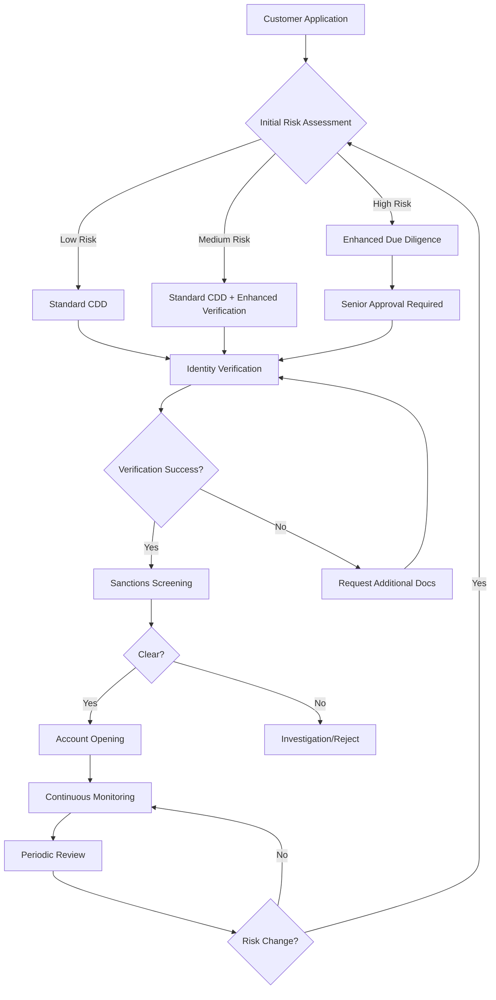
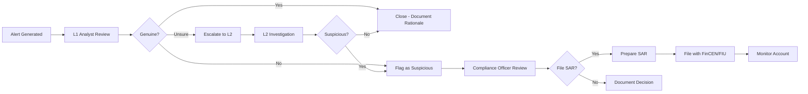

# 🔍 KYC/AML Compliance Deep Dive - Payment Architecture

**Agent**: ProcessAnalyst (Hive Mind Swarm)  
**Date**: 2025-08-01  
**Priority**: HIGH  
**Compliance Gap**: 40% - SIGNIFICANT RISK

## Executive Summary

The KYC/AML framework shows strong technical capabilities but lacks critical procedural documentation and operational workflows. This 40% gap represents **significant regulatory risk** with potential for:
- **Fines**: Up to $2M per violation (US) or 10% annual turnover (EU)
- **License Revocation**: Operating restrictions or suspension
- **Criminal Liability**: Personal liability for executives
- **Reputational Damage**: Public enforcement actions

## 1. Current State Assessment

### ✅ Strengths Identified
1. **Technical Infrastructure**
   - Real-time sanctions screening capability
   - ML-based transaction monitoring
   - Risk scoring engine deployed
   - API integrations for verification

2. **Data Architecture**
   - Customer data model supports KYC fields
   - Audit trail capability present
   - Document storage infrastructure

### 🔴 Critical Gaps

#### A. Customer Onboarding (45% Gap)
**Missing Components**:
1. **Risk-Based Approach Documentation**
   - Customer risk categorization matrix absent
   - Risk scoring methodology undefined
   - Enhanced due diligence (EDD) triggers missing
   - Simplified due diligence (SDD) criteria absent

2. **Identity Verification Procedures**
   - Document verification workflow incomplete
   - Biometric verification standards missing
   - Liveness detection requirements undefined
   - Multi-source verification not documented

3. **Business Customer Onboarding**
   - Ultimate beneficial owner (UBO) procedures missing
   - Corporate structure verification absent
   - Business verification documentation incomplete
   - Ongoing monitoring of business changes undefined

#### B. Ongoing Monitoring (35% Gap)
**Missing Elements**:
1. **Continuous Monitoring Framework**
   - Transaction pattern baseline establishment missing
   - Behavioral deviation thresholds undefined
   - Peer group analysis methodology absent
   - Risk score recalibration frequency not set

2. **Periodic Review Procedures**
   - Customer information refresh cycles missing
   - Risk reassessment triggers undefined
   - Documentation update requirements absent
   - Dormant account procedures missing

#### C. Transaction Monitoring (25% Gap)
**Deficiencies**:
1. **Rule Configuration Documentation**
   - Monitoring scenarios not fully documented
   - Threshold setting methodology missing
   - Rule testing procedures absent
   - Performance metrics undefined

2. **Alert Management Workflow**
   - Investigation procedures incomplete
   - Escalation criteria missing
   - Case management standards absent
   - Quality assurance process undefined

#### D. Reporting Procedures (50% Gap)
**Critical Missing Items**:
1. **Suspicious Activity Reports (SAR)**
   - Filing procedures not documented
   - Decision documentation requirements missing
   - Regulatory timeline compliance undefined
   - Cross-border reporting coordination absent

2. **Currency Transaction Reports (CTR)**
   - Aggregation rules not documented
   - Filing deadlines not specified
   - Exemption procedures missing

## 2. Regulatory Requirements Mapping

### 🇺🇸 US Requirements (BSA/AML)

| Requirement | Current State | Gap | Risk Level |
|-------------|--------------|-----|------------|
| Customer Identification Program (CIP) | Partial | 40% | HIGH |
| Beneficial Ownership Rule | Missing | 80% | CRITICAL |
| Ongoing Monitoring | Basic | 35% | HIGH |
| SAR Filing | Undefined | 90% | CRITICAL |
| CTR Filing | Missing | 100% | HIGH |
| OFAC Screening | Implemented | 10% | LOW |
| Risk Assessment | Incomplete | 45% | HIGH |

### 🇪🇺 EU Requirements (5AMLD/6AMLD)

| Requirement | Current State | Gap | Risk Level |
|-------------|--------------|-----|------------|
| Customer Due Diligence | Partial | 35% | HIGH |
| Enhanced Due Diligence | Minimal | 60% | HIGH |
| Beneficial Ownership (25% threshold) | Missing | 85% | CRITICAL |
| PEP Screening | Basic | 30% | MEDIUM |
| Risk-Based Approach | Incomplete | 40% | HIGH |
| Record Keeping (5 years) | Capable | 15% | LOW |
| Training Requirements | Undefined | 90% | HIGH |

### 🇬🇧 UK Requirements (MLR 2017)

| Requirement | Current State | Gap | Risk Level |
|-------------|--------------|-----|------------|
| Customer Risk Assessment | Partial | 40% | HIGH |
| Simplified Due Diligence | Missing | 100% | MEDIUM |
| Enhanced Due Diligence | Minimal | 55% | HIGH |
| Reliance on Third Parties | Undefined | 100% | MEDIUM |
| Record Keeping | Capable | 15% | LOW |
| Internal Controls | Incomplete | 45% | HIGH |

## 3. Detailed Process Requirements

### A. Customer Onboarding Workflow



### B. Required Documentation Framework

#### 1. Customer Risk Assessment Matrix

| Risk Factor | Low Risk (1) | Medium Risk (2) | High Risk (3) |
|-------------|--------------|-----------------|---------------|
| **Geography** | Domestic, Low-risk countries | Medium-risk jurisdictions | High-risk, Sanctioned countries |
| **Product Type** | Basic accounts, Low limits | Standard products | Complex products, High value |
| **Customer Type** | Employed individuals | Self-employed, SMEs | PEPs, Complex structures |
| **Transaction Pattern** | Regular, Predictable | Variable, Moderate volume | High volume, Complex patterns |
| **Industry** | Low-risk sectors | Medium-risk sectors | High-risk (Crypto, Gaming, MSBs) |

**Risk Score Calculation**: Sum of factors
- 5-7: Low Risk → Standard CDD
- 8-11: Medium Risk → Enhanced Verification
- 12-15: High Risk → Full EDD

#### 2. Identity Verification Standards

**Individual Customers**:
1. **Primary ID** (Government-issued with photo)
   - Passport
   - Driver's License
   - National ID Card

2. **Proof of Address** (Within 3 months)
   - Utility Bill
   - Bank Statement
   - Government Correspondence

3. **Enhanced Verification** (High Risk)
   - Video verification
   - Biometric matching
   - Third-party database checks
   - Source of wealth documentation

**Business Customers**:
1. **Corporate Documents**
   - Certificate of Incorporation
   - Articles of Association
   - Business License
   - Tax Registration

2. **Beneficial Ownership** (25% threshold)
   - Ownership structure chart
   - UBO identification documents
   - Source of wealth for UBOs
   - PEP screening for all UBOs

3. **Operating Verification**
   - Business bank statements
   - Financial statements
   - Website/physical presence verification
   - Industry license verification

### C. Transaction Monitoring Rules

#### 1. Core Monitoring Scenarios

| Scenario | Description | Threshold | Risk Score |
|----------|-------------|-----------|------------|
| Rapid Movement | Funds in/out within 24 hours | >$10,000 | High |
| Velocity | Transaction count spike | >5x baseline | Medium |
| Round Amounts | Multiple round dollar transactions | >3 per day | Medium |
| Structuring | Transactions just below reporting threshold | Pattern detected | High |
| Geographic Risk | Transactions to/from high-risk countries | Any amount | High |
| Peer Deviation | Activity outside peer group norms | >3 std dev | Medium |
| Dormant Activation | Sudden activity in dormant account | After 6 months | High |
| Third-Party Funding | Multiple funders to single account | >3 sources | Medium |

#### 2. Investigation Workflow



### D. Reporting Requirements

#### 1. Suspicious Activity Report (SAR) Triggers

**Mandatory Filing Situations**:
- Suspected money laundering (any amount)
- Structuring to avoid reporting
- No apparent business purpose
- Customer reluctance to provide information
- Use of falsified documents
- Insider abuse
- Terrorist financing suspicion

**Filing Timeline**:
- US: 30 days from detection (60 days with extension)
- EU: "Without delay" (typically 1-3 days)
- UK: "As soon as practicable"

#### 2. SAR Documentation Requirements

```
SAR Case File Must Include:
├── Alert/Detection Documentation
├── Customer Profile & History
├── Transaction Analysis
│   ├── Suspicious transactions highlighted
│   ├── Pattern analysis
│   └── Comparison to normal activity
├── Investigation Notes
│   ├── Information gathered
│   ├── Customer contact (if any)
│   └── Third-party information
├── Decision Documentation
│   ├── Rationale for filing/not filing
│   ├── Approver information
│   └── Dissenting opinions (if any)
└── Filing Confirmation
    ├── Submission receipt
    ├── Reference number
    └── Follow-up actions
```

## 4. Implementation Roadmap

### Phase 1: Foundation (Days 1-30)

#### Week 1-2: Policy Development
- [ ] Create comprehensive KYC/AML Policy
- [ ] Define risk-based approach methodology
- [ ] Establish customer risk categories
- [ ] Document verification standards
- [ ] Create monitoring rule documentation

#### Week 3-4: Procedure Documentation
- [ ] Customer onboarding workflows
- [ ] Investigation procedures
- [ ] Escalation protocols
- [ ] Reporting procedures
- [ ] Record retention standards

### Phase 2: Operationalization (Days 31-60)

#### Week 5-6: System Configuration
- [ ] Configure risk scoring engine
- [ ] Implement monitoring rules
- [ ] Set up case management workflow
- [ ] Configure regulatory reports
- [ ] Enable audit trails

#### Week 7-8: Training & Testing
- [ ] Train compliance team
- [ ] Train front-line staff
- [ ] Test monitoring scenarios
- [ ] Validate reporting capability
- [ ] Conduct mock investigations

### Phase 3: Optimization (Days 61-90)

#### Month 3: Enhancement
- [ ] Tune monitoring rules
- [ ] Optimize risk scores
- [ ] Implement automation
- [ ] Enhance reporting
- [ ] Establish metrics

## 5. Technology Stack Requirements

### Core Components Needed:

1. **KYC/CDD Platform**
   - Identity verification API
   - Document verification
   - Biometric capabilities
   - Database screening

2. **Transaction Monitoring System**
   - Rule engine
   - ML capabilities
   - Case management
   - Reporting module

3. **Sanctions Screening**
   - Real-time screening
   - Batch screening
   - False positive management
   - List management

4. **Case Management**
   - Investigation workflow
   - Document management
   - Audit trail
   - Reporting

### Recommended Vendors:
- **KYC**: Jumio, Onfido, Trulioo
- **AML**: Actimize, SAS, Featurespace
- **Screening**: Dow Jones, Refinitiv, ComplyAdvantage
- **Case Management**: Verafin, AML RightSource

## 6. Compliance Metrics Framework

### Key Performance Indicators (KPIs):

| Metric | Target | Measurement |
|--------|--------|-------------|
| Onboarding Completion Time | <24 hrs (Low Risk) | Average time |
| False Positive Rate | <40% | Alerts closed without action |
| SAR Conversion Rate | 5-10% | SARs filed / Alerts |
| Investigation Time | <72 hrs | Alert to decision |
| Quality Assurance Score | >95% | QA review results |
| Training Completion | 100% | Annual requirement |
| Audit Findings | Zero Critical | Internal/External audits |

### Operational Metrics:

1. **Daily Monitoring**
   - Alerts generated
   - Cases in queue
   - SARs in progress
   - System availability

2. **Weekly Reporting**
   - Alert disposition
   - Investigation outcomes
   - SAR filings
   - Quality metrics

3. **Monthly Analysis**
   - Rule effectiveness
   - Risk distribution
   - Trend analysis
   - Regulatory changes

## 7. Budget Requirements

### Year 1 Investment:

| Category | Estimated Cost | Notes |
|----------|----------------|-------|
| KYC Platform | $150,000 | Including integration |
| AML System | $250,000 | TM + Case Management |
| Screening Solution | $100,000 | Sanctions + PEP |
| Consulting | $200,000 | Implementation support |
| Training | $50,000 | Team certification |
| **Total** | **$750,000** | Plus ongoing costs |

### Ongoing Annual Costs:
- Platform licenses: $300,000
- Data subscriptions: $100,000
- Training/Certification: $25,000
- External audit: $50,000
- **Total Annual**: $475,000

## 8. Risk Mitigation Strategy

### Immediate Actions:
1. **Appoint AML Officer** - Dedicated senior resource
2. **Engage Consultants** - Expert implementation support
3. **Prioritize High-Risk Gaps** - Focus on SAR/CTR procedures
4. **Implement Manual Processes** - While automating
5. **Establish Oversight Committee** - Board-level governance

### Contingency Planning:
- **Regulatory Inquiry Response** - Prepared statements
- **Remediation Plan** - If deficiencies found
- **Business Continuity** - Manual fallback procedures
- **Vendor Failure** - Alternative providers identified

## 9. Success Criteria

### 90-Day Targets:
- ✓ Complete KYC/AML framework documented
- ✓ All procedures operational
- ✓ Staff trained and certified
- ✓ Technology stack deployed
- ✓ Regulatory exam ready
- ✓ Zero critical audit findings

### Key Milestones:
1. **Day 30**: Policies approved, procedures drafted
2. **Day 60**: Systems configured, testing complete
3. **Day 90**: Fully operational, audit ready
4. **Day 120**: First regulatory exam passed

## 10. Executive Recommendations

### Critical Success Factors:
1. **Executive Sponsorship** - C-suite commitment essential
2. **Adequate Resources** - Budget and headcount
3. **Cultural Change** - Compliance-first mindset
4. **Technology Investment** - Modern platforms required
5. **Continuous Improvement** - Ongoing optimization

### Board-Level Actions:
1. Approve $750K Year 1 budget
2. Establish AML Committee
3. Appoint Chief Compliance Officer
4. Mandate monthly reporting
5. Schedule quarterly reviews

---

**Analysis Completed By**: ProcessAnalyst Agent  
**Hive Mind Swarm ID**: swarm-1754069383858-e2khdscig  
**Classification**: HIGH PRIORITY - Regulatory Risk  
**Next Steps**: Immediate implementation of Phase 1