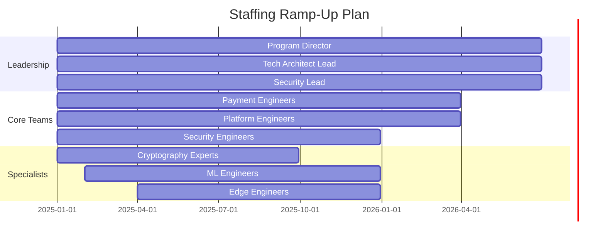

# 💼 Resource Requirements 2025 - Payment Architecture Transformation

## Executive Summary

This document details the comprehensive resource requirements for the 2025 payment architecture transformation, covering human resources, technology infrastructure, tools, and budget allocations needed to close the identified gaps and achieve industry leadership.

**Total Investment**: €15M (€13M core + €2M contingency)
**Timeline**: 18 months (Q1 2025 - Q2 2026)
**Team Size**: 45-55 FTEs at peak (Q2-Q3 2025)

---

## 👥 Human Resources Requirements

### Core Team Structure

#### Leadership Team (5 FTEs)
| Role | Count | Duration | Cost/Year | Responsibilities |
|------|-------|----------|-----------|------------------|
| Program Director | 1 | 18 months | €180K | Overall program delivery |
| Technical Architect Lead | 1 | 18 months | €160K | Architecture decisions |
| Security Architect Lead | 1 | 18 months | €160K | Security transformation |
| Compliance Lead | 1 | 18 months | €140K | Regulatory alignment |
| Engineering Manager | 1 | 18 months | €140K | Team coordination |

**Total Leadership Cost**: €1.17M over 18 months

#### Engineering Teams

##### Payment Engineering (12 FTEs)
| Role | Q1 | Q2 | Q3 | Q4 | Cost/Year | Key Focus |
|------|----|----|----|----|-----------|-----------|
| Payment Architects | 3 | 3 | 2 | 2 | €150K | PSD3, ISO 20022 |
| Backend Engineers | 5 | 6 | 5 | 4 | €120K | Core services |
| Integration Engineers | 2 | 3 | 3 | 2 | €110K | Partner connections |
| API Engineers | 2 | 4 | 4 | 3 | €110K | Open Finance APIs |

**Total Payment Engineering**: €1.58M/year average

##### Platform Engineering (10 FTEs)
| Role | Q1 | Q2 | Q3 | Q4 | Cost/Year | Key Focus |
|------|----|----|----|----|-----------|-----------|
| Platform Engineers | 4 | 6 | 5 | 4 | €130K | Zero Trust, K8s |
| DevOps Engineers | 2 | 2 | 2 | 2 | €120K | GitOps, automation |
| SRE Engineers | 2 | 2 | 3 | 3 | €125K | Reliability, monitoring |
| Performance Engineers | 2 | 2 | 3 | 4 | €130K | 100K TPS target |

**Total Platform Engineering**: €1.31M/year average

##### Security Engineering (8 FTEs)
| Role | Q1 | Q2 | Q3 | Q4 | Cost/Year | Key Focus |
|------|----|----|----|----|-----------|-----------|
| Security Engineers | 3 | 4 | 4 | 3 | €140K | Zero Trust impl |
| Cryptography Experts | 2 | 2 | 2 | 1 | €180K | Quantum crypto |
| Security Analysts | 2 | 2 | 2 | 2 | €100K | Threat hunting |
| Compliance Engineers | 1 | 1 | 2 | 2 | €110K | Audit readiness |

**Total Security Engineering**: €1.06M/year average

##### Data & ML Engineering (8 FTEs)
| Role | Q1 | Q2 | Q3 | Q4 | Cost/Year | Key Focus |
|------|----|----|----|----|-----------|-----------|
| ML Engineers | 1 | 2 | 3 | 3 | €150K | Fraud detection |
| Data Engineers | 1 | 2 | 2 | 2 | €130K | Feature store |
| Edge Engineers | 1 | 3 | 4 | 3 | €140K | Edge computing |
| MLOps Engineers | 0 | 1 | 2 | 2 | €135K | ML platform |

**Total Data & ML Engineering**: €1.11M/year average

#### Support Teams (7 FTEs)

| Role | Count | Duration | Cost/Year | Responsibilities |
|------|-------|----------|-----------|------------------|
| Technical Writers | 2 | 12 months | €80K | Documentation |
| QA Engineers | 3 | 18 months | €100K | Testing automation |
| Business Analysts | 2 | 12 months | €90K | Requirements |

**Total Support Cost**: €0.5M/year average

### Staffing Timeline

### External Resources

#### Consultants & Contractors
- **Regulatory Consultants**: €200K (Q1-Q2 2025)
  - PSD3 compliance expertise
  - DORA implementation guidance
  - Certification preparation
  
- **Security Auditors**: €150K (Q4 2025)
  - Penetration testing
  - Compliance audits
  - Certification assessments

- **Cloud Architects**: €180K (Q2-Q3 2025)
  - Multi-cloud strategy
  - Edge architecture
  - Performance optimization

- **Quantum Crypto Specialists**: €120K (Q1 & Q3 2025)
  - Algorithm selection
  - Implementation review
  - Performance tuning

**Total External Resources**: €650K

---

## 🖥️ Technology Infrastructure

### Cloud Infrastructure

#### Multi-Cloud Requirements
| Component | Provider | Monthly Cost | Annual Cost | Purpose |
|-----------|----------|--------------|-------------|---------|
| Compute (Production) | AWS/Azure | €25K | €300K | Core services |
| Edge Nodes (20 locations) | AWS Wavelength | €15K | €180K | Low latency |
| ML Training | GCP | €10K | €120K | Model development |
| Development/Test | AWS/Azure | €8K | €96K | Non-prod envs |
| Disaster Recovery | Azure | €12K | €144K | Backup region |

**Total Cloud Infrastructure**: €840K/year

### Network Infrastructure

#### 5G and Connectivity
| Component | Provider | Setup Cost | Monthly | Annual |
|-----------|----------|------------|---------|--------|
| 5G Network Slicing | Telco Partners | €200K | €10K | €120K |
| Dedicated Lines | Multiple | €50K | €5K | €60K |
| CDN Services | Cloudflare | €20K | €8K | €96K |
| DDoS Protection | Akamai | €30K | €6K | €72K |

**Total Network**: €300K setup + €348K/year

### Security Infrastructure

#### Hardware Security Modules (HSMs)
| Type | Quantity | Unit Cost | Total Cost | Purpose |
|------|----------|-----------|------------|---------|
| Network HSM | 6 | €50K | €300K | Production crypto |
| Cloud HSM | 4 | €3K/month | €144K/year | Cloud crypto |
| Edge HSM | 10 | €20K | €200K | Edge security |

**Total HSM Investment**: €500K + €144K/year

---

## 🛠️ Software & Tools

### Development Tools

#### Core Platforms
| Tool | License Type | Users | Annual Cost | Purpose |
|------|--------------|-------|-------------|---------|
| GitLab Ultimate | Enterprise | 50 | €60K | Source control, CI/CD |
| Jira/Confluence | Enterprise | 60 | €36K | Project management |
| SonarQube | Enterprise | Unlimited | €50K | Code quality |
| Datadog | Enterprise | Production | €120K | Monitoring |
| PagerDuty | Business | 30 | €36K | Incident management |

**Total Development Tools**: €302K/year

### Security Tools

#### Security Stack
| Tool | License Type | Annual Cost | Purpose |
|------|--------------|-------------|---------|
| Snyk | Enterprise | €80K | Vulnerability scanning |
| Vault Enterprise | Production | €60K | Secrets management |
| Falco | Enterprise | €40K | Runtime security |
| OPA | Enterprise | €30K | Policy engine |
| Qualys VMDR | Enterprise | €50K | Compliance scanning |

**Total Security Tools**: €260K/year

### ML/AI Platforms

#### MLOps Stack
| Tool | License Type | Annual Cost | Purpose |
|------|--------------|-------------|---------|
| Databricks | Enterprise | €150K | ML platform |
| MLflow | Open Source | €0 | Model tracking |
| Weights & Biases | Team | €24K | Experiment tracking |
| Tecton | Growth | €60K | Feature store |
| Seldon | Enterprise | €80K | Model serving |

**Total ML/AI Tools**: €314K/year

### Compliance & Testing

#### Testing Infrastructure
| Tool | License Type | Annual Cost | Purpose |
|------|--------------|-------------|---------|
| LoadRunner | Enterprise | €60K | Performance testing |
| Chaos Monkey | Open Source | €0 | Chaos engineering |
| Postman Enterprise | Team | €20K | API testing |
| BrowserStack | Enterprise | €30K | Cross-platform testing |
| Veracode | Enterprise | €90K | Security testing |

**Total Testing Tools**: €200K/year

---

## 💰 Budget Allocation

### Quarterly Budget Breakdown

#### Q1 2025 (€3.125M)
| Category | Amount | Percentage | Priority Items |
|----------|--------|------------|----------------|
| Salaries | €1.5M | 48% | Core team hiring |
| Infrastructure | €0.8M | 26% | Cloud setup, HSMs |
| Tools & Licenses | €0.4M | 13% | Essential tools |
| Consultants | €0.3M | 10% | DORA compliance |
| Training | €0.125M | 3% | Team upskilling |

#### Q2 2025 (€3.625M)
| Category | Amount | Percentage | Priority Items |
|----------|--------|------------|----------------|
| Salaries | €1.8M | 50% | Full team operational |
| Infrastructure | €0.9M | 25% | Edge deployment |
| Development | €0.6M | 16% | PSD3 implementation |
| Tools & Licenses | €0.225M | 6% | ML platforms |
| Contingency | €0.1M | 3% | Risk buffer |

#### Q3 2025 (€3.5M)
| Category | Amount | Percentage | Priority Items |
|----------|--------|------------|----------------|
| Salaries | €1.75M | 50% | Peak team size |
| Implementation | €0.8M | 23% | Quantum crypto |
| Infrastructure | €0.6M | 17% | Scale-out |
| Testing | €0.25M | 7% | Load testing |
| Compliance | €0.1M | 3% | Audit prep |

#### Q4 2025 (€2.75M)
| Category | Amount | Percentage | Priority Items |
|----------|--------|------------|----------------|
| Salaries | €1.4M | 51% | Optimization team |
| Certification | €0.5M | 18% | Compliance audits |
| Performance | €0.4M | 15% | 100K TPS goal |
| Innovation | €0.3M | 11% | New features |
| Documentation | €0.15M | 5% | Knowledge transfer |

### Cost Optimization Strategies

#### Immediate Savings Opportunities
1. **Cloud Optimization** (€200K/year)
   - Reserved instances: 30% savings
   - Spot instances for dev/test: 70% savings
   - Auto-scaling optimization: 20% reduction

2. **Tool Consolidation** (€100K/year)
   - Replace multiple monitoring tools with Datadog
   - Consolidate security scanning tools
   - Open source alternatives where appropriate

3. **Offshore Augmentation** (€300K/year)
   - 30% of development work offshore
   - 24/7 support coverage
   - Cost arbitrage benefits

#### Long-term ROI

**Year 1 Benefits**:
- Automation savings: €2M
- Incident reduction: €1M
- Faster deployment: €2M
- **Total**: €5M savings

**Year 2 Benefits**:
- New market revenue: €8M
- Reduced compliance costs: €2M
- Performance improvements: €2M
- **Total**: €12M benefit

**Year 3 Benefits**:
- Market leadership premium: €15M
- Innovation revenue: €5M
- Operational excellence: €5M
- **Total**: €25M benefit

---

## 🎯 Critical Success Factors

### Resource Management

1. **Early Recruitment** (Q4 2024)
   - Start hiring key positions immediately
   - Use retention bonuses for critical roles
   - Partner with specialized recruiters

2. **Knowledge Transfer**
   - Overlap periods for all roles
   - Comprehensive documentation
   - Mentoring programs

3. **Performance Tracking**
   - Weekly resource utilization reports
   - Monthly budget variance analysis
   - Quarterly efficiency metrics

### Risk Mitigation

#### Resource Risks
| Risk | Impact | Probability | Mitigation |
|------|--------|-------------|------------|
| Talent shortage | High | Medium | Early recruiting, competitive packages |
| Budget overrun | High | Low | Phase gates, contingency fund |
| Vendor delays | Medium | Medium | Multiple vendors, SLAs |
| Scope creep | High | Medium | Change control process |

### Vendor Management

#### Key Vendor Relationships
1. **Cloud Providers**
   - Enterprise agreements for better rates
   - Technical account managers
   - Architecture review boards

2. **Security Vendors**
   - Proof of concepts before purchase
   - Performance SLAs
   - Regular security reviews

3. **Consulting Partners**
   - Fixed-price engagements
   - Knowledge transfer requirements
   - Success-based pricing

---

## 📊 Resource Allocation Dashboard

### Monthly Tracking Metrics
- **Headcount**: Actual vs planned
- **Utilization**: Resource efficiency
- **Burn Rate**: Budget consumption
- **Velocity**: Delivery speed
- **Quality**: Defect rates

### Governance Structure
- **Weekly**: Resource allocation reviews
- **Bi-weekly**: Budget tracking
- **Monthly**: Vendor performance reviews
- **Quarterly**: Resource optimization

---

## 🚀 Next Steps

### Immediate Actions (Next 14 Days)
1. ✅ Secure budget approval from board
2. ✅ Engage recruitment partners
3. ✅ Negotiate enterprise agreements
4. ✅ Set up cost tracking systems
5. ✅ Define hiring priorities

### 30-Day Milestones
1. ✅ First 10 hires onboarded
2. ✅ Cloud accounts established
3. ✅ Core tools procured
4. ✅ Vendor contracts signed
5. ✅ Resource dashboard operational

---

**Document Status**: FINAL  
**Version**: 1.0  
**Last Updated**: 2025-08-01  
**Next Review**: Monthly  
**Owner**: Program Management Office