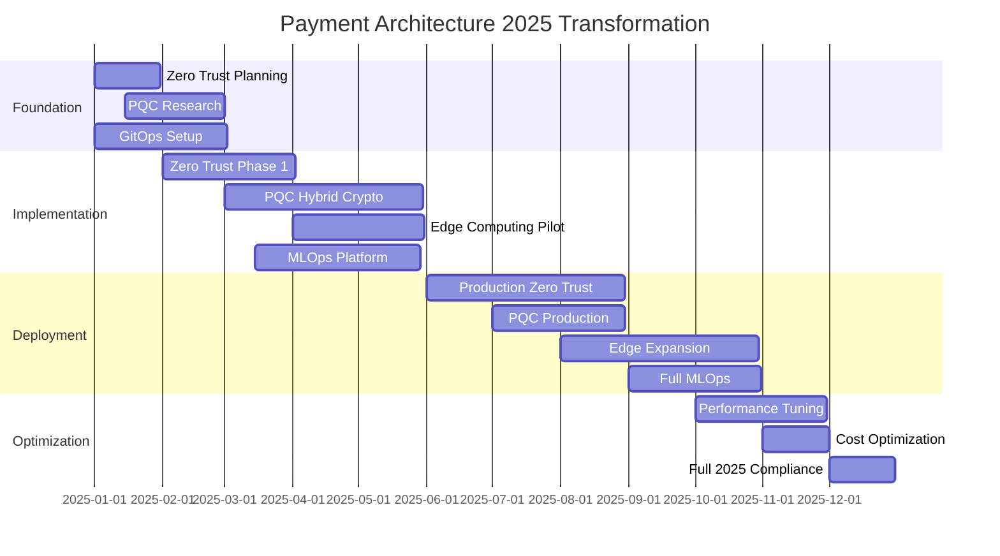

# Payment System Architecture Enhancement Recommendations - 2025 Standards

## Executive Summary

Based on comprehensive validation against 2025 industry standards, this document provides actionable enhancement recommendations for the payment system architecture. These recommendations focus on achieving Zero Trust security, quantum-ready cryptography, edge intelligence, and cloud-native maturity required for modern payment systems.

## 1. Zero Trust Architecture Implementation

### Current State vs. 2025 Requirements

| Aspect | Current State | 2025 Requirement | Gap |
|--------|--------------|------------------|-----|
| Identity Verification | Session-based | Continuous | 70% |
| Network Security | Perimeter-based | Microsegmented | 80% |
| Access Control | Role-based | Policy-based | 60% |
| Device Trust | Basic validation | Risk scoring | 85% |

### Recommended Implementation

#### Phase 1: Foundation (Month 1-2)
```yaml
zero_trust_foundation:
  identity_platform:
    - Deploy Okta/Auth0 with adaptive MFA
    - Implement device fingerprinting
    - Enable continuous session validation
    
  policy_engine:
    - Deploy Open Policy Agent (OPA)
    - Define payment-specific policies
    - Implement dynamic policy evaluation
    
  network_segmentation:
    - Deploy Cilium for network policies
    - Implement service-to-service mTLS
    - Enable eBPF-based monitoring
```

#### Phase 2: Service Mesh Integration (Month 3-4)
```yaml
service_mesh_zero_trust:
  istio_configuration:
    authentication:
      - Enforce mTLS for all services
      - Implement JWT validation
      - Enable workload identity
      
    authorization:
      - Service-level RBAC
      - Request-level authorization
      - Dynamic policy updates
      
    observability:
      - Distributed tracing
      - Security event correlation
      - Anomaly detection
```

#### Implementation Code Example
```go
// Zero Trust Payment Authorization
package zerotrust

import (
    "context"
    "time"
)

type ZeroTrustAuthorizer struct {
    policyEngine    PolicyEngine
    identityVerifier IdentityVerifier
    deviceTrustScore DeviceTrustScorer
    riskAnalyzer    RiskAnalyzer
}

func (z *ZeroTrustAuthorizer) AuthorizePayment(ctx context.Context, req PaymentRequest) (Decision, error) {
    // Continuous identity verification
    identity, err := z.identityVerifier.VerifyContinuous(ctx, req.UserID)
    if err != nil || !identity.IsValid {
        return Decision{Allowed: false, Reason: "Identity verification failed"}, err
    }
    
    // Device trust scoring
    deviceScore := z.deviceTrustScore.Calculate(req.DeviceInfo)
    if deviceScore < 0.7 {
        return Decision{Allowed: false, Reason: "Insufficient device trust"}, nil
    }
    
    // Dynamic policy evaluation
    policyContext := PolicyContext{
        User:         identity,
        Device:       req.DeviceInfo,
        Transaction:  req.Transaction,
        RiskScore:    z.riskAnalyzer.Analyze(req),
        TimeOfDay:    time.Now(),
        Location:     req.Location,
    }
    
    decision := z.policyEngine.Evaluate(policyContext)
    
    // Audit all decisions
    z.auditDecision(req, decision)
    
    return decision, nil
}
```

## 2. Post-Quantum Cryptography Migration

### Implementation Roadmap

#### Phase 1: Hybrid Cryptography (Month 1-3)
```yaml
pqc_hybrid_implementation:
  algorithms:
    key_exchange:
      classical: "ECDHE-P256"
      quantum_safe: "CRYSTALS-Kyber-768"
      
    signatures:
      classical: "ECDSA-P256"
      quantum_safe: "CRYSTALS-Dilithium3"
      
  implementation_approach:
    - Run classical and PQC in parallel
    - Verify both signatures
    - Use larger of two shared secrets
```

#### Implementation Example
```python
# Hybrid Cryptography Implementation
from cryptography.hazmat.primitives import hashes
from pqcrypto.kem import kyber768
from pqcrypto.sign import dilithium3

class HybridCrypto:
    def __init__(self):
        self.classical_crypto = ClassicalCrypto()
        self.pqc_crypto = PQCCrypto()
    
    def hybrid_key_exchange(self, peer_public_keys):
        # Classical ECDHE
        classical_shared = self.classical_crypto.ecdhe(
            peer_public_keys['classical']
        )
        
        # Post-Quantum Kyber
        pqc_shared = self.pqc_crypto.kyber_decapsulate(
            peer_public_keys['kyber_ciphertext']
        )
        
        # Combine secrets using KDF
        combined_secret = self.kdf(
            classical_shared + pqc_shared,
            salt=b"hybrid_payment_2025"
        )
        
        return combined_secret
    
    def hybrid_sign(self, message):
        # Sign with both algorithms
        classical_sig = self.classical_crypto.ecdsa_sign(message)
        pqc_sig = self.pqc_crypto.dilithium_sign(message)
        
        return {
            'classical': classical_sig,
            'pqc': pqc_sig,
            'algorithm': 'hybrid_ecdsa_dilithium3'
        }
```

### Crypto-Agility Framework
```yaml
crypto_agility:
  configuration:
    supported_algorithms:
      - id: "hybrid_v1"
        classical: ["ECDSA-P256", "RSA-3072"]
        pqc: ["Dilithium3", "Falcon-512"]
        
    migration_strategy:
      - Monitor quantum computing advances
      - Update algorithm preferences
      - Gradual deprecation of classical-only
      
  implementation:
    - Versioned crypto operations
    - Algorithm negotiation protocol
    - Backward compatibility layer
    - Performance monitoring
```

## 3. Edge Computing with AI Intelligence

### Edge Architecture for Sub-10ms Payments

#### Edge Node Configuration
```yaml
edge_deployment:
  locations:
    - 5G MEC sites in major cities
    - CDN edge locations
    - ISP aggregation points
    
  capabilities:
    compute:
      - NVIDIA Jetson for AI inference
      - ARM-based processors
      - Hardware security modules
      
    ai_models:
      - TinyML fraud detection
      - WebAssembly payment logic
      - Federated learning clients
```

#### Implementation Example
```rust
// WebAssembly Edge Payment Function
use wasm_bindgen::prelude::*;

#[wasm_bindgen]
pub struct EdgePaymentProcessor {
    fraud_model: TinyMLModel,
    local_cache: Cache,
    metrics: Metrics,
}

#[wasm_bindgen]
impl EdgePaymentProcessor {
    pub fn process_payment(&mut self, payment_data: &[u8]) -> Result<Vec<u8>, JsValue> {
        let start = instant::now();
        
        // Deserialize payment request
        let payment: PaymentRequest = bincode::deserialize(payment_data)
            .map_err(|e| JsValue::from_str(&e.to_string()))?;
        
        // Local fraud scoring with TinyML
        let fraud_score = self.fraud_model.predict(&payment.features());
        
        if fraud_score > 0.7 {
            return Ok(self.create_response(PaymentStatus::Rejected, "High fraud risk"));
        }
        
        // Check local cache for merchant validation
        if let Some(merchant_status) = self.local_cache.get(&payment.merchant_id) {
            if !merchant_status.is_active {
                return Ok(self.create_response(PaymentStatus::Rejected, "Merchant inactive"));
            }
        }
        
        // Process payment with ultra-low latency
        let response = self.process_with_edge_logic(&payment)?;
        
        // Record metrics
        self.metrics.record_latency(instant::now() - start);
        
        Ok(response)
    }
    
    pub fn update_model(&mut self, model_weights: &[u8]) -> Result<(), JsValue> {
        // Federated learning model update
        self.fraud_model.update_weights(model_weights)?;
        Ok(())
    }
}
```

### Edge-Cloud Hybrid Processing
```python
class EdgeCloudHybrid:
    def __init__(self):
        self.edge_nodes = self.discover_edge_nodes()
        self.latency_threshold = 10  # ms
    
    async def process_payment(self, payment):
        # Measure latency to edge nodes
        edge_latencies = await self.measure_latencies()
        
        # Find suitable edge node
        best_edge = min(edge_latencies, key=lambda x: x.latency)
        
        if best_edge.latency < self.latency_threshold:
            # Process at edge for ultra-low latency
            result = await self.process_at_edge(best_edge, payment)
            
            # Async sync with cloud
            asyncio.create_task(self.sync_with_cloud(payment, result))
            
            return result
        else:
            # Fallback to cloud processing
            return await self.process_in_cloud(payment)
    
    async def process_at_edge(self, edge_node, payment):
        # Deploy WASM function to edge
        wasm_module = self.get_payment_wasm()
        
        response = await edge_node.execute_wasm(
            module=wasm_module,
            function="process_payment",
            args=[payment.serialize()]
        )
        
        return PaymentResponse.deserialize(response)
```

## 4. MLOps Infrastructure for Payment Systems

### Comprehensive MLOps Platform

#### Architecture Overview
```yaml
mlops_platform:
  components:
    feature_store:
      - Feast for feature management
      - Real-time feature serving
      - Feature versioning
      
    model_registry:
      - MLflow for model tracking
      - A/B testing framework
      - Model lineage tracking
      
    training_pipeline:
      - Kubeflow for orchestration
      - Distributed training
      - AutoML integration
      
    monitoring:
      - Model performance metrics
      - Data drift detection
      - Automated retraining
```

#### Implementation Example
```python
# MLOps Pipeline for Fraud Detection
class PaymentMLOps:
    def __init__(self):
        self.feature_store = FeatureStore()
        self.model_registry = ModelRegistry()
        self.monitor = ModelMonitor()
    
    async def train_fraud_model(self):
        # Get features from feature store
        features = self.feature_store.get_features([
            "user_transaction_history",
            "merchant_risk_score",
            "device_fingerprint_features",
            "location_risk_features"
        ])
        
        # Train model with AutoML
        automl = AutoMLFraudDetection()
        model = await automl.train(
            features=features,
            target="is_fraud",
            time_budget=3600,  # 1 hour
            optimization_metric="f1_score"
        )
        
        # Validate model
        validation_results = self.validate_model(model)
        
        if validation_results.meets_criteria():
            # Register model
            model_version = self.model_registry.register(
                model=model,
                metrics=validation_results,
                tags={"environment": "production", "type": "fraud_detection"}
            )
            
            # Deploy with canary release
            await self.deploy_with_canary(model_version)
        
        return model_version
    
    async def deploy_with_canary(self, model_version):
        # Start with 5% traffic
        canary_config = {
            "version": model_version,
            "traffic_percentage": 5,
            "success_criteria": {
                "false_positive_rate": {"max": 0.01},
                "latency_p99": {"max": 50},
                "error_rate": {"max": 0.001}
            }
        }
        
        deployment = await self.deploy_canary(canary_config)
        
        # Monitor and gradually increase traffic
        for percentage in [10, 25, 50, 100]:
            metrics = await self.monitor.get_canary_metrics(deployment)
            
            if metrics.meets_criteria(canary_config["success_criteria"]):
                await deployment.update_traffic(percentage)
                await asyncio.sleep(300)  # 5 minutes
            else:
                await deployment.rollback()
                raise Exception(f"Canary failed at {percentage}%")
```

## 5. Cloud-Native Excellence with GitOps

### GitOps Implementation

#### Repository Structure
```yaml
payment-system-gitops/
├── clusters/
│   ├── production/
│   │   ├── us-east-1/
│   │   ├── eu-west-1/
│   │   └── ap-southeast-1/
│   ├── staging/
│   └── development/
├── applications/
│   ├── payment-gateway/
│   ├── fraud-service/
│   └── settlement-engine/
├── infrastructure/
│   ├── terraform/
│   └── crossplane/
└── policies/
    ├── security/
    └── compliance/
```

#### ArgoCD Application Example
```yaml
apiVersion: argoproj.io/v1alpha1
kind: Application
metadata:
  name: payment-gateway
  namespace: argocd
spec:
  project: payment-system
  source:
    repoURL: https://git.company.com/payment-system-gitops
    targetRevision: HEAD
    path: applications/payment-gateway
    helm:
      valueFiles:
        - values-production.yaml
      parameters:
        - name: image.tag
          value: "v2.1.0-quantum-ready"
  destination:
    server: https://kubernetes.default.svc
    namespace: payment-system
  syncPolicy:
    automated:
      prune: true
      selfHeal: true
    syncOptions:
      - CreateNamespace=true
    retry:
      limit: 5
      backoff:
        duration: 5s
        factor: 2
        maxDuration: 3m
  # Progressive delivery with Flagger
  strategy:
    canary:
      steps:
        - setWeight: 5
        - pause: {duration: 5m}
        - setWeight: 20
        - pause: {duration: 5m}
        - setWeight: 50
        - pause: {duration: 10m}
```

### Policy as Code with OPA
```rego
# Payment System Security Policies
package payment.security

# Deny deployments without mTLS
deny[msg] {
    input.kind == "Deployment"
    not input.spec.template.metadata.annotations["sidecar.istio.io/inject"] == "true"
    msg := "All payment services must have Istio sidecar injection enabled"
}

# Require quantum-ready crypto
deny[msg] {
    input.kind == "ConfigMap"
    input.metadata.name == "crypto-config"
    not input.data.algorithm == "hybrid-pqc"
    msg := "Payment services must use quantum-ready cryptography"
}

# Enforce resource limits
deny[msg] {
    input.kind == "Deployment"
    container := input.spec.template.spec.containers[_]
    not container.resources.limits.memory
    msg := sprintf("Container %s must have memory limits", [container.name])
}
```

## 6. Performance Optimization for 100K+ TPS

### Architecture for Ultra-High Throughput

#### Optimized Data Pipeline
```go
// Lock-free payment processing pipeline
package performance

import (
    "sync/atomic"
    "unsafe"
)

type LockFreePaymentQueue struct {
    head unsafe.Pointer
    tail unsafe.Pointer
}

type node struct {
    payment Payment
    next    unsafe.Pointer
}

func (q *LockFreePaymentQueue) Enqueue(payment Payment) {
    n := &node{payment: payment}
    for {
        tail := (*node)(atomic.LoadPointer(&q.tail))
        next := (*node)(atomic.LoadPointer(&tail.next))
        
        if tail == (*node)(atomic.LoadPointer(&q.tail)) {
            if next == nil {
                if atomic.CompareAndSwapPointer(&tail.next, 
                    unsafe.Pointer(next), unsafe.Pointer(n)) {
                    atomic.CompareAndSwapPointer(&q.tail, 
                        unsafe.Pointer(tail), unsafe.Pointer(n))
                    return
                }
            } else {
                atomic.CompareAndSwapPointer(&q.tail, 
                    unsafe.Pointer(tail), unsafe.Pointer(next))
            }
        }
    }
}

// NUMA-aware payment processor
type NUMAProcessor struct {
    queues []LockFreePaymentQueue
    workers []PaymentWorker
}

func (p *NUMAProcessor) Process() {
    // Pin workers to NUMA nodes
    for i, worker := range p.workers {
        numaNode := i % runtime.NumCPU()
        worker.SetAffinity(numaNode)
        
        go func(w PaymentWorker, q LockFreePaymentQueue) {
            for {
                if payment := q.Dequeue(); payment != nil {
                    w.Process(payment)
                }
            }
        }(worker, p.queues[numaNode])
    }
}
```

### In-Memory Computing with Apache Ignite
```java
// Distributed in-memory payment processing
@Service
public class IgnitePaymentProcessor {
    @Autowired
    private Ignite ignite;
    
    public CompletableFuture<PaymentResult> processPayment(Payment payment) {
        // Collocated computation for minimal latency
        return ignite.compute()
            .affinityCallAsync(
                "payments",
                payment.getMerchantId(),
                new PaymentProcessorCallable(payment)
            );
    }
    
    private static class PaymentProcessorCallable 
        implements IgniteCallable<PaymentResult> {
        
        @IgniteInstanceResource
        private Ignite ignite;
        
        private final Payment payment;
        
        @Override
        public PaymentResult call() {
            // Access collocated data
            IgniteCache<String, MerchantData> merchantCache = 
                ignite.cache("merchants");
            
            MerchantData merchant = merchantCache.localPeek(
                payment.getMerchantId(), CachePeekMode.PRIMARY);
            
            // Process with near-zero latency
            return processWithMerchantData(payment, merchant);
        }
    }
}
```

## 7. Cost Optimization with FinOps

### Real-Time Cost Tracking
```python
class PaymentFinOps:
    def __init__(self):
        self.cost_analyzer = CostAnalyzer()
        self.optimizer = ResourceOptimizer()
    
    def track_transaction_cost(self, transaction_id):
        """Track cost per payment transaction"""
        costs = {
            'compute': self.calculate_compute_cost(transaction_id),
            'network': self.calculate_network_cost(transaction_id),
            'storage': self.calculate_storage_cost(transaction_id),
            'third_party': self.calculate_third_party_cost(transaction_id)
        }
        
        total_cost = sum(costs.values())
        
        # Alert if cost exceeds threshold
        if total_cost > 0.001:  # $0.001 per transaction
            self.alert_high_cost_transaction(transaction_id, total_cost)
        
        return costs
    
    async def optimize_resources(self):
        """Continuous resource optimization"""
        while True:
            # Analyze usage patterns
            usage = await self.get_resource_usage()
            
            # Rightsize instances
            if usage.cpu_utilization < 30:
                await self.optimizer.downsize_instances()
            elif usage.cpu_utilization > 80:
                await self.optimizer.upsize_instances()
            
            # Optimize data transfer
            if usage.cross_region_transfer > threshold:
                await self.optimizer.enable_regional_caching()
            
            # Use spot instances for batch processing
            if usage.batch_queue_length > 1000:
                await self.optimizer.provision_spot_instances()
            
            await asyncio.sleep(300)  # 5 minutes
```

## Implementation Timeline

### 12-Month Transformation Roadmap



## Success Metrics

### Key Performance Indicators

| Metric | Current | Target | Timeline |
|--------|---------|--------|----------|
| API Latency (p99) | 200ms | 50ms | 6 months |
| Throughput | 10K TPS | 100K TPS | 9 months |
| Security Score | 65% | 95% | 12 months |
| ML Model Accuracy | 92% | 99% | 6 months |
| Infrastructure Cost | $X | 0.7X | 12 months |
| Deployment Frequency | Weekly | Daily | 3 months |
| MTTR | 4 hours | 15 minutes | 6 months |

## Conclusion

These enhancement recommendations provide a clear path to achieving 2025 industry standards for payment systems. The focus on Zero Trust security, quantum-ready cryptography, edge intelligence, and cloud-native excellence will position the payment system as a leader in the industry. Success requires commitment to the transformation roadmap and continuous iteration based on metrics and feedback.