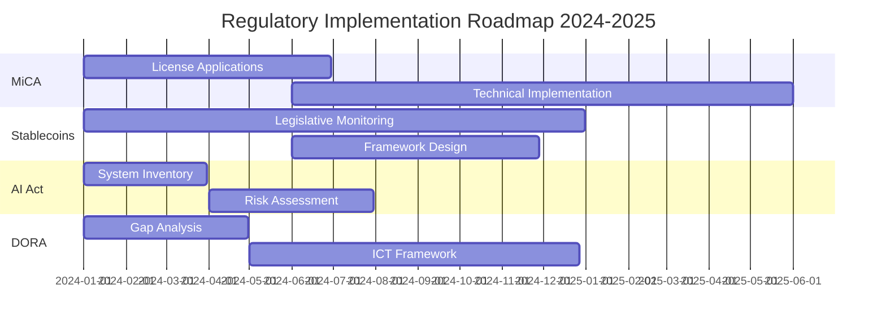

# Emerging Regulatory Frameworks in Payments

## Executive Summary

The payments landscape is experiencing unprecedented regulatory evolution driven by digital transformation, cryptocurrency adoption, AI integration, and cross-border data flows. This document provides comprehensive analysis of emerging regulations that will shape payment systems through 2030.

## 1. Markets in Crypto-Assets (MiCA) - EU

### Overview
- **Status**: Entered into force June 2023, full application by end-2024
- **Scope**: All crypto-assets, issuers, and service providers in EU
- **Impact**: Establishes comprehensive framework for digital assets

### Key Requirements

#### For Stablecoin Issuers
```yaml
MiCA_Stablecoin_Requirements:
  Asset_Backed_Tokens:
    Reserve_Requirements:
      - Full backing with low-risk assets
      - Segregated custody accounts
      - Daily valuation and reporting
    Capital_Requirements:
      - Minimum €350,000 or 2% of reserve assets
      - Additional buffers for systemic tokens
    Operational_Requirements:
      - White paper publication
      - Marketing communications approval
      - Complaint handling procedures
      
  E-Money_Tokens:
    Issuer_Authorization:
      - E-money institution license required
      - Credit institution alternative
    Redemption_Rights:
      - At par value guarantee
      - No fees for redemption
      - Immediate processing
```

#### For Crypto-Asset Service Providers (CASPs)
```python
# CASP Compliance Framework
class MiCA_CASP_Compliance:
    def __init__(self):
        self.services = [
            'custody_and_administration',
            'operation_of_trading_platform',
            'exchange_services',
            'execution_of_orders',
            'placing_of_crypto_assets',
            'reception_transmission_orders',
            'advice_on_crypto_assets',
            'portfolio_management'
        ]
        
    def authorization_requirements(self, service_type):
        base_requirements = {
            'capital': self.calculate_capital_requirement(service_type),
            'governance': self.governance_structure(),
            'security': self.it_security_requirements(),
            'aml_cft': self.aml_compliance(),
            'market_abuse': self.market_surveillance()
        }
        return base_requirements
        
    def calculate_capital_requirement(self, service_type):
        requirements = {
            'custody': max(150000, self.aum * 0.001),
            'trading_platform': 750000,
            'exchange': 500000,
            'advisory': 50000
        }
        return requirements.get(service_type, 125000)
```

### Compliance Readiness Checklist

- [ ] **Entity Assessment**
  - [ ] Determine if activities fall under MiCA scope
  - [ ] Identify required licenses/authorizations
  - [ ] Assess transitional provisions applicability

- [ ] **Technical Implementation**
  - [ ] Implement transaction recording systems
  - [ ] Deploy market abuse detection tools
  - [ ] Establish white paper generation process
  - [ ] Build regulatory reporting infrastructure

- [ ] **Operational Readiness**
  - [ ] Appoint compliance officers
  - [ ] Establish governance framework
  - [ ] Implement customer complaint procedures
  - [ ] Create business continuity plans

- [ ] **Capital and Prudential**
  - [ ] Calculate capital requirements
  - [ ] Establish reserve management procedures
  - [ ] Implement liquidity management
  - [ ] Deploy stress testing frameworks

## 2. US Stablecoin Legislation Frameworks

### Current Legislative Proposals

#### Stablecoin TRUST Act
```yaml
Key_Provisions:
  Payment_Stablecoins:
    Definition: "Digital assets redeemable 1:1 for USD"
    Issuers:
      - Insured depository institutions
      - Non-bank payment stablecoin issuers
    Requirements:
      - 100% high-quality liquid assets
      - Federal or state licensing
      - Redemption guarantee
      
  Regulatory_Framework:
    Federal_Level:
      - OCC supervision for banks
      - Federal Reserve oversight
      - FDIC insurance eligibility
    State_Level:
      - State licensing option
      - Federal floor preemption
      - Interstate reciprocity
```

#### Responsible Financial Innovation Act
```javascript
// Stablecoin Regulatory Requirements
const stablecoinFramework = {
  taxonomy: {
    payment_stablecoins: {
      backed_by: 'fiat_currency',
      redeemable: true,
      regulated_as: 'payment_instrument'
    },
    commodity_stablecoins: {
      backed_by: 'commodities',
      regulated_by: 'CFTC'
    },
    algorithmic_stablecoins: {
      status: 'requires_study',
      moratorium: '2_years'
    }
  },
  
  consumer_protections: {
    redemption_rights: 'on_demand',
    disclosure_requirements: 'comprehensive',
    bankruptcy_protections: 'customer_assets_segregated',
    fdic_insurance: 'pass_through_eligible'
  },
  
  systemic_risk_provisions: {
    designation_threshold: '$10_billion',
    enhanced_supervision: true,
    stress_testing: 'annual',
    resolution_planning: 'required'
  }
};
```

### Implementation Timeline
- **2024 Q1-Q2**: Legislative debate and amendments
- **2024 Q3-Q4**: Potential passage and signing
- **2025**: Rulemaking and implementation period
- **2026**: Full compliance required

### Compliance Readiness Checklist

- [ ] **Legal Structure**
  - [ ] Evaluate banking vs non-bank issuer options
  - [ ] Assess state vs federal licensing paths
  - [ ] Review existing money transmitter licenses
  - [ ] Plan corporate structure changes

- [ ] **Reserve Management**
  - [ ] Establish qualified custodian relationships
  - [ ] Implement asset segregation procedures
  - [ ] Deploy daily attestation systems
  - [ ] Create redemption infrastructure

- [ ] **Regulatory Compliance**
  - [ ] Build BSA/AML program enhancements
  - [ ] Implement transaction monitoring
  - [ ] Establish SAR/CTR filing procedures
  - [ ] Create regulatory reporting systems

## 3. EU AI Act - Payment System Implications

### Risk Categorization for Payment AI Systems

#### High-Risk AI Systems in Payments
```python
class PaymentAI_RiskAssessment:
    def __init__(self):
        self.high_risk_categories = {
            'creditworthiness_assessment': {
                'risk_level': 'HIGH',
                'requirements': ['transparency', 'human_oversight', 'accuracy'],
                'prohibited_uses': ['social_scoring', 'discriminatory_profiling']
            },
            'fraud_detection': {
                'risk_level': 'HIGH',
                'requirements': ['explainability', 'testing', 'monitoring'],
                'documentation': ['technical_docs', 'risk_assessment', 'testing_results']
            },
            'customer_authentication': {
                'risk_level': 'HIGH',
                'biometric_rules': ['consent', 'alternatives', 'data_minimization'],
                'accuracy_thresholds': {'FAR': 0.001, 'FRR': 0.05}
            }
        }
    
    def compliance_requirements(self, ai_system_type):
        if ai_system_type in self.high_risk_categories:
            return {
                'conformity_assessment': 'required',
                'ce_marking': 'mandatory',
                'eu_database_registration': True,
                'post_market_monitoring': 'continuous',
                'incident_reporting': '72_hours'
            }
```

### Algorithmic Decision-Making Requirements

#### Transparency Obligations
```yaml
AI_Transparency_Requirements:
  Customer_Facing:
    Notification:
      - Clear disclosure of AI usage
      - Purpose and logic explanation
      - Significance and consequences
    Rights:
      - Human review request
      - Contestation mechanism
      - Opt-out options (where applicable)
      
  Technical_Documentation:
    System_Design:
      - Architecture documentation
      - Training data description
      - Performance metrics
    Risk_Management:
      - Bias assessment reports
      - Fairness metrics
      - Mitigation measures
    Validation:
      - Testing procedures
      - Accuracy benchmarks
      - Robustness evaluation
```

### Compliance Readiness Checklist

- [ ] **AI System Inventory**
  - [ ] Catalog all AI/ML systems in payments
  - [ ] Classify risk levels per EU AI Act
  - [ ] Identify prohibited use cases
  - [ ] Document intended purposes

- [ ] **Technical Compliance**
  - [ ] Implement explainability features
  - [ ] Deploy bias detection tools
  - [ ] Establish accuracy monitoring
  - [ ] Create audit logging systems

- [ ] **Governance Framework**
  - [ ] Appoint AI compliance officers
  - [ ] Establish ethics committees
  - [ ] Implement human oversight procedures
  - [ ] Create incident response plans

- [ ] **Documentation Requirements**
  - [ ] Prepare technical documentation
  - [ ] Create transparency notices
  - [ ] Develop training materials
  - [ ] Maintain compliance records

## 4. Cross-Border Data Flow Regulations (Post-Schrems III)

### Current Landscape and Anticipations

#### Expected Schrems III Implications
```javascript
// Data Transfer Compliance Framework
const dataTransferCompliance = {
  current_mechanisms: {
    standard_contractual_clauses: {
      status: 'valid_with_TIA',
      requirements: ['transfer_impact_assessment', 'supplementary_measures']
    },
    adequacy_decisions: {
      EU_US_DPF: 'active_but_challenged',
      UK_bridge: 'operational',
      other_countries: ['Japan', 'Canada', 'Switzerland']
    }
  },
  
  anticipated_requirements: {
    data_localization: {
      payment_data: 'possible_requirement',
      transaction_records: 'local_copy_mandate',
      customer_data: 'residence_based_storage'
    },
    encryption_standards: {
      in_transit: 'quantum_safe_required',
      at_rest: 'jurisdiction_specific_keys',
      processing: 'homomorphic_encouraged'
    },
    access_controls: {
      government_requests: 'notification_required',
      data_minimization: 'strict_enforcement',
      purpose_limitation: 'granular_consent'
    }
  }
};
```

### Regional Data Sovereignty Requirements

#### APAC Data Localization
```yaml
Regional_Requirements:
  China:
    Critical_Information_Infrastructure:
      - Payment processors classified as CII
      - Complete data localization required
      - Cross-border transfer assessment needed
      
  India:
    Payment_Data_Storage:
      - Transaction data: Local storage mandatory
      - Cross-border: Only after local copy
      - Deletion: As per local law
      
  Indonesia:
    Financial_Services_Data:
      - Electronic system operators registration
      - Data center in Indonesia required
      - Government access provisions
      
  Russia:
    Personal_Data_Law:
      - Russian citizen data in Russia
      - Payment data included
      - Roskomnadzor oversight
```

### Compliance Readiness Checklist

- [ ] **Data Mapping**
  - [ ] Inventory all cross-border data flows
  - [ ] Classify data types and sensitivity
  - [ ] Document lawful bases for transfers
  - [ ] Identify alternative architectures

- [ ] **Technical Architecture**
  - [ ] Implement data residency controls
  - [ ] Deploy geo-fencing capabilities
  - [ ] Establish local processing nodes
  - [ ] Create data segregation systems

- [ ] **Legal Mechanisms**
  - [ ] Update SCCs with supplementary measures
  - [ ] Conduct transfer impact assessments
  - [ ] Implement notification procedures
  - [ ] Establish government request protocols

- [ ] **Operational Procedures**
  - [ ] Train staff on data flow restrictions
  - [ ] Implement access control matrices
  - [ ] Deploy monitoring and alerting
  - [ ] Create incident response procedures

## 5. Digital Operational Resilience Act (DORA)

### Scope and Application to Payment Systems

#### Core Requirements
```python
class DORA_Compliance:
    def __init__(self):
        self.pillars = {
            'ICT_risk_management': {
                'governance': self.ict_governance_requirements(),
                'risk_framework': self.risk_management_framework(),
                'business_continuity': self.bcp_requirements()
            },
            'incident_reporting': {
                'major_incidents': self.major_incident_criteria(),
                'reporting_timeline': self.reporting_deadlines(),
                'templates': self.reporting_templates()
            },
            'testing': {
                'basic_testing': self.annual_testing_requirements(),
                'advanced_testing': self.threat_led_penetration_testing(),
                'third_party_testing': self.supply_chain_testing()
            },
            'third_party_risk': {
                'critical_providers': self.identify_critical_tpps(),
                'concentration_risk': self.assess_concentration(),
                'exit_strategies': self.develop_exit_plans()
            },
            'information_sharing': {
                'threat_intelligence': self.threat_sharing_protocols(),
                'cyber_hygiene': self.hygiene_standards()
            }
        }
    
    def major_incident_criteria(self):
        return {
            'downtime': '> 2 hours for critical services',
            'transactions_affected': '> 10% daily average',
            'customers_impacted': '> 5000 or 1% of base',
            'data_breach': 'Any personal data breach',
            'reputational_impact': 'Media coverage expected'
        }
```

### ICT Third-Party Risk Management

#### Critical ICT Provider Assessment
```yaml
Third_Party_Risk_Framework:
  Classification:
    Critical_Providers:
      - Cloud infrastructure (AWS, Azure, GCP)
      - Core banking platforms
      - Payment processors
      - Security service providers
      
  Due_Diligence:
    Initial_Assessment:
      - Financial stability check
      - Security certification review
      - Operational resilience evaluation
      - Concentration risk analysis
      
    Ongoing_Monitoring:
      - Quarterly performance reviews
      - Annual security assessments
      - Incident notification procedures
      - Exit strategy testing
      
  Contractual_Requirements:
    Mandatory_Clauses:
      - Audit rights
      - Incident notification (2 hours)
      - Sub-outsourcing approval
      - Termination assistance
      - Data return/deletion
```

### Compliance Readiness Checklist

- [ ] **ICT Risk Management**
  - [ ] Establish ICT risk management framework
  - [ ] Implement three lines of defense
  - [ ] Deploy continuous monitoring tools
  - [ ] Create risk appetite statements

- [ ] **Incident Management**
  - [ ] Define major incident criteria
  - [ ] Implement 2-hour notification capability
  - [ ] Create incident classification matrix
  - [ ] Establish root cause analysis process

- [ ] **Resilience Testing**
  - [ ] Schedule annual ICT testing
  - [ ] Plan threat-led penetration tests
  - [ ] Design scenario-based exercises
  - [ ] Test third-party dependencies

- [ ] **Third-Party Management**
  - [ ] Create ICT provider register
  - [ ] Assess concentration risks
  - [ ] Develop exit strategies
  - [ ] Implement continuous monitoring

- [ ] **Reporting and Governance**
  - [ ] Establish board-level oversight
  - [ ] Create DORA compliance function
  - [ ] Implement regulatory reporting
  - [ ] Deploy information sharing protocols

## 6. Quantum-Safe Cryptography Requirements

### Emerging Standards and Timelines

#### NIST Post-Quantum Cryptography Standards
```python
class QuantumSafeMigration:
    def __init__(self):
        self.nist_selected_algorithms = {
            'key_exchange': ['CRYSTALS-Kyber'],
            'digital_signatures': [
                'CRYSTALS-Dilithium',
                'FALCON',
                'SPHINCS+'
            ]
        }
        
        self.migration_timeline = {
            '2024': 'Inventory current cryptography',
            '2025': 'Begin hybrid implementations',
            '2026': 'Production pilot programs',
            '2027': 'Mandatory for new systems',
            '2028': 'Full migration deadline'
        }
        
    def assess_payment_system_impact(self):
        return {
            'card_payments': {
                'emv_certificates': 'critical',
                'pin_encryption': 'high',
                'tokenization': 'medium'
            },
            'online_payments': {
                'tls_certificates': 'critical',
                'api_authentication': 'high',
                'stored_credentials': 'critical'
            },
            'blockchain_payments': {
                'wallet_signatures': 'critical',
                'consensus_mechanisms': 'high',
                'smart_contracts': 'medium'
            }
        }
```

### Implementation Requirements

#### Hybrid Approach Strategy
```yaml
Quantum_Safe_Implementation:
  Phase_1_Inventory:
    - Cryptographic algorithm inventory
    - Key length assessment
    - Certificate lifecycle mapping
    - Hardware dependency analysis
    
  Phase_2_Planning:
    - Risk prioritization matrix
    - Hybrid implementation design
    - Backward compatibility testing
    - Performance impact analysis
    
  Phase_3_Implementation:
    Hybrid_Mode:
      - Classical + Post-quantum algorithms
      - Gradual transition approach
      - Fallback mechanisms
    Testing:
      - Interoperability verification
      - Performance benchmarking
      - Security validation
      
  Phase_4_Migration:
    - Phased rollout by system criticality
    - Certificate re-issuance
    - Legacy system updates
    - Full quantum-safe state
```

### Compliance Readiness Checklist

- [ ] **Current State Assessment**
  - [ ] Inventory all cryptographic implementations
  - [ ] Identify quantum-vulnerable algorithms
  - [ ] Map certificate dependencies
  - [ ] Assess hardware limitations

- [ ] **Migration Planning**
  - [ ] Develop quantum-safe roadmap
  - [ ] Select appropriate PQC algorithms
  - [ ] Design hybrid implementations
  - [ ] Plan certificate transitions

- [ ] **Testing and Validation**
  - [ ] Establish PQC test environments
  - [ ] Conduct performance testing
  - [ ] Verify interoperability
  - [ ] Test fallback mechanisms

- [ ] **Implementation Preparation**
  - [ ] Update cryptographic libraries
  - [ ] Modify key management systems
  - [ ] Prepare certificate infrastructure
  - [ ] Train security teams

## 7. Environmental Sustainability Reporting (ESG)

### Payment Industry ESG Requirements

#### EU Taxonomy for Sustainable Finance
```javascript
// ESG Reporting Framework for Payments
const esgReportingFramework = {
  environmental_metrics: {
    carbon_footprint: {
      scope_1: 'direct_emissions',
      scope_2: 'energy_consumption',
      scope_3: 'value_chain_emissions',
      measurement: 'tCO2e per million transactions'
    },
    energy_efficiency: {
      data_center_pue: 1.2, // target
      renewable_energy: 0.75, // 75% target
      transaction_efficiency: 'kWh per 1000 transactions'
    },
    circular_economy: {
      card_recycling: 'percentage_recycled',
      terminal_lifecycle: 'years_average_use',
      e_waste_management: 'certified_disposal'
    }
  },
  
  social_metrics: {
    financial_inclusion: {
      unbanked_served: 'percentage_of_customers',
      accessibility_features: 'wcag_compliance_level',
      rural_coverage: 'percentage_of_regions'
    },
    data_privacy: {
      privacy_by_design: 'implementation_score',
      data_minimization: 'fields_collected_vs_required',
      consent_management: 'opt_in_rates'
    }
  },
  
  governance_metrics: {
    board_diversity: 'gender_ethnicity_expertise',
    cybersecurity_governance: 'maturity_score',
    ethical_ai: 'bias_testing_frequency',
    supply_chain: 'sustainable_sourcing_percentage'
  }
};
```

### Mandatory Reporting Requirements

#### Corporate Sustainability Reporting Directive (CSRD)
```yaml
CSRD_Payment_Requirements:
  Scope:
    Large_Companies:
      - 250+ employees
      - €40M+ turnover
      - €20M+ balance sheet
    Listed_SMEs:
      - Publicly traded
      - Phased implementation
      
  Double_Materiality:
    Financial_Materiality:
      - ESG impact on company value
      - Climate risk exposure
      - Transition costs
    Impact_Materiality:
      - Company impact on environment
      - Social responsibility metrics
      - Governance practices
      
  Reporting_Standards:
    ESRS_Standards:
      - General requirements
      - Environmental standards
      - Social standards
      - Governance standards
    Payment_Specific:
      - Transaction carbon intensity
      - Financial inclusion metrics
      - Cybersecurity resilience
```

### Compliance Readiness Checklist

- [ ] **ESG Data Collection**
  - [ ] Establish carbon accounting system
  - [ ] Implement energy monitoring
  - [ ] Track social impact metrics
  - [ ] Document governance practices

- [ ] **Reporting Infrastructure**
  - [ ] Deploy ESG data platform
  - [ ] Automate metric calculation
  - [ ] Create audit trails
  - [ ] Implement data quality controls

- [ ] **Sustainability Strategy**
  - [ ] Set science-based targets
  - [ ] Develop transition plans
  - [ ] Create inclusion programs
  - [ ] Establish green product lines

- [ ] **Stakeholder Engagement**
  - [ ] Conduct materiality assessments
  - [ ] Engage with ESG rating agencies
  - [ ] Communicate with investors
  - [ ] Report to regulators

## Implementation Roadmap

### 2024-2025: Foundation Phase


### 2025-2026: Implementation Phase
- Complete MiCA compliance certification
- Implement US stablecoin requirements
- Deploy AI Act compliance measures
- Achieve DORA operational resilience
- Begin quantum-safe migration
- Establish ESG reporting baseline

### 2026-2027: Maturation Phase
- Optimize regulatory processes
- Achieve full quantum-safe readiness
- Enhance ESG performance metrics
- Integrate cross-border compliance
- Implement advanced AI governance

## Conclusion

The emerging regulatory landscape requires payment organizations to adopt a proactive, integrated approach to compliance. Success depends on:

1. **Early Preparation**: Start compliance programs now
2. **Technology Investment**: Modern infrastructure essential
3. **Cross-Functional Collaboration**: Legal, tech, and business alignment
4. **Continuous Monitoring**: Regulatory landscape evolution
5. **Strategic Planning**: Long-term vision with flexibility

Organizations that view these regulations as opportunities for competitive advantage rather than mere compliance obligations will be best positioned for success in the evolving payments ecosystem.