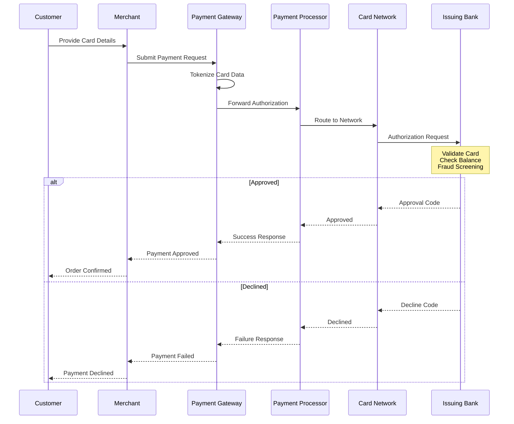
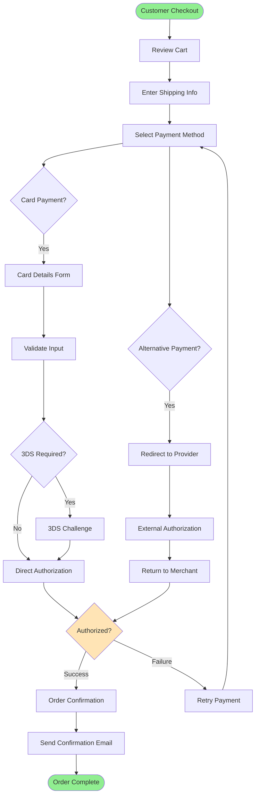
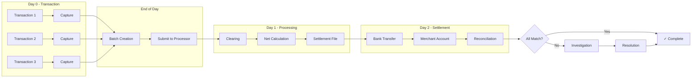
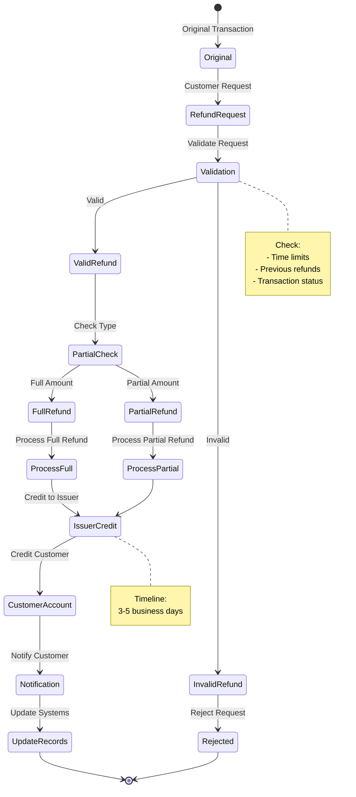
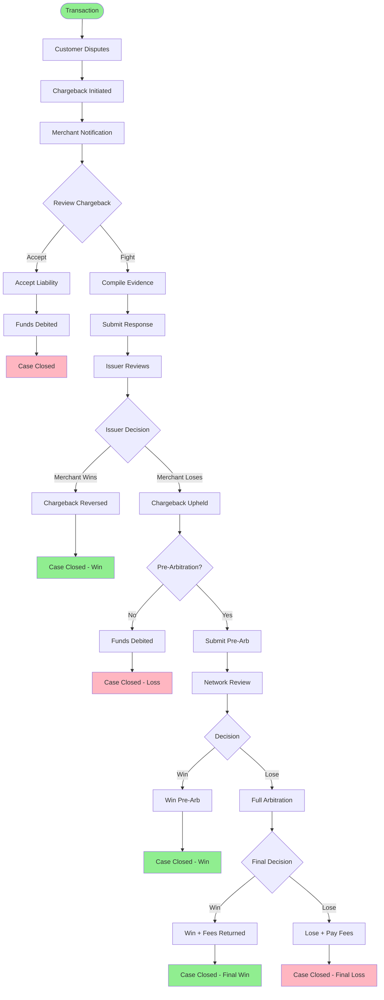
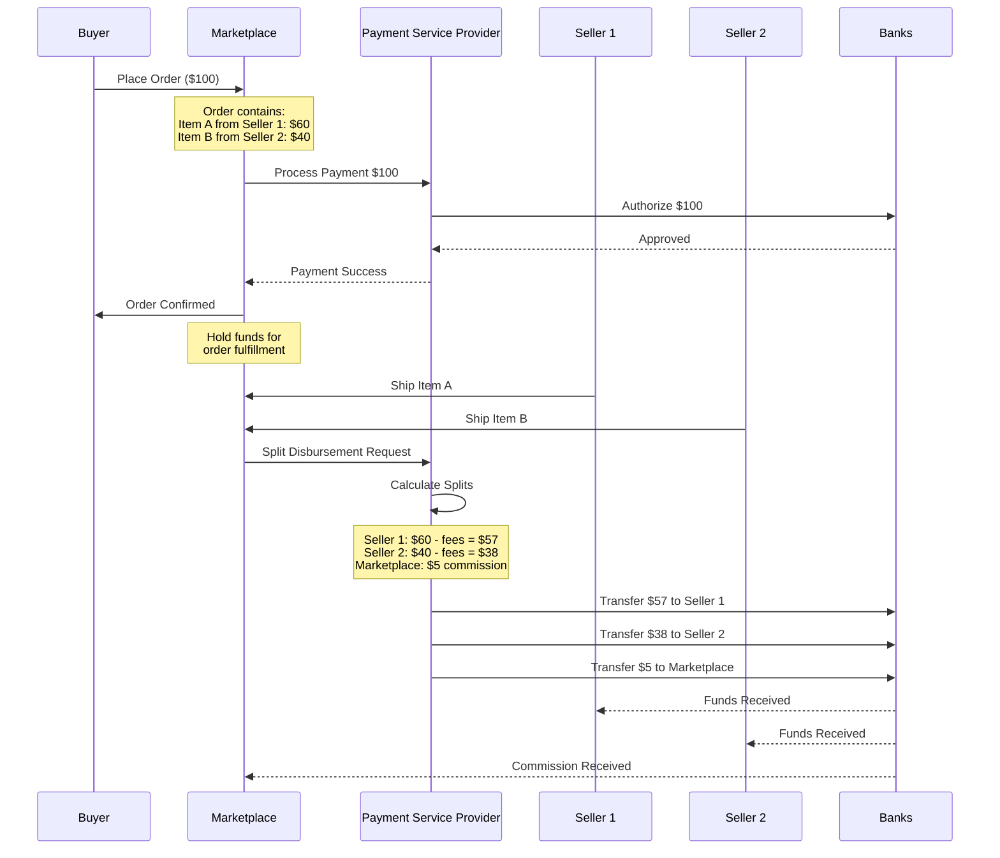
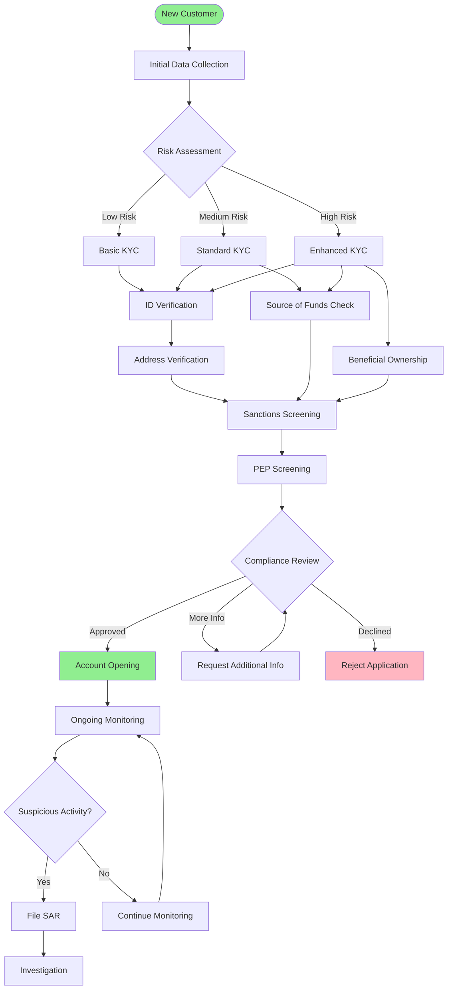
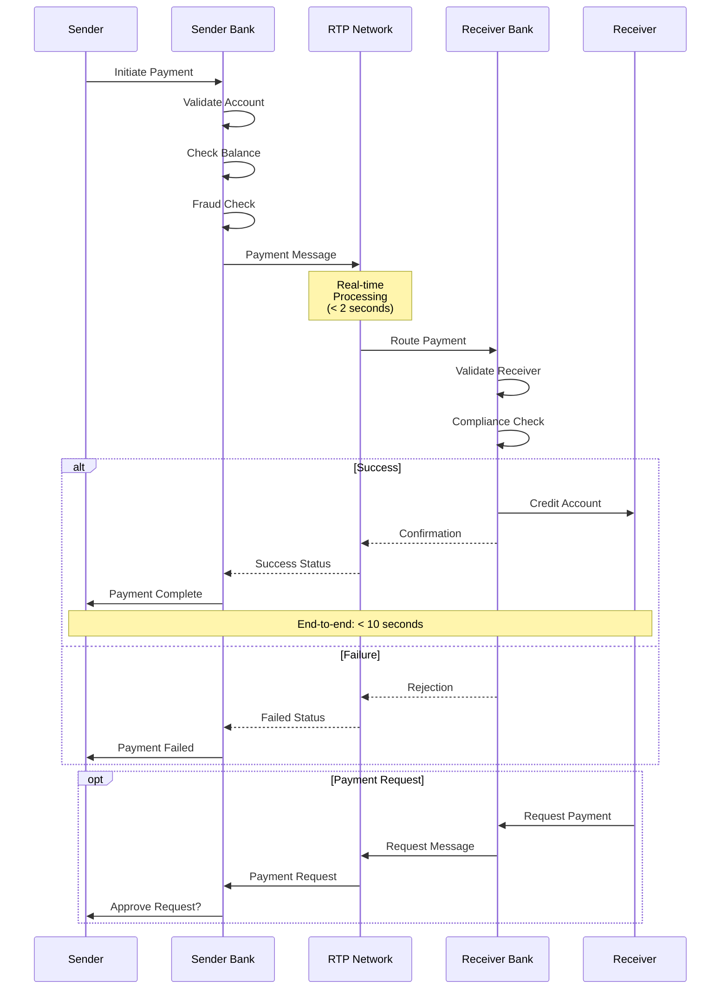
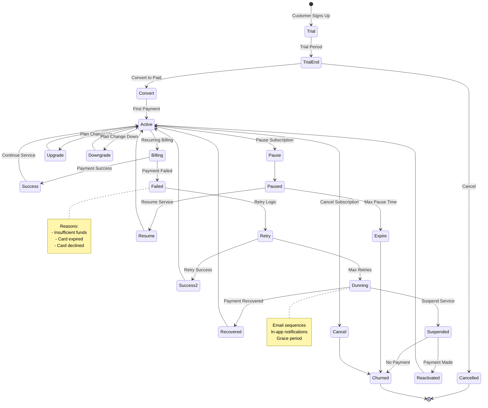
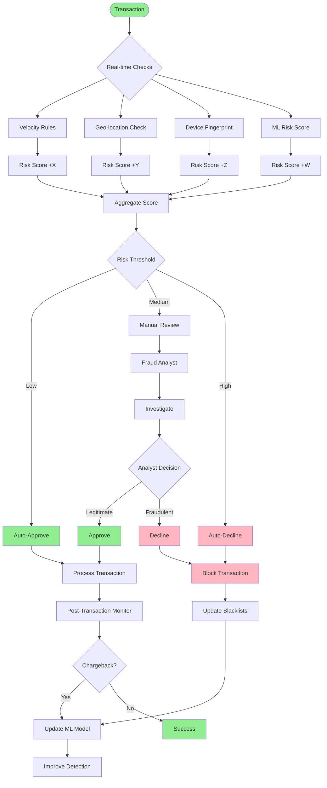

# Payment Flow Diagram Templates

## Card Payment Authorization Flow

## E-commerce Checkout Flow

## Settlement and Reconciliation Flow

## Refund Process Flow

## Chargeback Lifecycle

## Multi-Party Payment Flow (Marketplace)

## KYC/AML Workflow

## Real-time Payment Network Flow

## Subscription Billing Lifecycle

## Fraud Detection Flow

## Usage Notes

These diagram templates can be customized for specific implementations by:

1. **Adding specific system names** - Replace generic terms with actual system/vendor names
2. **Including timing information** - Add specific SLAs or processing times
3. **Adding error paths** - Include timeout, retry, and failure scenarios
4. **Incorporating business rules** - Add decision logic specific to your implementation
5. **Showing data elements** - Include specific fields or data passed between systems

To use these diagrams:
- Copy the Mermaid code into any Markdown file
- Modify the flow to match your specific process
- Add or remove steps as needed
- Use consistent color coding for status (green=success, red=failure, yellow=pending)
- Include notes for complex business logic or important details