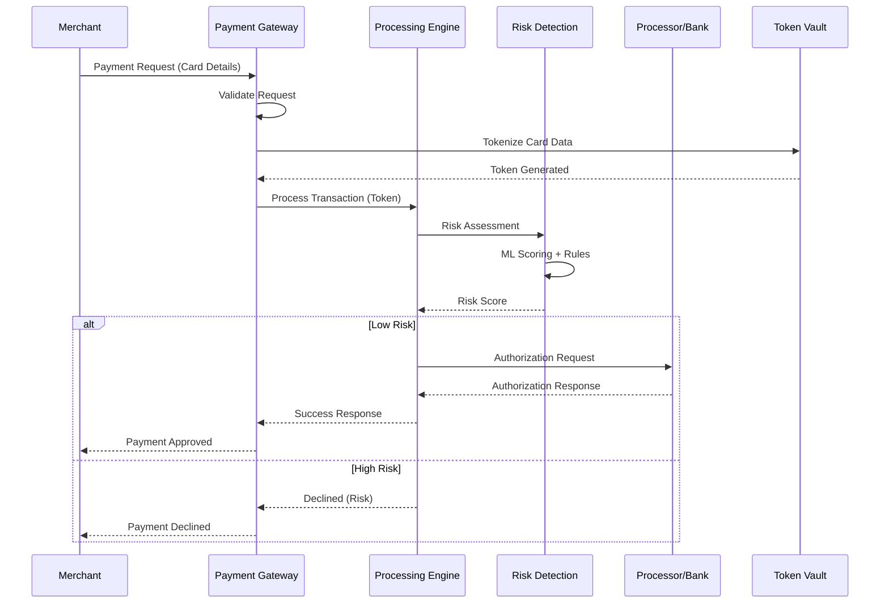
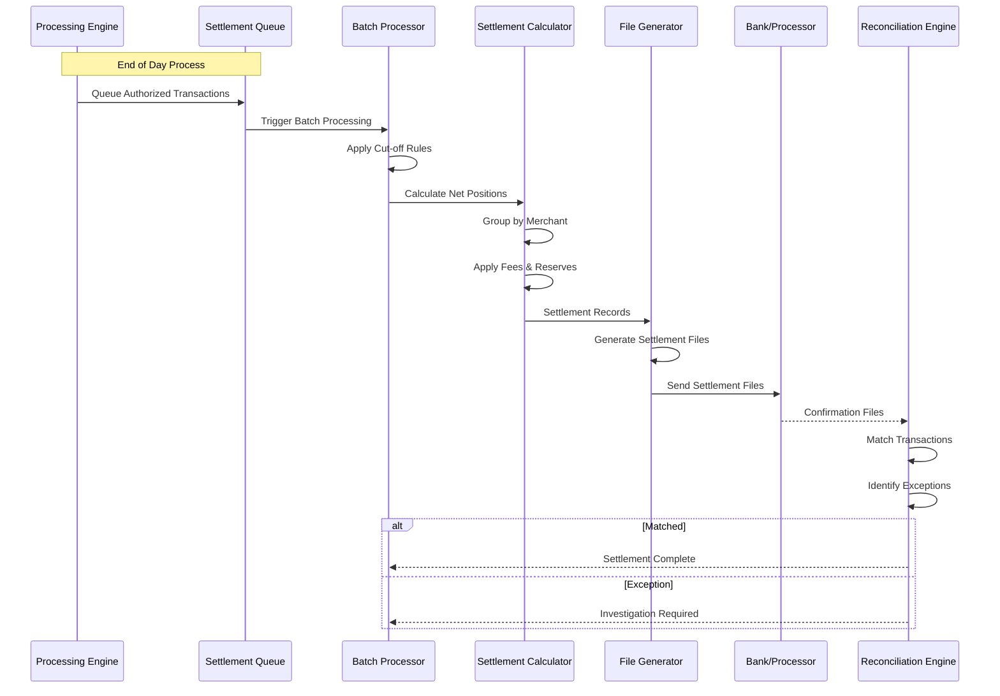
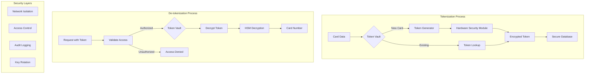
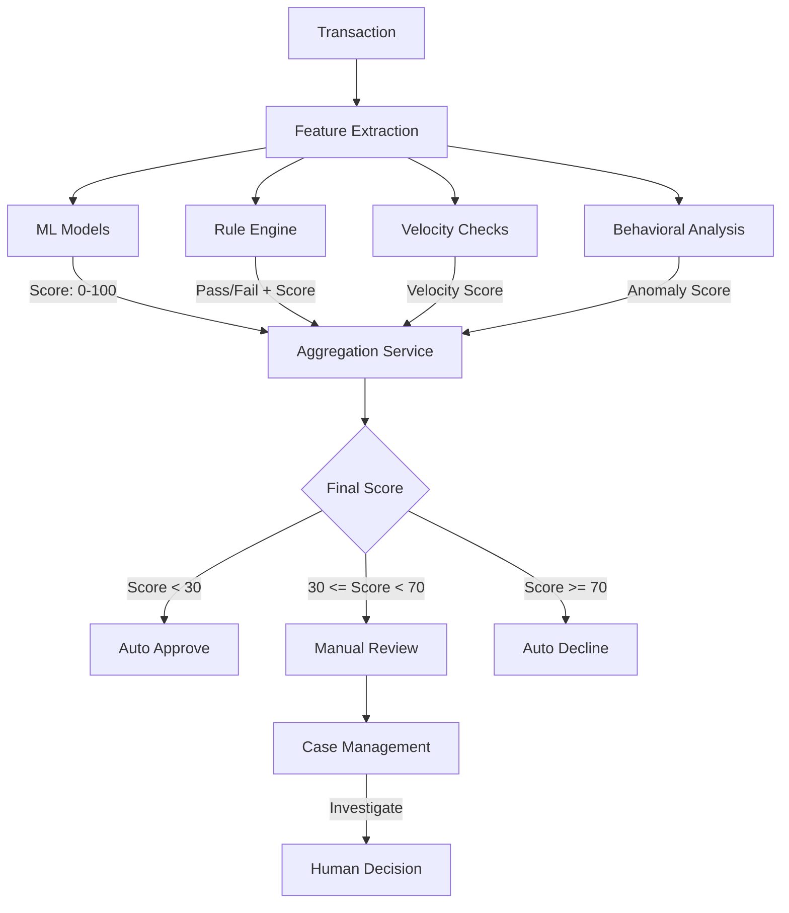
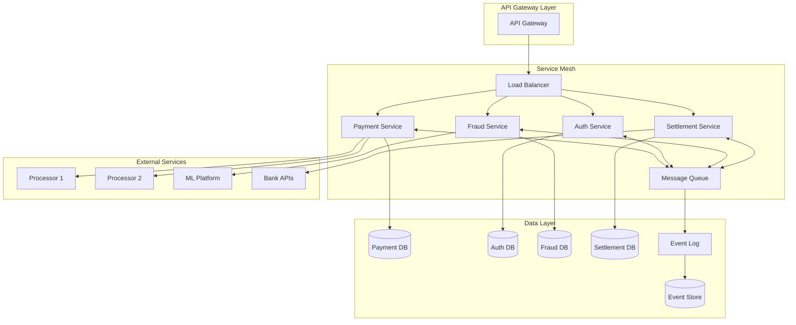
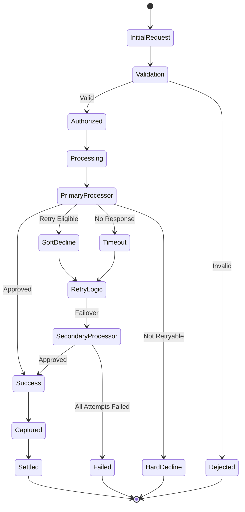
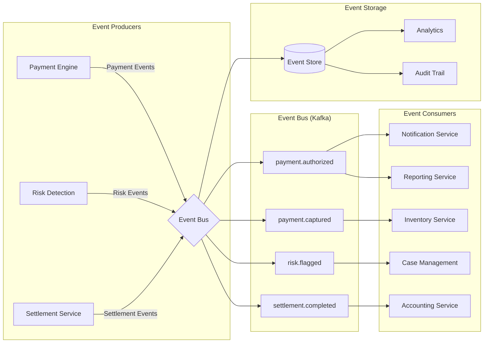
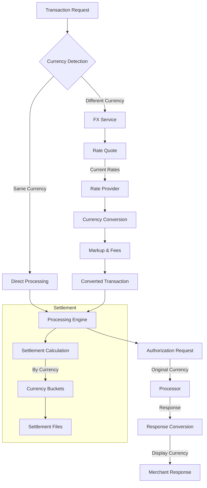
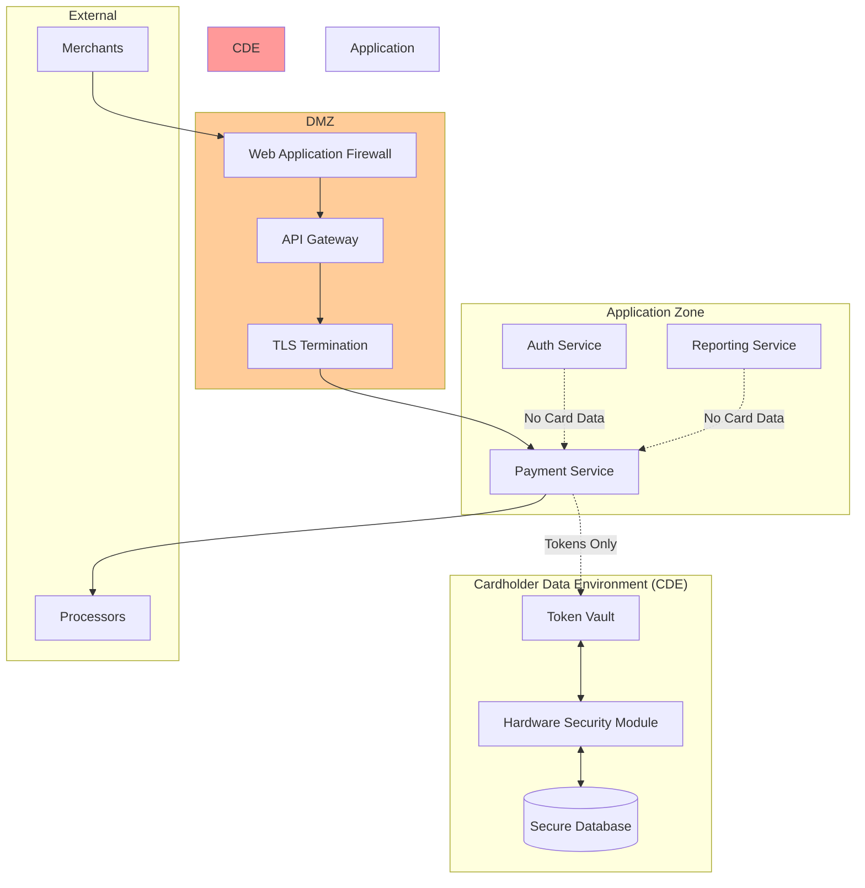
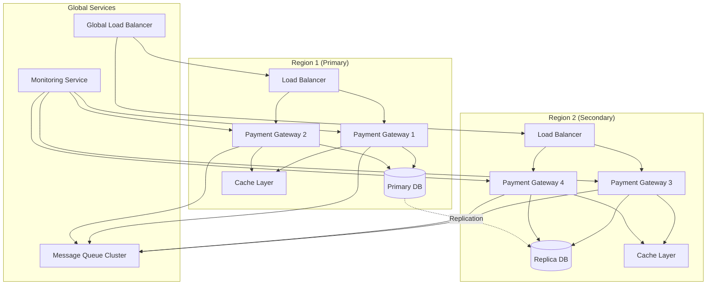

# Payment System Flow Diagrams

## 1. Standard Payment Authorization Flow

## 2. Settlement and Reconciliation Flow

## 3. Tokenization and Security Flow

## 4. Fraud Detection Decision Flow

## 5. Microservices Communication Flow

## 6. Payment Retry and Failover Flow

## 7. Event-Driven Architecture Flow

## 8. Multi-Currency Processing Flow

## 9. PCI Compliance Architecture

## 10. High Availability Architecture

## Usage Notes

These diagrams illustrate the key architectural flows in a modern payment system:

1. **Authorization Flow**: Shows the real-time payment processing path
2. **Settlement Flow**: Demonstrates end-of-day batch processing
3. **Tokenization**: Illustrates security token management
4. **Fraud Detection**: Details the risk assessment decision tree
5. **Microservices**: Shows service communication patterns
6. **Retry Logic**: Demonstrates failover and retry strategies
7. **Event Architecture**: Illustrates event-driven patterns
8. **Multi-Currency**: Shows FX handling flows
9. **PCI Compliance**: Demonstrates secure architecture zones
10. **High Availability**: Shows redundancy and failover design

Each diagram can be rendered using Mermaid-compatible tools or documentation platforms.