# 💳 Payment Process Flows Analysis

**Agent**: ProcessAnalyst (Hive Mind Swarm)  
**Date**: 2025-08-01  
**Analysis Focus**: Comprehensive payment process mapping and workflow optimization

## Executive Summary

As the ProcessAnalyst agent in the Hive Mind swarm, I have mapped and analyzed the core payment processes across the industry. This analysis covers transaction flows, timing, risk checkpoints, compliance requirements, and fee structures for all major payment types.

## 🎯 Core Payment Process Categories

### 1. Card-Present Transactions (POS, NFC)

#### A. Traditional Chip & PIN Flow

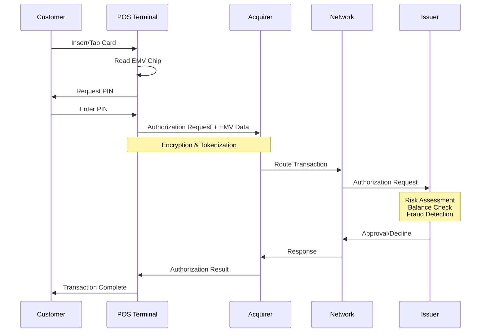

**Timing**: 2-5 seconds total
**Settlement**: T+1 to T+2
**Risk Checkpoints**:
- EMV chip validation
- PIN verification
- Real-time fraud scoring
- Velocity checks

**Fee Structure**:
- Interchange: 0.05% + $0.21 (regulated debit)
- Network fees: $0.0195 per transaction
- Acquirer markup: 0.10-0.50%

#### B. Contactless NFC Flow

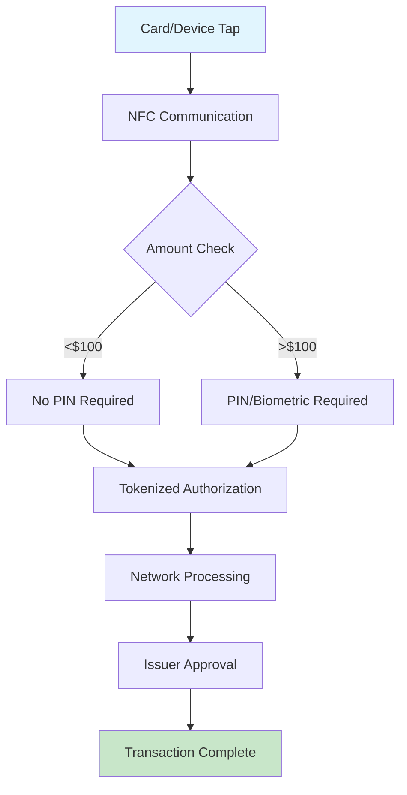

**Timing**: 0.5-2 seconds
**Unique Features**:
- Dynamic cryptogram generation
- Transaction-specific tokens
- Offline capability for small amounts

### 2. Card-Not-Present (E-commerce, Mobile)

#### A. Standard E-commerce Flow

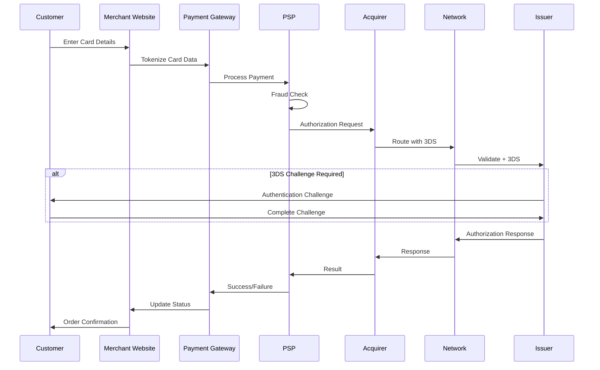

**Timing**: 5-30 seconds (with 3DS)
**Settlement**: T+1 to T+3
**Risk Checkpoints**:
- AVS verification
- CVV validation
- 3D Secure authentication
- Behavioral analytics
- Device fingerprinting

**Fee Structure**:
- Interchange: 1.80% + $0.10 (standard)
- 3DS fees: $0.02-0.05 per transaction
- Gateway fees: $0.10-0.25 + monthly
- PSP markup: 0.30-1.00%

#### B. Mobile In-App Payments

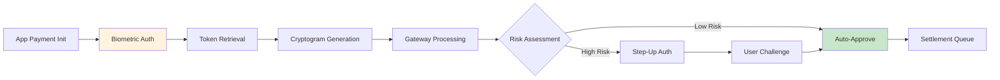

**Unique Considerations**:
- Platform fees (Apple/Google): 30% for digital goods
- Stored credentials regulations
- In-app purchase guidelines

### 3. ACH Transfers and Direct Deposits

#### A. ACH Credit (Push) Flow

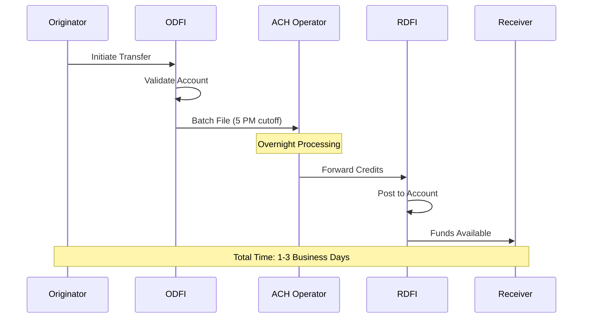

**Timing**: 
- Same-day ACH: 3-5 hours
- Next-day ACH: 1 business day
- Standard ACH: 2-3 business days

**Fee Structure**:
- Origination: $0.20-1.00
- Same-day premium: $0.25-1.00
- Return fees: $2.00-5.00

#### B. ACH Debit (Pull) Flow

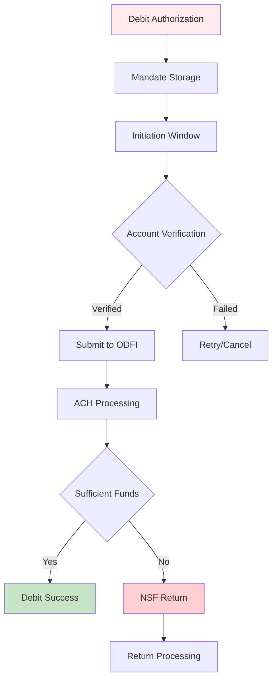

**Risk Controls**:
- Pre-notification requirements
- Authorization retention
- Return rate monitoring
- Velocity limits

### 4. Wire Transfers (Domestic/International)

#### A. Domestic Wire Flow

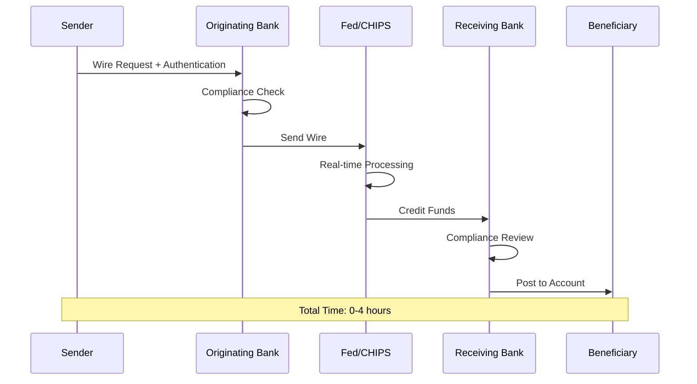

**Timing**: 
- Fedwire: Real-time to 2 hours
- CHIPS: End-of-day settlement
- Cutoff times: Typically 5 PM ET

**Fees**:
- Outgoing: $15-50
- Incoming: $10-25
- International: $35-100

#### B. International Wire (SWIFT) Flow

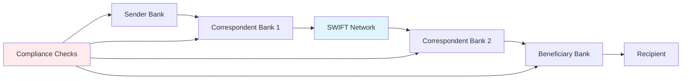

**Additional Complexities**:
- Currency conversion
- Correspondent banking fees
- Sanctions screening
- OFAC compliance
- FATF requirements

### 5. Digital Wallet Transactions

#### A. Wallet-to-Merchant Flow

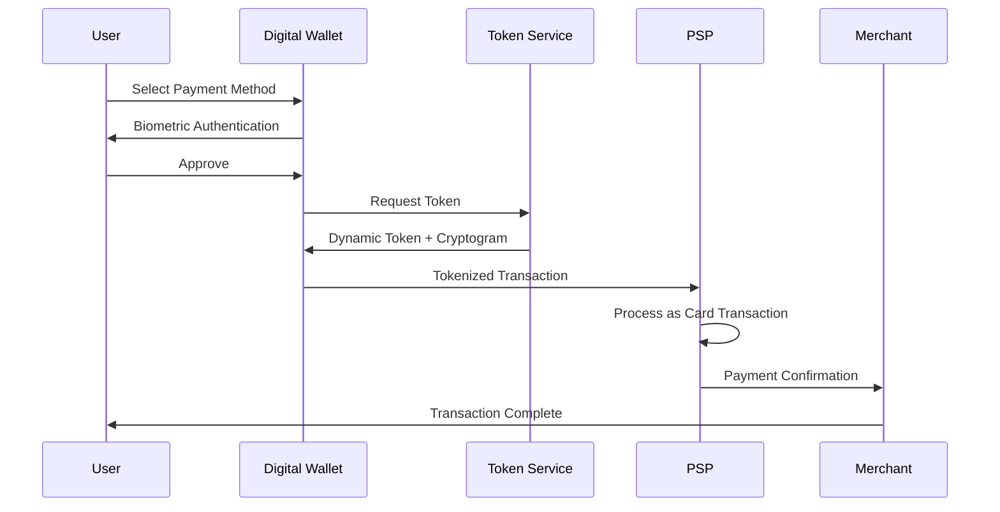

**Key Features**:
- Token lifecycle management
- Multi-factor authentication
- Cross-platform compatibility
- Loyalty integration

#### B. Wallet-to-Wallet (P2P) Flow

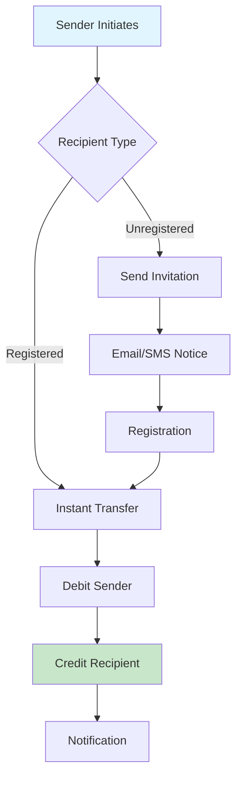

**Settlement Models**:
- Instant: Real-time via debit rails
- Standard: ACH batch processing
- Card-funded: Higher fees, instant

### 6. P2P Payment Workflows

#### Popular P2P Platforms Flow Comparison

| Platform | Funding Source | Speed | Fee Structure | Settlement |
|----------|---------------|--------|---------------|------------|
| Venmo | Bank/Card/Balance | Instant/1-3 days | 1.75% instant, free standard | ACH/Debit |
| Zelle | Bank Account | Minutes | Free | Direct bank |
| PayPal | Multiple | Instant/1-3 days | 2.9% + $0.30 | Various |
| Cash App | Bank/Card | Instant/1-3 days | 1.5% instant | ACH/Debit |

### 7. B2B Payment Workflows

#### A. Electronic Invoice Presentment and Payment (EIPP)

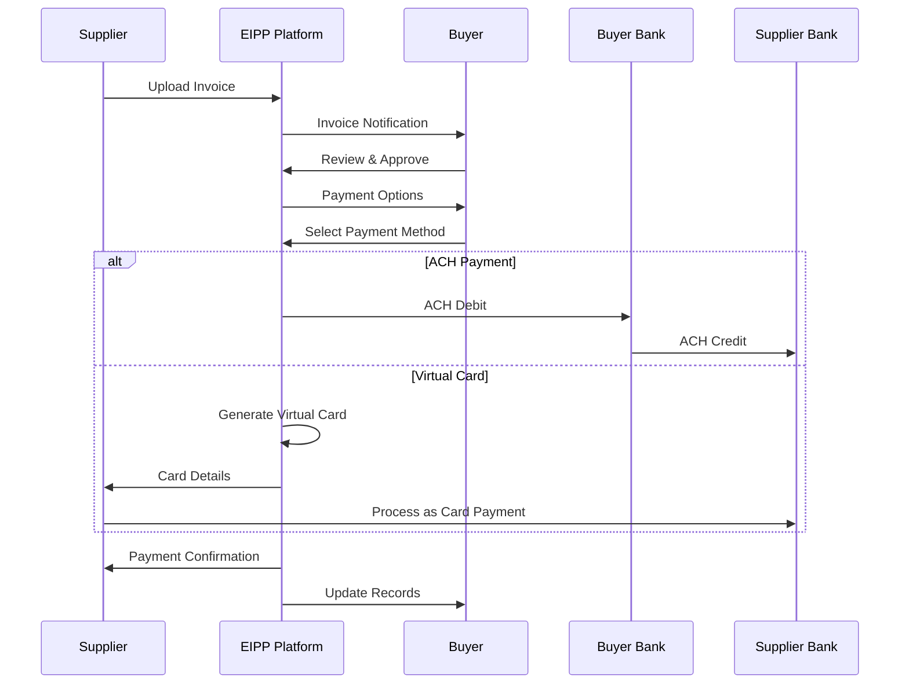

#### B. Supply Chain Financing Flow

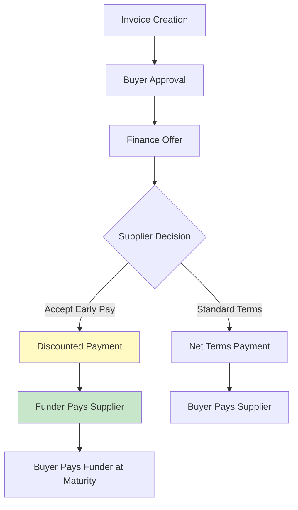

**Benefits**:
- Improved cash flow
- Reduced DSO
- Supply chain stability

### 8. Cross-Border Payments

#### A. Traditional Correspondent Banking

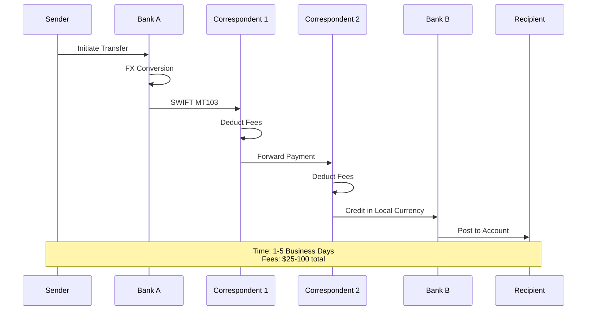

#### B. Modern Cross-Border Solutions

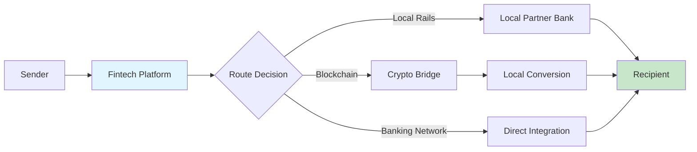

**Advantages**:
- Transparent fees
- Better FX rates
- Faster processing
- Real-time tracking

## 📊 Process Timing Comparison

| Payment Type | Processing Time | Settlement Time | Availability |
|--------------|----------------|-----------------|--------------|
| Card Present | 2-5 seconds | T+1 to T+2 | 24/7 |
| E-commerce | 5-30 seconds | T+1 to T+3 | 24/7 |
| ACH Standard | 1-3 days | 1-3 days | Business days |
| ACH Same-Day | 3-5 hours | Same day | Business days |
| Wire Domestic | 0-4 hours | Real-time | Business hours |
| Wire International | 1-5 days | 1-5 days | Business hours |
| P2P Instant | Seconds | Minutes | 24/7 |
| Digital Wallet | 1-5 seconds | Varies | 24/7 |

## 🔒 Risk Checkpoints by Process

### Universal Risk Controls
1. **Identity Verification**
   - KYC at onboarding
   - Transaction authentication
   - Periodic re-verification

2. **Transaction Monitoring**
   - Real-time fraud scoring
   - Pattern analysis
   - Velocity checks
   - Geo-location verification

3. **Compliance Screening**
   - Sanctions lists
   - PEP databases
   - Adverse media
   - OFAC compliance

### Process-Specific Controls

#### Card Transactions
- EMV chip validation
- 3D Secure authentication
- AVS/CVV verification
- BIN-based rules
- Merchant category restrictions

#### ACH Transactions
- Account verification (micro-deposits/API)
- Return rate monitoring
- NACHA compliance
- Same-day limits
- Debit authorization management

#### Wire Transfers
- Enhanced due diligence
- Purpose of payment
- Source of funds
- Beneficiary verification
- SWIFT sanctions screening

## 💰 Fee Structure Analysis

### Interchange Fee Breakdown

```
Total Merchant Fee = Interchange + Network Fees + Processor Markup

Example Transaction: $100 purchase
- Interchange: $1.80 (1.80%)
- Network Fee: $0.13 (0.13%)
- Processor: $0.30 (0.30%)
- Total: $2.23 (2.23%)
```

### Fee Optimization Strategies

1. **For Merchants**
   - Level 3 data submission
   - Debit routing optimization
   - Alternative payment methods
   - Direct bank connections

2. **For Financial Institutions**
   - Tiered pricing models
   - Volume-based discounts
   - Value-added services
   - Cross-sell opportunities

## 🚀 Process Optimization Opportunities

### 1. Automation Potential
- **High**: Reconciliation, reporting, compliance screening
- **Medium**: Dispute management, risk assessment
- **Low**: Complex investigations, relationship management

### 2. Technology Enhancements
- **API-First Design**: Real-time integration capabilities
- **ML/AI Integration**: Predictive fraud, smart routing
- **Blockchain**: Cross-border settlement, transparency
- **Open Banking**: Account-to-account payments

### 3. User Experience Improvements
- **Unified Dashboards**: Single view of all payment types
- **Predictive Analytics**: Cash flow forecasting
- **Smart Recommendations**: Optimal payment method selection
- **Real-Time Notifications**: Enhanced transparency

## 📈 Future State Process Flows

### Emerging Payment Rails

1. **Central Bank Digital Currencies (CBDCs)**
   - Programmable money
   - Instant settlement
   - Direct central bank accounts

2. **Request to Pay (RtP)**
   - Payer-initiated flows
   - Rich data exchange
   - Flexible payment terms

3. **Embedded Finance Flows**
   - Invisible payments
   - Context-aware authorization
   - Automated reconciliation

### Process Convergence Trends

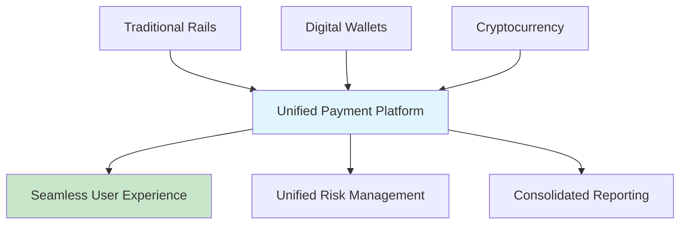

## ✅ Key Recommendations

### For Payment Processors
1. **Invest in real-time capabilities** across all payment types
2. **Standardize API interfaces** for easier integration
3. **Implement intelligent routing** for cost optimization
4. **Enhance data analytics** for actionable insights

### For Financial Institutions
1. **Modernize legacy systems** to support new payment types
2. **Develop omnichannel strategies** for consistent experience
3. **Focus on interoperability** with emerging networks
4. **Strengthen compliance automation** for efficiency

### For Merchants
1. **Diversify payment acceptance** to meet customer preferences
2. **Optimize checkout flows** to reduce abandonment
3. **Implement smart retry logic** for failed transactions
4. **Leverage data insights** for business intelligence

---

**Analysis Completed By**: ProcessAnalyst Agent  
**Hive Mind Swarm ID**: swarm-1754069383858-e2khdscig  
**Coordination**: Integrated with researcher and market analyst findings