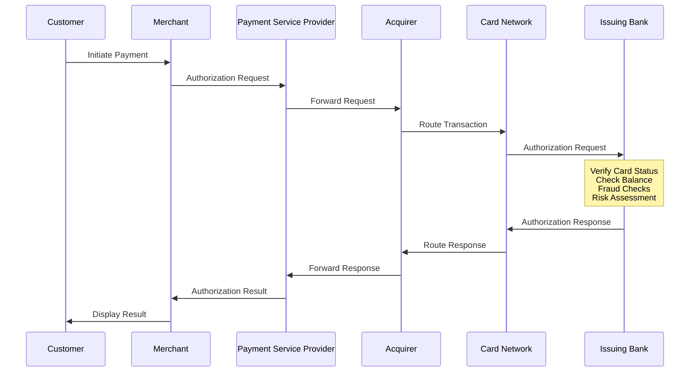
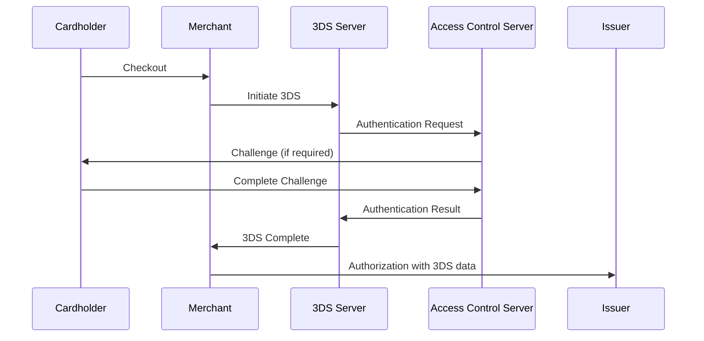

# Payment Authorization Flows

## Overview
Authorization is the critical first step in payment processing where the cardholder's bank verifies that funds are available and approves or declines the transaction. This document details the various authorization flows and their technical implementations.

## Core Authorization Flow

### Standard Authorization Process



### Key Components

#### 1. Authorization Request Message
```json
{
  "transactionId": "TXN-123456789",
  "merchantId": "MERCH-001",
  "amount": {
    "value": 150.00,
    "currency": "USD"
  },
  "card": {
    "number": "4111111111111111",
    "expiryMonth": "12",
    "expiryYear": "2025",
    "cvv": "123"
  },
  "billingAddress": {
    "street": "123 Main St",
    "city": "New York",
    "state": "NY",
    "postalCode": "10001",
    "country": "US"
  },
  "merchantData": {
    "descriptor": "ACME Store Online",
    "mcc": "5411",
    "postalCode": "10001"
  }
}
```

#### 2. Authorization Response Codes
- **00** - Approved
- **05** - Do not honor
- **14** - Invalid card number
- **51** - Insufficient funds
- **54** - Expired card
- **61** - Exceeds withdrawal limit
- **65** - Exceeds withdrawal frequency
- **78** - No account
- **N7** - CVV2 mismatch

## Authorization Types

### 1. Standard Authorization
**Use Case**: Regular purchase transactions
**Characteristics**:
- Real-time processing
- Immediate fund hold
- Standard expiry (7-30 days)

**Flow**:
1. Customer provides payment details
2. Merchant submits authorization
3. Issuer approves/declines
4. Funds held if approved
5. Capture required to complete

### 2. Pre-Authorization
**Use Case**: Hotels, car rentals, gas stations
**Characteristics**:
- Extended hold period
- Amount may be adjusted
- Final amount can differ

**Flow**:
1. Initial authorization for estimated amount
2. Hold placed on funds
3. Service provided
4. Final authorization for actual amount
5. Original auth reversed if different

### 3. Incremental Authorization
**Use Case**: Extended stays, additional services
**Characteristics**:
- Builds on existing authorization
- Multiple increments allowed
- Running total maintained

**Example Flow**:
```
Initial Auth: $200 (2-night hotel stay)
Increment 1: $50 (minibar charges)
Increment 2: $30 (parking fee)
Increment 3: $100 (extra night)
Final Amount: $380
```

### 4. Zero-Dollar Authorization
**Use Case**: Card verification, subscription setup
**Characteristics**:
- Validates card without fund hold
- Used for account verification
- Common in recurring billing setup

**Process**:
1. $0.00 authorization request
2. Full card validation performed
3. No funds held
4. Card details stored if approved
5. Future charges use stored credentials

### 5. Partial Authorization
**Use Case**: Gift cards, prepaid cards
**Characteristics**:
- Approves available amount
- Merchant decides acceptance
- Split tender possible

**Scenario**:
```
Requested: $100
Available: $75
Response: Partial approval for $75
Merchant: Accept $75 + request additional payment method
```

## Advanced Authorization Patterns

### 1. 3D Secure (3DS) Flow
**Purpose**: Additional authentication for online transactions



### 2. Network Tokenization
**Purpose**: Replace card numbers with secure tokens

**Benefits**:
- Reduced PCI scope
- Automatic card updates
- Enhanced security
- Better approval rates

**Token Format**:
```json
{
  "token": "4111119999991111",
  "cryptogram": "AjkYGDFH3548dHJkNM==",
  "eci": "05",
  "tokenRequestorId": "40010030273"
}
```

### 3. Account Updater Services
**Purpose**: Automatically update expired/replaced cards

**Process**:
1. Merchant submits card list
2. Networks check for updates
3. New card details returned
4. Stored credentials updated
5. Authorizations continue seamlessly

## Authorization Best Practices

### For Merchants

#### 1. Retry Logic
```javascript
const authorizationRetry = async (request, maxRetries = 3) => {
  let attempt = 0;
  const retryableCodes = ['N7', '91', '96'];
  
  while (attempt < maxRetries) {
    try {
      const response = await processAuthorization(request);
      
      if (response.approved) {
        return response;
      }
      
      if (!retryableCodes.includes(response.code)) {
        return response; // Don't retry non-retryable codes
      }
      
      attempt++;
      await delay(Math.pow(2, attempt) * 1000); // Exponential backoff
    } catch (error) {
      if (attempt === maxRetries - 1) throw error;
    }
  }
};
```

#### 2. AVS and CVV Handling
- Always send AVS data for card-not-present
- Require CVV for new customers
- Configure AVS response handling
- Monitor AVS mismatch patterns

#### 3. Authorization Management
- Set appropriate authorization amounts
- Reverse unused authorizations promptly
- Monitor authorization-to-capture ratios
- Implement velocity controls

### For PSPs

#### 1. Intelligent Routing
```python
def route_authorization(transaction):
    # Check merchant preferences
    routes = get_merchant_routes(transaction.merchant_id)
    
    # Apply routing rules
    for route in routes:
        if route.supports_currency(transaction.currency):
            if route.is_available():
                if transaction.amount > route.min_amount:
                    return route
    
    # Fallback routing
    return get_default_route(transaction)
```

#### 2. Response Enrichment
- Add human-readable decline reasons
- Include issuer contact information
- Provide retry recommendations
- Surface BIN-level insights

### For Issuers

#### 1. Risk Assessment Framework
```
Risk Score = Base Score 
  + Velocity Risk (transactions per time)
  + Location Risk (geographic anomalies)
  + Merchant Risk (MCC category scoring)
  + Amount Risk (unusual transaction size)
  + History Risk (customer pattern deviation)
```

#### 2. Real-time Decision Engine
- Sub-100ms response times
- Machine learning fraud models
- Rule engine flexibility
- Graduated authentication

## Monitoring and Analytics

### Key Metrics

#### 1. Authorization Rates
```
Approval Rate = Approved Transactions / Total Transactions
Decline Rate by Reason = Declines per Code / Total Declines
False Decline Rate = Good Transactions Declined / Total Declines
```

#### 2. Performance Metrics
- Average authorization time
- Timeout rate
- Retry success rate
- 3DS challenge rate

#### 3. Financial Metrics
- Average transaction value
- Authorization-to-capture ratio
- Reversal rate
- Chargeback rate by auth type

### Monitoring Dashboard Example
```
┌─────────────────────────────────────────────┐
│          Authorization Dashboard             │
├─────────────────────┬───────────────────────┤
│ Approval Rate       │ 94.2% ▲ 0.5%         │
│ Avg Response Time   │ 1.2s ▼ 0.1s          │
│ 3DS Success Rate    │ 97.8% ─              │
│ Timeout Rate        │ 0.3% ▼ 0.1%          │
├─────────────────────┴───────────────────────┤
│ Top Decline Reasons:                        │
│ 1. Insufficient Funds (51) - 42%           │
│ 2. Do Not Honor (05) - 28%                 │
│ 3. Expired Card (54) - 15%                 │
│ 4. Invalid CVV (N7) - 10%                  │
│ 5. Other - 5%                              │
└─────────────────────────────────────────────┘
```

## Compliance Considerations

### PCI DSS Requirements
- Never store CVV after authorization
- Encrypt card data in transit
- Tokenize stored card numbers
- Implement access controls
- Monitor all access to card data

### Regional Regulations
- **EU**: Strong Customer Authentication (SCA)
- **US**: Address Verification Service (AVS)
- **Australia**: Least-cost routing requirements
- **Brazil**: Local acquirer requirements
- **India**: Additional factor authentication

## Future Trends

### 1. Biometric Authorization
- Fingerprint confirmation
- Face recognition
- Voice authentication
- Behavioral biometrics

### 2. Context-Aware Authorization
- Device fingerprinting
- Location intelligence
- Transaction patterns
- Network analysis

### 3. Instant Authorization
- Real-time risk scoring
- ML-driven decisions
- Predictive authorization
- Quantum-resistant cryptography