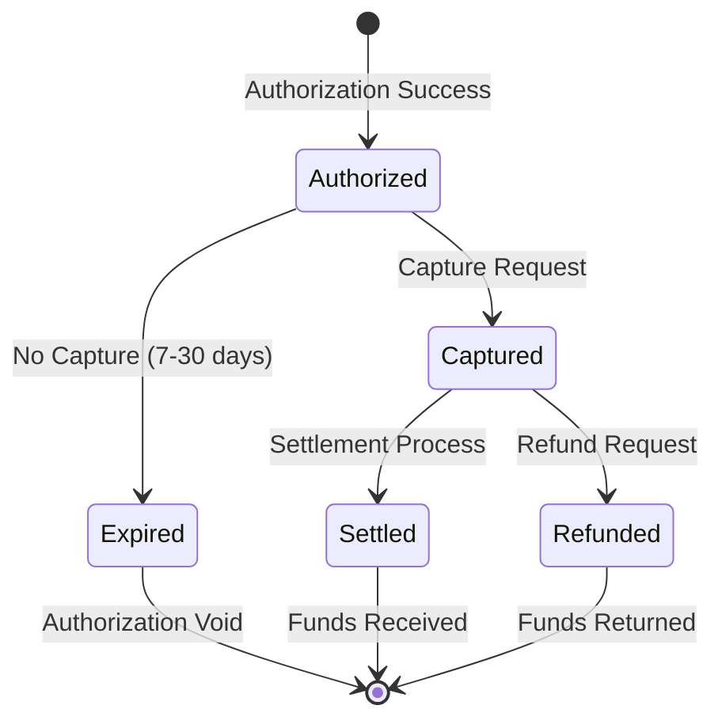
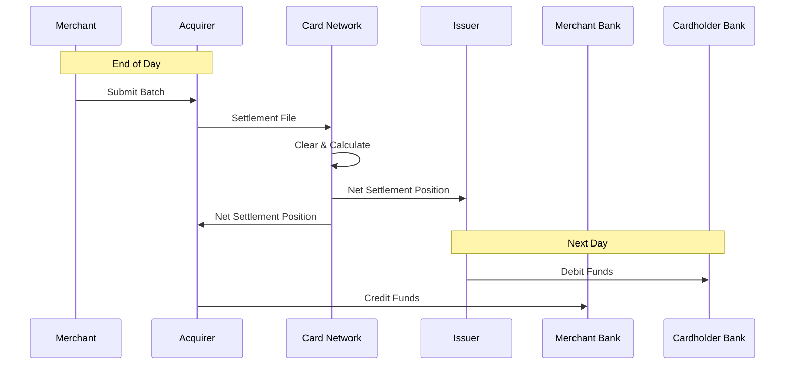

# Capture and Settlement Process Documentation

## Overview
Capture and settlement are the final steps in payment processing where authorized transactions are finalized and funds are transferred between financial institutions. This document details the technical and operational aspects of these critical processes.

## Capture Process

### What is Capture?
Capture is the process of finalizing an authorized transaction and initiating the transfer of funds from the cardholder's account to the merchant's account.



### Capture Types

#### 1. Immediate Capture (Sale)
**Use Case**: Digital goods, immediate services
**Characteristics**:
- Combined auth + capture
- Single API call
- Immediate settlement queue
- Lower processing cost

**API Example**:
```json
{
  "type": "sale",
  "amount": 99.99,
  "currency": "USD",
  "capture": true,
  "reference": "ORD-12345"
}
```

#### 2. Delayed Capture
**Use Case**: Physical goods, shipping required
**Characteristics**:
- Separate auth and capture
- Flexible timing
- Inventory protection
- Shipping coordination

**Workflow**:
```
Day 0: Authorization → Hold funds
Day 1: Order processing → Verify inventory
Day 2: Shipping → Capture payment
Day 3: Settlement → Receive funds
```

#### 3. Partial Capture
**Use Case**: Partial shipments, backorders
**Characteristics**:
- Capture less than authorized
- Multiple captures possible
- Automatic auth adjustment
- Complex reconciliation

**Scenario Example**:
```
Authorization: $300 for 3 items
Capture 1: $100 (Item 1 ships)
Capture 2: $100 (Item 2 ships)
Item 3: Out of stock
Final: $200 captured, $100 released
```

#### 4. Multi-Capture
**Use Case**: Subscriptions, installments
**Characteristics**:
- Single auth, multiple captures
- Scheduled captures
- Regulatory limits apply
- Special merchant category

**Implementation**:
```javascript
const multiCapture = async (authId, schedule) => {
  for (const payment of schedule) {
    await scheduledTask(payment.date, async () => {
      await capture({
        authorizationId: authId,
        amount: payment.amount,
        reference: `INSTALLMENT-${payment.number}`
      });
    });
  }
};
```

### Capture Best Practices

#### 1. Timing Strategies
```python
def determine_capture_timing(order):
    if order.type == "digital":
        return "immediate"
    elif order.type == "physical":
        if order.inventory_confirmed:
            return "on_shipping"
        else:
            return "on_inventory_confirmation"
    elif order.type == "preorder":
        return "on_availability"
    else:
        return "manual_review"
```

#### 2. Error Handling
- **Capture Failures**: Retry with exponential backoff
- **Partial Success**: Track captured amounts
- **Timeout Handling**: Implement status checks
- **Duplicate Prevention**: Use idempotency keys

#### 3. Authorization Management
- Monitor auth expiry dates
- Set calendar reminders for long holds
- Implement auto-capture for expiring auths
- Track auth-to-capture conversion rates

## Settlement Process

### Settlement Overview
Settlement is the process where captured transactions are batched, processed, and funds are transferred between banks.



### Settlement Models

#### 1. Gross Settlement
**Characteristics**:
- Each transaction settled individually
- Real-time or near real-time
- Higher processing costs
- Better cash flow visibility

**Use Cases**:
- High-value transactions
- Real-time payment systems
- Cross-border transfers

#### 2. Net Settlement
**Characteristics**:
- Transactions netted by party
- Daily settlement cycles
- Lower processing costs
- Standard industry practice

**Calculation Example**:
```
Merchant A Transactions:
- Sales: $10,000
- Refunds: $500
- Fees: $300
Net Settlement: $9,200

Network Calculation:
- Total Due to Merchant: $9,200
- Total Due from Issuer: $9,500
- Network Fee: $300
```

#### 3. Split Settlement
**Characteristics**:
- Funds split between parties
- Platform/marketplace model
- Complex reconciliation
- Regulatory considerations

**Distribution Example**:
```json
{
  "total_amount": 100.00,
  "splits": [
    {
      "recipient": "platform",
      "amount": 15.00,
      "type": "platform_fee"
    },
    {
      "recipient": "merchant",
      "amount": 85.00,
      "type": "merchant_revenue"
    }
  ]
}
```

### Settlement Timelines

#### T+0 (Same Day)
- **Markets**: Some domestic markets
- **Requirements**: Advanced infrastructure
- **Benefits**: Immediate cash flow
- **Challenges**: Operational complexity

#### T+1 (Next Day)
- **Markets**: US (standard), EU
- **Requirements**: Efficient processing
- **Benefits**: Quick funds access
- **Challenges**: Fraud risk management

#### T+2 to T+3
- **Markets**: International, high-risk
- **Requirements**: Standard processing
- **Benefits**: Risk mitigation
- **Challenges**: Cash flow delays

### Settlement Files

#### 1. File Formats
**Common Standards**:
- ISO 8583 for card transactions
- ISO 20022 for SEPA/SWIFT
- NACHA for ACH transfers
- Proprietary formats per network

**Sample Settlement File Structure**:
```
HDR|20240315|MERCH001|SETTL|1.0
TXN|001|AUTH123|SALE|99.99|USD|20240314120000
TXN|002|AUTH124|SALE|150.00|USD|20240314130000
TXN|003|AUTH125|REFUND|-50.00|USD|20240314140000
FEE|001|INTERCHANGE|-2.50|USD
FEE|002|ASSESSMENT|-0.15|USD
TRL|3|199.99|-52.65|147.34
```

#### 2. Reconciliation Format
```csv
transaction_id,auth_code,amount,fee,net,status,settled_date
TXN-001,AUTH123,99.99,2.50,97.49,SETTLED,2024-03-15
TXN-002,AUTH124,150.00,3.75,146.25,SETTLED,2024-03-15
TXN-003,AUTH125,-50.00,-1.25,-48.75,SETTLED,2024-03-15
```

### Settlement Reconciliation

#### 1. Three-Way Matching
```python
def reconcile_settlement(merchant_records, acquirer_file, bank_statement):
    discrepancies = []
    
    for transaction in merchant_records:
        acquirer_match = find_in_acquirer(transaction, acquirer_file)
        bank_match = find_in_bank(transaction, bank_statement)
        
        if not acquirer_match:
            discrepancies.append({
                'type': 'missing_from_acquirer',
                'transaction': transaction
            })
        elif not bank_match:
            discrepancies.append({
                'type': 'missing_from_bank',
                'transaction': transaction
            })
        elif not amounts_match(transaction, acquirer_match, bank_match):
            discrepancies.append({
                'type': 'amount_mismatch',
                'transaction': transaction,
                'details': {
                    'merchant': transaction.amount,
                    'acquirer': acquirer_match.amount,
                    'bank': bank_match.amount
                }
            })
    
    return discrepancies
```

#### 2. Automated Reconciliation Rules
- **Tolerance Levels**: ±$0.01 for rounding
- **Timing Windows**: ±24 hours for settlement
- **Batch Matching**: Group by settlement date
- **Exception Handling**: Flag for manual review

### Fee Calculation

#### 1. Interchange Fees
**Calculation Factors**:
- Card type (debit/credit/corporate)
- Transaction type (CP/CNP)
- Merchant category (MCC)
- Transaction amount
- Market regulations

**Example Structure**:
```
Base Rate: 1.80%
Card Present Discount: -0.30%
Qualified Rate: 1.50%
Transaction Fee: $0.10
Total for $100: $1.60
```

#### 2. Assessment Fees
**Network Fees**:
- Visa: ~0.14% 
- Mastercard: ~0.13%
- Amex: Bundled
- Discover: ~0.13%

#### 3. Processor Markup
**Common Models**:
- Interchange Plus: IC + 0.30% + $0.10
- Tiered Pricing: Qualified/Mid/Non rates
- Flat Rate: 2.9% + $0.30
- Subscription: Monthly fee + IC

### Settlement Optimization

#### 1. Batch Optimization
```javascript
class SettlementOptimizer {
  optimizeBatch(transactions) {
    // Group by optimal characteristics
    const groups = {
      qualified: [],
      midQualified: [],
      nonQualified: []
    };
    
    transactions.forEach(txn => {
      const qualification = this.determineQualification(txn);
      groups[qualification].push(txn);
    });
    
    // Submit qualified first for better rates
    return [
      ...groups.qualified,
      ...groups.midQualified,
      ...groups.nonQualified
    ];
  }
  
  determineQualification(txn) {
    if (txn.hasAVS && txn.hasCVV && txn.captured < 24) {
      return 'qualified';
    } else if (txn.captured < 48) {
      return 'midQualified';
    }
    return 'nonQualified';
  }
}
```

#### 2. Timing Strategies
- **Cutoff Times**: Know your processor's schedule
- **Weekend Handling**: Plan for banking holidays
- **International**: Consider timezone differences
- **Peak Periods**: Avoid month-end congestion

### Settlement Reporting

#### 1. Daily Settlement Report
```
Settlement Date: 2024-03-15
Batch ID: BATCH-789012

Summary:
- Total Sales: $50,000.00 (250 transactions)
- Total Refunds: $2,000.00 (20 transactions)
- Gross Amount: $48,000.00
- Total Fees: $1,200.00
- Net Settlement: $46,800.00

Fee Breakdown:
- Interchange: $900.00
- Assessment: $150.00
- Processor: $150.00

Settlement Status: COMPLETE
Expected Deposit: 2024-03-16 09:00 EST
```

#### 2. Exception Reports
- Failed captures
- Pending settlements
- Disputed transactions
- Fee discrepancies
- Unusual patterns

## Best Practices

### For Merchants
1. **Capture Promptly**: Within 24-48 hours
2. **Monitor Auth Expiry**: Prevent lost sales
3. **Reconcile Daily**: Catch issues early
4. **Optimize Batches**: Reduce fees
5. **Track Metrics**: Monitor performance

### For PSPs
1. **Automate Reconciliation**: Reduce manual work
2. **Provide Clear Reporting**: Transparency builds trust
3. **Offer Flexible Settlement**: Meet merchant needs
4. **Monitor Settlement Risk**: Prevent losses
5. **Optimize Network Costs**: Improve margins

### For Financial Institutions
1. **Ensure Fund Availability**: Prevent NSF
2. **Process Efficiently**: Meet SLAs
3. **Manage Risk**: Monitor exposure
4. **Comply with Regulations**: Stay current
5. **Invest in Technology**: Stay competitive

## Future Trends

### 1. Real-Time Settlement
- Instant fund availability
- 24/7/365 processing
- Reduced counterparty risk
- New business models

### 2. Blockchain Settlement
- Distributed ledger technology
- Smart contract automation
- Reduced intermediaries
- Transparent processing

### 3. API-Driven Settlement
- Real-time status updates
- Programmable settlement rules
- Dynamic fee negotiation
- Automated reconciliation