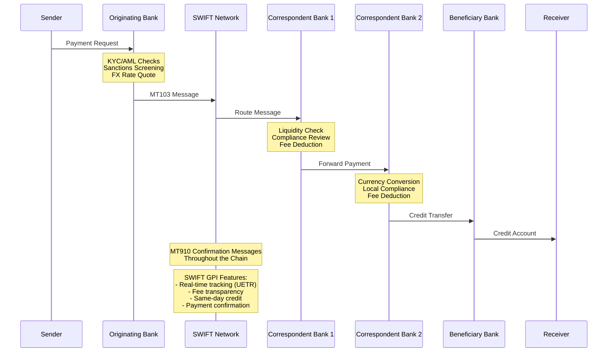
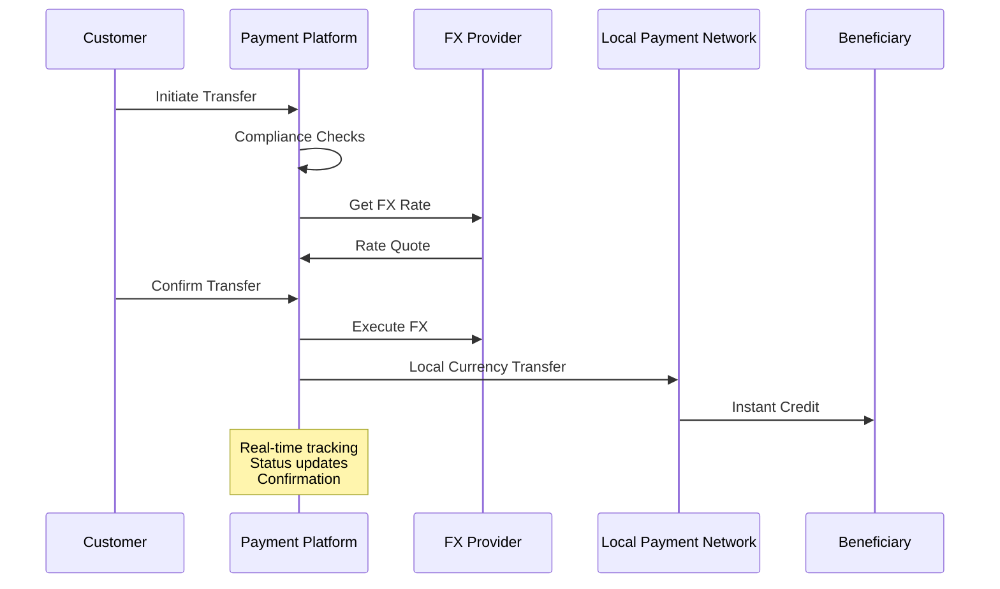
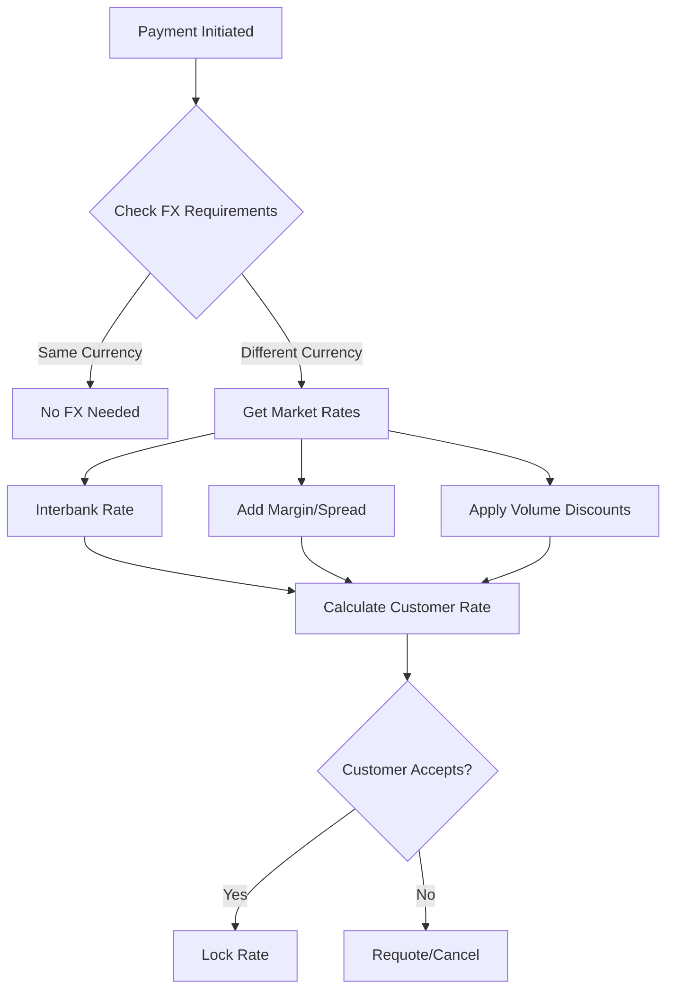
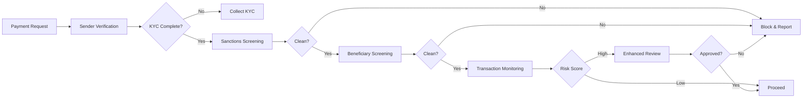
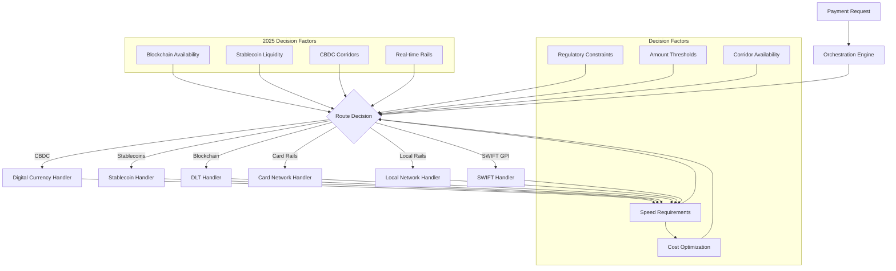
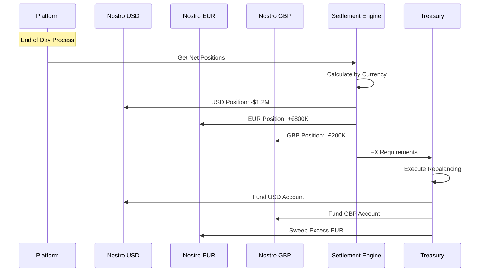
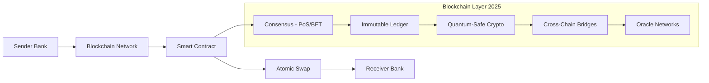

# Cross-Border Payment Processing Flows

## Overview
Cross-border payments involve transferring funds between parties in different countries, requiring currency conversion, regulatory compliance, and coordination between multiple financial institutions. This document details the complex orchestration required for international payment processing.

## Core Cross-Border Payment Flow

### SWIFT Payment Flow with GPI (Global Payment Innovation) 2025



#### SWIFT GPI Enhancements Q1 2025
```yaml
SWIFT_GPI_2025:
  Coverage:
    - Banks participating: 4,000+
    - Countries: 200+
    - Payment volume: 80% of SWIFT messages
    
  Core_Features:
    Real_Time_Tracking:
      - Unique End-to-End Transaction Reference (UETR)
      - Status updates within seconds
      - Full payment journey visibility
      - API and GUI access
      
    Fee_Transparency:
      - Upfront fee disclosure
      - No deduction from principal
      - Fee breakdown by bank
      - Predictable costs
      
    Speed_Improvements:
      - 50% credited within 30 minutes
      - 95% credited same day
      - Average time: 2.5 hours
      
  New_2025_Capabilities:
    Pre_Validation:
      - Beneficiary account verification
      - Real-time fraud checks
      - Compliance pre-screening
      - Error prevention
      
    Case_Resolution:
      - Automated investigation
      - 48-hour SLA
      - Direct bank communication
      - AI-powered suggestions
      
    Stop_and_Recall:
      - Instant payment stop
      - Automated recall process
      - Fraud case integration
      - Legal hold support
      
    Cross_Border_Instant:
      - Link to domestic instant rails
      - Sub-minute settlements
      - 24/7/365 availability
      - Initial corridors: US-UK, EU-Singapore
```

### Modern API-Based Cross-Border Flow



## Payment Corridors and Methods

### 1. Major Payment Corridors

#### US → Europe (USD → EUR)
```yaml
Corridor: US-EU
Volume: High
Methods:
  - SWIFT Wire
  - SEPA (for EUR)
  - Card Networks
  - Digital Wallets
Typical Time: 1-3 days
Costs: 
  - Banks: $25-50 + FX
  - Fintechs: 0.5-2% total
```

#### US → Asia Pacific
```yaml
Corridor: US-APAC
Volume: Very High
Methods:
  - SWIFT
  - Local ACH equivalents
  - Card rails
  - Blockchain (emerging)
Typical Time: 2-5 days
Special Considerations:
  - Capital controls (China)
  - Local partnerships required
  - Multiple time zones
```

### 2. Payment Method Selection Logic

```python
def select_payment_method(transfer):
    corridor = f"{transfer.source_country}-{transfer.dest_country}"
    
    # Check for local payment networks first
    if local_network_available(corridor):
        if transfer.amount < local_network_limit(corridor):
            return "LOCAL_NETWORK"
    
    # Real-time payments for supported corridors
    if supports_real_time(corridor) and transfer.urgency == "high":
        return "REAL_TIME_RAIL"
    
    # Card rails for small amounts
    if transfer.amount < 1000 and card_rails_supported(corridor):
        return "CARD_NETWORK"
    
    # Default to SWIFT for large or unsupported
    return "SWIFT"
```

## Currency Exchange Process

### 1. FX Rate Determination



### 2. FX Execution Models

#### a. Pre-Funded Model
```json
{
  "model": "pre_funded",
  "flow": [
    {
      "step": 1,
      "action": "Hold local currency accounts",
      "locations": ["USD in US", "EUR in EU", "GBP in UK"]
    },
    {
      "step": 2,
      "action": "Net positions periodically",
      "frequency": "daily"
    },
    {
      "step": 3,
      "action": "Execute bulk FX trades",
      "advantage": "Better rates at scale"
    }
  ]
}
```

#### b. Just-in-Time Model
```json
{
  "model": "just_in_time",
  "flow": [
    {
      "step": 1,
      "action": "Receive payment request"
    },
    {
      "step": 2,
      "action": "Execute FX trade immediately"
    },
    {
      "step": 3,
      "action": "Send converted funds",
      "advantage": "No FX risk"
    }
  ]
}
```

## Compliance and Regulatory Flow

### 1. Pre-Transaction Screening



### 2. Regulatory Reporting Requirements

```python
class RegulatoryReporting:
    def process_transaction(self, transaction):
        reports = []
        
        # US Requirements
        if transaction.involves_country("US"):
            if transaction.amount_usd >= 10000:
                reports.append(self.generate_ctr())  # Currency Transaction Report
            if self.is_suspicious(transaction):
                reports.append(self.generate_sar())  # Suspicious Activity Report
                
        # EU Requirements  
        if transaction.involves_country("EU"):
            if transaction.amount_eur >= 1000:
                reports.append(self.generate_eu_aml_report())
                
        # FATF Recommendations
        if transaction.amount_usd >= 3000:
            reports.append(self.generate_fatf_report())
            
        return reports
```

## Multi-Rail Orchestration (Enhanced 2025)

### 1. Payment Orchestration Engine



### 2. Intelligent Routing Algorithm

```javascript
class PaymentRouter {
  async routePayment(payment) {
    const routes = await this.getAvailableRoutes(payment);
    
    // Score each route
    const scoredRoutes = routes.map(route => ({
      route,
      score: this.calculateScore(route, payment)
    }));
    
    // Sort by score (highest first)
    scoredRoutes.sort((a, b) => b.score - a.score);
    
    // Try routes in order until success
    for (const {route} of scoredRoutes) {
      try {
        return await this.executeRoute(route, payment);
      } catch (error) {
        console.log(`Route ${route.name} failed, trying next`);
      }
    }
    
    throw new Error('All routes failed');
  }
  
  calculateScore(route, payment) {
    let score = 100;
    
    // Speed preference
    if (payment.priority === 'high' && route.speed === 'instant') {
      score += 50;
    }
    
    // Cost optimization
    const costRatio = route.estimatedCost / payment.amount;
    score -= costRatio * 100;
    
    // Reliability history
    score += route.successRate * 30;
    
    // Regulatory compliance
    if (route.meetsCompliance(payment)) {
      score += 20;
    }
    
    return score;
  }
}
```

## Settlement and Reconciliation

### 1. Multi-Currency Settlement



### 2. Reconciliation Challenges

```python
class CrossBorderReconciliation:
    def reconcile_daily(self, date):
        discrepancies = []
        
        # Time zone adjustments
        for corridor in self.corridors:
            local_date = self.adjust_for_timezone(date, corridor)
            
            # Get records from all sources
            platform_records = self.get_platform_records(local_date)
            bank_records = self.get_bank_records(corridor, local_date)
            swift_records = self.get_swift_confirmations(local_date)
            
            # Three-way matching with FX considerations
            for txn in platform_records:
                bank_match = self.find_bank_match(txn, bank_records)
                swift_match = self.find_swift_match(txn, swift_records)
                
                if not bank_match or not swift_match:
                    discrepancies.append({
                        'transaction': txn,
                        'issue': 'missing_confirmation',
                        'corridor': corridor
                    })
                elif not self.amounts_match_with_fx(txn, bank_match):
                    discrepancies.append({
                        'transaction': txn,
                        'issue': 'amount_mismatch',
                        'expected': txn.amount,
                        'actual': bank_match.amount
                    })
        
        return discrepancies
```

## Real-time Cross-Border Systems

### 1. Blockchain-Based Settlement (Production 2025)



#### Production Blockchain Corridors Q1 2025
```yaml
Blockchain_Cross_Border_2025:
  Live_Networks:
    JPM_Coin_Network:
      - Participants: 400+ banks
      - Daily volume: $10B+
      - Currencies: USD, EUR, GBP
      - Settlement: Instant
      
    Partior_Network:
      - Founded by: JPM, DBS, Temasek
      - Focus: APAC settlements
      - Currencies: USD, EUR, GBP, JPY, SGD
      - Integration: SWIFT compatible
      
    Fnality_International:
      - Backed by: 15 global banks
      - USC (Utility Settlement Coin)
      - Central bank money backed
      - Wholesale CBDC ready
      
    UAE_India_Bridge:
      - CBDC to CBDC pilot
      - AED-INR corridor
      - Volume: $100M daily
      - Cost reduction: 80%
      
  Stablecoin_Rails:
    USDC_Business:
      - Circle's B2B solution
      - Instant settlement
      - 0.1% fees
      - Compliance built-in
      
    EURC_Corridors:
      - Euro stablecoin
      - SEPA integration
      - Programmable payments
      - Smart contract escrow
      
  Technical_Standards:
    Interoperability:
      - ISO 20022 messaging
      - W3C DID standards
      - Cross-chain protocols
      - SWIFT gpi integration
      
    Compliance_Layer:
      - On-chain KYC/AML
      - Travel rule compliance
      - Real-time screening
      - Regulatory reporting
```

### 2. API-First Architecture

```yaml
api_endpoints:
  - /quotes:
      method: POST
      response_time: <500ms
      includes:
        - fx_rate
        - total_fees
        - delivery_time
        - expiry_time
        
  - /transfers:
      method: POST
      authentication: OAuth2
      webhooks:
        - status_update
        - completion
        - failure
        
  - /transfers/{id}/track:
      method: GET
      real_time: true
      includes:
        - current_status
        - location_in_chain
        - estimated_completion
```

## Best Practices

### For Payment Platforms

1. **Multi-Rail Strategy**
   - Integrate multiple payment rails
   - Implement intelligent routing
   - Maintain fallback options
   - Monitor rail performance

2. **FX Risk Management**
   - Use hedging strategies
   - Implement rate locks
   - Monitor market volatility
   - Set appropriate margins

3. **Compliance Automation**
   - Automate screening processes
   - Maintain updated watchlists
   - Implement ML for transaction monitoring
   - Regular audit trails

### For Financial Institutions

1. **Nostro Account Management**
   - Optimize account funding
   - Monitor daily positions
   - Implement sweep strategies
   - Reduce idle balances

2. **Correspondent Banking**
   - Maintain multiple relationships
   - Regular due diligence
   - Clear SLA agreements
   - Technology integration

### For Merchants

1. **Payment Method Selection**
   - Offer multiple options
   - Clear cost disclosure
   - Delivery time transparency
   - Local payment preferences

2. **Currency Management**
   - Natural hedging where possible
   - Clear FX policies
   - Multi-currency accounts
   - Regular rate reviews

## Future Trends

### 1. Central Bank Digital Currencies (CBDCs)
- Direct central bank settlement
- Reduced intermediaries
- Programmable money
- 24/7 availability

### 2. ISO 20022 Adoption
- Rich data formats
- Better straight-through processing
- Enhanced compliance data
- Global standardization

### 3. Embedded Finance
- API-driven integration
- White-label solutions
- Contextual payments
- Invisible infrastructure

### 4. Real-time Everything
- Instant cross-border payments
- Real-time FX
- Immediate settlement
- Live tracking and updates