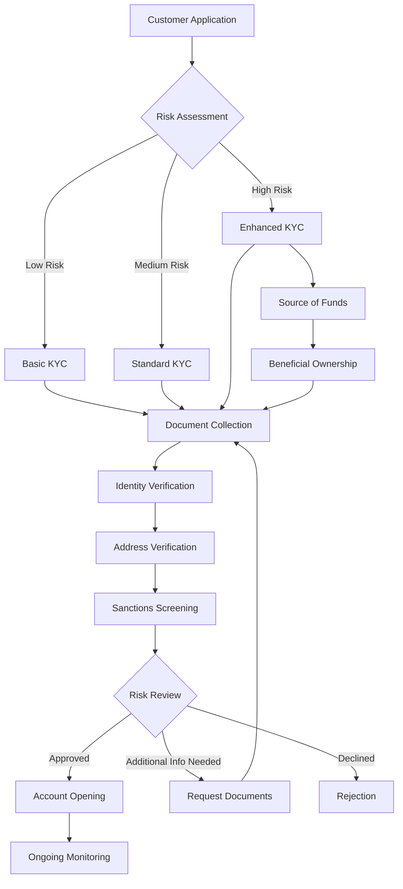
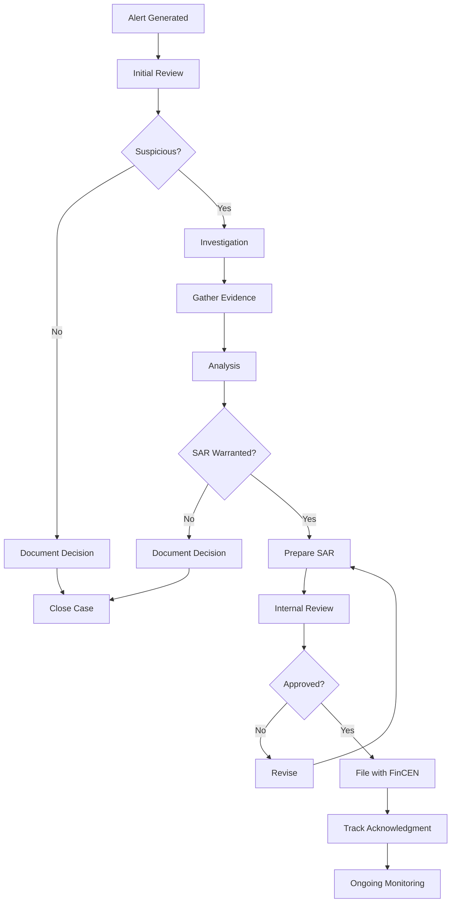

# KYC/AML Workflows in Payment Systems

## Overview
Know Your Customer (KYC) and Anti-Money Laundering (AML) processes are critical compliance requirements for payment systems. These workflows help prevent financial crimes, ensure regulatory compliance, and protect the integrity of the financial system.

## KYC Process Overview

### Customer Risk Categories

#### 1. Low Risk Customers
- **Individuals**: Regular consumers, small transaction volumes
- **Businesses**: Local small businesses, transparent ownership
- **Verification**: Basic ID and address verification
- **Monitoring**: Standard transaction monitoring

#### 2. Medium Risk Customers
- **Individuals**: High net worth, frequent international transfers
- **Businesses**: Cash-intensive businesses, multiple locations
- **Verification**: Enhanced due diligence required
- **Monitoring**: Increased scrutiny on patterns

#### 3. High Risk Customers
- **Individuals**: PEPs (Politically Exposed Persons), sanctions proximity
- **Businesses**: MSBs, crypto exchanges, offshore entities
- **Verification**: Comprehensive background checks
- **Monitoring**: Real-time monitoring, frequent reviews

### KYC Workflow



### KYC Components

#### 1. Identity Verification
```python
class IdentityVerification:
    def __init__(self):
        self.document_types = {
            'primary': ['passport', 'drivers_license', 'national_id'],
            'secondary': ['utility_bill', 'bank_statement', 'tax_document']
        }
        
    async def verify_identity(self, customer_data, documents):
        results = {
            'identity_match': False,
            'document_authentic': False,
            'biometric_match': False,
            'confidence_score': 0
        }
        
        # Document authenticity check
        for doc in documents:
            if doc['type'] in self.document_types['primary']:
                auth_result = await self.verify_document_authenticity(doc)
                results['document_authentic'] = auth_result['authentic']
                
        # Biometric verification
        if 'selfie' in documents:
            biometric_result = await self.biometric_comparison(
                documents['selfie'],
                documents['id_photo']
            )
            results['biometric_match'] = biometric_result['match']
            
        # Data matching
        results['identity_match'] = self.match_customer_data(
            customer_data,
            documents
        )
        
        # Calculate confidence score
        results['confidence_score'] = self.calculate_confidence(results)
        
        return results
```

#### 2. Address Verification
```python
class AddressVerification:
    def verify_address(self, address_data, proof_documents):
        verification_methods = []
        
        # Document-based verification
        if proof_documents:
            doc_result = self.verify_via_document(
                address_data, 
                proof_documents
            )
            verification_methods.append(doc_result)
        
        # Database verification
        db_result = self.verify_via_database(address_data)
        if db_result:
            verification_methods.append(db_result)
        
        # Physical verification (for high-risk)
        if address_data.get('risk_level') == 'high':
            physical_result = self.schedule_physical_verification(
                address_data
            )
            verification_methods.append(physical_result)
        
        return {
            'verified': any(m['verified'] for m in verification_methods),
            'methods': verification_methods,
            'confidence': self.calculate_confidence(verification_methods)
        }
```

#### 3. Business Verification
```python
class BusinessVerification:
    async def verify_business(self, business_info):
        verification_steps = {
            'registration': await self.verify_registration(business_info),
            'ownership': await self.verify_ownership(business_info),
            'operations': await self.verify_operations(business_info),
            'financial': await self.verify_financial_standing(business_info)
        }
        
        # Beneficial ownership identification
        if business_info['type'] in ['corporation', 'llc', 'partnership']:
            verification_steps['beneficial_owners'] = (
                await self.identify_beneficial_owners(business_info)
            )
        
        # Industry-specific checks
        if business_info['industry'] in self.high_risk_industries:
            verification_steps['industry_license'] = (
                await self.verify_industry_licenses(business_info)
            )
        
        return {
            'business_verified': all(
                step['verified'] for step in verification_steps.values()
            ),
            'verification_details': verification_steps,
            'risk_score': self.calculate_business_risk(verification_steps)
        }
```

### Enhanced Due Diligence (EDD)

#### 1. PEP Screening
```python
class PEPScreening:
    def screen_for_pep(self, customer):
        pep_results = {
            'is_pep': False,
            'pep_type': None,
            'relationships': [],
            'risk_level': 'standard'
        }
        
        # Direct PEP check
        direct_match = self.check_pep_database(customer)
        if direct_match:
            pep_results['is_pep'] = True
            pep_results['pep_type'] = direct_match['position']
            pep_results['risk_level'] = 'high'
        
        # Related party check
        relationships = self.check_pep_relationships(customer)
        if relationships:
            pep_results['relationships'] = relationships
            if not pep_results['is_pep']:
                pep_results['risk_level'] = 'medium'
        
        # Historical PEP check
        historical = self.check_historical_pep(customer)
        if historical and not pep_results['is_pep']:
            pep_results['pep_type'] = f"Former {historical['position']}"
            pep_results['risk_level'] = 'medium'
        
        return pep_results
```

#### 2. Source of Funds Verification
```python
def verify_source_of_funds(customer, declared_sources):
    verification_results = []
    
    for source in declared_sources:
        if source['type'] == 'employment':
            result = verify_employment_income(
                customer,
                source['employer'],
                source['income']
            )
        elif source['type'] == 'business':
            result = verify_business_income(
                source['business_info'],
                source['revenue']
            )
        elif source['type'] == 'investment':
            result = verify_investment_income(
                source['portfolio'],
                source['returns']
            )
        elif source['type'] == 'inheritance':
            result = verify_inheritance(
                source['documentation'],
                source['amount']
            )
        else:
            result = {'verified': False, 'reason': 'Unknown source type'}
        
        verification_results.append({
            'source': source,
            'verification': result
        })
    
    return {
        'all_verified': all(r['verification']['verified'] 
                           for r in verification_results),
        'details': verification_results,
        'total_verified_amount': sum(
            r['source']['amount'] 
            for r in verification_results 
            if r['verification']['verified']
        )
    }
```

## AML Monitoring Workflows

### Transaction Monitoring

#### 1. Rule-Based Monitoring
```python
class TransactionMonitor:
    def __init__(self):
        self.rules = [
            StructuringRule(),
            VelocityRule(),
            GeographicRule(),
            PatternRule(),
            ThresholdRule()
        ]
    
    def monitor_transaction(self, transaction, customer_profile):
        alerts = []
        
        for rule in self.rules:
            result = rule.evaluate(transaction, customer_profile)
            if result.triggered:
                alerts.append({
                    'rule': rule.name,
                    'severity': result.severity,
                    'reason': result.reason,
                    'score': result.score
                })
        
        # Aggregate scoring
        total_score = sum(alert['score'] for alert in alerts)
        
        return {
            'alerts': alerts,
            'total_score': total_score,
            'action_required': self.determine_action(total_score, alerts)
        }
```

#### 2. ML-Based Anomaly Detection
```python
class AnomalyDetector:
    def __init__(self, model_path):
        self.model = self.load_model(model_path)
        self.feature_extractor = FeatureExtractor()
    
    def detect_anomalies(self, transaction, historical_data):
        # Extract features
        features = self.feature_extractor.extract(
            transaction,
            historical_data
        )
        
        # Predict anomaly score
        anomaly_score = self.model.predict_proba(features)[0][1]
        
        # Context-aware adjustment
        adjusted_score = self.adjust_for_context(
            anomaly_score,
            transaction,
            historical_data
        )
        
        return {
            'anomaly_score': adjusted_score,
            'contributing_factors': self.explain_score(
                features,
                self.model
            ),
            'similar_transactions': self.find_similar(
                transaction,
                historical_data
            ),
            'recommended_action': self.recommend_action(adjusted_score)
        }
```

### Sanctions Screening

#### 1. Real-Time Screening
```python
class SanctionsScreening:
    def __init__(self):
        self.lists = {
            'OFAC': OFACList(),
            'UN': UNSanctionsList(),
            'EU': EUSanctionsList(),
            'UK': UKSanctionsList()
        }
        self.fuzzy_matcher = FuzzyMatcher()
    
    async def screen_entity(self, entity):
        screening_results = {
            'matches': [],
            'risk_score': 0,
            'action_required': None
        }
        
        for list_name, sanctions_list in self.lists.items():
            # Exact match
            exact_matches = sanctions_list.exact_match(entity)
            if exact_matches:
                screening_results['matches'].extend([
                    {
                        'list': list_name,
                        'type': 'exact',
                        'confidence': 1.0,
                        'entry': match
                    }
                    for match in exact_matches
                ])
            
            # Fuzzy match
            fuzzy_matches = self.fuzzy_matcher.match(
                entity,
                sanctions_list
            )
            screening_results['matches'].extend([
                {
                    'list': list_name,
                    'type': 'fuzzy',
                    'confidence': match['score'],
                    'entry': match['entry']
                }
                for match in fuzzy_matches
                if match['score'] > 0.85
            ])
        
        # Calculate risk and determine action
        if screening_results['matches']:
            screening_results['risk_score'] = max(
                match['confidence'] for match in screening_results['matches']
            )
            screening_results['action_required'] = 'block' if any(
                match['type'] == 'exact' for match in screening_results['matches']
            ) else 'review'
        
        return screening_results
```

#### 2. Batch Screening
```python
def batch_screen_customers(customer_list, screening_config):
    results = {
        'total_screened': len(customer_list),
        'clean': [],
        'potential_matches': [],
        'confirmed_matches': [],
        'errors': []
    }
    
    # Parallel processing for efficiency
    with ThreadPoolExecutor(max_workers=10) as executor:
        futures = {
            executor.submit(
                screen_customer,
                customer,
                screening_config
            ): customer
            for customer in customer_list
        }
        
        for future in as_completed(futures):
            customer = futures[future]
            try:
                result = future.result()
                if result['matches']:
                    if result['confidence'] > 0.95:
                        results['confirmed_matches'].append({
                            'customer': customer,
                            'matches': result['matches']
                        })
                    else:
                        results['potential_matches'].append({
                            'customer': customer,
                            'matches': result['matches']
                        })
                else:
                    results['clean'].append(customer)
            except Exception as e:
                results['errors'].append({
                    'customer': customer,
                    'error': str(e)
                })
    
    return results
```

### Suspicious Activity Reporting (SAR)

#### 1. SAR Decision Matrix
```python
class SARDecisionEngine:
    def evaluate_for_sar(self, alerts, investigation_results):
        sar_indicators = {
            'structuring': self.check_structuring_pattern(alerts),
            'unusual_activity': self.check_unusual_patterns(alerts),
            'geographic_risk': self.check_geographic_indicators(alerts),
            'third_party': self.check_third_party_involvement(alerts),
            'no_business_purpose': self.check_business_purpose(
                investigation_results
            )
        }
        
        # Calculate SAR score
        sar_score = sum(
            indicator['score'] * indicator['weight']
            for indicator in sar_indicators.values()
            if indicator['present']
        )
        
        return {
            'file_sar': sar_score >= self.sar_threshold,
            'score': sar_score,
            'indicators': sar_indicators,
            'narrative_elements': self.generate_narrative_elements(
                sar_indicators
            ),
            'deadline': self.calculate_filing_deadline(alerts[0]['date'])
        }
```

#### 2. SAR Filing Workflow


### Ongoing Monitoring

#### 1. Periodic Reviews
```python
class PeriodicReview:
    def schedule_reviews(self, customer_base):
        review_schedule = []
        
        for customer in customer_base:
            frequency = self.determine_review_frequency(customer)
            next_review = self.calculate_next_review(
                customer['last_review'],
                frequency
            )
            
            review_schedule.append({
                'customer_id': customer['id'],
                'risk_level': customer['risk_level'],
                'frequency': frequency,
                'next_review': next_review,
                'review_type': self.determine_review_type(customer)
            })
        
        return sorted(review_schedule, key=lambda x: x['next_review'])
    
    def determine_review_frequency(self, customer):
        frequencies = {
            'low': 'annual',
            'medium': 'semi-annual',
            'high': 'quarterly',
            'very_high': 'monthly'
        }
        return frequencies.get(customer['risk_level'], 'annual')
```

#### 2. Trigger-Based Reviews
```python
def check_review_triggers(customer, events):
    triggers = []
    
    # Transaction-based triggers
    if events.get('monthly_volume') > customer['expected_volume'] * 3:
        triggers.append({
            'type': 'volume_spike',
            'severity': 'high',
            'action': 'immediate_review'
        })
    
    # Geographic triggers
    if any(country in HIGH_RISK_COUNTRIES 
           for country in events.get('countries', [])):
        triggers.append({
            'type': 'high_risk_geography',
            'severity': 'medium',
            'action': 'enhanced_monitoring'
        })
    
    # Behavioral triggers
    if events.get('login_anomalies') > 5:
        triggers.append({
            'type': 'access_pattern_change',
            'severity': 'medium',
            'action': 'security_review'
        })
    
    return triggers
```

## Regulatory Reporting

### 1. Regulatory Report Generation
```python
class RegulatoryReporting:
    def generate_aml_report(self, reporting_period):
        report = {
            'period': reporting_period,
            'metrics': {
                'total_accounts': self.count_active_accounts(),
                'new_accounts': self.count_new_accounts(reporting_period),
                'high_risk_accounts': self.count_high_risk_accounts(),
                'alerts_generated': self.count_alerts(reporting_period),
                'sars_filed': self.count_sars(reporting_period),
                'false_positives': self.calculate_false_positive_rate()
            },
            'compliance_activities': {
                'training_completed': self.get_training_metrics(),
                'audits_performed': self.get_audit_results(),
                'policy_updates': self.get_policy_changes(),
                'system_enhancements': self.get_system_updates()
            },
            'trending_risks': self.analyze_risk_trends(reporting_period)
        }
        
        return self.format_report(report)
```

### 2. Audit Trail Management
```python
class AuditTrail:
    def log_kyc_action(self, action, user, customer, details):
        audit_entry = {
            'timestamp': datetime.utcnow(),
            'action_type': action,
            'user_id': user['id'],
            'customer_id': customer['id'],
            'details': details,
            'ip_address': user.get('ip_address'),
            'session_id': user.get('session_id'),
            'checksum': self.calculate_checksum(details)
        }
        
        # Immutable storage
        self.store_audit_entry(audit_entry)
        
        # Real-time monitoring
        if action in self.monitored_actions:
            self.notify_compliance_team(audit_entry)
        
        return audit_entry['id']
```

## EU AI Act Compliance for KYC/AML Systems (Q1 2025)

### High-Risk AI System Requirements

The EU AI Act classifies KYC/AML systems using AI as high-risk systems, requiring comprehensive compliance measures:

```yaml
AI_Act_KYC_AML_Compliance:
  Classification:
    System_Type: High-Risk AI System
    Category: Financial Services - Risk Assessment
    Justification: Direct impact on access to financial services
    
  Core_Requirements:
    Transparency:
      - Clear notification of AI usage
      - Explainable decision-making
      - Human-readable explanations
      - Right to human review
      
    Accuracy_and_Robustness:
      - Defined performance metrics
      - Regular accuracy testing
      - Bias detection and mitigation
      - Adversarial testing
      
    Human_Oversight:
      - Human-in-the-loop for critical decisions
      - Override capabilities
      - Audit trail of interventions
      - Operator training programs
      
    Data_Governance:
      - Data quality assurance
      - Bias-free training datasets
      - Regular data audits
      - Privacy by design
```

### Enhanced ML-Based Anomaly Detection with AI Act Compliance

```python
class AIActCompliantAnomalyDetector:
    def __init__(self, model_path):
        # Core ML components
        self.model = self.load_model(model_path)
        self.feature_extractor = FeatureExtractor()
        
        # EU AI Act compliance components
        self.explainability_engine = ExplainabilityEngine()
        self.bias_monitor = BiasMonitor()
        self.human_oversight = HumanOversightInterface()
        self.audit_logger = AuditLogger()
        
    async def detect_anomalies(self, transaction, historical_data):
        # Extract features with bias mitigation
        features = self.feature_extractor.extract(
            transaction,
            historical_data,
            bias_mitigation=True
        )
        
        # Predict with uncertainty quantification
        prediction_result = self.model.predict_with_uncertainty(features)
        anomaly_score = prediction_result['score']
        confidence = prediction_result['confidence']
        
        # Generate explanation (EU AI Act requirement)
        explanation = self.explainability_engine.explain(
            model=self.model,
            features=features,
            prediction=anomaly_score,
            method='SHAP',  # SHapley Additive exPlanations
            language=transaction.customer_language
        )
        
        # Check for bias (EU AI Act requirement)
        bias_assessment = self.bias_monitor.assess_decision(
            features=features,
            score=anomaly_score,
            protected_attributes=['age', 'gender', 'nationality', 'postal_code']
        )
        
        # Determine if human review needed
        requires_human_review = (
            anomaly_score > 0.8 or
            confidence < 0.7 or
            bias_assessment['potential_bias'] or
            transaction.amount > 50000
        )
        
        # Log for audit (EU AI Act requirement)
        self.audit_logger.log({
            'transaction_id': transaction.id,
            'model_version': self.model.version,
            'anomaly_score': anomaly_score,
            'confidence': confidence,
            'explanation': explanation,
            'bias_assessment': bias_assessment,
            'human_review_required': requires_human_review,
            'timestamp': datetime.utcnow()
        })
        
        return {
            'anomaly_score': anomaly_score,
            'confidence': confidence,
            'explanation': explanation,
            'bias_assessment': bias_assessment,
            'contributing_factors': explanation['top_factors'],
            'recommended_action': self.recommend_action(anomaly_score),
            'human_review_required': requires_human_review,
            'ai_transparency': {
                'system_id': 'KYC_AML_ANOMALY_v2',
                'ai_used': True,
                'contestable': True,
                'human_override_available': True
            }
        }
```

### Continuous Monitoring and Compliance Reporting

```python
class AIActComplianceMonitor:
    def __init__(self):
        self.performance_tracker = PerformanceTracker()
        self.bias_detector = ContinuousBiasDetector()
        self.drift_monitor = ModelDriftMonitor()
        self.incident_reporter = IncidentReporter()
        
    def generate_compliance_report(self):
        report = {
            'reporting_period': self.get_reporting_period(),
            'system_performance': {
                'accuracy': self.performance_tracker.get_accuracy(),
                'precision': self.performance_tracker.get_precision(),
                'recall': self.performance_tracker.get_recall(),
                'false_positive_rate': self.performance_tracker.get_fpr(),
                'false_negative_rate': self.performance_tracker.get_fnr()
            },
            'fairness_metrics': {
                'demographic_parity': self.bias_detector.check_demographic_parity(),
                'equal_opportunity': self.bias_detector.check_equal_opportunity(),
                'disparate_impact': self.bias_detector.check_disparate_impact(),
                'bias_incidents': self.bias_detector.get_bias_incidents()
            },
            'model_stability': {
                'feature_drift': self.drift_monitor.detect_feature_drift(),
                'concept_drift': self.drift_monitor.detect_concept_drift(),
                'performance_drift': self.drift_monitor.detect_performance_drift()
            },
            'human_oversight': {
                'total_reviews': self.get_human_review_count(),
                'overrides': self.get_override_count(),
                'average_review_time': self.get_avg_review_time(),
                'reviewer_agreement': self.get_reviewer_agreement_rate()
            },
            'incidents': self.incident_reporter.get_reportable_incidents(),
            'compliance_status': self.assess_overall_compliance()
        }
        
        # Auto-alert if non-compliant
        if report['compliance_status'] != 'COMPLIANT':
            self.trigger_compliance_alert(report)
            
        return report
```

### Implementation Checklist for EU AI Act Compliance

- [ ] **System Classification**
  - [ ] Document AI system as high-risk
  - [ ] Complete conformity assessment
  - [ ] Prepare for CE marking
  - [ ] Register in EU database
  
- [ ] **Technical Implementation**
  - [ ] Deploy explainability features
  - [ ] Implement bias detection
  - [ ] Enable human oversight
  - [ ] Create audit logging
  
- [ ] **Documentation**
  - [ ] Technical documentation package
  - [ ] Risk assessment reports
  - [ ] Testing and validation results
  - [ ] Incident response procedures
  
- [ ] **Ongoing Compliance**
  - [ ] Continuous monitoring system
  - [ ] Regular bias audits
  - [ ] Performance tracking
  - [ ] Incident reporting (72hr SLA)

## Best Practices

### 1. Risk-Based Approach
- Tailor KYC requirements to risk level
- Allocate resources based on risk
- Continuously update risk assessments
- Document risk decisions

### 2. Technology Integration
- Automate routine checks
- Use AI/ML for pattern detection
- Integrate multiple data sources
- Maintain system redundancy

### 3. Process Efficiency
- Streamline low-risk onboarding
- Parallelize verification steps
- Cache verification results
- Implement smart routing

### 4. Compliance Culture
- Regular training programs
- Clear escalation procedures
- Tone from the top
- Continuous improvement

## Future Trends

### 1. Digital Identity
- Blockchain-based identity
- Self-sovereign identity
- Biometric authentication
- Zero-knowledge proofs

### 2. Advanced Analytics
- Predictive risk scoring
- Network analysis
- Behavioral biometrics
- Natural language processing

### 3. Regulatory Technology
- RegTech automation
- Real-time reporting
- Cross-border cooperation
- Standardized APIs