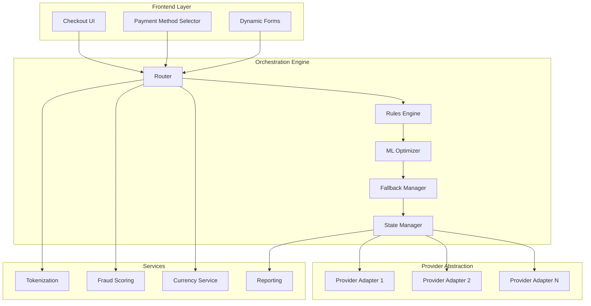
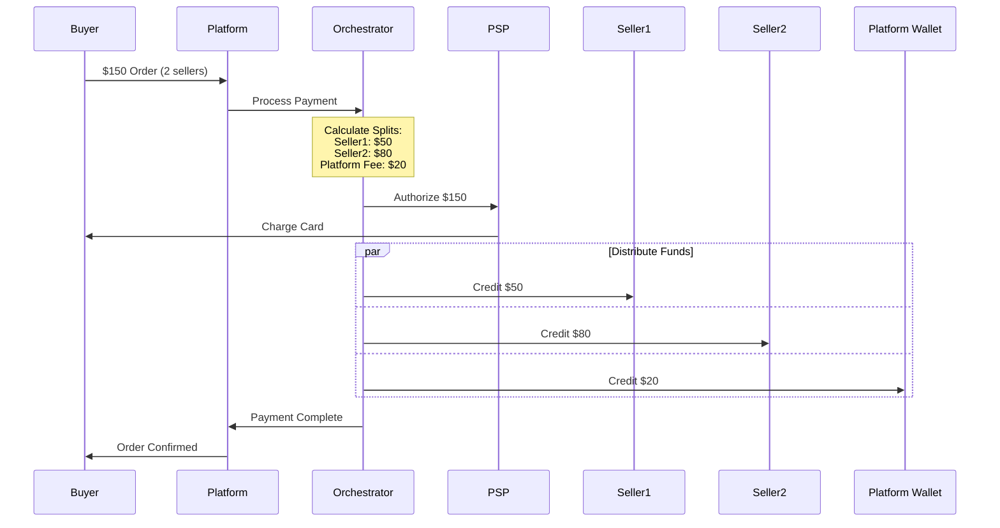
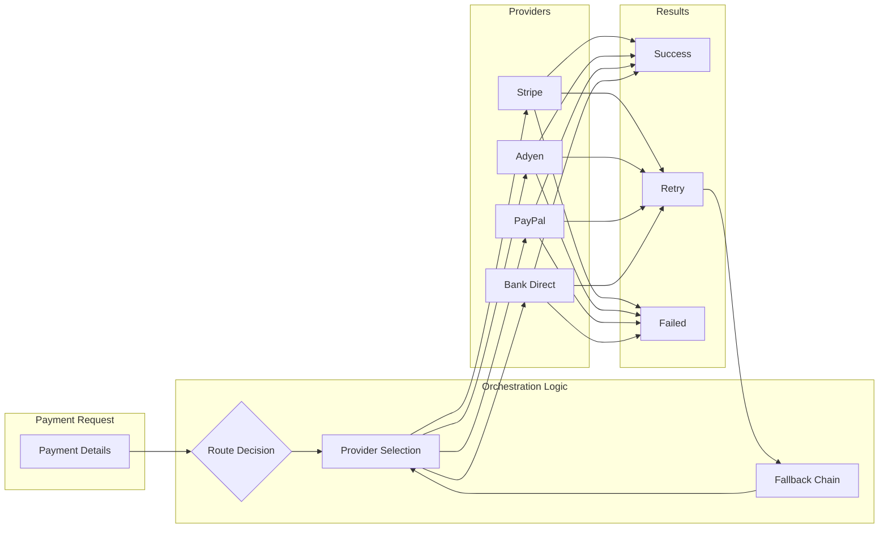
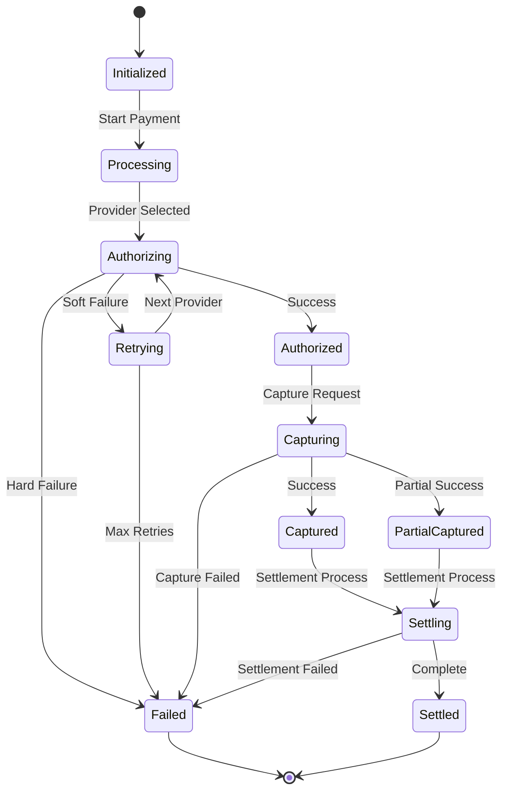
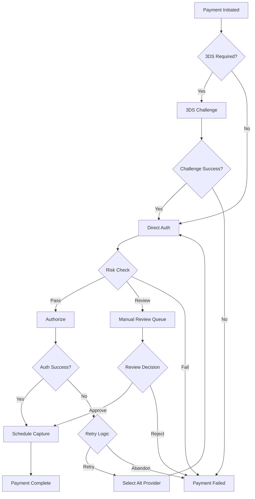

# Payment Orchestration Patterns

## Overview
Payment orchestration involves coordinating multiple payment providers, methods, and services to optimize transaction success rates, reduce costs, and improve the payment experience. This document details advanced orchestration patterns for complex payment scenarios.

## Core Orchestration Architecture

### Orchestration Layer Components



## Multi-Party Payment Orchestration

### 1. Marketplace Split Payments



### 2. Complex Split Configuration

```python
class SplitPaymentOrchestrator:
    def __init__(self):
        self.split_rules = SplitRuleEngine()
        self.settlement_manager = SettlementManager()
        
    def calculate_splits(self, order):
        splits = []
        
        # Base seller splits
        for item in order.items:
            seller_amount = item.price * item.quantity
            seller_split = {
                'recipient_id': item.seller_id,
                'amount': seller_amount,
                'type': 'seller_revenue',
                'item_refs': [item.id]
            }
            splits.append(seller_split)
        
        # Platform commission
        commission = self.split_rules.calculate_commission(order)
        if commission > 0:
            splits.append({
                'recipient_id': 'platform',
                'amount': commission,
                'type': 'platform_fee',
                'percentage': commission / order.total
            })
        
        # Affiliate commission
        if order.affiliate_id:
            affiliate_fee = self.split_rules.calculate_affiliate(order)
            splits.append({
                'recipient_id': order.affiliate_id,
                'amount': affiliate_fee,
                'type': 'affiliate_commission'
            })
        
        # Shipping provider
        if order.shipping:
            splits.append({
                'recipient_id': order.shipping.provider_id,
                'amount': order.shipping.cost,
                'type': 'shipping_fee'
            })
        
        # Tax withholding
        tax_splits = self.split_rules.calculate_tax_splits(order)
        splits.extend(tax_splits)
        
        return self.validate_splits(splits, order.total)
```

### 3. Multi-Provider Orchestration



## Intelligent Routing Strategies

### 1. ML-Based Router

```python
class IntelligentPaymentRouter:
    def __init__(self):
        self.ml_model = load_model('payment_router_v2')
        self.feature_extractor = FeatureExtractor()
        self.provider_monitor = ProviderHealthMonitor()
        
    async def route_payment(self, payment_request):
        # Extract features
        features = self.feature_extractor.extract({
            'amount': payment_request.amount,
            'currency': payment_request.currency,
            'card_bin': payment_request.card_bin,
            'merchant_category': payment_request.mcc,
            'customer_country': payment_request.customer_country,
            'time_of_day': datetime.now().hour,
            'day_of_week': datetime.now().weekday()
        })
        
        # Get provider health scores
        provider_health = await self.provider_monitor.get_current_health()
        
        # Predict success rates for each provider
        predictions = {}
        for provider in self.available_providers:
            provider_features = np.append(features, provider_health[provider])
            predictions[provider] = self.ml_model.predict_proba(provider_features)[0][1]
        
        # Sort by predicted success rate
        ranked_providers = sorted(
            predictions.items(), 
            key=lambda x: x[1], 
            reverse=True
        )
        
        # Apply business rules
        return self.apply_business_rules(ranked_providers, payment_request)
```

### 2. Cost Optimization Engine

```yaml
cost_optimization_rules:
  tiered_routing:
    - amount_range: [0, 50]
      preferred_providers:
        - name: flat_rate_provider
          cost: "2.9% + $0.30"
    
    - amount_range: [50, 500]
      preferred_providers:
        - name: interchange_plus_provider
          cost: "IC + 0.25% + $0.10"
    
    - amount_range: [500, null]
      preferred_providers:
        - name: enterprise_provider
          cost: "IC + 0.15% + $0.05"
  
  currency_routing:
    USD:
      domestic: us_processor
      international: global_processor
    EUR:
      domestic: eu_processor
      international: global_processor
    
  card_type_routing:
    corporate_cards:
      provider: b2b_specialist
      reason: "Better corporate rates"
    debit_cards:
      provider: debit_network
      reason: "Lower debit fees"
```

### 3. Dynamic Failover Strategy

```javascript
class FailoverOrchestrator {
    constructor() {
        this.maxRetries = 3;
        this.retryDelay = 1000; // ms
        this.failoverChains = new Map();
    }
    
    async processWithFailover(payment) {
        const chain = this.getFailoverChain(payment);
        let lastError;
        
        for (const provider of chain) {
            try {
                // Check if provider is healthy
                if (!await this.isProviderHealthy(provider)) {
                    continue;
                }
                
                // Attempt payment
                const result = await this.processWithProvider(payment, provider);
                
                // Update success metrics
                this.updateMetrics(provider, true);
                
                return result;
                
            } catch (error) {
                lastError = error;
                
                // Update failure metrics
                this.updateMetrics(provider, false);
                
                // Check if error is retryable
                if (this.isRetryableError(error)) {
                    await this.delay(this.retryDelay);
                    continue;
                }
                
                // Non-retryable error, try next provider
                continue;
            }
        }
        
        throw new Error(`All providers failed: ${lastError.message}`);
    }
    
    getFailoverChain(payment) {
        // Build dynamic chain based on payment characteristics
        const chains = {
            high_value: ['provider_a', 'provider_b', 'bank_direct'],
            international: ['global_psp', 'provider_a', 'provider_c'],
            default: ['provider_a', 'provider_b', 'provider_c']
        };
        
        if (payment.amount > 10000) return chains.high_value;
        if (payment.international) return chains.international;
        return chains.default;
    }
}
```

## State Management Patterns

### 1. Distributed Payment State



### 2. State Synchronization

```python
class PaymentStateManager:
    def __init__(self):
        self.redis = Redis(decode_responses=True)
        self.state_db = StateDatabase()
        self.event_bus = EventBus()
        
    async def transition_state(self, payment_id, new_state, metadata=None):
        # Get current state with lock
        async with self.redis.lock(f"payment:{payment_id}:lock"):
            current = await self.get_state(payment_id)
            
            # Validate transition
            if not self.is_valid_transition(current.state, new_state):
                raise InvalidStateTransition(
                    f"Cannot transition from {current.state} to {new_state}"
                )
            
            # Update state
            state_record = {
                'payment_id': payment_id,
                'previous_state': current.state,
                'new_state': new_state,
                'timestamp': datetime.utcnow(),
                'metadata': metadata or {}
            }
            
            # Persist to database
            await self.state_db.save_state(state_record)
            
            # Update cache
            await self.redis.set(
                f"payment:{payment_id}:state",
                json.dumps(state_record),
                ex=3600  # 1 hour TTL
            )
            
            # Publish event
            await self.event_bus.publish(
                'payment.state.changed',
                state_record
            )
            
        return state_record
```

## Advanced Orchestration Patterns

### 1. Conditional Payment Flows



### 2. Subscription Orchestration

```python
class SubscriptionOrchestrator:
    def __init__(self):
        self.scheduler = PaymentScheduler()
        self.retry_manager = RetryManager()
        self.dunning_engine = DunningEngine()
        
    async def process_subscription_payment(self, subscription):
        payment_request = self.create_payment_request(subscription)
        
        try:
            # Attempt primary payment method
            result = await self.process_payment(
                payment_request,
                subscription.primary_payment_method
            )
            
            if result.success:
                await self.update_subscription_status(
                    subscription, 
                    'active',
                    next_payment_date=self.calculate_next_payment(subscription)
                )
                return result
                
        except PaymentFailure as e:
            # Start dunning process
            return await self.dunning_engine.handle_failure(
                subscription,
                e,
                self.get_dunning_strategy(subscription)
            )
    
    def get_dunning_strategy(self, subscription):
        if subscription.value_tier == 'enterprise':
            return EnterpriseDunningStrategy()
        elif subscription.payment_history.success_rate > 0.9:
            return SoftDunningStrategy()
        else:
            return StandardDunningStrategy()
```

### 3. Multi-Currency Orchestration

```yaml
multi_currency_config:
  supported_currencies:
    - code: USD
      settlement_currency: USD
      providers: [stripe, adyen, checkout]
      
    - code: EUR
      settlement_currency: EUR
      providers: [adyen, mollie, stripe]
      
    - code: GBP
      settlement_currency: GBP
      providers: [checkout, stripe, gocardless]
      
    - code: JPY
      settlement_currency: JPY
      providers: [stripe, payjp]
      decimal_places: 0
  
  fx_providers:
    primary: currencycloud
    fallback: wise
    
  conversion_rules:
    - if: customer_currency != settlement_currency
      then: offer_dcc_option
      
    - if: merchant_multi_currency_enabled
      then: settle_in_customer_currency
      else: convert_to_settlement_currency
```

## Performance Optimization

### 1. Connection Pooling Strategy

```python
class ProviderConnectionPool:
    def __init__(self, provider_config):
        self.pools = {}
        self.metrics = MetricsCollector()
        
        for provider, config in provider_config.items():
            self.pools[provider] = aiohttp.ClientSession(
                connector=aiohttp.TCPConnector(
                    limit=config['max_connections'],
                    limit_per_host=config['max_per_host'],
                    ttl_dns_cache=300,
                    enable_cleanup_closed=True
                ),
                timeout=aiohttp.ClientTimeout(
                    total=config['timeout'],
                    connect=config['connect_timeout']
                )
            )
    
    async def execute_request(self, provider, request):
        pool = self.pools.get(provider)
        if not pool:
            raise ProviderNotConfigured(provider)
        
        start_time = time.time()
        
        try:
            async with pool.request(
                method=request.method,
                url=request.url,
                json=request.data,
                headers=request.headers
            ) as response:
                result = await response.json()
                
                self.metrics.record(
                    provider=provider,
                    duration=time.time() - start_time,
                    status=response.status,
                    success=response.status < 400
                )
                
                return result
                
        except Exception as e:
            self.metrics.record_error(provider, e)
            raise
```

### 2. Caching Layer

```javascript
class OrchestrationCache {
    constructor() {
        this.redis = new Redis({
            enableReadyCheck: true,
            maxRetriesPerRequest: 3
        });
        
        this.cacheTTL = {
            provider_health: 60,      // 1 minute
            routing_decision: 300,    // 5 minutes
            bin_data: 86400,         // 24 hours
            exchange_rates: 300      // 5 minutes
        };
    }
    
    async getCachedOrCompute(key, computeFn, ttlType) {
        // Try to get from cache
        const cached = await this.redis.get(key);
        if (cached) {
            return JSON.parse(cached);
        }
        
        // Compute if not cached
        const result = await computeFn();
        
        // Store in cache
        await this.redis.setex(
            key,
            this.cacheTTL[ttlType] || 300,
            JSON.stringify(result)
        );
        
        return result;
    }
    
    async invalidatePattern(pattern) {
        const keys = await this.redis.keys(pattern);
        if (keys.length > 0) {
            await this.redis.del(...keys);
        }
    }
}
```

## Monitoring and Analytics

### 1. Real-Time Orchestration Metrics

```
┌─────────────────────────────────────────────────────────┐
│           Payment Orchestration Dashboard                │
├─────────────────────────────────────────────────────────┤
│ Provider Performance (Last Hour)                         │
│                                                         │
│ Provider A: ████████████░░ 94.2% SR | 342ms | $0.29    │
│ Provider B: ████████████░░ 96.8% SR | 298ms | $0.31    │
│ Provider C: ██████████░░░░ 91.1% SR | 412ms | $0.27    │
│ Provider D: ████████████░░ 95.5% SR | 276ms | $0.33    │
│                                                         │
├─────────────────────────────────────────────────────────┤
│ Routing Distribution                                     │
│                                                         │
│ ML Routed:      62% ████████████░░░░                   │
│ Rule Based:     28% ██████░░░░░░░░░░                   │
│ Fallback:       10% ██░░░░░░░░░░░░░░                   │
│                                                         │
├─────────────────────────────────────────────────────────┤
│ Cost Optimization                                        │
│                                                         │
│ Average Cost:   $0.297 per transaction                  │
│ Cost Saved:     $1,247 today (vs single provider)      │
│ Optimal Route:  73% of transactions                     │
└─────────────────────────────────────────────────────────┘
```

### 2. Provider Health Monitoring

```python
class ProviderHealthMonitor:
    def __init__(self):
        self.metrics_window = 300  # 5 minutes
        self.health_thresholds = {
            'success_rate': 0.95,
            'latency_p95': 1000,
            'error_rate': 0.05
        }
        
    async def calculate_health_score(self, provider):
        metrics = await self.get_recent_metrics(provider)
        
        # Calculate component scores
        success_score = min(
            metrics.success_rate / self.health_thresholds['success_rate'],
            1.0
        ) * 40
        
        latency_score = max(
            1 - (metrics.latency_p95 / self.health_thresholds['latency_p95']),
            0
        ) * 30
        
        error_score = max(
            1 - (metrics.error_rate / self.health_thresholds['error_rate']),
            0
        ) * 30
        
        # Combined health score (0-100)
        health_score = success_score + latency_score + error_score
        
        return {
            'provider': provider,
            'health_score': health_score,
            'components': {
                'success': success_score,
                'latency': latency_score,
                'errors': error_score
            },
            'status': self.get_health_status(health_score),
            'metrics': metrics
        }
```

## Best Practices

### For Platform Operators

1. **Provider Diversity**
   - Integrate multiple providers per region
   - Maintain provider health scores
   - Regular performance reviews
   - Negotiate volume-based pricing

2. **Optimization Strategy**
   - Continuous A/B testing
   - ML model retraining
   - Cost vs success rate balance
   - Regular rule updates

3. **Operational Excellence**
   - Real-time monitoring
   - Automated failover
   - Comprehensive logging
   - Regular disaster recovery tests

### For Developers

1. **Integration Patterns**
   - Use provider SDKs wisely
   - Implement proper abstraction
   - Handle edge cases
   - Comprehensive error handling

2. **Testing Strategy**
   - Mock provider responses
   - Test failure scenarios
   - Load testing
   - Integration testing

### For Business Teams

1. **Provider Management**
   - Regular contract reviews
   - Performance benchmarking
   - Cost analysis
   - Relationship management

2. **Optimization Goals**
   - Define success metrics
   - Set cost targets
   - Monitor customer experience
   - Regular reporting

## Future Trends

### 1. AI-Driven Orchestration
- Predictive routing
- Automated optimization
- Anomaly detection
- Self-healing systems

### 2. Open Banking Integration
- Account-to-account payments
- Real-time balance checks
- Enhanced authentication
- Direct bank relationships

### 3. Blockchain Settlement
- Instant settlement
- Reduced intermediaries
- Smart contract automation
- Cross-border efficiency

### 4. Edge Computing
- Localized decision making
- Reduced latency
- Improved reliability
- Enhanced security