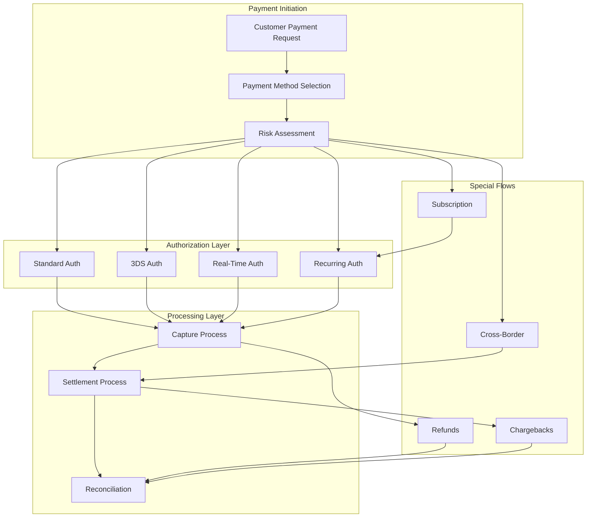
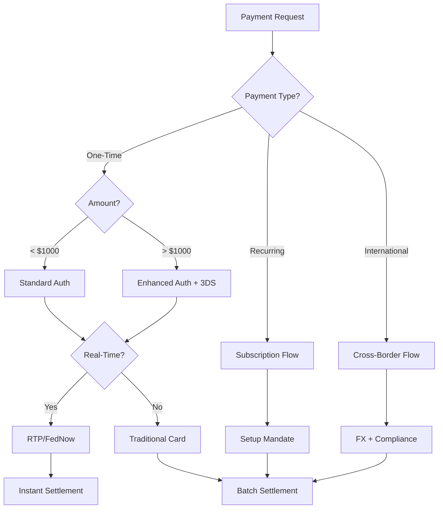

# Payment Process Flow Summary

## Overview
This document provides a comprehensive summary of all payment processing flows documented for the payments industry architecture. It serves as a quick reference guide and shows how different payment processes interconnect.

## Payment Process Categories

### 1. Transaction Processing Flows

#### Authorization Flows
- **Location**: `/processes/authorization-flows.md`
- **Key Processes**:
  - Standard authorization with real-time approval
  - Pre-authorization for hotels and rentals  
  - Incremental authorization for extended services
  - Zero-dollar authorization for card verification
  - 3D Secure authentication flows
  - Network tokenization

#### Capture and Settlement
- **Location**: `/processes/capture-settlement.md`
- **Key Processes**:
  - Immediate capture (sale transactions)
  - Delayed capture for physical goods
  - Partial capture for split shipments
  - Multi-capture for installments
  - Net vs gross settlement models
  - T+0, T+1, T+2 settlement timelines

### 2. Payment Types and Methods

#### Real-Time Payments
- **Location**: `/processes/real-time-payments.md`
- **Key Networks**:
  - US: RTP Network and FedNow
  - Europe: SEPA Instant (SCT Inst)
  - India: UPI (Unified Payments Interface)
  - Brazil: PIX
- **Key Features**:
  - Sub-10 second processing
  - 24/7/365 availability
  - Immediate finality
  - Push and Request-to-Pay models

#### Cross-Border Payments
- **Location**: `/processes/cross-border-payments.md`
- **Key Processes**:
  - Traditional SWIFT wire transfers
  - Modern API-based remittance
  - Multi-currency handling
  - FX rate management
  - Correspondent banking chains
  - Regulatory compliance (KYC/AML)

#### Subscription & Recurring
- **Location**: `/processes/subscription-recurring-payments.md`
- **Key Processes**:
  - Flexible billing cycles
  - Trial period management
  - Dunning and retry logic
  - Payment method updates
  - Proration calculations
  - Revenue recognition

### 3. Orchestration and Optimization

#### Payment Orchestration
- **Location**: `/processes/payment-orchestration.md`
- **Key Patterns**:
  - Multi-provider routing
  - Intelligent failover
  - Cost optimization
  - Load balancing
  - State management
  - Performance monitoring

### 4. Specialized Flows

#### Refunds and Chargebacks
- **Location**: `/processes/refunds-chargebacks.md`
- **Key Processes**:
  - Refund initiation and processing
  - Partial vs full refunds
  - Chargeback lifecycle
  - Dispute management
  - Evidence submission

#### KYC/AML Processes
- **Location**: `/processes/kyc-aml.md`
- **Key Components**:
  - Identity verification
  - Sanctions screening
  - Transaction monitoring
  - Risk scoring
  - Regulatory reporting

#### Reconciliation
- **Location**: `/processes/reconciliation.md`
- **Key Activities**:
  - Three-way matching
  - Settlement reconciliation
  - Fee reconciliation
  - Exception handling

## Process Interconnections



## Common Process Patterns

### 1. Synchronous vs Asynchronous Flows

#### Synchronous (Real-Time)
- Card authorizations
- Real-time payments (RTP, PIX)
- 3DS authentication
- Instant refunds

#### Asynchronous  
- ACH transfers
- SWIFT wires
- Settlement processes
- Reconciliation

### 2. Error Handling Patterns

```yaml
error_handling:
  retry_strategies:
    - immediate_retry: [network_timeout, temporary_failure]
    - exponential_backoff: [rate_limit, service_unavailable]
    - scheduled_retry: [insufficient_funds, account_closed]
    - no_retry: [invalid_card, fraud_block]
    
  fallback_patterns:
    - primary_provider_fail: use_secondary_provider
    - all_providers_fail: queue_for_manual_review
    - partial_success: capture_available_amount
```

### 3. State Management

All payment processes follow similar state patterns:

```
Initiated → Processing → Completed
                ↓
              Failed → Retry → Completed/Abandoned
```

## Integration Points

### 1. External Systems
- **Payment Networks**: Visa, Mastercard, Amex, Discover
- **Banking Systems**: Fed, SWIFT, ACH, SEPA
- **Alternative Methods**: PayPal, digital wallets
- **Support Services**: Fraud scoring, KYC providers

### 2. Internal Systems
- **Risk Management**: Fraud detection, credit checks
- **Accounting**: Ledger updates, revenue recognition
- **Customer Service**: Dispute handling, support tickets
- **Analytics**: Transaction monitoring, reporting

## Performance Benchmarks

### Transaction Processing Times

| Process Type | Average Time | SLA Target |
|-------------|--------------|------------|
| Card Authorization | 1-2 seconds | < 3 seconds |
| Real-Time Payment | 3-5 seconds | < 10 seconds |
| ACH Transfer | 1-3 days | Next business day |
| SWIFT Wire | 1-5 days | 24-48 hours |
| Capture Process | < 1 second | < 2 seconds |
| Settlement | End of day | Daily batch |

### Success Rates

| Process Type | Industry Average | Best Practice |
|-------------|-----------------|---------------|
| Authorization | 85-90% | > 95% |
| Real-Time Payments | 95-98% | > 99% |
| Recurring Payments | 88-92% | > 95% |
| Cross-Border | 80-85% | > 90% |

## Compliance Checkpoints

### Every Process Must Address:

1. **Data Security**
   - PCI DSS compliance
   - Encryption requirements
   - Tokenization standards

2. **Regulatory Requirements**
   - KYC/AML checks
   - Sanctions screening
   - Transaction reporting

3. **Regional Regulations**
   - SCA (Europe)
   - PSD2 (Europe)
   - Regulation E (US)
   - Local requirements

## Best Practices Across All Flows

### 1. Design Principles
- **Idempotency**: All operations must be idempotent
- **Atomicity**: Transactions must be all-or-nothing
- **Auditability**: Complete audit trail required
- **Resilience**: Graceful failure handling

### 2. Operational Excellence
- **Monitoring**: Real-time alerting for all processes
- **Redundancy**: No single points of failure
- **Scalability**: Horizontal scaling capability
- **Performance**: Meet or exceed SLAs

### 3. Customer Experience
- **Transparency**: Clear status communication
- **Speed**: Optimize for minimal latency
- **Reliability**: Consistent service delivery
- **Support**: Easy issue resolution

## Future Evolution

### Emerging Patterns
1. **Instant Everything**: Moving toward real-time for all payment types
2. **Intelligent Routing**: AI-driven optimization
3. **Embedded Finance**: Payments integrated into platforms
4. **Programmable Money**: Smart contract-based flows

### Technology Trends
1. **Blockchain Settlement**: Distributed ledger adoption
2. **Open Banking**: Direct account access
3. **Biometric Auth**: Enhanced security
4. **Edge Computing**: Localized processing

## Quick Reference Decision Tree



## Conclusion

This summary provides a high-level view of all payment processing flows. Each individual process document contains detailed technical specifications, implementation examples, and specific best practices. Use this guide to:

1. Understand how different payment flows connect
2. Choose the appropriate process for your use case
3. Identify integration points and dependencies
4. Plan for compliance and performance requirements

For detailed implementation guidance, refer to the specific process documentation for each flow type.