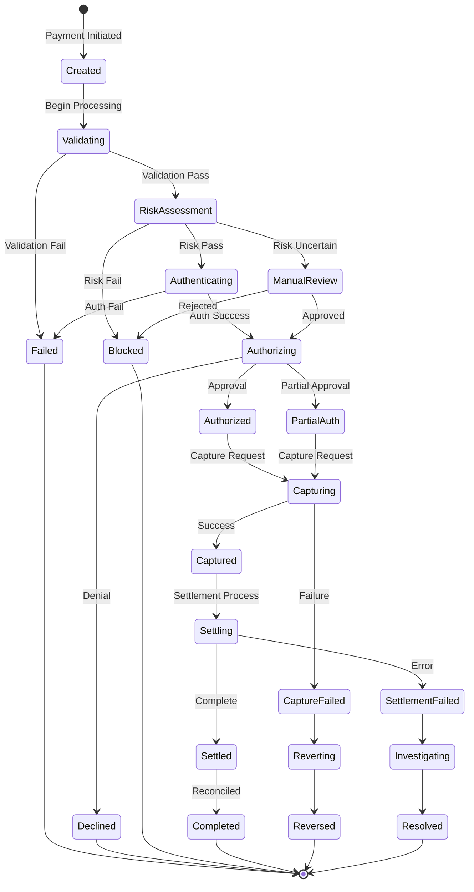
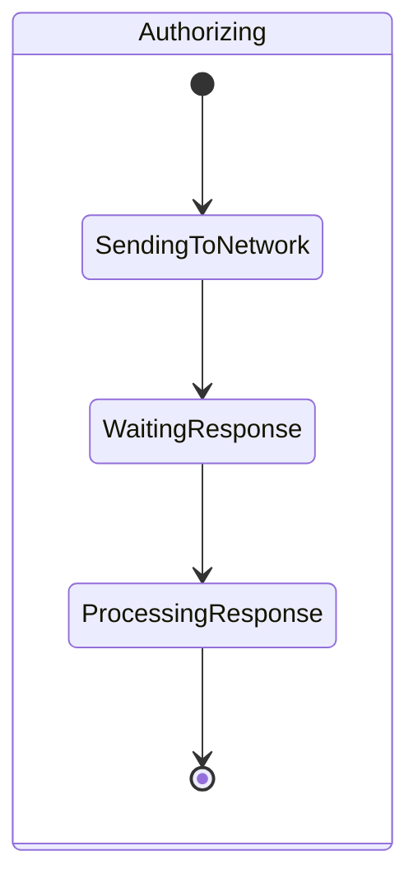
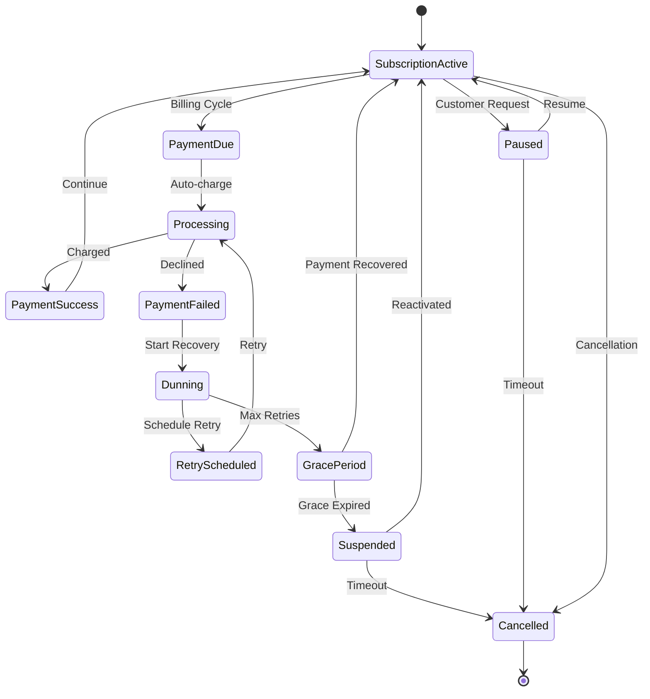
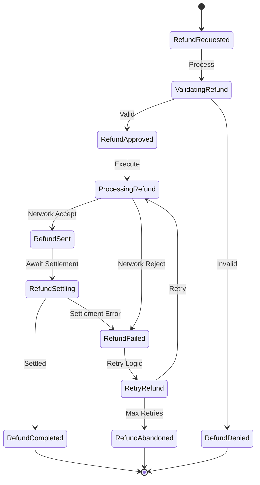
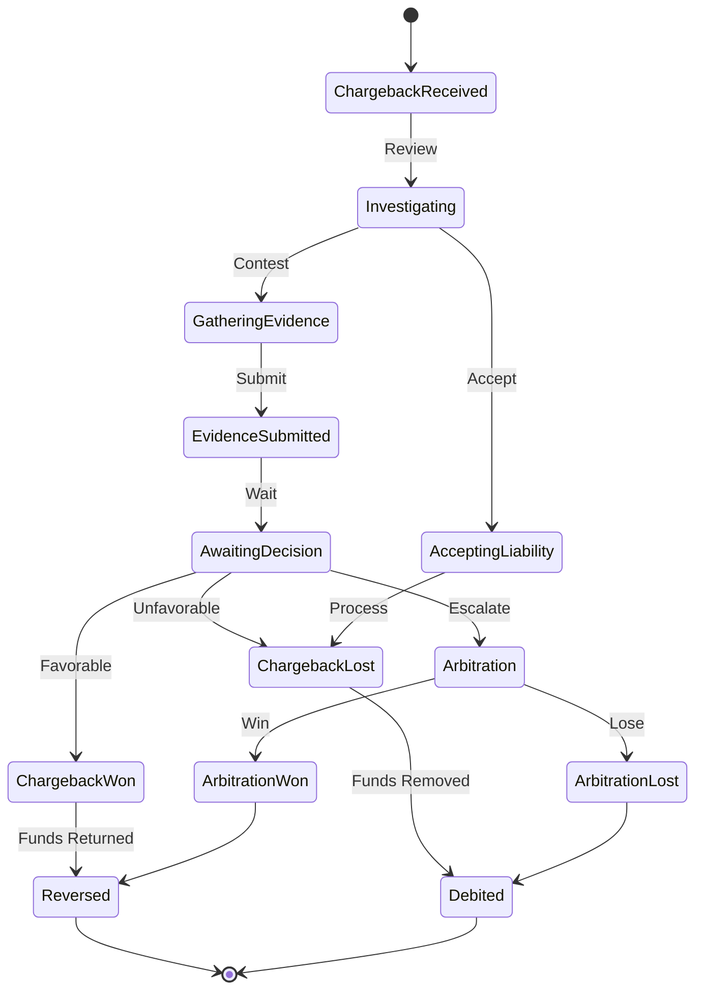
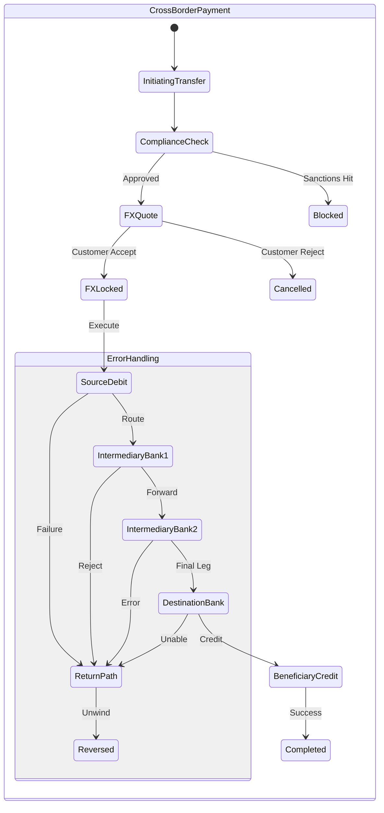

# Payment State Machines and Transitions

## Overview
This document provides a comprehensive view of state machines used across payment processing systems. State machines ensure consistent, predictable behavior for payment transactions and enable proper error handling, retry logic, and audit trails.

## Master Payment State Machine

### Core Payment Transaction States



## Detailed State Definitions

### 1. Initial States

#### Created
```yaml
state: CREATED
description: Payment request received and recorded
allowed_transitions:
  - VALIDATING
  - FAILED
metadata:
  - payment_id
  - amount
  - currency
  - payment_method
  - timestamp
validations:
  - amount > 0
  - valid_currency
  - payment_method_exists
```

#### Validating
```yaml
state: VALIDATING
description: Performing input validation and format checks
allowed_transitions:
  - RISK_ASSESSMENT
  - FAILED
actions:
  - validate_payment_method
  - check_account_status
  - verify_merchant_config
timeout: 30_seconds
```

### 2. Risk and Authentication States

#### Risk Assessment
```python
class RiskAssessmentState:
    def __init__(self):
        self.risk_engine = RiskEngine()
        self.states = {
            'PASS': 'AUTHENTICATING',
            'FAIL': 'BLOCKED',
            'REVIEW': 'MANUAL_REVIEW'
        }
        
    async def process(self, payment):
        risk_score = await self.risk_engine.evaluate(payment)
        
        if risk_score < 30:
            return self.states['PASS']
        elif risk_score > 70:
            return self.states['FAIL']
        else:
            return self.states['REVIEW']
```

#### Authenticating
```yaml
state: AUTHENTICATING
description: Customer authentication (3DS, biometric, etc.)
allowed_transitions:
  - AUTHORIZING
  - FAILED
sub_states:
  - CHALLENGE_REQUIRED
  - CHALLENGE_IN_PROGRESS
  - CHALLENGE_COMPLETED
timeout: 300_seconds
```

### 3. Authorization States

#### Authorizing


#### Authorized
```yaml
state: AUTHORIZED
description: Payment approved by issuer
allowed_transitions:
  - CAPTURING
  - VOIDING
  - EXPIRING
metadata:
  - auth_code
  - approval_amount
  - expiry_time
  - network_reference
constraints:
  - capture_before_expiry
  - capture_amount <= approval_amount
```

### 4. Capture and Settlement States

#### Capturing
```python
class CapturingState:
    def __init__(self):
        self.capture_strategies = {
            'immediate': self.immediate_capture,
            'delayed': self.delayed_capture,
            'partial': self.partial_capture,
            'multi': self.multi_capture
        }
        
    async def process(self, payment, capture_request):
        strategy = self.determine_strategy(payment, capture_request)
        
        try:
            result = await self.capture_strategies[strategy](
                payment, 
                capture_request
            )
            return 'CAPTURED' if result.success else 'CAPTURE_FAILED'
        except Exception as e:
            return 'CAPTURE_FAILED'
```

#### Settling
```yaml
state: SETTLING
description: Payment in settlement process
allowed_transitions:
  - SETTLED
  - SETTLEMENT_FAILED
sub_processes:
  - batch_creation
  - file_submission
  - network_processing
  - bank_transfer
timing:
  T+0: same_day_settlement
  T+1: next_day_settlement
  T+2: standard_settlement
```

## Specialized State Machines

### 1. Subscription Payment States



### 2. Refund State Machine



### 3. Chargeback State Machine



### 4. Cross-Border Payment States



## State Transition Rules

### 1. Valid Transitions Matrix

```python
VALID_TRANSITIONS = {
    'CREATED': ['VALIDATING', 'FAILED'],
    'VALIDATING': ['RISK_ASSESSMENT', 'FAILED'],
    'RISK_ASSESSMENT': ['AUTHENTICATING', 'BLOCKED', 'MANUAL_REVIEW'],
    'AUTHENTICATING': ['AUTHORIZING', 'FAILED'],
    'AUTHORIZING': ['AUTHORIZED', 'DECLINED', 'PARTIAL_AUTH'],
    'AUTHORIZED': ['CAPTURING', 'VOIDING', 'EXPIRING'],
    'CAPTURING': ['CAPTURED', 'CAPTURE_FAILED'],
    'CAPTURED': ['SETTLING', 'REFUNDING'],
    'SETTLING': ['SETTLED', 'SETTLEMENT_FAILED'],
    'SETTLED': ['COMPLETED', 'REFUNDING'],
    'COMPLETED': ['REFUNDING', 'CHARGEBACK']
}

def is_valid_transition(current_state, new_state):
    return new_state in VALID_TRANSITIONS.get(current_state, [])
```

### 2. Transition Guards

```python
class TransitionGuard:
    def can_transition(self, payment, from_state, to_state):
        guards = {
            ('AUTHORIZED', 'CAPTURING'): self.can_capture,
            ('CAPTURED', 'REFUNDING'): self.can_refund,
            ('SETTLING', 'SETTLED'): self.is_settled,
            ('COMPLETED', 'CHARGEBACK'): self.within_chargeback_window
        }
        
        guard_func = guards.get((from_state, to_state))
        if guard_func:
            return guard_func(payment)
        return True
    
    def can_capture(self, payment):
        return (
            payment.authorization_expiry > datetime.now() and
            payment.capture_amount <= payment.authorized_amount
        )
    
    def can_refund(self, payment):
        return (
            payment.captured_amount > 0 and
            payment.refund_amount <= payment.captured_amount
        )
```

## State Persistence and Recovery

### 1. State Storage Schema

```sql
CREATE TABLE payment_states (
    id UUID PRIMARY KEY,
    payment_id UUID NOT NULL,
    state VARCHAR(50) NOT NULL,
    previous_state VARCHAR(50),
    metadata JSONB,
    error_details JSONB,
    created_at TIMESTAMP NOT NULL DEFAULT NOW(),
    updated_at TIMESTAMP NOT NULL DEFAULT NOW(),
    
    INDEX idx_payment_id (payment_id),
    INDEX idx_state (state),
    INDEX idx_created_at (created_at)
);

CREATE TABLE state_transitions (
    id UUID PRIMARY KEY,
    payment_id UUID NOT NULL,
    from_state VARCHAR(50),
    to_state VARCHAR(50) NOT NULL,
    triggered_by VARCHAR(100),
    metadata JSONB,
    created_at TIMESTAMP NOT NULL DEFAULT NOW(),
    
    FOREIGN KEY (payment_id) REFERENCES payments(id)
);
```

### 2. State Recovery Mechanism

```python
class StateRecovery:
    async def recover_incomplete_states(self):
        # Find stuck payments
        stuck_payments = await self.find_stuck_payments()
        
        recovery_actions = {
            'VALIDATING': self.retry_validation,
            'RISK_ASSESSMENT': self.retry_risk_assessment,
            'AUTHENTICATING': self.check_auth_status,
            'AUTHORIZING': self.check_auth_response,
            'CAPTURING': self.check_capture_status,
            'SETTLING': self.check_settlement_status
        }
        
        for payment in stuck_payments:
            action = recovery_actions.get(payment.state)
            if action:
                await action(payment)
    
    async def find_stuck_payments(self):
        timeout_by_state = {
            'VALIDATING': 60,
            'RISK_ASSESSMENT': 120,
            'AUTHENTICATING': 300,
            'AUTHORIZING': 180,
            'CAPTURING': 120,
            'SETTLING': 86400  # 24 hours
        }
        
        stuck = []
        for state, timeout in timeout_by_state.items():
            payments = await self.db.query(
                """
                SELECT * FROM payment_states 
                WHERE state = %s 
                AND updated_at < NOW() - INTERVAL '%s seconds'
                """,
                state, timeout
            )
            stuck.extend(payments)
        
        return stuck
```

## State Machine Monitoring

### 1. State Distribution Dashboard

```
┌─────────────────────────────────────────────────────┐
│            Payment State Distribution                │
├─────────────────────────────────────────────────────┤
│ CREATED         ████░░░░░░░░░░  8% (1,234)        │
│ VALIDATING      ██░░░░░░░░░░░░  3% (456)          │
│ AUTHORIZING     ███░░░░░░░░░░░  5% (789)          │
│ AUTHORIZED      ██████░░░░░░░░ 12% (1,890)        │
│ CAPTURING       ████░░░░░░░░░░  7% (1,123)        │
│ SETTLING        ████████████░░ 25% (3,945)        │
│ COMPLETED       ████████████████ 35% (5,523)       │
│ FAILED          ███░░░░░░░░░░░  5% (812)          │
├─────────────────────────────────────────────────────┤
│ Stuck Payments (> timeout):                         │
│ - AUTHORIZING: 23 payments (investigate)            │
│ - SETTLING: 5 payments (normal)                     │
└─────────────────────────────────────────────────────┘
```

### 2. State Transition Metrics

```python
class StateMetrics:
    def calculate_state_duration(self, from_state, to_state):
        return {
            'avg_duration': self.avg_transition_time(from_state, to_state),
            'p50_duration': self.percentile_time(from_state, to_state, 50),
            'p95_duration': self.percentile_time(from_state, to_state, 95),
            'p99_duration': self.percentile_time(from_state, to_state, 99),
            'timeout_rate': self.timeout_percentage(from_state)
        }
    
    def generate_state_flow_report(self):
        return {
            'conversion_funnel': {
                'created_to_authorized': 0.92,
                'authorized_to_captured': 0.98,
                'captured_to_settled': 0.99,
                'settled_to_completed': 1.0
            },
            'failure_points': {
                'validation_failures': 0.02,
                'risk_blocks': 0.03,
                'auth_declines': 0.05,
                'capture_failures': 0.01
            }
        }
```

## Best Practices

### 1. State Machine Design
- Keep states atomic and well-defined
- Ensure all transitions are explicit
- Implement proper error states
- Add comprehensive logging
- Design for idempotency

### 2. Implementation Guidelines
- Use database transactions for state changes
- Implement optimistic locking
- Add state transition events
- Monitor state durations
- Regular cleanup of terminal states

### 3. Error Handling
- Define clear error states
- Implement retry mechanisms
- Set appropriate timeouts
- Provide manual intervention paths
- Maintain audit trails

## Testing State Machines

### 1. State Transition Tests

```python
class StateTransitionTests:
    def test_valid_transitions(self):
        for current_state, valid_next_states in VALID_TRANSITIONS.items():
            for next_state in valid_next_states:
                assert self.state_machine.can_transition(
                    current_state, 
                    next_state
                )
    
    def test_invalid_transitions(self):
        invalid_transitions = [
            ('CREATED', 'CAPTURED'),
            ('AUTHORIZED', 'COMPLETED'),
            ('SETTLED', 'AUTHORIZING')
        ]
        
        for from_state, to_state in invalid_transitions:
            assert not self.state_machine.can_transition(
                from_state, 
                to_state
            )
    
    def test_state_recovery(self):
        # Simulate stuck payment
        stuck_payment = self.create_payment(state='AUTHORIZING')
        stuck_payment.updated_at = datetime.now() - timedelta(hours=1)
        
        # Run recovery
        self.state_recovery.recover_incomplete_states()
        
        # Verify state change
        updated = self.get_payment(stuck_payment.id)
        assert updated.state in ['AUTHORIZED', 'DECLINED', 'FAILED']
```

### 2. Chaos Testing

```yaml
chaos_scenarios:
  - name: database_failure_during_transition
    inject_failure_at: state_transition_commit
    expected_behavior: rollback_to_previous_state
    
  - name: network_timeout_during_auth
    inject_delay: 10_seconds
    at_state: AUTHORIZING
    expected_result: timeout_and_retry
    
  - name: duplicate_state_transition
    action: send_duplicate_transition_request
    expected_result: idempotent_handling
```

## Conclusion

State machines provide the backbone for reliable payment processing. By defining clear states, transitions, and rules, payment systems can handle complex flows while maintaining consistency and providing excellent error recovery capabilities. Regular monitoring and testing of state machines ensures system reliability and helps identify optimization opportunities.