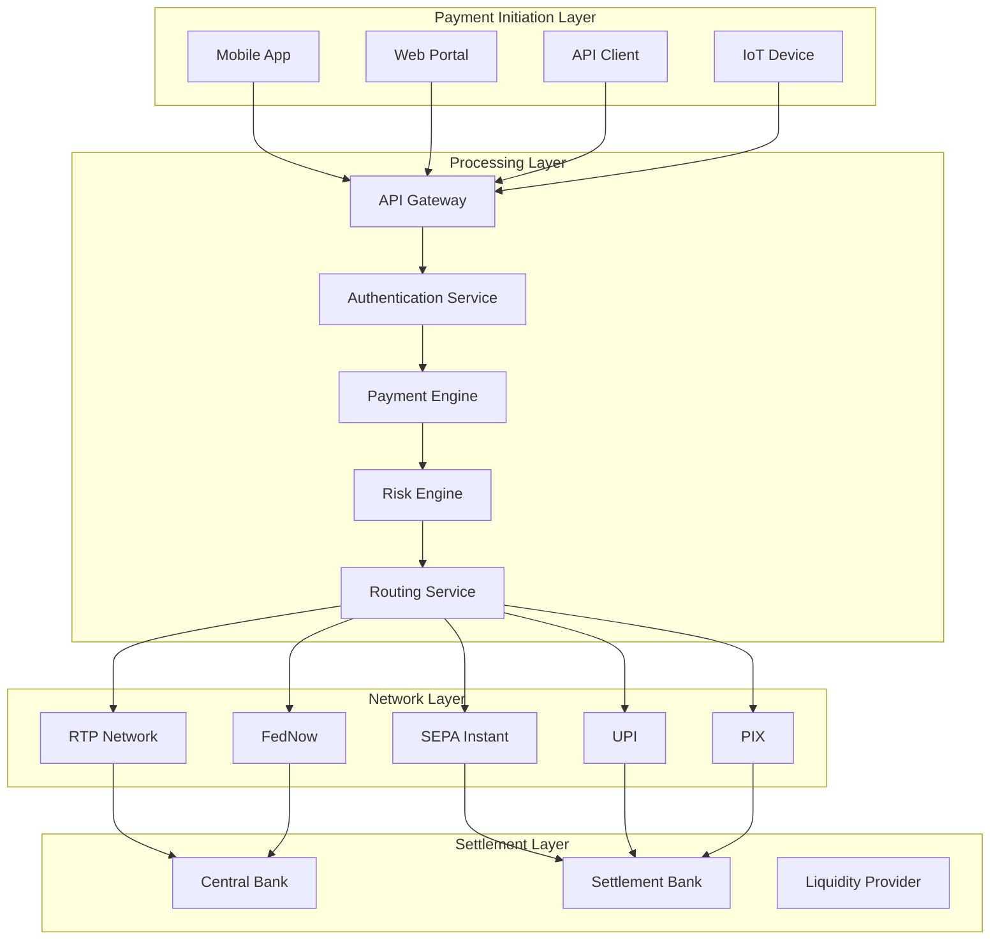
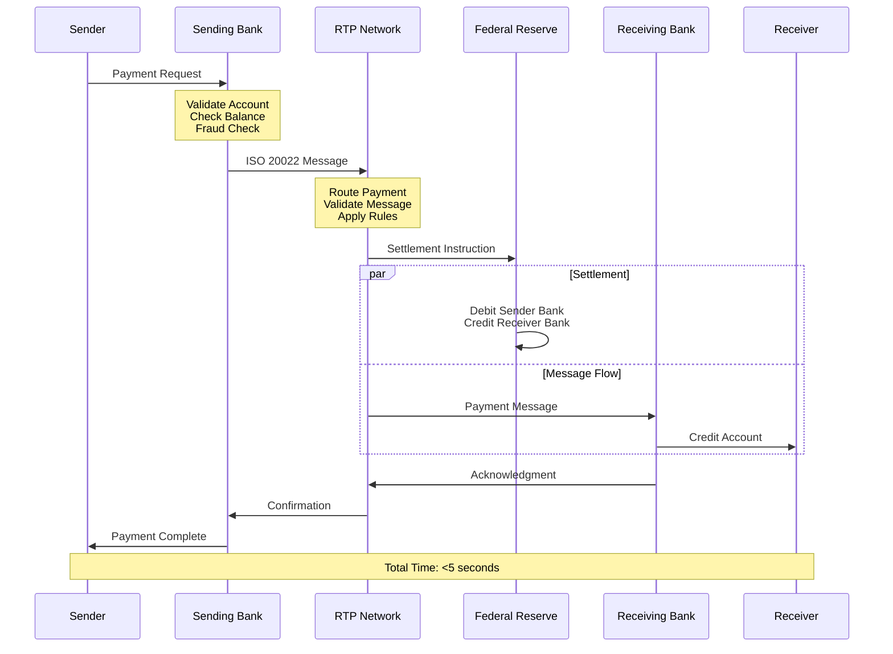
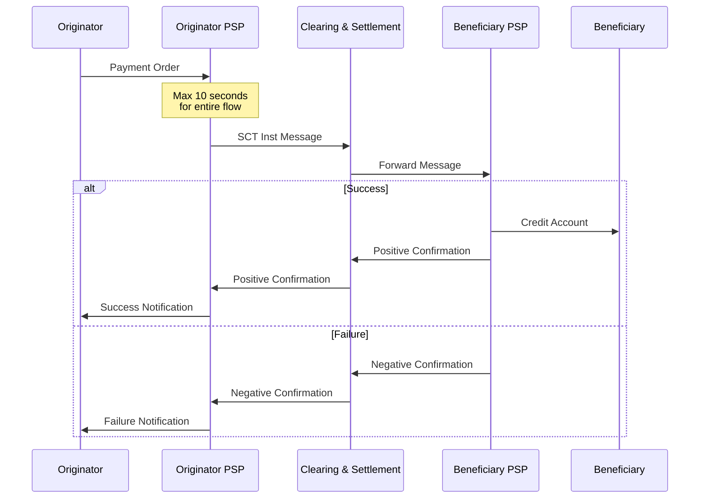
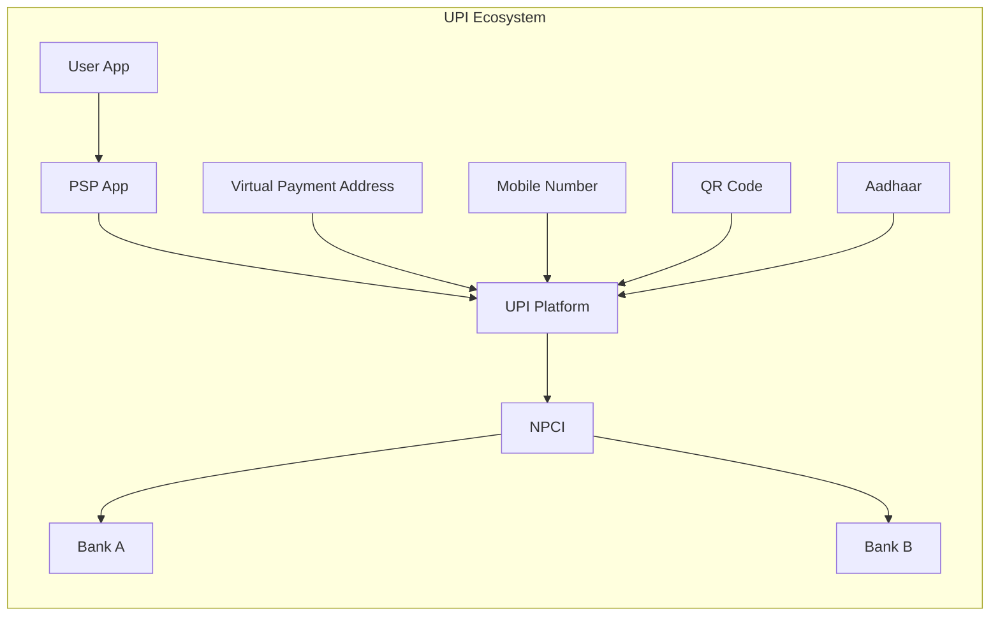
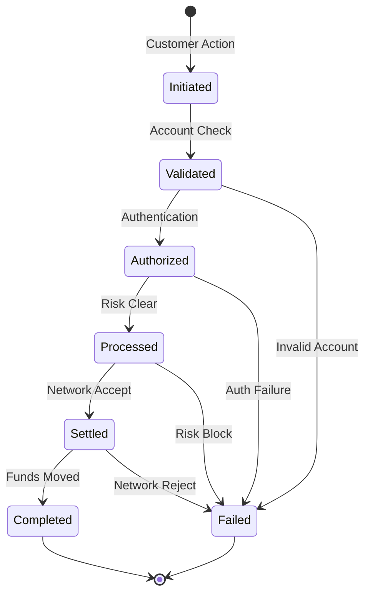
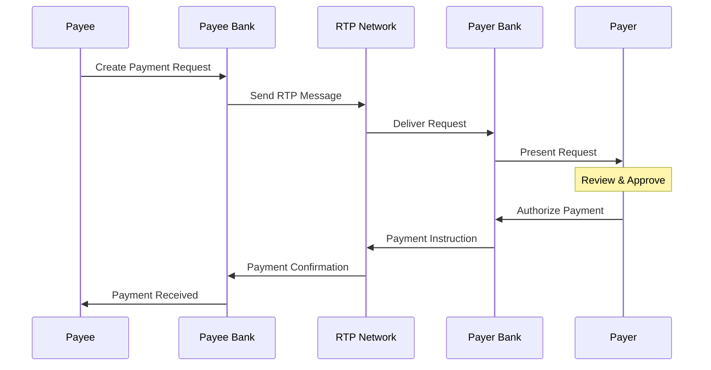
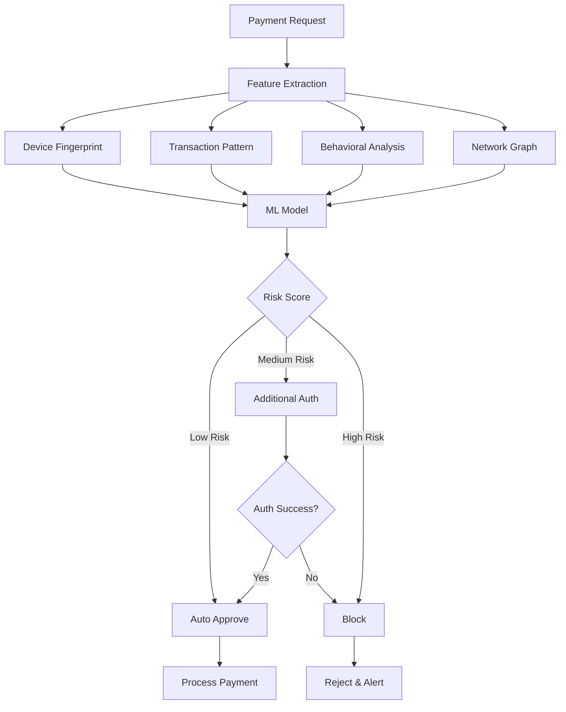
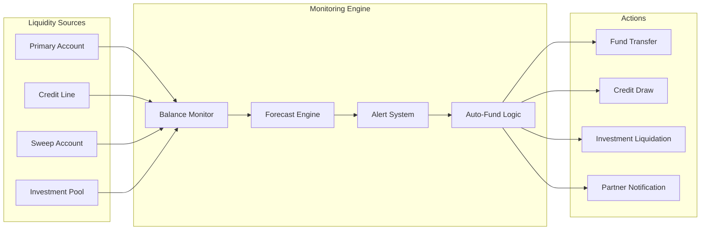
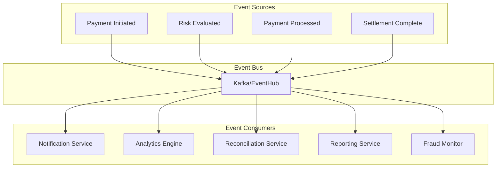

# Real-Time Payment Processing Flows

## Overview
Real-time payments (RTP) enable instant, 24/7/365 fund transfers between accounts with immediate finality. This document covers the architecture, flows, and implementation patterns for real-time payment systems across different networks and use cases.

## Core Real-Time Payment Architecture

### System Components



## Real-Time Payment Networks

### 1. US - RTP and FedNow

#### RTP Network Flow


#### FedNow Service Flow
```yaml
Network: FedNow
Launch: 2023
Availability: 24/7/365
Settlement: Real-time gross settlement
Message Format: ISO 20022
Transaction Limit: $500,000 (configurable)
Participants: 
  - Banks
  - Credit Unions
  - Service Providers

Key Features:
  - Instant settlement finality
  - Request for Payment (RfP)
  - Liquidity management tools
  - Fraud prevention services
```

### 2. Europe - SEPA Instant Credit Transfer (SCT Inst)



### 3. India - Unified Payments Interface (UPI)



### 4. Brazil - PIX

```yaml
Network: PIX
Launch: 2020
Operator: Central Bank of Brazil
Features:
  - QR Code payments
  - Payment keys (CPF, phone, email)
  - Scheduled payments
  - Payment requests
  
Transaction Flow:
  1. Initiation: <0.5 seconds
  2. Validation: <1 second
  3. Settlement: <2 seconds
  4. Confirmation: <3 seconds
  Total: <10 seconds guaranteed
```

## Payment Initiation Patterns

### 1. Push Payment Flow



### 2. Request to Pay (RTP) Flow



### 3. QR Code Initiated Payments

```python
class QRPaymentFlow:
    def generate_qr_code(self, payment_request):
        # Generate unique payment ID
        payment_id = self.generate_payment_id()
        
        # Create QR payload
        qr_data = {
            "version": "01",
            "type": "dynamic",
            "merchant_id": payment_request.merchant_id,
            "amount": payment_request.amount,
            "currency": payment_request.currency,
            "reference": payment_id,
            "expiry": datetime.now() + timedelta(minutes=5)
        }
        
        # Encode and return QR
        return self.encode_qr(qr_data)
    
    def process_qr_payment(self, qr_scan):
        # Decode QR data
        payment_data = self.decode_qr(qr_scan)
        
        # Validate QR
        if not self.validate_qr(payment_data):
            raise InvalidQRError()
        
        # Check expiry
        if payment_data.expiry < datetime.now():
            raise ExpiredQRError()
        
        # Process payment
        return self.initiate_real_time_payment(payment_data)
```

## Risk Management in Real-Time Payments

### 1. Real-Time Fraud Detection



### 2. Machine Learning Pipeline

```python
class RealTimeFraudDetection:
    def __init__(self):
        self.feature_pipeline = FeaturePipeline()
        self.ml_model = load_model('fraud_detection_v3')
        self.rule_engine = RuleEngine()
        
    async def evaluate_transaction(self, transaction):
        # Extract features in parallel
        features = await asyncio.gather(
            self.get_device_features(transaction),
            self.get_behavioral_features(transaction),
            self.get_network_features(transaction),
            self.get_velocity_features(transaction)
        )
        
        # Combine features
        feature_vector = self.feature_pipeline.transform(features)
        
        # Get ML score
        ml_score = self.ml_model.predict_proba(feature_vector)[0][1]
        
        # Apply rules
        rule_flags = self.rule_engine.evaluate(transaction)
        
        # Combine scores
        final_score = self.combine_scores(ml_score, rule_flags)
        
        return {
            'score': final_score,
            'decision': self.make_decision(final_score),
            'reasons': self.get_reasons(features, rule_flags)
        }
```

### 3. Velocity Controls

```yaml
velocity_rules:
  per_transaction:
    - max_amount: 10000
    - require_2fa_above: 5000
    
  per_customer:
    daily:
      - max_transactions: 50
      - max_amount: 50000
    hourly:
      - max_transactions: 10
      - max_amount: 10000
    per_merchant:
      - max_transactions: 5
      - max_amount: 5000
      
  per_merchant:
    hourly:
      - max_unique_customers: 100
      - max_total_volume: 100000
    daily:
      - max_refund_rate: 0.05
      - max_dispute_rate: 0.01
```

## Liquidity Management

### 1. Real-Time Liquidity Monitoring



### 2. Predictive Liquidity Management

```javascript
class LiquidityManager {
    constructor() {
        this.forecaster = new MLForecaster();
        this.thresholds = {
            critical: 0.1,  // 10% of daily volume
            warning: 0.2,   // 20% of daily volume
            comfort: 0.3    // 30% of daily volume
        };
    }
    
    async manageLiquidity() {
        const current = await this.getCurrentBalance();
        const forecast = await this.forecaster.predict({
            horizon: '4h',
            confidence: 0.95
        });
        
        const required = forecast.expected + forecast.buffer;
        
        if (current < required * this.thresholds.critical) {
            await this.emergencyFunding(required - current);
        } else if (current < required * this.thresholds.warning) {
            await this.scheduleFunding(required - current);
        }
        
        // Optimize excess liquidity
        if (current > required * 2) {
            await this.sweepExcess(current - required * 1.5);
        }
    }
}
```

## Integration Patterns

### 1. API-First Design

```yaml
openapi: 3.0.0
info:
  title: Real-Time Payments API
  version: 1.0.0

paths:
  /payments/instant:
    post:
      summary: Initiate instant payment
      requestBody:
        content:
          application/json:
            schema:
              type: object
              required:
                - amount
                - currency
                - recipient
              properties:
                amount:
                  type: number
                  minimum: 0.01
                currency:
                  type: string
                  pattern: '^[A-Z]{3}$'
                recipient:
                  type: object
                  properties:
                    account_number:
                      type: string
                    routing_number:
                      type: string
                    email:
                      type: string
                    phone:
                      type: string
      responses:
        '201':
          description: Payment initiated
          content:
            application/json:
              schema:
                type: object
                properties:
                  payment_id:
                    type: string
                  status:
                    type: string
                    enum: [completed, pending, failed]
                  completion_time:
                    type: string
                    format: date-time
```

### 2. Event-Driven Architecture



### 3. Webhook Implementation

```python
class WebhookManager:
    def __init__(self):
        self.webhook_registry = {}
        self.retry_policy = ExponentialBackoff(max_retries=5)
        
    async def register_webhook(self, customer_id, config):
        webhook = {
            'url': config['url'],
            'events': config['events'],
            'secret': self.generate_secret(),
            'active': True
        }
        self.webhook_registry[customer_id] = webhook
        return webhook['secret']
    
    async def trigger_webhook(self, event):
        customer_id = event['customer_id']
        webhook = self.webhook_registry.get(customer_id)
        
        if not webhook or not webhook['active']:
            return
        
        if event['type'] not in webhook['events']:
            return
        
        payload = {
            'event': event,
            'timestamp': datetime.utcnow().isoformat(),
            'signature': self.sign_payload(event, webhook['secret'])
        }
        
        await self.send_with_retry(webhook['url'], payload)
```

## Performance Optimization

### 1. Latency Optimization Strategies

```yaml
optimization_targets:
  database:
    - Use in-memory caching (Redis)
    - Implement read replicas
    - Optimize queries with indexes
    - Use connection pooling
    
  network:
    - Geographic distribution
    - Edge computing nodes
    - Direct peering agreements
    - Protocol optimization (HTTP/3)
    
  application:
    - Async processing
    - Microservices architecture
    - Circuit breakers
    - Load balancing
    
  infrastructure:
    - Auto-scaling groups
    - Container orchestration
    - Service mesh
    - Observability stack
```

### 2. Caching Strategy

```python
class PaymentCache:
    def __init__(self):
        self.redis_client = Redis(
            host='cache-cluster',
            decode_responses=True,
            socket_keepalive=True
        )
        
    async def get_or_fetch(self, key, fetch_func, ttl=300):
        # Try cache first
        cached = await self.redis_client.get(key)
        if cached:
            return json.loads(cached)
        
        # Fetch and cache
        data = await fetch_func()
        await self.redis_client.setex(
            key, 
            ttl, 
            json.dumps(data)
        )
        return data
    
    async def invalidate_pattern(self, pattern):
        keys = await self.redis_client.keys(pattern)
        if keys:
            await self.redis_client.delete(*keys)
```

## Monitoring and Operations

### 1. Real-Time Dashboard Metrics

```
┌────────────────────────────────────────────────────┐
│              Real-Time Payments Dashboard           │
├────────────────────┬───────────────────────────────┤
│ Current TPS        │ 12,847 ▲                      │
│ Success Rate       │ 99.94% ═                      │
│ Avg Latency        │ 287ms ▼                       │
│ Active Connections │ 45,291                        │
├────────────────────┴───────────────────────────────┤
│ Network Health                                      │
│ ├─ RTP:     ████████████░ 98.7% (42ms)           │
│ ├─ FedNow:  ████████████░ 99.2% (38ms)           │
│ ├─ SEPA:    ███████████░░ 97.1% (127ms)          │
│ └─ PIX:     ████████████░ 99.8% (19ms)           │
├─────────────────────────────────────────────────────┤
│ Liquidity Status                                    │
│ ├─ Available: $4.2M (42% of daily avg)            │
│ ├─ Forecast:  $3.8M needed (next 4h)              │
│ └─ Action:    None required                        │
└─────────────────────────────────────────────────────┘
```

### 2. Alerting Rules

```yaml
alerts:
  - name: high_failure_rate
    condition: success_rate < 99.5%
    duration: 5m
    severity: critical
    
  - name: latency_spike
    condition: p95_latency > 1000ms
    duration: 3m
    severity: warning
    
  - name: liquidity_low
    condition: available_balance < daily_avg * 0.15
    duration: immediate
    severity: critical
    
  - name: network_degraded
    condition: any_network_health < 95%
    duration: 10m
    severity: warning
```

## Best Practices

### For Payment Providers

1. **Architecture Design**
   - Implement idempotency for all operations
   - Use event sourcing for audit trails
   - Design for horizontal scalability
   - Implement circuit breakers

2. **Security Measures**
   - End-to-end encryption
   - Tokenization of sensitive data
   - Regular penetration testing
   - Continuous security monitoring

3. **Operational Excellence**
   - Automated deployment pipelines
   - Comprehensive monitoring
   - Disaster recovery planning
   - Regular chaos engineering

### For Financial Institutions

1. **Integration Strategy**
   - API-first approach
   - Standardized data formats
   - Real-time reconciliation
   - Automated testing

2. **Risk Management**
   - Real-time fraud detection
   - Dynamic limit management
   - Continuous model training
   - Regular risk assessments

### For Merchants

1. **Implementation Approach**
   - Start with pilot programs
   - Monitor customer adoption
   - Provide clear messaging
   - Offer incentives for usage

2. **User Experience**
   - Simple payment flows
   - Clear status updates
   - Instant notifications
   - Easy refund process

## Future Evolution

### 1. Programmable Money
- Smart contract integration
- Conditional payments
- Automated escrow
- Rule-based routing

### 2. Cross-Network Interoperability
- Universal payment IDs
- Network bridges
- Standardized APIs
- Global directories

### 3. Enhanced Features
- Rich payment data
- Invoice integration
- Loyalty programs
- Instant lending

### 4. Technology Advances
- Quantum-safe cryptography
- AI-powered optimization
- Edge computing
- 5G integration