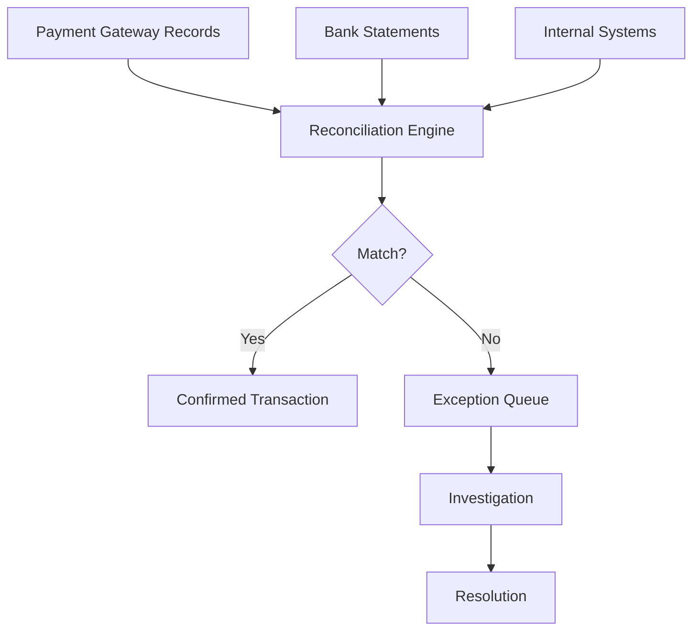
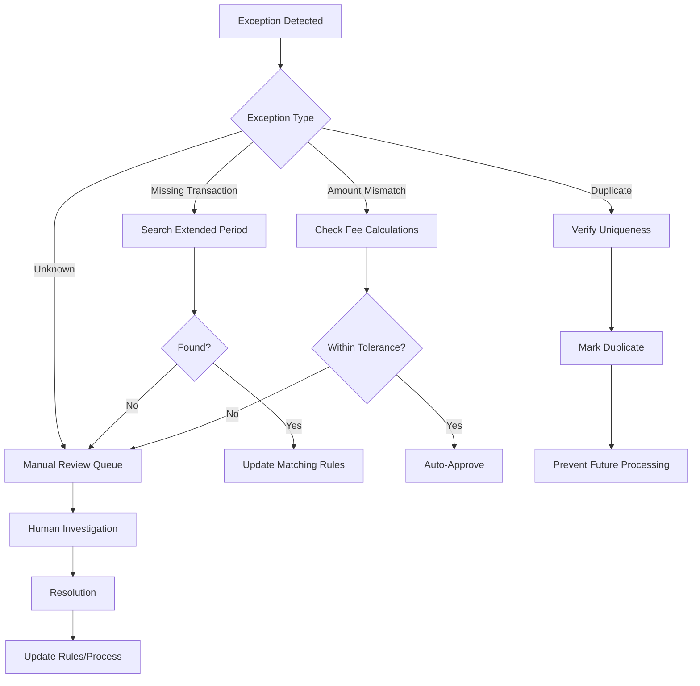

# Payment Reconciliation Process Documentation

## Overview
Reconciliation is the critical process of matching payment transactions across multiple systems to ensure accuracy, identify discrepancies, and maintain financial integrity. This document covers comprehensive reconciliation strategies, tools, and best practices.

## Types of Reconciliation

### 1. Transaction Reconciliation
Matching individual payment transactions across systems to ensure each payment is properly recorded and settled.



### 2. Settlement Reconciliation
Verifying that batched settlements match expected amounts and timing.

### 3. Fee Reconciliation
Ensuring processing fees, interchange, and other charges are accurate.

### 4. Multi-Party Reconciliation
Complex reconciliation involving multiple stakeholders (marketplaces, split payments).

## Reconciliation Components

### Data Sources

#### 1. Payment Processor Data
```json
{
  "transactionId": "TXN-123456",
  "merchantReference": "ORD-789",
  "amount": 99.99,
  "currency": "USD",
  "status": "captured",
  "captureDate": "2024-03-15T10:30:00Z",
  "settlementDate": "2024-03-16",
  "fees": {
    "interchange": 1.80,
    "assessment": 0.13,
    "processorFee": 0.10
  },
  "netAmount": 97.96
}
```

#### 2. Bank Statement Data
```csv
Date,Description,Reference,Debit,Credit,Balance
2024-03-16,"CARD DEPOSIT","BATCH-456",,9796.00,15234.56
2024-03-16,"PROCESSING FEE","FEE-456",203.00,,15031.56
```

#### 3. Internal System Data
```sql
SELECT 
  order_id,
  payment_method,
  amount,
  status,
  created_at,
  updated_at
FROM orders
WHERE payment_status = 'completed'
  AND date(created_at) = '2024-03-15';
```

### Matching Logic

#### 1. Direct Matching
```python
class DirectMatcher:
    def match_transactions(self, source_a, source_b):
        matches = []
        unmatched_a = []
        unmatched_b = list(source_b)
        
        for trans_a in source_a:
            match_found = False
            for trans_b in unmatched_b:
                if self.is_match(trans_a, trans_b):
                    matches.append({
                        'source_a': trans_a,
                        'source_b': trans_b,
                        'status': 'matched'
                    })
                    unmatched_b.remove(trans_b)
                    match_found = True
                    break
            
            if not match_found:
                unmatched_a.append(trans_a)
        
        return {
            'matched': matches,
            'unmatched_a': unmatched_a,
            'unmatched_b': unmatched_b
        }
    
    def is_match(self, trans_a, trans_b):
        return (
            trans_a['amount'] == trans_b['amount'] and
            trans_a['reference'] == trans_b['reference'] and
            self.dates_match(trans_a['date'], trans_b['date'])
        )
```

#### 2. Fuzzy Matching
```python
class FuzzyMatcher:
    def __init__(self, thresholds):
        self.amount_tolerance = thresholds.get('amount', 0.01)
        self.date_tolerance = thresholds.get('date_hours', 24)
        self.confidence_threshold = thresholds.get('confidence', 0.85)
    
    def calculate_match_score(self, trans_a, trans_b):
        score = 0
        weights = {
            'amount': 0.4,
            'date': 0.3,
            'reference': 0.3
        }
        
        # Amount matching
        amount_diff = abs(trans_a['amount'] - trans_b['amount'])
        if amount_diff <= self.amount_tolerance:
            score += weights['amount']
        else:
            score += weights['amount'] * (1 - amount_diff / trans_a['amount'])
        
        # Date matching
        date_diff = abs((trans_a['date'] - trans_b['date']).total_seconds() / 3600)
        if date_diff <= self.date_tolerance:
            score += weights['date'] * (1 - date_diff / self.date_tolerance)
        
        # Reference matching
        if trans_a.get('reference') == trans_b.get('reference'):
            score += weights['reference']
        
        return score
```

#### 3. Pattern-Based Matching
```python
class PatternMatcher:
    def __init__(self):
        self.patterns = {
            'settlement_batch': re.compile(r'BATCH-(\d+)'),
            'transaction_id': re.compile(r'TXN-(\w+)'),
            'order_reference': re.compile(r'ORD-(\d+)')
        }
    
    def extract_identifiers(self, description):
        identifiers = {}
        for pattern_name, pattern in self.patterns.items():
            match = pattern.search(description)
            if match:
                identifiers[pattern_name] = match.group(1)
        return identifiers
```

### Reconciliation Workflow

#### 1. Automated Daily Process
```python
def daily_reconciliation_workflow():
    # Step 1: Data Collection
    processor_data = fetch_processor_transactions(date.today() - timedelta(days=1))
    bank_data = fetch_bank_transactions(date.today())
    internal_data = fetch_internal_transactions(date.today() - timedelta(days=1))
    
    # Step 2: Pre-processing
    processor_data = normalize_processor_data(processor_data)
    bank_data = normalize_bank_data(bank_data)
    internal_data = normalize_internal_data(internal_data)
    
    # Step 3: Three-way matching
    results = perform_three_way_match(processor_data, bank_data, internal_data)
    
    # Step 4: Exception handling
    exceptions = process_exceptions(results['unmatched'])
    
    # Step 5: Reporting
    report = generate_reconciliation_report(results, exceptions)
    
    # Step 6: Notifications
    if exceptions:
        notify_finance_team(exceptions)
    
    return report
```

#### 2. Exception Handling Process


### Reconciliation Rules Engine

#### 1. Rule Configuration
```yaml
reconciliation_rules:
  matching:
    - name: exact_match
      conditions:
        - field: amount
          operator: equals
          tolerance: 0
        - field: reference
          operator: equals
      priority: 1
      
    - name: fuzzy_match
      conditions:
        - field: amount
          operator: within
          tolerance: 0.01
        - field: date
          operator: within_hours
          tolerance: 24
      priority: 2
      confidence_required: 0.85
      
  exceptions:
    - name: high_value_mismatch
      condition: amount_difference > 100
      action: escalate_immediately
      
    - name: missing_settlement
      condition: days_since_capture > 3
      action: investigate_settlement_delay
```

#### 2. Rule Execution Engine
```python
class RuleEngine:
    def __init__(self, rules_config):
        self.rules = self.load_rules(rules_config)
    
    def evaluate_transaction(self, transaction):
        for rule in self.rules:
            if self.check_conditions(transaction, rule.conditions):
                return self.execute_action(rule.action, transaction)
        return None
    
    def check_conditions(self, transaction, conditions):
        for condition in conditions:
            if not self.evaluate_condition(transaction, condition):
                return False
        return True
```

### Settlement Reconciliation

#### 1. Batch Settlement Matching
```python
def reconcile_settlement_batch(processor_batch, bank_deposits):
    """
    Match processor settlement batches with bank deposits
    """
    reconciliation = {
        'matched': [],
        'unmatched_processor': [],
        'unmatched_bank': [],
        'discrepancies': []
    }
    
    for batch in processor_batch:
        expected_amount = batch['gross_amount'] - batch['total_fees']
        expected_date = batch['settlement_date']
        
        # Find matching bank deposit
        match = find_bank_deposit(
            bank_deposits,
            expected_amount,
            expected_date,
            tolerance_amount=0.01,
            tolerance_days=2
        )
        
        if match:
            if match['amount'] == expected_amount:
                reconciliation['matched'].append({
                    'batch': batch,
                    'deposit': match,
                    'status': 'perfect_match'
                })
            else:
                reconciliation['discrepancies'].append({
                    'batch': batch,
                    'deposit': match,
                    'difference': match['amount'] - expected_amount,
                    'status': 'amount_mismatch'
                })
        else:
            reconciliation['unmatched_processor'].append(batch)
    
    return reconciliation
```

#### 2. Fee Reconciliation
```python
class FeeReconciliation:
    def reconcile_fees(self, transactions, fee_schedule):
        discrepancies = []
        
        for transaction in transactions:
            expected_fees = self.calculate_expected_fees(
                transaction, 
                fee_schedule
            )
            actual_fees = transaction.get('fees', {})
            
            # Compare each fee component
            for fee_type in ['interchange', 'assessment', 'processor']:
                expected = expected_fees.get(fee_type, 0)
                actual = actual_fees.get(fee_type, 0)
                
                if abs(expected - actual) > 0.01:
                    discrepancies.append({
                        'transaction_id': transaction['id'],
                        'fee_type': fee_type,
                        'expected': expected,
                        'actual': actual,
                        'difference': actual - expected
                    })
        
        return discrepancies
    
    def calculate_expected_fees(self, transaction, fee_schedule):
        card_type = self.determine_card_type(transaction['card_number'])
        transaction_type = transaction['type']
        
        rate = fee_schedule.get_rate(card_type, transaction_type)
        
        return {
            'interchange': transaction['amount'] * rate['interchange'],
            'assessment': transaction['amount'] * rate['assessment'],
            'processor': transaction['amount'] * rate['processor'] + rate['fixed']
        }
```

### Multi-Currency Reconciliation

#### 1. Exchange Rate Handling
```python
class MultiCurrencyReconciliation:
    def __init__(self, exchange_rate_service):
        self.fx_service = exchange_rate_service
    
    def reconcile_with_conversion(self, source_transaction, target_transaction):
        # Get historical exchange rate
        fx_rate = self.fx_service.get_rate(
            source_transaction['currency'],
            target_transaction['currency'],
            source_transaction['date']
        )
        
        # Convert amount
        converted_amount = source_transaction['amount'] * fx_rate
        
        # Check if amounts match within tolerance
        tolerance = 0.02  # 2% tolerance for FX
        difference = abs(converted_amount - target_transaction['amount'])
        tolerance_amount = converted_amount * tolerance
        
        return {
            'match': difference <= tolerance_amount,
            'source_amount': source_transaction['amount'],
            'source_currency': source_transaction['currency'],
            'converted_amount': converted_amount,
            'target_amount': target_transaction['amount'],
            'target_currency': target_transaction['currency'],
            'fx_rate': fx_rate,
            'difference': difference,
            'percentage_difference': difference / converted_amount * 100
        }
```

### Reporting and Analytics

#### 1. Daily Reconciliation Report
```
═══════════════════════════════════════════════════════════════
                 DAILY RECONCILIATION REPORT
                     Date: 2024-03-16
═══════════════════════════════════════════════════════════════

SUMMARY
-------
Total Transactions:      1,542
Successfully Matched:    1,498 (97.1%)
Exceptions:             44 (2.9%)
Total Value:            $154,231.45
Unreconciled Value:     $4,321.12

EXCEPTION BREAKDOWN
------------------
Missing from Bank:       12 transactions ($1,234.56)
Missing from Processor:  8 transactions ($892.34)
Amount Mismatches:       15 transactions ($1,543.21)
Duplicate Entries:       5 transactions ($456.78)
Other:                  4 transactions ($194.23)

SETTLEMENT SUMMARY
-----------------
Expected Settlements:    5 batches
Received Deposits:       5 deposits
Settlement Match Rate:   100%
Fee Variance:           -$12.34 (0.08%)

ACTION ITEMS
-----------
1. High Priority: 3 transactions over $500 unmatched
2. Investigation: 12 missing bank transactions from Batch-789
3. Follow-up: Contact processor about fee discrepancies

TRENDS (vs. 7-day average)
--------------------------
Match Rate:             ↑ 0.5%
Exception Rate:         ↓ 0.5%
Processing Time:        ↓ 12%
Auto-Resolution Rate:   ↑ 3%
```

#### 2. Exception Analytics Dashboard
```python
def generate_exception_analytics():
    return {
        'exception_trends': {
            'daily': calculate_daily_trends(),
            'weekly': calculate_weekly_trends(),
            'monthly': calculate_monthly_trends()
        },
        'exception_categories': {
            'missing_transactions': {
                'count': 156,
                'value': 15234.56,
                'avg_resolution_time': '2.3 hours',
                'common_causes': [
                    'Settlement delays (45%)',
                    'Timezone mismatches (30%)',
                    'System delays (25%)'
                ]
            },
            'amount_mismatches': {
                'count': 89,
                'value': 8932.12,
                'avg_variance': 12.34,
                'common_causes': [
                    'Fee calculation errors (60%)',
                    'Currency conversion (25%)',
                    'Rounding differences (15%)'
                ]
            }
        },
        'resolution_metrics': {
            'auto_resolved': 234,
            'manually_resolved': 89,
            'pending': 12,
            'avg_time_to_resolution': '4.5 hours'
        }
    }
```

### Best Practices

#### 1. Automation Strategy
- Automate routine matching
- Flag exceptions for review
- Learn from resolved exceptions
- Continuously improve rules

#### 2. Data Quality
- Standardize data formats
- Validate data on ingestion
- Maintain data lineage
- Archive reconciled data

#### 3. Process Optimization
- Real-time reconciliation where possible
- Batch processing for efficiency
- Parallel processing for scale
- Exception prioritization

#### 4. Controls and Governance
- Segregation of duties
- Audit trails
- Regular rule reviews
- Performance monitoring

### Technology Architecture

#### 1. Microservices Architecture
```yaml
services:
  data-ingestion:
    - processor-connector
    - bank-connector
    - internal-api
    
  reconciliation-engine:
    - matching-service
    - rule-engine
    - exception-handler
    
  reporting:
    - report-generator
    - analytics-service
    - notification-service
    
  storage:
    - transaction-store
    - reconciliation-results
    - audit-log
```

#### 2. Event-Driven Processing
```python
@event_handler('transaction.received')
async def handle_new_transaction(transaction):
    # Store transaction
    await store_transaction(transaction)
    
    # Attempt immediate reconciliation
    matches = await find_matches(transaction)
    
    if matches:
        await publish_event('transaction.reconciled', {
            'transaction': transaction,
            'matches': matches
        })
    else:
        await publish_event('transaction.unmatched', {
            'transaction': transaction
        })
```

### Future Enhancements

#### 1. Machine Learning
- Predictive matching
- Anomaly detection
- Auto-learning rules
- Pattern recognition

#### 2. Real-Time Reconciliation
- Streaming data processing
- Instant exception alerts
- Continuous reconciliation
- Zero-latency reporting

#### 3. Blockchain Integration
- Immutable audit trails
- Distributed reconciliation
- Smart contract automation
- Cross-organization transparency