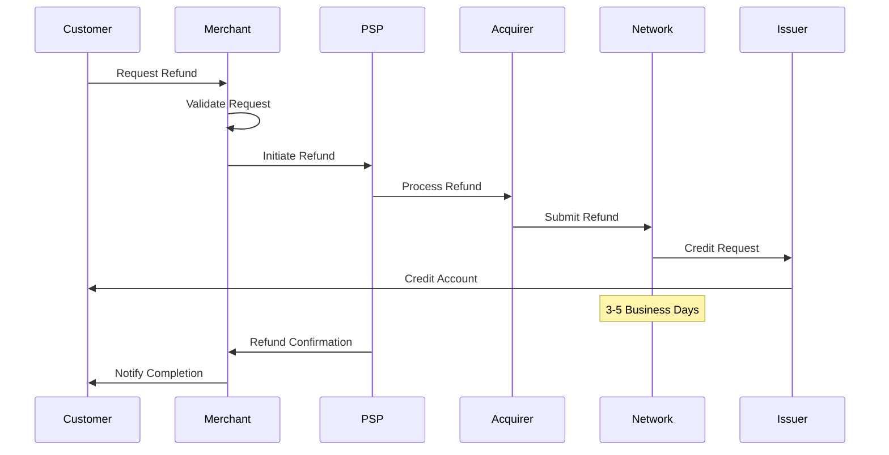
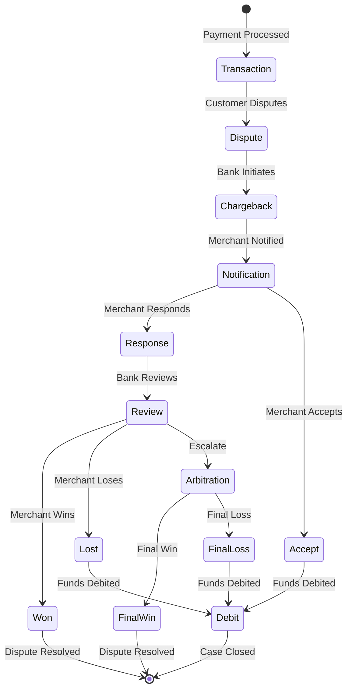

# Refunds and Chargebacks Process Documentation

## Overview
Refunds and chargebacks are reverse payment flows that return funds to customers. While refunds are merchant-initiated, chargebacks are bank-initiated disputes that can result in significant costs and operational challenges for merchants.

## Refund Process

### Types of Refunds

#### 1. Full Refund
**Characteristics**:
- Returns entire transaction amount
- Reverses all fees (varies by processor)
- Simple reconciliation
- Quick processing

**API Example**:
```json
{
  "transactionId": "TXN-12345",
  "type": "refund",
  "amount": "full",
  "reason": "customer_request",
  "reference": "REF-67890"
}
```

#### 2. Partial Refund
**Characteristics**:
- Returns portion of transaction
- Multiple partials allowed
- Complex fee calculations
- Inventory considerations

**Use Cases**:
```
Original Transaction: $150.00
Scenario 1: Damaged item - Refund $30.00
Scenario 2: Missing item - Refund $50.00
Scenario 3: Price adjustment - Refund $15.00
Maximum Refundable: $150.00
```

#### 3. Store Credit/Exchange
**Characteristics**:
- No money movement
- Internal accounting only
- Customer retention tool
- Regulatory considerations

### Refund Flow



### Refund Processing Rules

#### 1. Timing Constraints
```python
def validate_refund_timing(transaction, refund_request):
    days_since_transaction = (datetime.now() - transaction.date).days
    
    if transaction.status == "pending":
        return "void"  # Void instead of refund
    elif days_since_transaction <= 180:
        return "standard_refund"
    elif days_since_transaction <= 540:
        return "extended_refund"  # May require approval
    else:
        return "refund_expired"  # Too old to refund
```

#### 2. Amount Validation
- Cannot exceed original transaction
- Sum of partials cannot exceed original
- Consider captured vs authorized amount
- Account for previous refunds

#### 3. Fee Handling
**Processor Policies Vary**:
- **Full Refund**: Most return processing fees
- **Partial Refund**: Rarely return fees
- **Interchange**: Generally not refunded
- **Monthly Fees**: Never refunded

### Refund Best Practices

#### For Merchants
1. **Clear Refund Policy**: Display prominently
2. **Quick Processing**: Same-day initiation
3. **Communication**: Email confirmations
4. **Tracking**: Monitor refund rates
5. **Alternative Options**: Offer store credit

#### For PSPs
1. **Instant Notifications**: Real-time updates
2. **Batch Processing**: Efficient operations
3. **Fee Transparency**: Clear policies
4. **API Reliability**: Consistent uptime
5. **Reporting Tools**: Comprehensive analytics

## Chargeback Process

### What is a Chargeback?
A chargeback is a reversal of a credit card transaction initiated by the cardholder's bank, typically due to disputes over fraudulent, unauthorized, or unsatisfactory transactions.

### Chargeback Flow



### Chargeback Reason Codes

#### Visa Reason Codes
- **10.1**: EMV Liability Shift Counterfeit
- **10.4**: Fraud - Card Absent Environment
- **13.1**: Services Not Provided
- **13.3**: Not as Described
- **13.7**: Cancelled Services

#### Mastercard Reason Codes
- **4837**: Fraudulent Transaction
- **4853**: Goods/Services Not Provided
- **4855**: Non-receipt of Merchandise
- **4859**: Services Not Rendered
- **4863**: Cardholder Does Not Recognize

#### Common Categories
1. **Fraud** (60% of chargebacks)
   - Stolen card usage
   - Identity theft
   - Account takeover
   
2. **Authorization** (15%)
   - No authorization obtained
   - Expired authorization
   - Amount exceeded
   
3. **Processing Errors** (10%)
   - Duplicate charging
   - Incorrect amount
   - Wrong currency
   
4. **Consumer Disputes** (15%)
   - Product not received
   - Product not as described
   - Cancelled subscription

### Chargeback Timeline

```
Day 0: Transaction Date
├── Day 1-120: Chargeback Filing Window (varies by reason)
├── Day 121: Merchant Notification
├── Day 121-131: Response Due (10 days typical)
├── Day 132-145: Issuer Review
├── Day 146: Pre-Arbitration (if applicable)
├── Day 146-156: Pre-Arbitration Response
├── Day 157+: Arbitration Process
└── Day 180+: Final Resolution
```

### Chargeback Response (Representment)

#### 1. Evidence Requirements
```javascript
const buildChargebackResponse = (dispute) => {
  const evidence = {
    // Transaction Evidence
    transactionDetails: {
      authorizationCode: dispute.transaction.authCode,
      amount: dispute.transaction.amount,
      date: dispute.transaction.date,
      descriptor: dispute.transaction.descriptor
    },
    
    // Customer Evidence
    customerInfo: {
      email: dispute.customer.email,
      ipAddress: dispute.customer.ip,
      shippingAddress: dispute.customer.shipping,
      billingAddress: dispute.customer.billing
    },
    
    // Fulfillment Evidence
    fulfillment: {
      trackingNumber: dispute.shipping?.tracking,
      deliveryConfirmation: dispute.shipping?.signature,
      downloadLogs: dispute.digital?.downloads
    },
    
    // Communication Evidence
    correspondence: {
      emails: dispute.communications,
      supportTickets: dispute.tickets,
      refundAttempts: dispute.refundHistory
    }
  };
  
  return compileEvidence(evidence);
};
```

#### 2. Compelling Evidence by Type

**Physical Goods**:
- Signed delivery confirmation
- Tracking showing delivery
- AVS match confirmation
- Customer correspondence
- Previous non-disputed transactions

**Digital Goods**:
- Download logs with IP
- Access logs with timestamps
- License activation records
- Customer usage data
- Terms of service acceptance

**Services**:
- Service delivery logs
- Appointment records
- Communication history
- Completion confirmations
- Satisfaction surveys

### Chargeback Prevention

#### 1. Pre-Transaction Prevention
```python
class ChargebackPrevention:
    def assess_transaction_risk(self, transaction):
        risk_score = 0
        
        # Velocity checks
        if self.check_velocity(transaction.card):
            risk_score += 30
            
        # Address verification
        if not self.verify_address(transaction):
            risk_score += 20
            
        # Device fingerprinting
        if self.is_suspicious_device(transaction.device):
            risk_score += 25
            
        # Transaction patterns
        if self.unusual_pattern(transaction):
            risk_score += 25
            
        return {
            'score': risk_score,
            'action': self.determine_action(risk_score),
            'reasons': self.get_risk_reasons(transaction)
        }
```

#### 2. Clear Descriptors
**Best Practices**:
- Use recognizable business name
- Include customer service number
- Add website URL if space allows
- Avoid abbreviations
- Test on statements

**Example**:
```
Poor: "TXN PROC 4829"
Better: "ABC STORE"
Best: "ABC STORE 800-555-1234"
```

#### 3. Customer Communication
**Automated Emails**:
- Order confirmation
- Shipping notification
- Delivery confirmation
- Refund processing
- Subscription renewals

**Templates**:
```html
Subject: Your ABC Store Order #12345 Has Been Delivered

Dear [Customer Name],

Your order has been delivered to:
[Delivery Address]

Tracking: [Tracking Number]
Delivered: [Date/Time]
Signed by: [Signature]

If you have any issues, please contact us first at:
Email: support@abcstore.com
Phone: 800-555-1234

Thank you for your business!
```

### Chargeback Management Tools

#### 1. Alert Services
**Ethoca Alerts**:
- Real-time dispute notifications
- 24-72 hour resolution window
- Prevent formal chargeback
- ~40% deflection rate

**Verifi CDRN**:
- Cardholder Dispute Resolution Network
- Pre-chargeback intervention
- Automated refund option
- ~30% deflection rate

#### 2. Analytics Dashboard
```
┌─────────────────────────────────────────────────┐
│          Chargeback Analytics Dashboard          │
├─────────────────────┬───────────────────────────┤
│ Chargeback Rate     │ 0.65% ▼ 0.05%           │
│ Win Rate            │ 42% ▲ 3%                │
│ Avg Response Time   │ 3.2 days ▼ 0.5 days     │
│ Prevention Success  │ 68% ─                   │
├─────────────────────┴───────────────────────────┤
│ Top Reasons:                                    │
│ 1. Fraud - 45%                                  │
│ 2. Product Not Received - 22%                  │
│ 3. Not as Described - 18%                      │
│ 4. Duplicate Processing - 10%                  │
│ 5. Other - 5%                                   │
└─────────────────────────────────────────────────┘
```

### Financial Impact

#### 1. True Cost Calculation
```
Chargeback True Cost = 
    Transaction Amount
  + Chargeback Fee ($15-$100)
  + Processing Time (2-4 hours @ $50/hour)
  + Lost Merchandise (if physical)
  + Shipping Costs
  + Future Processing Rate Increases
  + Potential Account Termination Risk
  
Example $100 Transaction:
- Transaction: $100
- Fee: $25
- Labor: $150
- Merchandise: $40
- Shipping: $10
Total Cost: $325 (3.25x transaction value)
```

#### 2. Rate Monitoring
**Card Network Thresholds**:
- Visa: 0.9% chargeback rate
- Mastercard: 1.5% chargeback rate
- Excessive = Monitoring programs
- Continued = Account termination

### Best Practices

#### Prevention Strategy
1. **Front-End Prevention**
   - Strong authentication
   - AVS/CVV verification
   - Velocity controls
   - Device fingerprinting

2. **Customer Service**
   - Easy contact methods
   - Quick response times
   - Generous return policy
   - Proactive communication

3. **Operations**
   - Clear billing descriptors
   - Fast shipping
   - Tracking provided
   - Quality control

4. **Documentation**
   - Save all evidence
   - Organize by transaction
   - Automate collection
   - Regular backups

#### Response Strategy
1. **Rapid Response**
   - Same-day review
   - Automated evidence gathering
   - Template responses
   - Tracking systems

2. **Win Rate Optimization**
   - Analyze won/lost cases
   - Improve evidence quality
   - Train response team
   - Update templates

3. **Cost Management**
   - ROI analysis per response
   - Automate low-value accepts
   - Focus on winnable cases
   - Negotiate processor fees

## Future Trends

### 1. AI-Powered Prevention
- Real-time risk scoring
- Behavioral analytics
- Pattern recognition
- Automated responses

### 2. Blockchain Evidence
- Immutable transaction records
- Smart contract automation
- Distributed verification
- Reduced disputes

### 3. Collaborative Networks
- Shared merchant intelligence
- Industry-wide databases
- Fraud pattern sharing
- Collective defense