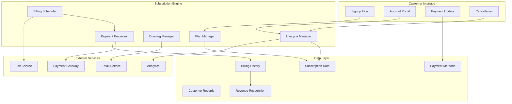
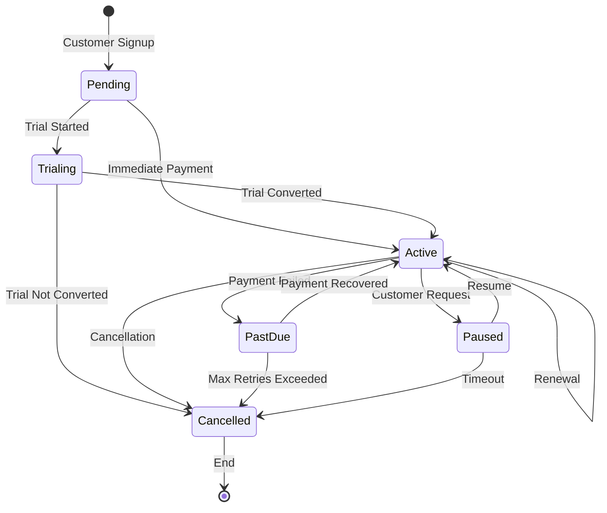
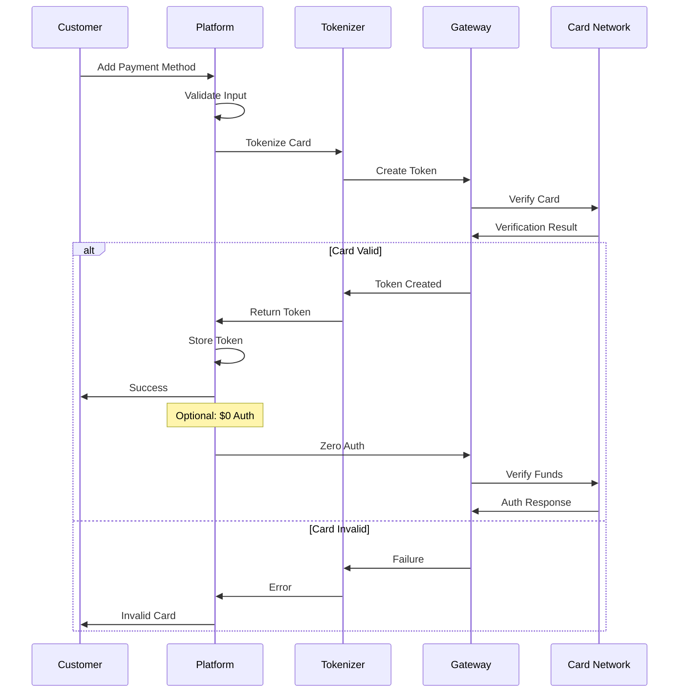
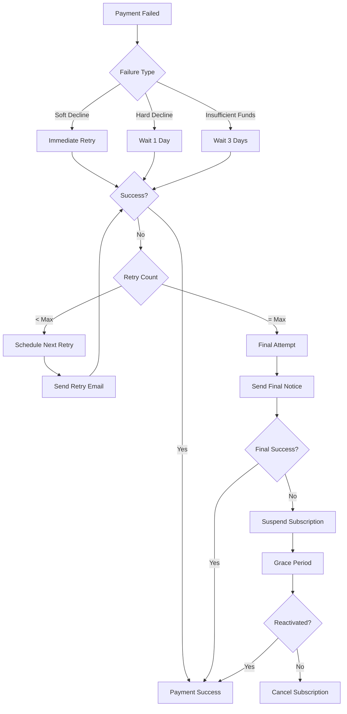
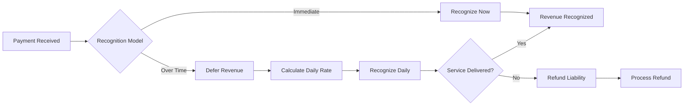

# Subscription and Recurring Payment Flows

## Overview
Subscription and recurring payments are automated payment models where customers are charged on a regular schedule for ongoing access to products or services. This document details the technical implementation, lifecycle management, and best practices for recurring payment systems.

## Subscription Payment Architecture

### Core Components



## Subscription Lifecycle Management

### 1. Subscription States



### 2. Lifecycle Event Handlers

```python
class SubscriptionLifecycleManager:
    def __init__(self):
        self.event_handlers = {
            'subscription.created': self.handle_creation,
            'subscription.activated': self.handle_activation,
            'subscription.renewed': self.handle_renewal,
            'subscription.updated': self.handle_update,
            'subscription.paused': self.handle_pause,
            'subscription.resumed': self.handle_resume,
            'subscription.cancelled': self.handle_cancellation,
            'subscription.expired': self.handle_expiration
        }
        
    async def handle_creation(self, subscription):
        # Set up initial billing
        if subscription.trial_days > 0:
            await self.schedule_trial_end(subscription)
        else:
            await self.process_initial_payment(subscription)
        
        # Send welcome email
        await self.notifications.send_welcome(subscription)
        
        # Set up recurring billing
        await self.scheduler.create_billing_schedule(subscription)
        
        # Track metrics
        await self.analytics.track('subscription.created', {
            'plan': subscription.plan_id,
            'value': subscription.amount,
            'source': subscription.signup_source
        })
    
    async def handle_renewal(self, subscription):
        try:
            # Process payment
            payment = await self.process_recurring_payment(subscription)
            
            # Update next billing date
            subscription.next_billing_date = self.calculate_next_billing(
                subscription
            )
            
            # Generate invoice
            invoice = await self.generate_invoice(subscription, payment)
            
            # Update metrics
            await self.update_mrr(subscription)
            
            # Send confirmation
            await self.notifications.send_renewal_success(
                subscription, 
                invoice
            )
            
        except PaymentFailure as e:
            await self.dunning_manager.start_recovery(subscription, e)
```

## Payment Method Management

### 1. Multi-Payment Method Support

```yaml
supported_payment_methods:
  credit_card:
    types: [visa, mastercard, amex, discover]
    features:
      - tokenization
      - 3ds_support
      - auto_update
    retry_strategy: standard
    
  debit_card:
    types: [visa_debit, mastercard_debit]
    features:
      - tokenization
      - lower_retry_count
    retry_strategy: conservative
    
  bank_account:
    types: [ach, sepa_debit, bacs]
    features:
      - mandate_required
      - async_validation
    retry_strategy: bank_specific
    
  digital_wallet:
    types: [paypal, apple_pay, google_pay]
    features:
      - wallet_token
      - biometric_auth
    retry_strategy: immediate
    
  invoice:
    types: [net30, net60]
    features:
      - offline_payment
      - manual_reconciliation
    retry_strategy: none
```

### 2. Payment Method Lifecycle



### 3. Payment Method Updater

```python
class PaymentMethodUpdater:
    def __init__(self):
        self.update_services = {
            'visa': VisaAccountUpdater(),
            'mastercard': MastercardAutomaticBillingUpdater(),
            'discover': DiscoverAccountUpdater()
        }
        
    async def check_for_updates(self):
        # Get all stored payment methods
        payment_methods = await self.get_expiring_cards(
            days_ahead=60  # Check 60 days in advance
        )
        
        updates = []
        for method in payment_methods:
            service = self.update_services.get(method.brand)
            if service:
                update = await service.check_update(method)
                if update:
                    updates.append({
                        'method': method,
                        'update': update
                    })
        
        # Process updates
        for item in updates:
            await self.apply_update(item['method'], item['update'])
            
    async def apply_update(self, method, update):
        if update.type == 'new_card_number':
            await self.update_card_number(method, update.new_number)
        elif update.type == 'new_expiry':
            await self.update_expiry(method, update.new_expiry)
        elif update.type == 'card_closed':
            await self.mark_card_invalid(method)
            await self.notify_customer_update_needed(method)
```

## Billing Cycles and Scheduling

### 1. Flexible Billing Cycles

```javascript
class BillingScheduler {
    constructor() {
        this.cycles = {
            daily: { interval: 1, unit: 'day' },
            weekly: { interval: 7, unit: 'day' },
            biweekly: { interval: 14, unit: 'day' },
            monthly: { interval: 1, unit: 'month' },
            quarterly: { interval: 3, unit: 'month' },
            semiannual: { interval: 6, unit: 'month' },
            annual: { interval: 1, unit: 'year' }
        };
    }
    
    calculateNextBillingDate(subscription) {
        const cycle = this.cycles[subscription.billing_cycle];
        const anchorDate = subscription.billing_anchor || subscription.start_date;
        
        if (subscription.billing_cycle === 'monthly') {
            // Handle month-end edge cases
            return this.handleMonthlyBilling(anchorDate, subscription);
        }
        
        return moment(subscription.current_period_end)
            .add(cycle.interval, cycle.unit)
            .toDate();
    }
    
    handleMonthlyBilling(anchorDate, subscription) {
        const anchorDay = moment(anchorDate).date();
        const nextMonth = moment(subscription.current_period_end).add(1, 'month');
        
        // If anchor day doesn't exist in next month (e.g., 31st)
        if (anchorDay > nextMonth.daysInMonth()) {
            return nextMonth.endOf('month').toDate();
        }
        
        return nextMonth.date(anchorDay).toDate();
    }
}
```

### 2. Proration Calculations

```python
class ProrationCalculator:
    def calculate_proration(self, subscription, change_type, effective_date=None):
        if not effective_date:
            effective_date = datetime.now()
            
        current_period_start = subscription.current_period_start
        current_period_end = subscription.current_period_end
        
        # Calculate days in period and days remaining
        total_days = (current_period_end - current_period_start).days
        days_used = (effective_date - current_period_start).days
        days_remaining = total_days - days_used
        
        if change_type == 'upgrade':
            # Calculate additional charge
            old_daily_rate = subscription.current_price / total_days
            new_daily_rate = subscription.new_price / total_days
            
            proration_amount = (new_daily_rate - old_daily_rate) * days_remaining
            
            return {
                'amount': max(0, proration_amount),
                'description': f'Proration for upgrade ({days_remaining} days)',
                'line_items': [
                    {
                        'description': f'Unused time on {subscription.current_plan}',
                        'amount': -(old_daily_rate * days_remaining)
                    },
                    {
                        'description': f'Remaining time on {subscription.new_plan}',
                        'amount': new_daily_rate * days_remaining
                    }
                ]
            }
            
        elif change_type == 'downgrade':
            # Calculate credit
            old_daily_rate = subscription.current_price / total_days
            new_daily_rate = subscription.new_price / total_days
            
            credit_amount = (old_daily_rate - new_daily_rate) * days_remaining
            
            return {
                'amount': -max(0, credit_amount),
                'description': f'Credit for downgrade ({days_remaining} days)',
                'apply_next_invoice': True
            }
```

## Dunning Management

### 1. Smart Retry Logic



### 2. Dunning Configuration

```yaml
dunning_strategies:
  standard:
    max_retries: 4
    retry_schedule:
      - delay: 0    # Immediate
        email: false
      - delay: 3    # 3 days
        email: payment_failed_gentle
      - delay: 5    # 5 days later
        email: payment_failed_urgent
      - delay: 7    # 7 days later
        email: payment_failed_final
    grace_period: 7
    
  premium:
    max_retries: 6
    retry_schedule:
      - delay: 0
        email: false
      - delay: 1
        email: payment_issue_noticed
      - delay: 3
        email: payment_failed_gentle
      - delay: 5
        email: payment_failed_urgent
      - delay: 7
        email: account_team_notification
      - delay: 10
        email: payment_failed_final
    grace_period: 14
    features_during_dunning: full_access
    
  high_risk:
    max_retries: 2
    retry_schedule:
      - delay: 0
        email: false
      - delay: 1
        email: payment_required
    grace_period: 0
    features_during_dunning: limited_access
```

### 3. Intelligent Dunning

```python
class IntelligentDunningManager:
    def __init__(self):
        self.ml_model = load_model('dunning_success_predictor')
        self.payment_processor = PaymentProcessor()
        
    async def optimize_retry_strategy(self, subscription, failure):
        # Get customer profile
        profile = await self.build_customer_profile(subscription)
        
        # Predict best retry strategy
        features = self.extract_features(profile, failure)
        predictions = {}
        
        for strategy in self.available_strategies:
            success_prob = self.ml_model.predict_proba(
                np.append(features, strategy.encode())
            )[0][1]
            predictions[strategy] = success_prob
        
        # Select optimal strategy
        best_strategy = max(predictions.items(), key=lambda x: x[1])
        
        # Apply personalization
        return self.personalize_strategy(
            best_strategy[0], 
            profile,
            failure
        )
    
    def personalize_strategy(self, base_strategy, profile, failure):
        strategy = copy.deepcopy(base_strategy)
        
        # Adjust based on customer value
        if profile.ltv > 1000:
            strategy.max_retries += 2
            strategy.grace_period += 7
            
        # Adjust based on payment history
        if profile.successful_payments > 12:
            strategy.retry_delays = [0, 2, 5, 7, 10]  # More aggressive
            
        # Adjust based on failure type
        if failure.code == 'insufficient_funds':
            # Likely temporary, wait for payday
            strategy.retry_delays = [0, 4, 7, 14]
            
        return strategy
```

## Revenue Recognition

### 1. Revenue Recognition Rules



### 2. Revenue Tracking

```python
class RevenueRecognitionEngine:
    def __init__(self):
        self.recognition_rules = {
            'immediate': self.recognize_immediate,
            'straight_line': self.recognize_straight_line,
            'milestone': self.recognize_milestone,
            'usage': self.recognize_usage
        }
        
    async def process_payment(self, payment, subscription):
        # Determine recognition model
        model = self.get_recognition_model(subscription.product_type)
        
        # Create revenue record
        revenue_record = {
            'payment_id': payment.id,
            'subscription_id': subscription.id,
            'amount': payment.amount,
            'currency': payment.currency,
            'recognition_model': model,
            'period_start': subscription.current_period_start,
            'period_end': subscription.current_period_end
        }
        
        # Apply recognition rules
        recognition_schedule = await self.recognition_rules[model](
            revenue_record
        )
        
        # Save schedule
        await self.save_recognition_schedule(recognition_schedule)
        
        # Update accounting
        await self.update_deferred_revenue(recognition_schedule)
        
    async def recognize_straight_line(self, record):
        days_in_period = (record['period_end'] - record['period_start']).days
        daily_amount = record['amount'] / days_in_period
        
        schedule = []
        current_date = record['period_start']
        
        while current_date < record['period_end']:
            schedule.append({
                'date': current_date,
                'amount': daily_amount,
                'status': 'scheduled'
            })
            current_date += timedelta(days=1)
            
        return schedule
```

## Subscription Analytics

### 1. Key Metrics Calculation

```python
class SubscriptionMetrics:
    def calculate_mrr(self, subscriptions):
        """Monthly Recurring Revenue"""
        mrr = 0
        for sub in subscriptions:
            if sub.status == 'active':
                if sub.billing_cycle == 'monthly':
                    mrr += sub.amount
                elif sub.billing_cycle == 'annual':
                    mrr += sub.amount / 12
                elif sub.billing_cycle == 'quarterly':
                    mrr += sub.amount / 3
        return mrr
    
    def calculate_arr(self, mrr):
        """Annual Recurring Revenue"""
        return mrr * 12
    
    def calculate_churn_rate(self, period_start, period_end):
        """Customer Churn Rate"""
        customers_start = self.get_active_customers(period_start)
        customers_lost = self.get_churned_customers(period_start, period_end)
        
        if customers_start == 0:
            return 0
            
        return (customers_lost / customers_start) * 100
    
    def calculate_ltv(self, average_revenue_per_user, churn_rate):
        """Customer Lifetime Value"""
        if churn_rate == 0:
            return float('inf')
            
        return average_revenue_per_user / (churn_rate / 100)
    
    def calculate_cac_payback(self, cac, average_revenue_per_user):
        """Customer Acquisition Cost Payback Period (months)"""
        if average_revenue_per_user == 0:
            return float('inf')
            
        return cac / average_revenue_per_user
```

### 2. Cohort Analysis

```sql
-- Monthly Revenue Cohort Analysis
WITH cohorts AS (
    SELECT 
        DATE_TRUNC('month', first_payment_date) as cohort_month,
        customer_id,
        subscription_id
    FROM subscriptions
    WHERE first_payment_date IS NOT NULL
),
revenue_by_month AS (
    SELECT
        c.cohort_month,
        DATE_TRUNC('month', p.payment_date) as revenue_month,
        c.customer_id,
        SUM(p.amount) as revenue
    FROM cohorts c
    JOIN payments p ON c.subscription_id = p.subscription_id
    WHERE p.status = 'succeeded'
    GROUP BY 1, 2, 3
)
SELECT
    cohort_month,
    revenue_month,
    EXTRACT(month FROM AGE(revenue_month, cohort_month)) as months_since_start,
    COUNT(DISTINCT customer_id) as active_customers,
    SUM(revenue) as total_revenue,
    SUM(revenue) / COUNT(DISTINCT customer_id) as revenue_per_customer
FROM revenue_by_month
GROUP BY 1, 2, 3
ORDER BY 1, 3;
```

## Integration Patterns

### 1. Webhook Event System

```yaml
webhook_events:
  subscription:
    - subscription.created
    - subscription.updated
    - subscription.activated
    - subscription.renewed
    - subscription.pending_cancellation
    - subscription.cancelled
    - subscription.reactivated
    - subscription.paused
    - subscription.resumed
    
  payment:
    - payment.succeeded
    - payment.failed
    - payment.action_required
    - payment_method.attached
    - payment_method.updated
    - payment_method.detached
    
  invoice:
    - invoice.created
    - invoice.finalized
    - invoice.paid
    - invoice.payment_failed
    - invoice.voided
    
  customer:
    - customer.created
    - customer.updated
    - customer.deleted
    - customer.subscription.created
    - customer.subscription.deleted
```

### 2. API Design

```python
@app.route('/api/v1/subscriptions', methods=['POST'])
async def create_subscription():
    """
    Create a new subscription
    
    Request body:
    {
        "customer_id": "cus_123",
        "plan_id": "plan_monthly_pro",
        "payment_method_id": "pm_456",
        "trial_days": 14,
        "metadata": {
            "source": "website",
            "campaign": "summer_promo"
        }
    }
    """
    data = await request.json()
    
    # Validate customer
    customer = await get_customer(data['customer_id'])
    if not customer:
        return {'error': 'Customer not found'}, 404
    
    # Validate plan
    plan = await get_plan(data['plan_id'])
    if not plan:
        return {'error': 'Plan not found'}, 404
    
    # Create subscription
    subscription = await subscription_manager.create(
        customer=customer,
        plan=plan,
        payment_method_id=data.get('payment_method_id'),
        trial_days=data.get('trial_days', 0),
        metadata=data.get('metadata', {})
    )
    
    return {
        'subscription': subscription.to_dict(),
        'next_billing_date': subscription.next_billing_date.isoformat()
    }, 201
```

## Best Practices

### For Subscription Platforms

1. **Flexible Billing**
   - Support multiple billing cycles
   - Allow mid-cycle changes
   - Implement fair proration
   - Handle timezone properly

2. **Payment Resilience**
   - Implement smart retry logic
   - Use payment method updater
   - Offer backup payment methods
   - Communicate clearly during dunning

3. **Customer Experience**
   - Easy cancellation process
   - Clear billing statements
   - Self-service portal
   - Transparent pricing

### For Merchants

1. **Retention Strategies**
   - Monitor churn indicators
   - Implement win-back campaigns
   - Offer pause options
   - Provide downgrade paths

2. **Revenue Optimization**
   - Test pricing strategies
   - Implement usage-based tiers
   - Offer annual discounts
   - Bundle products effectively

### For Developers

1. **Technical Implementation**
   - Use idempotency keys
   - Implement proper webhooks
   - Handle edge cases
   - Test thoroughly

2. **Data Management**
   - Track state changes
   - Maintain audit logs
   - Regular backups
   - GDPR compliance

## Future Trends

### 1. AI-Powered Optimization
- Churn prediction
- Optimal pricing
- Personalized offers
- Automated dunning

### 2. Embedded Subscriptions
- API-first platforms
- White-label solutions
- Marketplace models
- Cross-platform sync

### 3. Advanced Models
- Usage-based billing
- Hybrid pricing
- Dynamic pricing
- Outcome-based pricing

### 4. Payment Innovation
- Cryptocurrency payments
- Real-time settlements
- Open banking
- Biometric authentication