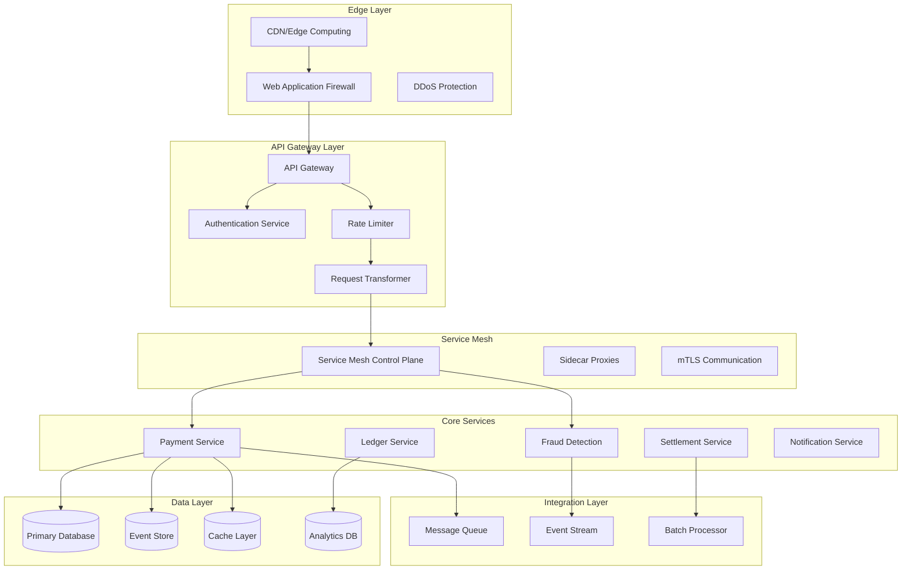

# Payment Systems Technical Architecture Patterns

## Executive Summary

This document provides a comprehensive technical architecture framework for modern payment systems, covering API patterns, microservices design, event-driven architectures, security implementations, and emerging technology integrations. It serves as a technical blueprint for building scalable, secure, and compliant payment infrastructures.

## Table of Contents

1. [Architecture Overview](#architecture-overview)
2. [API Gateway Patterns](#api-gateway-patterns)
3. [Microservices Architecture](#microservices-architecture)
4. [Event-Driven Architecture](#event-driven-architecture)
5. [Data Architecture Patterns](#data-architecture-patterns)
6. [Security Architecture](#security-architecture)
7. [Integration Patterns](#integration-patterns)
8. [Technology Stack Analysis](#technology-stack-analysis)
9. [Performance Architecture](#performance-architecture)
10. [Emerging Technologies](#emerging-technologies)

## Architecture Overview

### Core Architecture Principles

```yaml
principles:
  scalability:
    - Horizontal scaling as primary strategy
    - Stateless service design
    - Database sharding patterns
    - Load distribution algorithms
    
  reliability:
    - Zero single points of failure
    - Circuit breaker patterns
    - Graceful degradation
    - Automated failover
    
  security:
    - Defense in depth
    - Zero trust networking
    - End-to-end encryption
    - Continuous compliance
    
  performance:
    - Sub-second latency targets
    - Caching at multiple layers
    - Asynchronous processing
    - Resource optimization
```

### Reference Architecture



## API Gateway Patterns

### Unified API Gateway Architecture

```python
class PaymentAPIGateway:
    """
    Central API gateway for all payment operations
    """
    def __init__(self):
        self.auth_manager = AuthenticationManager()
        self.rate_limiter = AdvancedRateLimiter()
        self.circuit_breaker = CircuitBreakerManager()
        self.request_validator = RequestValidator()
        self.response_transformer = ResponseTransformer()
        self.analytics = AnalyticsCollector()
        
    async def handle_request(self, request: Request) -> Response:
        # Pre-processing pipeline
        async with self.analytics.track_request(request) as tracker:
            # 1. Authentication & Authorization
            auth_context = await self.auth_manager.authenticate(request)
            if not auth_context.is_valid:
                return self.auth_manager.unauthorized_response()
            
            # 2. Rate limiting with adaptive algorithms
            rate_limit_result = await self.rate_limiter.check_adaptive_limit(
                client_id=auth_context.client_id,
                endpoint=request.path,
                client_tier=auth_context.tier
            )
            
            if rate_limit_result.exceeded:
                return self.rate_limit_response(rate_limit_result)
            
            # 3. Request validation and sanitization
            validation_result = await self.request_validator.validate(
                request=request,
                schema=self.get_endpoint_schema(request.path)
            )
            
            if not validation_result.is_valid:
                return self.validation_error_response(validation_result)
            
            # 4. Circuit breaker protection
            service = self.resolve_service(request.path)
            breaker = self.circuit_breaker.get_breaker(service.name)
            
            try:
                # 5. Service invocation with timeout
                response = await breaker.call_async(
                    service.handle_request,
                    request,
                    timeout=self.get_timeout_for_endpoint(request.path)
                )
                
                # 6. Response transformation
                transformed_response = await self.response_transformer.transform(
                    response=response,
                    client_context=auth_context,
                    request=request
                )
                
                tracker.record_success()
                return transformed_response
                
            except CircuitBreakerOpen:
                tracker.record_circuit_breaker_open()
                return self.service_unavailable_response()
            except TimeoutError:
                tracker.record_timeout()
                return self.timeout_response()
            except Exception as e:
                tracker.record_error(e)
                return self.error_response(e)
```

### Advanced Rate Limiting Strategies

```python
class AdaptiveRateLimiter:
    """
    Machine learning-based adaptive rate limiting
    """
    def __init__(self):
        self.ml_model = self.load_ml_model()
        self.strategies = {
            'token_bucket': TokenBucketStrategy(),
            'sliding_window': SlidingWindowLogStrategy(),
            'leaky_bucket': LeakyBucketStrategy(),
            'adaptive': AdaptiveWindowStrategy()
        }
        
    async def check_adaptive_limit(
        self,
        client_id: str,
        endpoint: str,
        client_tier: str
    ) -> RateLimitResult:
        # Get client behavior profile
        behavior_profile = await self.get_client_behavior(client_id)
        
        # ML model predicts optimal rate limit
        predicted_limits = self.ml_model.predict({
            'client_behavior': behavior_profile,
            'endpoint': endpoint,
            'time_of_day': datetime.now().hour,
            'day_of_week': datetime.now().weekday(),
            'client_tier': client_tier,
            'current_load': await self.get_system_load()
        })
        
        # Select strategy based on prediction
        strategy = self.select_strategy(predicted_limits)
        
        # Apply multi-tier rate limiting
        results = []
        
        # Per-second burst limit
        burst_result = await strategy.check_limit(
            key=f"{client_id}:burst",
            limit=predicted_limits.burst_limit,
            window=1
        )
        results.append(burst_result)
        
        # Sustained rate limit
        sustained_result = await strategy.check_limit(
            key=f"{client_id}:sustained",
            limit=predicted_limits.sustained_limit,
            window=60
        )
        results.append(sustained_result)
        
        # Daily quota
        quota_result = await strategy.check_limit(
            key=f"{client_id}:quota",
            limit=predicted_limits.daily_quota,
            window=86400
        )
        results.append(quota_result)
        
        # Return most restrictive result
        return self.combine_results(results)
```

### GraphQL Federation for Payment APIs

```graphql
# Payment Federation Schema
type Payment @key(fields: "id") {
  id: ID!
  amount: Money!
  status: PaymentStatus!
  method: PaymentMethod!
  merchant: Merchant!
  customer: Customer!
  
  # Federation fields
  authorization: Authorization @requires(fields: "status")
  captures: [Capture!]! @requires(fields: "status")
  refunds: [Refund!]!
  disputes: [Dispute!]!
  
  # Real-time fields
  riskScore: Float! @live
  fraudAlerts: [FraudAlert!]! @live
}

extend type Merchant @key(fields: "id") {
  id: ID! @external
  payments: PaymentConnection!
  paymentStats: PaymentStatistics!
}

type Subscription {
  # Real-time payment updates
  paymentStatusUpdated(
    merchantId: ID!
    statuses: [PaymentStatus!]
  ): Payment! @withAuth(scopes: ["payments:read"])
  
  # Fraud monitoring
  fraudAlertTriggered(
    merchantId: ID!
    severity: AlertSeverity
  ): FraudAlert! @withAuth(scopes: ["fraud:monitor"])
  
  # Settlement notifications
  settlementCompleted(
    merchantId: ID!
  ): Settlement! @withAuth(scopes: ["settlements:read"])
}
```

## Microservices Architecture

### Service Decomposition Strategy

```yaml
services:
  # Core Payment Services
  payment-service:
    responsibilities:
      - Payment initiation
      - Payment state management
      - Provider routing
    technologies:
      - Language: Java/Spring Boot
      - Database: PostgreSQL
      - Cache: Redis
    scaling:
      - Horizontal auto-scaling
      - Regional deployment
      
  authorization-service:
    responsibilities:
      - Real-time authorization
      - 3DS orchestration
      - Risk assessment integration
    technologies:
      - Language: Go
      - Database: ScyllaDB
      - Cache: Hazelcast
    performance:
      - P99 latency: < 100ms
      - Throughput: 50K TPS
      
  settlement-service:
    responsibilities:
      - Batch processing
      - Net settlement calculation
      - Settlement file generation
    technologies:
      - Language: Python/Airflow
      - Database: PostgreSQL
      - Storage: S3
    scheduling:
      - Cron-based triggers
      - Event-driven processing
      
  ledger-service:
    responsibilities:
      - Double-entry bookkeeping
      - Balance management
      - Audit trail
    technologies:
      - Language: Rust
      - Database: CockroachDB
      - Consistency: Strong ACID
```

### Inter-Service Communication Patterns

```go
// Service mesh communication with circuit breaking
type PaymentServiceClient struct {
    httpClient     *http.Client
    circuitBreaker *gobreaker.CircuitBreaker
    tracer         opentracing.Tracer
    metrics        *prometheus.Registry
}

func (c *PaymentServiceClient) AuthorizePayment(
    ctx context.Context,
    req *AuthorizationRequest,
) (*AuthorizationResponse, error) {
    span, ctx := opentracing.StartSpanFromContext(
        ctx,
        "PaymentService.AuthorizePayment",
    )
    defer span.Finish()
    
    // Circuit breaker wrapper
    result, err := c.circuitBreaker.Execute(func() (interface{}, error) {
        // Distributed tracing
        carrier := opentracing.HTTPHeadersCarrier(make(http.Header))
        c.tracer.Inject(
            span.Context(),
            opentracing.HTTPHeaders,
            carrier,
        )
        
        // Build request with timeout
        httpReq, err := http.NewRequestWithContext(
            ctx,
            "POST",
            "/internal/v1/authorize",
            bytes.NewReader(req.Marshal()),
        )
        if err != nil {
            return nil, err
        }
        
        // Add headers
        httpReq.Header = http.Header(carrier)
        httpReq.Header.Set("Content-Type", "application/x-protobuf")
        
        // Execute with metrics
        timer := prometheus.NewTimer(
            c.metrics.HistogramVec(
                "payment_authorization_duration",
                []string{"status"},
            ),
        )
        
        resp, err := c.httpClient.Do(httpReq)
        timer.ObserveDuration()
        
        if err != nil {
            c.metrics.Counter("payment_authorization_errors").Inc()
            return nil, err
        }
        defer resp.Body.Close()
        
        // Parse response
        var authResp AuthorizationResponse
        if err := authResp.Unmarshal(resp.Body); err != nil {
            return nil, err
        }
        
        return &authResp, nil
    })
    
    if err != nil {
        return nil, fmt.Errorf("authorization failed: %w", err)
    }
    
    return result.(*AuthorizationResponse), nil
}
```

### Service Discovery and Load Balancing

```yaml
# Consul service definition
services:
  - name: payment-service
    id: payment-service-1
    address: 10.0.1.10
    port: 8080
    tags:
      - version:v2.3.0
      - region:us-east-1
      - env:production
    meta:
      protocol: grpc
      weight: 100
    checks:
      - name: Health check
        http: http://10.0.1.10:8080/health
        interval: 10s
        timeout: 3s
      - name: gRPC health
        grpc: 10.0.1.10:8080
        grpc_use_tls: true
        interval: 10s
    weights:
      passing: 10
      warning: 1
```

## Event-Driven Architecture

### Event Sourcing Implementation

```python
class PaymentEventStore:
    """
    Event sourcing for payment transactions
    """
    def __init__(self, event_store_client, snapshot_store):
        self.event_store = event_store_client
        self.snapshot_store = snapshot_store
        self.event_handlers = {}
        
    async def append_event(
        self,
        aggregate_id: str,
        event: PaymentEvent,
        expected_version: int = None
    ):
        # Serialize event
        event_data = EventData(
            event_id=str(uuid.uuid4()),
            event_type=event.__class__.__name__,
            data=event.to_json(),
            metadata={
                'timestamp': datetime.utcnow().isoformat(),
                'aggregate_id': aggregate_id,
                'user_id': event.user_id,
                'correlation_id': event.correlation_id
            }
        )
        
        # Append with optimistic concurrency control
        stream_name = f"payment-{aggregate_id}"
        await self.event_store.append_to_stream(
            stream_name=stream_name,
            events=[event_data],
            expected_version=expected_version
        )
        
        # Publish to event bus for projections
        await self.publish_event(aggregate_id, event)
        
    async def get_events(
        self,
        aggregate_id: str,
        from_version: int = 0
    ) -> List[PaymentEvent]:
        # Check for snapshot
        snapshot = await self.snapshot_store.get_latest_snapshot(aggregate_id)
        
        if snapshot:
            from_version = snapshot.version + 1
            
        # Read events from stream
        stream_name = f"payment-{aggregate_id}"
        events = await self.event_store.read_stream(
            stream_name=stream_name,
            from_version=from_version
        )
        
        # Deserialize events
        return [self.deserialize_event(e) for e in events]
        
    async def get_payment_aggregate(
        self,
        aggregate_id: str
    ) -> PaymentAggregate:
        # Load from snapshot if available
        snapshot = await self.snapshot_store.get_latest_snapshot(aggregate_id)
        
        if snapshot:
            aggregate = PaymentAggregate.from_snapshot(snapshot)
            from_version = snapshot.version + 1
        else:
            aggregate = PaymentAggregate(aggregate_id)
            from_version = 0
            
        # Apply events since snapshot
        events = await self.get_events(aggregate_id, from_version)
        for event in events:
            aggregate.apply_event(event)
            
        return aggregate
```

### CQRS Pattern Implementation

```python
class PaymentCommandHandler:
    """
    Command side of CQRS pattern
    """
    def __init__(self, event_store, payment_service):
        self.event_store = event_store
        self.payment_service = payment_service
        
    async def handle_initiate_payment(
        self,
        command: InitiatePaymentCommand
    ) -> PaymentInitiatedEvent:
        # Load aggregate
        aggregate = await self.event_store.get_payment_aggregate(
            command.payment_id
        )
        
        # Business logic validation
        if aggregate.status != PaymentStatus.NEW:
            raise PaymentAlreadyInitiatedException()
            
        # Process with payment service
        provider_response = await self.payment_service.initiate_payment(
            amount=command.amount,
            currency=command.currency,
            payment_method=command.payment_method
        )
        
        # Create and apply event
        event = PaymentInitiatedEvent(
            payment_id=command.payment_id,
            amount=command.amount,
            currency=command.currency,
            payment_method=command.payment_method,
            provider_reference=provider_response.reference,
            timestamp=datetime.utcnow()
        )
        
        # Store event
        await self.event_store.append_event(
            aggregate_id=command.payment_id,
            event=event,
            expected_version=aggregate.version
        )
        
        return event


class PaymentQueryHandler:
    """
    Query side of CQRS pattern
    """
    def __init__(self, read_model_db):
        self.db = read_model_db
        
    async def get_payment_details(
        self,
        payment_id: str
    ) -> PaymentDetailsDTO:
        # Query optimized read model
        query = """
            SELECT 
                p.payment_id,
                p.amount,
                p.currency,
                p.status,
                p.created_at,
                p.updated_at,
                pm.type as payment_method_type,
                pm.last_four,
                m.name as merchant_name,
                c.email as customer_email
            FROM payments p
            JOIN payment_methods pm ON p.payment_method_id = pm.id
            JOIN merchants m ON p.merchant_id = m.id
            JOIN customers c ON p.customer_id = c.id
            WHERE p.payment_id = $1
        """
        
        result = await self.db.fetch_one(query, payment_id)
        
        if not result:
            raise PaymentNotFoundException(payment_id)
            
        return PaymentDetailsDTO(**result)
```

### Saga Pattern for Distributed Transactions

```python
class PaymentSagaOrchestrator:
    """
    Orchestration-based saga for complex payment flows
    """
    def __init__(self, saga_log, service_clients):
        self.saga_log = saga_log
        self.services = service_clients
        
    async def execute_payment_saga(
        self,
        saga_id: str,
        payment_request: PaymentRequest
    ):
        saga = PaymentSaga(saga_id)
        
        try:
            # Step 1: Validate payment method
            await self.execute_step(
                saga,
                step_name="validate_payment_method",
                action=lambda: self.services.payment_method.validate(
                    payment_request.payment_method_id
                ),
                compensation=lambda: self.services.payment_method.unlock(
                    payment_request.payment_method_id
                )
            )
            
            # Step 2: Check fraud
            await self.execute_step(
                saga,
                step_name="fraud_check",
                action=lambda: self.services.fraud.check_transaction(
                    payment_request
                ),
                compensation=lambda: self.services.fraud.release_hold(
                    saga_id
                )
            )
            
            # Step 3: Reserve funds
            await self.execute_step(
                saga,
                step_name="reserve_funds",
                action=lambda: self.services.account.reserve_funds(
                    account_id=payment_request.account_id,
                    amount=payment_request.amount
                ),
                compensation=lambda: self.services.account.release_funds(
                    reservation_id=saga.get_step_result("reserve_funds").reservation_id
                )
            )
            
            # Step 4: Process with payment provider
            await self.execute_step(
                saga,
                step_name="process_payment",
                action=lambda: self.services.payment_provider.authorize(
                    payment_request
                ),
                compensation=lambda: self.services.payment_provider.void(
                    authorization_id=saga.get_step_result("process_payment").auth_id
                )
            )
            
            # Step 5: Update ledger
            await self.execute_step(
                saga,
                step_name="update_ledger",
                action=lambda: self.services.ledger.record_transaction(
                    transaction=self.build_transaction(saga, payment_request)
                ),
                compensation=lambda: self.services.ledger.reverse_transaction(
                    transaction_id=saga.get_step_result("update_ledger").transaction_id
                )
            )
            
            # Mark saga as completed
            await self.saga_log.mark_completed(saga)
            
        except Exception as e:
            # Compensate in reverse order
            await self.compensate_saga(saga)
            await self.saga_log.mark_failed(saga, str(e))
            raise PaymentSagaFailedException(saga_id, str(e))
    
    async def execute_step(self, saga, step_name, action, compensation):
        step = SagaStep(step_name, action, compensation)
        saga.add_step(step)
        
        # Log step start
        await self.saga_log.log_step_start(saga.id, step_name)
        
        try:
            # Execute action
            result = await action()
            step.result = result
            
            # Log step success
            await self.saga_log.log_step_success(saga.id, step_name, result)
            
            return result
            
        except Exception as e:
            # Log step failure
            await self.saga_log.log_step_failure(saga.id, step_name, str(e))
            raise
```

## Data Architecture Patterns

### Multi-Model Database Strategy

```yaml
database_strategy:
  transactional_data:
    technology: PostgreSQL / CockroachDB
    use_cases:
      - Payment transactions
      - Account balances
      - Merchant configuration
    features:
      - ACID compliance
      - Multi-region replication
      - Automatic sharding
      
  event_store:
    technology: Apache Kafka / EventStore
    use_cases:
      - Payment events
      - Audit trail
      - Event sourcing
    features:
      - Immutable log
      - High throughput
      - Long-term retention
      
  analytical_data:
    technology: Snowflake / BigQuery
    use_cases:
      - Business intelligence
      - Fraud analysis
      - Financial reporting
    features:
      - Columnar storage
      - SQL analytics
      - ML integration
      
  cache_layer:
    technology: Redis / Hazelcast
    use_cases:
      - Session management
      - Rate limiting
      - Hot data caching
    features:
      - Sub-millisecond latency
      - Distributed caching
      - Data structures
      
  search_engine:
    technology: Elasticsearch
    use_cases:
      - Transaction search
      - Merchant search
      - Log analysis
    features:
      - Full-text search
      - Aggregations
      - Real-time indexing
```

### Database Sharding Patterns

```python
class PaymentDatabaseSharding:
    """
    Intelligent sharding for payment data
    """
    def __init__(self, shard_config):
        self.shard_config = shard_config
        self.shard_map = self.initialize_shard_map()
        
    def get_shard_key(self, payment: Payment) -> str:
        """
        Multi-dimensional sharding strategy
        """
        # Primary dimension: Merchant ID (even distribution)
        merchant_shard = self.hash_merchant_id(payment.merchant_id)
        
        # Secondary dimension: Time-based (for archival)
        time_shard = self.get_time_bucket(payment.created_at)
        
        # Composite shard key
        return f"{merchant_shard}:{time_shard}"
        
    def hash_merchant_id(self, merchant_id: str) -> int:
        """
        Consistent hashing for merchant distribution
        """
        hash_value = int(hashlib.md5(merchant_id.encode()).hexdigest(), 16)
        return hash_value % self.shard_config.num_shards
        
    def get_time_bucket(self, timestamp: datetime) -> str:
        """
        Time-based partitioning for efficient queries
        """
        if timestamp < datetime.now() - timedelta(days=90):
            return "archive"
        elif timestamp < datetime.now() - timedelta(days=30):
            return "warm"
        else:
            return "hot"
            
    def route_query(self, query: Query) -> List[ShardConnection]:
        """
        Intelligent query routing
        """
        if query.has_merchant_filter():
            # Route to specific shard
            shard_key = self.get_shard_key_for_merchant(query.merchant_id)
            return [self.shard_map[shard_key]]
        else:
            # Scatter-gather across shards
            return list(self.shard_map.values())
```

### Event Store Design

```sql
-- Event store schema
CREATE TABLE payment_events (
    event_id UUID PRIMARY KEY,
    aggregate_id UUID NOT NULL,
    aggregate_type VARCHAR(50) NOT NULL,
    event_type VARCHAR(100) NOT NULL,
    event_version INT NOT NULL,
    event_data JSONB NOT NULL,
    metadata JSONB NOT NULL,
    created_at TIMESTAMP WITH TIME ZONE DEFAULT NOW(),
    
    -- Indexes for efficient queries
    INDEX idx_aggregate_id (aggregate_id, event_version),
    INDEX idx_event_type (event_type, created_at),
    INDEX idx_created_at (created_at),
    
    -- Ensure event ordering
    UNIQUE (aggregate_id, event_version)
) PARTITION BY RANGE (created_at);

-- Create partitions
CREATE TABLE payment_events_2024_01 PARTITION OF payment_events
    FOR VALUES FROM ('2024-01-01') TO ('2024-02-01');

-- Optimized view for current state
CREATE MATERIALIZED VIEW payment_current_state AS
WITH latest_events AS (
    SELECT DISTINCT ON (aggregate_id)
        aggregate_id,
        event_data,
        event_version,
        created_at
    FROM payment_events
    WHERE event_type IN ('PaymentCompleted', 'PaymentFailed', 'PaymentRefunded')
    ORDER BY aggregate_id, event_version DESC
)
SELECT 
    aggregate_id as payment_id,
    event_data->>'status' as status,
    (event_data->>'amount')::DECIMAL as amount,
    event_data->>'currency' as currency,
    event_version as version,
    created_at as last_updated
FROM latest_events;

-- Refresh strategy
CREATE OR REPLACE FUNCTION refresh_payment_state()
RETURNS void AS $$
BEGIN
    REFRESH MATERIALIZED VIEW CONCURRENTLY payment_current_state;
END;
$$ LANGUAGE plpgsql;
```

## Security Architecture

### Zero Trust Security Model

```yaml
zero_trust_architecture:
  principles:
    - Never trust, always verify
    - Least privilege access
    - Assume breach
    - Verify explicitly
    
  implementation_layers:
    network_security:
      - Micro-segmentation
      - Service mesh with mTLS
      - Network policies
      - Encrypted communication
      
    identity_verification:
      - Multi-factor authentication
      - Certificate-based auth
      - Regular rotation
      - Hardware security modules
      
    access_control:
      - Role-based access (RBAC)
      - Attribute-based access (ABAC)
      - Just-in-time access
      - Privileged access management
      
    data_protection:
      - Encryption at rest
      - Encryption in transit
      - Tokenization
      - Key management service
      
    monitoring:
      - Continuous verification
      - Anomaly detection
      - Behavioral analytics
      - Real-time alerts
```

### Cryptographic Architecture

```python
class PaymentCryptographyService:
    """
    Comprehensive cryptography for payments
    """
    def __init__(self, hsm_client, kms_client):
        self.hsm = hsm_client
        self.kms = kms_client
        self.crypto_registry = self.initialize_algorithms()
        
    async def tokenize_card_number(
        self,
        card_number: str,
        merchant_id: str
    ) -> str:
        """
        Format-preserving encryption for PCI compliance
        """
        # Get merchant-specific key from HSM
        dek = await self.hsm.get_data_encryption_key(
            key_alias=f"merchant:{merchant_id}:card-tokenization"
        )
        
        # Apply FPE (Format Preserving Encryption)
        fpe_cipher = pyffx.Integer(
            dek,
            length=len(card_number),
            radix=10
        )
        
        # Tokenize while preserving format
        token = str(fpe_cipher.encrypt(int(card_number)))
        
        # Store mapping in secure vault
        await self.store_token_mapping(token, card_number, merchant_id)
        
        return token
        
    async def encrypt_sensitive_data(
        self,
        data: Dict[str, Any],
        classification: DataClassification
    ) -> EncryptedPayload:
        """
        Envelope encryption for sensitive data
        """
        # Generate data encryption key
        dek = secrets.token_bytes(32)  # 256-bit key
        
        # Encrypt DEK with KEK from KMS
        encrypted_dek = await self.kms.encrypt(
            key_id=self.get_kek_for_classification(classification),
            plaintext=dek
        )
        
        # Select algorithm based on classification
        if classification == DataClassification.HIGHLY_SENSITIVE:
            algorithm = self.crypto_registry['aes-256-gcm']
        else:
            algorithm = self.crypto_registry['aes-128-gcm']
            
        # Encrypt data
        ciphertext, tag, nonce = algorithm.encrypt(
            plaintext=json.dumps(data).encode(),
            key=dek,
            additional_data=classification.value.encode()
        )
        
        return EncryptedPayload(
            ciphertext=base64.b64encode(ciphertext).decode(),
            encrypted_dek=base64.b64encode(encrypted_dek).decode(),
            algorithm=algorithm.name,
            tag=base64.b64encode(tag).decode(),
            nonce=base64.b64encode(nonce).decode(),
            classification=classification
        )
        
    async def sign_payment_request(
        self,
        request: PaymentRequest,
        signing_key_id: str
    ) -> SignedPaymentRequest:
        """
        Digital signature for non-repudiation
        """
        # Canonicalize request
        canonical_request = self.canonicalize_request(request)
        
        # Get signing key from HSM
        signing_key = await self.hsm.get_signing_key(signing_key_id)
        
        # Create signature
        signature = signing_key.sign(
            canonical_request.encode(),
            padding.PSS(
                mgf=padding.MGF1(hashes.SHA256()),
                salt_length=padding.PSS.MAX_LENGTH
            ),
            hashes.SHA256()
        )
        
        return SignedPaymentRequest(
            request=request,
            signature=base64.b64encode(signature).decode(),
            signing_key_id=signing_key_id,
            algorithm="RSA-PSS-SHA256",
            timestamp=datetime.utcnow()
        )
```

### PCI DSS Compliance Architecture

```yaml
pci_dss_architecture:
  network_segmentation:
    dmz:
      - Web application firewall
      - Load balancers
      - API gateways
    
    cardholder_data_environment:
      - Payment processing servers
      - HSM appliances
      - Tokenization service
      
    restricted_zone:
      - Database servers
      - Key management service
      - Audit log storage
      
  security_controls:
    access_control:
      - Multi-factor authentication
      - Role-based permissions
      - Privileged access management
      - Regular access reviews
      
    encryption:
      - TLS 1.3 minimum
      - AES-256 for data at rest
      - Key rotation every 90 days
      - Secure key storage (HSM)
      
    monitoring:
      - File integrity monitoring
      - Intrusion detection
      - Security event logging
      - Real-time alerting
      
    vulnerability_management:
      - Quarterly scans
      - Annual penetration testing
      - Patch management
      - Configuration management
```

## Integration Patterns

### Multi-Protocol Integration Framework

```python
class PaymentIntegrationFramework:
    """
    Unified integration framework for payment providers
    """
    def __init__(self):
        self.protocols = {
            'rest': RESTProtocolAdapter(),
            'soap': SOAPProtocolAdapter(),
            'graphql': GraphQLProtocolAdapter(),
            'grpc': GRPCProtocolAdapter(),
            'iso8583': ISO8583ProtocolAdapter(),
            'iso20022': ISO20022ProtocolAdapter()
        }
        self.transformers = MessageTransformerRegistry()
        
    async def integrate_provider(
        self,
        provider_config: ProviderConfiguration
    ) -> ProviderIntegration:
        # Select protocol adapter
        adapter = self.protocols[provider_config.protocol]
        
        # Configure authentication
        auth_handler = self.create_auth_handler(provider_config.auth)
        
        # Set up message transformation
        transformer = self.transformers.get_transformer(
            source_format=provider_config.message_format,
            target_format='internal'
        )
        
        # Create integration
        integration = ProviderIntegration(
            adapter=adapter,
            auth_handler=auth_handler,
            transformer=transformer,
            config=provider_config
        )
        
        # Validate integration
        await self.validate_integration(integration)
        
        return integration
```

### ISO 20022 Message Processing

```python
class ISO20022MessageProcessor:
    """
    ISO 20022 standard message processing
    """
    def __init__(self):
        self.schema_validator = ISO20022SchemaValidator()
        self.message_mapper = ISO20022MessageMapper()
        
    async def process_incoming_message(
        self,
        raw_message: str,
        message_type: str
    ) -> ProcessedMessage:
        # Parse XML message
        parsed_message = etree.fromstring(raw_message.encode())
        
        # Validate against schema
        validation_result = self.schema_validator.validate(
            message=parsed_message,
            message_type=message_type
        )
        
        if not validation_result.is_valid:
            raise ISO20022ValidationError(validation_result.errors)
            
        # Extract business data
        if message_type == 'pacs.008':  # FI to FI Credit Transfer
            return await self.process_credit_transfer(parsed_message)
        elif message_type == 'pain.001':  # Customer Credit Transfer Initiation
            return await self.process_payment_initiation(parsed_message)
        elif message_type == 'camt.053':  # Bank to Customer Statement
            return await self.process_bank_statement(parsed_message)
        else:
            raise UnsupportedMessageTypeError(message_type)
            
    async def create_outgoing_message(
        self,
        message_type: str,
        business_data: Dict[str, Any]
    ) -> str:
        # Map to ISO 20022 structure
        message_structure = self.message_mapper.map_to_iso20022(
            message_type=message_type,
            data=business_data
        )
        
        # Build XML
        root = etree.Element(
            f"{{{ISO20022_NAMESPACE}}}{message_type}",
            nsmap={None: ISO20022_NAMESPACE}
        )
        
        self.build_xml_structure(root, message_structure)
        
        # Validate before sending
        self.schema_validator.validate(root, message_type)
        
        # Sign message if required
        if self.requires_signature(message_type):
            root = await self.sign_message(root)
            
        return etree.tostring(
            root,
            pretty_print=True,
            xml_declaration=True,
            encoding='UTF-8'
        ).decode()
```

### Webhook Management System

```python
class WebhookManagementSystem:
    """
    Enterprise-grade webhook management
    """
    def __init__(self, config):
        self.delivery_service = WebhookDeliveryService(config)
        self.subscription_manager = SubscriptionManager()
        self.circuit_breaker = CircuitBreakerFactory()
        self.metrics = WebhookMetrics()
        
    async def register_webhook(
        self,
        subscription: WebhookSubscription
    ) -> str:
        # Validate endpoint
        await self.validate_endpoint(subscription.url)
        
        # Generate shared secret
        subscription.secret = secrets.token_urlsafe(32)
        
        # Store subscription
        subscription_id = await self.subscription_manager.create(subscription)
        
        # Send verification challenge
        await self.send_verification_challenge(subscription)
        
        return subscription_id
        
    async def dispatch_event(
        self,
        event: Event,
        filter_criteria: Optional[Dict] = None
    ):
        # Get matching subscriptions
        subscriptions = await self.subscription_manager.find_subscriptions(
            event_type=event.type,
            filter_criteria=filter_criteria
        )
        
        # Batch dispatch
        dispatch_tasks = []
        for subscription in subscriptions:
            task = self.dispatch_to_subscription(event, subscription)
            dispatch_tasks.append(task)
            
        # Execute in parallel with concurrency limit
        await asyncio.gather(
            *dispatch_tasks,
            return_exceptions=True
        )
        
    async def dispatch_to_subscription(
        self,
        event: Event,
        subscription: WebhookSubscription
    ):
        # Check circuit breaker
        breaker = self.circuit_breaker.get_breaker(subscription.id)
        
        try:
            await breaker.call(
                self.delivery_service.deliver,
                event=event,
                subscription=subscription
            )
            
            self.metrics.record_success(subscription.id)
            
        except CircuitBreakerOpen:
            self.metrics.record_circuit_breaker_open(subscription.id)
            await self.handle_circuit_breaker_open(subscription)
            
        except WebhookDeliveryError as e:
            self.metrics.record_failure(subscription.id, str(e))
            await self.handle_delivery_failure(event, subscription, e)
```

## Technology Stack Analysis

### Language Selection Matrix

```yaml
language_recommendations:
  java:
    use_cases:
      - Core payment processing
      - Enterprise integrations
      - Complex business logic
    frameworks:
      - Spring Boot 3.x
      - Micronaut
      - Quarkus
    pros:
      - Mature ecosystem
      - Strong typing
      - Enterprise support
    cons:
      - Verbose syntax
      - Memory footprint
      
  go:
    use_cases:
      - High-performance APIs
      - Network services
      - Microservices
    frameworks:
      - Gin
      - Echo
      - Fiber
    pros:
      - Excellent performance
      - Simple deployment
      - Built-in concurrency
    cons:
      - Limited ecosystem
      - No generics (until recently)
      
  rust:
    use_cases:
      - Security-critical components
      - High-frequency trading
      - Cryptography
    frameworks:
      - Actix-web
      - Rocket
      - Tokio
    pros:
      - Memory safety
      - Zero-cost abstractions
      - Excellent performance
    cons:
      - Steep learning curve
      - Longer development time
      
  python:
    use_cases:
      - Data processing
      - Machine learning
      - Scripting
    frameworks:
      - FastAPI
      - Django
      - Flask
    pros:
      - Rapid development
      - Rich ecosystem
      - Data science libraries
    cons:
      - Performance limitations
      - GIL restrictions
```

### Infrastructure Technology Stack

```yaml
infrastructure_stack:
  container_orchestration:
    primary: Kubernetes
    alternatives:
      - Amazon ECS
      - HashiCorp Nomad
      - Docker Swarm
    considerations:
      - Multi-cloud support
      - Ecosystem maturity
      - Operational complexity
      
  service_mesh:
    primary: Istio
    alternatives:
      - Linkerd
      - Consul Connect
      - AWS App Mesh
    selection_criteria:
      - Performance overhead
      - Feature completeness
      - Operational complexity
      
  api_gateway:
    primary: Kong
    alternatives:
      - Apigee
      - AWS API Gateway
      - Tyk
    features_required:
      - Rate limiting
      - Authentication
      - Request transformation
      - Analytics
      
  message_streaming:
    primary: Apache Kafka
    alternatives:
      - Apache Pulsar
      - Amazon Kinesis
      - NATS Streaming
    requirements:
      - High throughput
      - Durability
      - Ordering guarantees
      - Multi-region support
      
  databases:
    transactional:
      primary: PostgreSQL
      alternatives:
        - MySQL
        - CockroachDB
        - YugabyteDB
    nosql:
      primary: MongoDB
      alternatives:
        - Cassandra
        - DynamoDB
        - Cosmos DB
    cache:
      primary: Redis
      alternatives:
        - Hazelcast
        - Memcached
        - KeyDB
```

## Performance Architecture

### Performance Optimization Strategies

```python
class PerformanceOptimizer:
    """
    Multi-layer performance optimization
    """
    def __init__(self):
        self.cache_manager = MultiLayerCacheManager()
        self.connection_pool = ConnectionPoolManager()
        self.query_optimizer = QueryOptimizer()
        
    async def optimize_payment_processing(
        self,
        payment_request: PaymentRequest
    ) -> OptimizedPaymentFlow:
        # Layer 1: Edge caching
        cached_validation = await self.cache_manager.get_cached_validation(
            payment_request.payment_method_id
        )
        
        if not cached_validation:
            # Validate and cache
            validation = await self.validate_payment_method(
                payment_request.payment_method_id
            )
            await self.cache_manager.cache_validation(
                payment_request.payment_method_id,
                validation,
                ttl=3600  # 1 hour
            )
        
        # Layer 2: Connection pooling
        provider_connection = await self.connection_pool.get_connection(
            provider_id=payment_request.provider_id,
            connection_params={
                'timeout': 30,
                'retry_count': 3,
                'keep_alive': True
            }
        )
        
        # Layer 3: Batch processing
        if self.should_batch(payment_request):
            return await self.batch_processor.add_to_batch(payment_request)
            
        # Layer 4: Async processing
        return await self.process_async(payment_request, provider_connection)
        
    async def optimize_database_queries(self):
        """
        Database query optimization
        """
        # Analyze slow queries
        slow_queries = await self.query_optimizer.identify_slow_queries(
            threshold_ms=100
        )
        
        for query in slow_queries:
            # Generate optimization plan
            plan = self.query_optimizer.generate_optimization_plan(query)
            
            # Apply optimizations
            if plan.add_indexes:
                await self.create_indexes(plan.add_indexes)
                
            if plan.rewrite_query:
                await self.update_query_template(
                    query.id,
                    plan.optimized_query
                )
                
            if plan.add_materialized_view:
                await self.create_materialized_view(
                    plan.materialized_view_definition
                )
```

### Caching Architecture

```yaml
caching_strategy:
  edge_cache:
    technology: CloudFlare / Fastly
    cache_rules:
      - Static assets: 1 year
      - API responses: 5 minutes (with ETags)
      - Payment forms: No cache
    invalidation:
      - Tag-based purging
      - Surrogate keys
      
  application_cache:
    technology: Redis Cluster
    patterns:
      - Cache-aside
      - Write-through
      - Refresh-ahead
    data_cached:
      - Session data
      - Payment method tokens
      - Merchant configurations
      - Rate limit counters
      
  database_cache:
    technology: ProxySQL / PgBouncer
    features:
      - Query result caching
      - Connection pooling
      - Read/write splitting
      - Prepared statement caching
      
  distributed_cache:
    technology: Hazelcast IMDG
    use_cases:
      - Distributed sessions
      - Real-time analytics
      - In-memory computing
      - Event processing
```

## Emerging Technologies

### Blockchain and DLT Integration

```python
class BlockchainPaymentIntegration:
    """
    Integration with blockchain networks for payments
    """
    def __init__(self):
        self.ethereum_client = Web3(Web3.HTTPProvider(ETH_NODE_URL))
        self.bitcoin_client = BitcoinRPC(BTC_NODE_URL)
        self.lightning_client = LightningClient(LN_NODE_URL)
        self.cbdc_client = CBDCIntegrationClient()
        
    async def process_crypto_payment(
        self,
        payment_request: CryptoPaymentRequest
    ) -> CryptoPaymentResult:
        # Select network handler
        if payment_request.network == 'ethereum':
            return await self.process_ethereum_payment(payment_request)
        elif payment_request.network == 'bitcoin':
            return await self.process_bitcoin_payment(payment_request)
        elif payment_request.network == 'lightning':
            return await self.process_lightning_payment(payment_request)
        elif payment_request.network in ['fedcoin', 'e-yuan', 'e-euro']:
            return await self.process_cbdc_payment(payment_request)
            
    async def process_ethereum_payment(
        self,
        request: CryptoPaymentRequest
    ) -> EthereumPaymentResult:
        # Gas price optimization
        gas_price = await self.optimize_gas_price()
        
        # Build transaction
        transaction = {
            'to': request.recipient_address,
            'value': self.ethereum_client.toWei(request.amount, 'ether'),
            'gas': 21000,  # Standard transfer
            'gasPrice': gas_price,
            'nonce': await self.get_nonce(request.sender_address)
        }
        
        # EIP-1559 support
        if self.supports_eip1559():
            base_fee = await self.get_base_fee()
            transaction.update({
                'maxFeePerGas': base_fee * 2,
                'maxPriorityFeePerGas': Web3.toWei(2, 'gwei')
            })
            del transaction['gasPrice']
            
        # Sign and send
        signed_tx = self.ethereum_client.eth.account.sign_transaction(
            transaction,
            private_key=request.private_key
        )
        
        tx_hash = await self.ethereum_client.eth.send_raw_transaction(
            signed_tx.rawTransaction
        )
        
        # Monitor confirmation
        return await self.monitor_transaction(tx_hash)
```

### AI/ML Fraud Detection

```python
class AIFraudDetectionSystem:
    """
    Advanced ML-based fraud detection
    """
    def __init__(self):
        self.models = {
            'transaction_fraud': self.load_model('transaction_fraud_v3'),
            'account_takeover': self.load_model('ato_detection_v2'),
            'money_laundering': self.load_model('aml_detection_v1'),
            'synthetic_identity': self.load_model('synthetic_id_v1')
        }
        self.feature_engineering = FeatureEngineeringPipeline()
        self.explainer = ModelExplainer()
        
    async def analyze_transaction(
        self,
        transaction: Transaction,
        context: TransactionContext
    ) -> FraudAnalysisResult:
        # Feature extraction
        features = await self.feature_engineering.extract_features(
            transaction=transaction,
            merchant_profile=context.merchant_profile,
            customer_history=context.customer_history,
            device_fingerprint=context.device_fingerprint,
            network_signals=context.network_signals
        )
        
        # Ensemble prediction
        predictions = {}
        explanations = {}
        
        for model_name, model in self.models.items():
            # Get prediction
            prediction = model.predict_proba(features)[0][1]
            predictions[model_name] = prediction
            
            # Get explanation
            if prediction > 0.5:  # Only explain high-risk predictions
                explanation = self.explainer.explain(
                    model=model,
                    features=features,
                    feature_names=self.feature_engineering.feature_names
                )
                explanations[model_name] = explanation
                
        # Combine predictions
        ensemble_score = self.ensemble_predictions(predictions)
        
        # Generate decision
        decision = self.make_decision(
            score=ensemble_score,
            transaction_amount=transaction.amount,
            merchant_risk_profile=context.merchant_profile.risk_level
        )
        
        return FraudAnalysisResult(
            score=ensemble_score,
            decision=decision,
            predictions=predictions,
            explanations=explanations,
            recommended_actions=self.get_recommended_actions(decision)
        )
```

### Quantum-Resistant Cryptography

```python
class QuantumResistantCrypto:
    """
    Post-quantum cryptography implementation
    """
    def __init__(self):
        self.algorithms = {
            'signing': {
                'dilithium': DilithiumSigner(),
                'falcon': FalconSigner(),
                'sphincs': SphincsPlusSigner()
            },
            'kem': {
                'kyber': KyberKEM(),
                'ntru': NTRUKEM(),
                'saber': SaberKEM()
            }
        }
        
    async def create_quantum_safe_payment_channel(
        self,
        participant_a: str,
        participant_b: str
    ) -> QuantumSafeChannel:
        # Key encapsulation for shared secret
        kem = self.algorithms['kem']['kyber']
        
        # Generate keypairs
        keypair_a = kem.generate_keypair()
        keypair_b = kem.generate_keypair()
        
        # Exchange public keys and establish shared secrets
        ciphertext_a, shared_secret_a = kem.encapsulate(keypair_b.public_key)
        ciphertext_b, shared_secret_b = kem.encapsulate(keypair_a.public_key)
        
        # Derive channel keys
        channel_key = self.derive_channel_key(
            shared_secret_a,
            shared_secret_b,
            participant_a,
            participant_b
        )
        
        # Create signing keys
        signer = self.algorithms['signing']['dilithium']
        signing_keypair_a = signer.generate_keypair()
        signing_keypair_b = signer.generate_keypair()
        
        return QuantumSafeChannel(
            channel_id=self.generate_channel_id(),
            participants=[participant_a, participant_b],
            encryption_key=channel_key,
            signing_keys={
                participant_a: signing_keypair_a,
                participant_b: signing_keypair_b
            },
            algorithm_suite={
                'kem': 'kyber',
                'signing': 'dilithium',
                'symmetric': 'aes-256-gcm'
            }
        )
```

## Best Practices and Guidelines

### Architecture Decision Records (ADR)

```markdown
# ADR-001: Microservices Architecture for Payment Platform

## Status
Accepted

## Context
- Need to scale different components independently
- Multiple teams working on different features
- Requirement for technology diversity
- Need for fault isolation

## Decision
Adopt microservices architecture with the following principles:
- Domain-driven design for service boundaries
- Event-driven communication between services
- API Gateway for external communication
- Service mesh for internal communication

## Consequences
Positive:
- Independent scaling and deployment
- Technology flexibility
- Fault isolation
- Team autonomy

Negative:
- Increased operational complexity
- Distributed system challenges
- Need for sophisticated monitoring
- Higher initial development cost
```

### Performance Testing Framework

```python
class PaymentPerformanceTestFramework:
    """
    Comprehensive performance testing for payment systems
    """
    def __init__(self):
        self.load_generator = LoadGenerator()
        self.metrics_collector = MetricsCollector()
        self.report_generator = ReportGenerator()
        
    async def run_performance_test_suite(
        self,
        test_config: PerformanceTestConfig
    ) -> PerformanceTestReport:
        test_scenarios = [
            self.test_payment_authorization_latency(),
            self.test_peak_load_handling(),
            self.test_sustained_load_performance(),
            self.test_spike_load_resilience(),
            self.test_multi_region_performance(),
            self.test_database_connection_pooling(),
            self.test_cache_effectiveness(),
            self.test_circuit_breaker_behavior()
        ]
        
        results = []
        for scenario in test_scenarios:
            result = await self.execute_scenario(scenario, test_config)
            results.append(result)
            
        return self.report_generator.generate_report(results)
        
    async def test_payment_authorization_latency(self):
        """
        Test payment authorization latency under various loads
        """
        return LoadTestScenario(
            name="Payment Authorization Latency",
            steps=[
                ConstantLoadStep(duration=300, users=100),
                RampUpStep(duration=300, start_users=100, end_users=1000),
                ConstantLoadStep(duration=600, users=1000),
                SpikeLoadStep(duration=60, spike_users=5000),
                RampDownStep(duration=300, start_users=1000, end_users=100)
            ],
            success_criteria={
                'p50_latency': 100,  # ms
                'p95_latency': 500,  # ms
                'p99_latency': 1000,  # ms
                'error_rate': 0.1,  # %
                'success_rate': 99.9  # %
            }
        )
```

## Conclusion

This comprehensive technical architecture document provides:

1. **Scalable API Gateway Patterns** - Multi-protocol support with intelligent routing
2. **Microservices Design** - Domain-driven service decomposition
3. **Event-Driven Architecture** - CQRS, Event Sourcing, and Saga patterns
4. **Advanced Data Patterns** - Multi-model databases and intelligent sharding
5. **Zero Trust Security** - Defense in depth with modern cryptography
6. **Flexible Integration** - Support for legacy and modern protocols
7. **Performance Optimization** - Multi-layer caching and optimization strategies
8. **Future-Ready Technologies** - Blockchain, AI/ML, and quantum-resistant crypto

The architecture is designed to handle the complexities of modern payment systems while remaining flexible enough to adapt to emerging technologies and changing business requirements.

### Key Takeaways

- **Modularity**: Every component is designed to be independently scalable and replaceable
- **Security First**: Security is built into every layer, not added as an afterthought
- **Performance**: Optimized for sub-second latency at global scale
- **Resilience**: Designed to handle failures gracefully with no single points of failure
- **Compliance**: Built-in support for PCI DSS, PSD2, and other regulations
- **Future-Proof**: Ready for emerging technologies like CBDCs and quantum computing

This architecture serves as a blueprint for building payment systems that can scale from startup to enterprise while maintaining security, performance, and reliability.