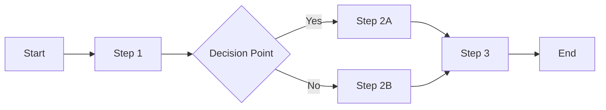

# [Process Name] Process Documentation Template

## Executive Summary
[Brief overview of the process, its importance, and key stakeholders involved]

## Process Overview

### Purpose
[Why this process exists and what business value it provides]

### Scope
- **Included**: [What is covered by this process]
- **Excluded**: [What is explicitly not covered]
- **Dependencies**: [Other processes this depends on]
- **Integrations**: [Systems or processes that integrate with this]

### Key Participants
1. **[Participant Role]**: [Responsibilities in this process]
2. **[Participant Role]**: [Responsibilities in this process]
3. **[Participant Role]**: [Responsibilities in this process]

## Process Flow

### High-Level Flow Diagram


### Detailed Process Steps

#### Step 1: [Step Name]
- **Description**: [What happens in this step]
- **Responsible Party**: [Who performs this step]
- **Inputs**: [Required information/data]
- **Outputs**: [What is produced]
- **SLA**: [Time expectations]
- **Tools/Systems**: [Technology used]

#### Step 2: [Step Name]
- **Description**: [What happens in this step]
- **Responsible Party**: [Who performs this step]
- **Inputs**: [Required information/data]
- **Outputs**: [What is produced]
- **SLA**: [Time expectations]
- **Tools/Systems**: [Technology used]

### Decision Points

#### [Decision Name]
- **Criteria**: [How the decision is made]
- **Options**: 
  - Option A: [Description and when chosen]
  - Option B: [Description and when chosen]
- **Escalation**: [When and how to escalate]

## Technical Implementation

### API Endpoints
```yaml
endpoint: /api/v1/[process-name]
method: POST
authentication: Bearer Token
request:
  type: object
  properties:
    field1:
      type: string
      required: true
    field2:
      type: number
      required: false
response:
  success:
    code: 200
    body:
      status: success
      data: {}
  error:
    code: 400/500
    body:
      error: string
      details: {}
```

### Data Models
```json
{
  "processName": {
    "id": "string",
    "status": "enum[initiated, processing, completed, failed]",
    "createdAt": "datetime",
    "updatedAt": "datetime",
    "data": {
      "field1": "type",
      "field2": "type"
    },
    "metadata": {
      "version": "string",
      "source": "string"
    }
  }
}
```

### Integration Points
1. **System A**: [How it integrates, what data is exchanged]
2. **System B**: [How it integrates, what data is exchanged]
3. **External Service**: [APIs, webhooks, or other integration methods]

## Business Rules

### Validation Rules
1. **Rule Name**: [Description and implementation]
2. **Rule Name**: [Description and implementation]
3. **Rule Name**: [Description and implementation]

### Calculation Logic
```python
def calculate_[process_metric](input_data):
    """
    Description of calculation
    """
    # Step 1: [Description]
    step1_result = process_step_1(input_data)
    
    # Step 2: [Description]
    step2_result = process_step_2(step1_result)
    
    # Step 3: [Description]
    final_result = process_step_3(step2_result)
    
    return final_result
```

### Exception Handling
| Exception Type | Handling Procedure | Escalation Path |
|---------------|-------------------|-----------------|
| [Type 1] | [How to handle] | [Who to escalate to] |
| [Type 2] | [How to handle] | [Who to escalate to] |
| [Type 3] | [How to handle] | [Who to escalate to] |

## Monitoring and Metrics

### Key Performance Indicators (KPIs)
1. **[KPI Name]**
   - Definition: [What it measures]
   - Target: [Expected value/range]
   - Calculation: [How it's calculated]
   - Frequency: [How often measured]

2. **[KPI Name]**
   - Definition: [What it measures]
   - Target: [Expected value/range]
   - Calculation: [How it's calculated]
   - Frequency: [How often measured]

### Monitoring Dashboard
```
┌─────────────────────────────────────────────────┐
│          [Process Name] Dashboard                │
├─────────────────────┬───────────────────────────┤
│ Daily Volume        │ X,XXX transactions        │
│ Success Rate        │ XX.X% ▲ X.X%             │
│ Avg Processing Time │ X.X seconds ▼ X.X%       │
│ Error Rate          │ X.X% ▼ X.X%              │
└─────────────────────┴───────────────────────────┘
```

### Alerts and Thresholds
- **Critical Alert**: [Condition] → [Action]
- **Warning Alert**: [Condition] → [Action]
- **Info Alert**: [Condition] → [Action]

## Compliance and Security

### Regulatory Requirements
- **[Regulation Name]**: [Specific requirements and how they're met]
- **[Regulation Name]**: [Specific requirements and how they're met]

### Security Measures
1. **Data Encryption**: [At rest and in transit specifications]
2. **Access Controls**: [Who can access what and when]
3. **Audit Logging**: [What is logged and retention period]
4. **PCI/PII Handling**: [Special handling procedures]

### Audit Trail
```json
{
  "auditEntry": {
    "timestamp": "ISO-8601",
    "userId": "string",
    "action": "string",
    "resourceId": "string",
    "changes": {},
    "ipAddress": "string",
    "userAgent": "string"
  }
}
```

## Error Handling and Recovery

### Common Errors
| Error Code | Description | Resolution | Prevention |
|------------|-------------|------------|------------|
| ERR_001 | [Description] | [How to fix] | [How to prevent] |
| ERR_002 | [Description] | [How to fix] | [How to prevent] |
| ERR_003 | [Description] | [How to fix] | [How to prevent] |

### Recovery Procedures
1. **Automatic Recovery**: [When and how the system self-recovers]
2. **Manual Intervention**: [When manual steps are needed]
3. **Rollback Procedures**: [How to reverse the process if needed]

## Best Practices

### Do's
- ✅ [Best practice 1]
- ✅ [Best practice 2]
- ✅ [Best practice 3]
- ✅ [Best practice 4]

### Don'ts
- ❌ [Common mistake to avoid]
- ❌ [Common mistake to avoid]
- ❌ [Common mistake to avoid]

### Optimization Tips
1. **Performance**: [How to optimize for speed]
2. **Cost**: [How to reduce processing costs]
3. **Reliability**: [How to improve success rates]
4. **User Experience**: [How to enhance UX]

## Support and Troubleshooting

### FAQ
**Q: [Common question]**  
A: [Answer with specific guidance]

**Q: [Common question]**  
A: [Answer with specific guidance]

### Troubleshooting Guide
| Symptom | Possible Cause | Solution |
|---------|---------------|----------|
| [Symptom 1] | [Cause] | [Solution steps] |
| [Symptom 2] | [Cause] | [Solution steps] |
| [Symptom 3] | [Cause] | [Solution steps] |

### Support Contacts
- **Technical Support**: [Contact method and hours]
- **Business Support**: [Contact method and hours]
- **Emergency Escalation**: [24/7 contact for critical issues]

## Version History
| Version | Date | Changes | Author |
|---------|------|---------|--------|
| 1.0 | [Date] | Initial version | [Name] |
| 1.1 | [Date] | [Changes made] | [Name] |

## Related Documentation
- [Link to related process 1]
- [Link to related process 2]
- [Link to API documentation]
- [Link to integration guides]

## Template Usage Instructions
1. Replace all bracketed placeholders with specific information
2. Add mermaid diagrams for complex flows
3. Include real code examples where applicable
4. Keep technical details accurate and up-to-date
5. Review with technical and business stakeholders
6. Update version history with each significant change