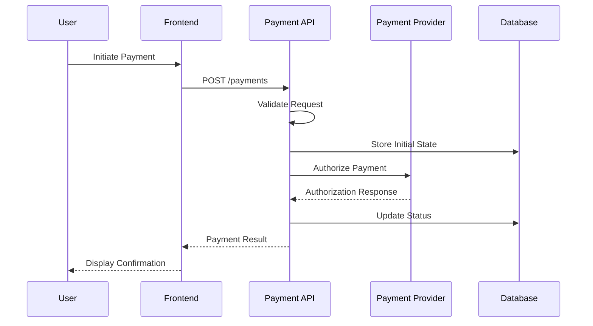
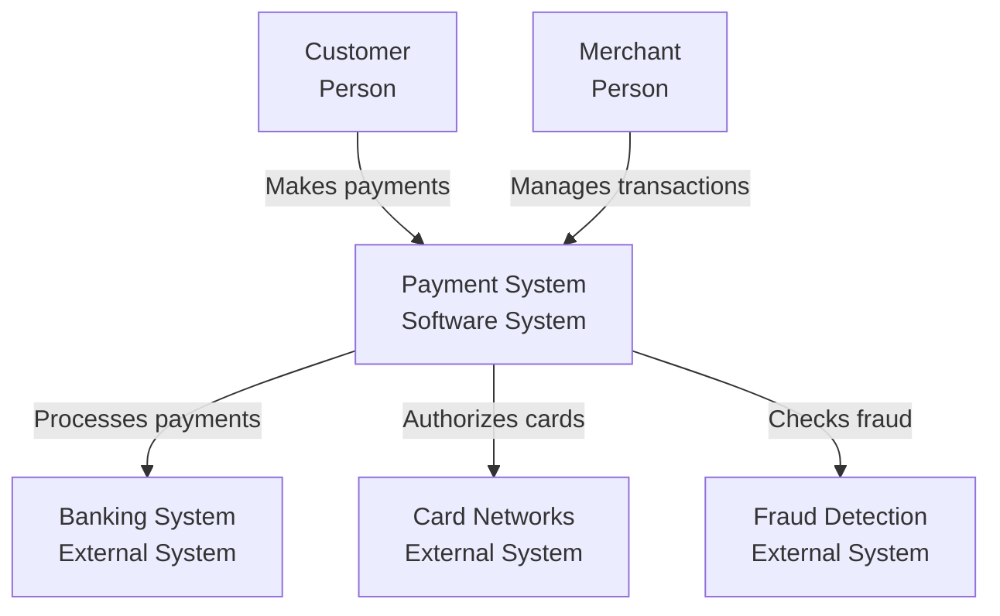

# Payment Architecture Documentation Best Practices

## Introduction

This guide outlines industry best practices for documenting payment systems architecture. It serves as a reference for creating comprehensive, maintainable, and compliant payment documentation.

## 1. Documentation Structure Best Practices

### 1.1 Hierarchical Organization
```
payment-architecture/
├── 01-overview/
│   ├── executive-summary.md
│   ├── business-context.md
│   └── scope-boundaries.md
├── 02-personas/
│   ├── end-users/
│   ├── business-stakeholders/
│   ├── technical-teams/
│   └── external-partners/
├── 03-processes/
│   ├── payment-flows/
│   ├── operational-procedures/
│   └── error-handling/
├── 04-architecture/
│   ├── system-design/
│   ├── data-architecture/
│   ├── security-architecture/
│   └── integration-patterns/
├── 05-compliance/
│   ├── pci-dss/
│   ├── regional-regulations/
│   └── audit-trails/
└── 06-operations/
    ├── monitoring/
    ├── incident-response/
    └── maintenance/
```

### 1.2 Document Naming Conventions
- Use lowercase with hyphens: `payment-flow-authorization.md`
- Include version numbers: `api-specification-v2.1.md`
- Date technical decisions: `adr-001-2024-01-15-payment-gateway-selection.md`
- Prefix with numbers for ordering: `01-introduction.md`

## 2. Persona Documentation Best Practices

### 2.1 Comprehensive Persona Template
```markdown
# Persona: [Name]

## Overview
- **Role:** [Primary role/title]
- **Department:** [Organization unit]
- **Experience Level:** [Novice/Intermediate/Expert]
- **Primary System:** [Main interface used]

## Goals & Objectives
- [Goal 1]: [Description and success criteria]
- [Goal 2]: [Description and success criteria]

## Pain Points
- **Current Challenge:** [Description]
  - **Impact:** [Business/operational impact]
  - **Frequency:** [How often this occurs]

## User Journey
1. **Entry Point:** [How they access the system]
2. **Key Actions:** [Main tasks performed]
3. **Decision Points:** [Where choices are made]
4. **Exit Criteria:** [Success/completion indicators]

## Technical Requirements
- **Access Needs:** [Permissions/roles required]
- **Integration Points:** [Systems they interact with]
- **Data Requirements:** [Information needed]

## Success Metrics
- [Metric 1]: [Target value and measurement method]
- [Metric 2]: [Target value and measurement method]
```

### 2.2 Stakeholder Mapping Matrix
| Stakeholder Type | Influence | Interest | Engagement Strategy |
|-----------------|-----------|----------|-------------------|
| Payment Team Lead | High | High | Weekly updates, decision involvement |
| End Users | Low | High | Regular communication, feedback loops |
| Compliance Officer | High | Medium | Milestone reviews, risk assessments |
| External PSPs | Medium | Medium | Technical workshops, API reviews |

## 3. Process Flow Documentation Best Practices

### 3.1 BPMN 2.0 Standards
```xml
<!-- Example BPMN structure for payment flow -->
<process id="PaymentAuthorization" name="Payment Authorization Flow">
  <startEvent id="start" name="Payment Request"/>
  <task id="validate" name="Validate Payment Data">
    <documentation>
      - Check amount limits
      - Verify account status
      - Validate payment method
    </documentation>
  </task>
  <exclusiveGateway id="decision" name="Valid Payment?"/>
  <task id="authorize" name="Send to PSP"/>
  <endEvent id="success" name="Payment Authorized"/>
  <endEvent id="failure" name="Payment Rejected"/>
</process>
```

### 3.2 Sequence Diagram Standards


### 3.3 State Machine Documentation
```yaml
Payment Transaction States:
  CREATED:
    description: Initial state when payment request received
    transitions:
      - to: VALIDATING
        trigger: validation_started
    timeout: 30 seconds
    
  VALIDATING:
    description: Payment data being validated
    transitions:
      - to: AUTHORIZED
        trigger: validation_passed
      - to: REJECTED
        trigger: validation_failed
    timeout: 10 seconds
    
  AUTHORIZED:
    description: Payment authorized by PSP
    transitions:
      - to: CAPTURED
        trigger: capture_initiated
      - to: VOIDED
        trigger: void_requested
    timeout: 7 days
    
  CAPTURED:
    description: Payment captured and settled
    transitions:
      - to: REFUNDED
        trigger: refund_requested
    final: true
```

## 4. Architecture Documentation Best Practices

### 4.1 C4 Model Implementation

#### Context Diagram (Level 1)


#### Container Diagram (Level 2)
- Show all deployable units
- Include technology choices
- Document communication protocols
- Specify data stores

### 4.2 API Documentation Standards

#### OpenAPI 3.0 Specification
```yaml
openapi: 3.0.0
info:
  title: Payment Processing API
  version: 1.0.0
  description: |
    Secure payment processing API supporting multiple payment methods
    and currencies with PCI-DSS compliance.
    
paths:
  /payments:
    post:
      summary: Create Payment
      description: Initiate a new payment transaction
      security:
        - bearerAuth: []
      requestBody:
        required: true
        content:
          application/json:
            schema:
              $ref: '#/components/schemas/PaymentRequest'
      responses:
        '201':
          description: Payment created successfully
          content:
            application/json:
              schema:
                $ref: '#/components/schemas/PaymentResponse'
```

### 4.3 Security Documentation

#### Security Controls Matrix
| Control Category | Implementation | Verification Method |
|-----------------|----------------|-------------------|
| Data Encryption | AES-256 at rest, TLS 1.3 in transit | Penetration testing |
| Access Control | OAuth 2.0, RBAC | Access reviews |
| Key Management | HSM-based key storage | Key rotation audits |
| Network Security | WAF, DDoS protection | Security scans |

## 5. Compliance Documentation Best Practices

### 5.1 PCI-DSS Compliance Matrix
```markdown
## PCI-DSS Requirements Mapping

### Requirement 1: Network Security
- **1.1** Firewall configuration standards
  - Implementation: [Specific details]
  - Evidence: [Documentation location]
  - Last Review: [Date]

### Requirement 3: Protect Stored Data
- **3.4** Render PAN unreadable
  - Method: Tokenization via [Provider]
  - Scope: All stored card data
  - Validation: Quarterly scans
```

### 5.2 Regulatory Tracking
| Regulation | Requirement | Implementation | Status | Evidence |
|-----------|-------------|----------------|---------|----------|
| PSD2 | Strong Customer Authentication | 3DS 2.0 | Compliant | cert-2024.pdf |
| GDPR | Data Portability | Export API | Compliant | gdpr-audit.pdf |
| PCI-DSS | Network Segmentation | DMZ Architecture | Compliant | network-diagram.pdf |

## 6. Operational Documentation Best Practices

### 6.1 Runbook Template
```markdown
# Payment Service Runbook

## Service Overview
- **Service Name:** payment-processor
- **Criticality:** Tier 1
- **SLA:** 99.95% uptime
- **Owner:** Payment Platform Team

## Key Metrics
- Transaction Success Rate: > 98%
- Response Time: < 200ms (p95)
- Error Rate: < 0.1%

## Monitoring
- Dashboard: [Link to Grafana]
- Alerts: [PagerDuty integration]
- Logs: [Splunk queries]

## Common Issues
### Issue: High Latency
**Symptoms:** Response times > 500ms
**Diagnosis Steps:**
1. Check database connection pool
2. Verify PSP gateway status
3. Review recent deployments

**Resolution:**
1. Scale service instances
2. Clear connection pool
3. Failover to backup PSP
```

### 6.2 Incident Response Documentation
```yaml
Incident Levels:
  SEV1:
    description: Complete payment outage
    response_time: 15 minutes
    escalation:
      - oncall_engineer
      - team_lead
      - platform_director
    
  SEV2:
    description: Degraded performance
    response_time: 30 minutes
    escalation:
      - oncall_engineer
      - team_lead
```

## 7. Documentation Maintenance Best Practices

### 7.1 Version Control
- Use Git for all documentation
- Tag releases with semantic versioning
- Maintain change logs
- Require peer reviews

### 7.2 Review Cycles
| Document Type | Review Frequency | Reviewers |
|--------------|------------------|-----------|
| Architecture Diagrams | Quarterly | Tech Lead, Architect |
| API Documentation | On change | API Team |
| Compliance Docs | Annually | Compliance Officer |
| Runbooks | Monthly | Operations Team |

### 7.3 Documentation Metrics
- **Coverage:** % of components documented
- **Accuracy:** Issues found in reviews
- **Currency:** Average age of documents
- **Usage:** Page views and feedback

## 8. Tools and Automation

### 8.1 Recommended Tools
- **Diagrams:** Draw.io, PlantUML, Mermaid
- **API Docs:** Swagger/OpenAPI, Postman
- **Process Flows:** BPMN.io, Lucidchart
- **Architecture:** Structurizr, C4 tools

### 8.2 Automation Opportunities
```yaml
Documentation Pipeline:
  - API Spec Generation:
      tool: OpenAPI Generator
      trigger: Code changes
      
  - Diagram Updates:
      tool: PlantUML CI
      trigger: Architecture changes
      
  - Compliance Reports:
      tool: Custom scripts
      trigger: Monthly schedule
```

## 9. Quality Assurance Checklist

### Pre-Release Checklist
- [ ] All diagrams are up to date
- [ ] API documentation matches implementation
- [ ] Security controls documented
- [ ] Compliance requirements addressed
- [ ] Operational procedures defined
- [ ] Review and approval completed

### Documentation Standards
- [ ] Consistent formatting
- [ ] Clear and concise language
- [ ] No outdated information
- [ ] All links functional
- [ ] Version clearly marked
- [ ] Authors identified

## 10. Conclusion

Following these best practices ensures payment architecture documentation that is:
- **Comprehensive:** Covers all aspects of the system
- **Maintainable:** Easy to update and version
- **Compliant:** Meets regulatory requirements
- **Usable:** Serves its intended audience effectively
- **Accurate:** Reflects the current system state

Regular reviews and updates are essential to maintain documentation quality and relevance.

---

**Document Version:** 1.0  
**Last Updated:** 2025-08-01  
**Next Review:** Quarterly