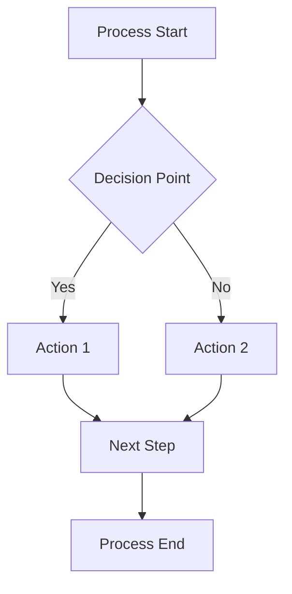

# Process Documentation Template

## Process Overview

### Basic Information
- **Process ID**: PROC-XXX
- **Process Name**: [Clear, descriptive name]
- **Version**: X.Y
- **Last Updated**: YYYY-MM-DD
- **Status**: [Active | Deprecated | Planned | Suspended | Retired]

### Classification
- **Primary Category**: [Transaction Processing | Compliance & Risk | Customer Operations | Internal Operations | Integration & Orchestration]
- **Sub-Category**: [Specific classification within primary category]
- **Business Priority**: [Critical | High | Medium | Low]
- **Risk Level**: [Very Low | Low | Medium | High | Very High]

### Process Owner & Governance
- **Process Owner**: [Name, Title, Department]
- **Contact Information**: [Email, Phone]
- **Backup Owner**: [Name, Title, Department]
- **Review Frequency**: [Monthly | Quarterly | Annually]
- **Next Review Date**: YYYY-MM-DD

---

## Process Description

### Purpose
[Explain why this process exists and what business need it addresses]

### Scope
[Define what is included and excluded from this process]

### Key Objectives
1. [Primary objective]
2. [Secondary objective]
3. [Additional objectives...]

### Success Criteria
- [Measurable success criteria]
- [Quality indicators]
- [Performance thresholds]

---

## Process Flow

### High-Level Steps
1. **[Step Name]**: [Brief description]
2. **[Step Name]**: [Brief description]
3. **[Step Name]**: [Brief description]
4. **[Step Name]**: [Brief description]

### Detailed Process Flow

### Step-by-Step Instructions

#### Step 1: [Step Name]
**Description**: [Detailed description of what happens in this step]

**Duration**: [Average time required]

**Responsible Party**: [Who performs this step]

**Inputs**:
- [Input 1]: [Description and source]
- [Input 2]: [Description and source]

**Actions**:
1. [Specific action]
2. [Specific action]
3. [Specific action]

**Outputs**:
- [Output 1]: [Description and destination]
- [Output 2]: [Description and destination]

**Quality Checks**:
- [ ] [Quality checkpoint]
- [ ] [Quality checkpoint]

**Exception Handling**:
- **If [exception condition]**: [Action to take]
- **If [exception condition]**: [Action to take]

---

#### Step 2: [Step Name]
[Repeat the same structure for each step]

---

## Operational Details

### Execution Frequency
- **Frequency**: [Continuous | Real-time | Hourly | Daily | Weekly | Monthly | Quarterly | Annually | Ad-hoc | Event-driven]
- **Volume**: [X per day/week/month]
- **Peak Times**: [When volume is highest]
- **Seasonal Variations**: [Yes/No - if yes, describe]

### Performance Metrics
| Metric | Current Performance | Target | Measurement Method |
|--------|-------------------|--------|-------------------|
| Processing Time | [X minutes/hours] | [Target] | [How measured] |
| Success Rate | [X%] | [Target%] | [How measured] |
| Volume Capacity | [X per period] | [Target] | [How measured] |
| Customer Satisfaction | [Score] | [Target] | [How measured] |

### Service Level Agreements (SLAs)
- **Response Time**: [Maximum acceptable time]
- **Availability**: [Uptime requirement]
- **Quality**: [Minimum quality threshold]
- **Escalation**: [When and how to escalate]

---

## Systems & Technology

### Primary Systems
| System Name | Role | Criticality | Vendor | Status |
|------------|------|-------------|--------|--------|
| [System 1] | [Primary/Secondary/Integration] | [Critical/Important/Supporting] | [Vendor] | [Status] |
| [System 2] | [Primary/Secondary/Integration] | [Critical/Important/Supporting] | [Vendor] | [Status] |

### Data Flow

#### Input Data
- **[Data Source 1]**: [Description, format, frequency]
- **[Data Source 2]**: [Description, format, frequency]

#### Output Data
- **[Data Output 1]**: [Description, format, destination]
- **[Data Output 2]**: [Description, format, destination]

### Integration Points
- **[Integration 1]**: [System connected, type of integration, frequency]
- **[Integration 2]**: [System connected, type of integration, frequency]

### Automation Level
**Current State**: [Manual | Semi-Automated | Fully Automated | AI-Enhanced]

**Automation Opportunities**:
- [ ] [Potential automation area]
- [ ] [Potential automation area]

---

## Stakeholders & Responsibilities

### RACI Matrix
| Role/Stakeholder | Responsible | Accountable | Consulted | Informed |
|-----------------|-------------|-------------|-----------|----------|
| [Role 1] | [R/A/C/I] | [R/A/C/I] | [R/A/C/I] | [R/A/C/I] |
| [Role 2] | [R/A/C/I] | [R/A/C/I] | [R/A/C/I] | [R/A/C/I] |

### Stakeholder Details

#### Process Owner
- **Name**: [Full Name]
- **Role**: [Job Title]
- **Department**: [Department Name]
- **Responsibilities**:
  - [Primary responsibility]
  - [Secondary responsibility]
- **Authority Level**: [Decision-making authority]
- **Escalation Path**: [Who they escalate to]

#### Key Participants
[Repeat for each key stakeholder]

### Communication Plan
- **Regular Updates**: [Frequency and method]
- **Issue Escalation**: [Process for escalating issues]
- **Change Notifications**: [How changes are communicated]

---

## Business Rules & Compliance

### Business Rules
1. **Rule ID**: BR-001
   - **Description**: [What the rule states]
   - **Condition**: [When the rule applies]
   - **Action**: [What happens when rule is triggered]
   - **Exceptions**: [Any exceptions to the rule]

2. **Rule ID**: BR-002
   - **Description**: [What the rule states]
   - **Condition**: [When the rule applies]
   - **Action**: [What happens when rule is triggered]
   - **Exceptions**: [Any exceptions to the rule]

### Compliance Requirements
- **Regulatory**: [List applicable regulations]
- **Internal Policies**: [List internal policy requirements]
- **Industry Standards**: [List relevant industry standards]
- **Audit Requirements**: [Audit trail and documentation needs]

### Security & Access Controls
- **Data Classification**: [Public | Internal | Confidential | Restricted]
- **Access Requirements**: [Who can access and how]
- **Security Controls**: [List security measures in place]

---

## Risk Management

### Risk Assessment
| Risk Factor | Probability | Impact | Risk Level | Mitigation Strategy |
|-------------|-------------|--------|------------|-------------------|
| [Risk 1] | [High/Med/Low] | [High/Med/Low] | [Critical/High/Med/Low] | [Mitigation approach] |
| [Risk 2] | [High/Med/Low] | [High/Med/Low] | [Critical/High/Med/Low] | [Mitigation approach] |

### Single Points of Failure
- [SPOF 1]: [Description and impact]
- [SPOF 2]: [Description and impact]

### Business Continuity
- **Backup Procedures**: [What to do if primary process fails]
- **Recovery Time Objective (RTO)**: [Maximum acceptable downtime]
- **Recovery Point Objective (RPO)**: [Maximum acceptable data loss]

---

## Exception Handling

### Common Exceptions
1. **Exception Type**: [Name of exception]
   - **Trigger**: [What causes this exception]
   - **Impact**: [What happens when this occurs]
   - **Resolution**: [Steps to resolve]
   - **Prevention**: [How to prevent in future]

2. **Exception Type**: [Name of exception]
   - **Trigger**: [What causes this exception]
   - **Impact**: [What happens when this occurs]
   - **Resolution**: [Steps to resolve]
   - **Prevention**: [How to prevent in future]

### Escalation Procedures
1. **Level 1**: [First level escalation - who and when]
2. **Level 2**: [Second level escalation - who and when]
3. **Level 3**: [Final escalation - who and when]

---

## Process Dependencies

### Upstream Dependencies
- **[Process/System 1]**: [What we depend on and why]
- **[Process/System 2]**: [What we depend on and why]

### Downstream Dependencies
- **[Process/System 1]**: [What depends on us and why]
- **[Process/System 2]**: [What depends on us and why]

### External Dependencies
- **[External Entity 1]**: [What we depend on externally]
- **[External Entity 2]**: [What we depend on externally]

---

## Improvement Opportunities

### Current Pain Points
1. **[Pain Point 1]**: [Description and impact]
2. **[Pain Point 2]**: [Description and impact]

### Improvement Initiatives
| Initiative | Type | Priority | Effort | Expected Benefits | Status | Owner |
|-----------|------|----------|--------|------------------|--------|-------|
| [Initiative 1] | [Automation/Optimization/Integration] | [High/Med/Low] | [Effort estimate] | [Expected benefits] | [Status] | [Owner] |
| [Initiative 2] | [Automation/Optimization/Integration] | [High/Med/Low] | [Effort estimate] | [Expected benefits] | [Status] | [Owner] |

### Optimization Opportunities
- [ ] **[Opportunity 1]**: [Description and potential impact]
- [ ] **[Opportunity 2]**: [Description and potential impact]

---

## Monitoring & Reporting

### Key Performance Indicators (KPIs)
1. **[KPI Name]**:
   - **Definition**: [How it's calculated]
   - **Current Value**: [Current performance]
   - **Target**: [Target performance]
   - **Frequency**: [How often measured]
   - **Owner**: [Who's responsible for this KPI]

### Dashboards & Reports
- **Real-time Dashboard**: [Description and access]
- **Daily Reports**: [What reports are generated]
- **Weekly Reports**: [What reports are generated]
- **Monthly Reports**: [What reports are generated]

### Alerting & Notifications
- **Performance Alerts**: [When alerts are triggered]
- **Exception Notifications**: [Who gets notified of exceptions]
- **Status Updates**: [Regular status communication]

---

## Training & Documentation

### Required Skills
- **[Skill 1]**: [Description and proficiency level needed]
- **[Skill 2]**: [Description and proficiency level needed]

### Training Requirements
- **New Employee Training**: [Duration and content]
- **Refresher Training**: [Frequency and content]
- **Specialized Training**: [For specific roles or scenarios]

### Documentation Inventory
- **Process Documentation**: [This document]
- **System Documentation**: [Links to system docs]
- **Training Materials**: [Links to training resources]
- **Reference Guides**: [Quick reference materials]

---

## Change Management

### Change Control Process
1. **Change Request**: [How to request changes]
2. **Impact Assessment**: [How changes are evaluated]
3. **Approval Process**: [Who approves changes]
4. **Implementation**: [How changes are implemented]
5. **Communication**: [How changes are communicated]

### Version History
| Version | Date | Changes | Author | Approved By |
|---------|------|---------|---------|-------------|
| 1.0 | YYYY-MM-DD | Initial version | [Author] | [Approver] |
| 1.1 | YYYY-MM-DD | [Description of changes] | [Author] | [Approver] |

---

## Related Documents

### Internal References
- [Document 1]: [Link and description]
- [Document 2]: [Link and description]

### External References
- [Standard/Regulation 1]: [Link and relevance]
- [Standard/Regulation 2]: [Link and relevance]

### Templates & Tools
- [Template 1]: [Link and usage]
- [Tool 1]: [Link and usage]

---

## Appendices

### Appendix A: Detailed Flowcharts
[Include detailed process flow diagrams]

### Appendix B: System Screenshots
[Include relevant system interface screenshots]

### Appendix C: Forms & Templates
[Include process-related forms and templates]

### Appendix D: Troubleshooting Guide
[Include common issues and solutions]

---

## Review & Approval

### Review Checklist
- [ ] Process description is accurate and complete
- [ ] All stakeholders have been identified
- [ ] Risk assessment is current
- [ ] Performance metrics are defined
- [ ] Business rules are documented
- [ ] Exception handling is covered
- [ ] Dependencies are identified
- [ ] Improvement opportunities noted

### Approval Sign-off
- **Process Owner**: [Name] | Date: _______ | Signature: _______
- **Department Head**: [Name] | Date: _______ | Signature: _______
- **Quality Assurance**: [Name] | Date: _______ | Signature: _______

### Distribution List
- [ ] Process Owner
- [ ] All Stakeholders
- [ ] Department Library
- [ ] Quality Management System
- [ ] Training Team

---

*This document is a living document and should be updated regularly to reflect current processes and improvements.*