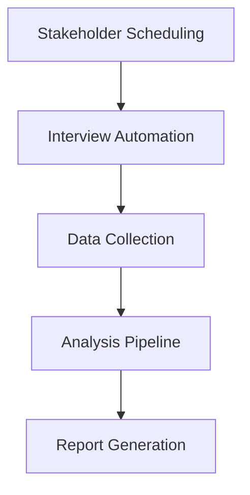
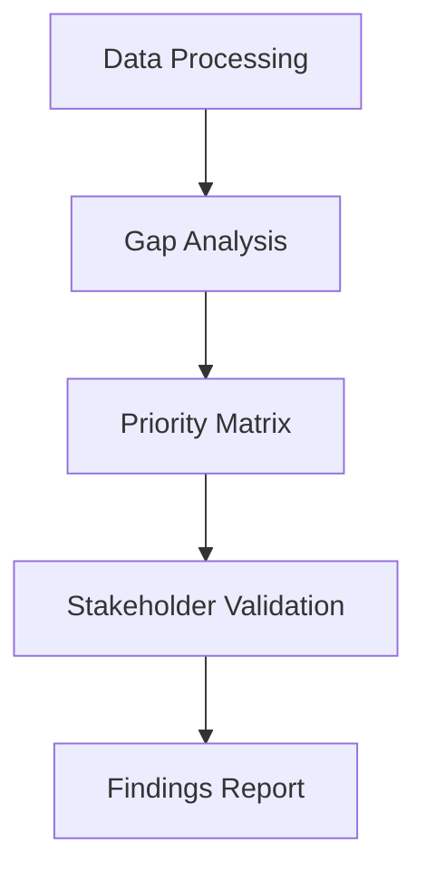
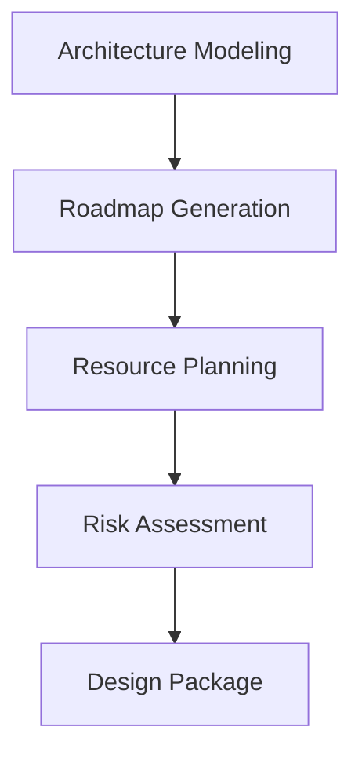
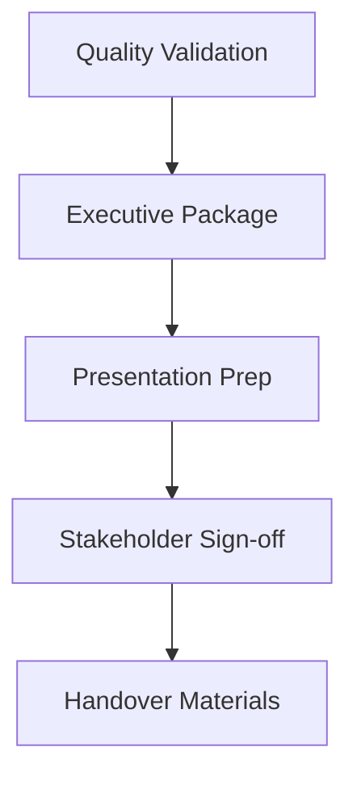

# Technical Implementation Framework
## 8-Week Architecture Assessment Automation

### Overview
This directory contains the complete technical implementation framework for executing the 8-week architecture assessment with maximum automation and efficiency.

## Directory Structure

```
implementation/
├── automation/          # Process automation scripts
├── tools/              # Assessment and analysis tools
├── scripts/            # Utility and helper scripts
├── data-collection/    # Data gathering frameworks
├── reporting/          # Report generation and dashboards
├── quality-assurance/  # QA automation and validation
├── integration/        # Third-party tool integrations
└── config/            # Configuration files
```

## Key Components

### 🤖 Automation Framework
- Stakeholder scheduling and coordination
- Document generation pipelines
- Progress tracking and notifications
- Quality validation workflows
- Report distribution automation

### 🔧 Assessment Tools
- Current state analysis tools
- Gap analysis automation
- Future state design assistants
- Implementation roadmap generators
- Stakeholder feedback collectors

### 📊 Data Collection
- System inventory automation
- Performance metrics gathering
- Documentation extraction tools
- Interview data processing
- Survey response analysis

### 📈 Reporting & Dashboards
- Real-time progress dashboards
- Executive summary generators
- Technical detail reporters
- Stakeholder communication tools
- Quality metrics tracking

### ✅ Quality Assurance
- Template validation scripts
- Content quality checkers
- Deliverable completeness validation
- Stakeholder satisfaction tracking
- Risk monitoring automation

### 🔗 Integration Framework
- Enterprise architecture tool connectors
- Project management tool APIs
- Document repository integrations
- Communication platform hooks
- Version control automation

## Technical Architecture

### Core Technologies
- **Node.js**: Main automation engine
- **Python**: Data analysis and reporting
- **JSON/YAML**: Configuration management
- **Markdown**: Template and documentation
- **Shell Scripts**: System integration

### Design Principles
- **Modular**: Reusable components
- **Configurable**: Environment-specific settings
- **Extensible**: Plugin architecture
- **Automated**: Minimal manual intervention
- **Observable**: Comprehensive logging and monitoring

## Quick Start

1. **Setup Environment**
   ```bash
   cd implementation
   npm install
   python -m pip install -r requirements.txt
   ```

2. **Configure Assessment**
   ```bash
   ./scripts/setup-assessment.sh --project "Enterprise Assessment"
   ```

3. **Initialize Automation**
   ```bash
   node automation/assessment-orchestrator.js --config config/project.json
   ```

4. **Launch Dashboard**
   ```bash
   npm run dashboard
   ```

## Integration Points

### Enterprise Architecture Tools
- **Sparx Enterprise Architect**: Model extraction and analysis
- **Archi**: ArchiMate modeling automation
- **LucidChart**: Diagram generation and updates
- **Draw.io**: Technical diagram automation

### Project Management
- **Microsoft Project**: Timeline integration
- **Jira**: Task and risk tracking
- **Confluence**: Documentation automation
- **SharePoint**: Document repository sync

### Communication
- **Microsoft Teams**: Automated notifications
- **Slack**: Progress updates
- **Email**: Stakeholder communications
- **Calendar**: Meeting scheduling

## Automation Workflows

### Phase 1: Discovery (Weeks 1-2)


### Phase 2: Analysis (Weeks 3-4)


### Phase 3: Design (Weeks 5-6)


### Phase 4: Finalization (Weeks 7-8)


## Monitoring & Metrics

### Real-time Dashboards
- Project progress tracking
- Stakeholder engagement levels
- Quality metrics monitoring
- Risk and issue tracking
- Resource utilization

### Automated Alerts
- Milestone delays
- Quality threshold breaches
- Stakeholder availability conflicts
- Data collection gaps
- Integration failures

## Support & Documentation

### Technical Guides
- `/docs/technical-setup.md`: Environment setup
- `/docs/automation-guide.md`: Workflow configuration
- `/docs/integration-guide.md`: Third-party connections
- `/docs/troubleshooting.md`: Common issues and solutions

### User Guides
- `/docs/stakeholder-guide.md`: For business stakeholders
- `/docs/analyst-guide.md`: For assessment team members
- `/docs/admin-guide.md`: For system administrators

---

**Version**: 1.0.0
**Last Updated**: 2025-08-07
**Maintainer**: Architecture Assessment Team