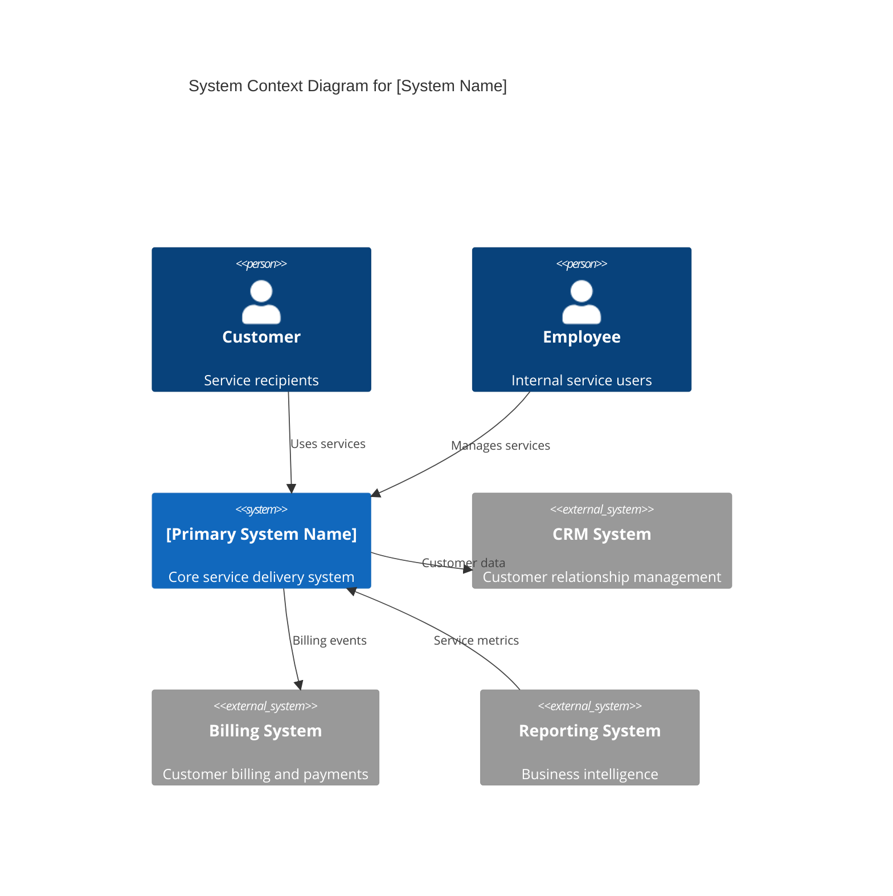
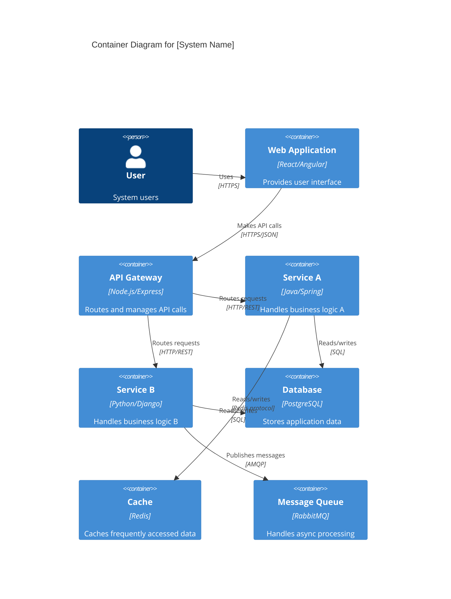

# C4 Diagrams Development Approach for Service Organization Assessment

## Executive Summary

This document outlines the comprehensive approach for developing C4 diagrams during the 8-week current state architecture assessment of the service organization's 2 primary systems. The approach follows the iterative methodology (Info Gathering → Draft → Feedback → Final Review → Final) and provides practical guidance for creating Context, Container, and Deployment diagrams that support stakeholder understanding and future planning.

## 1. C4 Model Foundation for Service Organizations

### 1.1 C4 Model Levels Applied to Service Architecture

The C4 model's hierarchical approach aligns perfectly with service organization complexity:

- **Context (Level 1)**: Service systems and their external relationships
- **Container (Level 2)**: Applications, services, and data stores within each system
- **Component (Level 3)**: Not included in this current state assessment
- **Code (Level 4)**: Not included in this current state assessment

### 1.2 Service Organization Adaptations

**Service-Specific Elements:**
- Service boundaries and ownership
- Service-to-service communication patterns
- Shared infrastructure and platform services
- Customer touchpoints and channels
- Internal business process flows

## 2. C4 Context Level Diagrams Approach

### 2.1 Context Diagram Purpose for Services

Context diagrams establish the **big picture** of each primary system within the service organization ecosystem:

- System boundaries and responsibilities
- External users and customer segments
- Integration points with other systems
- External service providers and vendors
- Regulatory and compliance touchpoints

### 2.2 Context Development Process (Weeks 3-4)

#### Week 3: Context Discovery and Draft Creation

**Monday-Tuesday: System 1 Context Analysis**
```
Input Sources:
├── Stakeholder interviews (Service owners, architects)
├── Existing system documentation
├── Customer journey mapping sessions
├── Business process documentation
└── External integration inventories

Output: Draft System 1 Context Diagram
```

**Context Elements Identification:**
1. **Primary Users/Actors:**
   - Internal users (employees, departments)
   - External customers (by segment)
   - Partner organizations
   - Regulatory bodies

2. **External Systems:**
   - Other organizational systems
   - Third-party services
   - Legacy systems
   - Vendor platforms

3. **System Boundaries:**
   - What the system is responsible for
   - What it depends on others for
   - Data and process ownership

**Wednesday-Thursday: System 2 Context Analysis**
- Follow same process as System 1
- Identify cross-system relationships
- Document shared dependencies

**Friday: Context Validation Session**
- Present both context diagrams to stakeholders
- Validate user types and system boundaries
- Confirm external dependencies
- Gather feedback for refinement

#### Week 4: Context Refinement and Integration

**Monday-Tuesday: Stakeholder Feedback Integration**
- Incorporate feedback from validation session
- Refine system boundaries based on stakeholder input
- Update external system relationships
- Resolve any overlapping responsibilities

**Wednesday-Thursday: Context Integration**
- Create integrated context view showing both systems
- Document cross-system relationships
- Validate service boundaries
- Prepare for container phase

**Friday: Final Context Review**
- Final stakeholder validation
- Context diagram sign-off
- Handover to container phase team

### 2.3 Context Diagram Standards and Templates

#### Template Structure for Service Organizations



#### Context Documentation Template

**System Context: [System Name]**
- **Purpose**: Brief description of system purpose and scope
- **Primary Users**: List of main user types and their roles
- **External Systems**: Dependencies and integration points
- **Data Flows**: Major data exchanges with external systems
- **Business Context**: How the system supports business objectives

### 2.4 Context Quality Criteria

**Completeness Checklist:**
- [ ] All user types identified and categorized
- [ ] All external system dependencies documented
- [ ] System boundaries clearly defined
- [ ] Business context clearly articulated
- [ ] Cross-system relationships mapped
- [ ] Regulatory touchpoints identified

**Validation Criteria:**
- [ ] >90% stakeholder agreement on system boundaries
- [ ] All major user journeys represented
- [ ] No orphaned systems or unexplained dependencies
- [ ] Consistent with business capability map

## 3. C4 Container Level Diagrams Approach

### 3.1 Container Diagram Purpose for Services

Container diagrams show the **high-level technical structure** of each system:

- Applications and microservices
- Databases and data stores
- Integration components
- Infrastructure services
- Communication patterns between containers

### 3.2 Container Development Process (Weeks 5-6)

#### Week 5: Container Discovery and Decomposition

**Monday-Tuesday: System 1 Container Analysis**
```
Discovery Methods:
├── Technical architecture interviews
├── System documentation review
├── Database schema analysis
├── API documentation review
├── Deployment configuration review
└── Monitoring system analysis

Container Types to Identify:
├── Web Applications (user interfaces)
├── API Services (microservices, REST APIs)
├── Background Services (batch processing, schedulers)
├── Databases (relational, NoSQL, caches)
├── Message Queues (event streaming, messaging)
└── File Systems (document stores, media storage)
```

**Container Identification Process:**
1. **Application Containers:**
   - User-facing applications
   - Administrative interfaces
   - Mobile applications
   - API gateways

2. **Service Containers:**
   - Business logic services
   - Integration services
   - Processing engines
   - Workflow orchestrators

3. **Data Containers:**
   - Primary databases
   - Cache layers
   - Data warehouses
   - File storage systems

4. **Infrastructure Containers:**
   - Load balancers
   - Message brokers
   - Identity services
   - Monitoring systems

**Wednesday-Thursday: System 2 Container Analysis**
- Follow same decomposition process
- Identify shared containers across systems
- Document inter-system container communication

**Friday: Container Draft Review**
- Present container diagrams to technical stakeholders
- Validate container responsibilities
- Review communication patterns
- Gather technical feedback

#### Week 6: Container Integration and Validation

**Monday-Tuesday: Cross-System Container Mapping**
- Map communication between System 1 and System 2 containers
- Identify shared infrastructure containers
- Document container dependencies
- Create integrated container view

**Wednesday-Thursday: Deployment Preparation**
- Map containers to physical/virtual infrastructure
- Document deployment relationships
- Identify deployment dependencies
- Prepare for deployment diagram creation

**Friday: Final Container Review**
- Final technical validation with stakeholders
- Container diagram sign-off
- Transition to deployment modeling

### 3.3 Container Diagram Standards and Templates

#### Template Structure for Service Containers



#### Container Documentation Template

**Container: [Container Name]**
- **Type**: Web App / API / Service / Database / etc.
- **Technology**: Programming language, framework, platform
- **Purpose**: What this container does
- **Responsibilities**: Key functions and capabilities
- **Dependencies**: Other containers this depends on
- **Interfaces**: APIs, databases, files it exposes
- **Deployment**: How and where it's deployed

### 3.4 Container Quality Criteria

**Technical Completeness:**
- [ ] All applications identified and categorized
- [ ] All databases and data stores documented
- [ ] All APIs and integration points mapped
- [ ] All communication protocols specified
- [ ] All shared services identified

**Architecture Validation:**
- [ ] Container responsibilities are clearly defined
- [ ] No circular dependencies
- [ ] Single responsibility principle followed
- [ ] Appropriate separation of concerns

## 4. Context → Container → Deployment Flow Approach

### 4.1 Traceability Matrix Development

The flow ensures complete traceability from business context through technical implementation to deployment:

```
Context Level          Container Level         Deployment Level
├── User Types    ────→ User Interfaces  ────→ Web Servers
├── External Sys  ────→ Integration APIs ────→ API Gateways  
├── Data Flows    ────→ Databases       ────→ Database Servers
└── Bus. Process  ────→ Services        ────→ App Servers
```

### 4.2 Flow Documentation Process

#### Diagram Relationship Matrix

| Context Element | Container Mapping | Deployment Mapping | Validation Notes |
|----------------|-------------------|-------------------|------------------|
| Customer Portal | Web Application + API | Web Server Cluster | Load balancing verified |
| External CRM | Integration Service | ESB/API Gateway | Connection tested |
| Billing System | Billing API + Database | App + DB Servers | Data sync confirmed |

#### Cross-Reference Validation

**Week 7 Validation Process:**
1. **Context → Container Mapping:**
   - Every external system in context has corresponding container
   - Every user type has interface container
   - Every data flow has supporting containers

2. **Container → Deployment Mapping:**
   - Every container has deployment location
   - All container communications are deployable
   - Infrastructure supports container requirements

3. **End-to-End Validation:**
   - Business processes map through all three levels
   - No gaps or orphaned elements
   - Performance requirements can be met

## 5. Templates and Examples for Service Organizations

### 5.1 Service Organization-Specific Templates

#### Customer Service System Example

**Context Template:**
```yaml
system_name: "Customer Service Platform"
context_elements:
  users:
    - type: "Customer"
      description: "Service recipients seeking support"
    - type: "Service Agent"
      description: "Customer service representatives"
    - type: "Supervisor"
      description: "Service team supervisors"
  external_systems:
    - name: "CRM System"
      purpose: "Customer data management"
    - name: "Knowledge Base"
      purpose: "Service documentation"
    - name: "Billing System"
      purpose: "Account information"
  data_flows:
    - from: "Customer"
      to: "Customer Service Platform"
      data: "Service requests, feedback"
    - from: "Customer Service Platform"
      to: "CRM System"
      data: "Customer interactions, case updates"
```

**Container Template:**
```yaml
containers:
  - name: "Service Portal"
    type: "Web Application"
    technology: "React + TypeScript"
    purpose: "Customer self-service interface"
  - name: "Agent Desktop"
    type: "Web Application"
    technology: "Angular + RxJS"
    purpose: "Agent workspace and tools"
  - name: "Case Management API"
    type: "API Service"
    technology: "Node.js + Express"
    purpose: "Case lifecycle management"
  - name: "Case Database"
    type: "Database"
    technology: "PostgreSQL"
    purpose: "Case and interaction storage"
  - name: "Search Service"
    type: "Service"
    technology: "Elasticsearch"
    purpose: "Knowledge base search"
```

### 5.2 Financial Services Example

**Context Elements:**
- Customers (retail, commercial, institutional)
- Regulatory bodies (central bank, financial authorities)
- Partner banks and financial institutions
- Payment networks (card networks, ACH, wire systems)
- Risk management systems
- Compliance reporting systems

**Container Elements:**
- Customer-facing applications (web, mobile)
- Core banking systems
- Payment processing engines
- Risk calculation services
- Regulatory reporting services
- Data warehousing systems

### 5.3 Healthcare Services Example

**Context Elements:**
- Patients and family members
- Healthcare providers (doctors, nurses, specialists)
- Insurance companies
- Regulatory agencies (health authorities, privacy)
- Laboratory and imaging services
- Pharmacy systems

**Container Elements:**
- Patient portal applications
- Electronic health record systems
- Clinical decision support systems
- Integration engines for external systems
- Medical device data collectors
- Analytics and reporting services

## 6. Iterative Development Process

### 6.1 Iteration Cycle Structure

Each diagram follows the same iterative pattern:

#### Phase 1: Information Gathering (Days 1-2)
```
Activities:
├── Stakeholder interviews (2-3 hours each)
├── Documentation review (system docs, APIs, etc.)
├── System observation (live system review)
└── Cross-reference validation (multiple sources)

Outputs:
├── Raw stakeholder notes
├── System inventory lists
├── Integration point catalog
└── Initial diagram sketches
```

#### Phase 2: Draft Creation (Days 3-4)
```
Activities:
├── Diagram creation using standard tools
├── Documentation writing
├── Cross-validation with team
└── Quality review against checklist

Outputs:
├── Draft C4 diagrams (standard format)
├── Supporting documentation
├── Validation notes
└── Feedback preparation materials
```

#### Phase 3: Feedback Collection (Day 5)
```
Activities:
├── Stakeholder presentation (1-2 hours)
├── Feedback session with Q&A
├── Priority ranking of changes
└── Next iteration planning

Outputs:
├── Structured feedback log
├── Change request priorities
├── Stakeholder sign-off status
└── Refinement requirements
```

#### Phase 4: Refinement (Following Monday)
```
Activities:
├── Feedback integration
├── Diagram updates
├── Documentation refinement
└── Quality re-validation

Outputs:
├── Updated diagrams
├── Refined documentation
├── Change log
└── Readiness for next phase
```

### 6.2 Feedback Integration Process

#### Stakeholder Feedback Categories

**Category 1: Accuracy Issues**
- Missing systems or users
- Incorrect relationships
- Wrong system boundaries
- Priority: High - Fix immediately

**Category 2: Completeness Gaps**
- Additional systems to include
- Missing integration points
- Unexplored user types
- Priority: High - Add in next iteration

**Category 3: Clarity Improvements**
- Diagram layout issues
- Terminology clarification
- Documentation enhancement
- Priority: Medium - Improve presentation

**Category 4: Future Considerations**
- Planned system changes
- Upcoming integrations
- Strategic initiatives
- Priority: Low - Document for future phases

#### Feedback Processing Workflow

1. **Feedback Capture:**
   - Use standardized feedback forms
   - Record session notes
   - Prioritize by impact and stakeholder importance

2. **Impact Assessment:**
   - Evaluate scope of changes required
   - Assess timeline implications
   - Identify dependencies on other diagrams

3. **Change Implementation:**
   - Update diagrams first
   - Revise documentation
   - Update traceability matrices
   - Re-validate quality criteria

4. **Change Communication:**
   - Notify affected stakeholders
   - Update project status
   - Schedule re-validation if needed

## 7. Tools and Standards

### 7.1 Recommended Tool Stack

#### Primary Diagramming Tools

**Option 1: Structurizr (Recommended for C4)**
```
Advantages:
├── Purpose-built for C4 model
├── Code-as-documentation approach
├── Version control integration
├── Automatic layout and styling
└── Strong traceability features

Best for:
├── Teams comfortable with code
├── Need for version control
├── Automated diagram generation
└── Integration with CI/CD pipelines
```

**Option 2: Draw.io (Lucidchart alternative)**
```
Advantages:
├── Free and widely available
├── Intuitive visual interface
├── Good collaboration features
├── Export to multiple formats
└── Integration with common platforms

Best for:
├── Quick diagram creation
├── Stakeholder collaboration
├── Mixed tool environments
└── Budget-conscious organizations
```

**Option 3: Enterprise Tools (Visio, Lucidchart)**
```
Advantages:
├── Enterprise-grade features
├── Advanced collaboration
├── Template libraries
├── Integration with Office/Google
└── Professional presentation features

Best for:
├── Large organizations
├── Compliance requirements
├── Professional presentations
└── Established tool ecosystems
```

#### Supporting Tools

**Documentation Platforms:**
- Confluence (wiki-style documentation)
- GitBook (modern documentation)
- Notion (collaborative workspace)

**Version Control:**
- Git (for code-based diagrams)
- SharePoint (for document versions)
- Google Drive (for collaborative editing)

**Presentation Tools:**
- PowerPoint/Google Slides (executive presentations)
- Miro/Mural (collaborative workshops)
- Figma (interactive presentations)

### 7.2 C4 Standards and Conventions

#### Diagram Styling Standards

**Color Scheme (Service Organization):**
```css
/* Primary System Elements */
system_primary: #1168bd      /* Blue - internal systems */
system_external: #999999     /* Gray - external systems */
person_internal: #08427b     /* Dark blue - internal users */
person_external: #494949     /* Dark gray - external users */
container_webapp: #438dd5    /* Light blue - web applications */
container_service: #85bbf0   /* Lighter blue - services */
container_database: #f58536  /* Orange - databases */
container_queue: #6cb33e     /* Green - messaging */

/* Supporting Elements */
relationship: #707070        /* Gray - arrows and lines */
boundary: #cccccc           /* Light gray - system boundaries */
```

**Typography Standards:**
```
Title Font: 16pt, Bold, System Font
System Names: 12pt, Bold
Person Names: 10pt, Bold
Descriptions: 9pt, Regular
Relationship Labels: 8pt, Italic
```

**Layout Guidelines:**
- Users/Actors at the top
- Primary system in center
- External systems around periphery
- Data stores at the bottom
- Clean, minimal line crossings

#### Naming Conventions

**System Naming:**
- Use business names, not technical names
- Be specific but concise
- Avoid acronyms unless universally known
- Examples: "Customer Service Platform", not "CSP"

**Container Naming:**
- Use functional names that describe purpose
- Include technology in parentheses if helpful
- Examples: "Order Processing API (Node.js)"

**Relationship Naming:**
- Use active voice verbs
- Be specific about data/interaction type
- Examples: "submits orders", "retrieves customer data"

### 7.3 Quality Standards

#### Diagram Quality Checklist

**Visual Quality:**
- [ ] Clear, readable layout
- [ ] Consistent styling and colors
- [ ] Minimal line crossings
- [ ] Appropriate level of detail
- [ ] Professional presentation quality

**Content Quality:**
- [ ] All elements properly labeled
- [ ] Relationships clearly defined
- [ ] System boundaries obvious
- [ ] No orphaned elements
- [ ] Appropriate abstraction level

**Accuracy Quality:**
- [ ] Stakeholder validated
- [ ] Cross-referenced with documentation
- [ ] Technology details verified
- [ ] Integration points confirmed
- [ ] Business context accurate

#### Documentation Quality Standards

**Completeness:**
- [ ] All diagram elements documented
- [ ] Technology choices explained
- [ ] Business rationale provided
- [ ] Dependencies clearly listed
- [ ] Assumptions documented

**Clarity:**
- [ ] Written for intended audience
- [ ] Technical terms defined
- [ ] Consistent terminology used
- [ ] Logical information flow
- [ ] Executive summary provided

**Maintainability:**
- [ ] Version control implemented
- [ ] Change history tracked
- [ ] Update process defined
- [ ] Ownership assigned
- [ ] Review schedule established

## 8. 8-Week Timeline Integration

### 8.1 Weekly Milestone Integration

#### Week 3: Context Diagrams
```
Monday-Tuesday: System 1 Context
├── Stakeholder interviews (Service owners, architects)
├── Business process mapping sessions
├── External system identification
├── User type categorization
└── Draft context diagram creation

Wednesday-Thursday: System 2 Context
├── Follow System 1 process
├── Identify cross-system relationships
├── Document shared dependencies
├── Create integrated context view
└── Draft context diagram creation

Friday: Context Validation
├── Stakeholder presentation session
├── Feedback collection and prioritization
├── Validation against business objectives
├── Sign-off or refinement requirements
└── Prepare for Week 4 refinement
```

#### Week 4: Context Refinement
```
Monday-Tuesday: Context Feedback Integration
├── Process stakeholder feedback
├── Refine system boundaries
├── Update external system relationships
├── Improve diagram clarity
└── Update supporting documentation

Wednesday-Thursday: Context Integration
├── Create integrated context view
├── Validate cross-system relationships
├── Confirm service boundaries
├── Prepare container phase kickoff
└── Finalize context documentation

Friday: Final Context Review
├── Final stakeholder validation
├── Context diagram sign-off
├── Traceability matrix creation
├── Handover to container team
└── Container phase preparation
```

#### Week 5: Container Diagrams
```
Monday-Tuesday: System 1 Container Analysis
├── Technical architecture interviews
├── System decomposition workshops
├── Database and integration mapping
├── Container identification and categorization
└── Draft container diagram creation

Wednesday-Thursday: System 2 Container Analysis
├── Follow System 1 technical process
├── Identify shared infrastructure containers
├── Document inter-system container communication
├── Map container dependencies
└── Draft container diagram creation

Friday: Container Validation
├── Technical stakeholder presentation
├── Container responsibility validation
├── Communication pattern review
├── Technical feedback collection
└── Prepare for Week 6 integration
```

#### Week 6: Container Integration
```
Monday-Tuesday: Cross-System Container Mapping
├── Map System 1 to System 2 container communication
├── Identify shared infrastructure containers
├── Document container dependencies
├── Create integrated container view
└── Validate container architecture

Wednesday-Thursday: Deployment Preparation
├── Map containers to infrastructure
├── Document deployment relationships
├── Identify deployment dependencies
├── Prepare deployment modeling
└── Update traceability matrices

Friday: Final Container Review
├── Final technical validation
├── Container diagram sign-off
├── Deployment phase kickoff
├── Context→Container flow validation
└── Prepare deployment modeling
```

### 8.2 Deliverable Timeline

#### Weekly Deliverable Schedule

**Week 3 Deliverables:**
- Draft C4 Context diagrams (both systems)
- Context element documentation
- Stakeholder interview summaries
- Initial cross-system relationship map

**Week 4 Deliverables:**
- Final C4 Context diagrams (validated)
- Complete context documentation
- Context→Container traceability matrix
- Context phase completion report

**Week 5 Deliverables:**
- Draft C4 Container diagrams (both systems)
- Container technical specifications
- Container communication patterns
- Technical validation session results

**Week 6 Deliverables:**
- Final C4 Container diagrams (validated)
- Complete container documentation
- Container→Deployment traceability matrix
- Container phase completion report

**Week 7 Deliverables:**
- C4 Deployment diagrams (integrated view)
- Complete Context→Container→Deployment flow
- Infrastructure mapping documentation
- Deployment validation results

**Week 8 Deliverables:**
- Complete C4 diagram package
- Full traceability matrix
- Executive presentation materials
- Architecture assessment handover package

## 9. Risk Management and Mitigation

### 9.1 Common C4 Development Risks

#### Risk 1: Stakeholder Availability Constraints
**Impact:** Incomplete or inaccurate diagrams due to missing stakeholder input
**Probability:** High
**Mitigation Strategies:**
- Multiple interview scheduling options
- Asynchronous feedback collection methods
- Executive sponsorship for availability
- Proxy stakeholder identification

#### Risk 2: System Complexity Underestimation
**Impact:** Timeline delays and incomplete analysis
**Probability:** Medium
**Mitigation Strategies:**
- Buffer time built into schedule
- Incremental delivery approach
- Early complexity assessment
- Scope adjustment protocols

#### Risk 3: Technical Documentation Quality Issues
**Impact:** Inaccurate container and deployment diagrams
**Probability:** High
**Mitigation Strategies:**
- Multiple validation sources
- Direct system investigation
- Technical expert interviews
- Cross-reference validation

#### Risk 4: Tool and Standard Inconsistencies
**Impact:** Poor diagram quality and stakeholder confusion
**Probability:** Medium
**Mitigation Strategies:**
- Early tool selection and training
- Template development and distribution
- Regular quality reviews
- Peer review processes

### 9.2 Quality Assurance Framework

#### Multi-Level Validation Approach

**Level 1: Self-Validation**
- Diagram creator reviews against checklist
- Cross-reference with source materials
- Technical accuracy verification
- Completeness assessment

**Level 2: Peer Review**
- Team member technical review
- Methodology compliance check
- Diagram quality assessment
- Documentation review

**Level 3: Stakeholder Validation**
- Business stakeholder content review
- Technical stakeholder accuracy check
- Integration point validation
- Business context verification

**Level 4: Executive Review**
- Strategic alignment assessment
- Business value validation
- Resource allocation confirmation
- Final sign-off authorization

#### Continuous Quality Improvement

**Weekly Quality Metrics:**
- Stakeholder feedback scores
- Diagram accuracy ratings
- Completeness percentages
- Timeline adherence measures

**Quality Improvement Actions:**
- Weekly team retrospectives
- Process refinement based on feedback
- Tool and template improvements
- Training needs identification

## 10. Success Factors and Best Practices

### 10.1 Critical Success Factors

#### Stakeholder Engagement Excellence
- **Early and frequent engagement** with all stakeholder types
- **Clear communication** of diagram purpose and value
- **Structured feedback collection** with defined response processes
- **Executive sponsorship** for stakeholder time allocation

#### Technical Rigor and Accuracy
- **Multi-source validation** of all technical information
- **Direct system investigation** beyond documentation review
- **Expert interview processes** with technical specialists
- **Cross-reference validation** between different information sources

#### Quality Standards Adherence
- **Consistent methodology** application across all diagrams
- **Template standardization** for visual and content consistency
- **Regular quality reviews** at defined checkpoints
- **Continuous improvement** based on lessons learned

#### Effective Communication and Collaboration
- **Clear visual presentations** tailored to audience needs
- **Structured documentation** supporting diagram comprehension
- **Collaborative development** with cross-functional teams
- **Transparent progress reporting** with regular status updates

### 10.2 Best Practices Library

#### Context Diagram Best Practices

**Do:**
- Start with business context and work toward technical detail
- Validate user types with actual users when possible
- Focus on high-value relationships and major data flows
- Use business language that stakeholders understand
- Include regulatory and compliance touchpoints

**Don't:**
- Include too much technical detail at context level
- Show internal system components
- Use technical jargon without explanation
- Create overly complex diagrams with too many elements
- Assume stakeholder understanding of technical concepts

#### Container Diagram Best Practices

**Do:**
- Clearly define container responsibilities and boundaries
- Document technology choices and rationale
- Show all major data flows and integration points
- Validate with development teams and architects
- Include performance and scalability considerations

**Don't:**
- Mix abstraction levels within the same diagram
- Show implementation details better suited for component level
- Create containers without clear business purpose
- Ignore shared infrastructure and platform services
- Forget about cross-system container communications

#### Integration Flow Best Practices

**Do:**
- Maintain clear traceability between diagram levels
- Validate end-to-end business process flows
- Document assumptions and constraints
- Include both current state and known planned changes
- Create comprehensive cross-reference matrices

**Don't:**
- Allow gaps or orphaned elements between levels
- Ignore business process requirements in technical diagrams
- Create diagrams in isolation without cross-validation
- Forget to validate deployment feasibility
- Skip stakeholder validation at any level

## Conclusion

This comprehensive approach provides a structured methodology for developing high-quality C4 diagrams that support the service organization's 8-week architecture assessment. By following the iterative development process, maintaining focus on stakeholder value, and adhering to quality standards, the assessment will deliver accurate, useful, and actionable architectural documentation.

The success of this approach depends on consistent application of the methodology, active stakeholder engagement, and continuous quality improvement throughout the assessment period. Regular monitoring of progress against the defined timeline and quality criteria ensures delivery of professional-grade architectural documentation that supports both immediate assessment needs and future planning initiatives.

**Key Takeaways:**
- C4 diagrams provide hierarchical system understanding appropriate for service organizations
- Iterative development with regular feedback ensures accuracy and stakeholder buy-in
- Standardized templates and tools maintain consistency and quality
- Comprehensive validation processes ensure accuracy and completeness
- Clear integration between diagram levels supports end-to-end understanding
- Success depends on stakeholder engagement, technical rigor, and quality standards adherence

This approach positions the service organization for successful completion of the current state assessment and provides a solid foundation for future architecture planning and development initiatives.