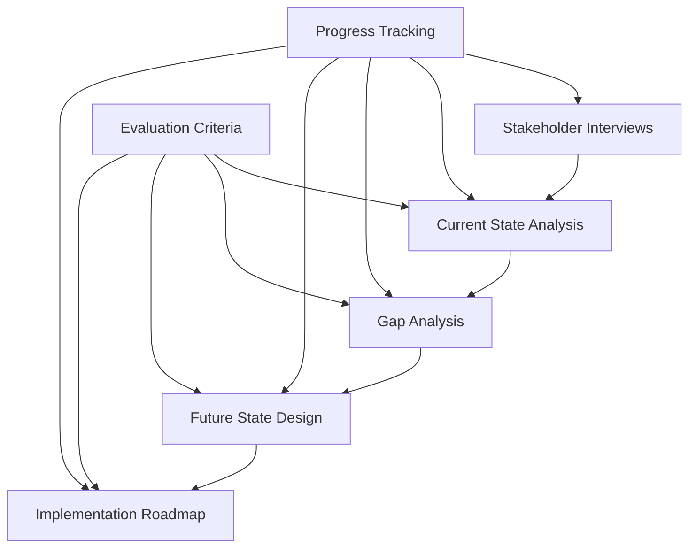

# Architecture Assessment Templates

This directory contains comprehensive templates for conducting thorough architecture assessments. These templates are designed to ensure consistency, completeness, and professional quality across all assessment activities.

## Template Structure

### 📋 [Current State Analysis](./current-state/current-state-analysis-template.md)
**Purpose**: Comprehensive assessment of the existing architecture across all domains
**Use When**: Beginning the assessment process to document the as-is state
**Key Features**:
- Business capability assessment
- Application portfolio analysis
- Data architecture evaluation
- Technology infrastructure review
- Security and compliance assessment
- Performance and cost analysis

### 🔍 [Gap Analysis](./gap-analysis/gap-analysis-template.md)
**Purpose**: Systematic identification and analysis of gaps between current and desired states
**Use When**: After current state analysis to identify improvement areas
**Key Features**:
- Multi-dimensional gap analysis framework
- Priority matrix for gap remediation
- Resource and cost impact assessment
- Risk-based gap categorization

### 🎯 [Future State Design](./future-state/future-state-design-template.md)
**Purpose**: Design the target architecture that addresses identified gaps
**Use When**: After gap analysis to define the to-be architecture
**Key Features**:
- Strategic alignment with business drivers
- Comprehensive architecture design across all domains
- Implementation roadmap integration
- Governance and standards definition

### 🛤️ [Implementation Roadmap](./implementation/implementation-roadmap-template.md)
**Purpose**: Detailed planning for architecture transformation execution
**Use When**: After future state design to plan the transformation journey
**Key Features**:
- Phased implementation approach
- Resource planning and budgeting
- Risk management and mitigation
- Success metrics and governance

### ✅ [Evaluation Criteria](./evaluation/evaluation-criteria-checklist.md)
**Purpose**: Standardized evaluation criteria for architecture solutions
**Use When**: Throughout assessment to maintain consistent evaluation standards
**Key Features**:
- Comprehensive scoring framework
- Multi-dimensional evaluation criteria
- Quantitative and qualitative assessments
- Decision-making support

### 🎤 [Stakeholder Interviews](./stakeholder/stakeholder-interview-template.md)
**Purpose**: Structured approach to stakeholder engagement and requirements gathering
**Use When**: Throughout assessment for stakeholder input and validation
**Key Features**:
- Role-specific interview guides
- Comprehensive question sets
- Structured analysis framework
- Requirement traceability

### 📊 [Progress Tracking](./tracking/progress-tracking-dashboard.md)
**Purpose**: Real-time tracking and reporting of assessment progress
**Use When**: Throughout the entire assessment lifecycle
**Key Features**:
- Multi-level progress tracking
- Resource and budget monitoring
- Risk and issue management
- Stakeholder communication dashboard

## Template Usage Guidelines

### Getting Started
1. **Assessment Planning**: Begin with the Progress Tracking template to establish project structure
2. **Stakeholder Engagement**: Use the Stakeholder Interview template for requirements gathering
3. **Current State**: Apply the Current State Analysis template for baseline documentation
4. **Gap Identification**: Utilize the Gap Analysis template to identify improvement areas
5. **Future State**: Employ the Future State Design template for target architecture
6. **Implementation**: Use the Implementation Roadmap for transformation planning

### Template Customization
Each template is designed to be:
- **Adaptable**: Customize sections based on assessment scope and complexity
- **Scalable**: Use relevant sections for small assessments, complete templates for comprehensive reviews
- **Flexible**: Modify evaluation criteria and questions based on industry and organizational context

### Quality Assurance
- **Completeness**: Ensure all template sections are addressed or explicitly noted as not applicable
- **Consistency**: Use standardized terminology and evaluation criteria across templates
- **Traceability**: Maintain clear relationships between requirements, gaps, solutions, and implementations

## Template Integration

### Cross-Template Relationships

### Information Flow
1. **Stakeholder insights** inform current state analysis
2. **Current state findings** drive gap identification
3. **Gap analysis results** shape future state design
4. **Future state vision** guides implementation planning
5. **Evaluation criteria** ensure quality throughout
6. **Progress tracking** monitors execution across all phases

## Best Practices

### Template Usage
- **Start with the end in mind**: Review all templates before beginning to understand the complete process
- **Maintain version control**: Track template modifications and assessment iterations
- **Document assumptions**: Clearly note assumptions and constraints in each template
- **Regular reviews**: Conduct periodic reviews with stakeholders to validate findings

### Stakeholder Engagement
- **Early and often**: Engage stakeholders throughout the process, not just during interviews
- **Multi-perspective**: Gather input from diverse stakeholder groups for comprehensive understanding
- **Validation loops**: Regularly validate findings with stakeholders to ensure accuracy

### Quality Management
- **Peer reviews**: Have multiple team members review template completions
- **Expert validation**: Engage subject matter experts for specialized areas
- **Executive alignment**: Ensure executive stakeholders validate strategic elements

## Template Maintenance

### Regular Updates
- **Industry best practices**: Incorporate evolving industry standards and practices
- **Lessons learned**: Update templates based on assessment experience and feedback
- **Technology evolution**: Adapt templates for new technologies and approaches

### Version Control
- **Template versioning**: Maintain clear version history for template updates
- **Assessment tracking**: Document which template versions were used for each assessment
- **Change documentation**: Clearly document template modifications and rationale

## Success Metrics

### Assessment Quality
- **Stakeholder satisfaction**: High satisfaction scores from assessment participants
- **Recommendation acceptance**: High rate of recommendation approval and implementation
- **Time to value**: Reduced time from assessment completion to value realization

### Template Effectiveness
- **Completion time**: Efficient template completion without quality compromise
- **Finding quality**: Comprehensive and accurate assessment findings
- **Implementation success**: High success rate of recommended implementations

## Support and Training

### Template Training
- **New team members**: Comprehensive template training for assessment team members
- **Stakeholder briefing**: Brief stakeholders on template usage and expectations
- **Continuous learning**: Regular training updates based on template evolution

### Support Resources
- **Template guides**: Detailed guidance documents for complex template sections
- **Example completions**: Sample completed templates for reference
- **Expert consultation**: Access to domain experts for specialized areas

---

## Quick Reference

| Template | Primary Use | Key Output | Dependencies |
|----------|-------------|------------|--------------|
| **Current State** | Document as-is architecture | Baseline assessment | Stakeholder interviews |
| **Gap Analysis** | Identify improvement areas | Prioritized gap list | Current state analysis |
| **Future State** | Design target architecture | Target architecture | Gap analysis |
| **Implementation** | Plan transformation | Roadmap and budget | Future state design |
| **Evaluation** | Assess solutions | Scoring and recommendations | All phases |
| **Stakeholder** | Gather requirements | Requirements and constraints | Assessment planning |
| **Progress** | Track execution | Status and metrics | Throughout process |

---

**Template Set Version**: 1.0  
**Last Updated**: [Date]  
**Maintained By**: Architecture Assessment Team  
**Review Frequency**: Quarterly