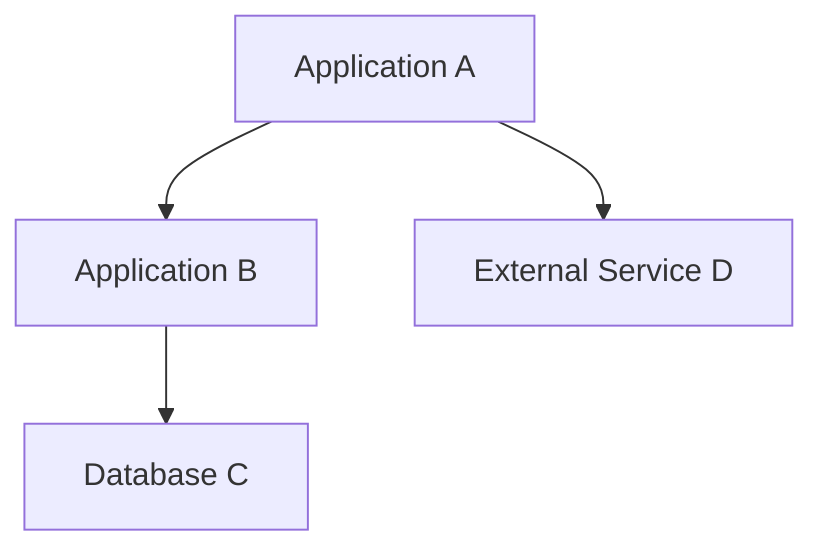

# Current State Architecture Analysis Template

## Executive Summary
- **Assessment Date**: [Date]
- **Assessed By**: [Name/Team]
- **System/Domain**: [System Name]
- **Business Context**: [Brief description of business purpose]

## Business Architecture Assessment

### Business Capabilities
- [ ] Core business processes identified
- [ ] Value streams mapped
- [ ] Key business metrics defined
- [ ] Stakeholder roles documented

#### Current Business Capabilities Matrix
| Capability | Maturity Level | Business Impact | Technology Enablement |
|------------|----------------|-----------------|----------------------|
| [Capability 1] | [1-5] | [High/Medium/Low] | [Description] |
| [Capability 2] | [1-5] | [High/Medium/Low] | [Description] |

### Business Process Analysis
#### Process Inventory
- **Process Name**: [Name]
  - **Owner**: [Business Owner]
  - **Stakeholders**: [List]
  - **Inputs**: [Data/Resources]
  - **Outputs**: [Products/Services]
  - **SLA/Performance**: [Metrics]
  - **Pain Points**: [Issues]

## Application Architecture Assessment

### Application Portfolio
#### Application Inventory
| Application | Business Function | Technology Stack | Age | Condition | Business Criticality |
|-------------|------------------|------------------|-----|-----------|---------------------|
| [App 1] | [Function] | [Tech] | [Years] | [Good/Fair/Poor] | [Critical/Important/Supportive] |
| [App 2] | [Function] | [Tech] | [Years] | [Good/Fair/Poor] | [Critical/Important/Supportive] |

### Application Dependencies

### Integration Patterns
- [ ] Point-to-point integrations documented
- [ ] API-first integrations identified
- [ ] Event-driven patterns catalogued
- [ ] Batch processing flows mapped

## Data Architecture Assessment

### Data Assets Inventory
| Data Asset | Type | Owner | Source Systems | Quality Score | Governance Level |
|------------|------|-------|----------------|---------------|-----------------|
| [Dataset 1] | [Master/Reference/Transactional] | [Owner] | [Systems] | [1-5] | [Level] |

### Data Flow Analysis
#### Critical Data Flows
- **Flow Name**: [Name]
  - **Source**: [System/Process]
  - **Target**: [System/Process]
  - **Frequency**: [Real-time/Batch/On-demand]
  - **Volume**: [Records/Size]
  - **Quality Issues**: [Description]

### Data Governance Assessment
- [ ] Data ownership defined
- [ ] Data quality standards exist
- [ ] Privacy/compliance controls in place
- [ ] Data lineage tracked

## Technology Architecture Assessment

### Infrastructure Landscape
#### Compute Resources
- [ ] On-premise servers catalogued
- [ ] Cloud resources inventoried
- [ ] Virtualization assessed
- [ ] Container platforms evaluated

#### Network Architecture
- [ ] Network topology documented
- [ ] Security zones identified
- [ ] Bandwidth utilization assessed
- [ ] Latency measurements recorded

### Technology Stack Analysis
| Layer | Current Technology | Version | Support Status | Risk Level |
|-------|-------------------|---------|----------------|------------|
| Presentation | [Technology] | [Version] | [Supported/EOL] | [High/Medium/Low] |
| Application | [Technology] | [Version] | [Supported/EOL] | [High/Medium/Low] |
| Data | [Technology] | [Version] | [Supported/EOL] | [High/Medium/Low] |
| Infrastructure | [Technology] | [Version] | [Supported/EOL] | [High/Medium/Low] |

## Security Architecture Assessment

### Security Controls Inventory
- [ ] Authentication mechanisms catalogued
- [ ] Authorization models documented
- [ ] Encryption standards assessed
- [ ] Network security evaluated

### Compliance Assessment
| Requirement | Status | Controls | Gaps |
|-------------|--------|----------|------|
| [GDPR/SOX/HIPAA] | [Compliant/Partial/Non-compliant] | [Controls] | [Gaps] |

## Performance Assessment

### Performance Metrics
| System/Component | Metric | Current Value | Target Value | Gap |
|------------------|--------|---------------|--------------|-----|
| [System 1] | [Response Time] | [Value] | [Target] | [Gap] |
| [System 2] | [Throughput] | [Value] | [Target] | [Gap] |

### Scalability Analysis
- [ ] Current capacity limits identified
- [ ] Growth projections documented
- [ ] Bottlenecks catalogued
- [ ] Scaling patterns assessed

## Cost Analysis

### Technology Costs
| Category | Current Annual Cost | Cost Driver | Optimization Potential |
|----------|-------------------|-------------|----------------------|
| Infrastructure | $[Amount] | [Driver] | $[Savings] |
| Licenses | $[Amount] | [Driver] | $[Savings] |
| Maintenance | $[Amount] | [Driver] | $[Savings] |

### Operational Costs
- **Staff Costs**: $[Amount] ([FTE count])
- **Training Costs**: $[Amount]
- **External Services**: $[Amount]

## Risk Assessment

### Technical Risks
| Risk | Impact | Probability | Mitigation Strategy |
|------|--------|-------------|-------------------|
| [Risk 1] | [High/Medium/Low] | [High/Medium/Low] | [Strategy] |

### Business Risks
| Risk | Business Impact | Likelihood | Current Controls |
|------|-----------------|------------|------------------|
| [Risk 1] | [Description] | [High/Medium/Low] | [Controls] |

## Quality Assessment

### Code Quality
- [ ] Code review processes assessed
- [ ] Testing coverage evaluated
- [ ] Documentation quality reviewed
- [ ] Development standards compliance

### Operational Quality
- [ ] Monitoring capabilities assessed
- [ ] Alerting mechanisms reviewed
- [ ] Incident response procedures evaluated
- [ ] Change management processes reviewed

## Assessment Summary

### Strengths
1. [Strength 1]
2. [Strength 2]
3. [Strength 3]

### Weaknesses
1. [Weakness 1]
2. [Weakness 2]
3. [Weakness 3]

### Critical Issues
1. **Issue**: [Description]
   - **Impact**: [Business impact]
   - **Urgency**: [High/Medium/Low]
   - **Recommended Action**: [Action]

### Overall Architecture Maturity Score
- **Business Architecture**: [1-5]
- **Application Architecture**: [1-5]
- **Data Architecture**: [1-5]
- **Technology Architecture**: [1-5]
- **Security Architecture**: [1-5]
- **Overall Score**: [1-5]

## Recommendations
1. **Priority 1**: [Recommendation]
   - **Rationale**: [Why]
   - **Expected Benefit**: [Benefit]
   - **Effort**: [High/Medium/Low]

2. **Priority 2**: [Recommendation]
   - **Rationale**: [Why]
   - **Expected Benefit**: [Benefit]
   - **Effort**: [High/Medium/Low]

## Next Steps
1. [ ] [Action item 1]
2. [ ] [Action item 2]
3. [ ] [Action item 3]

---
**Assessment Completed By**: [Name]  
**Date**: [Date]  
**Review Date**: [Date]