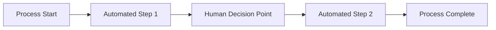
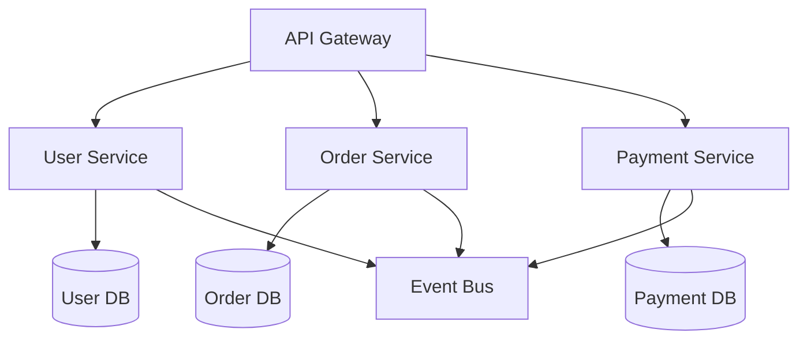
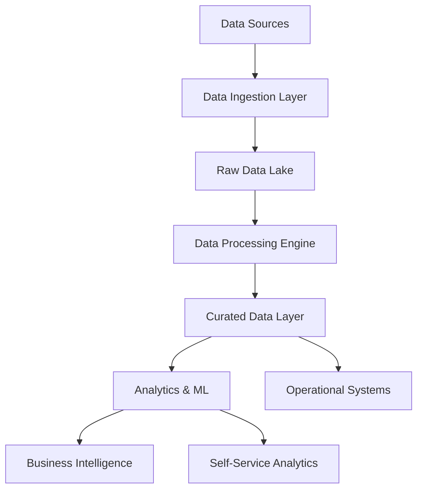
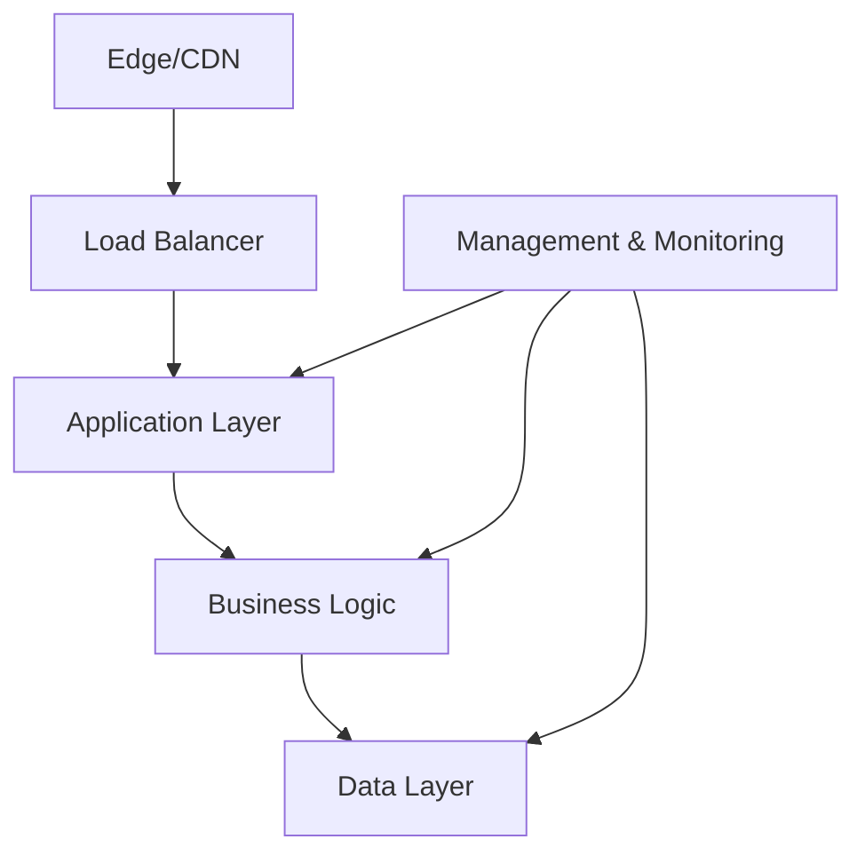
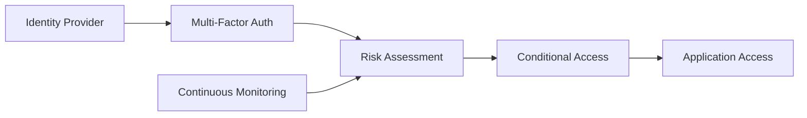

# Future State Architecture Design Template

## Executive Summary
- **Design Date**: [Date]
- **Architect(s)**: [Names]
- **Scope**: [Business Unit/System/Enterprise]
- **Vision Statement**: [2-3 sentence vision for the future state]
- **Target Timeline**: [Timeframe for full realization]

## Strategic Context

### Business Drivers
1. **Primary Driver**: [Description]
   - **Business Rationale**: [Why this matters]
   - **Success Criteria**: [How success is measured]

2. **Secondary Drivers**: 
   - [Driver 1]: [Description]
   - [Driver 2]: [Description]

### Success Metrics
| Metric Category | Current State | Future State Target | Business Value |
|----------------|---------------|-------------------|---------------|
| [Performance] | [Current] | [Target] | [Value] |
| [Cost] | [Current] | [Target] | [Value] |
| [Quality] | [Current] | [Target] | [Value] |

## Business Architecture Future State

### Target Business Capabilities
#### Capability Maturity Targets
| Capability | Current Maturity | Target Maturity | Key Improvements | Timeline |
|------------|------------------|-----------------|------------------|----------|
| [Capability 1] | [Level 1-5] | [Level 1-5] | [Improvements] | [Timeline] |
| [Capability 2] | [Level 1-5] | [Level 1-5] | [Improvements] | [Timeline] |

### Future Business Process Design
#### Optimized Process: [Process Name]
- **Process Owner**: [Role]
- **Key Stakeholders**: [List]
- **Process Flow**: [High-level steps]
- **Automation Level**: [Percentage automated]
- **Performance Targets**:
  - **Cycle Time**: [Target]
  - **Quality**: [Error rate target]
  - **Cost**: [Cost per transaction]

### Operating Model Design
- **Operating Philosophy**: [Centralized/Decentralized/Hybrid]
- **Governance Model**: [Structure and decision rights]
- **Organizational Changes**: [Required changes]
- **Role Definitions**: [New or modified roles]

## Application Architecture Future State

### Target Application Portfolio
#### Application Portfolio Principles
1. **Cloud-First**: [Principle description]
2. **API-First**: [Integration approach]
3. **Microservices**: [Decomposition strategy]
4. **Data-Driven**: [Analytics integration]

#### Future Application Landscape
| Application Type | Technology Stack | Purpose | Integration Pattern |
|------------------|------------------|---------|-------------------|
| [Customer Portal] | [React/Node.js/Cloud] | [Customer self-service] | [API Gateway] |
| [Core Services] | [Microservices/Containers] | [Business logic] | [Event-driven] |
| [Analytics Platform] | [Cloud Analytics] | [Insights/ML] | [Streaming/Batch] |

### Application Architecture Patterns
#### Microservices Architecture

#### Integration Architecture
- **Integration Pattern**: [Event-driven/API-first/Hybrid]
- **Message Broker**: [Technology choice]
- **API Management**: [Platform and governance]
- **Data Synchronization**: [Real-time/Near real-time/Batch]

### Technology Modernization Plan
| Current Technology | Target Technology | Migration Strategy | Timeline |
|-------------------|-------------------|------------------|----------|
| [Legacy App] | [Modern Stack] | [Lift-shift/Rewrite/Hybrid] | [Timeline] |

## Data Architecture Future State

### Target Data Strategy
#### Data Architecture Principles
1. **Single Source of Truth**: [Data governance approach]
2. **Real-Time Analytics**: [Streaming data strategy]
3. **Self-Service Analytics**: [Democratization approach]
4. **Data Privacy by Design**: [Privacy/compliance integration]

### Future Data Landscape
#### Data Platform Architecture

#### Data Zones
| Zone | Purpose | Technology | Data Types | Access Pattern |
|------|---------|------------|------------|----------------|
| [Raw Zone] | [Ingestion] | [Tech] | [Types] | [Access] |
| [Curated Zone] | [Processed] | [Tech] | [Types] | [Access] |
| [Analytics Zone] | [Insights] | [Tech] | [Types] | [Access] |

### Data Governance Future State
#### Data Governance Framework
- **Data Ownership Model**: [Business data owners]
- **Data Quality Standards**: [Automated quality checks]
- **Privacy Controls**: [Automated compliance]
- **Data Lineage**: [Full traceability]

#### Master Data Management
| Master Data Entity | Authoritative Source | Distribution Method | Quality Standards |
|-------------------|-------------------|-------------------|------------------|
| [Customer] | [CRM System] | [Real-time API] | [Quality rules] |

## Technology Architecture Future State

### Cloud Strategy
#### Cloud Operating Model
- **Cloud Strategy**: [Multi-cloud/Single cloud/Hybrid]
- **Migration Approach**: [Lift-shift/Cloud-native/Hybrid]
- **Cloud Services Strategy**: [PaaS-first/IaaS/SaaS mix]

#### Target Cloud Architecture

### Infrastructure Future State
#### Compute Strategy
- **Container Strategy**: [Kubernetes/Serverless/VMs]
- **Scaling Approach**: [Auto-scaling policies]
- **Resource Optimization**: [Cost optimization strategy]

#### Network Architecture
- **Network Segmentation**: [Zero-trust approach]
- **Bandwidth Planning**: [Capacity targets]
- **Latency Requirements**: [Performance targets]

### Platform Strategy
#### Development Platform
- **CI/CD Platform**: [Technology and process]
- **Development Environment**: [Cloud IDEs/Local/Hybrid]
- **Testing Strategy**: [Automated testing approach]
- **Deployment Strategy**: [Blue-green/Canary/Rolling]

#### Operational Platform
- **Monitoring & Observability**: [Platform and approach]
- **Logging Strategy**: [Centralized logging]
- **Security Monitoring**: [SIEM/SOAR integration]
- **Performance Management**: [APM strategy]

## Security Architecture Future State

### Zero Trust Security Model
#### Security Architecture Principles
1. **Never Trust, Always Verify**: [Implementation approach]
2. **Least Privilege Access**: [Access control strategy]
3. **Assume Breach**: [Detection and response]
4. **Data-Centric Security**: [Protect data anywhere]

### Future Security Controls
#### Identity & Access Management

#### Security Control Framework
| Security Domain | Current State | Future State | Implementation |
|-----------------|---------------|--------------|----------------|
| [Identity] | [Basic AD] | [Cloud IAM + MFA] | [Migration plan] |
| [Data Protection] | [Basic encryption] | [End-to-end encryption] | [Implementation] |

### Compliance Future State
#### Compliance Automation
- **Compliance as Code**: [Policy automation]
- **Continuous Compliance**: [Real-time monitoring]
- **Audit Automation**: [Automated evidence collection]

## Performance and Scalability Design

### Performance Targets
#### System Performance Requirements
| System/Component | Metric | Current | Target | Design Strategy |
|------------------|--------|---------|---------|----------------|
| [Web App] | [Response Time] | [Current] | [Target] | [Strategy] |
| [API] | [Throughput] | [Current] | [Target] | [Strategy] |

### Scalability Architecture
#### Auto-Scaling Strategy
- **Horizontal Scaling**: [Approach and triggers]
- **Vertical Scaling**: [When and how]
- **Database Scaling**: [Read replicas/Sharding]
- **CDN Strategy**: [Global distribution]

## Implementation Roadmap

### Phase 1: Foundation (Months 1-6)
#### Objectives
- [ ] Establish cloud foundation
- [ ] Implement core security controls
- [ ] Begin data platform development

#### Key Deliverables
| Deliverable | Timeline | Owner | Success Criteria |
|-------------|----------|-------|------------------|
| [Cloud Landing Zone] | [Month 3] | [Team] | [Criteria] |
| [Identity Platform] | [Month 4] | [Team] | [Criteria] |

### Phase 2: Core Capabilities (Months 7-12)
#### Objectives
- [ ] Deploy core application services
- [ ] Implement data integration
- [ ] Establish monitoring/observability

#### Migration Priorities
| Application/System | Migration Approach | Timeline | Dependencies |
|-------------------|------------------|----------|--------------|
| [Critical App 1] | [Strategy] | [Timeline] | [Dependencies] |

### Phase 3: Advanced Features (Months 13-18)
#### Objectives
- [ ] Advanced analytics capabilities
- [ ] AI/ML platform deployment
- [ ] Full automation implementation

### Phase 4: Optimization (Months 19-24)
#### Objectives
- [ ] Performance optimization
- [ ] Cost optimization
- [ ] Continuous improvement

## Architecture Governance

### Decision Framework
#### Architecture Decision Records (ADR)
- **Decision 1**: [Technology choice and rationale]
- **Decision 2**: [Architecture pattern and rationale]

### Design Reviews
- **Review Process**: [Stage gates and criteria]
- **Review Board**: [Composition and authority]
- **Exception Process**: [How to handle deviations]

### Standards and Guidelines
#### Development Standards
- **Coding Standards**: [Languages and frameworks]
- **API Standards**: [RESTful/GraphQL guidelines]
- **Security Standards**: [Security requirements]
- **Quality Gates**: [Testing and quality requirements]

## Risk Management

### Architecture Risks
| Risk | Impact | Probability | Mitigation Strategy | Owner |
|------|--------|-------------|-------------------|-------|
| [Technology Risk] | [High/Med/Low] | [High/Med/Low] | [Strategy] | [Owner] |

### Technology Risks
- **Vendor Lock-in**: [Mitigation strategy]
- **Skills Gap**: [Training and hiring plan]
- **Integration Complexity**: [Simplification approach]

## Success Measures

### Architecture KPIs
| KPI | Baseline | Target | Measurement Method | Frequency |
|-----|----------|--------|-------------------|-----------|
| [System Availability] | [Current] | [99.9%] | [Monitoring] | [Monthly] |
| [Development Velocity] | [Current] | [Target] | [Metrics] | [Sprint] |

### Business Value Realization
#### Value Tracking
- **Cost Savings**: [Annual target and tracking]
- **Revenue Growth**: [Architecture-enabled revenue]
- **Efficiency Gains**: [Process improvements]
- **Innovation Metrics**: [New capability delivery]

## Sustainability and Evolution

### Future Evolution Path
#### Technology Evolution
- **Emerging Technologies**: [AI/ML, Edge, IoT integration]
- **Architecture Evolution**: [Continuous modernization]
- **Innovation Pipeline**: [Future capability planning]

### Sustainability Measures
- **Green Computing**: [Energy efficiency targets]
- **Resource Optimization**: [Cost and resource management]
- **Technical Debt Management**: [Debt reduction strategy]

## Stakeholder Impact

### Impact Assessment
| Stakeholder Group | Current Experience | Future Experience | Change Impact |
|-------------------|-------------------|-------------------|---------------|
| [End Users] | [Description] | [Improved experience] | [Training needs] |
| [IT Operations] | [Description] | [Modernized tools] | [Skill development] |

### Change Management
- **Communication Plan**: [Stakeholder engagement]
- **Training Plan**: [Skill development strategy]
- **Support Plan**: [Go-live support strategy]

## Appendices

### Architecture Artifacts
- [ ] Detailed technical diagrams
- [ ] API specifications
- [ ] Data models
- [ ] Security models
- [ ] Infrastructure specifications

### Reference Architecture
- [ ] Industry best practices
- [ ] Vendor recommendations
- [ ] Standards compliance

---
**Design Completed By**: [Architect Name]  
**Date**: [Date]  
**Approved By**: [Stakeholder]  
**Review Date**: [Date]